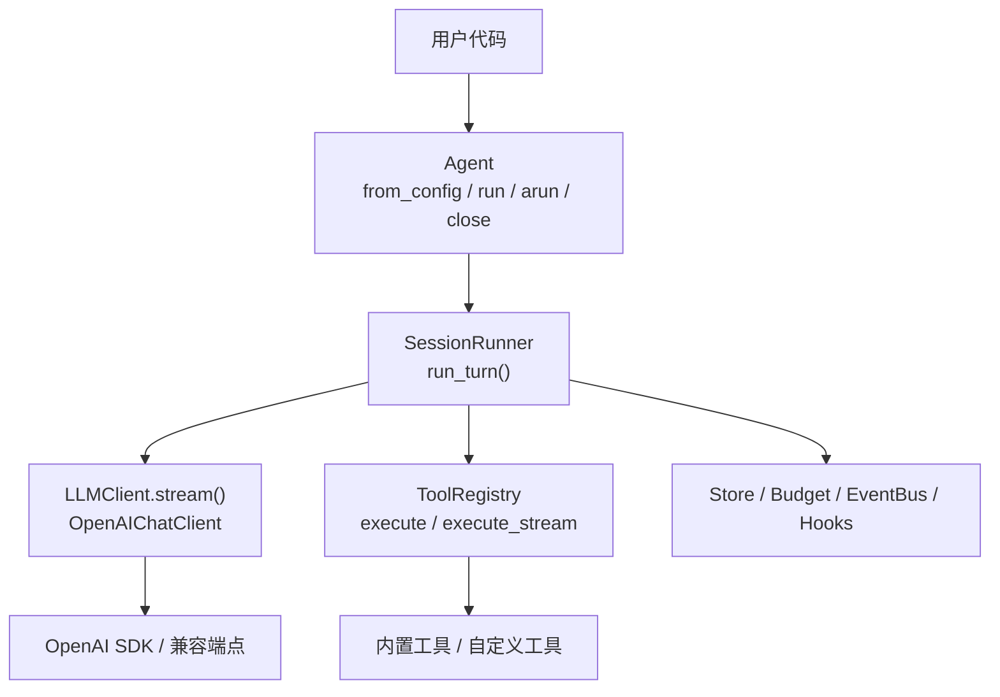
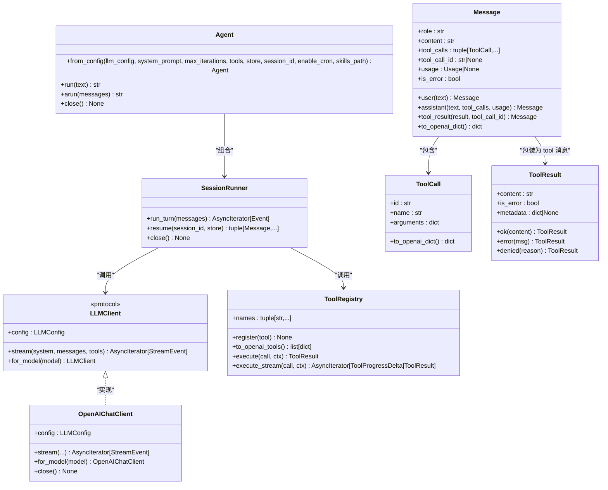
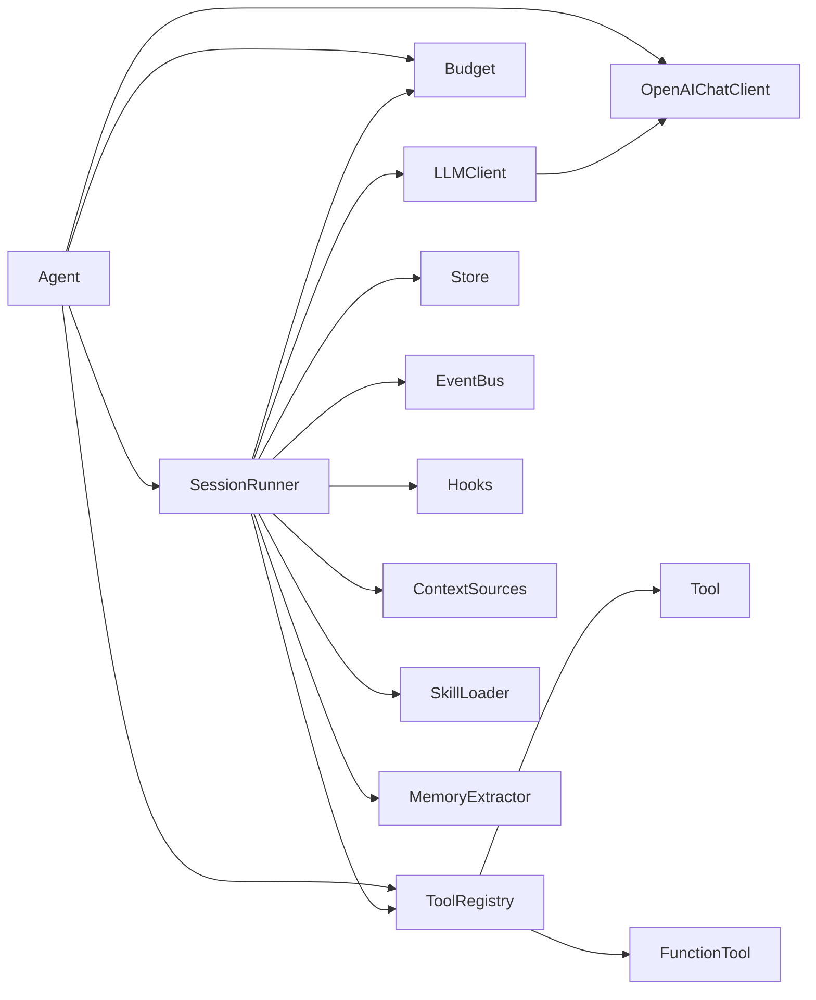

# API参考

<cite>
**本文引用的文件**   
- [agent.py](file://src/microagent/agent.py)
- [config.py](file://src/microagent/config.py)
- [types.py](file://src/microagent/core/types.py)
- [client.py](file://src/microagent/llm/client.py)
- [tool.py](file://src/microagent/core/tool.py)
- [runner.py](file://src/microagent/session/runner.py)
- [__init__.py](file://src/microagent/__init__.py)
- [README.md](file://README.md)
- [API.md](file://API.md)
</cite>

## 目录
1. [简介](#简介)
2. [项目结构](#项目结构)
3. [核心组件](#核心组件)
4. [架构总览](#架构总览)
5. [详细组件分析](#详细组件分析)
6. [依赖关系分析](#依赖关系分析)
7. [性能与异步最佳实践](#性能与异步最佳实践)
8. [故障排查指南](#故障排查指南)
9. [结论](#结论)
10. [附录：完整使用示例与场景](#附录完整使用示例与场景)

## 简介
MicroAgent 是一个可嵌入的通用 AI Agent 核心库，提供统一的 Agent 门面、消息模型、工具注册与执行、会话循环、预算控制、流式响应等能力。其公共 API 以 Agent、Message、ToolCall、ToolResult、LLMConfig 为核心，配合 SessionRunner 实现“调用 LLM → 工具执行 → 再次调用”的自改进对话循环，并支持流式输出、权限控制、扩展点（Hook）、持久化存储等特性。

## 项目结构
- 入口门面：Agent（同步/异步接口）
- 配置系统：Config（多源优先级解析）
- 核心类型：Message、ToolCall、ToolResult、事件类型
- LLM 抽象：LLMClient、OpenAIChatClient、LLMConfig
- 工具系统：Tool 协议、FunctionTool、ToolRegistry、@tool 装饰器
- 会话循环：SessionRunner（核心循环、压缩、预算、事件）
- 包导出：__all__ 暴露所有公共符号

图表来源 
- [agent.py:23-113](file://src/microagent/agent.py#L23-L113)
- [runner.py:40-117](file://src/microagent/session/runner.py#L40-L117)
- [client.py:93-118](file://src/microagent/llm/client.py#L93-L118)
- [tool.py:221-280](file://src/microagent/core/tool.py#L221-L280)

章节来源
- [README.md:1-120](file://README.md#L1-L120)
- [API.md:1-120](file://API.md#L1-L120)

## 核心组件
- Agent：统一入口，封装配置、工具、会话、定时任务等内部组件，提供 run/arun/close 方法
- Message：统一消息格式（user/assistant/tool），包含 Usage、ToolCall 等
- ToolCall / ToolResult：工具调用与结果的标准数据结构
- LLMConfig：LLM 客户端配置（base_url、api_key、model、reasoning_effort、service_tier）
- SessionRunner：核心对话循环，处理 LLM 流式响应、工具调用、预算、压缩、事件
- ToolRegistry：工具注册与执行（含流式支持）
- Config：从文件、环境变量、CLI 参数解析最终配置

章节来源
- [agent.py:23-113](file://src/microagent/agent.py#L23-L113)
- [types.py:17-116](file://src/microagent/core/types.py#L17-L116)
- [client.py:93-118](file://src/microagent/llm/client.py#L93-L118)
- [runner.py:40-117](file://src/microagent/session/runner.py#L40-L117)
- [tool.py:221-280](file://src/microagent/core/tool.py#L221-L280)
- [config.py:20-71](file://src/microagent/config.py#L20-L71)

## 架构总览
Agent 作为门面，内部组装 SessionRunner、ToolRegistry、Budget、LLMClient 等组件。SessionRunner 驱动“LLM 流式响应 → 工具调用 → 结果回写 → 下一轮”的主循环，同时支持压缩、预算、事件总线、上下文注入、记忆提取等扩展点。

图表来源 
- [agent.py:23-113](file://src/microagent/agent.py#L23-L113)
- [runner.py:40-117](file://src/microagent/session/runner.py#L40-L117)
- [client.py:141-156](file://src/microagent/llm/client.py#L141-L156)
- [tool.py:221-280](file://src/microagent/core/tool.py#L221-L280)
- [types.py:17-116](file://src/microagent/core/types.py#L17-L116)

## 详细组件分析

### Agent 类
- from_config(llm_config, *, system_prompt="You are a helpful assistant.", max_iterations=25, tools=None, store=None, session_id="default", enable_cron=False, skills_path=None) -> Agent
  - 作用：根据 LLMConfig 构建内部组件（ToolRegistry、SkillLoader、Budget、SessionRunner、可选 CronScheduler），返回 Agent 实例
  - 参数说明：
    - llm_config：LLMConfig 实例
    - system_prompt：系统提示词
    - max_iterations：最大迭代次数（预算树根节点）
    - tools：额外工具列表（与默认内置工具合并）
    - store：会话存储（SQLiteStore/InMemoryStore）
    - session_id：会话标识
    - enable_cron：是否启用定时任务调度
    - skills_path：技能加载路径（冒号分隔）
  - 返回值：Agent 实例
  - 异常：无显式抛出；内部依赖可能抛出底层异常（如 YAML 解析失败时忽略）
  - 使用示例：见“附录：完整使用示例与场景”

- run(text: str | list[Message]) -> str
  - 作用：同步入口，自动将字符串包装为用户消息，内部通过 asyncio.run 调用 arun
  - 参数：text 可为字符串或 Message 列表
  - 返回值：最终文本响应
  - 异常：底层异常会向上抛出；finally 中会调用 close()

- arun(messages: list[Message]) -> str
  - 作用：异步入口，运行一轮对话，返回最终文本
  - 参数：messages 为 Message 列表
  - 返回值：最终文本响应；若 TurnFailed，返回 "[error: ...]" 形式
  - 异常：由内部事件决定；TurnComplete 正常返回；TurnFailed 转为错误文本
  - 注意：调用者需负责在适当时机调用 await agent.close()

- close() -> None
  - 作用：释放资源（cron、runner、LLM client）
  - 异常：无显式抛出

章节来源
- [agent.py:31-77](file://src/microagent/agent.py#L31-L77)
- [agent.py:79-113](file://src/microagent/agent.py#L79-L113)

### Message 类
- 构造字段：
  - role: str（user/assistant/tool）
  - content: str
  - tool_calls: tuple[ToolCall, ...]（默认空元组）
  - tool_call_id: str | None（role=tool 时必须设置）
  - usage: Usage | None
  - is_error: bool
- 工厂方法：
  - user(text: str) -> Message
  - assistant(text: str, *, tool_calls: tuple[ToolCall, ...]=(), usage: Usage|None=None) -> Message
  - tool_result(result: ToolResult, *, tool_call_id: str) -> Message
- to_openai_dict() -> dict[str, Any]
  - 作用：转换为 OpenAI SDK 期望的消息字典格式

章节来源
- [types.py:26-69](file://src/microagent/core/types.py#L26-L69)

### ToolCall 与 ToolResult 数据结构
- ToolCall
  - id: str
  - name: str
  - arguments: dict[str, Any]
  - to_openai_dict() -> dict[str, Any]
- ToolResult
  - content: str
  - is_error: bool
  - metadata: dict[str, Any] | None
  - ok(content: str) -> ToolResult
  - error(msg: str) -> ToolResult
  - denied(reason: str) -> ToolResult

章节来源
- [types.py:76-116](file://src/microagent/core/types.py#L76-L116)

### LLMConfig 配置选项
- base_url: str（OpenAI 兼容端点）
- api_key: str（认证密钥）
- model: str（模型标识）
- reasoning_effort: str | None（o系列模型推理强度）
- service_tier: str | None（服务层级）
- default() -> LLMConfig（返回默认配置）

章节来源
- [client.py:93-118](file://src/microagent/llm/client.py#L93-L118)

### SessionRunner 核心循环
- run_turn(messages: list[Message]) -> AsyncIterator[Event]
  - 作用：主循环，依次调用 LLM 流式响应、累积文本与工具调用、执行工具、追加历史、更新预算、压缩上下文、触发事件
  - 事件类型：TextDelta、ToolCallDelta、Usage、StreamDone、ToolResultDelta、ToolProgressDelta、TurnComplete、TurnFailed
  - 行为要点：
    - 预算消耗：每轮消耗一次迭代；超出则返回 TurnFailed
    - 上下文压缩：当消息长度超过阈值时进行压缩
    - 技能匹配：可选 SkillLoader 动态注入相关技能内容到 system prompt
    - 上下文注入：ContextSource 与 PreLLMHook 修改 system prompt
    - 工具执行：并发执行工具调用，支持流式进度（ToolProgressDelta）
    - 历史持久化：可选 Store 写入消息
    - 记忆提取：可选 MemoryExtractor 基于最近消息提取记忆
  - 返回值：异步事件流，最终以 TurnComplete 或 TurnFailed 结束

- resume(session_id: str, store: Store) -> tuple[Message, ...]
  - 作用：从 Store 恢复历史消息

- close() -> None
  - 作用：关闭浏览器页面、内存提取器等资源

章节来源
- [runner.py:118-284](file://src/microagent/session/runner.py#L118-L284)
- [runner.py:285-341](file://src/microagent/session/runner.py#L285-L341)

### Tool 系统与 @tool 装饰器
- Tool 协议：name、description、parameters、execute(call, ctx) -> ToolResult
- FunctionTool：适配 async def 函数为 Tool，支持流式执行（AsyncIterator[str]）
- ToolRegistry：工具注册、查找、导出 OpenAI tools 格式、执行与流式执行
- @tool(name, description="")：装饰器，自动推断参数 schema（基于 Pydantic v2），注册到模块级 _registry

章节来源
- [tool.py:40-118](file://src/microagent/core/tool.py#L40-L118)
- [tool.py:177-214](file://src/microagent/core/tool.py#L177-L214)
- [tool.py:221-280](file://src/microagent/core/tool.py#L221-L280)

### Config 配置解析
- from_file(*, cli_base_url=None, cli_api_key=None, cli_model=None, cli_system_prompt=None, cli_skills_path=None) -> Config
  - 优先级：CLI > 环境变量 > 配置文件 > 默认值
  - 配置文件位置：~/.microagent/config.yaml
  - 环境变量：MICROAGENT_BASE_URL、MICROAGENT_API_KEY、MICROAGENT_MODEL、MICROAGENT_SYSTEM_PROMPT、MICROAGENT_SKILLS_PATH
  - 返回值：Config（包含 LLMConfig、system_prompt、skills_path）

章节来源
- [config.py:28-71](file://src/microagent/config.py#L28-L71)
- [config.py:73-101](file://src/microagent/config.py#L73-L101)

## 依赖关系分析
- Agent 依赖 SessionRunner、ToolRegistry、Budget、LLMClient（OpenAIChatClient）、SkillLoader、CronScheduler（可选）
- SessionRunner 依赖 LLMClient、ToolRegistry、Store、Budget、EventBus、Hooks、ContextSources、SkillLoader、MemoryExtractor
- LLMClient 抽象由 OpenAIChatClient 实现，依赖 openai SDK v2
- ToolRegistry 依赖 Tool 协议与 FunctionTool，支持流式执行
- 类型定义集中在 core.types，贯穿整个系统

图表来源 
- [agent.py:23-77](file://src/microagent/agent.py#L23-L77)
- [runner.py:40-117](file://src/microagent/session/runner.py#L40-L117)
- [client.py:141-156](file://src/microagent/llm/client.py#L141-L156)
- [tool.py:221-280](file://src/microagent/core/tool.py#L221-L280)

章节来源
- [__init__.py:1-133](file://src/microagent/__init__.py#L1-L133)

## 性能与异步最佳实践
- 使用 arun 而非 run：避免阻塞事件循环，适合高并发场景
- 流式处理：通过 SessionRunner.run_turn 的事件流实时显示 TextDelta 与 ToolProgressDelta，提升用户体验
- 预算控制：合理设置 max_iterations、max_tokens、max_cost_usd，防止无限循环与费用失控
- 上下文压缩：当消息过长时自动压缩，减少 token 消耗与延迟
- 资源清理：确保调用 await agent.close() 或 runner.close()，释放浏览器页面、LLM 连接等资源
- 工具流式：自定义工具返回 AsyncIterator[str] 可获得实时进度反馈
- 重试机制：OpenAIChatClient 对 401/403/429 等状态码进行凭据轮换与重试

章节来源
- [runner.py:118-284](file://src/microagent/session/runner.py#L118-L284)
- [client.py:193-215](file://src/microagent/llm/client.py#L193-L215)
- [tool.py:81-118](file://src/microagent/core/tool.py#L81-L118)

## 故障排查指南
- TurnFailed：通常由预算耗尽、LLM 响应截断、工具执行异常引起
- 预算耗尽：检查 Budget 配置与消费逻辑，确认未超 max_iterations/max_tokens/max_cost_usd
- LLM 响应截断：增加 context_window 或调整压缩阈值
- 工具执行失败：检查 Tool.execute 异常处理，确认 ToolResult.error/denied 的使用
- 资源未释放：确保调用 close()，避免浏览器页面、LLM 连接泄漏
- 配置问题：检查 CLI/环境变量/配置文件优先级，确认 base_url/api_key/model 正确

章节来源
- [runner.py:129-134](file://src/microagent/session/runner.py#L129-L134)
- [runner.py:205-225](file://src/microagent/session/runner.py#L205-L225)
- [runner.py:283-284](file://src/microagent/session/runner.py#L283-L284)
- [tool.py:256-260](file://src/microagent/core/tool.py#L256-L260)

## 结论
MicroAgent 提供了完整的 Agent 核心能力，包括统一的消息模型、工具系统、会话循环、预算控制、流式响应与扩展点。通过 Agent 门面简化使用，通过 SessionRunner 实现灵活的控制流，通过 ToolRegistry 与 @tool 装饰器快速扩展功能。结合 Config 的多源配置与 LLMConfig 的灵活性，适用于多种 LLM 后端与业务场景。

## 附录：完整使用示例与场景

### 简单对话（字符串输入）
- 步骤：
  - 创建 LLMConfig
  - 使用 Agent.from_config 构建 Agent
  - 调用 agent.run("你的问题") 或 await agent.arun(["你的问题"])
- 参考路径：
  - [agent.py:79-90](file://src/microagent/agent.py#L79-L90)
  - [agent.py:92-103](file://src/microagent/agent.py#L92-L103)

### 结构化消息（Message 列表）
- 步骤：
  - 使用 Message.user、Message.assistant、Message.tool_result 构建消息序列
  - 传入 agent.arun([messages...])
- 参考路径：
  - [types.py:41-69](file://src/microagent/core/types.py#L41-L69)

### 流式响应（TextDelta 与 ToolProgressDelta）
- 步骤：
  - 使用 SessionRunner.run_turn 遍历事件
  - 处理 TextDelta 实时输出文本
  - 处理 ToolProgressDelta 实时显示工具进度
- 参考路径：
  - [runner.py:190-226](file://src/microagent/session/runner.py#L190-L226)
  - [runner.py:264-282](file://src/microagent/session/runner.py#L264-L282)

### 自定义工具（@tool 装饰器）
- 步骤：
  - 使用 @tool 装饰器定义 async 函数
  - 返回 ToolResult.ok/error/denied 或字符串
  - 注册到 ToolRegistry 或通过 Agent.from_config(tools=[...]) 传入
- 参考路径：
  - [tool.py:177-214](file://src/microagent/core/tool.py#L177-L214)
  - [tool.py:75-118](file://src/microagent/core/tool.py#L75-L118)

### 预算控制与异常处理
- 步骤：
  - 使用 Budget.root(max_iterations, max_tokens, max_cost_usd)
  - 捕获 BudgetExceeded 异常
- 参考路径：
  - [runner.py:129-134](file://src/microagent/session/runner.py#L129-L134)

### 配置管理（Config.from_file）
- 步骤：
  - 创建 ~/.microagent/config.yaml
  - 使用 Config.from_file(cli_*=...) 加载配置
- 参考路径：
  - [config.py:28-71](file://src/microagent/config.py#L28-L71)

### 会话持久化（Store）
- 步骤：
  - 使用 SQLiteStore/InMemoryStore
  - 传入 Agent.from_config(store=..., session_id=...)
  - 使用 runner.resume() 恢复历史
- 参考路径：
  - [runner.py:115-116](file://src/microagent/session/runner.py#L115-L116)

### 权限控制（PermissionEngine）
- 步骤：
  - 定义 Rule/ScriptRule
  - 配置 PermissionEngine 与 ask_callback
- 参考路径：
  - [README.md:132-154](file://README.md#L132-L154)

### 子代理（SubagentManager）
- 步骤：
  - 使用 SubagentManager.spawn() 启动子代理
  - 配置 SubagentSpec 限制工具集与预算
- 参考路径：
  - [README.md:159-179](file://README.md#L159-L179)

### 记忆（MemoryProvider）
- 步骤：
  - 使用 SQLiteMemoryProvider
  - batch_write/recall/delete 操作
- 参考路径：
  - [README.md:184-202](file://README.md#L184-L202)

### 技能（SkillLoader）
- 步骤：
  - 使用 ClaudeSkillLoader/CompositeSkillLoader
  - match() 匹配技能并注入 system prompt
- 参考路径：
  - [README.md:207-221](file://README.md#L207-L221)

### MCP 客户端
- 步骤：
  - connect_mcp_stdio() 注册 MCP 工具
- 参考路径：
  - [README.md:314-320](file://README.md#L314-L320)

### 定时任务（CronScheduler）
- 步骤：
  - 创建 CronScheduler，add_job(CronJob(...))
  - start()/stop() 控制生命周期
- 参考路径：
  - [README.md:329-345](file://README.md#L329-L345)