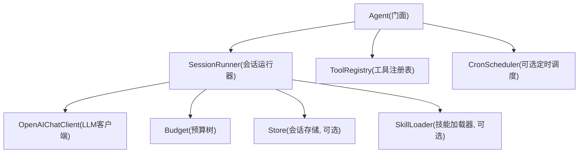
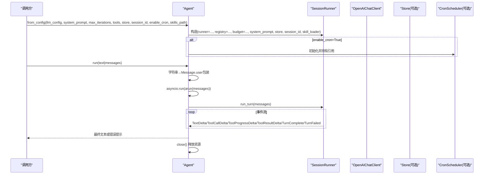
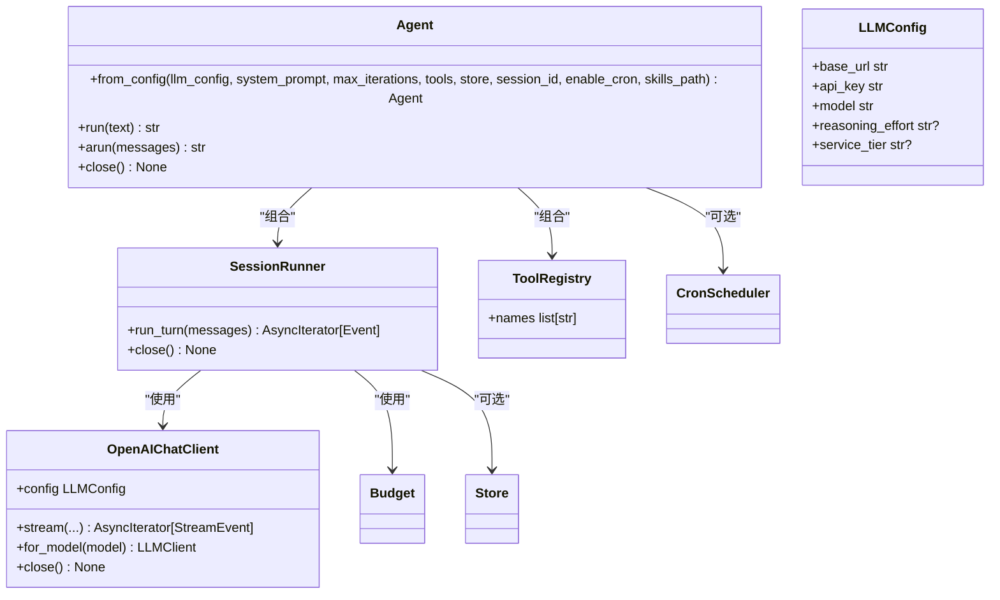

# Agent API

<cite>
**本文引用的文件**   
- [src/microagent/agent.py](file://src/microagent/agent.py)
- [src/microagent/core/types.py](file://src/microagent/core/types.py)
- [src/microagent/llm/client.py](file://src/microagent/llm/client.py)
- [src/microagent/config.py](file://src/microagent/config.py)
- [src/microagent/__init__.py](file://src/microagent/__init__.py)
- [tests/integration/test_real_api.py](file://tests/integration/test_real_api.py)
- [src/microagent/surface/cli.py](file://src/microagent/surface/cli.py)
</cite>

## 目录
1. [简介](#简介)
2. [项目结构](#项目结构)
3. [核心组件](#核心组件)
4. [架构总览](#架构总览)
5. [详细组件分析](#详细组件分析)
6. [依赖关系分析](#依赖关系分析)
7. [性能与资源管理](#性能与资源管理)
8. [故障排查指南](#故障排查指南)
9. [结论](#结论)
10. [附录：完整使用示例](#附录完整使用示例)

## 简介
本文件为 MicroAgent 的 Agent 类提供完整的 API 文档，重点覆盖：
- Agent.from_config() 工厂方法的所有参数（类型、默认值、行为说明、配置选项）
- run() 同步方法与 arun() 异步方法的接口规范（消息格式、返回值、异常处理）
- close() 资源清理方法的使用时机与必要性
- 典型使用场景的代码示例路径（简单对话、多轮对话、自定义工具注册、定时任务启用等）
- 错误处理与最佳实践建议

## 项目结构
MicroAgent 采用“门面 + 内部组件”的组织方式。Agent 作为统一入口，封装了 LLM 客户端、工具注册表、会话运行器、预算控制、技能加载器等内部组件，对外暴露简洁的 run/arun/close 接口。

图表来源
- [src/microagent/agent.py:23-77](file://src/microagent/agent.py#L23-L77)
- [src/microagent/llm/client.py:163-192](file://src/microagent/llm/client.py#L163-L192)

章节来源
- [src/microagent/agent.py:1-113](file://src/microagent/agent.py#L1-L113)
- [src/microagent/__init__.py:1-133](file://src/microagent/__init__.py#L1-L133)

## 核心组件
- Agent：统一门面，负责组装内部组件并提供 run/arun/close 接口
- SessionRunner：驱动一次对话回合（run_turn），协调 LLM、工具、预算、存储、技能等
- ToolRegistry：工具注册与发现，内置工具 + 用户自定义工具
- OpenAIChatClient：OpenAI 兼容的 LLM 客户端，支持流式事件与重试
- Budget：会话级预算树，限制迭代次数、token 数、成本等
- Store：会话持久化（SQLite/内存）
- SkillLoader：技能加载器（Claude 风格 SKILL.md）

章节来源
- [src/microagent/agent.py:23-77](file://src/microagent/agent.py#L23-L77)
- [src/microagent/core/types.py:1-189](file://src/microagent/core/types.py#L1-L189)
- [src/microagent/llm/client.py:93-118](file://src/microagent/llm/client.py#L93-L118)

## 架构总览
Agent 通过 from_config 构建内部组件，再对外暴露 run/arun 两个入口。run 是同步包装，内部调用 arun；arun 基于 SessionRunner.run_turn 的事件流返回最终文本。close 负责释放 cron、runner、LLM 客户端等资源。

图表来源
- [src/microagent/agent.py:31-113](file://src/microagent/agent.py#L31-L113)
- [src/microagent/llm/client.py:163-192](file://src/microagent/llm/client.py#L163-L192)

## 详细组件分析

### Agent.from_config() 工厂方法
- 作用：根据 LLMConfig 与一系列可选参数，组装 Agent 实例，包括工具注册表、技能加载器、预算、会话运行器，以及可选的定时调度器。
- 参数详解
  - llm_config: LLMConfig
    - 类型：LLMConfig（OpenAI 兼容配置）
    - 必填：是
    - 字段说明：base_url、api_key、model、reasoning_effort（可选）、service_tier（可选）
    - 参考：[src/microagent/llm/client.py:93-118](file://src/microagent/llm/client.py#L93-L118)
  - system_prompt: str
    - 类型：str
    - 默认值："You are a helpful assistant."
    - 说明：系统提示词，用于引导模型行为
  - max_iterations: int
    - 类型：int
    - 默认值：25
    - 说明：单次对话的最大工具调用轮次（预算上限之一）
  - tools: list[Any] | None
    - 类型：列表，元素为 Tool 或可被 FunctionTool 适配的函数
    - 默认值：None（将合并内置工具）
    - 说明：额外工具会追加到内置工具之后
  - store: Store | None
    - 类型：Store（如 SQLiteStore、InMemoryStore）
    - 默认值：None
    - 说明：会话持久化存储，用于跨进程/重启恢复历史
  - session_id: str
    - 类型：str
    - 默认值："default"
    - 说明：会话标识，配合 store 实现会话恢复
  - enable_cron: bool
    - 类型：bool
    - 默认值：False
    - 说明：是否启用定时任务调度器（需安装 cron 扩展）
  - skills_path: str | None
    - 类型：str 或 None
    - 默认值：None
    - 说明：冒号分隔的技能目录路径，例如 "~/.claude/skills:/custom/skills"
- 返回值：Agent 实例
- 内部行为要点
  - 工具注册表：_default_builtins() + 用户 tools
  - 技能加载器：按冒号分割路径，构造 ClaudeSkillLoader
  - LLM 客户端：OpenAIChatClient(llm_config)
  - 预算：Budget.root(max_iterations=max_iterations)
  - 会话运行器：SessionRunner(...)
  - 定时任务：enable_cron=True 时创建 CronScheduler(agent, store)

章节来源
- [src/microagent/agent.py:31-77](file://src/microagent/agent.py#L31-L77)
- [src/microagent/llm/client.py:93-118](file://src/microagent/llm/client.py#L93-L118)
- [src/microagent/config.py:20-71](file://src/microagent/config.py#L20-L71)

### Agent.run() 同步方法
- 签名：run(self, text: str | list[Message]) -> str
- 输入
  - 支持字符串：自动包装为 Message.user(text)
  - 支持 Message 列表：直接传入
- 行为
  - 内部以 asyncio.run 调用 arun(messages)
  - 在 finally 中调用 self.close() 确保资源释放
- 返回
  - 最终文本内容（TurnComplete.content）
  - 若 TurnFailed，则返回 "[error: {reason}]" 形式的字符串
- 异常
  - 由 arun 内部事件流决定返回形式；底层异常会被捕获并转为错误提示字符串

章节来源
- [src/microagent/agent.py:79-90](file://src/microagent/agent.py#L79-L90)
- [src/microagent/core/types.py:167-189](file://src/microagent/core/types.py#L167-L189)

### Agent.arun() 异步方法
- 签名：async def arun(self, messages: list[Message]) -> str
- 输入
  - 必须为 Message 列表（包含 user/assistant/tool 角色）
- 行为
  - 迭代 runner.run_turn(messages) 的事件流
  - 遇到 TurnComplete 返回 content
  - 遇到 TurnFailed 返回 "[error: {reason}]"
  - 若无正常结束事件，返回 "[error: turn ended without completion]"
- 返回
  - 最终文本字符串
- 异常
  - 调用方需在适当时机调用 await agent.close() 释放资源（浏览器页面、LLM 客户端、待完成任务等）

章节来源
- [src/microagent/agent.py:92-103](file://src/microagent/agent.py#L92-L103)
- [src/microagent/core/types.py:167-189](file://src/microagent/core/types.py#L167-L189)

### Agent.close() 资源清理方法
- 签名：async def close(self) -> None
- 行为
  - 若存在 cron 调度器，停止其运行
  - 关闭 runner（释放内部资源）
  - 若 runner.llm 支持 close()，则关闭 LLM 客户端（释放连接池等）
- 使用时机
  - 使用完 Agent 后应尽快调用，尤其在长时间运行的服务中
  - run() 已保证 finally 中调用 close()；arun() 需要调用方自行调用

章节来源
- [src/microagent/agent.py:105-113](file://src/microagent/agent.py#L105-L113)
- [src/microagent/llm/client.py:187-192](file://src/microagent/llm/client.py#L187-L192)

### 消息类型与事件
- Message：统一的消息类型，支持 user/assistant/tool 角色，携带 tool_calls、tool_call_id、usage 等
- ToolCall / ToolResult：工具调用与结果
- 事件类型：TextDelta、ToolCallDelta、ToolProgressDelta、ToolResultDelta、TurnComplete、TurnFailed
- 这些类型定义了 run_turn 事件流的形态，供上层消费

章节来源
- [src/microagent/core/types.py:17-189](file://src/microagent/core/types.py#L17-L189)

## 依赖关系分析
- Agent 依赖 SessionRunner、ToolRegistry、LLM 客户端、预算、存储、技能加载器
- SessionRunner 依赖 LLM 客户端、工具注册表、预算、存储、技能加载器
- OpenAIChatClient 依赖 openai SDK v2，支持流式事件与重试
- Config 提供从配置文件、环境变量、CLI 参数解析 LLMConfig 的能力

图表来源
- [src/microagent/agent.py:23-77](file://src/microagent/agent.py#L23-L77)
- [src/microagent/llm/client.py:93-118](file://src/microagent/llm/client.py#L93-L118)

章节来源
- [src/microagent/agent.py:1-113](file://src/microagent/agent.py#L1-L113)
- [src/microagent/llm/client.py:163-192](file://src/microagent/llm/client.py#L163-L192)

## 性能与资源管理
- 预算控制：max_iterations 限制单轮最大工具调用次数，避免无限循环
- 流式输出：LLM 客户端支持流式事件，适合实时展示思考过程与工具执行进度
- 资源释放：务必在 arun() 使用完毕后调用 close()，防止连接泄漏
- 会话压缩：长对话可通过压缩减少上下文长度，降低 token 消耗
- 存储选择：SQLiteStore 适合持久化；InMemoryStore 适合测试或短生命周期

章节来源
- [src/microagent/agent.py:31-77](file://src/microagent/agent.py#L31-L77)
- [src/microagent/llm/client.py:163-192](file://src/microagent/llm/client.py#L163-L192)

## 故障排查指南
- 常见错误
  - TurnFailed：通常由工具执行失败、权限拒绝、网络错误等导致，返回 "[error: {reason}]"
  - 无完成事件：可能因异常中断或未正确结束，返回 "[error: turn ended without completion]"
- 调试建议
  - 检查 system_prompt 是否正确引导工具使用
  - 确认 tools 注册成功（registry.names）
  - 查看 store 是否可用（路径、权限）
  - 验证 LLM 配置（base_url、api_key、model）
- 资源泄漏
  - 未调用 close() 可能导致连接池未释放
  - 定时任务未停止会导致后台任务继续运行

章节来源
- [src/microagent/agent.py:92-113](file://src/microagent/agent.py#L92-L113)
- [src/microagent/core/types.py:167-189](file://src/microagent/core/types.py#L167-L189)

## 结论
Agent 类提供了简洁统一的 AI 代理接口，通过 from_config 灵活配置 LLM、工具、存储、技能等能力，并通过 run/arun/close 实现同步/异步对话与资源管理。结合预算控制、流式输出、会话持久化与定时任务，适用于多种应用场景。

## 附录：完整使用示例

### 简单对话（字符串输入）
- 说明：直接传入字符串，自动包装为 Message.user
- 参考路径：[tests/integration/test_real_api.py:46-51](file://tests/integration/test_real_api.py#L46-L51)

### 多轮对话（Message 列表）
- 说明：维护历史消息，实现上下文记忆
- 参考路径：[tests/integration/test_real_api.py:90-99](file://tests/integration/test_real_api.py#L90-L99)

### 自定义工具注册
- 说明：通过 @tool 装饰器定义工具，注册到 ToolRegistry
- 参考路径：[API.md:159-180](file://API.md#L159-L180)

### 定时任务启用
- 说明：enable_cron=True 时创建 CronScheduler，添加 CronJob 定期执行
- 参考路径：[README.md:322-345](file://README.md#L322-L345)

### 会话持久化与恢复
- 说明：使用 SQLiteStore 保存会话历史，支持跨进程恢复
- 参考路径：[tests/integration/test_real_api.py:144-176](file://tests/integration/test_real_api.py#L144-L176)

### CLI 交互模式
- 说明：命令行界面，支持 /new、/list、/resume、/compact 等命令
- 参考路径：[src/microagent/surface/cli.py:115-314](file://src/microagent/surface/cli.py#L115-L314)

章节来源
- [tests/integration/test_real_api.py:46-176](file://tests/integration/test_real_api.py#L46-L176)
- [API.md:159-180](file://API.md#L159-L180)
- [README.md:322-345](file://README.md#L322-L345)
- [src/microagent/surface/cli.py:115-314](file://src/microagent/surface/cli.py#L115-L314)