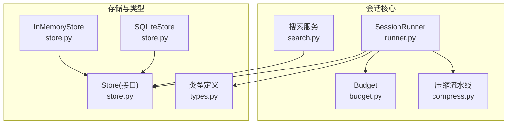
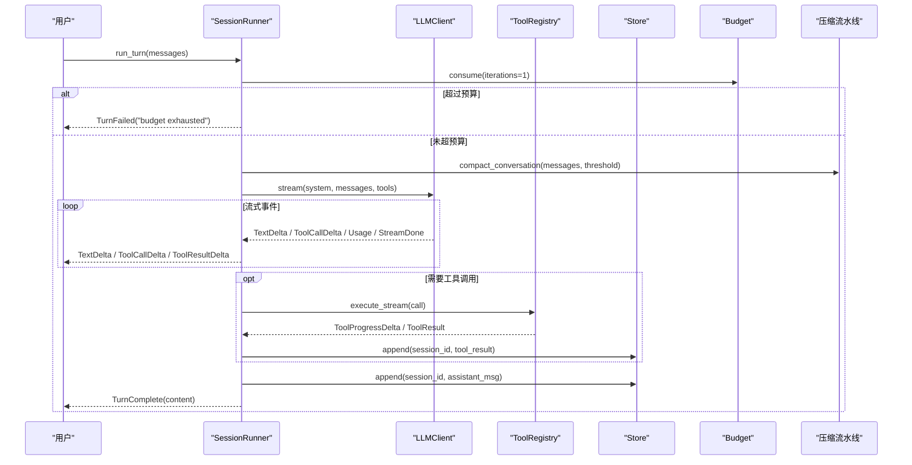
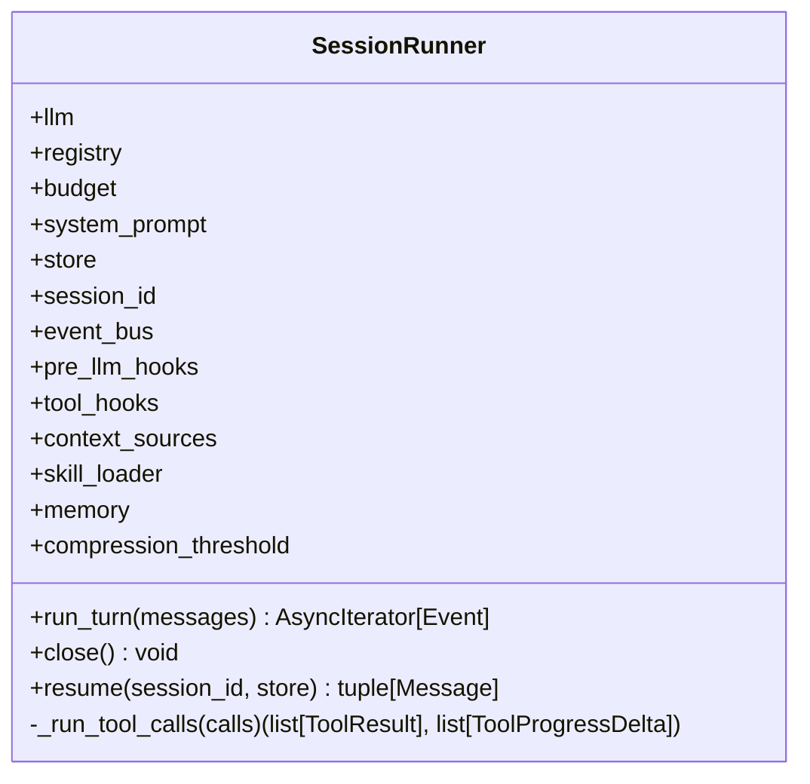
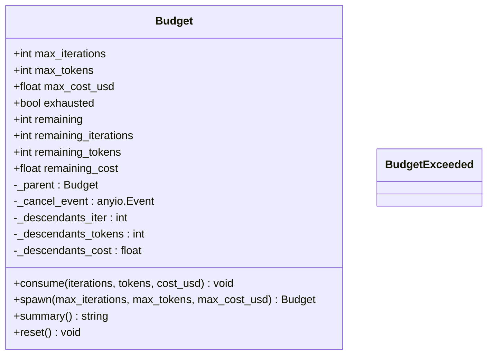
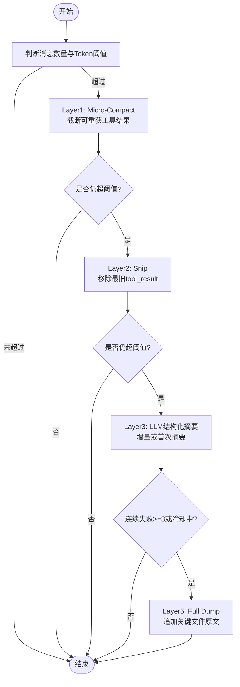
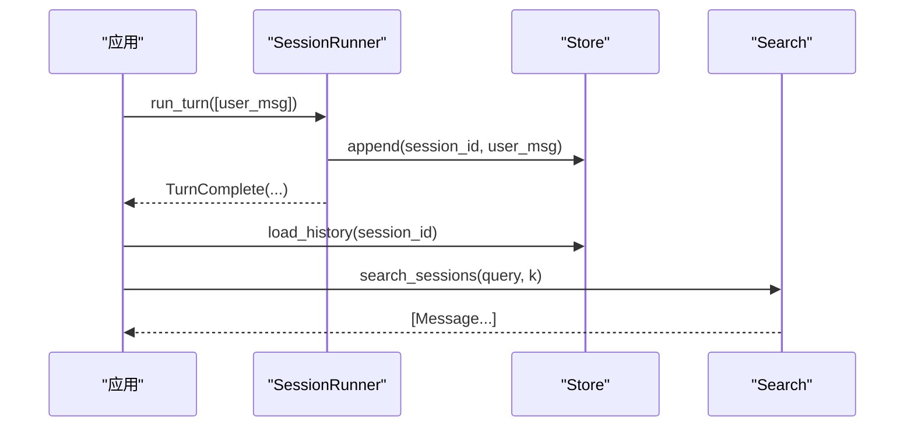
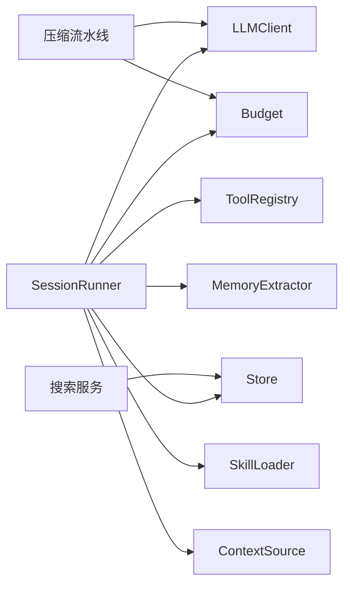

# 会话API

<cite>
**本文引用的文件**   
- [runner.py](file://src/microagent/session/runner.py)
- [budget.py](file://src/microagent/session/budget.py)
- [compress.py](file://src/microagent/session/compress.py)
- [search.py](file://src/microagent/session/search.py)
- [store.py](file://src/microagent/core/store.py)
- [types.py](file://src/microagent/core/types.py)
- [__init__.py](file://src/microagent/__init__.py)
- [test_runner.py](file://tests/unit/test_runner.py)
- [test_budget.py](file://tests/unit/test_budget.py)
- [test_compression.py](file://tests/unit/test_compression.py)
- [test_session_persist.py](file://tests/unit/test_session_persist.py)
- [test_session_resume.py](file://tests/unit/test_session_resume.py)
- [test_session_search.py](file://tests/unit/test_session_search.py)
</cite>

## 目录
1. [简介](#简介)
2. [项目结构](#项目结构)
3. [核心组件](#核心组件)
4. [架构总览](#架构总览)
5. [详细组件分析](#详细组件分析)
6. [依赖关系分析](#依赖关系分析)
7. [性能考量](#性能考量)
8. [故障排查指南](#故障排查指南)
9. [结论](#结论)
10. [附录：完整示例与最佳实践](#附录完整示例与最佳实践)

## 简介
本文件为 MicroAgent 的“会话管理”子系统提供完整的 API 文档，重点覆盖以下能力：
- SessionRunner 的核心方法：run_turn() 异步生成器、close() 资源清理、内部状态管理与工具调用流式处理。
- Budget 预算系统：max_iterations、token 限制、成本跟踪、父子树形预算与共享取消信号。
- 消息压缩策略：五层金字塔压缩（微压缩、裁剪、结构化摘要、熔断、全量转储）、阈值配置、保留策略与上下文优化。
- 会话持久化、恢复与搜索：SQLite WAL 存储、FTS5 全文检索、BM25 排序与 LIKE 回退。
- 会话生命周期管理、错误恢复与性能优化的最佳实践，并提供高级用法的代码示例路径。

## 项目结构
会话相关模块位于 src/microagent/session 与 core 子包中，测试用例位于 tests/unit。关键文件如下：
- session/runner.py：会话运行器，驱动 LLM 流式对话与工具执行循环。
- session/budget.py：树形预算控制，支持迭代、token、成本上限与根级取消。
- session/compress.py：五层上下文压缩流水线，含估算、截断、摘要、熔断与兜底。
- session/search.py：基于 SQLite FTS5 的全局会话搜索，含 CJK 分词与 BM25 排序。
- core/store.py：WAL 模式的持久化存储，支持 append/load/checkpoint/list/summaries。
- core/types.py：统一的消息、工具调用、结果与事件类型定义。
- __init__.py：对外暴露的公共 API 入口。

图表来源
- [runner.py:40-101](file://src/microagent/session/runner.py#L40-L101)
- [budget.py:14-70](file://src/microagent/session/budget.py#L14-L70)
- [compress.py:324-421](file://src/microagent/session/compress.py#L324-L421)
- [search.py:97-161](file://src/microagent/session/search.py#L97-L161)
- [store.py:95-179](file://src/microagent/core/store.py#L95-L179)
- [types.py:26-189](file://src/microagent/core/types.py#L26-L189)

章节来源
- [runner.py:1-120](file://src/microagent/session/runner.py#L1-L120)
- [budget.py:1-70](file://src/microagent/session/budget.py#L1-L70)
- [compress.py:1-80](file://src/microagent/session/compress.py#L1-L80)
- [search.py:1-60](file://src/microagent/session/search.py#L1-L60)
- [store.py:1-120](file://src/microagent/core/store.py#L1-L120)
- [types.py:1-80](file://src/microagent/core/types.py#L1-L80)

## 核心组件
- SessionRunner：会话主循环，负责 LLM 流式输出、工具调用执行、事件分发、预算消耗与上下文压缩触发。
- Budget：树形预算对象，维护自身与后代的使用量，支持 spawn 派生子预算与根级 cancel_event 广播。
- 压缩流水线：micro_compact、snip_tool_results、LLM 结构化摘要、CompactionState 熔断与冷却、layer5_full_dump 兜底。
- Store：持久化接口与实现（SQLiteStore、InMemoryStore），支持 append/load/checkpoint/list_sessions/session_summaries。
- search：FTS5 全文检索，CJK 双字元分词、BM25 排名与 LIKE 回退。
- types：Message、ToolCall、ToolResult、Usage、TextDelta、ToolCallDelta、ToolProgressDelta、ToolResultDelta、TurnComplete、TurnFailed 等。

章节来源
- [runner.py:40-120](file://src/microagent/session/runner.py#L40-L120)
- [budget.py:14-169](file://src/microagent/session/budget.py#L14-L169)
- [compress.py:87-170](file://src/microagent/session/compress.py#L87-L170)
- [store.py:28-179](file://src/microagent/core/store.py#L28-L179)
- [search.py:97-161](file://src/microagent/session/search.py#L97-L161)
- [types.py:17-189](file://src/microagent/core/types.py#L17-L189)

## 架构总览
SessionRunner 作为控制中枢，协调 LLMClient、ToolRegistry、Budget、Store、压缩与内存提取器等组件，形成“输入消息 → 预算检查 → 上下文压缩 → LLM 流式响应 → 工具执行 → 结果回写 → 事件输出”的闭环。

图表来源
- [runner.py:118-284](file://src/microagent/session/runner.py#L118-L284)
- [compress.py:324-421](file://src/microagent/session/compress.py#L324-L421)
- [store.py:122-179](file://src/microagent/core/store.py#L122-L179)
- [budget.py:99-130](file://src/microagent/session/budget.py#L99-L130)

## 详细组件分析

### SessionRunner 类
- 构造参数
  - llm: LLMClient 实例
  - registry: ToolRegistry 实例
  - budget: Budget 实例（可选）
  - system_prompt: 系统提示
  - store: Store 实例（可选）
  - session_id: 会话标识
  - event_bus: EventBus（可选）
  - pre_llm_hooks/tool_hooks/context_sources/skill_loader/memory: 扩展点
  - compression_threshold: 压缩阈值（默认 0 表示按模型窗口 60% 自动计算）
- 核心方法
  - run_turn(messages): 异步生成器，返回 Event 流（TextDelta、ToolCallDelta、ToolProgressDelta、ToolResultDelta、TurnComplete、TurnFailed）。
  - close(): 释放浏览器页面、内存提取器等资源。
  - resume(session_id, store): 从 Store 加载历史消息并返回元组。
- 内部状态
  - _cached_system/_cached_tools：缓存系统提示与工具描述，避免重复转换。
  - _proc_registry/_session_state/_browser_state：进程/任务/浏览器状态隔离。
  - _extractor：内存提取器（可选），用于从最近消息中提取长期记忆。
- 关键流程
  - 预算消耗与超限处理：每次迭代前 consume(iterations=1)，超限则 yield TurnFailed。
  - 上下文压缩：当消息数 > 10 且 token 数超过阈值时触发 compact_conversation。
  - 技能匹配与上下文注入：通过 skill_loader 与 context_sources 动态增强 system prompt。
  - 工具执行：并发执行工具调用，支持流式进度事件；失败时记录 ToolResult.error。
  - 持久化：assistant 消息与 tool_result 均写入 Store。
  - 事件分发：turn_complete 事件经 event_bus 发出；memory extractor 异步提取最近 10 条消息。

图表来源
- [runner.py:40-101](file://src/microagent/session/runner.py#L40-L101)
- [runner.py:118-341](file://src/microagent/session/runner.py#L118-L341)

章节来源
- [runner.py:40-120](file://src/microagent/session/runner.py#L40-L120)
- [runner.py:118-284](file://src/microagent/session/runner.py#L118-L284)
- [runner.py:285-341](file://src/microagent/session/runner.py#L285-L341)

### Budget 预算系统
- 属性与限制
  - max_iterations：最大迭代次数
  - max_tokens：最大 token 数
  - max_cost_usd：最大成本（美元）
  - remaining/remaining_iterations/remaining_tokens/remaining_cost：剩余资源（考虑后代）
- 树形结构
  - root(**limits)：创建根预算，共享 cancel_event
  - spawn(max_iterations, max_tokens, max_cost_usd)：派生子预算，默认使用父剩余资源的 1/3
  - consume(iterations, tokens, cost_usd)：消费资源，上报祖先链，达到阈值时设置 cancel_event 并抛出 BudgetExceeded
- 辅助方法
  - summary()：打印当前使用摘要
  - reset()：重置所有计数

图表来源
- [budget.py:14-169](file://src/microagent/session/budget.py#L14-L169)

章节来源
- [budget.py:14-169](file://src/microagent/session/budget.py#L14-L169)
- [test_budget.py:1-91](file://tests/unit/test_budget.py#L1-L91)

### 消息压缩策略（五层金字塔）
- Layer 1 — Micro-Compact：对可重获的工具结果进行零成本截断（>500 字符替换为占位符）
- Layer 2 — Snip：移除最旧的 tool_result 消息，保留最近的 keep_recent 条
- Layer 3 — Structured LLM Summary：一次 API 调用生成 7 段结构化摘要，支持增量更新
- Layer 4 — Circuit Breaker：连续失败 3 次后进入 300s 冷却期，停止压缩
- Layer 5 — Full Dump：最后手段，追加最近引用文件的原始内容（最多 3 个文件，每文件 8000 字符）

图表来源
- [compress.py:87-170](file://src/microagent/session/compress.py#L87-L170)
- [compress.py:324-421](file://src/microagent/session/compress.py#L324-L421)
- [compress.py:496-529](file://src/microagent/session/compress.py#L496-L529)

章节来源
- [compress.py:87-170](file://src/microagent/session/compress.py#L87-L170)
- [compress.py:324-421](file://src/microagent/session/compress.py#L324-L421)
- [compress.py:496-529](file://src/microagent/session/compress.py#L496-L529)
- [test_compression.py:1-67](file://tests/unit/test_compression.py#L1-L67)

### 会话持久化、恢复与搜索
- Store 接口与实现
  - append(session_id, msg)：追加消息
  - load_history(session_id)：加载历史消息
  - checkpoint(session_id)：强制 WAL checkpoint
  - list_sessions()：列出会话 ID（按最近活动排序）
  - session_summaries()：返回每个会话的统计与预览
- SQLiteStore：WAL 模式，JSON 序列化消息，索引优化查询
- InMemoryStore：内存存储，便于单元测试
- 恢复与继续
  - runner.resume(session_id, store)：加载历史消息，拼接新消息继续对话
- 搜索
  - search_sessions(store, query, k)：FTS5 全文检索，BM25 排名，CJK 双字元分词，LIKE 回退

图表来源
- [store.py:122-179](file://src/microagent/core/store.py#L122-L179)
- [search.py:97-161](file://src/microagent/session/search.py#L97-L161)
- [test_session_persist.py:1-75](file://tests/unit/test_session_persist.py#L1-L75)
- [test_session_resume.py:1-61](file://tests/unit/test_session_resume.py#L1-L61)
- [test_session_search.py:1-76](file://tests/unit/test_session_search.py#L1-L76)

章节来源
- [store.py:95-179](file://src/microagent/core/store.py#L95-L179)
- [search.py:97-161](file://src/microagent/session/search.py#L97-L161)
- [test_session_persist.py:1-75](file://tests/unit/test_session_persist.py#L1-L75)
- [test_session_resume.py:1-61](file://tests/unit/test_session_resume.py#L1-L61)
- [test_session_search.py:1-76](file://tests/unit/test_session_search.py#L1-L76)

### 类型与事件
- Message：统一消息格式（user/assistant/tool），包含 tool_calls、tool_call_id、usage、is_error
- ToolCall/ToolResult：工具调用与结果
- Usage：token 用量与成本
- 事件：TextDelta、ToolCallDelta、ToolProgressDelta、ToolResultDelta、TurnComplete、TurnFailed

章节来源
- [types.py:17-189](file://src/microagent/core/types.py#L17-L189)

## 依赖关系分析
- SessionRunner 依赖 LLMClient、ToolRegistry、Budget、Store、EventBus、MemoryExtractor、SkillLoader、ContextSource
- 压缩流水线依赖 LLMClient 与 Budget（在 LLM 摘要阶段消费 token）
- 搜索依赖 SQLiteStore 与 FTS5 虚拟表
- 类型定义被各模块广泛使用

图表来源
- [runner.py:40-101](file://src/microagent/session/runner.py#L40-L101)
- [compress.py:324-421](file://src/microagent/session/compress.py#L324-L421)
- [search.py:97-161](file://src/microagent/session/search.py#L97-L161)

章节来源
- [runner.py:40-101](file://src/microagent/session/runner.py#L40-L101)
- [compress.py:324-421](file://src/microagent/session/compress.py#L324-L421)
- [search.py:97-161](file://src/microagent/session/search.py#L97-L161)

## 性能考量
- 流式处理：LLM 输出与工具执行均采用异步流式，降低延迟，提升用户体验。
- 上下文压缩：优先零成本操作（Micro-Compact、Snip），仅在必要时调用 LLM 摘要，减少 API 开销。
- 预算控制：严格限制迭代、token、成本，防止无限循环与资源耗尽。
- 存储优化：SQLite WAL 模式与索引，checkpoint 控制磁盘 I/O；session_summaries 单次查询获取列表预览。
- 搜索优化：FTS5 BM25 排名，CJK 双字元分词提高精度；不可用时回退 LIKE。

## 故障排查指南
- 预算耗尽
  - 现象：TurnFailed 原因包含 “budget exhausted”
  - 排查：检查 Budget.max_iterations/max_tokens/max_cost_usd 与 consume 调用位置
  - 参考：[runner.py:129-134](file://src/microagent/session/runner.py#L129-L134)、[budget.py:99-130](file://src/microagent/session/budget.py#L99-L130)
- 工具执行失败
  - 现象：ToolResult.error 或 ToolResult.denied
  - 排查：检查 tool_hooks.before/after 逻辑、execute_stream 可用性
  - 参考：[runner.py:285-341](file://src/microagent/session/runner.py#L285-L341)
- 压缩失败与熔断
  - 现象：compact_conversation 返回 fallback 文本
  - 排查：查看 CompactionState.consecutive_failures 与冷却时间
  - 参考：[compress.py:293-317](file://src/microagent/session/compress.py#L293-L317)、[compress.py:377-416](file://src/microagent/session/compress.py#L377-L416)
- 存储异常
  - 现象：load_history 为空或数据不一致
  - 排查：确认 append 顺序与 checkpoint 时机；检查 JSON 序列化字段
  - 参考：[store.py:122-179](file://src/microagent/core/store.py#L122-L179)
- 搜索无结果
  - 现象：search_sessions 返回空
  - 排查：确认 FTS5 可用性与查询语句；检查 LIKE 回退分支
  - 参考：[search.py:97-161](file://src/microagent/session/search.py#L97-L161)

章节来源
- [runner.py:129-134](file://src/microagent/session/runner.py#L129-L134)
- [budget.py:99-130](file://src/microagent/session/budget.py#L99-L130)
- [runner.py:285-341](file://src/microagent/session/runner.py#L285-L341)
- [compress.py:293-317](file://src/microagent/session/compress.py#L293-L317)
- [compress.py:377-416](file://src/microagent/session/compress.py#L377-L416)
- [store.py:122-179](file://src/microagent/core/store.py#L122-L179)
- [search.py:97-161](file://src/microagent/session/search.py#L97-L161)

## 结论
MicroAgent 的会话管理子系统以 SessionRunner 为核心，结合 Budget 预算控制、五层压缩策略、WAL 持久化与 FTS5 搜索，提供了高可靠、高性能、可扩展的对话生命周期管理能力。通过清晰的类型定义与事件流，开发者可以灵活集成工具、技能与内存提取器，构建复杂的 AI Agent 工作流。

## 附录：完整示例与最佳实践

### 基本用法：启动会话与流式输出
- 步骤
  - 创建 LLMClient 与 ToolRegistry
  - 初始化 SessionRunner（可选传入 Store、Budget、hooks）
  - 调用 run_turn 迭代事件，收集 TextDelta/TurnComplete
- 参考测试
  - [test_runner.py:64-86](file://tests/unit/test_runner.py#L64-L86)

### 带工具调用的会话
- 步骤
  - 注册自定义工具到 ToolRegistry
  - 模拟 LLM 返回工具调用，再返回文本
  - 验证 ToolCallDelta、ToolResultDelta、TurnComplete
- 参考测试
  - [test_runner.py:92-129](file://tests/unit/test_runner.py#L92-L129)

### 预算控制与超限处理
- 步骤
  - 设置 Budget.max_iterations/max_tokens/max_cost_usd
  - 在循环中监听 TurnFailed 原因
- 参考测试
  - [test_runner.py:131-149](file://tests/unit/test_runner.py#L131-L149)
  - [test_budget.py:1-91](file://tests/unit/test_budget.py#L1-L91)

### 上下文压缩配置与使用
- 步骤
  - 设置 compression_threshold（默认 0 按模型窗口 60%）
  - 观察 compact_conversation 触发与 fallback
- 参考测试
  - [test_compression.py:22-67](file://tests/unit/test_compression.py#L22-L67)

### 持久化与会话恢复
- 步骤
  - 使用 SQLiteStore/InMemoryStore 保存消息
  - 通过 resume 加载历史并继续对话
- 参考测试
  - [test_session_persist.py:24-66](file://tests/unit/test_session_persist.py#L24-L66)
  - [test_session_resume.py:23-61](file://tests/unit/test_session_resume.py#L23-L61)

### 全局会话搜索
- 步骤
  - 确保 FTS5 可用（ensure_fts5）
  - 调用 search_sessions 查询，指定 k
- 参考测试
  - [test_session_search.py:52-76](file://tests/unit/test_session_search.py#L52-L76)

### 高级用法：组合 hooks、context_sources、skill_loader、memory
- 步骤
  - 注入 PreLLMHook 修改 system prompt
  - 注入 ContextSource 动态补充上下文
  - 使用 SkillLoader 匹配技能并注入 system
  - 启用 MemoryExtractor 从最近消息提取长期记忆
- 参考实现
  - [runner.py:164-179](file://src/microagent/session/runner.py#L164-L179)
  - [runner.py:92-101](file://src/microagent/session/runner.py#L92-L101)

### 最佳实践
- 合理设置 Budget：根据业务场景设定迭代、token、成本上限，避免无限循环。
- 调整压缩阈值：短对话无需压缩，长对话建议开启 micro_compact/snip，必要时触发 LLM 摘要。
- 使用 Store 持久化：生产环境推荐 SQLiteStore，定期 checkpoint 控制磁盘占用。
- 利用搜索能力：通过 search_sessions 快速定位历史片段，提升人机协作效率。
- 监控事件流：捕获 TurnFailed 与 ToolResult.error，完善错误处理与日志记录。

章节来源
- [test_runner.py:64-149](file://tests/unit/test_runner.py#L64-L149)
- [test_budget.py:1-91](file://tests/unit/test_budget.py#L1-L91)
- [test_compression.py:22-67](file://tests/unit/test_compression.py#L22-L67)
- [test_session_persist.py:24-66](file://tests/unit/test_session_persist.py#L24-L66)
- [test_session_resume.py:23-61](file://tests/unit/test_session_resume.py#L23-L61)
- [test_session_search.py:52-76](file://tests/unit/test_session_search.py#L52-L76)
- [runner.py:164-179](file://src/microagent/session/runner.py#L164-L179)
- [runner.py:92-101](file://src/microagent/session/runner.py#L92-L101)