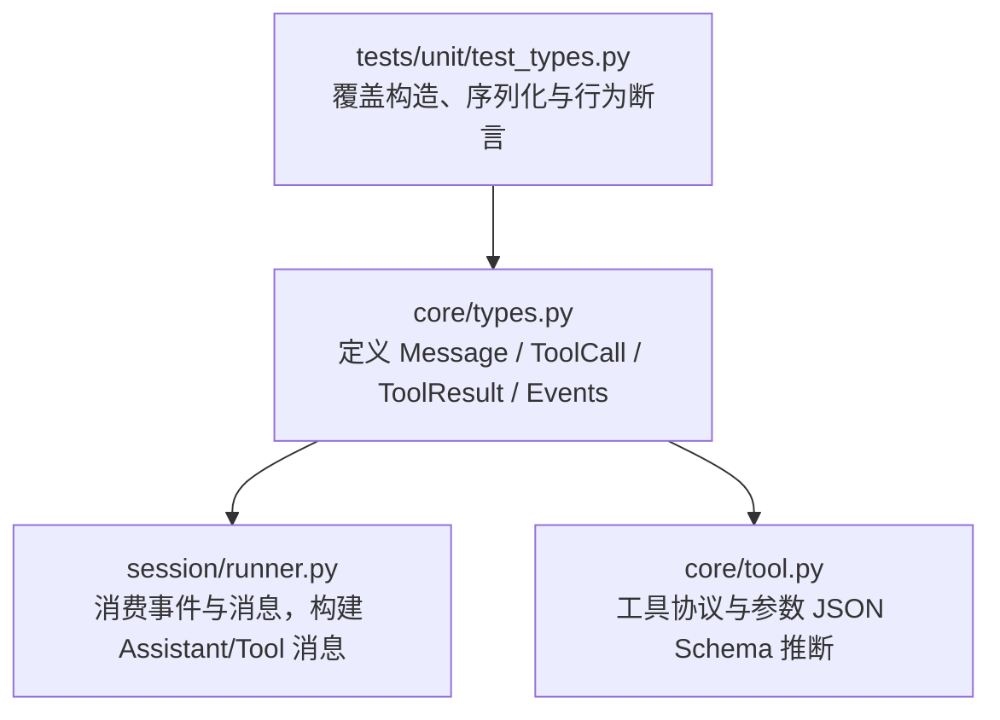
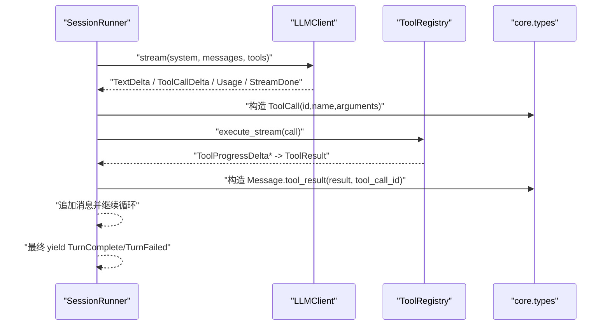
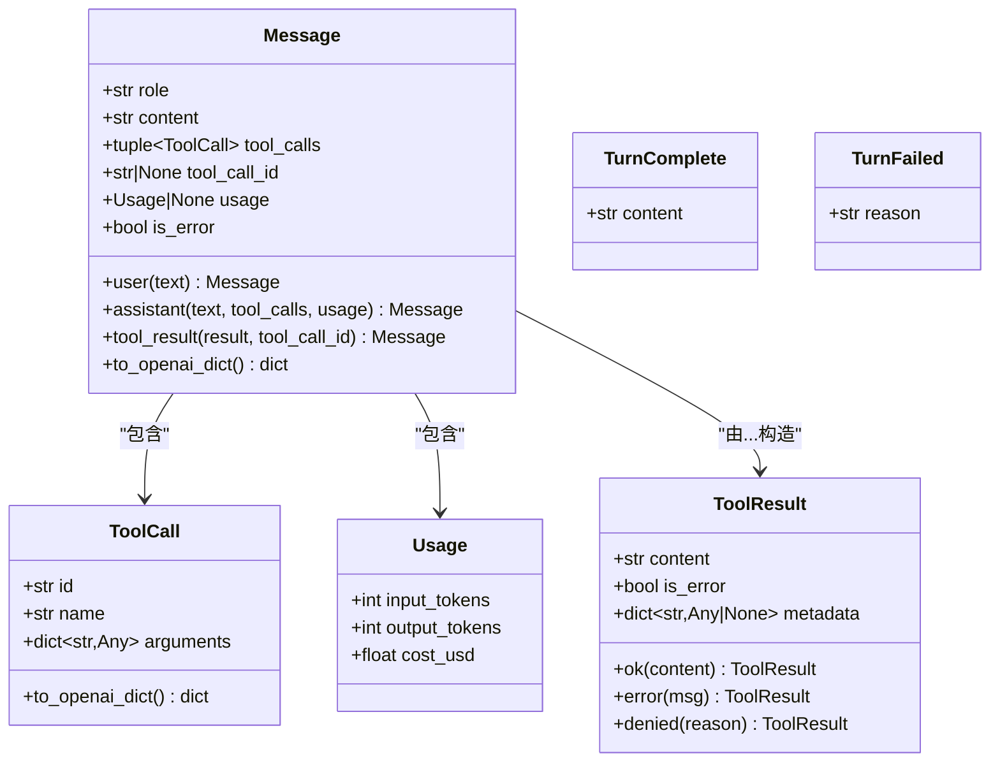

# 数据类型

<cite>
**本文引用的文件**   
- [src/microagent/core/types.py](file://src/microagent/core/types.py)
- [tests/unit/test_types.py](file://tests/unit/test_types.py)
- [src/microagent/session/runner.py](file://src/microagent/session/runner.py)
- [src/microagent/core/tool.py](file://src/microagent/core/tool.py)
</cite>

## 目录
1. [简介](#简介)
2. [项目结构](#项目结构)
3. [核心组件](#核心组件)
4. [架构总览](#架构总览)
5. [详细组件分析](#详细组件分析)
6. [依赖关系分析](#依赖关系分析)
7. [性能考虑](#性能考虑)
8. [故障排查指南](#故障排查指南)
9. [结论](#结论)
10. [附录](#附录)

## 简介
本文件为 MicroAgent 核心数据类型的完整 API 文档，聚焦以下类型：Message、ToolCall、ToolResult、TurnComplete、TurnFailed。内容涵盖字段说明、构造方法、验证规则、序列化支持（含 OpenAI 兼容格式）、JSON Schema 定义与示例、以及常见转换方法与使用方式。读者无需深入源码即可理解并正确使用这些数据结构。

## 项目结构
MicroAgent 的核心类型集中在 core/types.py，测试用例在 tests/unit/test_types.py，运行时组装与事件流在 session/runner.py，工具协议与参数 Schema 推断在 core/tool.py。下图展示与数据类型相关的模块关系。

图表来源 
- [src/microagent/core/types.py:1-189](file://src/microagent/core/types.py#L1-L189)
- [src/microagent/session/runner.py:118-284](file://src/microagent/session/runner.py#L118-L284)
- [src/microagent/core/tool.py:125-166](file://src/microagent/core/tool.py#L125-L166)
- [tests/unit/test_types.py:1-96](file://tests/unit/test_types.py#L1-L96)

章节来源
- [src/microagent/core/types.py:1-189](file://src/microagent/core/types.py#L1-L189)
- [tests/unit/test_types.py:1-96](file://tests/unit/test_types.py#L1-L96)

## 核心组件
本节概述各核心数据类型的职责与相互关系。

- Message：统一的用户/助手/工具角色消息载体，支持 tool_calls、tool_call_id、usage、is_error 等扩展字段，并提供 user、assistant、tool_result 三种便捷构造方法，以及 to_openai_dict 序列化。
- ToolCall：表示一次工具调用请求，包含 id、name、arguments 字段，提供 to_openai_dict 将 arguments 序列化为字符串以适配 OpenAI 函数调用格式。
- ToolResult：表示工具执行结果，包含 content、is_error、metadata 字段，提供 ok、error、denied 三种便捷构造方法。
- TurnComplete / TurnFailed：会话轮次结束事件，分别表示成功完成或失败原因。

章节来源
- [src/microagent/core/types.py:17-116](file://src/microagent/core/types.py#L17-L116)
- [src/microagent/core/types.py:167-188](file://src/microagent/core/types.py#L167-L188)

## 架构总览
下图展示了从 LLM 流式输出到工具调用、再到结果回传的端到端流程，以及与核心数据类型的交互。

图表来源 
- [src/microagent/session/runner.py:190-284](file://src/microagent/session/runner.py#L190-L284)
- [src/microagent/core/types.py:41-68](file://src/microagent/core/types.py#L41-L68)
- [src/microagent/core/types.py:76-94](file://src/microagent/core/types.py#L76-L94)

## 详细组件分析

### Message 类
- 作用：统一的消息模型，承载 role、content、tool_calls、tool_call_id、usage、is_error。
- 构造方法
  - user(text): 创建用户消息，role="user"，content=text。
  - assistant(text, *, tool_calls=(), usage=None): 创建助手消息，role="assistant"，可携带 tool_calls 和 usage。
  - tool_result(result, *, tool_call_id): 基于 ToolResult 创建 role="tool" 的消息，必须指定 tool_call_id。
- 属性
  - role: str，固定为 "user"/"assistant"/"tool"。
  - content: str，文本内容。
  - tool_calls: tuple[ToolCall, ...]，可选的工具调用列表。
  - tool_call_id: str|None，当 role="tool" 时必填，用于关联原始工具调用。
  - usage: Usage|None，可选的 token 用量统计。
  - is_error: bool，标记是否为错误结果。
- 序列化
  - to_openai_dict(): 生成 OpenAI SDK 期望的字典，包含 role、content、tool_calls（每个 ToolCall 转 dict）、tool_call_id（当存在）。
- 验证规则
  - 不可变（frozen dataclass），禁止修改实例字段。
  - role="tool" 时，tool_call_id 必须设置（由调用方保证）。
- JSON Schema
  - 无内置 schema；可通过 to_openai_dict() 获得 OpenAI 兼容结构。
- 示例（路径）
  - 用户消息构造与断言：[tests/unit/test_types.py:14-19](file://tests/unit/test_types.py#L14-L19)
  - 助手消息带 tool_calls：[tests/unit/test_types.py:21-26](file://tests/unit/test_types.py#L21-L26)
  - 工具结果消息构造：[tests/unit/test_types.py:28-33](file://tests/unit/test_types.py#L28-L33)
  - 序列化 to_openai_dict：[tests/unit/test_types.py:35-45](file://tests/unit/test_types.py#L35-L45)
  - 不可变性断言：[tests/unit/test_types.py:47-53](file://tests/unit/test_types.py#L47-L53)

章节来源
- [src/microagent/core/types.py:26-68](file://src/microagent/core/types.py#L26-L68)
- [tests/unit/test_types.py:14-53](file://tests/unit/test_types.py#L14-L53)

### ToolCall 数据结构
- 字段
  - id: str，唯一标识一次工具调用。
  - name: str，工具名称。
  - arguments: dict[str, Any]，工具入参（Python 对象）。
- 序列化
  - to_openai_dict(): 返回 OpenAI 函数调用格式，其中 arguments 会被 json.dumps 序列化为字符串。
- 使用方式
  - 由 LLM 流式输出 ToolCallDelta 聚合而成，随后被 SessionRunner 转换为 ToolCall 并执行。
- 示例（路径）
  - 构造与序列化断言：[tests/unit/test_types.py:74-81](file://tests/unit/test_types.py#L74-L81)

章节来源
- [src/microagent/core/types.py:76-94](file://src/microagent/core/types.py#L76-L94)
- [tests/unit/test_types.py:74-81](file://tests/unit/test_types.py#L74-L81)

### ToolResult 数据结构
- 字段
  - content: str，工具输出内容。
  - is_error: bool，是否表示错误。
  - metadata: dict[str, Any]|None，可选元数据（如权限拒绝标记）。
- 构造方法
  - ok(content): 成功结果。
  - error(msg): 错误结果，is_error=True。
  - denied(reason): 权限拒绝结果，is_error=True，metadata={"denied": True}。
- 错误处理
  - 通过 is_error 与 metadata 区分普通错误与权限拒绝，便于上层策略处理。
- 示例（路径）
  - ok/error/denied 断言：[tests/unit/test_types.py:57-70](file://tests/unit/test_types.py#L57-L70)

章节来源
- [src/microagent/core/types.py:97-116](file://src/microagent/core/types.py#L97-L116)
- [tests/unit/test_types.py:57-70](file://tests/unit/test_types.py#L57-L70)

### TurnComplete 与 TurnFailed 事件类型
- TurnComplete
  - content: str，正常完成的响应文本。
- TurnFailed
  - reason: str，失败原因（如预算耗尽、截断等）。
- 使用场景
  - SessionRunner 在轮次结束时 yield 上述事件之一，作为对话轮次的终态信号。
- 示例（路径）
  - TurnComplete/TurnFailed 断言：[tests/unit/test_types.py:89-95](file://tests/unit/test_types.py#L89-L95)

章节来源
- [src/microagent/core/types.py:167-188](file://src/microagent/core/types.py#L167-L188)
- [tests/unit/test_types.py:89-95](file://tests/unit/test_types.py#L89-L95)

### 事件与流式处理（补充）
- TextDelta：增量文本输出（kind 可为 thinking/content）。
- ToolCallDelta：完整的工具调用（累积后发出）。
- ToolResultDelta：工具执行结果摘要。
- ToolProgressDelta：工具运行时的实时进度。
- Event 联合类型：包含以上所有事件类型。

章节来源
- [src/microagent/core/types.py:123-188](file://src/microagent/core/types.py#L123-L188)

## 依赖关系分析
- Message 依赖 ToolCall（tool_calls）与 Usage（usage）。
- ToolCall.to_openai_dict 依赖 Python 标准库 json 进行序列化。
- ToolResult 被 Message.tool_result 消费，用于生成 role="tool" 的消息。
- SessionRunner 消费 LLM 事件，构造 ToolCall，执行工具，生成 ToolResult，再封装为 Message.tool_result，最后产出 TurnComplete/TurnFailed。
- core/tool.py 中的 @tool 装饰器与 _infer_schema_from_signature 负责根据函数签名推断 OpenAI 兼容 JSON Schema，确保 arguments 的结构正确性。

图表来源 
- [src/microagent/core/types.py:17-116](file://src/microagent/core/types.py#L17-L116)
- [src/microagent/core/types.py:167-188](file://src/microagent/core/types.py#L167-L188)

章节来源
- [src/microagent/core/types.py:17-116](file://src/microagent/core/types.py#L17-L116)
- [src/microagent/core/tool.py:125-166](file://src/microagent/core/tool.py#L125-L166)

## 性能考虑
- 不可变性与 slots：dataclass(frozen=True, slots=True) 减少内存占用与提升访问速度。
- 流式处理：SessionRunner 通过异步迭代事件，避免阻塞，提高吞吐。
- 序列化开销：ToolCall.arguments 在 to_openai_dict 中会进行 JSON 序列化，建议在批量处理时复用或缓存结果。
- 压缩与上下文窗口：当消息数量超过阈值时，Runner 会触发压缩，降低上下文长度，减少 LLM 调用成本。

[本节为通用指导，不直接分析具体文件]

## 故障排查指南
- 工具参数解析失败
  - 现象：上游工具参数无法解析为预期结构（例如 Go 侧报错“cannot unmarshal string into []string”）。
  - 排查要点：检查 ToolCall.arguments 的类型是否符合目标工具的 JSON Schema；确认 @tool 装饰器的参数注解与 Field 描述是否正确。
  - 参考位置：
    - 参数 Schema 推断：[src/microagent/core/tool.py:125-166](file://src/microagent/core/tool.py#L125-L166)
    - 工具执行与异常捕获：[src/microagent/session/runner.py:326-332](file://src/microagent/session/runner.py#L326-L332)
- 权限拒绝
  - 现象：ToolResult.denied 返回 is_error=True 且 metadata={"denied": True}。
  - 处理建议：在工具钩子 after 阶段拦截并记录审计信息，或提示用户授权。
  - 参考位置：
    - ToolResult.denied 构造：[src/microagent/core/types.py:113-116](file://src/microagent/core/types.py#L113-L116)
    - 工具钩子阻断示例：[src/microagent/session/runner.py:305-309](file://src/microagent/session/runner.py#L305-L309)
- 预算耗尽与截断
  - 现象：TurnFailed(reason="budget exhausted...") 或 TurnFailed("LLM response truncated (max tokens)")。
  - 处理建议：调整预算上限或上下文窗口阈值，必要时启用压缩。
  - 参考位置：
    - 预算耗尽处理：[src/microagent/session/runner.py:131-134](file://src/microagent/session/runner.py#L131-L134)
    - 截断处理：[src/microagent/session/runner.py:205-225](file://src/microagent/session/runner.py#L205-L225)

章节来源
- [src/microagent/core/tool.py:125-166](file://src/microagent/core/tool.py#L125-L166)
- [src/microagent/session/runner.py:305-332](file://src/microagent/session/runner.py#L305-L332)
- [src/microagent/core/types.py:113-116](file://src/microagent/core/types.py#L113-L116)

## 结论
Message、ToolCall、ToolResult、TurnComplete、TurnFailed 构成了 MicroAgent 的核心数据契约。它们具备不可变、轻量、易序列化的特性，并与 SessionRunner 的流式处理紧密协作。通过 @tool 的参数 Schema 推断与严格的错误/权限标记，系统在保证灵活性的同时提供了良好的可观测性与可控性。

[本节为总结，不直接分析具体文件]

## 附录

### 字段说明与验证规则汇总
- Message
  - role: 枚举值 "user"/"assistant"/"tool"。
  - content: 非空字符串（由调用方保证）。
  - tool_calls: 元组，元素为 ToolCall。
  - tool_call_id: 当 role="tool" 时必须存在。
  - usage: 可选，token 用量统计。
  - is_error: 布尔，标记错误。
  - 不可变：禁止修改字段。
- ToolCall
  - id: 非空字符串。
  - name: 非空字符串。
  - arguments: 字典，键为字符串，值为任意可 JSON 序列化的对象。
- ToolResult
  - content: 非空字符串。
  - is_error: 布尔。
  - metadata: 可选字典。
- TurnComplete / TurnFailed
  - content/reason: 非空字符串。

章节来源
- [src/microagent/core/types.py:26-116](file://src/microagent/core/types.py#L26-L116)
- [src/microagent/core/types.py:167-188](file://src/microagent/core/types.py#L167-L188)

### 序列化支持与 JSON Schema 定义
- Message.to_openai_dict()
  - 输出包含 role、content、tool_calls（数组，每个元素为 ToolCall.to_openai_dict）、tool_call_id（可选）。
- ToolCall.to_openai_dict()
  - 输出包含 id、type="function"、function.name、function.arguments（字符串化 JSON）。
- 工具参数 JSON Schema
  - 由 @tool 装饰器结合 Pydantic v2 自动推断，确保 arguments 结构与类型约束符合 OpenAI 函数调用要求。

章节来源
- [src/microagent/core/types.py:61-94](file://src/microagent/core/types.py#L61-L94)
- [src/microagent/core/tool.py:125-166](file://src/microagent/core/tool.py#L125-L166)

### 数据结构示例（路径引用）
- 用户消息构造与断言：[tests/unit/test_types.py:14-19](file://tests/unit/test_types.py#L14-L19)
- 助手消息带 tool_calls：[tests/unit/test_types.py:21-26](file://tests/unit/test_types.py#L21-L26)
- 工具结果消息构造：[tests/unit/test_types.py:28-33](file://tests/unit/test_types.py#L28-L33)
- ToolCall 序列化断言：[tests/unit/test_types.py:74-81](file://tests/unit/test_types.py#L74-L81)
- ToolResult.ok/error/denied 断言：[tests/unit/test_types.py:57-70](file://tests/unit/test_types.py#L57-L70)
- TurnComplete/TurnFailed 断言：[tests/unit/test_types.py:89-95](file://tests/unit/test_types.py#L89-L95)

章节来源
- [tests/unit/test_types.py:14-95](file://tests/unit/test_types.py#L14-L95)

### 转换方法与使用方式
- Message.user(text) → Message(role="user", content=text)
- Message.assistant(text, tool_calls, usage) → Message(role="assistant", ...)
- Message.tool_result(result, tool_call_id) → Message(role="tool", content=result.content, is_error=result.is_error, tool_call_id=tool_call_id)
- ToolCall.to_openai_dict() → 生成 OpenAI 函数调用字典
- ToolResult.ok/error/denied → 快速构造成功/错误/权限拒绝结果
- SessionRunner 将 ToolCallDelta 聚合成 ToolCall，执行后以 Message.tool_result 回传，并最终 yield TurnComplete/TurnFailed

章节来源
- [src/microagent/core/types.py:41-68](file://src/microagent/core/types.py#L41-L68)
- [src/microagent/core/types.py:76-94](file://src/microagent/core/types.py#L76-L94)
- [src/microagent/session/runner.py:190-284](file://src/microagent/session/runner.py#L190-L284)