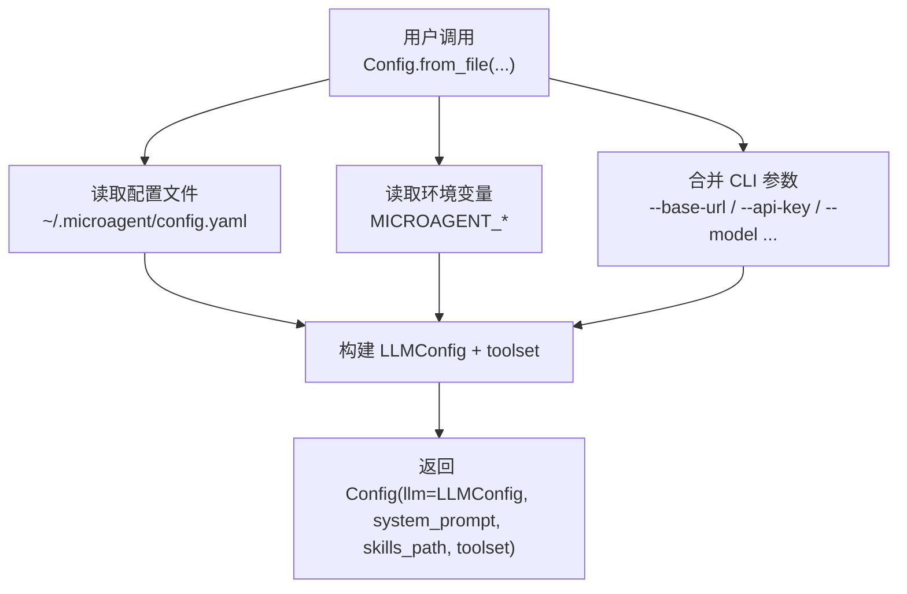
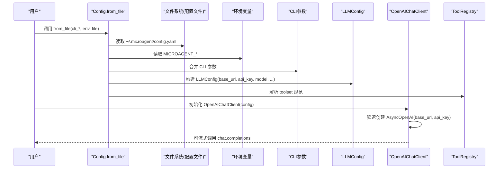
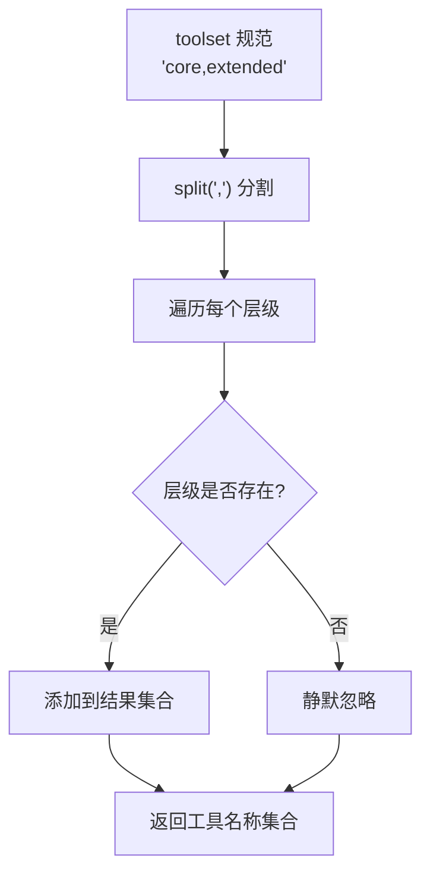
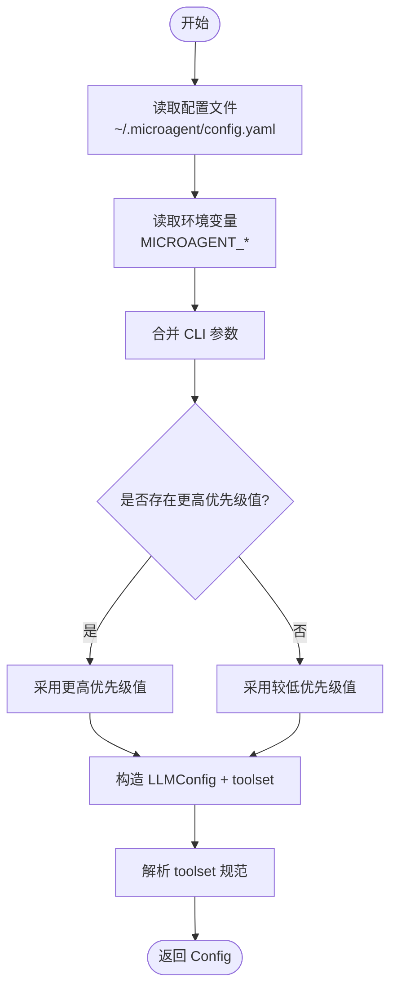
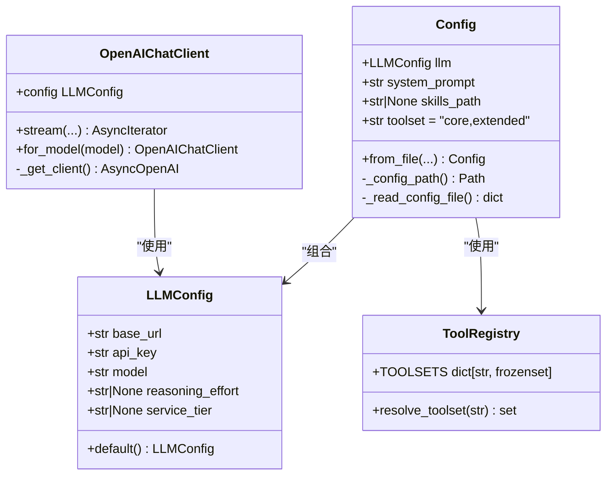

# 配置API

<cite>
**本文引用的文件**   
- [src/microagent/config.py](file://src/microagent/config.py)
- [src/microagent/llm/client.py](file://src/microagent/llm/client.py)
- [tests/unit/test_config.py](file://tests/unit/test_config.py)
- [src/microagent/surface/cli.py](file://src/microagent/surface/cli.py)
- [README.md](file://README.md)
- [src/microagent/core/tool.py](file://src/microagent/core/tool.py)
- [tests/unit/test_toolset_jitter_snip.py](file://tests/unit/test_toolset_jitter_snip.py)
</cite>

## 更新摘要
**变更内容**   
- 新增 toolset 字段到 Config 类，支持逗号分隔的工具集层级配置
- 默认值为 "core,extended"，提供向后兼容性
- 新增三个工具集层级：core（核心工具）、extended（扩展工具）、scene（场景工具）
- 新增 resolve_toolset() 函数用于解析工具集规范
- 更新了配置文件格式说明和环境变量映射

## 目录
1. [简介](#简介)
2. [项目结构](#项目结构)
3. [核心组件](#核心组件)
4. [架构总览](#架构总览)
5. [详细组件分析](#详细组件分析)
6. [依赖关系分析](#依赖关系分析)
7. [性能与可用性考虑](#性能与可用性考虑)
8. [故障排查指南](#故障排查指南)
9. [结论](#结论)
10. [附录：配置示例与最佳实践](#附录配置示例与最佳实践)

## 简介
本文件为 MicroAgent 配置系统的完整 API 文档，聚焦于 LLMConfig 类和新增的 toolset 功能及其在整体配置解析中的角色。内容涵盖：
- LLMConfig 所有字段的类型、默认值、验证规则与使用方式
- **新增** toolset 字段的配置选项和工具集层级管理
- 配置文件（YAML）格式与字段说明
- 环境变量配置方式与优先级
- CLI 参数与环境变量、配置文件的优先级关系
- 配置热重载与环境切换的最佳实践建议
- 常见错误提示与调试方法

注意：当前实现未包含 timeout、max_tokens 等字段；这些字段不在 LLMConfig 或 Config 中定义。

## 项目结构
与配置相关的核心代码位于以下模块：
- src/microagent/config.py：多源配置解析（CLI > 环境变量 > 配置文件 > 默认值），生成最终 Config
- src/microagent/llm/client.py：LLMConfig 数据模型与 OpenAI 兼容客户端
- src/microagent/core/tool.py：工具集层级定义和解析逻辑
- tests/unit/test_config.py：覆盖配置文件、环境变量、CLI 参数的优先级行为
- tests/unit/test_toolset_jitter_snip.py：工具集层级功能的测试用例
- src/microagent/surface/cli.py：CLI 帮助信息，展示支持的命令行选项与配置文件路径
- README.md：快速上手与示例，展示如何使用 LLMConfig

图表来源
- [src/microagent/config.py:28-71](file://src/microagent/config.py#L28-L71)
- [src/microagent/config.py:73-101](file://src/microagent/config.py#L73-L101)

章节来源
- [src/microagent/config.py:1-102](file://src/microagent/config.py#L1-L102)
- [src/microagent/llm/client.py:93-118](file://src/microagent/llm/client.py#L93-L118)
- [tests/unit/test_config.py:1-76](file://tests/unit/test_config.py#L1-L76)
- [src/microagent/surface/cli.py:362-374](file://src/microagent/surface/cli.py#L362-L374)
- [README.md:24-38](file://README.md#L24-L38)

## 核心组件
- LLMConfig：OpenAI 兼容的 LLM 配置数据类，包含 base_url、api_key、model、reasoning_effort、service_tier 等字段
- **新增** Config：聚合 LLMConfig 并支持从多源（配置文件、环境变量、CLI）解析最终配置，**新增 toolset 字段**
- **新增** TOOLSETS：定义三个工具集层级（core、extended、scene）
- **新增** resolve_toolset()：解析逗号分隔的工具集规范为工具名称集合

关键要点
- LLMConfig 是只读数据类（frozen + slots），提供默认实例
- Config.from_file 负责按优先级合并配置，并构造 LLMConfig
- **toolset 字段默认为 "core,extended"，支持向后兼容**
- **工具集层级提供细粒度的安全控制和功能管理**

章节来源
- [src/microagent/llm/client.py:93-118](file://src/microagent/llm/client.py#L93-L118)
- [src/microagent/config.py:20-71](file://src/microagent/config.py#L20-L71)
- [src/microagent/core/tool.py:317-362](file://src/microagent/core/tool.py#L317-L362)

## 架构总览
下图展示了配置加载与 LLM 客户端初始化的流程，包括新的 toolset 功能：

图表来源
- [src/microagent/config.py:28-71](file://src/microagent/config.py#L28-L71)
- [src/microagent/llm/client.py:163-185](file://src/microagent/llm/client.py#L163-L185)

## 详细组件分析

### LLMConfig 字段与默认值
- base_url: str — OpenAI 兼容 API 端点，例如 https://api.openai.com/v1
- api_key: str — 认证密钥
- model: str — 模型标识符
- reasoning_effort: str | None = None — 用于 o 系列模型的推理强度（low/medium/high）
- service_tier: str | None = None — OpenAI 服务层级（auto/default/flex）

默认值
- LLMConfig.default() 返回 base_url="https://api.openai.com/v1", api_key="", model="gpt-4o"

验证规则
- 当前实现未对字段进行显式校验（无自定义 __post_init__ 或 pydantic 验证）
- 运行时有效性由底层 openai SDK 和后端服务决定（如 URL 可达性、鉴权失败、速率限制等）

使用示例（以路径引用代替具体代码）
- 参考 [README.md:24-38](file://README.md#L24-L38) 中的 Agent.from_config(LLMConfig(...)) 用法

章节来源
- [src/microagent/llm/client.py:93-118](file://src/microagent/llm/client.py#L93-L118)
- [README.md:24-38](file://README.md#L24-L38)

### Config 配置解析与优先级
优先级顺序（从高到低）
- CLI 参数（--base-url, --api-key, --model, --system-prompt, --skills-path）
- 环境变量（MICROAGENT_BASE_URL, MICROAGENT_API_KEY, MICROAGENT_MODEL, MICROAGENT_SYSTEM_PROMPT, MICROAGENT_SKILLS_PATH）
- 配置文件（~/.microagent/config.yaml）
- 默认值（base_url="https://api.openai.com/v1", model="gpt-4o", system_prompt="You are a helpful assistant.", toolset="core,extended"）

配置文件格式（YAML）
- 位置：~/.microagent/config.yaml
- 顶层字段：
  - model: 对象，包含 base_url、api_key、model
  - system_prompt: 字符串
  - skills_path: 字符串（冒号分隔的技能目录列表）
  - **toolset: 字符串（逗号分隔的工具集层级，默认 "core,extended"）**
- 解析逻辑：
  - 若文件不存在或解析异常，视为空配置
  - 仅提取 model.base_url、model.api_key、model.model、system_prompt、skills_path

环境变量映射
- MICROAGENT_BASE_URL → base_url
- MICROAGENT_API_KEY → api_key
- MICROAGENT_MODEL → model
- MICROAGENT_SYSTEM_PROMPT → system_prompt
- MICROAGENT_SKILLS_PATH → skills_path
- **MICROAGENT_TOOLSET → toolset（新增）**

CLI 参数映射
- --base-url → base_url
- --api-key → api_key
- --model → model
- --system-prompt → system_prompt
- --skills-path → skills_path
- **--toolset → toolset（新增）**

章节来源
- [src/microagent/config.py:1-9](file://src/microagent/config.py#L1-L9)
- [src/microagent/config.py:28-71](file://src/microagent/config.py#L28-L71)
- [src/microagent/config.py:73-101](file://src/microagent/config.py#L73-L101)
- [src/microagent/surface/cli.py:362-374](file://src/microagent/surface/cli.py#L362-L374)

### 工具集层级系统
**新增** 工具集层级系统提供了细粒度的工具控制机制：

#### 工具集层级定义
- **core**（核心工具集）：基础文件操作和命令执行工具
  - read_file, write_file, edit_file, grep, glob, bash, task
- **extended**（扩展工具集）：网络搜索和高级功能工具  
  - web_search, web_fetch, context7, session_search, todo, plan, exit, skill_manage, process
- **scene**（场景工具集）：浏览器自动化和代码执行工具
  - browser_navigate, browser_snapshot, browser_click, browser_type, execute_code, vision_analyze

#### 工具集解析机制
- **resolve_toolset(spec: str)**：将逗号分隔的工具集规范解析为工具名称集合
- 支持多个层级组合，如 "core,extended" 或 "core,extended,scene"
- 未知层级会被静默忽略，确保向后兼容性
- 默认值为 "core,extended"，提供平衡的功能和安全控制

图表来源
- [src/microagent/core/tool.py:349-362](file://src/microagent/core/tool.py#L349-L362)

章节来源
- [src/microagent/core/tool.py:317-362](file://src/microagent/core/tool.py#L317-L362)
- [tests/unit/test_toolset_jitter_snip.py:13-51](file://tests/unit/test_toolset_jitter_snip.py#L13-L51)

### 配置流程图（优先级与合并）

图表来源
- [src/microagent/config.py:28-71](file://src/microagent/config.py#L28-L71)

## 依赖关系分析
- Config 依赖 LLMConfig 来封装 LLM 相关配置
- **Config 新增依赖 toolset 字段，默认值为 "core,extended"**
- OpenAIChatClient 依赖 LLMConfig 以建立 AsyncOpenAI 客户端连接
- **ToolRegistry 依赖 TOOLSETS 定义和 resolve_toolset() 函数**
- 配置文件解析依赖 PyYAML（仅在存在时导入）

图表来源
- [src/microagent/llm/client.py:93-118](file://src/microagent/llm/client.py#L93-L118)
- [src/microagent/config.py:20-71](file://src/microagent/config.py#L20-L71)
- [src/microagent/core/tool.py:317-362](file://src/microagent/core/tool.py#L317-L362)
- [src/microagent/llm/client.py:163-185](file://src/microagent/llm/client.py#L163-L185)

章节来源
- [src/microagent/config.py:20-71](file://src/microagent/config.py#L20-L71)
- [src/microagent/llm/client.py:163-185](file://src/microagent/llm/client.py#L163-L185)
- [src/microagent/core/tool.py:317-362](file://src/microagent/core/tool.py#L317-L362)

## 性能与可用性考虑
- LLMConfig 使用 frozen + slots，内存占用更小且不可变，适合频繁传递
- **toolset 字段使用字符串存储，解析时转换为集合，避免重复计算**
- OpenAIChatClient 延迟创建底层 AsyncOpenAI 客户端，减少不必要的初始化开销
- 流式响应通过 stream 接口逐步产出事件，提升交互体验
- 鉴权/限流错误会被识别并尝试凭据轮换（当启用 CredentialPool 时）
- **工具集层级系统提供细粒度控制，可根据安全需求选择不同层级的工具**

## 故障排查指南
常见问题与定位方法
- 配置文件路径与语法
  - 确认配置文件位于 ~/.microagent/config.yaml
  - YAML 语法错误将被忽略并回退为空配置
- 环境变量冲突
  - 检查是否设置了错误的 MICROAGENT_* 变量导致覆盖预期值
  - **检查 MICROAGENT_TOOLSET 是否正确设置**
- CLI 参数优先级
  - CLI 参数会覆盖环境与配置文件，确保传入正确
- 鉴权与网络问题
  - 401/403/429 错误会被识别为可重试错误，若启用凭据池将自动轮换
- 工具集相关问题
  - **确认工具集层级名称正确（core、extended、scene）**
  - **检查 resolve_toolset() 是否正确解析工具集规范**
  - **验证目标工具是否在指定的工具集层级中**
- 调试技巧
  - 打印最终 Config.llm.base_url、api_key、model、toolset 以确认生效值
  - 使用最小化配置逐步排除干扰项
  - **测试不同的工具集组合以验证功能**

章节来源
- [src/microagent/config.py:73-101](file://src/microagent/config.py#L73-L101)
- [src/microagent/llm/client.py:193-215](file://src/microagent/llm/client.py#L193-L215)
- [tests/unit/test_config.py:1-76](file://tests/unit/test_config.py#L1-L76)
- [tests/unit/test_toolset_jitter_snip.py:13-51](file://tests/unit/test_toolset_jitter_snip.py#L13-L51)

## 结论
MicroAgent 的配置系统以 LLMConfig 为核心，结合 Config 的多源解析机制，实现了清晰、可扩展且易于调试的配置管理。**新增的 toolset 字段提供了细粒度的工具控制能力，支持三种工具集层级（core、extended、scene），默认值为 "core,extended" 以确保向后兼容性**。当前版本未包含 timeout、max_tokens 等字段，如需扩展可在 LLMConfig 中添加并在 Config.from_file 中增加对应解析逻辑。

## 附录：配置示例与最佳实践

### 配置文件（YAML）示例
- 基本 OpenAI 配置
  - 在 ~/.microagent/config.yaml 中设置 model.base_url、model.api_key、model.model
- **工具集配置示例**
  - 仅核心工具：`toolset: "core"`
  - 核心+扩展工具：`toolset: "core,extended"`（默认值）
  - 全部工具：`toolset: "core,extended,scene"`
- 本地模型（vLLM/Ollama/OpenRouter 等）
  - 将 base_url 指向任意 OpenAI 兼容端点
- 其他提供商（Anthropic 等）
  - 若提供 OpenAI 兼容接口，可通过 base_url 接入；否则需自行适配

章节来源
- [src/microagent/config.py:73-101](file://src/microagent/config.py#L73-L101)
- [README.md:24-38](file://README.md#L24-L38)

### 环境变量示例
- export MICROAGENT_BASE_URL="https://api.openai.com/v1"
- export MICROAGENT_API_KEY="sk-..."
- export MICROAGENT_MODEL="gpt-4o"
- **export MICROAGENT_TOOLSET="core,extended"**

章节来源
- [README.md:44-58](file://README.md#L44-L58)

### CLI 参数示例
- microagent --base-url "https://api.openai.com/v1" --api-key "sk-..." --model "gpt-4o"
- **microagent --toolset "core" # 仅使用核心工具**

章节来源
- [src/microagent/surface/cli.py:362-374](file://src/microagent/surface/cli.py#L362-L374)

### 工具集层级使用建议
- **开发环境**：使用 "core,extended,scene" 获取完整功能
- **生产环境**：使用 "core,extended" 平衡功能与安全
- **受限环境**：使用 "core" 仅允许基础文件操作和命令执行
- **安全敏感环境**：根据需求自定义工具集，移除不需要的工具

### 配置热重载与环境切换最佳实践
- 进程内热重载
  - 每次需要新配置时重新调用 Config.from_file(...)，避免缓存旧值
- 环境切换
  - 使用不同环境变量的组合（开发/测试/生产）配合脚本切换
  - 在容器或 CI 环境中通过环境变量注入敏感信息
- 安全建议
  - 不要在代码中硬编码 api_key，优先使用环境变量或密钥管理服务
  - 配置文件权限应限制为当前用户可读
  - **根据部署环境选择合适的工具集层级，遵循最小权限原则**