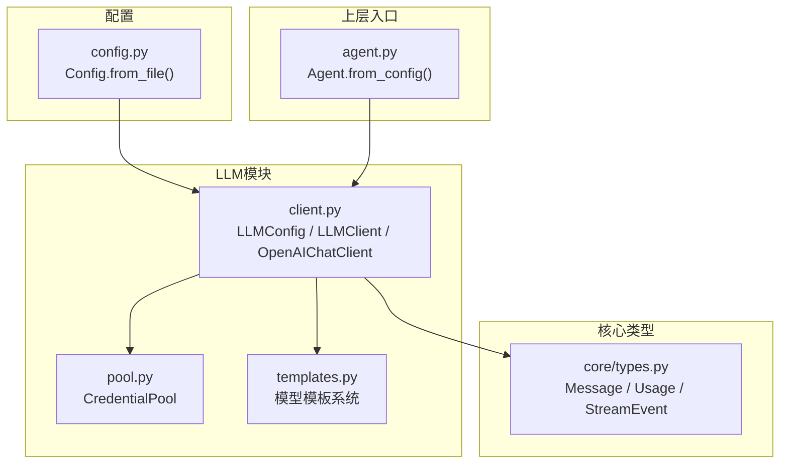
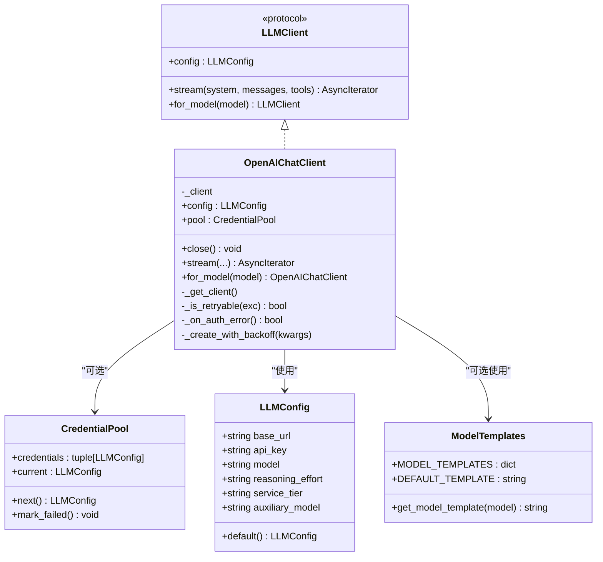
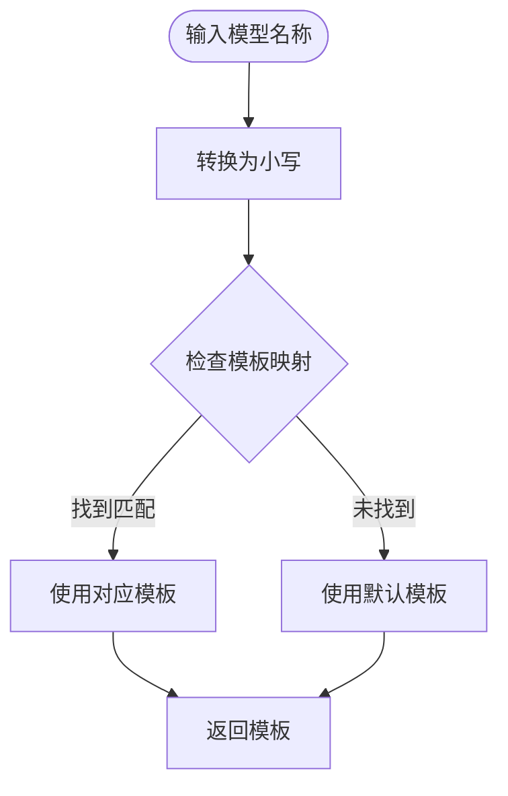
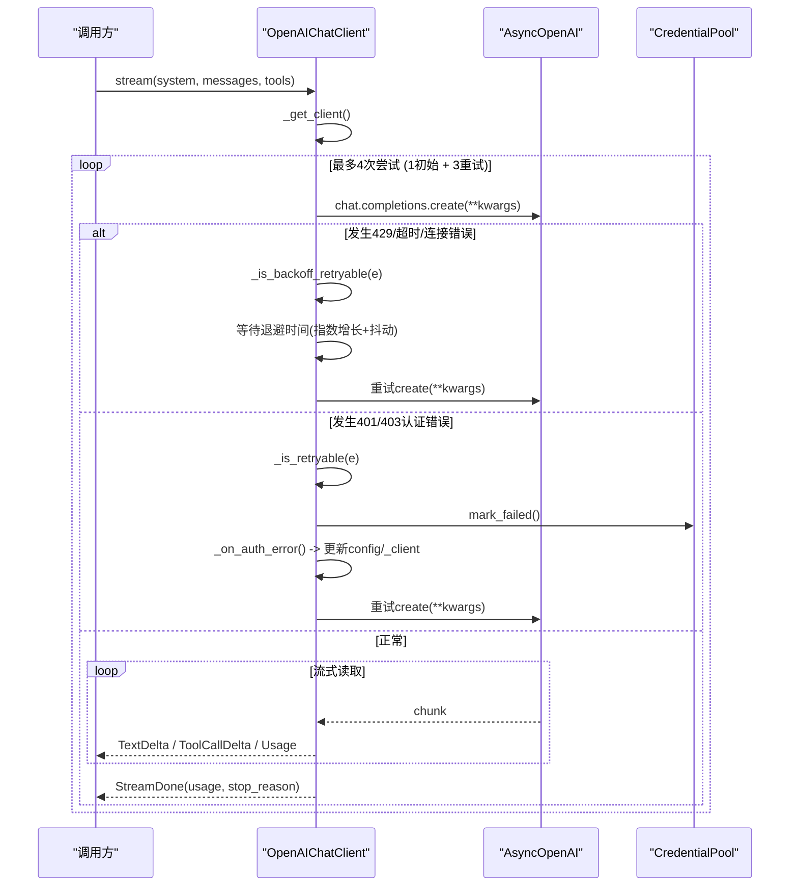
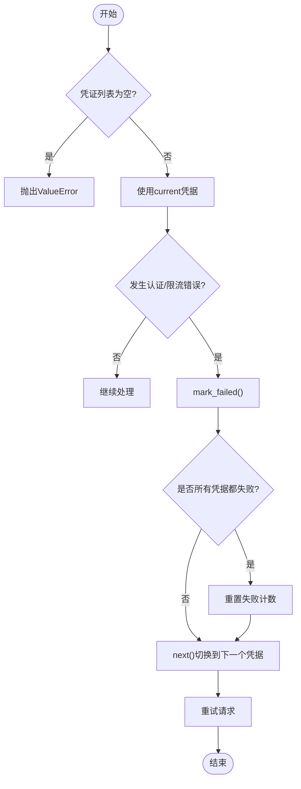
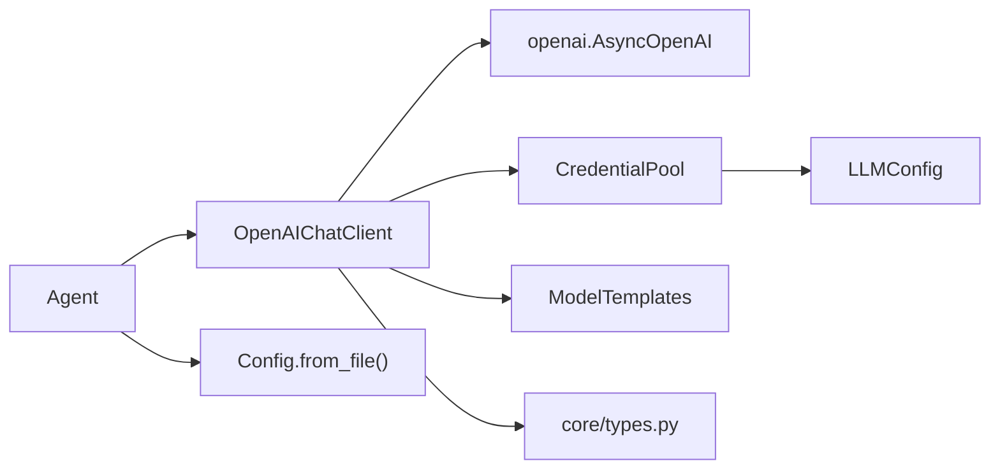

# LLM客户端

<cite>
**本文引用的文件**   
- [src/microagent/llm/client.py](file://src/microagent/llm/client.py)
- [src/microagent/llm/pool.py](file://src/microagent/llm/pool.py)
- [src/microagent/llm/templates.py](file://src/microagent/llm/templates.py)
- [src/microagent/config.py](file://src/microagent/config.py)
- [src/microagent/core/types.py](file://src/microagent/core/types.py)
- [src/microagent/agent.py](file://src/microagent/agent.py)
- [tests/unit/test_credential_pool.py](file://tests/unit/test_credential_pool.py)
- [tests/unit/fake_llm.py](file://tests/unit/fake_llm.py)
- [tests/integration/test_real_api.py](file://tests/integration/test_real_api.py)
- [tests/unit/test_backoff_retry.py](file://tests/unit/test_backoff_retry.py)
- [tests/unit/test_v05_features.py](file://tests/unit/test_v05_features.py)
</cite>

## 更新摘要
**所做更改**   
- 新增模型模板系统章节，详细说明DeepSeek-V4、GLM-5.2、Kimi K3等模型的专用提示词
- 更新LLMConfig配置选项，添加auxiliary_model字段用于成本优化
- 增强重试和退避机制说明，包括抖动指数退避算法
- 更新架构总览图，包含新的模板系统组件
- 扩展故障排查指南，涵盖新功能的常见问题

## 目录
1. [简介](#简介)
2. [项目结构](#项目结构)
3. [核心组件](#核心组件)
4. [架构总览](#架构总览)
5. [详细组件分析](#详细组件分析)
6. [依赖关系分析](#依赖关系分析)
7. [性能与监控最佳实践](#性能与监控最佳实践)
8. [故障排查指南](#故障排查指南)
9. [结论](#结论)
10. [附录：自定义LLM客户端开发指南](#附录自定义llm客户端开发指南)

## 简介
本文件面向MicroAgent的LLM客户端子系统，系统性阐述配置、实现、凭据池、重试与错误处理、流式响应处理以及扩展开发要点。重点包括：
- LLMConfig的配置项说明（base_url、api_key、model、auxiliary_model等）
- OpenAIChatClient对OpenAI兼容/v1/chat/completions端点的支持
- CredentialPool的多账户轮换与负载均衡机制
- **新增**：模型模板系统支持不同模型的专用提示词
- 网络异常、API限流、模型不可用等场景的重试与错误处理策略
- 流式响应的实时输出与中断控制
- 自定义LLM客户端的开发指南（支持其他AI服务提供商）
- 性能优化与监控的最佳实践

## 项目结构
LLM相关代码位于src/microagent/llm目录，包含抽象协议、默认实现、凭据池和模型模板；配置解析在src/microagent/config.py；类型定义在src/microagent/core/types.py；上层入口在src/microagent/agent.py。测试覆盖单元与集成用例。

**图表来源**
- [src/microagent/llm/client.py:93-118](file://src/microagent/llm/client.py#L93-L118)
- [src/microagent/llm/pool.py:15-56](file://src/microagent/llm/pool.py#L15-L56)
- [src/microagent/llm/templates.py:11-30](file://src/microagent/llm/templates.py#L11-L30)
- [src/microagent/config.py:28-71](file://src/microagent/config.py#L28-L71)
- [src/microagent/core/types.py:17-68](file://src/microagent/core/types.py#L17-L68)
- [src/microagent/agent.py:31-77](file://src/microagent/agent.py#L31-L77)

**章节来源**
- [src/microagent/llm/client.py:1-396](file://src/microagent/llm/client.py#L1-L396)
- [src/microagent/llm/pool.py:1-56](file://src/microagent/llm/pool.py#L1-L56)
- [src/microagent/llm/templates.py:1-43](file://src/microagent/llm/templates.py#L1-L43)
- [src/microagent/config.py:1-101](file://src/microagent/config.py#L1-L101)
- [src/microagent/core/types.py:1-189](file://src/microagent/core/types.py#L1-L189)
- [src/microagent/agent.py:1-113](file://src/microagent/agent.py#L1-L113)

## 核心组件
- LLMConfig：OpenAI兼容的LLM配置数据类，包含base_url、api_key、model、reasoning_effort、service_tier及**新增**auxiliary_model字段。提供默认工厂方法。
- LLMClient协议：定义stream与for_model接口，统一不同提供商的调用方式。
- OpenAIChatClient：基于openai SDK v2的AsyncOpenAI封装，支持工具调用增量累积、流式事件、成本估算、凭据池轮换。
- **新增**：ModelTemplates：模型模板系统，为不同模型提供专用提示词模板。
- CredentialPool：多凭据轮换器，失败时自动切换到下一个凭据，全部失败后重置循环。
- 类型系统：Message、Usage、TextDelta、ToolCallDelta、StreamDone等用于消息与流事件。

**章节来源**
- [src/microagent/llm/client.py:93-118](file://src/microagent/llm/client.py#L93-L118)
- [src/microagent/llm/client.py:141-156](file://src/microagent/llm/client.py#L141-L156)
- [src/microagent/llm/client.py:163-218](file://src/microagent/llm/client.py#L163-L218)
- [src/microagent/llm/templates.py:11-30](file://src/microagent/llm/templates.py#L11-L30)
- [src/microagent/llm/pool.py:15-56](file://src/microagent/llm/pool.py#L15-L56)
- [src/microagent/core/types.py:17-68](file://src/microagent/core/types.py#L17-L68)
- [src/microagent/core/types.py:123-188](file://src/microagent/core/types.py#L123-L188)

## 架构总览
OpenAIChatClient通过LLMClient协议暴露统一的流式接口，内部使用AsyncOpenAI发起/v1/chat/completions请求。CredentialPool为认证失败或限流时提供自动轮换。**新增**的模型模板系统根据模型名称自动选择合适的系统提示词。上层Agent从Config构建LLM实例并驱动SessionRunner消费流事件。

**图表来源**
- [src/microagent/llm/client.py:93-118](file://src/microagent/llm/client.py#L93-L118)
- [src/microagent/llm/client.py:141-156](file://src/microagent/llm/client.py#L141-L156)
- [src/microagent/llm/client.py:163-218](file://src/microagent/llm/client.py#L163-L218)
- [src/microagent/llm/templates.py:11-30](file://src/microagent/llm/templates.py#L11-L30)
- [src/microagent/llm/pool.py:15-56](file://src/microagent/llm/pool.py#L15-L56)

## 详细组件分析

### LLMConfig配置选项
- base_url：OpenAI兼容API端点，例如https://api.openai.com/v1或本地vLLM/Ollama地址。
- api_key：鉴权密钥，可为空以适配某些本地服务。
- model：模型标识符，如gpt-4o、claude-sonnet-4等。
- reasoning_effort：针对o系列模型的推理强度，取值'low'/'medium'/'high'。
- service_tier：服务层级，如'auto'/'default'/'flex'。
- **新增**：auxiliary_model：辅助模型，用于压缩和摘要生成等低成本任务，可设置为更便宜的模型以优化成本。
- 默认值：可通过LLMConfig.default()获取默认配置。

**章节来源**
- [src/microagent/llm/client.py:93-118](file://src/microagent/llm/client.py#L93-L118)
- [src/microagent/config.py:28-71](file://src/microagent/config.py#L28-L71)

### 模型模板系统
**新增功能**：模型模板系统为不同AI模型提供专用的系统提示词，优化各模型的表现。

#### 支持的模型模板
- **deepseek-v4**：专注于代码生成、分析和逐步推理，强调清晰性和正确性
- **glm-5.2**：支持中英文双语，根据用户查询语言匹配响应语言
- **kimi-k3**：专长于长上下文理解和文档分析，适合处理大型文档

#### 模板匹配机制
- 使用前缀匹配算法，支持模型版本后缀
- 未知模型自动回退到默认模板
- 模板内容针对各模型特性进行优化

**图表来源**
- [src/microagent/llm/templates.py:33-42](file://src/microagent/llm/templates.py#L33-L42)

**章节来源**
- [src/microagent/llm/templates.py:1-43](file://src/microagent/llm/templates.py#L1-L43)
- [tests/unit/test_v05_features.py:15-41](file://tests/unit/test_v05_features.py#L15-L41)

### OpenAIChatClient实现要点
- 使用openai SDK v2的AsyncOpenAI，仅通过base_url与api_key切换后端，无需适配器。
- stream方法：
  - 构造system与messages，支持tools参数。
  - 启用stream_options.include_usage以获取用量统计。
  - 按chunk迭代，累积tool_call片段，最终一次性发出完整ToolCallDelta。
  - 捕获usage并在最后yield StreamDone。
- **增强**：重试机制：
  - _is_retryable识别401/403/429状态码（含代理/网关错误）。
  - _create_with_backoff实现抖动指数退避算法，最大重试3次。
  - _on_auth_error触发凭据轮换，重建客户端并重试一次。
- for_model：返回新实例，保持pool不变但替换model。
- close：释放底层连接池。

**图表来源**
- [src/microagent/llm/client.py:200-225](file://src/microagent/llm/client.py#L200-L225)
- [src/microagent/llm/client.py:275-282](file://src/microagent/llm/client.py#L275-L282)
- [src/microagent/llm/pool.py:49-56](file://src/microagent/llm/pool.py#L49-L56)

**章节来源**
- [src/microagent/llm/client.py:163-218](file://src/microagent/llm/client.py#L163-L218)
- [src/microagent/llm/client.py:200-225](file://src/microagent/llm/client.py#L200-L225)
- [src/microagent/llm/client.py:275-282](file://src/microagent/llm/client.py#L275-L282)
- [src/microagent/llm/client.py:287-396](file://src/microagent/llm/client.py#L287-L396)

### 凭据池CredentialPool管理机制
- 初始化校验：至少一个LLMConfig。
- current属性：当前使用的凭据。
- next()：轮转到下一个凭据（循环）。
- mark_failed()：标记当前凭据失败，若所有凭据均失败则重置计数器并回到第一个。
- 典型用法：在OpenAIChatClient中遇到认证/限流错误时调用，自动切换至下一个key并重试。

**图表来源**
- [src/microagent/llm/pool.py:36-56](file://src/microagent/llm/pool.py#L36-L56)

**章节来源**
- [src/microagent/llm/pool.py:1-56](file://src/microagent/llm/pool.py#L1-L56)
- [tests/unit/test_credential_pool.py:1-54](file://tests/unit/test_credential_pool.py#L1-L54)

### 流式响应处理与中断控制
- 事件类型：
  - TextDelta：文本增量，kind区分content/thinking。
  - ToolCallDelta：工具调用完成后的完整参数。
  - Usage：用量统计（input_tokens、output_tokens、cost_usd）。
  - StreamDone：流结束，携带usage与stop_reason。
- 处理流程：
  - 逐chunk读取，立即yield文本增量以实现实时输出。
  - 累积tool_call片段，结束后一次性发出完整ToolCallDelta。
  - 最后yield Usage与StreamDone。
- 中断控制：
  - 调用方可通过取消异步任务或关闭上游资源来中断流式读取。
  - SessionRunner在遇到stop_reason='length'时会持久化部分响应并上报TurnFailed。

**章节来源**
- [src/microagent/core/types.py:123-188](file://src/microagent/core/types.py#L123-L188)
- [src/microagent/llm/client.py:287-396](file://src/microagent/llm/client.py#L287-L396)

### 错误处理与重试策略
- **增强的**重试机制：
  - 可重试错误：429（限流）、超时、连接错误、5xx服务器错误。
  - 不可重试错误：401/403（认证错误，由凭据池处理）、400（请求错误）。
  - 退避策略：指数退避 + 抖动，最大重试3次，基础延迟2秒，抖动±25%。
- 处理逻辑：
  - OpenAIChatClient._is_backoff_retryable识别可退避重试的错误类型。
  - _create_with_backoff实现带抖动的指数退避算法。
  - _is_retryable识别需要凭据轮换的认证/限流错误。
  - _on_auth_error触发凭据轮换并重建客户端，重试一次。
  - 非可重试错误直接向上抛出。
- 会话层处理：
  - SessionRunner在流结束时根据stop_reason判断是否截断，并消耗预算、持久化历史、上报TurnFailed。

**章节来源**
- [src/microagent/llm/client.py:200-225](file://src/microagent/llm/client.py#L200-L225)
- [src/microagent/llm/client.py:233-274](file://src/microagent/llm/client.py#L233-L274)
- [src/microagent/llm/client.py:275-282](file://src/microagent/llm/client.py#L275-L282)

### 辅助模型（Auxiliary Model）功能
**新增功能**：auxiliary_model字段用于成本优化，允许在主模型之外指定一个更便宜或更快的模型用于特定任务。

- **用途**：
  - 上下文压缩和摘要生成
  - 预处理和后处理任务
  - 低成本验证和过滤
- **配置方式**：
  - 在LLMConfig中设置auxiliary_model字段
  - 默认为None，表示不使用辅助模型
- **成本优化**：
  - 主模型用于复杂推理和生成
  - 辅助模型用于简单任务和批量处理
  - 显著降低整体API调用成本

**章节来源**
- [src/microagent/llm/client.py:114-122](file://src/microagent/llm/client.py#L114-L122)
- [tests/unit/test_v05_features.py:43-56](file://tests/unit/test_v05_features.py#L43-L56)

## 依赖关系分析
- OpenAIChatClient依赖openai SDK v2的AsyncOpenAI，通过base_url与api_key切换后端。
- CredentialPool依赖LLMConfig，管理多个凭据的轮换。
- **新增**：ModelTemplates依赖字符串匹配算法，为不同模型提供专用提示词。
- Agent从Config构建OpenAIChatClient并注入SessionRunner。
- 类型系统Message/Usage/StreamEvent贯穿整个调用链。

**图表来源**
- [src/microagent/agent.py:31-77](file://src/microagent/agent.py#L31-77)
- [src/microagent/config.py:28-71](file://src/microagent/config.py#L28-71)
- [src/microagent/llm/client.py:163-218](file://src/microagent/llm/client.py#L163-218)
- [src/microagent/llm/templates.py:11-30](file://src/microagent/llm/templates.py#L11-30)
- [src/microagent/core/types.py:17-68](file://src/microagent/core/types.py#L17-68)

**章节来源**
- [src/microagent/agent.py:1-113](file://src/microagent/agent.py#L1-L113)
- [src/microagent/config.py:1-101](file://src/microagent/config.py#L1-L101)
- [src/microagent/llm/client.py:1-396](file://src/microagent/llm/client.py#L1-L396)
- [src/microagent/llm/templates.py:1-43](file://src/microagent/llm/templates.py#L1-L43)
- [src/microagent/core/types.py:1-189](file://src/microagent/core/types.py#L1-L189)

## 性能与监控最佳实践
- 连接复用：OpenAIChatClient缓存AsyncOpenAI实例，避免重复创建连接开销。
- 流式输出：优先使用stream接口，减少首字延迟，提升用户体验。
- **新增**：模型模板优化：使用专用模板提升各模型表现，减少提示词工程成本。
- **新增**：辅助模型策略：使用便宜的辅助模型处理简单任务，降低成本。
- 用量统计：通过Usage.cost_usd估算成本，结合SessionRunner的Budget进行配额控制。
- 上下文窗口：根据模型上下文窗口自适应压缩阈值，避免超限。
- **增强**：重试优化：合理的退避策略减少API限流影响，提高成功率。
- 监控建议：
  - 记录每次调用的input/output tokens与cost_usd。
  - 统计重试次数与失败原因（认证、限流、网络异常）。
  - 监控流式事件的吞吐与延迟。
  - 跟踪模型模板使用情况，评估效果。
  - 监控辅助模型的使用频率和成本节省。
- 优化建议：
  - 合理设置max_iterations避免无限循环。
  - 对长对话使用压缩策略降低token消耗。
  - 使用本地或低成本模型进行预处理与摘要生成。
  - 根据模型特性选择合适的系统提示词模板。

**章节来源**
- [src/microagent/llm/client.py:287-396](file://src/microagent/llm/client.py#L287-L396)
- [src/microagent/llm/templates.py:11-30](file://src/microagent/llm/templates.py#L11-L30)

## 故障排查指南
- 认证失败（401/403）：
  - 检查api_key是否正确，确认base_url是否指向正确的服务。
  - 启用CredentialPool自动轮换，确保备用key可用。
  - 注意：认证错误不会触发退避重试，而是直接进行凭据轮换。
- API限流（429）：
  - 降低并发请求数，增加重试间隔。
  - 使用多key轮换分摊负载。
  - 利用退避重试机制自动恢复。
- 模型不可用：
  - 检查model参数是否与后端支持的模型匹配。
  - 使用for_model切换备用模型。
  - 确认模型模板是否正确配置。
- **新增**：模型模板问题：
  - 检查模型名称是否符合预期格式。
  - 验证模板匹配逻辑是否正常工作。
  - 确认未知模型会回退到默认模板。
- **新增**：辅助模型配置：
  - 检查auxiliary_model字段是否正确设置。
  - 确认辅助模型是否可用且成本更低。
  - 验证辅助模型的任务分配是否合理。
- 流式响应异常：
  - 检查chunk格式是否符合预期，确保正确处理finish_reason。
  - 对于截断响应，确认SessionRunner已持久化部分结果并上报TurnFailed。
- **增强**：重试相关问题：
  - 检查退避重试配置是否合理。
  - 确认不同类型的错误被正确分类处理。
  - 监控重试次数和成功率。
- 调试技巧：
  - 使用FakeLLMClient模拟流式响应进行单元测试。
  - 集成测试通过环境变量配置真实API端点进行端到端验证。
  - 启用详细日志记录重试和错误处理过程。

**章节来源**
- [src/microagent/llm/client.py:200-225](file://src/microagent/llm/client.py#L200-L225)
- [src/microagent/llm/client.py:233-274](file://src/microagent/llm/client.py#L233-L274)
- [src/microagent/llm/templates.py:33-42](file://src/microagent/llm/templates.py#L33-L42)
- [tests/unit/test_backoff_retry.py:1-189](file://tests/unit/test_backoff_retry.py#L1-L189)
- [tests/unit/test_v05_features.py:15-56](file://tests/unit/test_v05_features.py#L15-L56)

## 结论
MicroAgent的LLM客户端提供了简洁而强大的抽象层，支持OpenAI兼容的任意后端，具备完善的凭据轮换、错误处理与流式响应能力。**新增的模型模板系统**为不同AI模型提供专用提示词，优化各模型表现。**增强的重试和退避机制**提高了系统的稳定性和容错能力。**辅助模型功能**为成本优化提供了灵活的选择。通过LLMConfig灵活配置、CredentialPool可靠轮换、OpenAIChatClient高效实现，开发者可以快速集成多种AI服务提供商，同时获得良好的性能与可观测性。

## 附录：自定义LLM客户端开发指南
- 实现LLMClient协议：
  - 定义config属性（LLMConfig类型）。
  - 实现stream方法，返回AsyncIterator[StreamEvent]。
  - 实现for_model方法，返回新的客户端实例。
- 流式事件规范：
  - 文本增量使用TextDelta，工具调用完成后发送ToolCallDelta。
  - 最后发送Usage与StreamDone。
- **新增**：模型模板集成：
  - 可选择性地使用ModelTemplates.get_model_template()获取专用提示词。
  - 支持前缀匹配的模板选择机制。
- **增强**：错误处理和重试：
  - 实现_is_backoff_retryable方法识别可退避重试的错误。
  - 实现_is_retryable方法识别需要凭据轮换的错误。
  - 集成_jittered exponential backoff算法。
- 示例参考：
  - FakeLLMClient展示了如何模拟流式响应进行单元测试。
  - 集成测试展示了如何配置真实API端点进行端到端验证。

**章节来源**
- [src/microagent/llm/client.py:141-156](file://src/microagent/llm/client.py#L141-L156)
- [src/microagent/llm/templates.py:33-42](file://src/microagent/llm/templates.py#L33-L42)
- [tests/unit/fake_llm.py:22-74](file://tests/unit/fake_llm.py#L22-L74)
- [tests/integration/test_real_api.py:1-220](file://tests/integration/test_real_api.py#L1-L220)