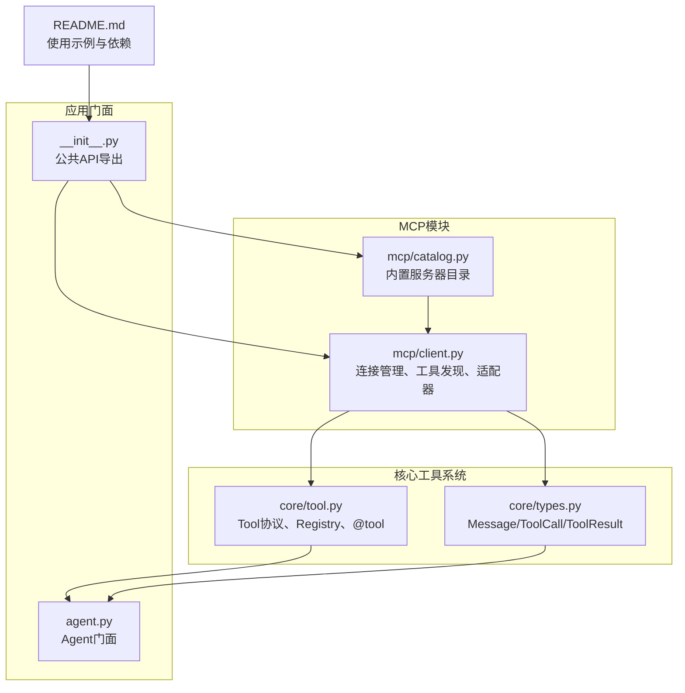
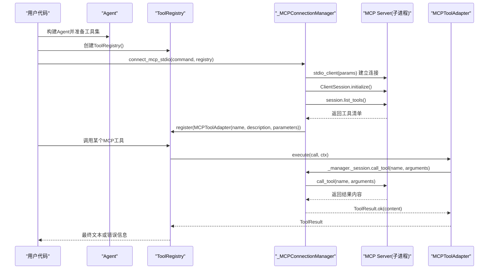
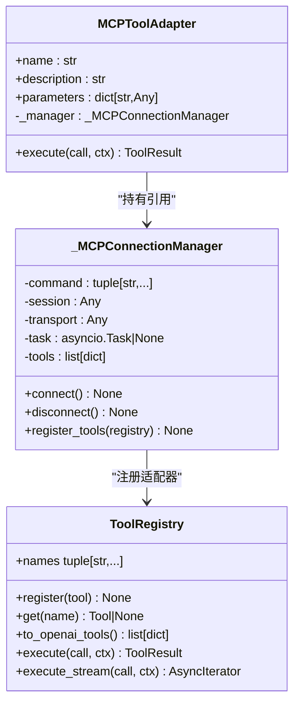
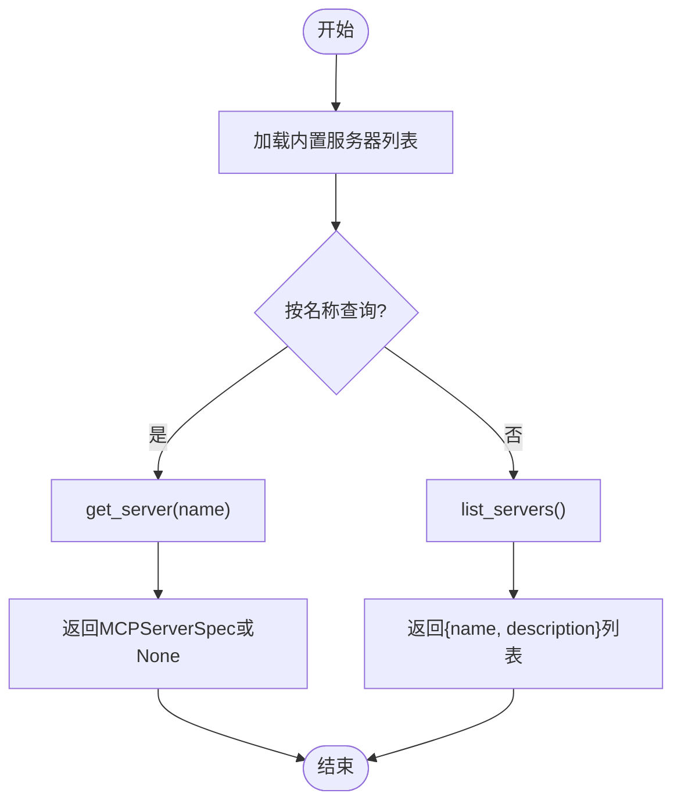
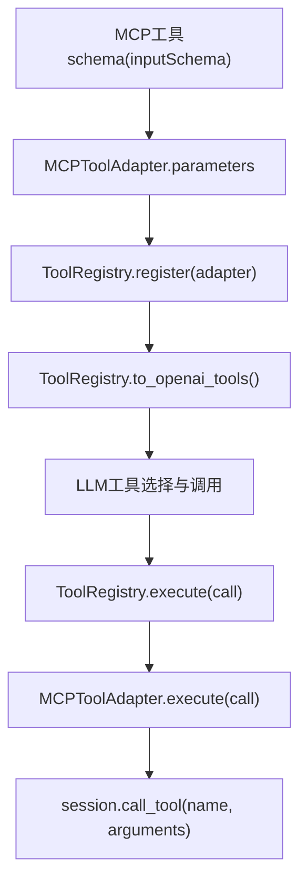
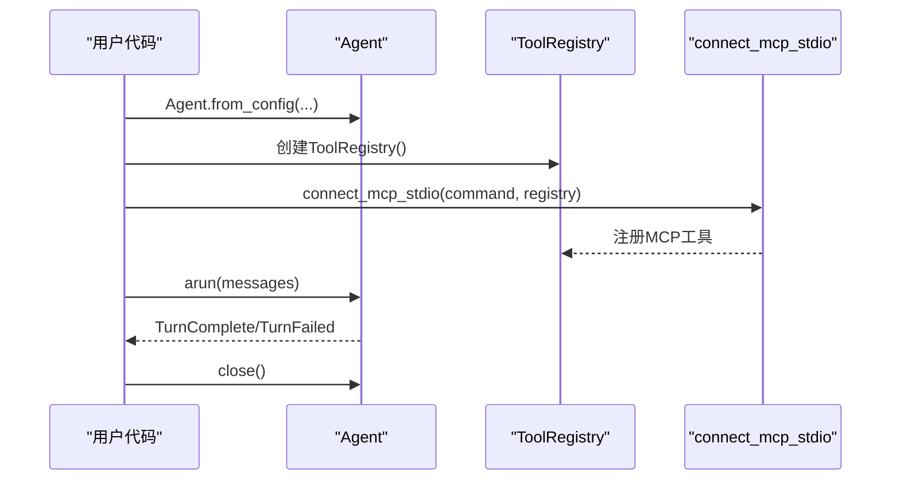
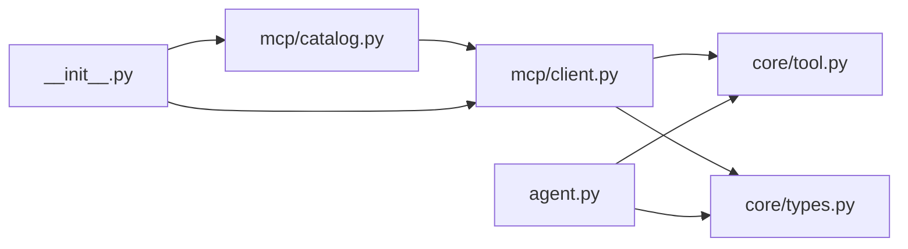

# MCP集成

<cite>
**本文引用的文件**   
- [src/microagent/mcp/client.py](file://src/microagent/mcp/client.py)
- [src/microagent/mcp/catalog.py](file://src/microagent/mcp/catalog.py)
- [src/microagent/core/tool.py](file://src/microagent/core/tool.py)
- [src/microagent/core/types.py](file://src/microagent/core/types.py)
- [src/microagent/agent.py](file://src/microagent/agent.py)
- [src/microagent/__init__.py](file://src/microagent/__init__.py)
- [README.md](file://README.md)
</cite>

## 目录
1. [简介](#简介)
2. [项目结构](#项目结构)
3. [核心组件](#核心组件)
4. [架构总览](#架构总览)
5. [详细组件分析](#详细组件分析)
6. [依赖关系分析](#依赖关系分析)
7. [性能考量](#性能考量)
8. [故障排查指南](#故障排查指南)
9. [结论](#结论)
10. [附录](#附录)

## 简介
本文件面向MicroAgent的MCP（Model Context Protocol）集成，系统性阐述：
- MCP协议工作原理与标准规范（stdio传输、工具发现、消息格式等）
- MicroAgent中MCP客户端的实现（连接建立、工具注册、调用转发）
- Catalog机制（外部MCP服务器的工具发现与自动注册）
- 工具参数映射与转换（确保与MicroAgent工具系统兼容）
- MCP服务器开发与集成指南（工具定义、参数校验、错误处理）
- 安全考虑与最佳实践（输入验证、资源限制、访问控制）
- 故障排查与调试方法

## 项目结构
MicroAgent将MCP相关能力集中在mcp子模块中，并通过core工具系统与Agent编排层无缝对接。关键文件与职责如下：
- mcp/client.py：MCP客户端实现，基于官方mcp SDK，使用stdio传输；负责连接管理、工具发现、适配器封装与注册
- mcp/catalog.py：内置MCP服务器目录，提供常见MCP服务器的名称、描述与启动命令
- core/tool.py：Tool协议、FunctionTool、ToolRegistry与@tool装饰器，统一工具抽象与执行
- core/types.py：Message、ToolCall、ToolResult、事件类型等核心数据结构
- agent.py：Agent门面，组装Runner、Registry等组件，对外暴露run/arun接口
- __init__.py：统一导出connect_mcp_stdio、MCPServerSpec、BUILTIN_MCP_SERVERS、get_mcp_server、list_mcp_servers等API
- README.md：包含MCP客户端使用示例与可选依赖安装说明

**图表来源** 
- [src/microagent/mcp/client.py:1-152](file://src/microagent/mcp/client.py#L1-L152)
- [src/microagent/mcp/catalog.py:1-106](file://src/microagent/mcp/catalog.py#L1-L106)
- [src/microagent/core/tool.py:1-309](file://src/microagent/core/tool.py#L1-L309)
- [src/microagent/core/types.py:1-189](file://src/microagent/core/types.py#L1-L189)
- [src/microagent/agent.py:1-113](file://src/microagent/agent.py#L1-L113)
- [src/microagent/__init__.py:1-133](file://src/microagent/__init__.py#L1-L133)
- [README.md:307-320](file://README.md#L307-L320)

**章节来源**
- [src/microagent/mcp/client.py:1-152](file://src/microagent/mcp/client.py#L1-L152)
- [src/microagent/mcp/catalog.py:1-106](file://src/microagent/mcp/catalog.py#L1-L106)
- [src/microagent/core/tool.py:1-309](file://src/microagent/core/tool.py#L1-L309)
- [src/microagent/core/types.py:1-189](file://src/microagent/core/types.py#L1-L189)
- [src/microagent/agent.py:1-113](file://src/microagent/agent.py#L1-L113)
- [src/microagent/__init__.py:1-133](file://src/microagent/__init__.py#L1-L133)
- [README.md:307-320](file://README.md#L307-L320)

## 核心组件
- MCP客户端（_MCPConnectionManager、MCPToolAdapter、connect_mcp_stdio）
  - 通过stdio与外部MCP进程通信，维护会话生命周期
  - 初始化后调用list_tools获取工具清单，并转换为MicroAgent Tool实例
  - 所有由同一管理器创建的适配器共享同一会话，避免频繁重连
- Catalog（MCPServerSpec、BUILTIN_MCP_SERVERS、get_server、list_servers）
  - 预置常用MCP服务器（如filesystem、git、fetch、postgres、sqlite、github、brave-search、memory、puppeteer、sequential-thinking、time、everart）
  - 提供按名称查询与列表展示能力，简化用户接入
- 工具系统（Tool协议、FunctionTool、ToolRegistry、@tool）
  - 统一的Tool抽象，支持execute与可选的execute_stream
  - Registry负责注册、查找、OpenAI tools格式导出与执行分发
- 数据类型（Message、ToolCall、ToolResult、事件）
  - 贯穿SessionRunner、LLMClient与工具实现的通用数据结构

**章节来源**
- [src/microagent/mcp/client.py:24-152](file://src/microagent/mcp/client.py#L24-L152)
- [src/microagent/mcp/catalog.py:16-106](file://src/microagent/mcp/catalog.py#L16-L106)
- [src/microagent/core/tool.py:40-309](file://src/microagent/core/tool.py#L40-L309)
- [src/microagent/core/types.py:17-189](file://src/microagent/core/types.py#L17-L189)

## 架构总览
下图展示了从用户调用到MCP工具执行的端到端流程，以及Catalog在工具发现中的作用。

**图表来源** 
- [src/microagent/mcp/client.py:64-152](file://src/microagent/mcp/client.py#L64-L152)
- [src/microagent/core/tool.py:221-280](file://src/microagent/core/tool.py#L221-L280)
- [README.md:307-320](file://README.md#L307-L320)

## 详细组件分析

### MCP客户端实现
- 连接管理
  - 使用官方mcp SDK的StdioServerParameters与stdio_client，以子进程方式启动MCP服务器
  - 后台任务维持会话心跳，避免连接过早关闭
  - 初始化完成后轮询等待工具清单就绪，超时抛出异常
- 工具发现与注册
  - 调用session.list_tools()获取工具元数据（name、description、inputSchema）
  - 为每个工具生成MCPToolAdapter，封装execute逻辑，统一注入ToolRegistry
- 调用转发
  - 适配器在执行时检查会话是否已连接，未连接则返回错误
  - 通过session.call_tool(name, arguments)完成远程调用，并将结果包装为ToolResult

**图表来源** 
- [src/microagent/mcp/client.py:24-152](file://src/microagent/mcp/client.py#L24-L152)
- [src/microagent/core/tool.py:221-280](file://src/microagent/core/tool.py#L221-L280)

**章节来源**
- [src/microagent/mcp/client.py:49-152](file://src/microagent/mcp/client.py#L49-L152)

### Catalog机制（服务器目录）
- MCPServerSpec定义服务器元数据（名称、描述、启动命令）
- BUILTIN_MCP_SERVERS预置多种常用MCP服务器，覆盖文件系统、Git、HTTP抓取、数据库、GitHub API、搜索、时间、图像生成等场景
- get_server(name)与list_servers()提供查询与列举能力，便于上层按需启用

**图表来源** 
- [src/microagent/mcp/catalog.py:16-106](file://src/microagent/mcp/catalog.py#L16-L106)

**章节来源**
- [src/microagent/mcp/catalog.py:16-106](file://src/microagent/mcp/catalog.py#L16-L106)

### 工具参数映射与转换
- MCP工具的inputSchema直接作为MicroAgent工具的parameters字段，保持OpenAI函数调用JSON Schema一致性
- ToolRegistry.to_openai_tools()将工具集合导出为标准格式，供LLM侧工具调用选择
- 适配器在执行时将ToolCall.arguments原样传递给MCP server，无需额外转换

**图表来源** 
- [src/microagent/mcp/client.py:118-152](file://src/microagent/mcp/client.py#L118-L152)
- [src/microagent/core/tool.py:242-254](file://src/microagent/core/tool.py#L242-L254)

**章节来源**
- [src/microagent/mcp/client.py:118-152](file://src/microagent/mcp/client.py#L118-L152)
- [src/microagent/core/tool.py:242-254](file://src/microagent/core/tool.py#L242-L254)

### Agent门面与集成点
- Agent.from_config()构建Runner与Registry，默认加载内置工具；可通过tools参数扩展
- MCP工具通过connect_mcp_stdio注册到Registry后，即可被Agent正常调度与执行
- Agent.close()负责释放资源（Cron、Runner、LLM客户端），建议在使用完毕后调用

**图表来源** 
- [src/microagent/agent.py:31-113](file://src/microagent/agent.py#L31-L113)
- [src/microagent/mcp/client.py:130-152](file://src/microagent/mcp/client.py#L130-L152)

**章节来源**
- [src/microagent/agent.py:31-113](file://src/microagent/agent.py#L31-L113)

## 依赖关系分析
- mcp.client依赖core.tool.ToolRegistry与core.types.ToolCall/ToolResult
- mcp.catalog仅定义数据类与内置列表，无运行时依赖
- agent依赖core.tool.ToolRegistry与core.types.Message等
- __init__.py统一导出MCP相关API，便于外部使用

**图表来源** 
- [src/microagent/mcp/client.py:1-20](file://src/microagent/mcp/client.py#L1-L20)
- [src/microagent/core/tool.py:1-30](file://src/microagent/core/tool.py#L1-L30)
- [src/microagent/core/types.py:1-20](file://src/microagent/core/types.py#L1-L20)
- [src/microagent/agent.py:1-20](file://src/microagent/agent.py#L1-L20)
- [src/microagent/__init__.py:30-42](file://src/microagent/__init__.py#L30-L42)

**章节来源**
- [src/microagent/mcp/client.py:1-20](file://src/microagent/mcp/client.py#L1-L20)
- [src/microagent/core/tool.py:1-30](file://src/microagent/core/tool.py#L1-L30)
- [src/microagent/core/types.py:1-20](file://src/microagent/core/types.py#L1-L20)
- [src/microagent/agent.py:1-20](file://src/microagent/agent.py#L1-L20)
- [src/microagent/__init__.py:30-42](file://src/microagent/__init__.py#L30-L42)

## 性能考量
- 连接复用：_MCPConnectionManager在同一生命周期内复用会话，避免重复建立stdio连接与工具发现开销
- 心跳保活：后台任务周期性休眠以保持连接活跃，防止意外断开
- 超时保护：连接建立阶段设置最大等待时间，避免长时间阻塞
- 流式支持：ToolRegistry与FunctionTool支持execute_stream，MCP工具若具备流式输出可提升交互体验（当前适配器为一次性结果）
- 资源清理：显式disconnect与Agent.close确保子进程与异步任务正确释放

[本节为通用指导，不直接分析具体文件]

## 故障排查指南
- 连接超时
  - 现象：连接建立阶段轮询工具清单超时
  - 排查：确认MCP服务器命令是否正确、环境变量是否满足要求、网络与权限是否正常
  - 参考：连接超时抛出异常的位置
- 会话未连接
  - 现象：调用工具时报“session not connected”
  - 排查：确认connect_mcp_stdio已成功返回且未调用disconnect；检查后台任务是否被取消
- 工具不存在
  - 现象：Registry执行时报“unknown tool”
  - 排查：确认MCP服务器已列出该工具；检查名称是否一致
- 参数不匹配
  - 现象：MCP服务器拒绝调用或返回错误
  - 排查：核对inputSchema与传入arguments类型、必填项、约束条件
- 资源泄漏
  - 现象：进程未退出、内存持续增长
  - 排查：确保调用manager.disconnect()与Agent.close()

**章节来源**
- [src/microagent/mcp/client.py:98-116](file://src/microagent/mcp/client.py#L98-L116)
- [src/microagent/core/tool.py:256-280](file://src/microagent/core/tool.py#L256-L280)

## 结论
MicroAgent的MCP集成通过简洁的客户端实现与Catalog机制，将外部MCP服务器的工具无缝纳入统一工具系统。其优势包括：
- 标准化协议与传输（stdio）
- 自动工具发现与注册
- 与现有ToolRegistry和Agent编排体系深度集成
- 可扩展的服务器目录与丰富的内置示例

建议在集成第三方MCP服务器时遵循参数校验、错误处理与安全边界设计，并在生产环境做好资源管理与监控。

[本节为总结性内容，不直接分析具体文件]

## 附录

### MCP协议工作原理与标准规范（概述）
- 传输层：stdio（子进程标准输入/输出）
- 会话初始化：initialize
- 工具发现：list_tools
- 工具调用：call_tool（name、arguments）
- 结果返回：content（字符串或结构化内容）

[本节为概念性说明，不直接分析具体文件]

### MCP服务器开发与集成指南（概述）
- 工具定义：声明name、description、inputSchema（OpenAI函数调用JSON Schema）
- 参数校验：在服务端对arguments进行严格校验，返回错误信息
- 错误处理：对异常进行捕获并返回友好错误内容
- 安全边界：限制文件系统路径、网络访问、资源用量等
- 兼容性：确保inputSchema与MicroAgent期望一致，避免类型不匹配

[本节为概念性说明，不直接分析具体文件]

### 安全考虑与最佳实践（概述）
- 输入验证：服务端对arguments进行白名单与格式校验
- 资源限制：限制CPU、内存、I/O、网络请求频率与大小
- 访问控制：基于角色或上下文授权，最小权限原则
- 审计与日志：记录工具调用与结果摘要，便于追踪
- 超时与熔断：设置合理超时与重试策略，避免级联失败

[本节为概念性说明，不直接分析具体文件]

### 使用示例与安装
- 安装可选依赖：pip install microagent[mcp]
- 连接MCP服务器并注册工具：connect_mcp_stdio(("uvx", "mcp-server-git"), registry)
- 查看可用工具：registry.names

**章节来源**
- [README.md:307-320](file://README.md#L307-L320)