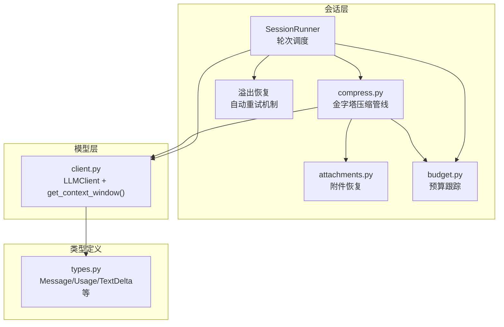
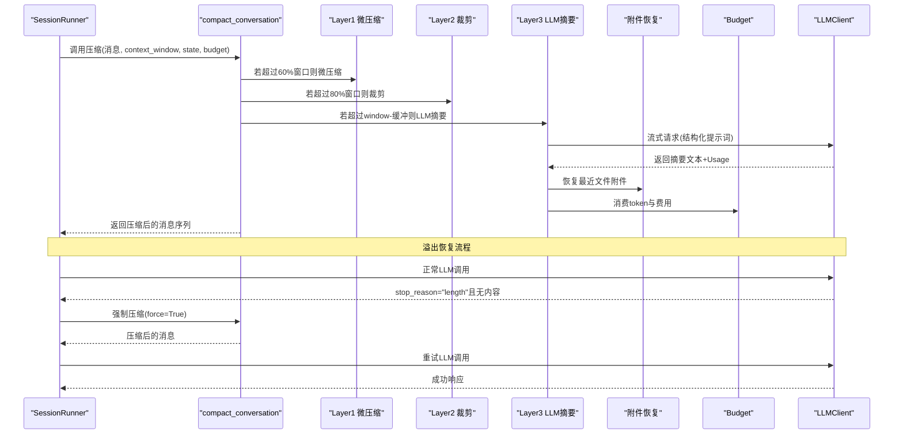
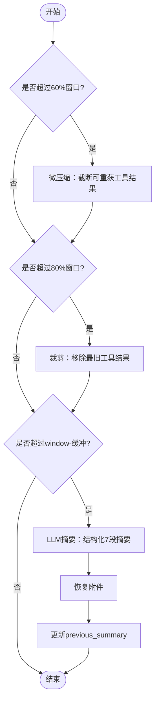
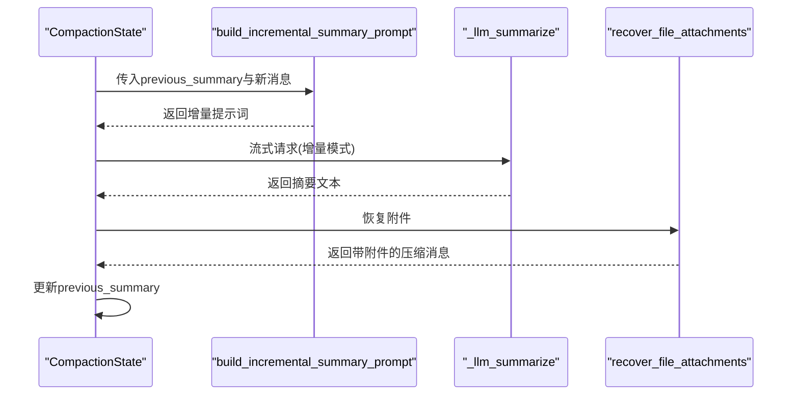
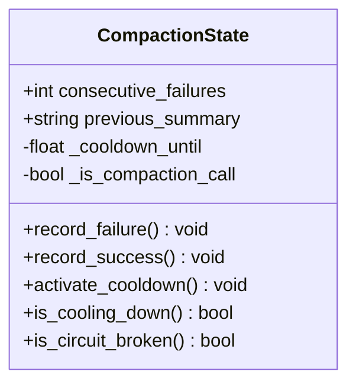
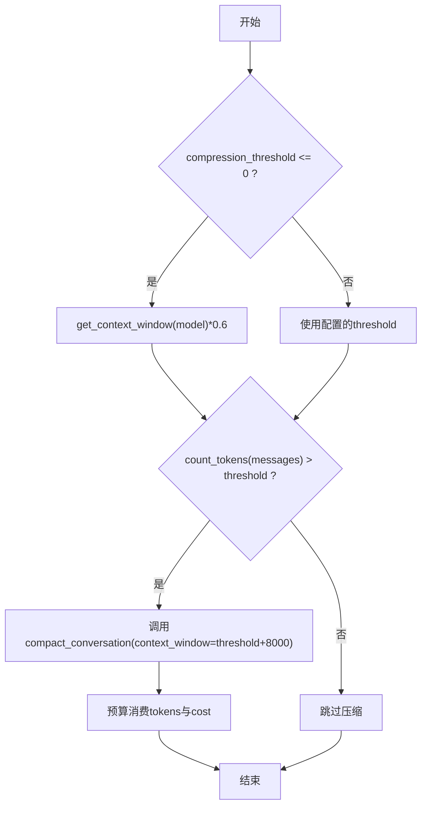
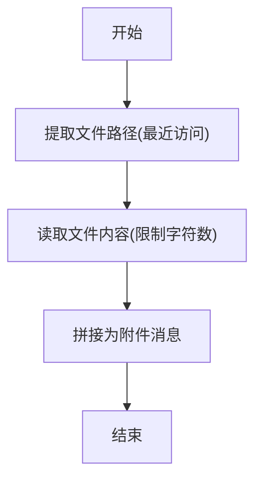
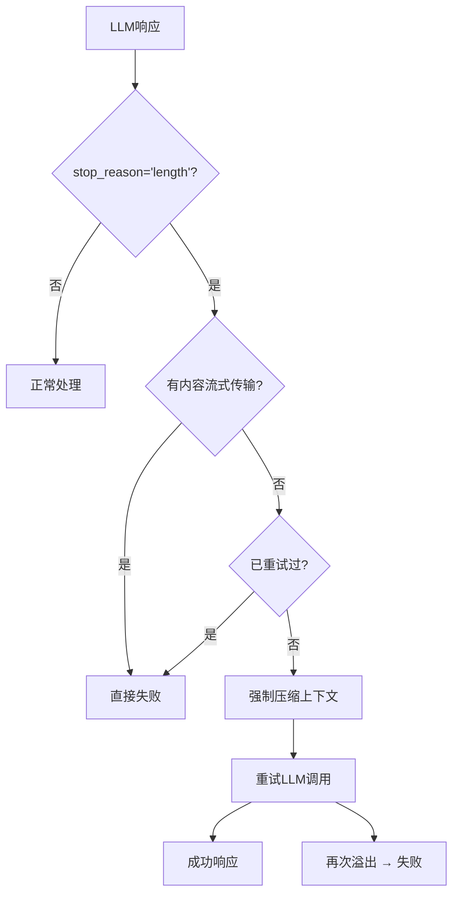
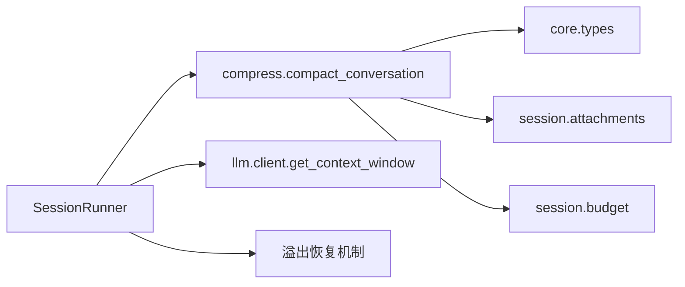

# 上下文压缩

<cite>
**本文引用的文件**   
- [compress.py](file://src/microagent/session/compress.py)
- [attachments.py](file://src/microagent/session/attachments.py)
- [budget.py](file://src/microagent/session/budget.py)
- [types.py](file://src/microagent/core/types.py)
- [runner.py](file://src/microagent/session/runner.py)
- [client.py](file://src/microagent/llm/client.py)
- [test_compaction_pyramid.py](file://tests/unit/test_compaction_pyramid.py)
- [test_compression.py](file://tests/unit/test_compression.py)
- [test_incremental_compaction.py](file://tests/unit/test_incremental_compaction.py)
- [test_overflow_recovery.py](file://tests/unit/test_overflow_recovery.py)
</cite>

## 更新摘要
**所做更改**   
- 新增溢出恢复机制章节，详细说明自动重试和上下文窗口调整
- 更新架构总览图，包含溢出恢复流程
- 增强故障排查指南，添加溢出恢复相关问题的解决方案
- 更新性能考量部分，包含溢出恢复的配置建议

## 目录
1. [简介](#简介)
2. [项目结构](#项目结构)
3. [核心组件](#核心组件)
4. [架构总览](#架构总览)
5. [详细组件分析](#详细组件分析)
6. [溢出恢复机制](#溢出恢复机制)
7. [依赖关系分析](#依赖关系分析)
8. [性能考量与调优](#性能考量与调优)
9. [故障排查指南](#故障排查指南)
10. [结论](#结论)
11. [附录：配置项与评估指标](#附录配置项与评估指标)

## 简介
本文件面向 MicroAgent 的"上下文压缩"子系统，系统性阐述其金字塔压缩算法、增量压缩机制、CompactionState 状态管理、预算与阈值控制、以及失败回退策略。文档同时提供可操作的配置建议、效果评估方法与性能调优要点，帮助读者在长对话场景下稳定维持高质量上下文，避免上下文溢出导致的任务中断。**最新更新**：增强了溢出恢复机制，系统在检测到 LLM 响应溢出时自动进行压缩并重试，确保请求能够成功完成。

## 项目结构
MicroAgent 将上下文压缩能力集中在 session 模块中，并通过 runner 在对话轮次中自动触发；LLM 客户端负责流式生成摘要；附件恢复模块在摘要后补充关键文件内容；预算模块对 LLM 调用进行成本与 token 消耗管控。

**图表来源**
- [runner.py:130-170](file://src/microagent/session/runner.py#L130-L170)
- [compress.py:324-421](file://src/microagent/session/compress.py#L324-L421)
- [attachments.py:109-145](file://src/microagent/session/attachments.py#L109-L145)
- [client.py:80-85](file://src/microagent/llm/client.py#L80-L85)
- [budget.py:99-130](file://src/microagent/session/budget.py#L99-L130)
- [types.py:17-40](file://src/microagent/core/types.py#L17-L40)

章节来源
- [runner.py:130-170](file://src/microagent/session/runner.py#L130-L170)
- [compress.py:1-561](file://src/microagent/session/compress.py#L1-L561)
- [attachments.py:1-145](file://src/microagent/session/attachments.py#L1-L145)
- [budget.py:1-169](file://src/microagent/session/budget.py#L1-L169)
- [client.py:60-85](file://src/microagent/llm/client.py#L60-L85)
- [types.py:17-40](file://src/microagent/core/types.py#L17-L40)

## 核心组件
- 金字塔压缩管线（四层）：
  - Layer 1：微压缩（零 API 成本），截断可重获的工具结果
  - Layer 2：裁剪（零 API 成本），移除最旧工具结果消息
  - Layer 3：结构化 LLM 摘要（一次 API 调用），支持增量更新
  - Layer 4：熔断器（连续失败保护与冷却）
  - Layer 5：全量转储（兜底安全网，追加关键文件原文）
- CompactionState：记录压缩历史、失败计数、冷却时间与递归保护
- 预算系统：按 token 与费用消耗进行树形预算追踪，超限抛出异常
- 附件恢复：摘要后恢复最近访问的文件片段，保持文件级上下文
- **溢出恢复机制**：检测 LLM 响应溢出，自动压缩上下文并重试
- 上下文窗口与阈值：根据模型上下文窗口自适应计算压缩阈值

章节来源
- [compress.py:1-561](file://src/microagent/session/compress.py#L1-L561)
- [budget.py:1-169](file://src/microagent/session/budget.py#L1-L169)
- [attachments.py:1-145](file://src/microagent/session/attachments.py#L1-L145)
- [client.py:60-85](file://src/microagent/llm/client.py#L60-L85)
- [runner.py:209-244](file://src/microagent/session/runner.py#L209-L244)

## 架构总览
下图展示一次自动压缩触发的端到端流程，包括溢出恢复机制：Runner 检测消息数与 token 阈值，调用 compact_conversation；压缩管线依次执行 L1/L2/L3，必要时走 L4 熔断或 L5 兜底；当检测到 LLM 响应溢出时，自动触发压缩并重试；摘要成功后通过附件恢复模块补回关键文件内容；预算模块记录 LLM 摘要的 token 与费用。

**图表来源**
- [runner.py:138-162](file://src/microagent/session/runner.py#L138-L162)
- [compress.py:324-421](file://src/microagent/session/compress.py#L324-L421)
- [attachments.py:109-145](file://src/microagent/session/attachments.py#L109-L145)
- [budget.py:99-130](file://src/microagent/session/budget.py#L99-L130)
- [client.py:219-259](file://src/microagent/llm/client.py#L219-L259)

## 详细组件分析

### 金字塔压缩算法（四层）
- Layer 1：微压缩
  - 目标：对可重获的工具结果进行占位替换，降低 token 占用
  - 触发：消息数量 > 50 或 token 超过窗口的 60%
  - 行为：仅对 read_file/grep/bash/web_fetch/web_search/context7/browser_snapshot 等可重获工具的结果进行截断；用户消息与错误结果不截断
- Layer 2：裁剪
  - 目标：移除最旧的工具结果消息，保留语义消息
  - 触发：Layer 1 不足时
  - 行为：保护最近 keep_recent 条消息，优先删除 tool 角色且非受保护的消息
- Layer 3：结构化 LLM 摘要
  - 目标：用一次 API 调用生成 7 段结构化摘要，并支持增量更新
  - 触发：token 超过 window - AUTOCOMPACT_BUFFER
  - 行为：构建提示词（包含所有用户消息枚举），流式获取摘要，剥离分析块，附加前导说明，恢复附件，更新 previous_summary
- Layer 4：熔断器
  - 目标：防止连续失败导致反复调用 LLM
  - 行为：连续失败达到阈值后进入冷却期，期间直接回退到占位消息

**图表来源**
- [compress.py:87-124](file://src/microagent/session/compress.py#L87-L124)
- [compress.py:132-169](file://src/microagent/session/compress.py#L132-L169)
- [compress.py:214-286](file://src/microagent/session/compress.py#L214-L286)
- [compress.py:324-421](file://src/microagent/session/compress.py#L324-L421)

章节来源
- [compress.py:87-124](file://src/microagent/session/compress.py#L87-L124)
- [compress.py:132-169](file://src/microagent/session/compress.py#L132-L169)
- [compress.py:214-286](file://src/microagent/session/compress.py#L214-L286)
- [compress.py:324-421](file://src/microagent/session/compress.py#L324-L421)

### 增量压缩机制
- 增量提示词：当存在 previous_summary 时，使用增量模板，要求保留既有重要信息并合并新消息
- 状态持久化：CompactionState.previous_summary 保存上一次摘要文本，供后续增量更新
- 适用场景：长对话多次触发压缩时，避免重复生成完整摘要，减少 LLM 调用成本

**图表来源**
- [compress.py:271-286](file://src/microagent/session/compress.py#L271-L286)
- [compress.py:433-474](file://src/microagent/session/compress.py#L433-474)
- [attachments.py:109-145](file://src/microagent/session/attachments.py#L109-L145)

章节来源
- [compress.py:271-286](file://src/microagent/session/compress.py#L271-L286)
- [compress.py:433-474](file://src/microagent/session/compress.py#L433-474)
- [attachments.py:109-145](file://src/microagent/session/attachments.py#L109-L145)

### CompactionState 状态管理
- 字段：
  - consecutive_failures：连续失败计数
  - previous_summary：上一次摘要文本
  - _cooldown_until：冷却截止时间
  - _is_compaction_call：递归保护标记
- 方法：
  - record_failure / record_success：更新失败计数与冷却状态
  - activate_cooldown / is_cooling_down：激活与判断冷却期
  - is_circuit_broken：判断是否触发熔断

**图表来源**
- [compress.py:293-317](file://src/microagent/session/compress.py#L293-317)

章节来源
- [compress.py:293-317](file://src/microagent/session/compress.py#L293-317)

### 预算与阈值控制
- 预算树：Budget 支持父子节点与共享取消事件，累计自身与后代消耗，超限抛出 BudgetExceeded
- 压缩预算：在 L3 摘要阶段，若提供 budget，则消费 input_tokens + output_tokens 与 cost_usd
- 阈值计算：
  - compression_threshold：若为 0，则基于模型上下文窗口乘以 0.6 作为默认阈值
  - context_window：由 client.get_context_window(model) 返回，不同模型有不同窗口大小

**图表来源**
- [runner.py:138-162](file://src/microagent/session/runner.py#L138-L162)
- [client.py:80-85](file://src/microagent/llm/client.py#L80-L85)
- [budget.py:99-130](file://src/microagent/session/budget.py#L99-L130)

章节来源
- [runner.py:138-162](file://src/microagent/session/runner.py#L138-L162)
- [client.py:80-85](file://src/microagent/llm/client.py#L80-L85)
- [budget.py:99-130](file://src/microagent/session/budget.py#L99-L130)

### 附件恢复与第五层兜底
- 附件恢复：在 L3 摘要后，从原始消息中提取最近访问的文件路径，读取并追加为附件消息，限制每个文件字符上限与文件数量
- 第五层全量转储：当 L1-L4 仍不足以保留上下文时，读取最近引用的关键文件原文，追加为兜底消息

**图表来源**
- [attachments.py:30-145](file://src/microagent/session/attachments.py#L30-L145)
- [compress.py:496-529](file://src/microagent/session/compress.py#L496-529)

章节来源
- [attachments.py:30-145](file://src/microagent/session/attachments.py#L30-L145)
- [compress.py:496-529](file://src/microagent/session/compress.py#L496-529)

### 数据结构与复杂度
- Message/ToolCall/ToolResult/Usage：不可变数据类，便于流式处理与序列化
- Token 估算：estimate_tokens 区分拉丁字符与中日韩字符，近似线性时间 O(n)
- 裁剪 snip_tool_results：预计算每消息 token 数，避免 O(n²)，整体 O(n)

章节来源
- [types.py:17-40](file://src/microagent/core/types.py#L17-L40)
- [compress.py:68-79](file://src/microagent/session/compress.py#L68-L79)
- [compress.py:132-169](file://src/microagent/session/compress.py#L132-L169)

## 溢出恢复机制

**新增** 溢出恢复机制是 MicroAgent 上下文压缩系统的重要增强功能，能够在检测到 LLM 响应溢出时自动进行压缩并重试，确保请求能够成功完成。

### 溢出检测与处理流程
- **触发条件**：当 LLM 返回 `stop_reason="length"` 且没有内容被流式传输时
- **自动压缩**：系统立即调用 `compact_conversation` 进行强制压缩（`force=True`）
- **上下文窗口调整**：使用 `_threshold + 8000` 作为新的上下文窗口，确保重试请求能够适应更小的上下文
- **单次重试**：系统只进行一次重试，如果再次溢出则返回失败

### 溢出恢复的核心逻辑

**图表来源**
- [runner.py:209-244](file://src/microagent/session/runner.py#L209-L244)

### 预算管理与溢出恢复
- **预算消费**：溢出恢复过程中会消费第一次尝试的预算（input_tokens + output_tokens）
- **预算检查**：在压缩前检查预算是否足够，避免资源耗尽
- **失败处理**：如果压缩过程中预算耗尽，返回 TurnFailed 事件

### 溢出恢复的优势
- **自动化处理**：无需人工干预，系统自动检测和恢复
- **智能压缩**：使用增强的上下文窗口确保重试请求能够成功
- **资源保护**：合理的预算管理和失败保护机制
- **用户体验**：对用户透明，只在必要时进行压缩和重试

章节来源
- [runner.py:209-244](file://src/microagent/session/runner.py#L209-L244)
- [test_overflow_recovery.py:27-57](file://tests/unit/test_overflow_recovery.py#L27-57)

## 依赖关系分析
- SessionRunner 依赖 compress.compact_conversation 与 budget.Budget 进行压缩与资源控制
- compress 依赖 types.Message/Usage 与 attachments.recover_file_attachments
- client.get_context_window 提供模型上下文窗口，影响阈值计算
- 测试覆盖各层行为与状态管理，确保正确性

**图表来源**
- [runner.py:138-162](file://src/microagent/session/runner.py#L138-L162)
- [compress.py:324-421](file://src/microagent/session/compress.py#L324-421)
- [client.py:80-85](file://src/microagent/llm/client.py#L80-L85)

章节来源
- [runner.py:138-162](file://src/microagent/session/runner.py#L138-L162)
- [compress.py:324-421](file://src/microagent/session/compress.py#L324-421)
- [client.py:80-85](file://src/microagent/llm/client.py#L80-L85)

## 性能考量与调优
- 阈值设置
  - 推荐将 compression_threshold 设置为模型上下文窗口的 60%，以尽早触发 L1/L2，减少 L3 调用频率
  - 对于高负载场景，可适当提高 AUTOCOMPACT_BUFFER，预留更多摘要输出空间
- 预算控制
  - 合理设置 max_tokens 与 max_cost_usd，避免 L3 摘要导致预算耗尽
  - 使用 Budget.spawn 为子任务分配独立预算，防止父任务被拖垮
- 附件恢复
  - MAX_FILES 与 MAX_CHARS_PER_FILE 需平衡上下文完整性与 token 开销
- 增量压缩
  - 启用 previous_summary 可减少重复摘要生成，显著降低 LLM 调用成本
- 熔断与冷却
  - MAX_CONSECUTIVE_FAILURES 与 COOLDOWN_SECONDS 用于保护系统稳定性，避免频繁重试
- **溢出恢复优化**
  - 合理设置 compression_threshold，确保溢出恢复能够有效工作
  - 监控溢出恢复频率，过高可能表示上下文过大或模型参数需要调整
  - 考虑在不同模型上调整 AUTOCOMPACT_BUFFER 以适应不同的响应长度需求

[本节为通用指导，不直接分析具体文件]

## 故障排查指南
- 常见问题
  - 压缩未触发：检查 count_tokens 与 threshold 的关系；确认 messages 数量与 token 估算
  - 摘要为空：_llm_summarize 会抛出空摘要异常，需检查 LLM 响应与提示词
  - 预算耗尽：Budget.consume 抛出 BudgetExceeded，需调整预算上限或优化消息长度
  - 熔断触发：连续失败次数达到阈值，进入冷却期；等待冷却或手动强制压缩
  - **溢出恢复频繁**：检查 compression_threshold 是否过低，或模型的最大 token 限制是否过小
- **溢出恢复相关问题**
  - **恢复失败**：检查预算是否充足，确认压缩过程是否正常执行
  - **重试仍然溢出**：可能需要进一步减小上下文大小或调整模型参数
  - **用户体验问题**：溢出恢复对用户透明，但频繁的恢复可能影响响应速度
- 回退机制
  - 熔断回退：_fallback 返回占位消息并保留最近 5 条消息，保证基本连续性
  - 预算异常：向上抛出 BudgetExceeded，由 Runner 捕获并终止当前轮次
  - **溢出回退**：如果溢出恢复失败，返回 TurnFailed 事件，告知用户重试失败

章节来源
- [compress.py:477-486](file://src/microagent/session/compress.py#L477-486)
- [budget.py:167-169](file://src/microagent/session/budget.py#L167-169)
- [runner.py:160-162](file://src/microagent/session/runner.py#L160-L162)
- [runner.py:237-242](file://src/microagent/session/runner.py#L237-L242)

## 结论
MicroAgent 的上下文压缩子系统通过五层金字塔设计，在保证上下文质量的同时有效控制 token 与成本。**最新的溢出恢复机制**进一步增强了系统的鲁棒性，能够在检测到 LLM 响应溢出时自动进行压缩并重试，确保请求能够成功完成。增量压缩与附件恢复进一步提升了长对话的连贯性与可用性。配合预算管理与熔断机制，系统在复杂场景下具备更强的鲁棒性与可观测性。通过合理配置阈值与预算，可在不同模型与负载条件下取得最佳效果。

[本节为总结，不直接分析具体文件]

## 附录：配置项与评估指标
- 配置项
  - compression_threshold：压缩触发阈值（默认 0 表示按模型窗口 60% 计算）
  - context_window：模型上下文窗口（由 client.get_context_window 返回）
  - AUTOCOMPACT_BUFFER：摘要输出缓冲（默认 8000 tokens）
  - MAX_CONSECUTIVE_FAILURES：连续失败阈值（默认 3）
  - COOLDOWN_SECONDS：冷却时长（默认 300 秒）
  - MAX_FILES / MAX_CHARS_PER_FILE：附件恢复限制（默认 3 个文件，每文件 3000 字符）
  - **溢出恢复配置**：通过 compression_threshold 间接控制，建议使用模型窗口的 60% 作为默认值
- 评估指标
  - 压缩率：压缩前后 token 数量比值
  - 摘要质量：人工评估或下游任务成功率
  - 预算消耗：每次压缩的 input/output tokens 与 cost_usd
  - 失败率：熔断触发与回退比例
  - **溢出恢复率**：溢出恢复成功占总溢出尝试的比例
  - **恢复延迟**：从检测到溢出到重试完成的平均时间
- 调优建议
  - 在高并发场景下调高 AUTOCOMPACT_BUFFER，减少 L3 触发
  - 针对特定模型调整 context_window，确保阈值适配
  - 监控预算消耗，动态调整 max_tokens 与 max_cost_usd
  - **溢出恢复调优**：监控溢出恢复频率，过高时需要调整 compression_threshold 或模型参数

章节来源
- [compress.py:40-61](file://src/microagent/session/compress.py#L40-L61)
- [attachments.py:24-27](file://src/microagent/session/attachments.py#L24-L27)
- [client.py:80-85](file://src/microagent/llm/client.py#L80-L85)
- [budget.py:18-21](file://src/microagent/session/budget.py#L18-L21)
- [runner.py:141-146](file://src/microagent/session/runner.py#L141-L146)