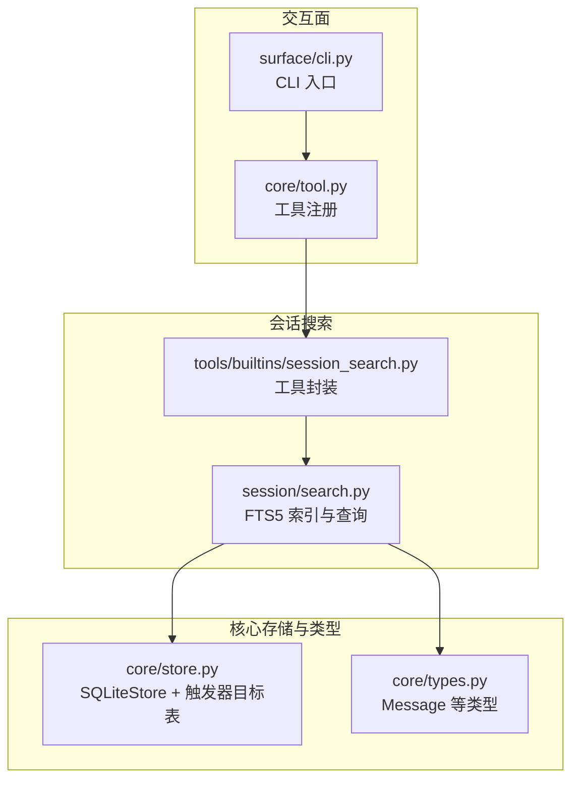
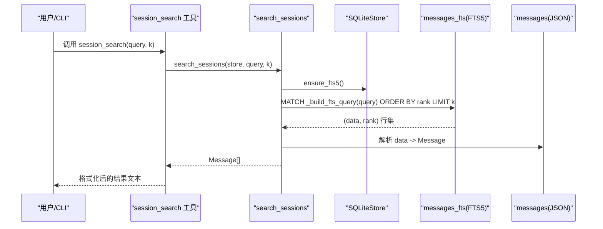
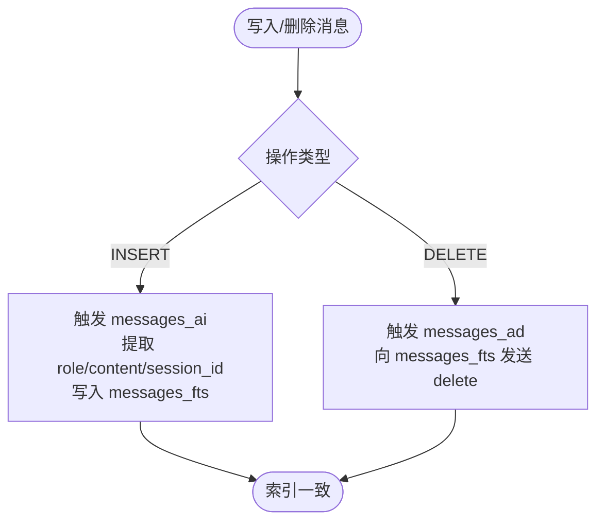
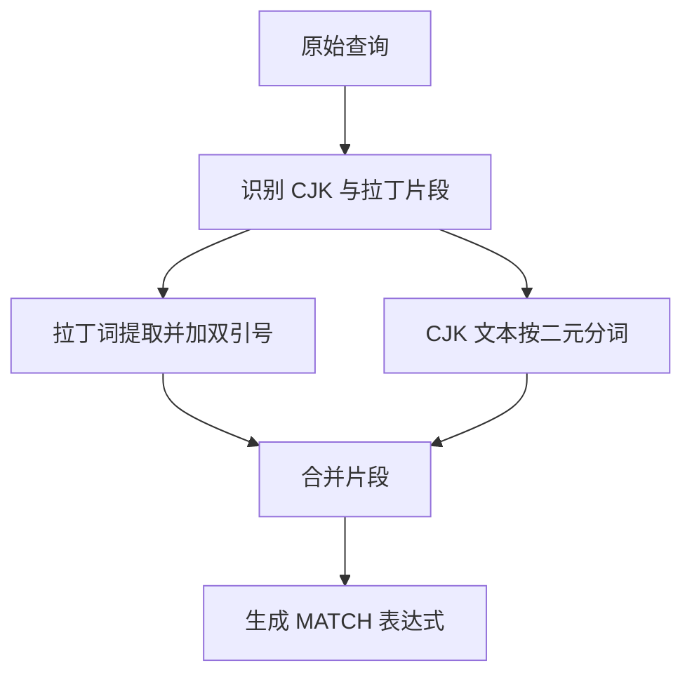
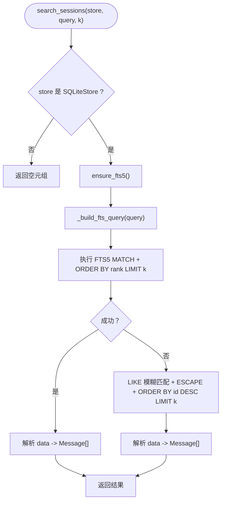
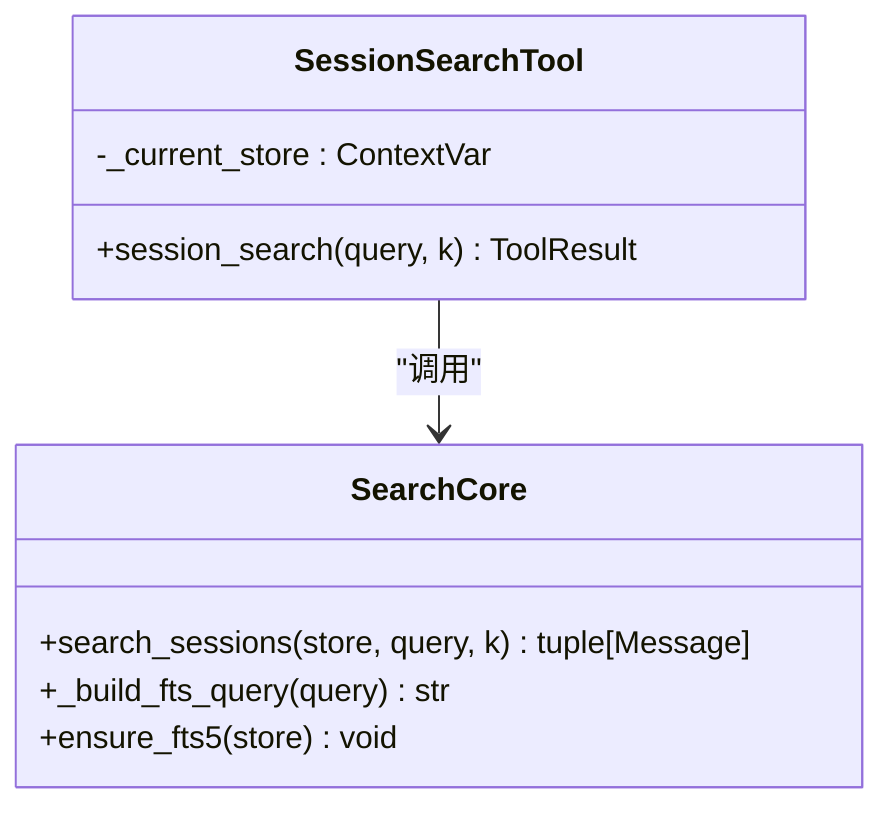
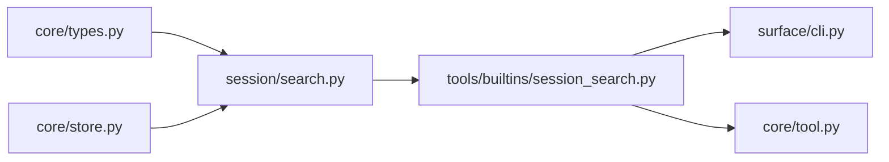

# 会话搜索

<cite>
**本文引用的文件**   
- [search.py](file://src/microagent/session/search.py)
- [session_search.py](file://src/microagent/tools/builtins/session_search.py)
- [store.py](file://src/microagent/core/store.py)
- [types.py](file://src/microagent/core/types.py)
- [test_session_search.py](file://tests/unit/test_session_search.py)
- [cli.py](file://src/microagent/surface/cli.py)
- [tool.py](file://src/microagent/core/tool.py)
</cite>

## 目录
1. [简介](#简介)
2. [项目结构](#项目结构)
3. [核心组件](#核心组件)
4. [架构总览](#架构总览)
5. [详细组件分析](#详细组件分析)
6. [依赖关系分析](#依赖关系分析)
7. [性能与优化](#性能与优化)
8. [故障排查指南](#故障排查指南)
9. [结论](#结论)
10. [附录：API 使用指南](#附录api-使用指南)

## 简介
本文件围绕 MicroAgent 的“会话搜索”能力进行系统化说明，重点解释基于 SQLite FTS5 的全文检索实现，包括索引构建、查询解析、相关性评分、回退策略；并给出搜索语法支持现状、结果排序与分页机制、性能优化建议，以及 Python 接口与 CLI 命令的使用方式。同时提供可视化与导出思路，帮助在应用层对搜索结果进行展示与归档。

## 项目结构
与“会话搜索”直接相关的代码分布在 session、tools/builtins、core 三个层次：
- session.search：FTS5 索引初始化、查询构造、BM25 排序与 LIKE 回退
- tools.builtins.session_search：工具封装，暴露给 Agent/CLI 调用
- core.store：SQLite WAL 存储，消息持久化与索引触发器目标表
- core.types：消息类型定义（Message）
- surface.cli：CLI 入口，会话管理与工具注册（间接关联）
- core.tool：内置工具注册（包含 session_search）

图表来源 
- [search.py:1-161](file://src/microagent/session/search.py#L1-L161)
- [session_search.py:1-46](file://src/microagent/tools/builtins/session_search.py#L1-L46)
- [store.py:95-182](file://src/microagent/core/store.py#L95-L182)
- [types.py:26-69](file://src/microagent/core/types.py#L26-L69)
- [cli.py:113-127](file://src/microagent/surface/cli.py#L113-L127)
- [tool.py:298-309](file://src/microagent/core/tool.py#L298-L309)

章节来源
- [search.py:1-161](file://src/microagent/session/search.py#L1-L161)
- [session_search.py:1-46](file://src/microagent/tools/builtins/session_search.py#L1-L46)
- [store.py:95-182](file://src/microagent/core/store.py#L95-L182)
- [types.py:26-69](file://src/microagent/core/types.py#L26-L69)
- [cli.py:113-127](file://src/microagent/surface/cli.py#L113-L127)
- [tool.py:298-309](file://src/microagent/core/tool.py#L298-L309)

## 核心组件
- FTS5 索引与触发器
  - 通过虚拟表 messages_fts 建立 role/content/session_id 三列索引，映射到 messages 表的 data JSON 字段与 id 行号
  - 插入/删除时自动维护索引一致性
- 查询构造器
  - 针对拉丁词采用短语匹配（双引号包裹），CJK 文本按二元分词提升召回精度
  - 最终生成 FTS5 可执行的 MATCH 表达式
- 搜索主流程
  - 优先走 FTS5 + BM25 排名（rank 越小越相关），失败则回退到 LIKE 模糊匹配
  - 返回 Message 元组，供上层格式化或展示

章节来源
- [search.py:19-41](file://src/microagent/session/search.py#L19-L41)
- [search.py:62-94](file://src/microagent/session/search.py#L62-L94)
- [search.py:97-161](file://src/microagent/session/search.py#L97-L161)

## 架构总览
下图展示了从 CLI/Agent 到 FTS5 索引的完整调用链与数据流。

图表来源 
- [session_search.py:20-46](file://src/microagent/tools/builtins/session_search.py#L20-L46)
- [search.py:97-161](file://src/microagent/session/search.py#L97-L161)
- [store.py:110-121](file://src/microagent/core/store.py#L110-L121)

## 详细组件分析

### FTS5 索引与触发器
- 虚拟表 messages_fts 包含 role、content、session_id 三列，并通过 content=messages、content_rowid=id 映射到原表
- 插入触发器：新消息写入 messages 后，同步写入 messages_fts
- 删除触发器：删除消息时，向 messages_fts 发送 delete 指令以移除对应条目

图表来源 
- [search.py:19-41](file://src/microagent/session/search.py#L19-L41)
- [store.py:110-121](file://src/microagent/core/store.py#L110-L121)

章节来源
- [search.py:19-41](file://src/microagent/session/search.py#L19-L41)
- [store.py:110-121](file://src/microagent/core/store.py#L110-L121)

### 查询解析与分词策略
- 拉丁词：按单词切分并以短语形式匹配（双引号包裹），提高精确度
- CJK 文本：按二元分词（bigram）拆分，避免单字 OR 带来的噪声
- 混合输入：先处理前段拉丁词，再处理 CJK bigram，最后处理剩余拉丁词
- 输出为 FTS5 可执行的 MATCH 表达式，由 OR 连接各片段

图表来源 
- [search.py:57-94](file://src/microagent/session/search.py#L57-L94)

章节来源
- [search.py:57-94](file://src/microagent/session/search.py#L57-L94)

### 搜索主流程与回退策略
- 若 store 非 SQLiteStore，直接返回空结果
- 确保 FTS5 存在后，构造 FTS 查询并按 rank 排序取 Top-K
- 若 FTS5 不可用或异常，回退到 LIKE 模糊匹配（转义 % 和 _），按 id 倒序取 Top-K
- 将 data JSON 反序列化为 Message 对象返回

图表来源 
- [search.py:97-161](file://src/microagent/session/search.py#L97-L161)

章节来源
- [search.py:97-161](file://src/microagent/session/search.py#L97-L161)

### 工具封装与上下文传递
- 工具函数 session_search 接收 query 与 k，校验参数有效性
- 通过 ContextVar 获取当前线程/协程安全的 store 引用
- 调用 search_sessions 并将结果格式化为多行文本返回

图表来源 
- [session_search.py:14-46](file://src/microagent/tools/builtins/session_search.py#L14-L46)
- [search.py:97-161](file://src/microagent/session/search.py#L97-L161)

章节来源
- [session_search.py:14-46](file://src/microagent/tools/builtins/session_search.py#L14-L46)

### 数据存储与序列化
- SQLiteStore 使用 WAL 模式，消息以 JSON 字符串存储在 messages.data
- 唯一键与索引保证会话内顺序与查询效率
- 触发器目标表 messages 的结构与索引由 _init_schema 创建

章节来源
- [store.py:95-182](file://src/microagent/core/store.py#L95-L182)

### 类型定义
- Message 统一表示 user/assistant/tool 角色消息，包含 role、content、tool_calls、usage 等字段
- 工具结果 ToolResult 用于包装工具执行结果与错误信息

章节来源
- [types.py:26-69](file://src/microagent/core/types.py#L26-L69)
- [types.py:97-116](file://src/microagent/core/types.py#L97-L116)

## 依赖关系分析
- session.search 依赖 core.store（SQLiteStore）与 core.types（Message）
- tools.builtins.session_search 依赖 session.search 与 core.types（ToolResult）
- CLI 通过 tool 注册机制发现并使用 session_search 工具

图表来源 
- [search.py:12-13](file://src/microagent/session/search.py#L12-L13)
- [session_search.py:10-12](file://src/microagent/tools/builtins/session_search.py#L10-L12)
- [tool.py:298-309](file://src/microagent/core/tool.py#L298-L309)
- [cli.py:113-127](file://src/microagent/surface/cli.py#L113-L127)

章节来源
- [search.py:12-13](file://src/microagent/session/search.py#L12-L13)
- [session_search.py:10-12](file://src/microagent/tools/builtins/session_search.py#L10-L12)
- [tool.py:298-309](file://src/microagent/core/tool.py#L298-L309)
- [cli.py:113-127](file://src/microagent/surface/cli.py#L113-L127)

## 性能与优化
- 索引维护
  - 触发器自动维护 messages_fts，无需额外批重建逻辑
  - 建议在批量导入场景下集中写入，减少触发器开销
- 查询优化
  - 优先使用 FTS5 MATCH 与 BM25 排名，避免全表扫描
  - 合理设置 k 值控制返回量，降低序列化与网络传输成本
- 回退策略
  - FTS5 不可用时回退 LIKE，注意 ESCAPE 特殊字符，避免误匹配
- 并发控制
  - SQLiteStore 使用 WAL 模式，适合读多写少的高并发场景
  - 工具层通过 ContextVar 传递 store，保证线程/协程安全
- 缓存与分页
  - 当前实现未内置查询缓存与复杂分页；可在上层按需实现 LRU 缓存与 offset/limit 分页
- 排序策略
  - 默认按 BM25 rank 排序（相关性优先）
  - 回退路径按 id 倒序（时间优先），便于最近消息优先展示

章节来源
- [search.py:97-161](file://src/microagent/session/search.py#L97-L161)
- [store.py:101-108](file://src/microagent/core/store.py#L101-L108)
- [session_search.py:14-17](file://src/microagent/tools/builtins/session_search.py#L14-L17)

## 故障排查指南
- 无结果返回
  - 检查 query 是否为空或仅含空白字符
  - 确认 store 已正确注入且为 SQLiteStore
  - 验证 messages 表是否存在且包含数据
- FTS5 不可用
  - 系统可能不支持 FTS5 扩展，此时会回退 LIKE 匹配
  - 可通过单元测试覆盖该分支，确保回退路径可用
- 性能问题
  - 增大 k 会导致更多 JSON 解析与内存占用
  - 频繁写入可能导致触发器开销上升，建议批量写入
- 权限与注册
  - 确认 session_search 工具已在工具注册表中加载
  - 权限规则允许 session_search 调用

章节来源
- [test_session_search.py:31-76](file://tests/unit/test_session_search.py#L31-L76)
- [tool.py:298-309](file://src/microagent/core/tool.py#L298-L309)
- [search.py:97-161](file://src/microagent/session/search.py#L97-L161)

## 结论
MicroAgent 的会话搜索以 SQLite FTS5 为核心，结合智能分词与 BM25 相关性排序，提供了高效、稳定的历史消息检索能力。其设计兼顾了健壮性（FTS5 不可用时的 LIKE 回退）与易用性（工具封装与 CLI 集成）。在现有基础上，可进一步引入查询缓存、高级分页与更丰富的查询语法，以满足更复杂的检索需求。

## 附录：API 使用指南

### Python 接口
- 直接调用搜索核心
  - 使用 search_sessions(store, query, k) 获取 Message 元组
  - 适用于自定义业务逻辑与上层封装
- 通过工具调用
  - 使用 session_search(query, k) 工具，返回格式化文本
  - 适用于 Agent/CLI 环境下的自然语言交互

章节来源
- [search.py:97-161](file://src/microagent/session/search.py#L97-L161)
- [session_search.py:20-46](file://src/microagent/tools/builtins/session_search.py#L20-L46)

### CLI 命令
- CLI 启动后会话管理
  - /new：新建会话
  - /list：列出会话摘要
  - /resume：恢复指定会话
  - /compact：压缩历史
- 工具调用
  - 在 REPL 中通过 Agent 的工具能力调用 session_search
  - CLI 负责会话与 store 的初始化与生命周期管理

章节来源
- [cli.py:113-200](file://src/microagent/surface/cli.py#L113-L200)
- [tool.py:298-309](file://src/microagent/core/tool.py#L298-L309)

### 搜索语法支持现状
- 关键词搜索：支持（拉丁词短语匹配 + CJK 二元分词）
- 短语匹配：拉丁词以双引号包裹实现短语匹配
- 布尔操作：当前未实现 AND/OR/NOT 等布尔语法，内部以 OR 拼接片段
- 范围查询：当前未实现时间/数值范围过滤，可按 id 倒序近似时间排序（回退路径）

章节来源
- [search.py:57-94](file://src/microagent/session/search.py#L57-L94)
- [search.py:97-161](file://src/microagent/session/search.py#L97-L161)

### 分页与排序机制
- 排序
  - FTS5 路径：按 rank 排序（相关性优先）
  - LIKE 回退：按 id 倒序（时间优先）
- 分页
  - 当前通过 LIMIT k 限制返回数量，未实现 offset/limit 分页
  - 可在上层封装分页逻辑，结合缓存与排序策略

章节来源
- [search.py:114-121](file://src/microagent/session/search.py#L114-L121)
- [search.py:143-146](file://src/microagent/session/search.py#L143-L146)

### 可视化与导出建议
- 可视化
  - 将 Message 列表渲染为对话式 UI，高亮命中片段
  - 支持按会话分组、角色着色、时间轴展示
- 导出
  - 将结果序列化为 JSON/CSV，便于离线分析与归档
  - 可附加会话元数据（session_id、时间戳、预览内容）

章节来源
- [types.py:26-69](file://src/microagent/core/types.py#L26-L69)
- [session_search.py:40-45](file://src/microagent/tools/builtins/session_search.py#L40-L45)