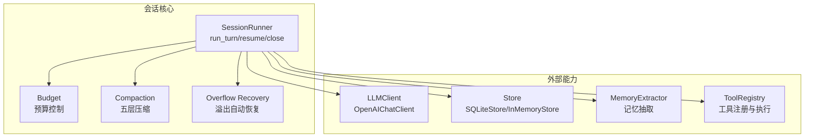
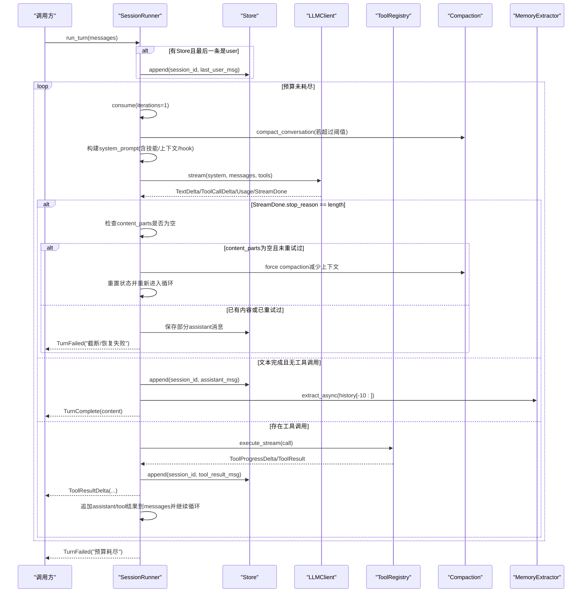
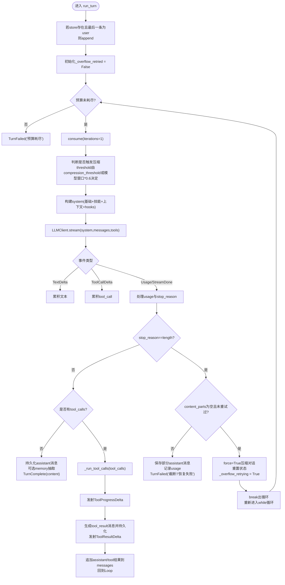
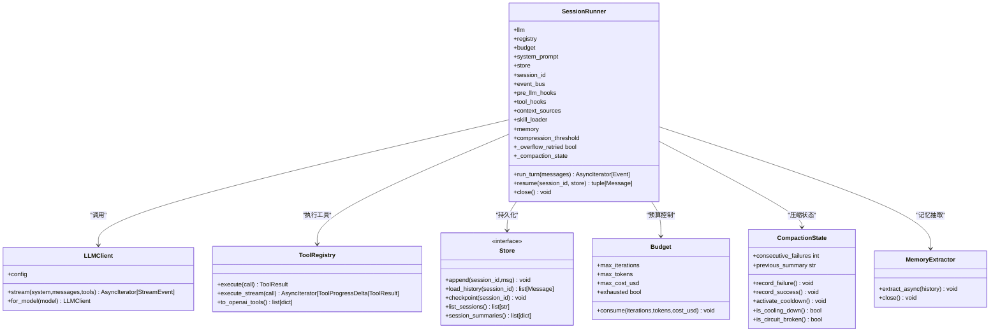

# 会话生命周期

<cite>
**本文引用的文件**   
- [runner.py](file://src/microagent/session/runner.py)
- [types.py](file://src/microagent/core/types.py)
- [store.py](file://src/microagent/core/store.py)
- [budget.py](file://src/microagent/session/budget.py)
- [client.py](file://src/microagent/llm/client.py)
- [compress.py](file://src/microagent/session/compress.py)
- [extractor.py](file://src/microagent/memory/extractor.py)
- [config.py](file://src/microagent/config.py)
- [test_session_resume.py](file://tests/unit/test_session_resume.py)
- [test_runner.py](file://tests/unit/test_runner.py)
- [test_overflow_recovery.py](file://tests/unit/test_overflow_recovery.py)
- [fake_llm.py](file://tests/unit/fake_llm.py)
</cite>

## 更新摘要
**所做更改**   
- 新增溢出自动恢复机制章节，详细说明LLM响应截断的自动处理流程
- 更新run_turn方法的工作流程，包含overflow recovery逻辑
- 增强错误处理策略部分，涵盖新的溢出恢复场景
- 更新故障排查指南，添加溢出恢复相关的诊断信息

## 目录
1. [简介](#简介)
2. [项目结构](#项目结构)
3. [核心组件](#核心组件)
4. [架构总览](#架构总览)
5. [详细组件分析](#详细组件分析)
6. [依赖关系分析](#依赖关系分析)
7. [性能考量](#性能考量)
8. [故障排查指南](#故障排查指南)
9. [结论](#结论)
10. [附录：配置参数说明](#附录配置参数说明)

## 简介
本文件围绕 MicroAgent 的"会话生命周期"展开，重点解析 SessionRunner 的核心职责与实现细节，包括：
- 会话创建与初始化参数配置
- run_turn 方法的完整工作流（LLM 调用、工具执行、结果处理）
- **新增：溢出自动恢复机制** - 当LLM响应被截断时的智能重试与压缩
- 会话恢复机制 resume() 的实现原理（从 Store 加载历史消息）
- 资源清理 close() 方法（浏览器页面关闭、内存提取器清理等）
- 压缩阈值 compression_threshold 的作用与上下文窗口自适应
- 错误处理策略与异常恢复（预算耗尽、LLM 截断、工具异常等）

## 项目结构
MicroAgent 将"会话运行器"置于 session/runner.py，配合 core/types.py 定义的消息与事件类型、core/store.py 的持久化存储、session/budget.py 的资源预算、llm/client.py 的 LLM 客户端抽象、session/compress.py 的五层压缩策略、memory/extractor.py 的记忆抽取器等模块协同工作。测试用例位于 tests/unit 下，覆盖会话恢复、溢出恢复与运行器行为。

**图表来源**
- [runner.py:40-117](file://src/microagent/session/runner.py#L40-L117)
- [budget.py:14-169](file://src/microagent/session/budget.py#L14-L169)
- [compress.py:324-421](file://src/microagent/session/compress.py#L324-L421)
- [client.py:163-328](file://src/microagent/llm/client.py#L163-L328)
- [store.py:95-182](file://src/microagent/core/store.py#L95-L182)
- [extractor.py:43-79](file://src/microagent/memory/extractor.py#L43-L79)

## 核心组件
- SessionRunner：会话主循环，负责 LLM 流式调用、工具调用与结果回写、事件发射、压缩与记忆抽取、预算消耗与限制、**溢出自动恢复**。
- Budget：树形预算模型，支持迭代次数、token 数、成本上限，以及父子共享取消信号。
- Store：持久化接口与实现（SQLite WAL），提供 append/load_history/checkpoint/list_sessions/session_summaries。
- LLMClient：统一 LLM 抽象，OpenAIChatClient 实现 OpenAI 兼容 API 的流式响应与工具调用增量累积。
- Compaction：五层压缩策略，包含微压缩、裁剪、结构化摘要、熔断与全量转储。
- MemoryExtractor：基于 LLM 的背景记忆抽取，异步写入 MemoryProvider。

**章节来源**
- [runner.py:40-117](file://src/microagent/session/runner.py#L40-L117)
- [budget.py:14-169](file://src/microagent/session/budget.py#L14-L169)
- [store.py:28-37](file://src/microagent/core/store.py#L28-L37)
- [client.py:141-156](file://src/microagent/llm/client.py#L141-L156)
- [compress.py:324-421](file://src/microagent/session/compress.py#L324-L421)
- [extractor.py:43-79](file://src/microagent/memory/extractor.py#L43-L79)

## 架构总览
下图展示了 SessionRunner 在一次对话轮次中的关键交互：输入消息 → 可选压缩 → 系统提示构建 → LLM 流式输出 → **溢出检测与恢复** → 工具调用执行 → 结果回写 → 结束或继续。

**图表来源**
- [runner.py:118-284](file://src/microagent/session/runner.py#L118-L284)
- [compress.py:324-421](file://src/microagent/session/compress.py#L324-L421)
- [client.py:219-328](file://src/microagent/llm/client.py#L219-L328)
- [store.py:122-139](file://src/microagent/core/store.py#L122-L139)

## 详细组件分析

### SessionRunner：会话主循环
- 构造参数
  - llm: LLMClient 实例
  - registry: ToolRegistry 实例
  - budget: 可选，默认 Budget()
  - system_prompt: 系统提示
  - store: 可选，用于持久化消息
  - session_id: 会话标识
  - event_bus: 可选，事件总线
  - pre_llm_hooks: 在 LLM 调用前对 system 进行处理的钩子元组
  - tool_hooks: 工具执行前后钩子（before/after）
  - context_sources: 上下文贡献源，动态拼接 system
  - skill_loader: 可选，匹配相关技能注入 system
  - memory: 可选，启用 MemoryExtractor 进行背景记忆抽取
  - compression_threshold: 压缩触发阈值；<=0 时按模型上下文窗口的 60% 自动计算

- **新增：溢出自动恢复机制**
  - `_overflow_retried` 标志位：防止无限重试循环
  - 检测条件：`stop_reason == "length"` 且 `content_parts` 为空
  - 恢复流程：强制压缩对话 → 重置状态 → 重新进入循环
  - 预算处理：重试前消耗首次尝试的token和成本
  - 失败处理：重试后仍溢出则返回TurnFailed

- 会话恢复 resume()
  - 通过传入的 Store 加载指定 session_id 的历史消息，返回不可变序列，供后续 continue 使用。
  - 测试覆盖了 InMemoryStore 与 SQLiteStore 两种场景，以及不存在会话返回空元组的行为。

- 资源清理 close()
  - 关闭当前会话打开的浏览器页面（若有）。
  - 关闭 MemoryExtractor（取消后台任务、释放底层客户端连接）。

- run_turn() 工作流程
  - 若 store 存在且最后一条为 user，则先持久化该条消息。
  - 每轮开始消费一次预算（iterations=1），若超出预算立即返回 TurnFailed。
  - 根据 compression_threshold 与消息长度决定是否触发压缩；默认阈值取模型上下文窗口的 60%。
  - 若启用 skill_loader，则匹配最近用户消息的相关技能并拼接到 system。
  - 遍历 context_sources 与 pre_llm_hooks 动态扩展 system。
  - 缓存 system 与工具描述，避免重复转换。
  - 调用 LLMClient.stream() 流式获取 TextDelta/ToolCallDelta/Usage/StreamDone。
  - **新增：溢出检测** - 若 StreamDone.stop_reason 为 length：
    - 检查是否已有内容流式传输（content_parts为空表示完全截断）
    - 若未重试过且无内容：触发强制压缩并重试
    - 若已有内容或已重试过：保存部分响应并返回TurnFailed
  - 若无工具调用：持久化 assistant 消息，若启用 memory 则抽取最近 10 条消息，发射 TurnComplete。
  - 若有工具调用：并发执行工具（支持流式进度），收集 ToolProgressDelta 与 ToolResult，持久化 tool_result 消息，发射 ToolResultDelta，并将 assistant/tool 结果追加到 messages，进入下一轮循环。
  - 若循环因预算耗尽退出，返回 TurnFailed。

- _run_tool_calls() 工具执行
  - 使用 anyio TaskGroup 并发执行多个工具调用。
  - 设置进程/任务/浏览器状态隔离，确保并发安全。
  - 支持 execute_stream 优先（流式进度），否则回退到 execute。
  - 工具钩子 before/after 允许拦截与修改调用与结果。
  - 异常捕获后以 ToolResult.error 形式返回，保证整体流程不中断。

**图表来源**
- [runner.py:118-284](file://src/microagent/session/runner.py#L118-L284)
- [compress.py:324-421](file://src/microagent/session/compress.py#L324-L421)
- [client.py:219-328](file://src/microagent/llm/client.py#L219-L328)

**章节来源**
- [runner.py:40-117](file://src/microagent/session/runner.py#L40-L117)
- [runner.py:118-284](file://src/microagent/session/runner.py#L118-L284)
- [runner.py:285-341](file://src/microagent/session/runner.py#L285-L341)
- [test_session_resume.py:1-61](file://tests/unit/test_session_resume.py#L1-L61)
- [test_runner.py:61-149](file://tests/unit/test_runner.py#L61-L149)
- [test_overflow_recovery.py:1-149](file://tests/unit/test_overflow_recovery.py#L1-L149)

### 溢出自动恢复机制
**新增功能**：当LLM响应被截断且没有内容流式传输时，SessionRunner会自动触发对话压缩并重试。

- **触发条件**：
  - `event.stop_reason == "length"`：LLM返回长度限制
  - `not content_parts`：没有任何文本内容被流式传输
  - `not self._overflow_retried`：本次轮次尚未重试过

- **恢复流程**：
  1. 标记 `_overflow_retried = True` 防止无限重试
  2. 消耗首次尝试的token和成本到预算中
  3. 调用 `compact_conversation()` 强制压缩对话（`force=True`）
  4. 设置 `_overflow_retrying = True` 标志
  5. break跳出当前循环，重新进入while循环重试

- **失败处理**：
  - 如果重试后仍然溢出：返回 `TurnFailed("LLM overflow recovery failed after retry")`
  - 如果压缩失败：返回 `TurnFailed("overflow recovery: compaction failed")`
  - 如果预算不足：返回 `TurnFailed("budget exhausted during overflow recovery")`

- **设计原则**：
  - 只在完全没有内容传输时触发恢复（保护用户体验）
  - 单次轮次只重试一次（防止无限循环）
  - 强制压缩以减少上下文大小
  - 完整的预算管理和异常处理

**章节来源**
- [runner.py:208-271](file://src/microagent/session/runner.py#L208-L271)
- [test_overflow_recovery.py:27-57](file://tests/unit/test_overflow_recovery.py#L27-L57)
- [test_overflow_recovery.py:88-121](file://tests/unit/test_overflow_recovery.py#L88-L121)

### 会话恢复机制 resume()
- 行为：调用 store.load_history(session_id)，返回历史消息元组。
- 适用场景：跨进程/重启后恢复对话上下文，结合新消息继续 run_turn。
- 测试覆盖：
  - InMemoryStore：恢复两条历史消息，内容正确。
  - SQLiteStore：WAL 模式下的持久化恢复。
  - 不存在会话：返回空元组。
  - 恢复后继续：历史 + 新消息作为 run_turn 输入，得到预期回复。

**章节来源**
- [runner.py:115-117](file://src/microagent/session/runner.py#L115-L117)
- [store.py:134-139](file://src/microagent/core/store.py#L134-L139)
- [test_session_resume.py:1-61](file://tests/unit/test_session_resume.py#L1-L61)

### 资源清理 close()
- 浏览器页面关闭：若会话内打开了浏览器页面，则在 close 中尝试关闭并置空引用。
- 内存提取器清理：调用 MemoryExtractor.close()，取消后台任务并关闭底层客户端。
- 异常保护：关闭过程中捕获异常并忽略，确保清理过程健壮。

**章节来源**
- [runner.py:102-114](file://src/microagent/session/runner.py#L102-L114)
- [extractor.py:68-79](file://src/microagent/memory/extractor.py#L68-L79)

### 压缩与上下文管理
- 触发条件：当消息数量 > 10 且 token 计数超过阈值（默认模型上下文窗口的 60%）时触发压缩。
- 压缩策略：五层金字塔（微压缩、裁剪、结构化摘要、熔断、全量转储），在预算不足或失败时回退到占位文本。
- 增量摘要：维护 previous_summary，减少重复信息，提升效率。
- 文件附件恢复：摘要后恢复最近文件附件，保持上下文连续性。
- **新增：强制压缩模式**：溢出恢复时使用 `force=True` 跳过阈值检查，直接进行LLM摘要压缩。

**章节来源**
- [runner.py:138-162](file://src/microagent/session/runner.py#L138-L162)
- [compress.py:324-421](file://src/microagent/session/compress.py#L324-L421)
- [client.py:80-86](file://src/microagent/llm/client.py#L80-L86)

### 预算控制与异常恢复
- 预算维度：迭代次数、token 数、成本美元。
- 树形预算：父子节点共享 cancel_event，根节点耗尽会通知整棵树。
- 异常处理：
  - 预算耗尽：抛出 BudgetExceeded，run_turn 捕获并返回 TurnFailed。
  - LLM 截断：stop_reason=length，保存部分响应并返回 TurnFailed。
  - **新增：溢出恢复预算**：重试前消耗首次尝试的token和成本。
  - 工具异常：捕获后以 ToolResult.error 返回，不影响其他工具执行。

**章节来源**
- [budget.py:14-169](file://src/microagent/session/budget.py#L14-L169)
- [runner.py:129-134](file://src/microagent/session/runner.py#L129-L134)
- [runner.py:205-225](file://src/microagent/session/runner.py#L205-L225)
- [runner.py:238-246](file://src/microagent/session/runner.py#L238-L246)
- [runner.py:330-332](file://src/microagent/session/runner.py#L330-L332)

### 事件系统与流式输出
- 事件类型：TextDelta、ToolCallDelta、ToolProgressDelta、ToolResultDelta、TurnComplete、TurnFailed。
- 流式 UX：LLM 文本与工具进度实时推送，前端可即时渲染。
- 事件总线：turn_complete 事件可被订阅，便于上层集成。

**章节来源**
- [types.py:123-189](file://src/microagent/core/types.py#L123-L189)
- [runner.py:248-262](file://src/microagent/session/runner.py#L248-L262)

## 依赖关系分析
- SessionRunner 依赖 LLMClient、ToolRegistry、Store、Budget、Compaction、MemoryExtractor。
- LLMClient 依赖 OpenAI SDK（可选 CredentialPool 做密钥轮换）。
- Store 提供持久化接口，SQLiteStore 使用 WAL 模式保障崩溃恢复。
- Compaction 依赖 LLM 进行结构化摘要，受 Budget 约束。
- MemoryExtractor 异步调用 LLM 抽取记忆，结果写入 MemoryProvider。

**图表来源**
- [runner.py:40-117](file://src/microagent/session/runner.py#L40-L117)
- [client.py:141-156](file://src/microagent/llm/client.py#L141-L156)
- [store.py:28-37](file://src/microagent/core/store.py#L28-L37)
- [budget.py:14-169](file://src/microagent/session/budget.py#L14-L169)
- [compress.py:293-318](file://src/microagent/session/compress.py#L293-L318)
- [extractor.py:43-79](file://src/microagent/memory/extractor.py#L43-L79)

## 性能考量
- 流式处理：LLM 与工具均支持流式输出，降低首字延迟，提升用户体验。
- 压缩策略：五层压缩在 token 超限前尽可能零成本处理（微压缩、裁剪），仅在必要时调用 LLM 摘要。
- 并发执行：工具调用使用 TaskGroup 并发执行，提高吞吐。
- 缓存优化：system 与工具描述缓存，避免重复转换。
- 预算控制：防止无限循环与过度消耗，保障稳定性。
- **新增：溢出恢复优化**：只在完全截断时触发恢复，避免不必要的压缩开销。

## 故障排查指南
- 预算耗尽
  - 现象：TurnFailed 包含"预算耗尽"原因。
  - 排查：检查 max_iterations、max_tokens、max_cost_usd 设置；确认工具调用是否陷入死循环。
- LLM 响应截断
  - 现象：TurnFailed 包含"截断"原因；assistant 消息仅包含部分内容。
  - 排查：增大模型上下文窗口或调整 compression_threshold；检查 stop_reason。
- **新增：溢出恢复失败**
  - 现象：TurnFailed 包含"overflow recovery failed"原因。
  - 排查：检查压缩算法可用性；确认预算充足；查看连续失败次数。
- 工具执行失败
  - 现象：ToolResult.error 包含异常信息。
  - 排查：检查工具参数合法性；查看 tool_hooks 是否拦截；确认并发状态隔离是否正确。
- 压缩失败
  - 现象：压缩触发但返回占位文本。
  - 排查：检查连续失败次数与冷却时间；确认 LLM 可用性与预算充足。
- 记忆抽取失败
  - 现象：后台任务失败但不影响主流程。
  - 排查：检查 MemoryExtractor 配置与底层 LLM 客户端可用性。

**章节来源**
- [runner.py:129-134](file://src/microagent/session/runner.py#L129-L134)
- [runner.py:205-225](file://src/microagent/session/runner.py#L205-L225)
- [runner.py:330-332](file://src/microagent/session/runner.py#L330-L332)
- [compress.py:377-416](file://src/microagent/session/compress.py#L377-L416)
- [extractor.py:111-113](file://src/microagent/memory/extractor.py#L111-L113)
- [test_overflow_recovery.py:88-121](file://tests/unit/test_overflow_recovery.py#L88-L121)

## 结论
SessionRunner 作为 MicroAgent 的会话核心，通过流式 LLM 调用、并发工具执行、五层压缩策略与预算控制，实现了稳定高效的对话循环。**新增的溢出自动恢复机制**显著提升了系统的鲁棒性，能够在LLM响应被截断时自动触发对话压缩并重试，避免了不必要的失败。其 resume() 与 close() 方法分别保障了会话恢复与资源清理，配合 Store 与 MemoryExtractor 提供了持久化与记忆能力。合理配置 system_prompt、compression_threshold、pre_llm_hooks 等参数，可有效提升会话质量与性能。

## 附录：配置参数说明
- SessionRunner 构造参数
  - llm: LLMClient 实例，必须。
  - registry: ToolRegistry 实例，必须。
  - budget: 预算对象，可选，默认 Budget()。
  - system_prompt: 系统提示，可选，默认空字符串。
  - store: Store 实例，可选，用于持久化。
  - session_id: 会话 ID，可选，默认 "default"。
  - event_bus: 事件总线，可选。
  - pre_llm_hooks: 预 LLM 钩子元组，可选，用于动态修改 system。
  - tool_hooks: 工具钩子元组，可选，支持 before/after 拦截。
  - context_sources: 上下文贡献源元组，可选，动态拼接 system。
  - skill_loader: 技能加载器，可选，匹配相关技能注入 system。
  - memory: 记忆提供者，可选，启用 MemoryExtractor。
  - compression_threshold: 压缩阈值，可选，<=0 时按模型上下文窗口 60% 自动计算。

- Config（全局配置）
  - base_url: LLM 服务地址，优先级 CLI > 环境变量 > 配置文件 > 默认值。
  - api_key: API 密钥，优先级同上。
  - model: 模型标识，优先级同上。
  - system_prompt: 系统提示，优先级同上。
  - skills_path: 技能目录路径，可选。

**章节来源**
- [runner.py:43-76](file://src/microagent/session/runner.py#L43-L76)
- [config.py:20-71](file://src/microagent/config.py#L20-L71)
- [client.py:93-118](file://src/microagent/llm/client.py#L93-L118)