# 会话管理

<cite>
**本文引用的文件**   
- [runner.py](file://src/microagent/session/runner.py)
- [compress.py](file://src/microagent/session/compress.py)
- [budget.py](file://src/microagent/session/budget.py)
- [attachments.py](file://src/microagent/session/attachments.py)
- [search.py](file://src/microagent/session/search.py)
- [store.py](file://src/microagent/core/store.py)
- [types.py](file://src/microagent/core/types.py)
- [client.py](file://src/microagent/llm/client.py)
- [tool.py](file://src/microagent/core/tool.py)
- [output_store.py](file://src/microagent/tools/output_store.py)
- [test_compaction_pyramid.py](file://tests/unit/test_compaction_pyramid.py)
- [test_incremental_compaction.py](file://tests/unit/test_incremental_compaction.py)
- [test_session_persist.py](file://tests/unit/test_session_persist.py)
- [test_session_search.py](file://tests/unit/test_session_search.py)
- [test_attachments.py](file://tests/unit/test_attachments.py)
- [test_prompt_caching.py](file://tests/unit/test_prompt_caching.py)
- [test_role_alternation.py](file://tests/unit/test_role_alternation.py)
- [test_steer.py](file://tests/unit/test_steer.py)
- [test_overflow_recovery.py](file://tests/unit/test_overflow_recovery.py)
- [test_output_store.py](file://tests/unit/test_output_store.py)
</cite>

## 更新摘要
**变更内容**   
- 新增工具缓存模式感知机制（_cached_mode属性），防止模式切换时的缓存失效
- 增强溢出恢复机制，避免误触发和重复重试
- 实现压缩状态防抖机制（anti-jitter），跟踪压缩有效性并防止无效循环
- 支持辅助模型（auxiliary_model）用于压缩任务，优化成本与性能
- 集成ToolOutputStore管理系统输出大小，自动持久化大输出内容
- 改进CompactionState的压缩效果跟踪和防抖逻辑

## 目录
1. [简介](#简介)
2. [项目结构](#项目结构)
3. [核心组件](#核心组件)
4. [架构总览](#架构总览)
5. [详细组件分析](#详细组件分析)
6. [依赖关系分析](#依赖关系分析)
7. [性能考量](#性能考量)
8. [故障排查指南](#故障排查指南)
9. [结论](#结论)
10. [附录](#附录)

## 简介
本文件面向 MicroAgent 的"会话管理"子系统，系统性阐述以下主题：
- 会话生命周期：创建、消息持久化、上下文压缩策略、预算控制、会话恢复
- SessionRunner 的核心循环：LLM 调用、工具执行、结果处理与流式输出
- 消息压缩算法：金字塔压缩（四层）与增量压缩的工作原理与配置项
- 附件管理系统：从历史消息中恢复最近访问的文件内容，保障压缩后上下文不丢失
- FTS5 全文检索：跨会话搜索的实现与回退机制
- SQLite 存储方案：WAL 模式和检查点机制
- **新增功能**：Prompt 缓存保护、角色交替机制、steer 中断通道、压缩状态防抖、工具缓存模式感知、溢出恢复增强、辅助模型支持、工具输出管理
- 性能优化建议与最佳实践

## 项目结构
MicroAgent 的会话管理位于 session 包内，围绕 runner（运行器）、compress（压缩）、budget（预算）、attachments（附件）、search（搜索）五大模块展开；底层依赖 core.types（统一消息类型）、core.store（SQLite 持久化）、llm.client（LLM 客户端抽象）、core.tool（工具注册与执行）。

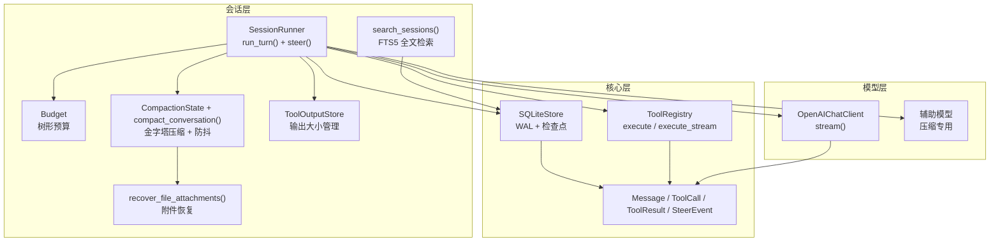

图表来源
- [runner.py:1-522](file://src/microagent/session/runner.py#L1-L522)
- [compress.py:1-632](file://src/microagent/session/compress.py#L1-L632)
- [budget.py:1-169](file://src/microagent/session/budget.py#L1-L169)
- [attachments.py:1-146](file://src/microagent/session/attachments.py#L1-L146)
- [search.py:1-161](file://src/microagent/session/search.py#L1-L161)
- [store.py:1-226](file://src/microagent/core/store.py#L1-L226)
- [types.py:1-197](file://src/microagent/core/types.py#L1-L197)
- [client.py:1-328](file://src/microagent/llm/client.py#L1-L328)
- [tool.py:1-309](file://src/microagent/core/tool.py#L1-L309)
- [output_store.py:1-106](file://src/microagent/tools/output_store.py#L1-L106)

章节来源
- [runner.py:1-522](file://src/microagent/session/runner.py#L1-L522)
- [compress.py:1-632](file://src/microagent/session/compress.py#L1-L632)
- [budget.py:1-169](file://src/microagent/session/budget.py#L1-L169)
- [attachments.py:1-146](file://src/microagent/session/attachments.py#L1-L146)
- [search.py:1-161](file://src/microagent/session/search.py#L1-L161)
- [store.py:1-226](file://src/microagent/core/store.py#L1-L226)
- [types.py:1-197](file://src/microagent/core/types.py#L1-L197)
- [client.py:1-328](file://src/microagent/llm/client.py#L1-L328)
- [tool.py:1-309](file://src/microagent/core/tool.py#L1-L309)
- [output_store.py:1-106](file://src/microagent/tools/output_store.py#L1-L106)

## 核心组件
- SessionRunner：会话主循环，负责 LLM 流式调用、工具调用与执行、事件产出、预算消耗、上下文压缩触发、消息持久化与会话恢复。**新增工具缓存模式感知、溢出恢复增强、辅助模型支持**。
- Budget：树形预算，支持父子继承、共享取消信号、迭代/令牌/成本三重上限。
- 压缩模块：四层金字塔压缩（微压缩、裁剪、LLM 结构化摘要、熔断），配合增量摘要与附件恢复。**新增防抖机制和辅助模型支持**。
- 附件系统：基于正则提取最近文件路径，限制数量与长度，避免压缩后丢失关键文件上下文。
- 搜索模块：FTS5 全文索引 + BM25 排序，CJK 分词优化，不可用时回退 LIKE。
- 存储模块：SQLite WAL 模式，JSON 序列化 Message，自动序列号与索引，支持检查点。
- 工具输出管理：ToolOutputStore 自动处理大输出，持久化到磁盘并返回预览。
- 类型与工具：统一的 Message/ToolCall/ToolResult/SteerEvent 协议，工具注册与流式执行。

章节来源
- [runner.py:1-522](file://src/microagent/session/runner.py#L1-L522)
- [budget.py:1-169](file://src/microagent/session/budget.py#L1-L169)
- [compress.py:1-632](file://src/microagent/session/compress.py#L1-L632)
- [attachments.py:1-146](file://src/microagent/session/attachments.py#L1-L146)
- [search.py:1-161](file://src/microagent/session/search.py#L1-L161)
- [store.py:1-226](file://src/microagent/core/store.py#L1-L226)
- [types.py:1-197](file://src/microagent/core/types.py#L1-L197)
- [tool.py:1-309](file://src/microagent/core/tool.py#L1-L309)
- [output_store.py:1-106](file://src/microagent/tools/output_store.py#L1-L106)

## 架构总览
下图展示一次完整对话轮次（turn）的数据与控制流：用户消息进入 → 持久化 → 预算消耗 → 上下文压缩 → 技能匹配与系统提示增强 → LLM 流式响应 → 工具调用与执行 → 结果回写与持久化 → 结束事件。**新增工具缓存模式感知、溢出恢复增强、辅助模型支持和工具输出管理**。

```mermaid
sequenceDiagram
participant U as "用户"
participant R as "SessionRunner"
participant S as "Store(SQLite)"
participant B as "Budget"
participant C as "压缩(金字塔+防抖)"
participant A as "附件恢复"
participant L as "LLMClient"
participant M as "辅助模型"
participant T as "ToolRegistry"
participant O as "ToolOutputStore"
U->>R : "run_turn(messages)"
R->>S : "append(user_msg)"
loop 直到预算耗尽
R->>B : "consume(iterations=1)"
alt 消息数>10且tokens超阈值
R->>C : "compact_conversation()"
C-->>R : "压缩后的messages"
opt 触发LLM摘要
C->>A : "recover_file_attachments()"
A-->>C : "带附件的压缩消息"
end
end
R->>L : "stream(system, messages, tools)"
alt 使用辅助模型
R->>M : "for_model(auxiliary_model)"
M-->>R : "压缩专用LLM"
end
L-->>R : "TextDelta/ToolCallDelta/Usage/StreamDone"
alt 溢出恢复
R->>C : "force=True压缩"
C-->>R : "压缩后的messages"
R->>L : "重试LLM调用"
end
alt 有工具调用
R->>T : "execute_stream(call)"
T-->>R : "ToolProgressDelta... -> ToolResult"
R->>O : "_process_tool_output()"
O-->>R : "处理后的结果(可能已持久化)"
R->>S : "append(tool_result)"
opt steer中断
R-->>R : "inject steer text"
else 无工具调用
R-->>U : "TurnComplete(content)"
end
R->>B : "consume(tokens, cost_usd)"
end
R-->>U : "TurnFailed(预算耗尽/截断等)"
```

图表来源
- [runner.py:164-464](file://src/microagent/session/runner.py#L164-L464)
- [compress.py:395-493](file://src/microagent/session/compress.py#L395-L493)
- [attachments.py:103-146](file://src/microagent/session/attachments.py#L103-L146)
- [client.py:219-328](file://src/microagent/llm/client.py#L219-L328)
- [tool.py:262-280](file://src/microagent/core/tool.py#L262-L280)
- [store.py:122-140](file://src/microagent/core/store.py#L122-L140)
- [output_store.py:48-78](file://src/microagent/tools/output_store.py#L48-L78)

## 详细组件分析

### SessionRunner 核心循环
- 输入：当前轮次的消息列表（包含 user/assistant/tool 角色）
- 流程要点：
  - 若 store 存在且最后一条是 user，则立即持久化
  - 每轮开始消费一次迭代预算
  - 当消息条数>10 且 token 估算超过阈值时，触发金字塔压缩（可配置阈值或按模型窗口自适应）
  - **新增**：系统提示冻结（ADR-0005），skills/memory/context_sources 注入到 user 消息而非 system prompt
  - 可选技能匹配与上下文源注入，构建 system prompt
  - **新增**：工具缓存模式感知，检测 system 和 mode 变化才重新生成工具 schema
  - 流式接收 LLM 响应：文本片段、工具调用片段、用量统计、结束事件
  - **新增**：溢出恢复机制，当 stop_reason="length" 且无内容时自动压缩并重试
  - 若无工具调用，产出 TurnComplete；若有工具调用，并发执行并收集进度与结果
  - **新增**：工具输出处理，通过 ToolOutputStore 管理大输出内容
  - **新增**：steer 中断通道，支持运行时动态干预
  - 每次写入 assistant/tool 消息到 store，并累计预算
  - 最终可能因预算耗尽而返回 TurnFailed

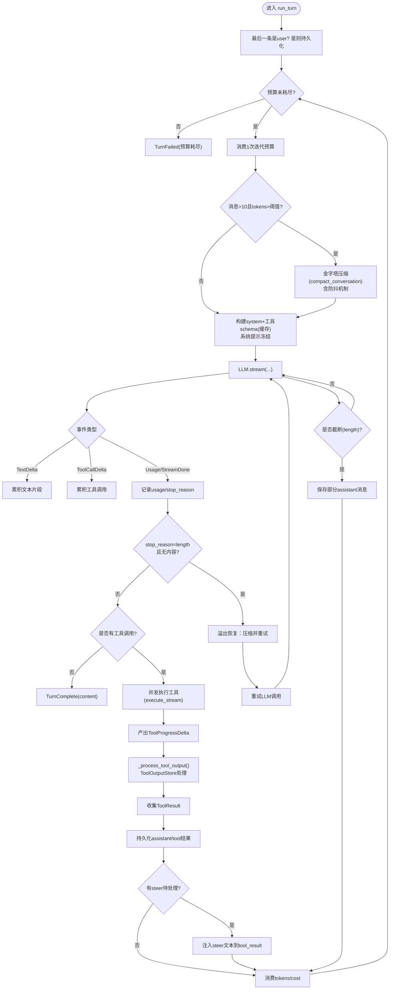

图表来源
- [runner.py:164-464](file://src/microagent/session/runner.py#L164-L464)

章节来源
- [runner.py:164-464](file://src/microagent/session/runner.py#L164-L464)

### 工具缓存模式感知机制
**新增功能**：防止模式切换时的缓存失效，确保工具列表与当前模式一致。

- 设计原则：
  - 检测 system prompt 和 mode 变化才重新生成工具 schema
  - 在 plan 模式下过滤写操作工具
  - 通过 `_cached_system`、`_cached_tools` 和 `_cached_mode` 缓存避免重复计算
- 实现方式：
  - 比较当前 system 与 `_cached_system`，以及当前 mode 与 `_cached_mode`
  - 仅在必要时重新生成工具列表
  - 在 plan 模式下应用工具过滤逻辑

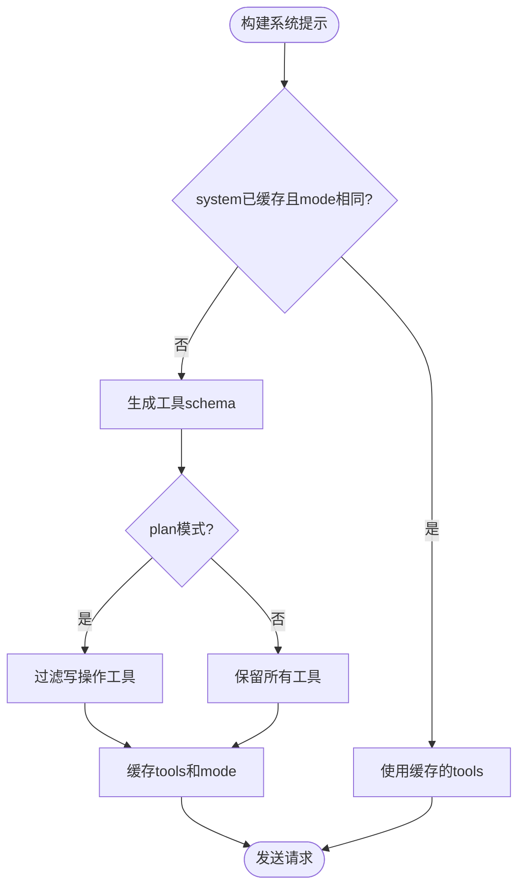

图表来源
- [runner.py:290-299](file://src/microagent/session/runner.py#L290-L299)

章节来源
- [runner.py:290-299](file://src/microagent/session/runner.py#L290-L299)

### 溢出恢复增强机制
**增强功能**：改进溢出恢复逻辑，避免误触发和重复重试。

- 工作原理：
  - 仅当 `stop_reason="length"` 且无内容流式输出时才触发恢复
  - 使用 `_overflow_retried` 标志防止重复重试
  - 强制压缩（force=True）以快速减少上下文
  - 正确消费预算，包括失败尝试的token使用
- 应用场景：
  - LLM 响应被截断但尚未向用户输出任何内容
  - 需要自动压缩上下文并重试
  - 避免对已部分输出的响应进行恢复

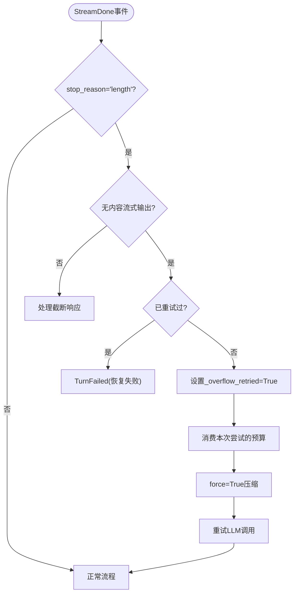

图表来源
- [runner.py:319-362](file://src/microagent/session/runner.py#L319-L362)

章节来源
- [runner.py:319-362](file://src/microagent/session/runner.py#L319-L362)

### 辅助模型支持
**新增功能**：支持为压缩任务使用专门的辅助模型，优化成本和性能。

- 设计原则：
  - 如果配置了 `auxiliary_model`，则使用该模型进行压缩
  - 通过 `llm.for_model()` 创建专用的压缩模型实例
  - 保持主模型的稳定性和一致性
- 实现方式：
  - 在压缩前检查 `self.llm.config.auxiliary_model`
  - 如有配置，创建辅助模型实例用于压缩任务
  - 压缩完成后继续使用原模型进行对话

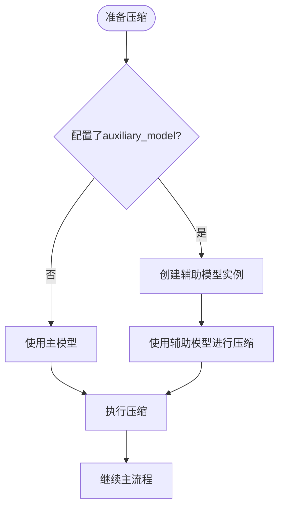

图表来源
- [runner.py:206-216](file://src/microagent/session/runner.py#L206-L216)

章节来源
- [runner.py:206-216](file://src/microagent/session/runner.py#L206-L216)

### 压缩状态防抖机制
**增强功能**：改进 CompactionState 的防抖机制，防止无效压缩循环。

- 新增字段：
  - `_ineffective_count`：连续无效压缩计数
  - `record_ineffective()`：记录压缩节省 <10% tokens
  - `should_skip_compression()`：连续2次无效后跳过压缩
  - `reset_for_new_turn()`：新用户输入时重置计数器
- 防抖逻辑：
  - 当压缩节省效果小于 10% 时调用 `record_ineffective()`
  - 连续 2 次无效压缩后，`should_skip_compression()` 返回 True
  - 在新用户输入时重置计数器，允许再次尝试压缩

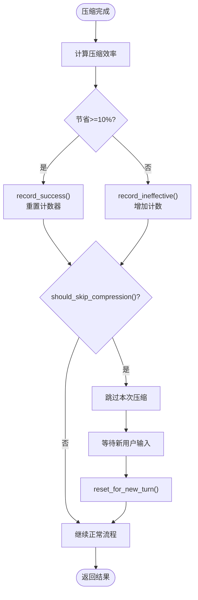

图表来源
- [compress.py:350-388](file://src/microagent/session/compress.py#L350-L388)

章节来源
- [compress.py:350-388](file://src/microagent/session/compress.py#L350-L388)

### 工具输出管理系统
**新增功能**：ToolOutputStore 自动管理系统输出大小，持久化大输出内容。

- 设计原则：
  - 50KB硬限制 + 2000行限制 + 头尾各500字符预览
  - 大输出自动保存到磁盘，返回预览内容
  - 支持清理过期文件，默认保留7天
- 实现方式：
  - 在 `_process_tool_output()` 方法中处理工具结果
  - 检查输出大小和行数，决定是否持久化
  - 生成包含头尾内容的预览字符串
  - 维护磁盘文件的生命周期管理

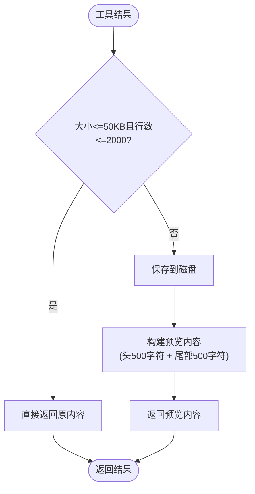

图表来源
- [output_store.py:48-78](file://src/microagent/tools/output_store.py#L48-L78)
- [runner.py:143-156](file://src/microagent/session/runner.py#L143-L156)

章节来源
- [output_store.py:1-106](file://src/microagent/tools/output_store.py#L1-L106)
- [runner.py:143-156](file://src/microagent/session/runner.py#L143-L156)

### Prompt 缓存保护机制
**新增功能**：系统提示冻结（ADR-0005），确保跨 turn 的字节稳定性以支持 prompt 缓存。

- 设计原则：
  - system prompt 必须跨 turn 保持完全一致
  - skills、memory、context_sources 动态内容注入到 user 消息的 `<context>` 标签中
  - 通过 `_cached_system` 和 `_cached_tools` 缓存避免重复计算
- 实现方式：
  - 检测 system 变化才重新生成工具 schema
  - 在 plan 模式下过滤写操作工具
  - 动态内容包裹在 `<context>...</context>` 标签中追加到最后一个 user 消息

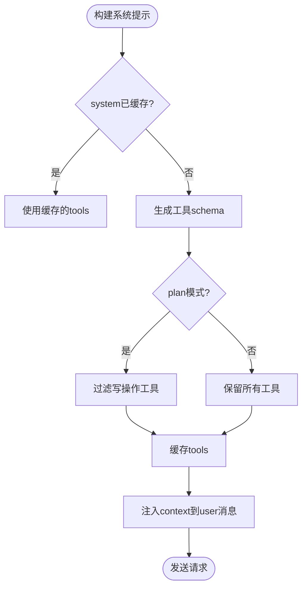

图表来源
- [runner.py:232-286](file://src/microagent/session/runner.py#L232-L286)

章节来源
- [runner.py:232-286](file://src/microagent/session/runner.py#L232-L286)

### 角色交替机制
**新增功能**：确保压缩后的消息序列符合某些 API（如 OpenRouter）的严格角色交替要求。

- 工作原理：
  - `_ensure_role_alternation()` 函数检查相邻同角色消息
  - 在 strict=True 模式下插入空消息作为分隔符
  - 跳过 tool 消息（遵循 tool_call 配对规则）
- 应用场景：
  - 某些 LLM API 要求严格的 user/assistant 交替
  - 压缩后可能出现相邻同角色消息的情况
  - 通过插入空消息保证 API 兼容性

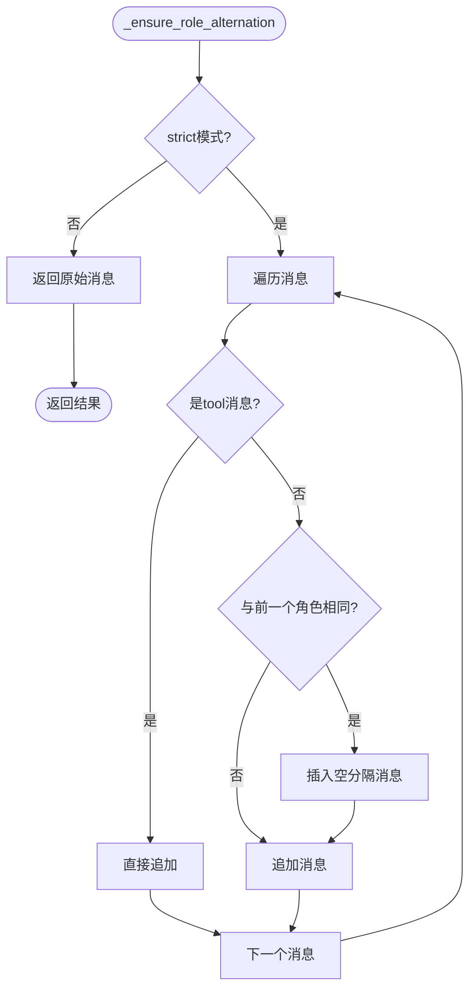

图表来源
- [compress.py:560-588](file://src/microagent/session/compress.py#L560-L588)

章节来源
- [compress.py:560-588](file://src/microagent/session/compress.py#L560-L588)

### steer 中断通道
**新增功能**：支持在运行中的 turn 期间注入动态指令，实现实时干预。

- 核心特性：
  - `steer(text)` 方法设置 `_steer_pending` 标志
  - 在下一个 tool_result 边界注入 steer 文本
  - 纯文本响应时等待下一个 turn
  - 级联传播到活跃的子代理
- 工作流程：
  - 外部调用 `runner.steer(text)` 设置待处理文本
  - 工具执行完成后检查 `_steer_pending`
  - 将 steer 文本追加到最近的 tool 消息
  - 发出 `SteerEvent` 事件通知上层

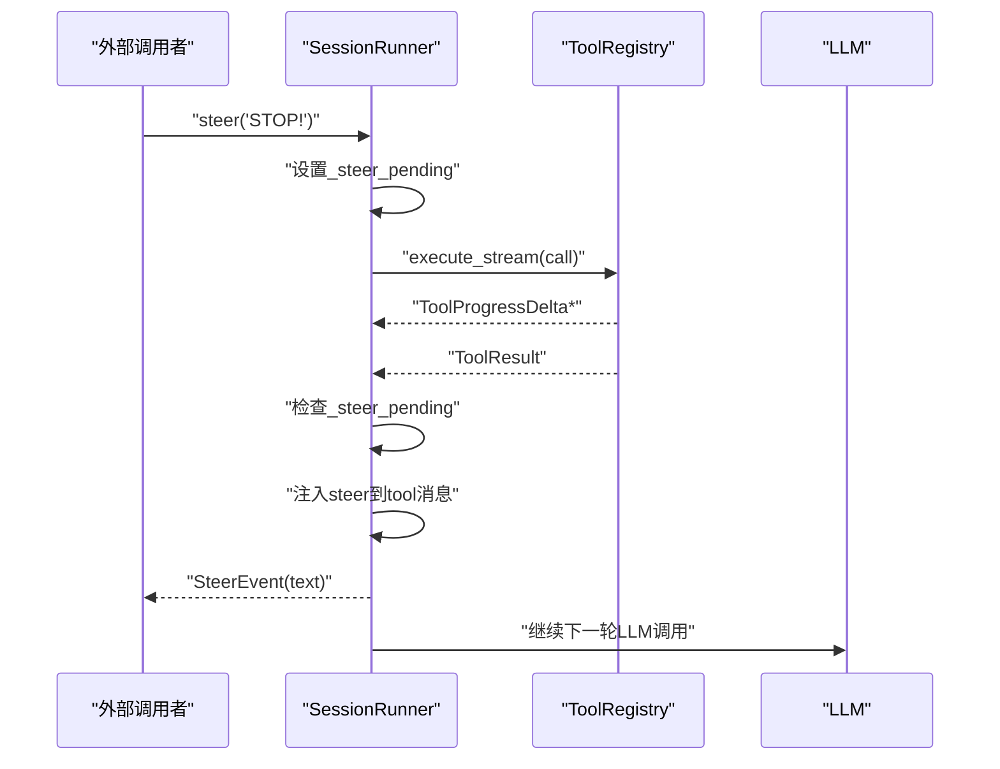

图表来源
- [runner.py:124-136](file://src/microagent/session/runner.py#L124-L136)
- [runner.py:447-463](file://src/microagent/session/runner.py#L447-L463)

章节来源
- [runner.py:124-136](file://src/microagent/session/runner.py#L124-L136)
- [runner.py:447-463](file://src/microagent/session/runner.py#L447-L463)

### 预算控制（Budget）
- 树形结构：根预算共享 cancel_event，子预算默认继承父剩余资源的 1/3
- 三重上限：迭代次数、token 总量、美元成本
- 消费逻辑：逐级向上传递消耗，达到任一上限即抛出异常并触发全局取消
- 用途：在 SessionRunner 中控制迭代与 token 使用，防止无限循环与费用失控

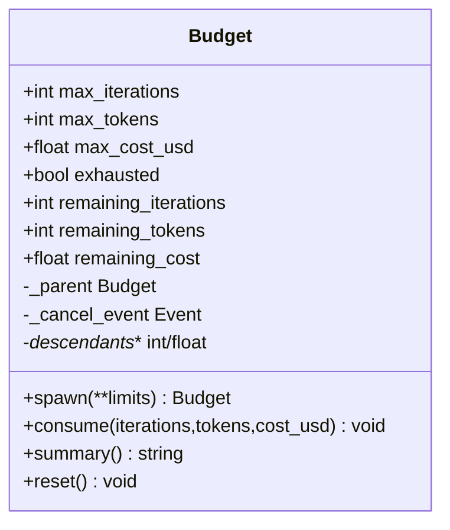

图表来源
- [budget.py:14-169](file://src/microagent/session/budget.py#L14-L169)

章节来源
- [budget.py:14-169](file://src/microagent/session/budget.py#L14-L169)

### 消息压缩（金字塔压缩与增量压缩）
- 四层金字塔：
  - L1 微压缩：对可重获的工具结果进行占位替换（零 API 成本）
  - L2 裁剪：移除最旧的 tool_result 消息，保留最近 N 条（零 API 成本）
  - L3 LLM 摘要：生成 7 段结构化摘要，必要时结合增量更新（一次 API 调用）
  - L4 熔断：连续失败 3 次进入冷却期，避免反复失败
- 增量压缩：维护 previous_summary，仅合并新消息，降低开销
- 附件恢复：摘要后恢复最近 3 个文件的原始内容（限长），保证上下文完整性
- 触发条件：根据消息条数与 token 估算阈值自动触发，或强制 force=True 直接走 LLM 摘要
- **新增**：角色交替检查和防抖机制

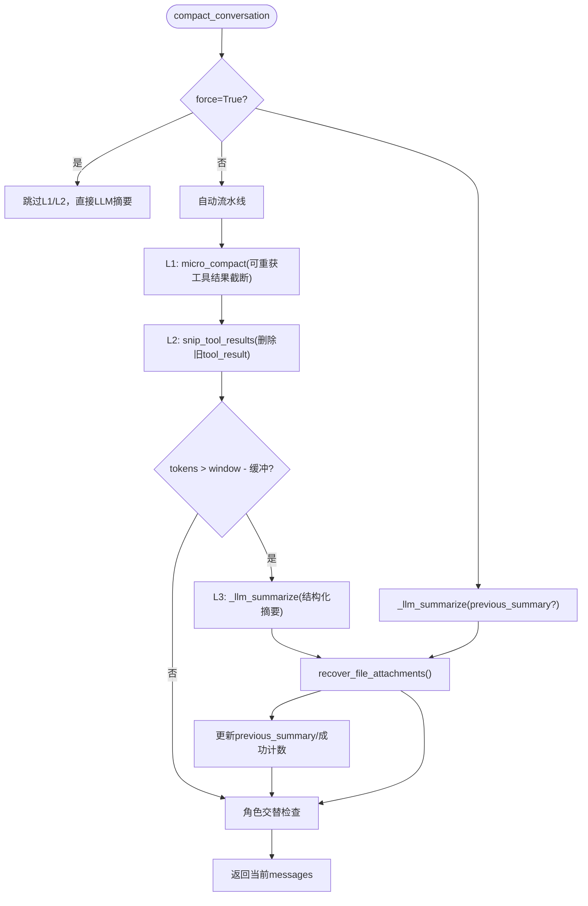

图表来源
- [compress.py:395-493](file://src/microagent/session/compress.py#L395-L493)
- [compress.py:433-475](file://src/microagent/session/compress.py#L433-L475)
- [attachments.py:103-146](file://src/microagent/session/attachments.py#L103-L146)

章节来源
- [compress.py:1-632](file://src/microagent/session/compress.py#L1-L632)
- [attachments.py:1-146](file://src/microagent/session/attachments.py#L1-L146)

### 附件管理系统
- 目标：在 L3 摘要后恢复最近访问的文件内容，避免上下文丢失
- 实现：
  - 从原始消息中提取文件路径（工具参数与正文中的路径）
  - 过滤 URL、目录、二进制路径等无效项
  - 最多恢复 3 个文件，单文件限长 3000 字符
  - 以单个 user 消息追加到压缩结果之后

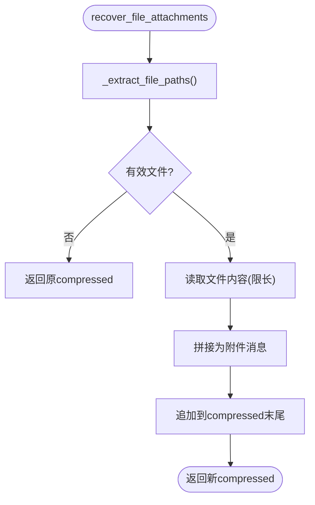

图表来源
- [attachments.py:30-64](file://src/microagent/session/attachments.py#L30-L64)
- [attachments.py:103-146](file://src/microagent/session/attachments.py#L103-L146)

章节来源
- [attachments.py:1-146](file://src/microagent/session/attachments.py#L1-L146)

### 会话搜索（FTS5 全文检索）
- 索引：通过触发器维护 messages_fts 虚拟表，role/content/session_id 三字段
- 查询：
  - 拉丁单词短语匹配（加引号）
  - CJK 文本采用二元组（bigram）提升精度
  - 使用 BM25 排序，返回 top-k 结果
- 回退：FTS5 不可用时回退 LIKE 模糊匹配

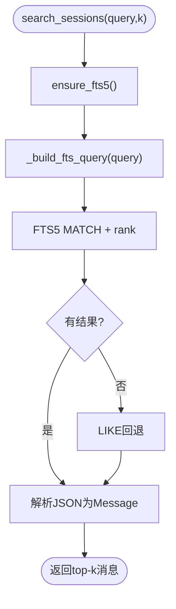

图表来源
- [search.py:19-41](file://src/microagent/session/search.py#L19-L41)
- [search.py:62-94](file://src/microagent/session/search.py#L62-L94)
- [search.py:97-161](file://src/microagent/session/search.py#L97-L161)

章节来源
- [search.py:1-161](file://src/microagent/session/search.py#L1-L161)

### 会话持久化（SQLite + WAL）
- 设计：
  - 表 messages(session_id, seq, data)，唯一约束 (session_id, seq)
  - JSON 序列化 Message，包含 role/content/tool_calls/tool_call_id/usage/is_error
  - WAL 模式 + NORMAL 同步策略，提高并发写入性能
  - 提供 checkpoint(TRUNCATE) 强制检查点
- 能力：
  - append/load_history/list_sessions/session_summaries
  - 测试覆盖自动保存、跨进程恢复、InMemoryStore 兼容

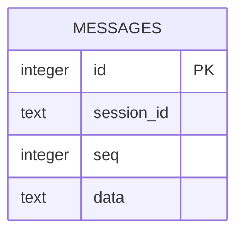

图表来源
- [store.py:111-121](file://src/microagent/core/store.py#L111-L121)

章节来源
- [store.py:1-226](file://src/microagent/core/store.py#L1-L226)

### 工具执行与流式输出
- ToolRegistry 支持 execute 与 execute_stream：
  - 优先尝试流式执行，逐条产出 ToolProgressDelta，最终以 ToolResult 结束
  - 不支持流式的工具回退到普通 execute
- SessionRunner 并发执行多个工具调用，收集进度与结果，先产出进度再产出结果，提升用户体验

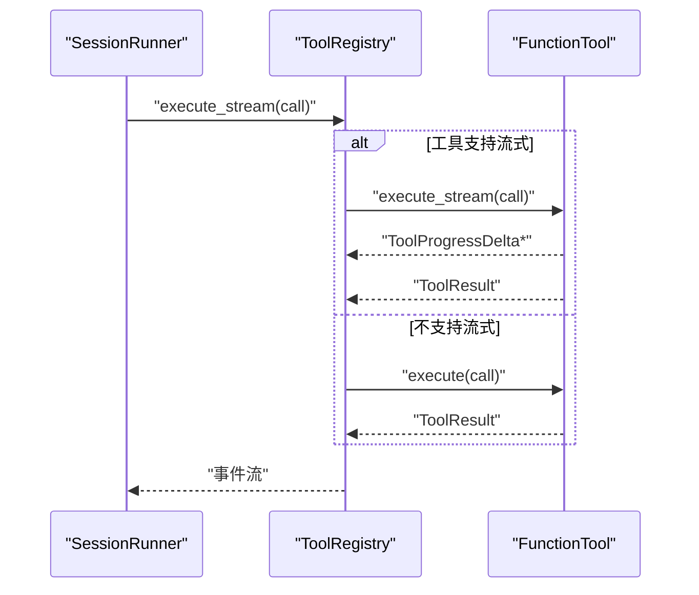

图表来源
- [tool.py:262-280](file://src/microagent/core/tool.py#L262-L280)
- [runner.py:466-522](file://src/microagent/session/runner.py#L466-L522)

章节来源
- [tool.py:1-309](file://src/microagent/core/tool.py#L1-L309)
- [runner.py:466-522](file://src/microagent/session/runner.py#L466-L522)

### 会话恢复机制
- resume(session_id, store)：从 store 加载历史消息，作为下一轮的初始上下文
- 典型用法：关闭后重新打开应用，继续上一会话

章节来源
- [runner.py:121-122](file://src/microagent/session/runner.py#L121-L122)
- [store.py:134-139](file://src/microagent/core/store.py#L134-L139)

## 依赖关系分析
- SessionRunner 依赖：
  - LLMClient：流式响应、工具定义、用量统计
  - ToolRegistry：工具发现、执行、流式支持
  - Store：消息持久化
  - Budget：预算控制
  - compress：上下文压缩
  - attachments：附件恢复
  - search：全文检索（通过 store 暴露）
  - ToolOutputStore：工具输出大小管理
- 类型与协议：
  - types.Message/ToolCall/ToolResult/SteerEvent 贯穿全链路
  - tool.Tool 协议确保工具解耦

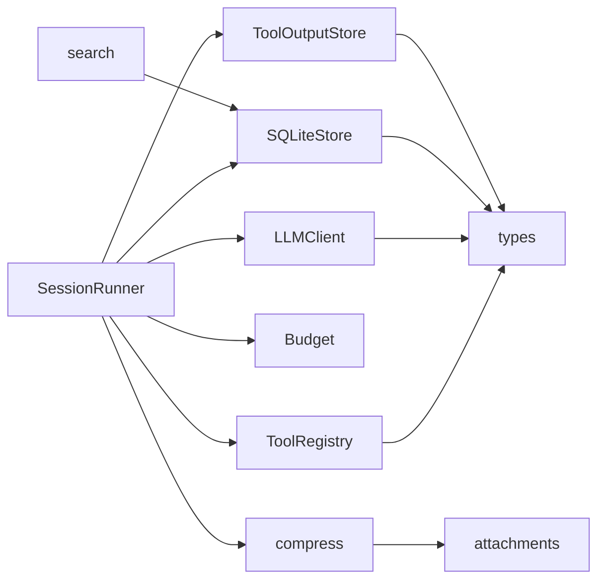

图表来源
- [runner.py:1-163](file://src/microagent/session/runner.py#L1-L163)
- [tool.py:221-280](file://src/microagent/core/tool.py#L221-L280)
- [client.py:141-156](file://src/microagent/llm/client.py#L141-L156)
- [store.py:28-37](file://src/microagent/core/store.py#L28-L37)
- [types.py:17-197](file://src/microagent/core/types.py#L17-L197)
- [output_store.py:29-78](file://src/microagent/tools/output_store.py#L29-L78)

章节来源
- [runner.py:1-163](file://src/microagent/session/runner.py#L1-L163)
- [tool.py:221-280](file://src/microagent/core/tool.py#L221-L280)
- [client.py:141-156](file://src/microagent/llm/client.py#L141-L156)
- [store.py:28-37](file://src/microagent/core/store.py#L28-L37)
- [types.py:17-197](file://src/microagent/core/types.py#L17-L197)
- [output_store.py:29-78](file://src/microagent/tools/output_store.py#L29-L78)

## 性能考量
- 压缩策略
  - 优先使用零成本 L1/L2，仅在必要时触发 L3（LLM 摘要）
  - 使用增量摘要减少重复工作
  - 附件恢复限制文件数量与长度，避免过大上下文
  - **新增**：防抖机制防止无效压缩循环
  - **新增**：辅助模型优化压缩成本
- 预算控制
  - 合理设置 max_iterations/max_tokens/max_cost_usd，防止资源耗尽
  - 利用树形预算与共享取消事件快速终止子任务
- 存储与检索
  - WAL 模式提升写入吞吐，定期 checkpoint 释放空间
  - FTS5 索引加速全文检索，CJK 二元组提升召回质量
- 工具执行
  - 优先使用流式工具，实时反馈提升交互体验
  - 并发执行工具调用，缩短整体延迟
  - **新增**：ToolOutputStore 管理大输出，避免内存压力
- **新增**：Prompt 缓存
  - 系统提示冻结确保跨 turn 字节稳定性
  - 工具缓存模式感知避免重复计算
  - 减少重复计算，提升 LLM 调用效率

## 故障排查指南
- 预算耗尽
  - 现象：TurnFailed 提示预算耗尽
  - 排查：检查 Budget 配置、工具调用次数、LLM 用量统计
  - 参考：[budget.py:99-130](file://src/microagent/session/budget.py#L99-L130)
- 上下文压缩失败
  - 现象：多次失败触发熔断与冷却
  - 排查：查看 CompactionState 状态、LLM 摘要是否返回空内容
  - 参考：[compress.py:293-317](file://src/microagent/session/compress.py#L293-L317)
- 附件恢复失败
  - 现象：压缩后缺少文件上下文
  - 排查：确认文件路径可解析、权限正常、大小限制
  - 参考：[attachments.py:67-100](file://src/microagent/session/attachments.py#L67-L100)
- 搜索无结果
  - 现象：FTS5 不可用或查询不匹配
  - 排查：确认 ensure_fts5 已执行，检查 LIKE 回退逻辑
  - 参考：[search.py:44-51](file://src/microagent/session/search.py#L44-L51)
- 持久化问题
  - 现象：重启后消息丢失
  - 排查：确认 WAL 模式启用、checkpoint 执行、路径正确
  - 参考：[store.py:101-108](file://src/microagent/core/store.py#L101-L108)
- **新增**：Prompt 缓存失效
  - 现象：prompt 缓存命中率低
  - 排查：确认 system prompt 跨 turn 一致性，检查 context 注入位置
  - 参考：[test_prompt_caching.py:17-39](file://tests/unit/test_prompt_caching.py#L17-L39)
- **新增**：角色交替错误
  - 现象：某些 API 报错要求严格角色交替
  - 排查：启用 strict_role_alternation=True，检查压缩输出
  - 参考：[test_role_alternation.py:65-85](file://tests/unit/test_role_alternation.py#L65-L85)
- **新增**：steer 中断无效
  - 现象：steer 文本未生效
  - 排查：确认在 tool_result 后调用，检查 _steer_pending 状态
  - 参考：[test_steer.py:28-56](file://tests/unit/test_steer.py#L28-L56)
- **新增**：溢出恢复问题
  - 现象：溢出恢复未触发或重复触发
  - 排查：检查 stop_reason 和内容流式状态，确认 _overflow_retried 标志
  - 参考：[test_overflow_recovery.py:27-57](file://tests/unit/test_overflow_recovery.py#L27-L57)
- **新增**：工具输出过大
  - 现象：内存压力或响应过大
  - 排查：检查 ToolOutputStore 配置，确认大输出已持久化
  - 参考：[test_output_store.py:21-30](file://tests/unit/test_output_store.py#L21-L30)

章节来源
- [budget.py:99-130](file://src/microagent/session/budget.py#L99-L130)
- [compress.py:293-317](file://src/microagent/session/compress.py#L293-L317)
- [attachments.py:67-100](file://src/microagent/session/attachments.py#L67-L100)
- [search.py:44-51](file://src/microagent/session/search.py#L44-L51)
- [store.py:101-108](file://src/microagent/core/store.py#L101-L108)
- [test_prompt_caching.py:17-39](file://tests/unit/test_prompt_caching.py#L17-L39)
- [test_role_alternation.py:65-85](file://tests/unit/test_role_alternation.py#L65-L85)
- [test_steer.py:28-56](file://tests/unit/test_steer.py#L28-L56)
- [test_overflow_recovery.py:27-57](file://tests/unit/test_overflow_recovery.py#L27-L57)
- [test_output_store.py:21-30](file://tests/unit/test_output_store.py#L21-L30)

## 结论
MicroAgent 的会话管理以 SessionRunner 为核心，结合金字塔压缩、预算控制、附件恢复、FTS5 检索与 SQLite WAL 持久化，构建了高可用、可扩展、低成本的对话系统。**新增的工具缓存模式感知、溢出恢复增强、压缩状态防抖、辅助模型支持、工具输出管理等功能**进一步提升了系统的稳定性和灵活性。通过流式工具执行、增量压缩和智能输出管理，显著提升了交互体验与资源利用率。建议在生产环境中合理配置预算阈值、定期执行检查点、监控压缩成功率与搜索命中率，以获得稳定高效的会话管理能力。

## 附录
- 单元测试覆盖要点：
  - 金字塔压缩各层行为与边界条件
  - 增量摘要提示构建与状态管理
  - 会话持久化与恢复流程
  - FTS5 查询构建与回退机制
  - 附件路径提取与可读性判断
  - **新增**：prompt 缓存保护验证
  - **新增**：角色交替检查机制
  - **新增**：steer 中断通道功能
  - **新增**：压缩状态防抖逻辑
  - **新增**：溢出恢复机制测试
  - **新增**：工具输出存储管理测试

章节来源
- [test_compaction_pyramid.py:1-166](file://tests/unit/test_compaction_pyramid.py#L1-L166)
- [test_incremental_compaction.py:1-57](file://tests/unit/test_incremental_compaction.py#L1-L57)
- [test_session_persist.py:1-75](file://tests/unit/test_session_persist.py#L1-L75)
- [test_session_search.py:1-76](file://tests/unit/test_session_search.py#L1-L76)
- [test_attachments.py:1-138](file://tests/unit/test_attachments.py#L1-L138)
- [test_prompt_caching.py:1-135](file://tests/unit/test_prompt_caching.py#L1-L135)
- [test_role_alternation.py:1-101](file://tests/unit/test_role_alternation.py#L1-L101)
- [test_steer.py:1-122](file://tests/unit/test_steer.py#L1-L122)
- [test_overflow_recovery.py:1-149](file://tests/unit/test_overflow_recovery.py#L1-L149)
- [test_output_store.py:1-89](file://tests/unit/test_output_store.py#L1-L89)