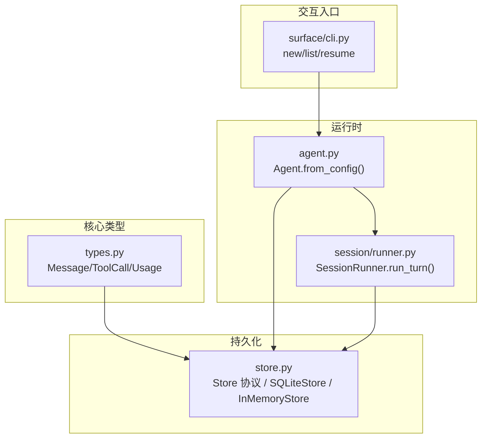
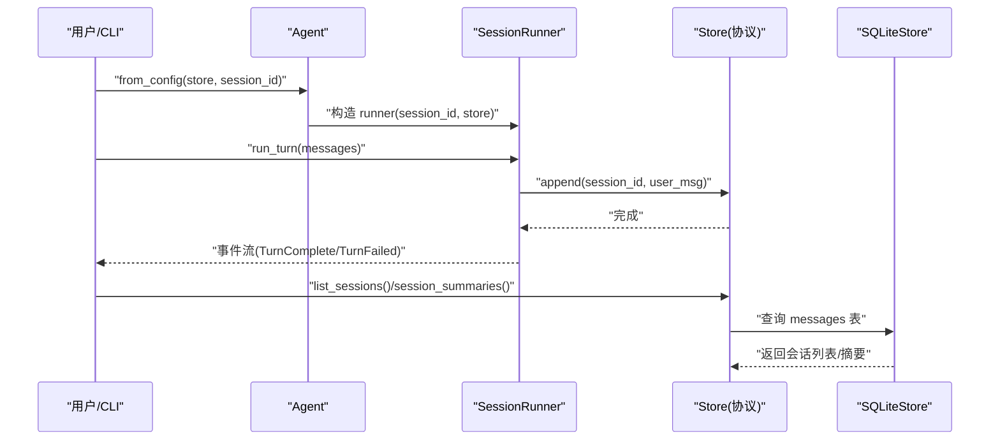
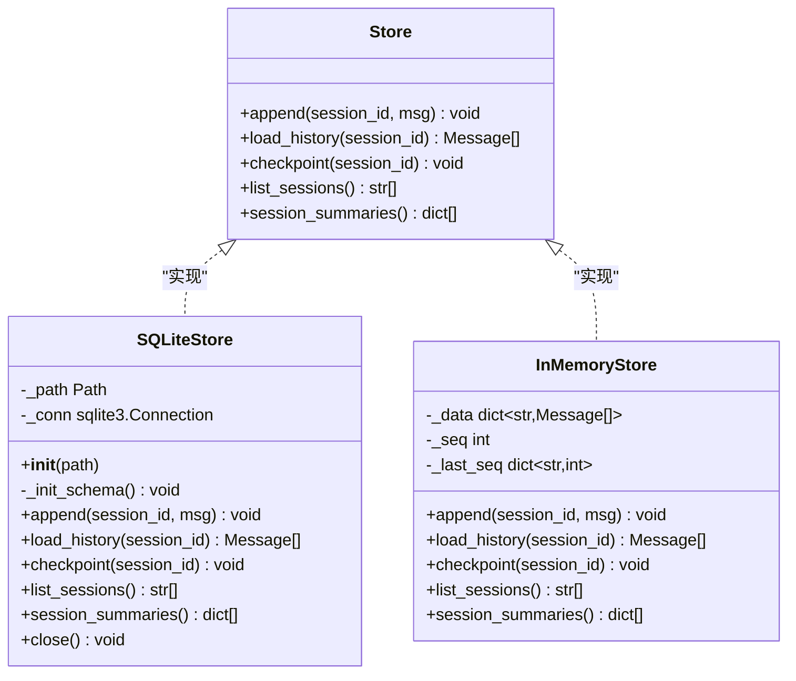
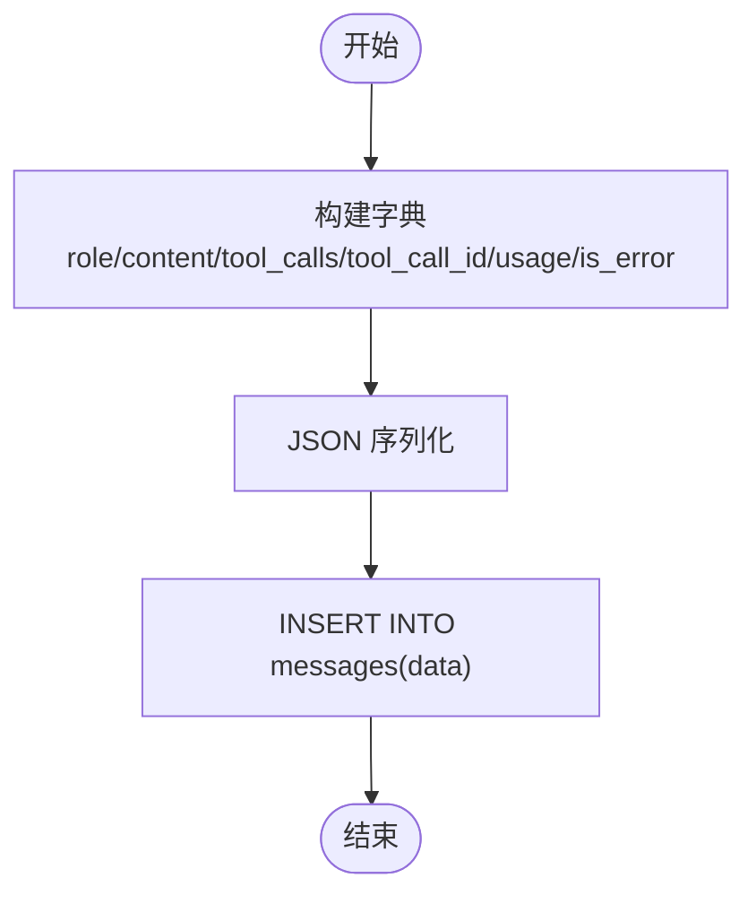
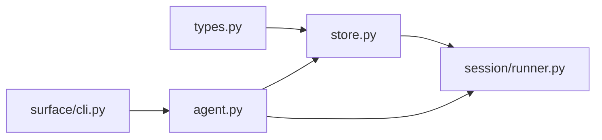

# 消息持久化

<cite>
**本文引用的文件**   
- [src/microagent/core/store.py](file://src/microagent/core/store.py)
- [src/microagent/core/types.py](file://src/microagent/core/types.py)
- [src/microagent/agent.py](file://src/microagent/agent.py)
- [src/microagent/session/runner.py](file://src/microagent/session/runner.py)
- [src/microagent/surface/cli.py](file://src/microagent/surface/cli.py)
- [tests/unit/test_store.py](file://tests/unit/test_store.py)
- [tests/unit/test_session_persist.py](file://tests/unit/test_session_persist.py)
</cite>

## 目录
1. [简介](#简介)
2. [项目结构](#项目结构)
3. [核心组件](#核心组件)
4. [架构总览](#架构总览)
5. [详细组件分析](#详细组件分析)
6. [依赖关系分析](#依赖关系分析)
7. [性能考量](#性能考量)
8. [故障排查指南](#故障排查指南)
9. [结论](#结论)
10. [附录](#附录)

## 简介
本文件围绕 MicroAgent 的消息持久化机制展开，重点解释 Store 协议的设计理念与接口定义（append、load_history、checkpoint、list_sessions、session_summaries），并深入剖析 SQLiteStore 的实现原理：数据库表结构设计、索引优化、WAL 模式配置。同时说明消息存储的数据格式（Message 对象的序列化方式与 JSON 存储结构）、会话 ID 管理机制与消息排序策略。最后提供自定义存储后端的开发指南，以及数据迁移、备份恢复、性能优化等高级主题建议。

## 项目结构
与消息持久化直接相关的代码主要位于 core/store.py 与 core/types.py，并在 agent.py 和 session/runner.py 中集成使用；CLI 层负责会话创建与恢复流程。测试用例覆盖了基本读写、工具调用与用量字段、跨连接持久化等场景。

图表来源
- [src/microagent/core/store.py:28-36](file://src/microagent/core/store.py#L28-L36)
- [src/microagent/core/types.py:17-69](file://src/microagent/core/types.py#L17-L69)
- [src/microagent/agent.py:31-77](file://src/microagent/agent.py#L31-L77)
- [src/microagent/session/runner.py:40-72](file://src/microagent/session/runner.py#L40-L72)
- [src/microagent/surface/cli.py:155-197](file://src/microagent/surface/cli.py#L155-L197)

章节来源
- [src/microagent/core/store.py:1-226](file://src/microagent/core/store.py#L1-L226)
- [src/microagent/core/types.py:1-189](file://src/microagent/core/types.py#L1-L189)
- [src/microagent/agent.py:1-113](file://src/microagent/agent.py#L1-L113)
- [src/microagent/session/runner.py:40-146](file://src/microagent/session/runner.py#L40-L146)
- [src/microagent/surface/cli.py:155-207](file://src/microagent/surface/cli.py#L155-L207)

## 核心组件
- Store 协议：定义了异步的 append、load_history、checkpoint、list_sessions、session_summaries 五个方法，用于统一不同后端（SQLite、内存）的持久化能力。
- Message 类型：包含 role、content、tool_calls、tool_call_id、usage、is_error 等字段，是消息序列化的基础。
- SQLiteStore：基于 SQLite 的 WAL 模式实现，提供高并发读、崩溃恢复与持久化保障。
- InMemoryStore：面向测试的内存实现，保持与 SQLiteStore 一致的接口行为。

章节来源
- [src/microagent/core/store.py:28-36](file://src/microagent/core/store.py#L28-L36)
- [src/microagent/core/types.py:17-69](file://src/microagent/core/types.py#L17-L69)
- [src/microagent/core/store.py:95-182](file://src/microagent/core/store.py#L95-L182)
- [src/microagent/core/store.py:189-226](file://src/microagent/core/store.py#L189-L226)

## 架构总览
消息持久化的整体流程如下：
- Agent.from_config 接收 store 与 session_id，构造 SessionRunner。
- SessionRunner.run_turn 在每轮结束时将用户消息追加到 store。
- CLI 通过 new/list/resume 命令管理会话生命周期，使用 store.list_sessions 与 load_history。
- SQLiteStore 以 WAL 模式运行，确保写入原子性与崩溃恢复；通过 checkpoint 触发 WAL 检查点。

图表来源
- [src/microagent/agent.py:31-77](file://src/microagent/agent.py#L31-L77)
- [src/microagent/session/runner.py:124-146](file://src/microagent/session/runner.py#L124-L146)
- [src/microagent/core/store.py:28-36](file://src/microagent/core/store.py#L28-L36)
- [src/microagent/core/store.py:144-178](file://src/microagent/core/store.py#L144-L178)

## 详细组件分析

### Store 协议设计
- 目标：为不同的存储后端提供统一的异步接口，屏蔽底层差异。
- 关键方法：
  - append(session_id, msg): 追加一条消息到指定会话。
  - load_history(session_id): 按顺序加载会话历史消息。
  - checkpoint(session_id): 强制持久化检查点（如 WAL checkpoint）。
  - list_sessions(): 列出所有会话 ID（通常按最近活动排序）。
  - session_summaries(): 返回每个会话的统计与预览（避免 O(N) 多次 load_history）。

章节来源
- [src/microagent/core/store.py:28-36](file://src/microagent/core/store.py#L28-L36)

### SQLiteStore 实现原理
- 数据库表结构：
  - messages(id, session_id, seq, data)，其中 id 自增主键，seq 表示会话内消息序号，data 为 JSON 字符串。
  - 唯一约束 UNIQUE(session_id, seq) 保证同一会话内序号不重复。
  - 复合索引 idx_session(session_id, seq) 加速按会话查询与排序。
- WAL 模式配置：
  - PRAGMA journal_mode=WAL：启用写前日志，提升并发读性能与崩溃恢复能力。
  - PRAGMA synchronous=NORMAL：平衡性能与安全性。
  - PRAGMA foreign_keys=ON：开启外键约束（当前未使用，但保持规范）。
- 核心操作：
  - append：先 SELECT MAX(seq) 计算下一条序号，再 INSERT 序列化后的 data。
  - load_history：SELECT data WHERE session_id=? ORDER BY seq，反序列化为 Message。
  - checkpoint：PRAGMA wal_checkpoint(TRUNCATE) 释放 WAL 空间。
  - list_sessions：GROUP BY session_id 并按 MAX(id) DESC 排序，体现“最近活跃”语义。
  - session_summaries：单条 SQL 聚合 count 与 last_data，减少多次 IO。

图表来源
- [src/microagent/core/store.py:28-36](file://src/microagent/core/store.py#L28-L36)
- [src/microagent/core/store.py:95-182](file://src/microagent/core/store.py#L95-L182)
- [src/microagent/core/store.py:189-226](file://src/microagent/core/store.py#L189-L226)

章节来源
- [src/microagent/core/store.py:95-182](file://src/microagent/core/store.py#L95-L182)
- [src/microagent/core/store.py:189-226](file://src/microagent/core/store.py#L189-L226)

### 消息序列化与 JSON 存储结构
- 序列化：
  - _serialize_message 将 Message 转为 JSON 字典，包含 role、content、tool_calls（数组）、tool_call_id、usage（input_tokens、output_tokens、cost_usd）、is_error。
  - 反序列化：_deserialize_message 从 JSON 重建 Message，兼容可选字段。
- 存储结构：
  - 每条消息一行，data 字段为 JSON 文本，便于扩展与跨语言读取。
  - usage.cost_usd 采用可选字段，默认 0.0。
  - is_error 标记工具结果错误状态。

图表来源
- [src/microagent/core/store.py:44-87](file://src/microagent/core/store.py#L44-L87)

章节来源
- [src/microagent/core/store.py:44-87](file://src/microagent/core/store.py#L44-L87)
- [src/microagent/core/types.py:17-69](file://src/microagent/core/types.py#L17-L69)

### 会话 ID 管理机制
- 生成策略：
  - CLI 新建会话时，使用 “cli-{时间戳}” 作为 session_id。
  - Agent.from_config 默认 session_id="default"，可传入任意字符串。
- 使用位置：
  - SessionRunner 持有 session_id，用于 store.append/load_history。
  - CLI resume 命令根据 target session_id 加载历史并继续对话。

章节来源
- [src/microagent/surface/cli.py:155-197](file://src/microagent/surface/cli.py#L155-L197)
- [src/microagent/agent.py:31-77](file://src/microagent/agent.py#L31-L77)
- [src/microagent/session/runner.py:40-72](file://src/microagent/session/runner.py#L40-L72)

### 消息排序策略
- 会话内顺序：按 seq 升序排列，保证消息时序正确。
- 会话间顺序：list_sessions 使用 GROUP BY session_id 并按 MAX(id) DESC 排序，体现“最近活跃优先”。
- InMemoryStore 通过全局 _seq 计数器模拟相同语义。

章节来源
- [src/microagent/core/store.py:122-148](file://src/microagent/core/store.py#L122-L148)
- [src/microagent/core/store.py:189-226](file://src/microagent/core/store.py#L189-L226)

## 依赖关系分析
- types.py 提供 Message、ToolCall、Usage 等核心数据结构。
- store.py 依赖 types.py 进行序列化/反序列化。
- agent.py 组装 LLM、ToolRegistry、Budget、SessionRunner，并注入 store 与 session_id。
- session/runner.py 在 run_turn 中调用 store.append，实现自动持久化。
- cli.py 通过 new/list/resume 命令驱动会话生命周期，使用 store 的列表与摘要功能。

图表来源
- [src/microagent/core/types.py:1-69](file://src/microagent/core/types.py#L1-L69)
- [src/microagent/core/store.py:1-36](file://src/microagent/core/store.py#L1-L36)
- [src/microagent/agent.py:1-77](file://src/microagent/agent.py#L1-L77)
- [src/microagent/session/runner.py:40-146](file://src/microagent/session/runner.py#L40-L146)
- [src/microagent/surface/cli.py:155-207](file://src/microagent/surface/cli.py#L155-L207)

章节来源
- [src/microagent/core/store.py:1-226](file://src/microagent/core/store.py#L1-L226)
- [src/microagent/core/types.py:1-189](file://src/microagent/core/types.py#L1-L189)
- [src/microagent/agent.py:1-113](file://src/microagent/agent.py#L1-L113)
- [src/microagent/session/runner.py:40-146](file://src/microagent/session/runner.py#L40-L146)
- [src/microagent/surface/cli.py:155-207](file://src/microagent/surface/cli.py#L155-L207)

## 性能考量
- WAL 模式：
  - 提高并发读性能，降低锁竞争；适合多会话、高频读取场景。
  - 定期 checkpoint 可减少 WAL 文件大小，避免磁盘膨胀。
- 索引优化：
  - idx_session(session_id, seq) 覆盖常见查询路径（按会话加载历史）。
  - 如需按时间范围或内容检索，可考虑额外索引（例如对 data 的 FTS 扩展，但需权衡写入开销）。
- 序列化成本：
  - JSON 序列化/反序列化开销与消息大小成正比；大 content 或复杂 tool_calls 会增加 CPU 与 I/O。
- 批量写入：
  - 当前 append 为逐条插入；在高吞吐场景可考虑事务批处理以减少提交次数。
- 内存模型：
  - InMemoryStore 适用于单元测试与快速验证，但不具备持久化能力。

[本节为通用性能指导，不直接分析具体文件]

## 故障排查指南
- 常见问题：
  - 会话历史为空：确认 session_id 是否正确传递；检查 store.load_history 是否被调用。
  - 消息顺序错乱：检查 seq 是否递增；确保同一会话内写入顺序一致。
  - 数据丢失：确认 checkpoint 是否执行；WAL 模式下未 checkpoint 可能导致部分数据仍在 WAL 文件中。
  - 工具调用或用量字段缺失：检查序列化逻辑是否包含 tool_calls、usage、is_error 等可选字段。
- 调试建议：
  - 打印或记录 append 与 load_history 的输入输出。
  - 使用 SQLite 命令行工具检查 messages 表结构与数据完整性。
  - 在测试中复用 test_store.py 与 test_session_persist.py 的断言思路。

章节来源
- [tests/unit/test_store.py:37-99](file://tests/unit/test_store.py#L37-L99)
- [tests/unit/test_session_persist.py:8-75](file://tests/unit/test_session_persist.py#L8-L75)

## 结论
MicroAgent 的消息持久化通过 Store 协议抽象了不同后端实现，SQLiteStore 基于 WAL 模式提供了可靠的持久化与高性能读取。Message 的 JSON 序列化保证了灵活性与可扩展性。会话 ID 管理与消息排序策略确保了正确的业务语义。结合索引优化、checkpoint 策略与批量写入改进，可在高负载场景下进一步提升性能与稳定性。

[本节为总结性内容，不直接分析具体文件]

## 附录

### 自定义存储后端开发指南
- 必须实现的接口（参考 Store 协议）：
  - append(session_id, msg): 异步追加消息。
  - load_history(session_id): 异步加载历史消息，按顺序返回。
  - checkpoint(session_id): 异步触发持久化检查点。
  - list_sessions(): 异步列出会话 ID，建议按最近活跃排序。
  - session_summaries(): 异步返回会话摘要（count、preview），避免多次 load_history。
- 数据一致性：
  - 保证同一会话内消息顺序与 seq 单调递增。
  - 支持跨进程/线程安全访问（必要时加锁或使用线程安全的 DB 客户端）。
- 性能建议：
  - 使用连接池或单连接（注意并发限制）。
  - 批量写入时使用事务减少提交开销。
  - 合理设计索引，覆盖常用查询路径。
- 兼容性：
  - 保持与现有 JSON 序列化格式一致，确保向后兼容。
  - 可选字段（tool_calls、usage、is_error）需正确处理空值。

章节来源
- [src/microagent/core/store.py:28-36](file://src/microagent/core/store.py#L28-L36)
- [src/microagent/core/store.py:44-87](file://src/microagent/core/store.py#L44-L87)

### 数据迁移与备份恢复
- 迁移策略：
  - 若修改 messages 表结构，建议在应用启动时检测版本并执行迁移脚本。
  - 保持 JSON 字段的向后兼容，新增字段默认值明确。
- 备份恢复：
  - 停止写入后复制 .db 与 .db-wal/.db-shm 文件进行完整备份。
  - 恢复时确保 WAL 文件与主库一致，必要时执行 checkpoint 清理 WAL。
- 校验与修复：
  - 使用 VACUUM 与 PRAGMA integrity_check 检查数据库完整性。
  - 针对损坏的 WAL 文件，可通过 PRAGMA wal_checkpoint(RESTART) 尝试恢复。

[本节为通用指导，不直接分析具体文件]

### 高级优化建议
- 压缩与归档：
  - 对长期会话的历史消息进行压缩（如仅保留摘要与关键片段），减少存储空间。
- 分库分表：
  - 按时间或会话前缀拆分数据库文件，降低单库体积。
- 监控与告警：
  - 记录写入延迟、查询耗时、WAL 文件大小等指标，设置阈值告警。
- 缓存策略：
  - 热点会话可引入内存缓存（LRU），加速频繁读取。

[本节为通用指导，不直接分析具体文件]