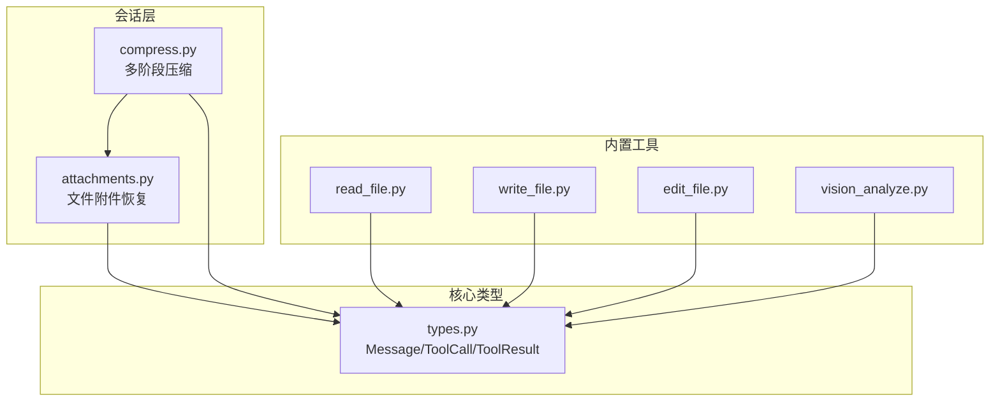
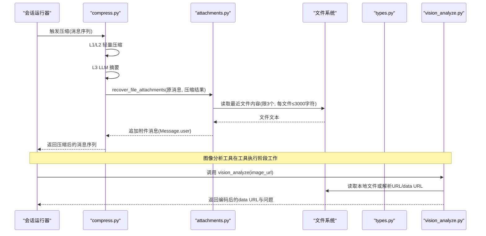
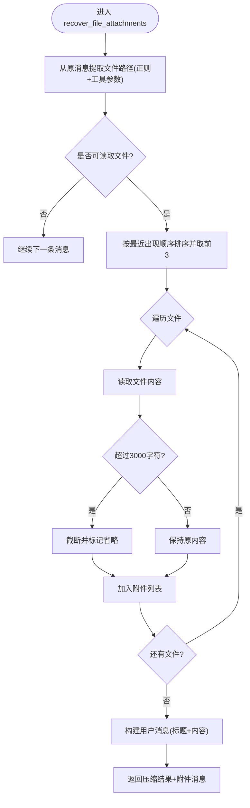
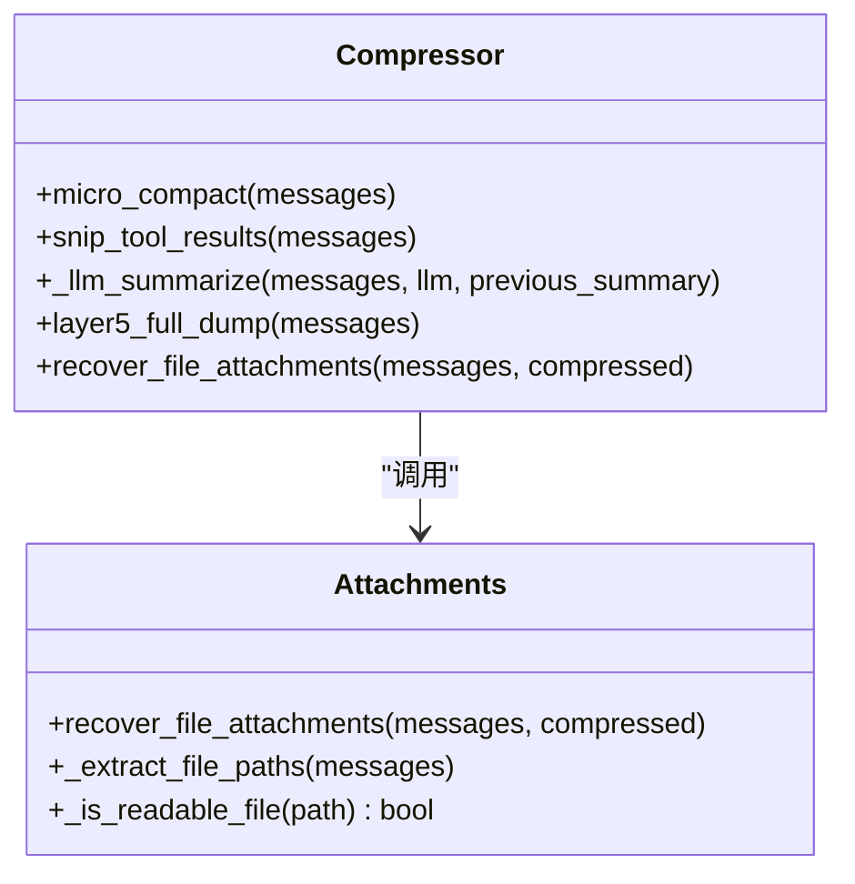
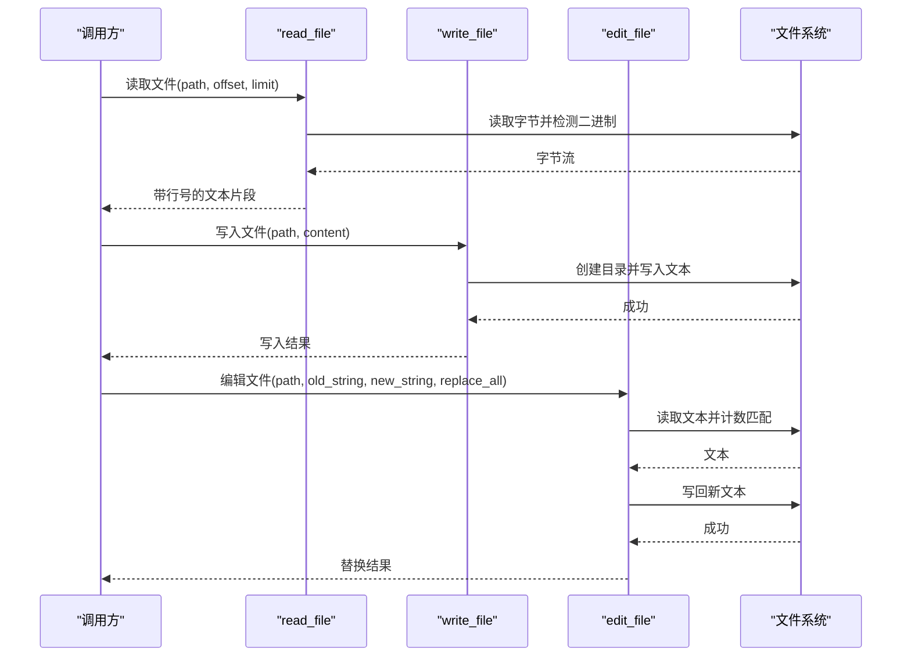
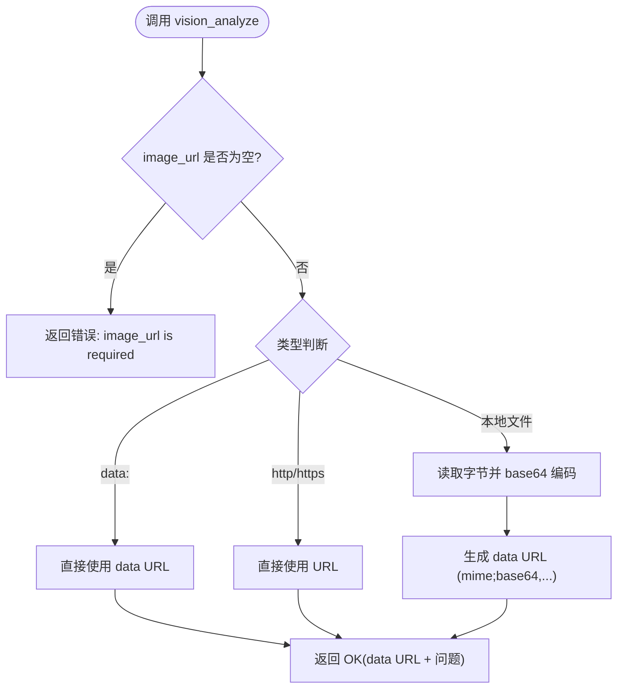
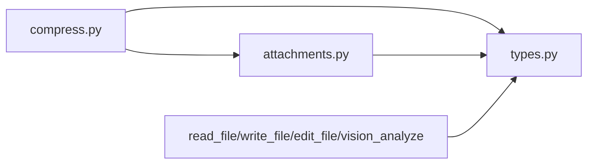

# 附件管理

<cite>
**本文引用的文件**   
- [src/microagent/session/attachments.py](file://src/microagent/session/attachments.py)
- [src/microagent/session/compress.py](file://src/microagent/session/compress.py)
- [src/microagent/core/types.py](file://src/microagent/core/types.py)
- [src/microagent/tools/builtins/read_file.py](file://src/microagent/tools/builtins/read_file.py)
- [src/microagent/tools/builtins/write_file.py](file://src/microagent/tools/builtins/write_file.py)
- [src/microagent/tools/builtins/edit_file.py](file://src/microagent/tools/builtins/edit_file.py)
- [src/microagent/tools/builtins/vision_analyze.py](file://src/microagent/tools/builtins/vision_analyze.py)
- [tests/unit/test_attachments.py](file://tests/unit/test_attachments.py)
</cite>

## 目录
1. [简介](#简介)
2. [项目结构](#项目结构)
3. [核心组件](#核心组件)
4. [架构总览](#架构总览)
5. [详细组件分析](#详细组件分析)
6. [依赖关系分析](#依赖关系分析)
7. [性能考量](#性能考量)
8. [故障排查指南](#故障排查指南)
9. [结论](#结论)
10. [附录](#附录)

## 简介
本文件系统化阐述 MicroAgent 的“附件管理”能力，聚焦于多模态内容支持（图片、文本文件等）、上传与存储策略、检索机制、与消息的关联方式、元数据与类型识别、大小限制、安全检查、性能优化以及清理与垃圾回收。需要特别说明的是：当前仓库中的附件相关实现主要围绕“上下文压缩后的文件内容恢复”和“图像分析工具”展开，并未提供通用的“上传—持久化—下载”的独立附件服务。因此，本文在尊重代码事实的基础上，给出基于现有实现的完整说明，并对缺失能力进行明确标注与改进建议。

## 项目结构
与附件相关的核心代码集中在 session 层与 tools 层：
- session/attachments.py：负责从历史消息中抽取最近访问的文件路径，并在压缩后以“附件消息”的形式恢复关键文件内容，避免 LLM 摘要丢失上下文。
- session/compress.py：在多阶段压缩流程中调用附件恢复逻辑，确保压缩后的消息仍保留必要的文件级上下文。
- core/types.py：定义 Message、ToolCall、ToolResult 等基础数据结构，是附件与消息关联的载体。
- tools/builtins/*：包含 read_file、write_file、edit_file 等文件操作工具，以及 vision_analyze 用于图像分析（本地文件、URL、data: URL）。

**图表来源** 
- [src/microagent/session/compress.py:350-420](file://src/microagent/session/compress.py#L350-L420)
- [src/microagent/session/attachments.py:103-146](file://src/microagent/session/attachments.py#L103-L146)
- [src/microagent/core/types.py:27-68](file://src/microagent/core/types.py#L27-L68)

**章节来源**
- [src/microagent/session/attachments.py:1-146](file://src/microagent/session/attachments.py#L1-L146)
- [src/microagent/session/compress.py:350-529](file://src/microagent/session/compress.py#L350-L529)
- [src/microagent/core/types.py:1-189](file://src/microagent/core/types.py#L1-L189)

## 核心组件
- 文件附件恢复（attachments.py）
  - 功能：从原始消息中提取最近被工具调用的文件路径，读取其内容并作为用户消息附加到压缩结果末尾，保障上下文不丢失。
  - 限制：最多恢复 3 个文件；每个文件最多 3000 字符；仅处理压缩前消息中出现的路径。
  - 路径识别：通过正则匹配工具参数与消息正文中的文件路径，过滤非文件路径（如 URL、目录、系统敏感路径）。
- 压缩流程集成（compress.py）
  - 在 L3（LLM 摘要）与强制手动 /compact 分支中，均会调用附件恢复，将文件内容追加为一条用户消息。
  - 提供 Layer5 全量转储（full dump）作为兜底策略，当 L1-L4 仍不足时，直接追加关键文件的原始内容。
- 消息与附件关联（types.py）
  - 使用统一的 Message 结构承载文本与工具调用；附件恢复以 Message.user(content=...) 形式注入。
  - ToolCall/ToolResult 用于记录工具调用与结果，便于后续追踪与调试。
- 文件读写工具（read_file.py, write_file.py, edit_file.py）
  - 提供安全的文件读取（含二进制检测与行号格式化）、写入（自动创建父目录）、编辑（替换字符串）能力。
  - 所有工具返回 ToolResult，统一错误与成功语义。
- 图像分析工具（vision_analyze.py）
  - 支持本地文件、http(s) URL、data: URL 三种输入；对本地文件进行 base64 编码并生成 data URL，交由上层 LLM 端点处理视觉任务。

**章节来源**
- [src/microagent/session/attachments.py:103-146](file://src/microagent/session/attachments.py#L103-L146)
- [src/microagent/session/compress.py:350-420](file://src/microagent/session/compress.py#L350-L420)
- [src/microagent/core/types.py:27-116](file://src/microagent/core/types.py#L27-L116)
- [src/microagent/tools/builtins/read_file.py:14-55](file://src/microagent/tools/builtins/read_file.py#L14-L55)
- [src/microagent/tools/builtins/write_file.py:14-30](file://src/microagent/tools/builtins/write_file.py#L14-L30)
- [src/microagent/tools/builtins/edit_file.py:14-49](file://src/microagent/tools/builtins/edit_file.py#L14-L49)
- [src/microagent/tools/builtins/vision_analyze.py:21-66](file://src/microagent/tools/builtins/vision_analyze.py#L21-L66)

## 架构总览
下图展示“压缩—附件恢复—消息注入”的主流程，以及图像分析工具的数据流向。

**图表来源** 
- [src/microagent/session/compress.py:350-420](file://src/microagent/session/compress.py#L350-L420)
- [src/microagent/session/attachments.py:103-146](file://src/microagent/session/attachments.py#L103-L146)
- [src/microagent/tools/builtins/vision_analyze.py:21-66](file://src/microagent/tools/builtins/vision_analyze.py#L21-L66)

## 详细组件分析

### 文件附件恢复（attachments.py）
- 设计要点
  - 路径提取：扫描 tool_calls 与消息正文，匹配常见文件路径模式，排除 URL、目录与系统敏感路径。
  - 最近性排序：按最后出现索引排序，取前 3 个文件。
  - 内容截断：单文件上限 3000 字符，超出部分截断并标记省略。
  - 注入方式：构造一条用户消息，包含标题与多个文件内容片段，追加到压缩结果末尾。
- 复杂度与边界
  - 时间复杂度：O(N·M)，N 为消息数，M 为每条消息长度（正则匹配开销）。
  - 空间复杂度：O(K·C)，K 为恢复文件数（≤3），C 为单文件大小（≤3000 字符）。
  - 异常处理：读取失败或解码错误时跳过该文件，不影响整体流程。

**图表来源** 
- [src/microagent/session/attachments.py:30-101](file://src/microagent/session/attachments.py#L30-L101)
- [src/microagent/session/attachments.py:103-146](file://src/microagent/session/attachments.py#L103-L146)

**章节来源**
- [src/microagent/session/attachments.py:1-146](file://src/microagent/session/attachments.py#L1-L146)
- [tests/unit/test_attachments.py:1-138](file://tests/unit/test_attachments.py#L1-L138)

### 压缩流程与附件恢复集成（compress.py）
- 多阶段压缩
  - L1：微压缩（零成本）
  - L2：裁剪工具结果（零成本）
  - L3：LLM 摘要（增量更新）
  - L5：全量转储（兜底）
- 附件恢复时机
  - 在 L3 摘要后与强制 /compact 分支中，均调用 recover_file_attachments，确保摘要后仍保留关键文件上下文。
- 回退策略
  - 当预算超限或异常发生时，启用断路器与冷却期，回退为占位提示与最近几条消息。

**图表来源** 
- [src/microagent/session/compress.py:350-529](file://src/microagent/session/compress.py#L350-L529)
- [src/microagent/session/attachments.py:30-146](file://src/microagent/session/attachments.py#L30-L146)

**章节来源**
- [src/microagent/session/compress.py:350-529](file://src/microagent/session/compress.py#L350-L529)

### 文件读写与编辑工具（read_file.py, write_file.py, edit_file.py）
- read_file
  - 安全读取：先读字节检测二进制（包含空字节则拒绝），再 UTF-8 解码显示；支持偏移与行数限制。
  - 输出格式：带行号的文本片段，必要时截断提示。
- write_file
  - 自动创建父目录，异步写入文本，返回写入字节数与路径。
- edit_file
  - 基于字符串替换，支持全部替换或首次替换；若匹配次数大于 1 且未开启全部替换，返回错误提示。

**图表来源** 
- [src/microagent/tools/builtins/read_file.py:14-55](file://src/microagent/tools/builtins/read_file.py#L14-L55)
- [src/microagent/tools/builtins/write_file.py:14-30](file://src/microagent/tools/builtins/write_file.py#L14-L30)
- [src/microagent/tools/builtins/edit_file.py:14-49](file://src/microagent/tools/builtins/edit_file.py#L14-L49)

**章节来源**
- [src/microagent/tools/builtins/read_file.py:14-55](file://src/microagent/tools/builtins/read_file.py#L14-L55)
- [src/microagent/tools/builtins/write_file.py:14-30](file://src/microagent/tools/builtins/write_file.py#L14-L30)
- [src/microagent/tools/builtins/edit_file.py:14-49](file://src/microagent/tools/builtins/edit_file.py#L14-L49)

### 图像分析工具（vision_analyze.py）
- 输入支持：本地文件路径、http(s) URL、data: URL。
- 处理流程：本地文件读取并 base64 编码，结合 MIME 类型生成 data URL；URL 直接透传；data: URL 直接使用。
- 输出：返回编码后的 data URL 与问题描述，实际视觉推理由上层 LLM 端点完成。

**图表来源** 
- [src/microagent/tools/builtins/vision_analyze.py:21-66](file://src/microagent/tools/builtins/vision_analyze.py#L21-L66)

**章节来源**
- [src/microagent/tools/builtins/vision_analyze.py:21-66](file://src/microagent/tools/builtins/vision_analyze.py#L21-L66)

## 依赖关系分析
- 模块耦合
  - compress.py 依赖 attachments.py 进行附件恢复，两者共同依赖 types.py 的消息结构。
  - 工具模块（read_file、write_file、edit_file、vision_analyze）通过 ToolResult 与上层交互，不直接修改消息结构。
- 外部依赖
  - 文件系统 I/O：Path.read_bytes/read_text/write_text。
  - 标准库：re、base64、mimetypes、asyncio。
- 潜在循环依赖
  - 当前无循环导入；attachments.py 仅在 compress.py 中被按需导入。

**图表来源** 
- [src/microagent/session/compress.py:350-420](file://src/microagent/session/compress.py#L350-L420)
- [src/microagent/session/attachments.py:103-146](file://src/microagent/session/attachments.py#L103-L146)
- [src/microagent/core/types.py:27-116](file://src/microagent/core/types.py#L27-L116)

**章节来源**
- [src/microagent/session/compress.py:350-529](file://src/microagent/session/compress.py#L350-L529)
- [src/microagent/session/attachments.py:1-146](file://src/microagent/session/attachments.py#L1-L146)
- [src/microagent/core/types.py:1-189](file://src/microagent/core/types.py#L1-L189)

## 性能考量
- 缓存机制
  - 当前未实现显式文件内容缓存；每次恢复都会重新读取磁盘。建议在高频场景引入内存缓存（LRU），键为绝对路径，值为内容快照与 mtime。
- 异步处理
  - 文件 I/O 已使用 asyncio.to_thread 避免阻塞事件循环；图像编码与读取均为异步友好。
- 流式传输
  - 附件恢复为一次性读取与拼接，不适合大文件流式传输；如需支持大文件，应改为分块读取与流式拼接。
- 压缩与附件恢复的协同
  - L1/L2 零成本预处理减少 L3 负载；附件恢复仅在 L3 之后执行，降低不必要的 I/O。
- 建议优化
  - 对频繁访问的文件增加缓存；对超大文件采用分页读取与预览；对图像分析增加尺寸与分辨率限制。

[本节为通用指导，不直接分析具体文件]

## 故障排查指南
- 常见问题
  - 二进制文件无法显示：read_file 检测到空字节将返回错误；需确认文件类型与编码。
  - 路径无效或被忽略：attachments 的正则与过滤规则会排除 URL、目录与系统路径；检查路径格式与权限。
  - 压缩失败或预算超限：compress 会触发断路器与冷却期，回退为占位消息；检查 LLM 调用与预算配置。
  - 图像分析失败：确认 image_url 有效、网络可达或本地文件存在；检查模型是否支持视觉能力。
- 定位方法
  - 查看 ToolResult 的 is_error 与 metadata 字段；检查日志中的错误信息。
  - 使用单元测试覆盖路径提取与可读性判断逻辑，验证边界情况。

**章节来源**
- [src/microagent/tools/builtins/read_file.py:24-35](file://src/microagent/tools/builtins/read_file.py#L24-L35)
- [src/microagent/session/compress.py:369-416](file://src/microagent/session/compress.py#L369-L416)
- [src/microagent/tools/builtins/vision_analyze.py:50-55](file://src/microagent/tools/builtins/vision_analyze.py#L50-L55)
- [tests/unit/test_attachments.py:1-138](file://tests/unit/test_attachments.py#L1-L138)

## 结论
MicroAgent 的附件管理当前以“上下文压缩后的文件内容恢复”为核心，辅以图像分析工具的多模态支持。该设计在保证 LLM 摘要质量的同时，避免了关键文件上下文的丢失。尚未实现通用上传—持久化—下载服务，也未包含病毒扫描与细粒度访问控制。未来可在缓存、流式传输、安全校验与权限控制方面进一步增强，以满足更广泛的业务需求。

[本节为总结性内容，不直接分析具体文件]

## 附录
- 术语说明
  - 附件：在此项目中指压缩后追加的文件内容片段与图像分析产生的 data URL。
  - 多模态：支持文本与图像两种内容形式的处理与分析。
- 扩展建议
  - 引入统一的附件存储服务（对象存储/文件系统），提供上传、鉴权、病毒扫描、版本管理与生命周期清理。
  - 增强类型识别与大小限制策略，支持音频、视频等多媒体类型。
  - 完善访问控制与审计日志，满足企业级安全合规要求。

[本节为概念性内容，不直接分析具体文件]