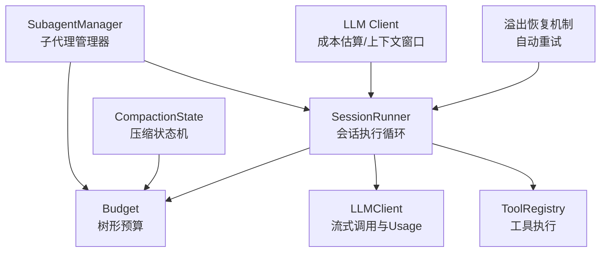
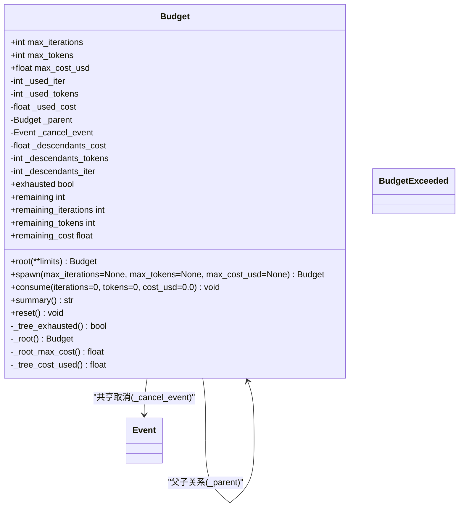
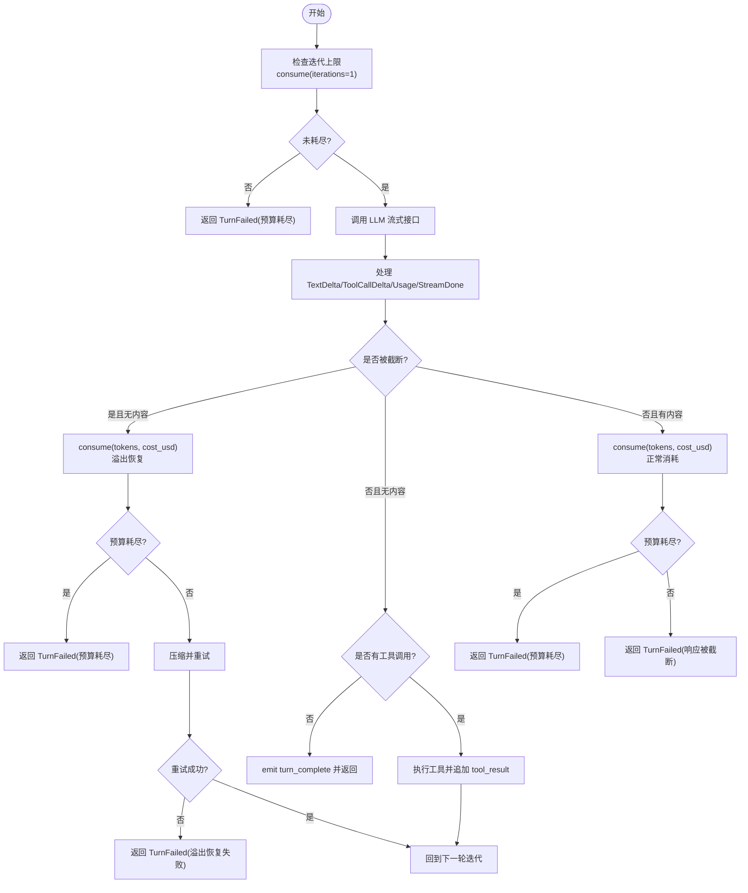
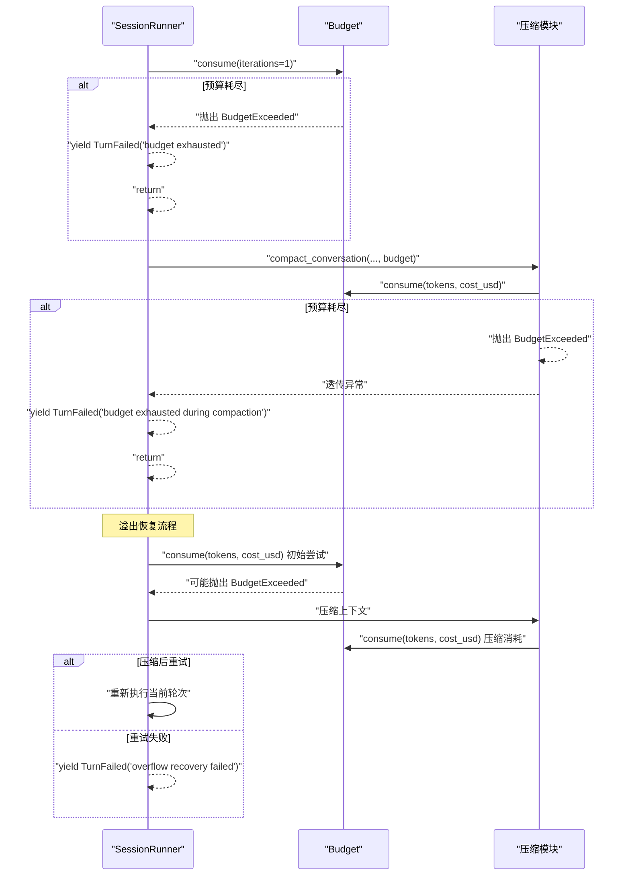
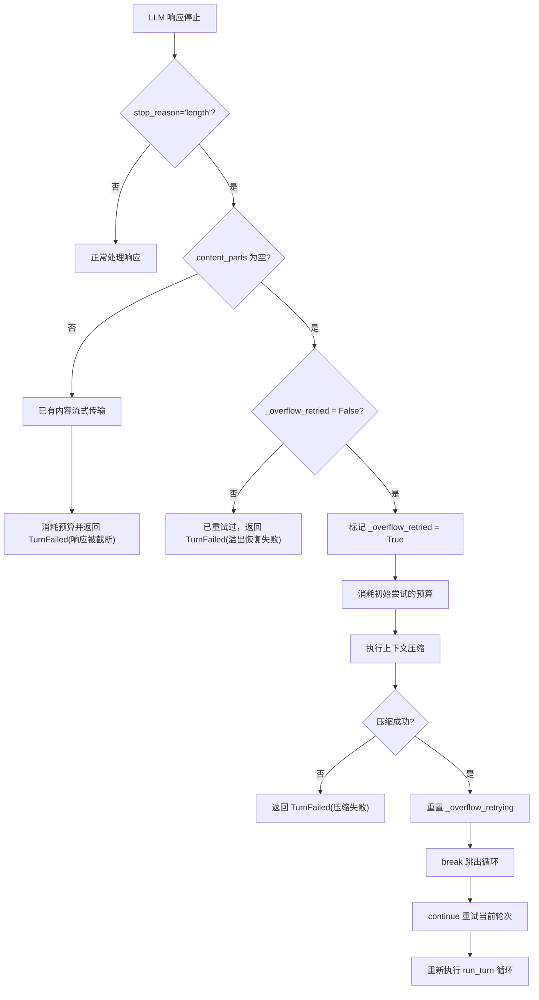
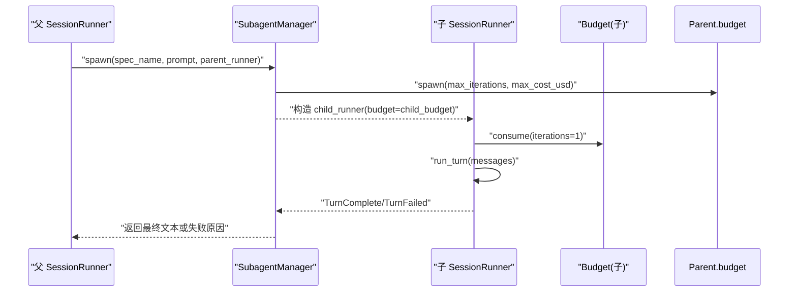
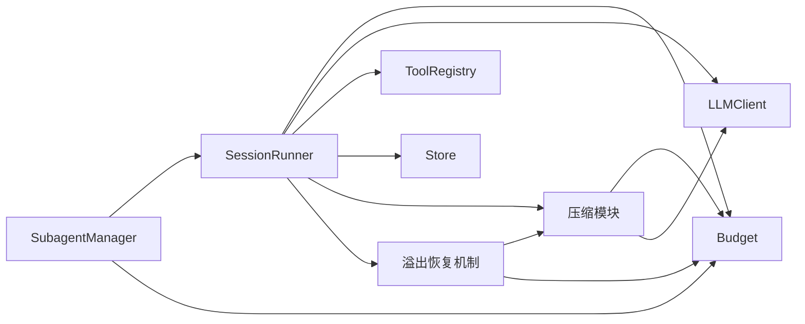

# 预算控制

<cite>
**本文引用的文件**
- [src/microagent/session/budget.py](file://src/microagent/session/budget.py)
- [src/microagent/session/runner.py](file://src/microagent/session/runner.py)
- [src/microagent/subagent/manager.py](file://src/microagent/subagent/manager.py)
- [src/microagent/session/compress.py](file://src/microagent/session/compress.py)
- [src/microagent/llm/client.py](file://src/microagent/llm/client.py)
- [tests/unit/test_budget.py](file://tests/unit/test_budget.py)
- [tests/unit/test_budget_tree.py](file://tests/unit/test_budget_tree.py)
- [tests/unit/test_runner_errors.py](file://tests/unit/test_runner_errors.py)
- [tests/unit/test_overflow_recovery.py](file://tests/unit/test_overflow_recovery.py)
- [README.md](file://README.md)
</cite>

## 更新摘要
**所做更改**
- 更新了溢出恢复机制中预算消耗的详细说明
- 修正了失败尝试和重试时迭代次数消耗的说明
- 增强了异常处理与恢复策略的描述
- 添加了溢出恢复流程的详细分析

## 目录
1. [简介](#简介)
2. [项目结构](#项目结构)
3. [核心组件](#核心组件)
4. [架构总览](#架构总览)
5. [详细组件分析](#详细组件分析)
6. [依赖关系分析](#依赖关系分析)
7. [性能考量](#性能考量)
8. [故障排查指南](#故障排查指南)
9. [结论](#结论)
10. [附录](#附录)

## 简介
本文件系统性阐述 MicroAgent 的预算控制机制，重点围绕 Budget 类的设计与实现、树形预算结构与父子关系管理、预算继承与隔离、消耗计算（token 计数、成本估算、迭代次数限制）、异常处理与恢复策略、监控与报告能力，以及子代理预算隔离与资源分配策略。文档同时提供面向不同场景的配置最佳实践，帮助读者在复杂任务中稳定、可控地运行 Agent。

**更新** 本次更新重点反映了溢出恢复机制中预算消耗逻辑的改进，确保失败的初始尝试和重试都会正确消耗预算，包括迭代次数的消耗。

## 项目结构
与预算控制直接相关的代码主要分布在 session 层与 subagent 层：
- 预算核心：session/budget.py
- 会话执行循环：session/runner.py
- 子代理管理与隔离：subagent/manager.py
- 上下文压缩与 token 估算：session/compress.py
- LLM 客户端与成本估算：llm/client.py
- 单元测试覆盖：tests/unit/test_budget*.py, test_runner_errors.py, test_overflow_recovery.py
- 使用示例与说明：README.md



图表来源
- [src/microagent/session/runner.py:118-284](file://src/microagent/session/runner.py#L118-L284)
- [src/microagent/session/budget.py:14-168](file://src/microagent/session/budget.py#L14-L168)
- [src/microagent/subagent/manager.py:77-142](file://src/microagent/subagent/manager.py#L77-L142)
- [src/microagent/session/compress.py:344-405](file://src/microagent/session/compress.py#L344-L405)
- [src/microagent/llm/client.py:46-85](file://src/microagent/llm/client.py#L46-L85)

章节来源
- [src/microagent/session/budget.py:1-168](file://src/microagent/session/budget.py#L1-L168)
- [src/microagent/session/runner.py:118-284](file://src/microagent/session/runner.py#L118-L284)
- [src/microagent/subagent/manager.py:77-142](file://src/microagent/subagent/manager.py#L77-L142)
- [src/microagent/session/compress.py:344-405](file://src/microagent/session/compress.py#L344-L405)
- [src/microagent/llm/client.py:46-85](file://src/microagent/llm/client.py#L46-L85)

## 核心组件
- Budget：树形预算对象，支持根节点创建、子节点派生、共享取消事件、祖先链上报、剩余量查询、摘要输出与重置。
- SessionRunner：会话执行主循环，按迭代扣减预算、统计 token 与成本、处理截断与失败、触发压缩与事件总线。
- SubagentManager：子代理管理器，基于父 Runner 的预算派生子预算，隔离工具集与模型，收集最终文本结果。
- CompactionState：压缩状态机，结合预算进行三层压缩策略（零成本微缩、裁剪、LLM 摘要），并具备熔断与冷却机制。
- LLM Client：提供模型上下文窗口查询与基于模型的 token 到美元成本估算。

**更新** 新增了溢出恢复机制，当 LLM 响应因长度限制被截断且无内容流式传输时，系统会自动进行上下文压缩并重试一次。

章节来源
- [src/microagent/session/budget.py:14-168](file://src/microagent/session/budget.py#L14-L168)
- [src/microagent/session/runner.py:118-284](file://src/microagent/session/runner.py#L118-L284)
- [src/microagent/subagent/manager.py:77-142](file://src/microagent/subagent/manager.py#L77-L142)
- [src/microagent/session/compress.py:344-405](file://src/microagent/session/compress.py#L344-L405)
- [src/microagent/llm/client.py:46-85](file://src/microagent/llm/client.py#L46-L85)

## 架构总览
下图展示预算在会话执行与子代理中的整体交互流程，包括溢出恢复机制：

```mermaid
sequenceDiagram
participant User as "用户"
participant Runner as "SessionRunner"
participant Budget as "Budget(根)"
participant ChildBudget as "Budget(子)"
participant LLM as "LLMClient"
participant Compress as "压缩模块"
User->>Runner : "run_turn(messages)"
loop 每轮迭代
Runner->>Budget : "consume(iterations=1)"
alt 预算耗尽
Runner-->>User : "TurnFailed(预算耗尽)"
return
end
Runner->>LLM : "stream(system, messages, tools)"
LLM-->>Runner : "TextDelta / ToolCallDelta / Usage / StreamDone"
alt 响应被截断且无内容
Runner->>Budget : "consume(tokens, cost_usd)"
alt 预算耗尽
Runner-->>User : "TurnFailed(预算耗尽)"
return
end
Runner->>Compress : "compact_conversation(..., budget)"
Compress->>Budget : "consume(tokens, cost_usd)"
alt 压缩后仍溢出
Runner-->>User : "TurnFailed(溢出恢复失败)"
return
else 压缩成功
Runner-->>Runner : "重试当前轮次"
end
else 有内容流式传输
Runner->>Budget : "consume(tokens, cost_usd)"
alt 预算耗尽
Runner-->>User : "TurnFailed(预算耗尽)"
return
end
Runner-->>User : "TurnFailed(响应被截断)"
return
end
Runner->>Compress : "compact_conversation(..., budget)"
Compress->>Budget : "consume(tokens, cost_usd)"
alt 无工具调用
Runner-->>User : "TurnComplete(content)"
return
else 有工具调用
Runner->>Runner : "_run_tool_calls()"
Runner-->>Runner : "追加tool_result消息"
end
end
```

图表来源
- [src/microagent/session/runner.py:118-284](file://src/microagent/session/runner.py#L118-L284)
- [src/microagent/session/compress.py:344-405](file://src/microagent/session/compress.py#L344-L405)

## 详细组件分析

### Budget 类设计与树形预算结构
- 数据结构
  - 自身限额：max_iterations、max_tokens、max_cost_usd
  - 已用计数：_used_iter、_used_tokens、_used_cost
  - 父子关系：_parent（指向父预算）
  - 共享取消信号：_cancel_event（根节点持有，所有后代共享）
  - 后代累计：_descendants_iter、_descendants_tokens、_descendants_cost（仅记录后代消耗，不包含自身）
- 关键方法
  - root(**limits)：创建根预算并初始化共享 cancel_event
  - spawn(...)：派生子预算，默认将父剩余资源的 1/3 作为子限额；可显式指定限额
  - consume(iterations, tokens, cost_usd)：更新自身与祖先的后代累计；若自身或根树耗尽则设置 cancel_event 并抛出 BudgetExceeded
  - exhausted/remaining_*：判断是否耗尽与查询剩余（含后代视角）
  - summary()/reset()：生成摘要与重置计数器
- 设计要点
  - 树形上报：子节点的每次消费都会沿 _parent 链向上累加后代累计值，保证父级能感知全局消耗
  - 共享取消：根节点耗尽时通过 anyio.Event 通知整棵树，后续任何子节点调用 consume 会立即拒绝
  - 安全下限：spawn 默认最小限额（如 1 次迭代、0.01 美元）避免极端情况



图表来源
- [src/microagent/session/budget.py:14-168](file://src/microagent/session/budget.py#L14-L168)

章节来源
- [src/microagent/session/budget.py:14-168](file://src/microagent/session/budget.py#L14-L168)
- [tests/unit/test_budget.py:8-53](file://tests/unit/test_budget.py#L8-L53)
- [tests/unit/test_budget_tree.py:8-63](file://tests/unit/test_budget_tree.py#L8-L63)

### 预算消耗计算：token 计数、成本估算、迭代限制
- 迭代限制
  - 每轮会话迭代调用一次 consume(iterations=1)，超过 max_iterations 即触发耗尽
  - **更新** 溢出恢复机制中，失败的初始尝试和重试都会消耗迭代次数
- Token 计数
  - 来自 LLM 返回的 Usage 字段（input_tokens + output_tokens）
  - 压缩模块内部提供 estimate_tokens/count_tokens 用于阈值判断与裁剪
- 成本估算
  - 根据模型定价表 _MODEL_PRICING 将 token 数换算为 USD
  - 每次 LLM 调用结束后，将 usage.cost_usd 计入预算
- 压缩过程中的预算消耗
  - 三层压缩策略（微缩、裁剪、LLM 摘要）均会在必要时调用 budget.consume，确保压缩本身也受预算约束

**更新** 溢出恢复流程的预算消耗逻辑已改进，确保失败的初始尝试和重试都会正确消耗预算，包括迭代次数、token 数和成本的消耗。



图表来源
- [src/microagent/session/runner.py:118-284](file://src/microagent/session/runner.py#L118-L284)
- [src/microagent/session/compress.py:68-80](file://src/microagent/session/compress.py#L68-L80)
- [src/microagent/llm/client.py:46-57](file://src/microagent/llm/client.py#L46-L57)

章节来源
- [src/microagent/session/runner.py:118-284](file://src/microagent/session/runner.py#L118-L284)
- [src/microagent/session/compress.py:68-80](file://src/microagent/session/compress.py#L68-L80)
- [src/microagent/llm/client.py:46-57](file://src/microagent/llm/client.py#L46-L57)

### BudgetExceeded 异常处理与错误恢复
- 触发时机
  - 自身限额耗尽（迭代、token、成本任一达到上限）
  - 根树总限额耗尽（self + 所有后代累计）
  - 根节点已设置 cancel_event，后续任何子节点调用 consume 立即拒绝
- 处理策略
  - 在 SessionRunner 中捕获 BudgetExceeded，统一转换为 TurnFailed 事件并终止当前轮次
  - 在压缩模块中捕获并透传，避免吞掉异常导致预算失控
  - **更新** 溢出恢复过程中，预算耗尽会被捕获并返回相应的失败信息
- 恢复机制
  - 通过 reset() 重置计数器（适用于需要重启会话的场景）
  - 上层可通过事件总线监听 turn_complete/失败事件，进行日志记录与告警
  - **更新** 溢出恢复机制提供了自动重试功能，但重试失败后会返回明确的失败原因



图表来源
- [src/microagent/session/runner.py:129-134](file://src/microagent/session/runner.py#L129-L134)
- [src/microagent/session/runner.py:215-225](file://src/microagent/session/runner.py#L215-L225)
- [src/microagent/session/compress.py:344-376](file://src/microagent/session/compress.py#L344-L376)

章节来源
- [src/microagent/session/budget.py:99-130](file://src/microagent/session/budget.py#L99-L130)
- [src/microagent/session/runner.py:129-134](file://src/microagent/session/runner.py#L129-L134)
- [src/microagent/session/runner.py:215-225](file://src/microagent/session/runner.py#L215-L225)
- [src/microagent/session/compress.py:344-376](file://src/microagent/session/compress.py#L344-L376)

### 溢出恢复机制详解
**新增** 溢出恢复机制是 MicroAgent 的重要特性，当 LLM 响应因长度限制被截断且没有内容流式传输时，系统会自动进行上下文压缩并重试。

- 触发条件
  - LLM 返回 stop_reason="length"
  - 没有内容被流式传输（content_parts 为空）
  - 尚未进行过溢出恢复（_overflow_retried = False）
- 恢复流程
  1. 消耗初始尝试的预算（tokens 和 cost_usd）
  2. 强制进行上下文压缩以减少上下文大小
  3. 如果压缩成功，重置标志位并重试当前轮次
  4. 如果压缩失败或重试再次溢出，返回 TurnFailed
- 预算消耗
  - **更新** 初始失败尝试会消耗预算（tokens、cost_usd）
  - 压缩过程也会消耗预算
  - 重试成功后，整个轮次的迭代次数只计为 1 次
  - 重试失败会消耗额外的迭代次数



图表来源
- [src/microagent/session/runner.py:209-244](file://src/microagent/session/runner.py#L209-L244)

章节来源
- [src/microagent/session/runner.py:209-244](file://src/microagent/session/runner.py#L209-L244)
- [tests/unit/test_overflow_recovery.py:27-57](file://tests/unit/test_overflow_recovery.py#L27-L57)

### 预算监控与报告
- 实时统计
  - summary() 提供当前节点的使用摘要（迭代、token、成本）
  - remaining_* 属性提供剩余量（含后代视角），便于 UI 展示与阈值预警
- 历史分析
  - 通过 EventBus 的 turn_complete 事件，可将每次对话结果持久化，结合外部存储进行事后分析
- 预警机制
  - 可在上层逻辑中定期检查 remaining_*，当低于阈值时发出警告或主动降级（例如关闭自动压缩、减少工具调用复杂度）
- 集成点
  - SessionRunner 在 turn_complete 时 emit 事件，便于接入审计与监控

章节来源
- [src/microagent/session/budget.py:151-156](file://src/microagent/session/budget.py#L151-L156)
- [src/microagent/session/runner.py:248-262](file://src/microagent/session/runner.py#L248-L262)

### 子代理预算隔离与资源分配策略
- 隔离原则
  - 每个子代理拥有独立的 Budget，由父 Runner 的预算 spawn 而来，共享同一根 cancel_event
  - 子代理的工具集通过白名单/黑名单过滤，避免越权操作
- 资源分配
  - 默认将父剩余资源的 1/3 分配给子代理（可按需覆盖）
  - 子代理的模型可继承父代理或按 Spec 指定
- 生命周期
  - 子代理完成后释放资源（包括 fork 的 LLM 连接），并将最终文本结果回传给父代理



图表来源
- [src/microagent/subagent/manager.py:83-142](file://src/microagent/subagent/manager.py#L83-L142)
- [src/microagent/session/budget.py:42-69](file://src/microagent/session/budget.py#L42-L69)

章节来源
- [src/microagent/subagent/manager.py:77-142](file://src/microagent/subagent/manager.py#L77-L142)
- [src/microagent/session/budget.py:42-69](file://src/microagent/session/budget.py#L42-L69)

### 配置与最佳实践
- 根预算设置建议
  - 长对话/多工具场景：适当提高 max_iterations 与 max_tokens，但需结合成本上限防止费用失控
  - 高并发/多子代理：合理分配子代理预算比例（默认 1/3），避免单分支占用过多资源
- 压缩阈值
  - 自适应阈值基于模型上下文窗口的 60% 启动压缩，可根据业务需求调整 compression_threshold
- 成本估算
  - 使用 LLM 客户端内置的成本估算函数，确保不同模型的价格差异得到正确反映
- 监控与告警
  - 利用 EventBus 订阅 turn_complete 事件，结合外部监控系统实现实时告警与历史回溯
- **更新** 溢出恢复配置
  - 溢出恢复会自动进行，无需额外配置
  - 建议设置合理的 max_iterations 以允许至少一次重试机会
  - 监控溢出恢复频率，过高可能表明上下文过大或模型参数需要调整

章节来源
- [src/microagent/session/runner.py:138-143](file://src/microagent/session/runner.py#L138-L143)
- [src/microagent/llm/client.py:46-57](file://src/microagent/llm/client.py#L46-L57)
- [README.md:223-244](file://README.md#L223-L244)

## 依赖关系分析
- SessionRunner 依赖 Budget、LLMClient、ToolRegistry、EventBus、Store、压缩模块等
- SubagentManager 依赖 SessionRunner 与 Budget，负责隔离与派生
- 压缩模块依赖 Budget 与 LLM 客户端，进行 token 估算与成本计费
- LLM 客户端提供模型定价与上下文窗口信息



图表来源
- [src/microagent/session/runner.py:118-284](file://src/microagent/session/runner.py#L118-L284)
- [src/microagent/subagent/manager.py:77-142](file://src/microagent/subagent/manager.py#L77-L142)
- [src/microagent/session/compress.py:344-405](file://src/microagent/session/compress.py#L344-L405)

章节来源
- [src/microagent/session/runner.py:118-284](file://src/microagent/session/runner.py#L118-L284)
- [src/microagent/subagent/manager.py:77-142](file://src/microagent/subagent/manager.py#L77-L142)
- [src/microagent/session/compress.py:344-405](file://src/microagent/session/compress.py#L344-L405)

## 性能考量
- 预算检查开销极低：consume 为 O(1) 自增与 O(d) 祖先链上报（d 为父链深度），通常很小
- 压缩策略分层：优先零成本微缩与裁剪，仅在必要时调用 LLM 摘要，降低额外成本
- 流式处理：LLM 调用采用流式接口，边收边处理，减少内存峰值
- 并发工具执行：工具调用并行执行，提升吞吐，但需注意预算共享与取消传播
- **更新** 溢出恢复优化：自动重试机制减少了人工干预需求，但会增加一定的计算开销

[本节为通用指导，不直接分析具体文件]

## 故障排查指南
- 常见症状
  - 频繁出现 TurnFailed(预算耗尽)：检查 max_iterations、max_tokens、max_cost_usd 是否过小
  - 子代理无法继续执行：确认根 cancel_event 是否被设置（根耗尽会导致所有后代拒绝）
  - 压缩失败或无效：查看 CompactionState 的连续失败计数与冷却时间
  - **更新** 频繁的溢出恢复：检查上下文大小是否过大，考虑调整 compression_threshold
- 定位步骤
  - 打印 Budget.summary() 与 remaining_* 观察实际消耗
  - 检查 LLM 返回的 Usage 字段是否正确计入预算
  - 审查 SubagentSpec 的工具白名单/黑名单与预算分配
  - **更新** 监控溢出恢复频率，分析失败原因
- 恢复措施
  - 调用 Budget.reset() 重置计数器（谨慎使用，避免掩盖问题）
  - 调整阈值与配额，增加成本上限或迭代上限
  - 通过 EventBus 记录失败原因，建立告警与复盘流程
  - **更新** 对于频繁的溢出恢复，考虑优化提示词或拆分复杂任务

章节来源
- [tests/unit/test_runner_errors.py:58-76](file://tests/unit/test_runner_errors.py#L58-L76)
- [src/microagent/session/budget.py:151-164](file://src/microagent/session/budget.py#L151-L164)
- [src/microagent/session/compress.py:293-310](file://src/microagent/session/compress.py#L293-L310)
- [tests/unit/test_overflow_recovery.py:88-122](file://tests/unit/test_overflow_recovery.py#L88-L122)

## 结论
MicroAgent 的预算控制以 Budget 为核心，构建了树形、可继承、可共享取消的资源管理体系。通过严格的消耗计量（迭代、token、成本）与完善的异常处理，确保了系统在复杂任务与多子代理场景下的稳定性与可控性。配合压缩策略与事件总线，可实现实时监控、历史分析与预警，满足生产环境的治理需求。

**更新** 新增的溢出恢复机制进一步增强了系统的鲁棒性，能够自动处理 LLM 响应的长度限制问题，提供更好的用户体验。预算消耗逻辑的改进确保了所有尝试（包括失败的初始尝试和重试）都能正确消耗预算，避免了资源浪费和预算失控的风险。

[本节为总结性内容，不直接分析具体文件]

## 附录
- 使用示例与 API 参考见 README 中的"Budget Tree"部分
- 单元测试覆盖了基本限额、树形结构、取消传播与 Runner 错误路径，可作为行为验证依据
- **更新** 溢出恢复测试涵盖了各种边界情况和预算消耗场景

章节来源
- [README.md:223-244](file://README.md#L223-L244)
- [tests/unit/test_budget.py:8-53](file://tests/unit/test_budget.py#L8-L53)
- [tests/unit/test_budget_tree.py:8-63](file://tests/unit/test_budget_tree.py#L8-L63)
- [tests/unit/test_runner_errors.py:58-76](file://tests/unit/test_runner_errors.py#L58-L76)
- [tests/unit/test_overflow_recovery.py:1-149](file://tests/unit/test_overflow_recovery.py#L1-L149)