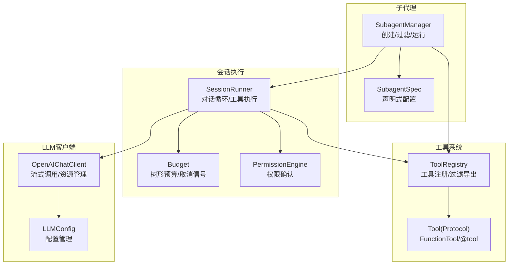
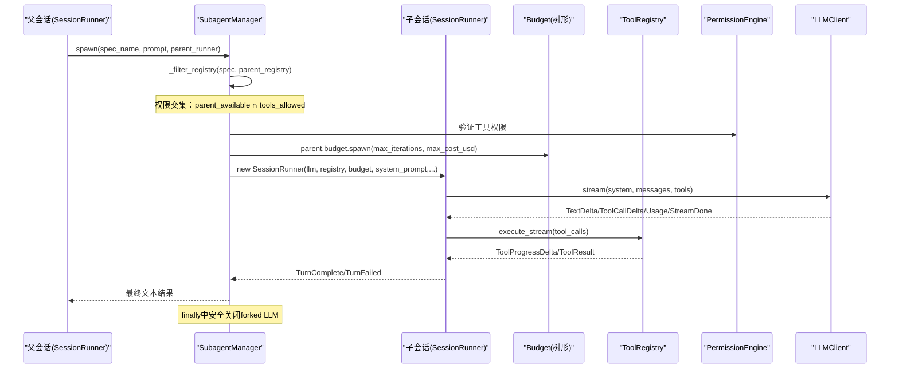
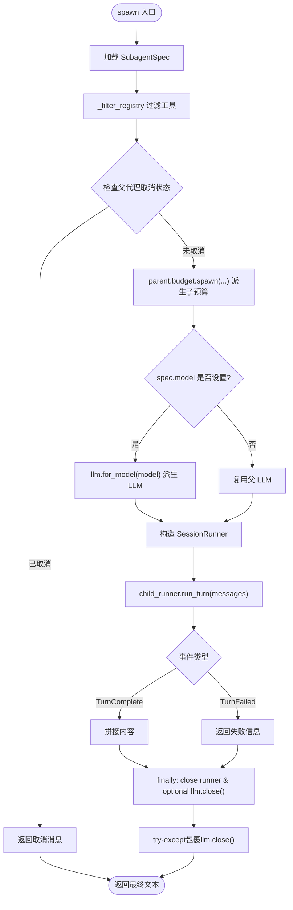
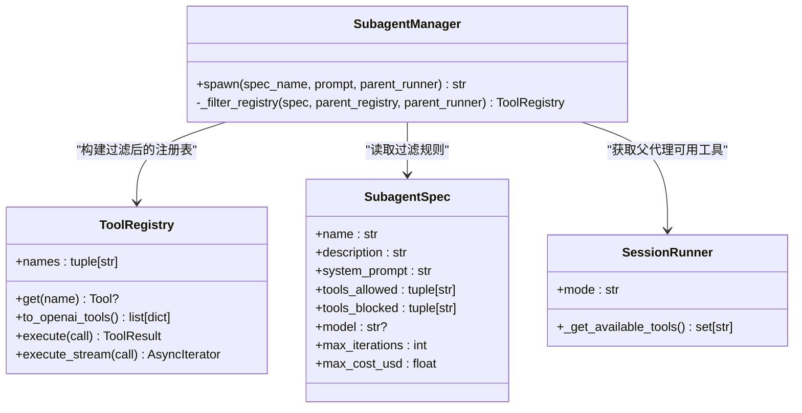
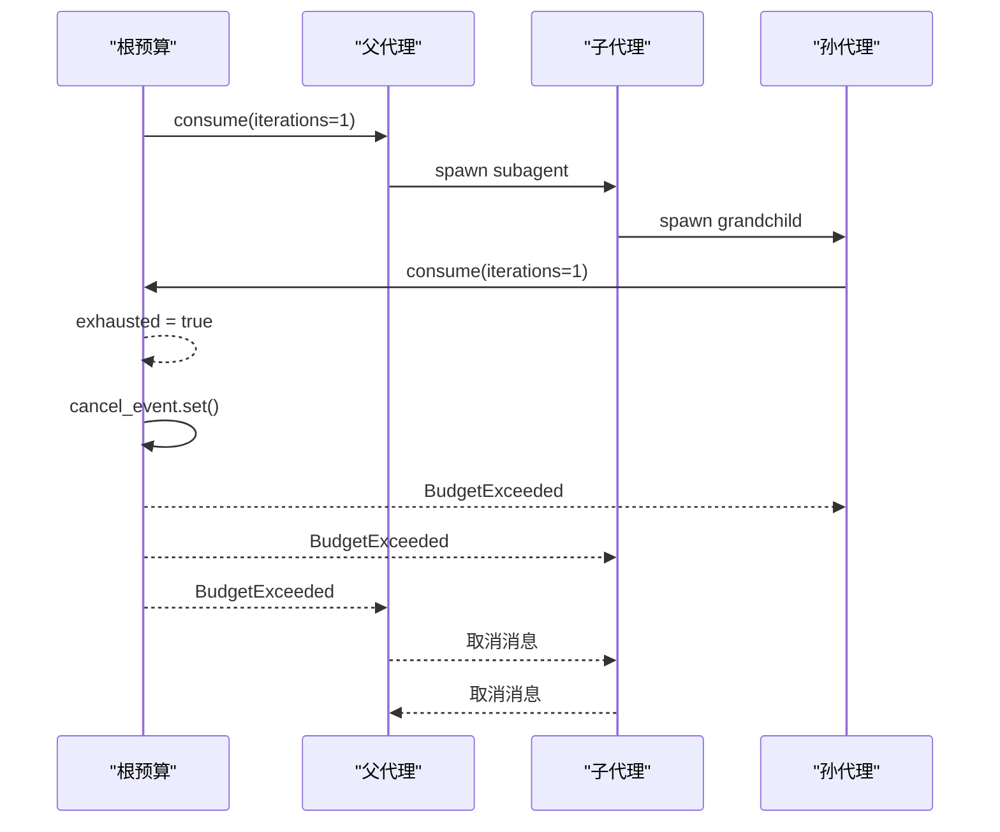
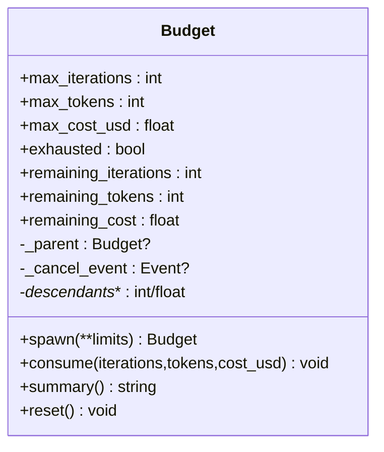
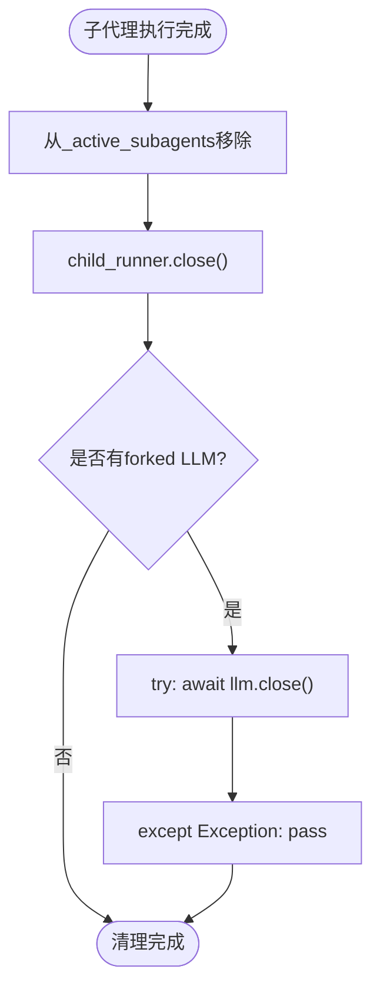
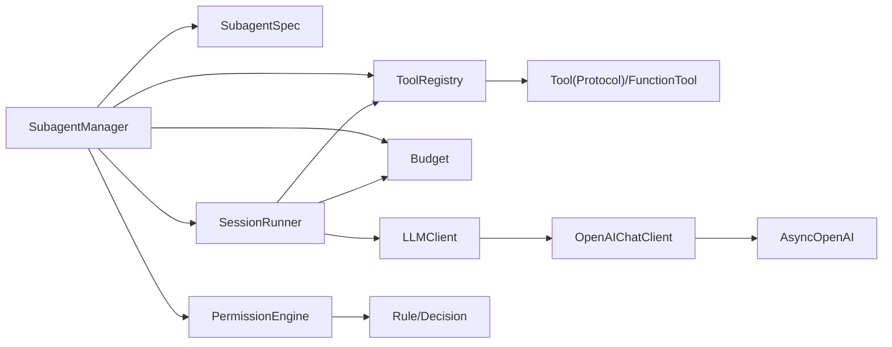

# 子代理系统

<cite>
**本文引用的文件**   
- [manager.py](file://src/microagent/subagent/manager.py)
- [budget.py](file://src/microagent/session/budget.py)
- [runner.py](file://src/microagent/session/runner.py)
- [tool.py](file://src/microagent/core/tool.py)
- [permission.py](file://src/microagent/core/permission.py)
- [client.py](file://src/microagent/llm/client.py)
- [test_subagent.py](file://tests/unit/test_subagent.py)
- [test_budget_tree.py](file://tests/unit/test_budget_tree.py)
- [fake_llm.py](file://tests/unit/fake_llm.py)
</cite>

## 更新摘要
**所做更改**   
- 更新了资源清理机制说明，强调forked LLM客户端的close()方法现在在finally块中使用try-except包裹
- 增强了错误处理描述，确保即使客户端关闭时发生异常也能正确释放资源
- 完善了多代理场景下的资源泄漏防护机制
- 更新了资源管理最佳实践部分

## 目录
1. [简介](#简介)
2. [项目结构](#项目结构)
3. [核心组件](#核心组件)
4. [架构总览](#架构总览)
5. [详细组件分析](#详细组件分析)
6. [依赖关系分析](#依赖关系分析)
7. [性能考量](#性能考量)
8. [故障排查指南](#故障排查指南)
9. [结论](#结论)
10. [附录](#附录)

## 简介
本文件为 MicroAgent 的子代理系统提供系统化、可操作的文档。重点覆盖：
- SubagentManager 的工作机制：子代理的创建、配置、生命周期管理与资源隔离
- SubagentSpec 的配置项：名称、描述、系统提示、工具白名单/黑名单、最大迭代次数、成本限制等
- **改进的权限交集逻辑**：确保子工具等于父可用工具与spec.tools_allowed的交集
- **增强的中断传播机制**：支持父子代理间的取消事件传播和权限确认
- **增强的资源清理机制**：forked LLM客户端的close()方法现在使用try-except包裹，防止资源泄漏
- 工具过滤机制：确保子代理仅能访问指定工具集
- 预算树形跟踪系统：父子代理间的预算继承与共享取消事件
- 默认子代理（explore、general）的使用方法
- 自定义子代理开发指南
- 子代理间通信、状态管理与错误处理的最佳实践

## 项目结构
子代理系统位于 src/microagent/subagent/manager.py，围绕 SubagentSpec、SubagentManager 构建；预算系统位于 session/budget.py；会话执行循环在 session/runner.py；工具协议与注册表在 core/tool.py；权限引擎在 core/permission.py；LLM客户端在 llm/client.py；测试用例在 tests/unit 下。



**图表来源**
- [manager.py:77-185](file://src/microagent/subagent/manager.py#L77-L185)
- [budget.py:15-169](file://src/microagent/session/budget.py#L15-L169)
- [runner.py:40-459](file://src/microagent/session/runner.py#L40-L459)
- [tool.py:40-309](file://src/microagent/core/tool.py#L40-L309)
- [permission.py:71-128](file://src/microagent/core/permission.py#L71-L128)
- [client.py:176-232](file://src/microagent/llm/client.py#L176-L232)

## 核心组件
- SubagentSpec：声明式配置子代理类型，包含名称、描述、系统提示、工具白名单/黑名单、模型覆盖、最大迭代次数、最大成本等。
- SubagentManager：根据 Spec 创建子代理，进行工具过滤，生成子预算，复用或派生 LLM，运行 SessionRunner 并收集最终文本结果。
- Budget：树形预算，支持 spawn 子预算、父链上报消耗、根节点耗尽时通过共享 cancel_event 取消整棵树。
- SessionRunner：核心对话循环，驱动 LLM 流式调用、工具执行、预算消费、压缩与技能匹配等。
- PermissionEngine：基于规则的权限引擎，支持 ALLOW/DENY/ASK 决策和外部脚本权限控制。
- ToolRegistry + Tool(Protocol)：工具注册、查找、OpenAI tools 导出、流式与非流式执行。
- OpenAIChatClient：LLM客户端实现，支持流式响应、模型派生和资源管理。

**章节来源**
- [manager.py:26-69](file://src/microagent/subagent/manager.py#L26-L69)
- [manager.py:77-185](file://src/microagent/subagent/manager.py#L77-L185)
- [budget.py:15-169](file://src/microagent/session/budget.py#L15-L169)
- [runner.py:40-459](file://src/microagent/session/runner.py#L40-L459)
- [permission.py:71-128](file://src/microagent/core/permission.py#L71-L128)
- [tool.py:40-309](file://src/microagent/core/tool.py#L40-L309)
- [client.py:176-232](file://src/microagent/llm/client.py#L176-L232)

## 架构总览
子代理由父会话通过 SubagentManager.spawn 触发，内部以独立的 SessionRunner 运行，拥有独立工具集与预算树节点。父代理仅看到最终文本结果，中间过程被"上下文防火墙"隔离。**新增的权限交集逻辑确保子工具集合是父可用工具与spec.tools_allowed的严格交集**。



**图表来源**
- [manager.py:83-185](file://src/microagent/subagent/manager.py#L83-L185)
- [runner.py:148-459](file://src/microagent/session/runner.py#L148-L459)
- [budget.py:42-69](file://src/microagent/session/budget.py#L42-L69)
- [permission.py:82-95](file://src/microagent/core/permission.py#L82-L95)
- [tool.py:256-280](file://src/microagent/core/tool.py#L256-L280)

## 详细组件分析

### SubagentSpec 配置详解
- name: 子代理类型标识（如 explore、general）
- description: 人类可读描述
- system_prompt: 子代理的系统提示词
- tools_allowed: 白名单（空表示允许全部）
- tools_blocked: 黑名单（优先级高于白名单）
- model: 可选覆盖模型（None 表示继承父 LLM）
- max_iterations: 最大迭代次数
- max_cost_usd: 最大成本上限

默认子代理
- explore：只读代码探索，限定 grep/glob/read_file，低迭代与低成本
- general：通用多步任务执行，默认允许除 exit 外的所有工具

**章节来源**
- [manager.py:26-69](file://src/microagent/subagent/manager.py#L26-L69)

### SubagentManager 工作机制
- **改进的工具过滤**：基于 spec.tools_blocked 优先剔除，再按 tools_allowed 筛选，**确保子工具 = parent_available_tools ∩ tools_allowed**，生成子代理专用 ToolRegistry
- **增强的中断传播**：检查父代理的取消事件，如果已取消则直接返回取消消息
- 预算派生：从父预算 spawn 子预算，继承/限制 max_iterations/max_cost_usd/max_tokens
- LLM 复用：默认复用父 LLM，若 spec.model 非空则派生新客户端
- **增强的资源清理**：构造子 SessionRunner，run_turn 收集 TurnComplete/TurnFailed，finally 中安全关闭 runner 与 forked LLM，使用try-except包裹确保异常时也能释放资源



**图表来源**
- [manager.py:83-185](file://src/microagent/subagent/manager.py#L83-L185)

**章节来源**
- [manager.py:77-185](file://src/microagent/subagent/manager.py#L77-L185)

### 改进的权限交集机制
**核心改进**：新的 `_filter_registry` 方法实现了严格的权限交集逻辑：

1. **获取父代理可用工具**：通过 `parent_runner._get_available_tools()` 获取当前模式下的可用工具集
2. **黑名单优先**：如果工具名在 tools_blocked，直接排除
3. **权限交集约束**：如果 tools_allowed 非空，仅保留同时满足以下条件的工具：
   - 在父代理的可用工具集中
   - 在 spec.tools_allowed 白名单中
4. **结果**：子代理只能访问受限工具集，实现"上下文防火墙"



**图表来源**
- [tool.py:221-280](file://src/microagent/core/tool.py#L221-L280)
- [manager.py:157-185](file://src/microagent/subagent/manager.py#L157-L185)
- [runner.py:141-146](file://src/microagent/session/runner.py#L141-L146)

**章节来源**
- [tool.py:221-280](file://src/microagent/core/tool.py#L221-L280)
- [manager.py:157-185](file://src/microagent/subagent/manager.py#L157-L185)
- [runner.py:141-146](file://src/microagent/session/runner.py#L141-L146)

### 增强的中断传播机制
**改进的中断传播**：
- **父代理取消检测**：在 spawn 开始时检查父代理的 `_cancel_event` 是否已设置
- **级联取消**：如果父代理已被取消，子代理立即返回取消消息而不启动
- **共享取消事件**：子预算与父预算共享同一个 `_cancel_event`，确保根节点耗尽时整个树都被取消
- **实时传播**：任何节点的预算耗尽都会触发根节点的取消事件，影响所有子节点



**图表来源**
- [budget.py:107-130](file://src/microagent/session/budget.py#L107-L130)
- [manager.py:102-106](file://src/microagent/subagent/manager.py#L102-L106)

**章节来源**
- [budget.py:107-130](file://src/microagent/session/budget.py#L107-L130)
- [manager.py:102-106](file://src/microagent/subagent/manager.py#L102-L106)

### 权限确认机制
**PermissionEngine 功能**：
- **基于规则的权限控制**：支持 fnmatch 工具名匹配和参数约束
- **三级决策**：ALLOW（允许）、DENY（拒绝）、ASK（需要用户确认）
- **外部脚本支持**：可通过外部 Python 脚本进行复杂的权限判断
- **默认策略**：无匹配规则时默认 DENY

**集成到子代理系统**：
- 子代理继承父代理的权限配置
- 工具过滤与权限确认协同工作
- 支持交互式权限确认流程

**章节来源**
- [permission.py:71-128](file://src/microagent/core/permission.py#L71-L128)
- [permission.py:201-234](file://src/microagent/core/permission.py#L201-L234)

### 预算树形跟踪系统
- **树形结构**：每个 Budget 维护自身使用量与后代累计使用量，支持向上报告
- **派生策略**：spawn 默认将剩余配额三等分（可按参数覆盖）
- **共享取消**：根节点持有 _cancel_event，任一节点耗尽会触发根取消，子节点后续 consume 抛出异常
- **超限检测**：self.exhausted 与 _tree_exhausted 双重检查



**图表来源**
- [budget.py:15-169](file://src/microagent/session/budget.py#L15-L169)

**章节来源**
- [budget.py:1-169](file://src/microagent/session/budget.py#L1-L169)

### SessionRunner 与子代理运行
- run_turn 主循环：预算消费 → 上下文准备 → LLM 流式调用 → 工具执行 → 结果回写 → 结束
- **模式感知工具过滤**：在 plan 模式下自动阻止写入类工具
- 工具执行：并发执行 tool_calls，支持流式进度事件与 Hook 拦截
- 预算消费：每次迭代与 LLM 用量均调用 budget.consume，超限即中断

```mermaid
sequenceDiagram
participant Runner as "SessionRunner"
participant Budget as "Budget"
participant LLM as "LLMClient"
participant Reg as "ToolRegistry"
loop 直到预算耗尽
Runner->>Budget : consume(iterations=1)
Runner->>LLM : stream(system, messages, tools)
LLM-->>Runner : TextDelta/ToolCallDelta/Usage/StreamDone
alt 有工具调用
Runner->>Reg : execute_stream(tool_calls)
Reg-->>Runner : ToolProgressDelta/ToolResult
Runner->>Budget : consume(tokens, cost_usd)
else 无工具调用
Runner-->>Runner : TurnComplete
break
end
end
```

**图表来源**
- [runner.py:148-459](file://src/microagent/session/runner.py#L148-L459)
- [budget.py:99-130](file://src/microagent/session/budget.py#L99-L130)

**章节来源**
- [runner.py:148-459](file://src/microagent/session/runner.py#L148-L459)

### 默认子代理使用方法
- explore：适合只读探索场景，限制读写类工具，低迭代与低成本
- general：通用任务执行，默认允许除 exit 外的工具，较高迭代与成本上限

**章节来源**
- [manager.py:44-69](file://src/microagent/subagent/manager.py#L44-L69)

### 自定义子代理开发指南
- 定义 SubagentSpec：填写 name/description/system_prompt/tools_allowed/tools_blocked/model/max_iterations/max_cost_usd
- 注册到 SubagentManager：传入 specs 元组，替换或扩展默认集合
- **验证权限交集**：确保子代理无法调用未授权工具，且受父代理模式限制
- 验证预算行为：确认 spawn 后预算上限与父级联动正常
- **测试中断传播**：验证取消事件能正确传播到子代理
- **验证资源清理**：确保forked LLM客户端能正确关闭，不会造成资源泄漏

**章节来源**
- [manager.py:26-69](file://src/microagent/subagent/manager.py#L26-L69)
- [test_subagent.py:8-36](file://tests/unit/test_subagent.py#L8-L36)

### 子代理间通信、状态管理与错误处理最佳实践
- **通信模式**：子代理仅向父代理返回最终文本，中间过程不可见；如需复杂交互，建议在父层编排多次 spawn
- **状态隔离**：每个子代理拥有独立 SessionRunner 与预算节点，避免跨代理状态污染
- **错误处理**：TurnFailed 携带原因；预算耗尽抛出 BudgetExceeded；工具执行异常统一包装为 ToolResult.error
- **增强的资源清理**：finally 中关闭 child runner 与 forked LLM，使用try-except包裹确保异常时也能释放连接池，防止资源泄漏
- **权限确认**：对于敏感操作，使用 PermissionEngine 进行权限确认

**章节来源**
- [manager.py:127-185](file://src/microagent/subagent/manager.py#L127-L185)
- [runner.py:285-459](file://src/microagent/session/runner.py#L285-L459)
- [budget.py:167-169](file://src/microagent/session/budget.py#L167-L169)
- [permission.py:82-95](file://src/microagent/core/permission.py#L82-L95)

### 增强的资源清理机制
**最新改进**：forked LLM客户端的close()方法现在在finally块中使用try-except包裹：

1. **安全的资源释放**：在finally块中执行child_runner.close()和forked LLM的close()
2. **异常防护**：使用try-except包裹llm.close()调用，即使关闭过程中发生异常也不会影响主流程
3. **连接池管理**：确保AsyncOpenAI客户端的连接池被正确释放，防止内存泄漏
4. **多代理场景优化**：在多个子代理并发运行时，确保每个代理的资源都能被正确清理



**图表来源**
- [manager.py:147-157](file://src/microagent/subagent/manager.py#L147-L157)
- [client.py:227-232](file://src/microagent/llm/client.py#L227-L232)

**章节来源**
- [manager.py:147-157](file://src/microagent/subagent/manager.py#L147-L157)
- [client.py:227-232](file://src/microagent/llm/client.py#L227-L232)

## 依赖关系分析
- SubagentManager 依赖 SubagentSpec、ToolRegistry、SessionRunner、Budget、PermissionEngine
- SessionRunner 依赖 LLMClient、ToolRegistry、Budget、EventBus、Store、MemoryExtractor 等
- ToolRegistry 依赖 Tool(Protocol)、FunctionTool、@tool 装饰器
- PermissionEngine 依赖 Rule、Decision 枚举和外部脚本支持
- OpenAIChatClient 依赖 AsyncOpenAI客户端和CredentialPool
- 测试依赖 FakeLLMClient 模拟 LLM 流式响应



**图表来源**
- [manager.py:77-185](file://src/microagent/subagent/manager.py#L77-L185)
- [runner.py:40-459](file://src/microagent/session/runner.py#L40-L459)
- [tool.py:40-309](file://src/microagent/core/tool.py#L40-L309)
- [permission.py:71-128](file://src/microagent/core/permission.py#L71-L128)
- [client.py:176-232](file://src/microagent/llm/client.py#L176-L232)

**章节来源**
- [manager.py:77-185](file://src/microagent/subagent/manager.py#L77-L185)
- [runner.py:40-459](file://src/microagent/session/runner.py#L40-L459)
- [tool.py:40-309](file://src/microagent/core/tool.py#L40-L309)
- [permission.py:71-128](file://src/microagent/core/permission.py#L71-L128)
- [client.py:176-232](file://src/microagent/llm/client.py#L176-L232)

## 性能考量
- **工具执行并发**：SessionRunner 使用任务组并发执行工具调用，提升吞吐
- **流式处理**：LLM 与工具输出均采用流式事件，降低延迟与内存峰值
- **上下文压缩**：当消息过长时自动压缩，减少 LLM 输入长度
- **预算控制**：严格限制迭代与成本，避免无限循环与过度消耗
- **权限检查优化**：权限交集计算在子代理创建时完成，运行时开销最小化
- **资源管理优化**：forked LLM客户端的安全关闭避免了连接池泄漏，提升多代理场景下的稳定性

## 故障排查指南
- **预算耗尽**：检查 max_iterations/max_cost_usd 设置与子代理实际消耗；关注 BudgetExceeded 异常与 cancel_event 传播
- **工具不可用**：确认 tools_allowed/tools_blocked 配置是否正确；检查 ToolRegistry.names 是否包含目标工具；验证父代理模式限制
- **权限问题**：检查 PermissionEngine 规则配置；确认工具是否在父代理可用工具集中
- **中断传播失效**：检查预算树的 _cancel_event 是否正确共享；验证子代理是否正确检查父代理取消状态
- LLM 截断：出现"response truncated"时，考虑增加上下文窗口或调整压缩阈值
- **资源泄漏**：确保 finally 块中关闭 runner 与 forked LLM；检查浏览器页面、内存提取器等资源释放；验证try-except包裹的close()调用正常工作
- **多代理冲突**：在高并发场景下，确保每个子代理都有独立的资源管理和清理机制

**章节来源**
- [budget.py:99-130](file://src/microagent/session/budget.py#L99-L130)
- [runner.py:200-459](file://src/microagent/session/runner.py#L200-459)
- [manager.py:127-185](file://src/microagent/subagent/manager.py#L127-L185)
- [permission.py:82-95](file://src/microagent/core/permission.py#L82-L95)

## 结论
MicroAgent 的子代理系统通过 SubagentSpec 声明式配置、SubagentManager 的**改进权限交集逻辑**与预算派生、以及 SessionRunner 的高效执行循环，实现了安全、可控、可扩展的多代理协作。**新增的权限交集机制确保子工具集合是父可用工具与spec.tools_allowed的严格交集**，**增强的中断传播机制保障了取消事件的可靠传递**，**完善的权限确认机制提供了细粒度的访问控制**，**增强的资源清理机制确保了多代理场景下的资源安全**。预算树形跟踪与共享取消机制保障了整体资源边界，工具过滤确保了最小权限原则。结合默认子代理与自定义开发能力，用户可在不同场景下灵活组合与治理子代理。**最新的资源清理改进进一步提升了系统的稳定性和可靠性，确保即使在异常情况下也能正确释放所有资源**。

## 附录
- 单元测试参考：
  - 子代理规格与管理器行为：[test_subagent.py](file://tests/unit/test_subagent.py)
  - 预算树形行为与取消传播：[test_budget_tree.py](file://tests/unit/test_budget_tree.py)
  - 模拟 LLM 客户端：[fake_llm.py](file://tests/unit/fake_llm.py)

**章节来源**
- [test_subagent.py:1-115](file://tests/unit/test_subagent.py#L1-L115)
- [test_budget_tree.py:1-63](file://tests/unit/test_budget_tree.py#L1-L63)
- [fake_llm.py:1-110](file://tests/unit/fake_llm.py#L1-L110)