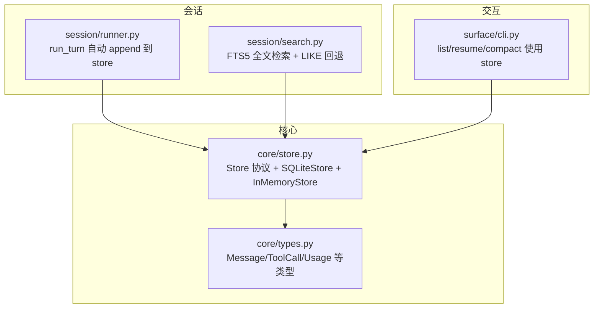
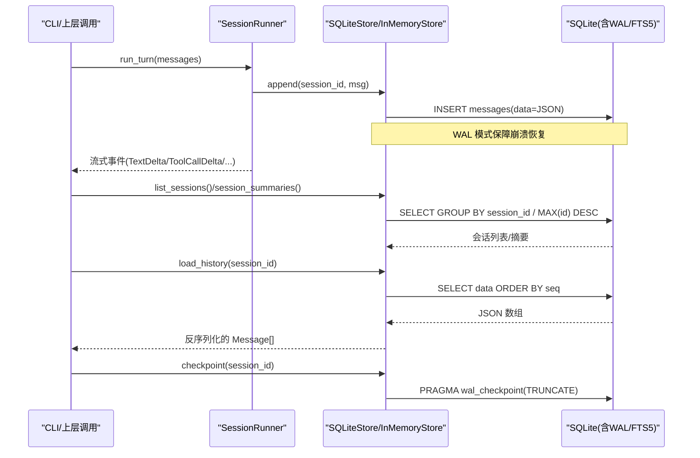
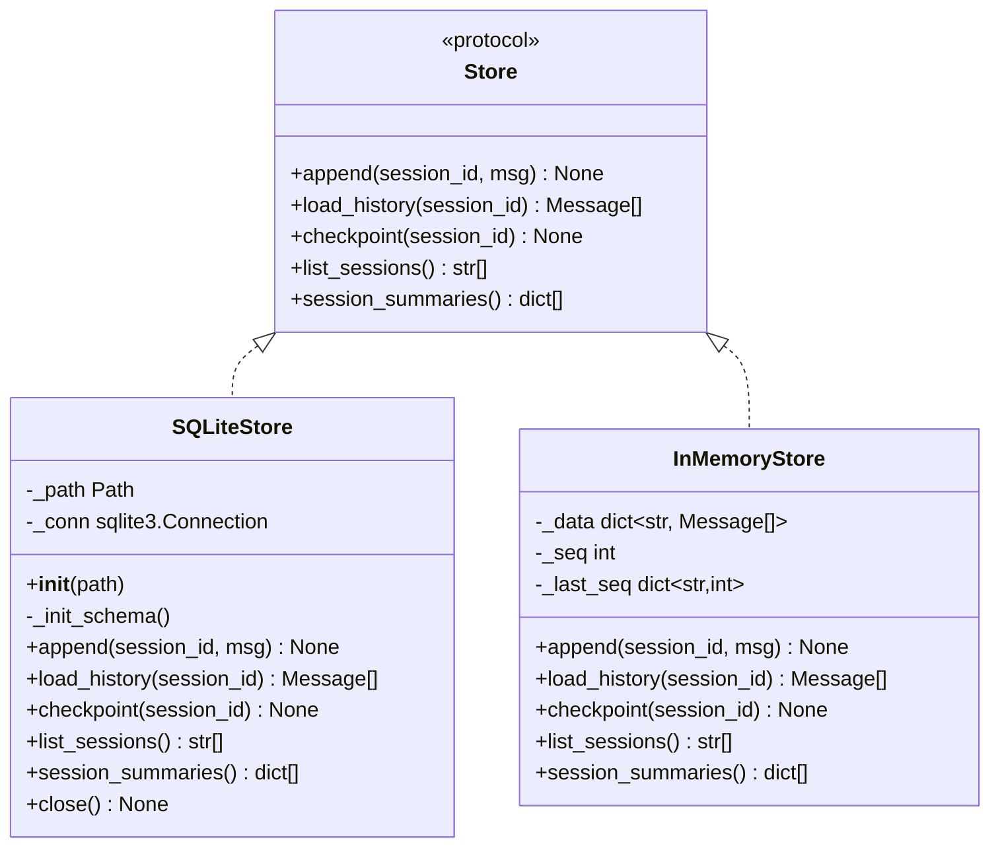
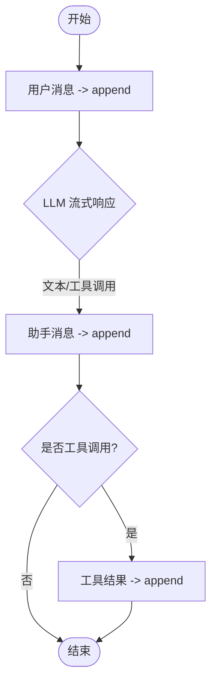
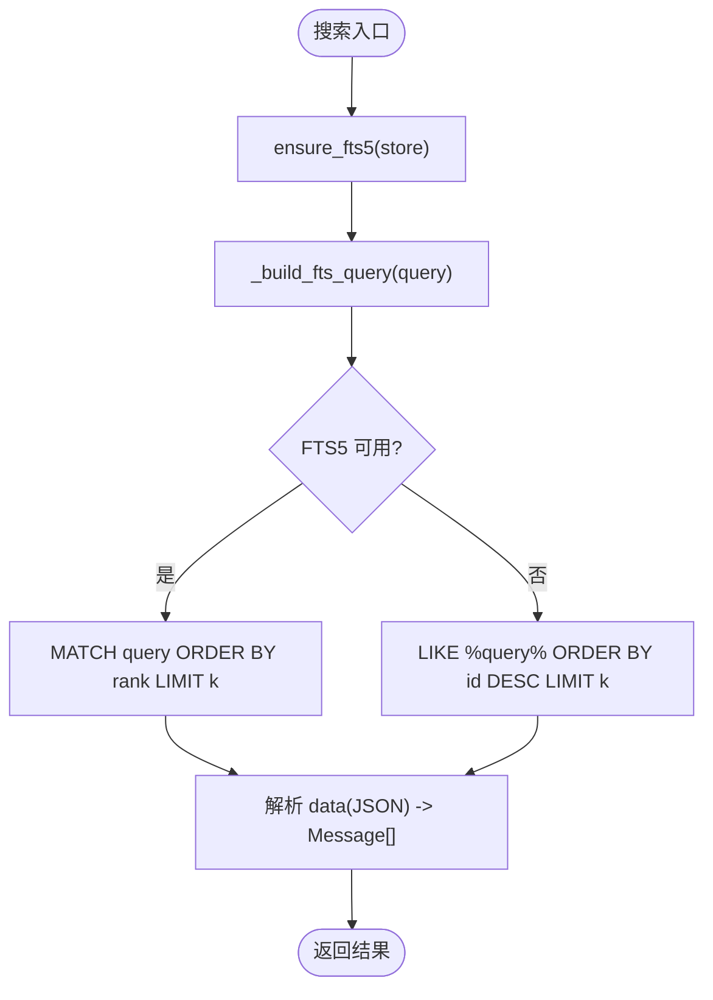
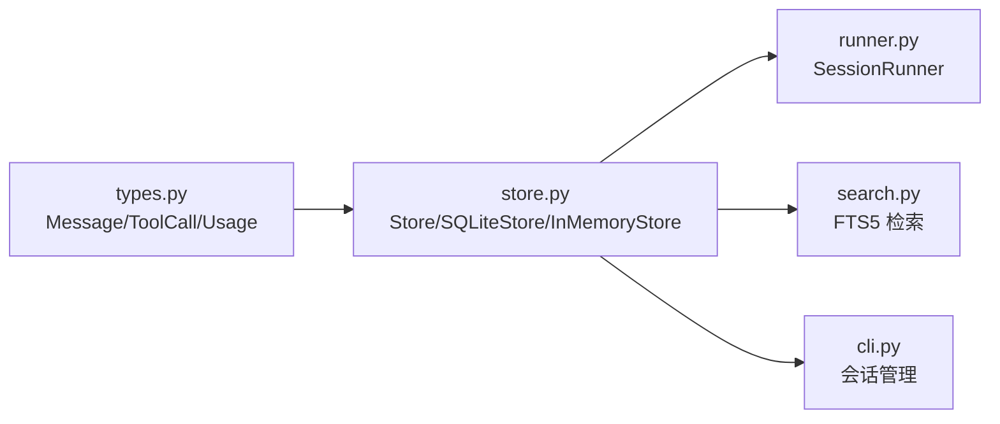

# 存储系统

<cite>
**本文引用的文件**   
- [store.py](file://src/microagent/core/store.py)
- [types.py](file://src/microagent/core/types.py)
- [search.py](file://src/microagent/session/search.py)
- [runner.py](file://src/microagent/session/runner.py)
- [cli.py](file://src/microagent/surface/cli.py)
- [test_store.py](file://tests/unit/test_store.py)
</cite>

## 目录
1. [简介](#简介)
2. [项目结构](#项目结构)
3. [核心组件](#核心组件)
4. [架构总览](#架构总览)
5. [详细组件分析](#详细组件分析)
6. [依赖关系分析](#依赖关系分析)
7. [性能考量](#性能考量)
8. [故障排查指南](#故障排查指南)
9. [结论](#结论)
10. [附录](#附录)

## 简介
本文件为 MicroAgent 的存储系统提供系统化文档，覆盖 Store 协议抽象、SQLiteStore 实现细节（WAL 模式、事务与索引优化）、会话持久化与恢复流程、全文检索集成、以及扩展自定义存储后端的开发指南。同时给出数据迁移与版本兼容建议、备份与恢复流程、以及连接池、缓存、批量操作等性能优化策略。

## 项目结构
MicroAgent 的存储相关代码集中在 core.store 模块，并通过 session.runner 在对话轮次中自动持久化消息；session.search 提供基于 SQLite FTS5 的跨会话全文检索；CLI 层通过 store.session_summaries 高效列出会话摘要。

图表来源
- [store.py:28-36](file://src/microagent/core/store.py#L28-L36)
- [store.py:95-120](file://src/microagent/core/store.py#L95-L120)
- [runner.py:115-116](file://src/microagent/session/runner.py#L115-L116)
- [search.py:44-50](file://src/microagent/session/search.py#L44-L50)
- [cli.py:255-264](file://src/microagent/surface/cli.py#L255-L264)

章节来源
- [store.py:1-226](file://src/microagent/core/store.py#L1-L226)
- [runner.py:115-116](file://src/microagent/session/runner.py#L115-L116)
- [search.py:1-161](file://src/microagent/session/search.py#L1-L161)
- [cli.py:255-264](file://src/microagent/surface/cli.py#L255-L264)

## 核心组件
- Store 协议：定义 append、load_history、checkpoint、list_sessions、session_summaries 五个异步接口，作为所有存储后端的统一契约。
- SQLiteStore：基于 SQLite WAL 模式的持久化实现，JSON 序列化 Message，维护会话内顺序 seq，支持会话列表与摘要查询。
- InMemoryStore：内存实现，用于单元测试与无磁盘场景。
- types.Message/ToolCall/Usage：消息、工具调用与用量统计的数据模型，被序列化/反序列化为 JSON 存储。

章节来源
- [store.py:28-36](file://src/microagent/core/store.py#L28-L36)
- [store.py:95-179](file://src/microagent/core/store.py#L95-L179)
- [store.py:189-226](file://src/microagent/core/store.py#L189-L226)
- [types.py:17-116](file://src/microagent/core/types.py#L17-L116)

## 架构总览
下图展示了从 CLI/Runner 发起请求到 Store 写入/读取的完整流程，包括 WAL checkpoint 与 FTS5 检索路径。

图表来源
- [runner.py:124-127](file://src/microagent/session/runner.py#L124-L127)
- [store.py:122-132](file://src/microagent/core/store.py#L122-L132)
- [store.py:144-148](file://src/microagent/core/store.py#L144-L148)
- [store.py:150-178](file://src/microagent/core/store.py#L150-L178)
- [store.py:141-142](file://src/microagent/core/store.py#L141-L142)
- [search.py:97-161](file://src/microagent/session/search.py#L97-L161)

## 详细组件分析

### Store 协议与抽象层次
- 设计思想：以 Protocol 定义最小必要接口，屏蔽底层介质差异，使上层仅依赖“追加历史、读取历史、检查点、会话列表与摘要”等能力。
- 关键方法：
  - append：追加单条消息，保证会话内顺序（seq）。
  - load_history：按 seq 顺序返回历史消息。
  - checkpoint：触发 WAL 检查点，将日志页落盘并截断。
  - list_sessions：返回会话 ID 列表（按最近活动排序）。
  - session_summaries：单次聚合查询返回每个会话的消息数与最后一条预览，避免 O(N) 逐会话加载。

章节来源
- [store.py:28-36](file://src/microagent/core/store.py#L28-L36)
- [store.py:150-178](file://src/microagent/core/store.py#L150-L178)

### SQLiteStore 实现要点
- WAL 模式与同步策略：
  - journal_mode=WAL：提升并发读写与崩溃恢复能力。
  - synchronous=NORMAL：平衡性能与安全性。
  - foreign_keys=ON：保持外键约束一致性。
- 表结构与索引：
  - messages 表包含 id、session_id、seq、data(JSON)，唯一约束 (session_id, seq)。
  - idx_session 索引加速按会话与顺序查询。
- 序列化：
  - _serialize_message/_deserialize_message 将 Message/ToolCall/Usage 等字段转为 JSON 字符串，确保 is_error、tool_calls、usage 等字段可逆。
- 会话摘要：
  - session_summaries 使用子查询获取每条会话的最后一条 data，并截取内容前 50 字符作为预览，避免多次 I/O。
- 检查点：
  - checkpoint 调用 PRAGMA wal_checkpoint(TRUNCATE) 释放 WAL 空间。

图表来源
- [store.py:28-36](file://src/microagent/core/store.py#L28-L36)
- [store.py:95-182](file://src/microagent/core/store.py#L95-L182)
- [store.py:189-226](file://src/microagent/core/store.py#L189-L226)

章节来源
- [store.py:95-182](file://src/microagent/core/store.py#L95-L182)
- [store.py:189-226](file://src/microagent/core/store.py#L189-L226)

### 会话持久化与恢复流程
- 写入时机：
  - SessionRunner.run_turn 在用户消息、助手回复、工具结果等关键节点调用 store.append。
- 恢复机制：
  - runner.resume 直接通过 store.load_history 重建历史消息元组，无缝继续对话。
- 检查点：
  - 应用可在合适时机调用 store.checkpoint 强制 WAL 检查点，降低数据丢失窗口。

图表来源
- [runner.py:124-127](file://src/microagent/session/runner.py#L124-L127)
- [runner.py:235-236](file://src/microagent/session/runner.py#L235-L236)
- [runner.py:274-275](file://src/microagent/session/runner.py#L274-L275)

章节来源
- [runner.py:115-116](file://src/microagent/session/runner.py#L115-L116)
- [runner.py:124-127](file://src/microagent/session/runner.py#L124-L127)
- [runner.py:235-236](file://src/microagent/session/runner.py#L235-L236)
- [runner.py:274-275](file://src/microagent/session/runner.py#L274-L275)

### 全文检索（FTS5）与回退策略
- 初始化：ensure_fts5 创建虚拟表 messages_fts 及插入/删除触发器，自动维护索引。
- 查询构建：_build_fts_query 对拉丁词进行短语匹配，对中日韩文本采用二元分词，提高召回精度。
- 执行路径：优先使用 FTS5 MATCH + rank 排序；若不可用则回退到 LIKE 模糊匹配。
- 结果解析：从 data(JSON) 中提取 role/content 构造轻量 Message 对象返回。

图表来源
- [search.py:44-50](file://src/microagent/session/search.py#L44-L50)
- [search.py:62-94](file://src/microagent/session/search.py#L62-L94)
- [search.py:97-161](file://src/microagent/session/search.py#L97-L161)

章节来源
- [search.py:1-161](file://src/microagent/session/search.py#L1-L161)

### CLI 与存储交互
- 会话列表：_list_sessions 调用 store.session_summaries 一次聚合查询，返回会话 ID、消息数与预览。
- 恢复会话：_pick_last_session 调用 list_sessions 取最近会话，resume 命令通过 store.load_history 重建历史。

章节来源
- [cli.py:255-264](file://src/microagent/surface/cli.py#L255-L264)

## 依赖关系分析
- 类型依赖：store 模块依赖 types.Message/ToolCall/Usage 进行序列化/反序列化。
- 运行时依赖：
  - runner 在对话过程中调用 store.append/load_history。
  - search 依赖 SQLiteStore 的内部连接以访问 FTS5。
  - cli 依赖 store.list_sessions/session_summaries 提供 UI 功能。

图表来源
- [types.py:17-116](file://src/microagent/core/types.py#L17-L116)
- [store.py:28-36](file://src/microagent/core/store.py#L28-L36)
- [runner.py:115-116](file://src/microagent/session/runner.py#L115-L116)
- [search.py:44-50](file://src/microagent/session/search.py#L44-L50)
- [cli.py:255-264](file://src/microagent/surface/cli.py#L255-L264)

章节来源
- [store.py:28-36](file://src/microagent/core/store.py#L28-L36)
- [types.py:17-116](file://src/microagent/core/types.py#L17-L116)
- [runner.py:115-116](file://src/microagent/session/runner.py#L115-L116)
- [search.py:44-50](file://src/microagent/session/search.py#L44-L50)
- [cli.py:255-264](file://src/microagent/surface/cli.py#L255-L264)

## 性能考量
- WAL 与同步策略：
  - WAL 模式减少锁竞争，适合高并发写读；synchronous=NORMAL 在多数场景下提供良好吞吐与稳定性平衡。
- 索引优化：
  - idx_session(session_id, seq) 加速按会话顺序读取；如需高频过滤（如时间戳），可考虑额外索引。
- 聚合查询：
  - session_summaries 使用单次 SQL 聚合，避免 O(N) 逐会话加载，显著降低 I/O 与序列化开销。
- 连接复用：
  - SQLiteStore 持有单一连接；在高并发场景建议引入连接池或进程级共享连接，注意隔离级别与并发限制。
- 批量写入：
  - 当前 append 为单条插入；对于批处理场景可使用 executescript 或事务包裹多条 INSERT 以提升吞吐。
- 缓存策略：
  - 热点会话可在应用层做短期内存缓存（LRU），结合失效策略（如 TTL、变更通知）降低重复读取成本。
- 全文检索：
  - FTS5 BM25 排序快速且精确；LIKE 回退仅在 FTS5 不可用时启用，应尽量避免。

[本节为通用性能指导，不直接分析具体文件]

## 故障排查指南
- 常见错误定位：
  - JSON 解析失败：检查 _serialize_message/_deserialize_message 的字段映射，确认新增字段已兼容。
  - 会话顺序错乱：确认 seq 自增逻辑与 UNIQUE(session_id, seq) 约束未被破坏。
  - WAL 未生效：检查 PRAGMA journal_mode=WAL 是否成功设置；必要时重启进程或清理 .wal/.shm。
  - FTS5 不可用：search 会回退 LIKE；确认 SQLite 编译时启用 FTS5。
- 验证用例参考：
  - 往返测试、跨连接持久性、工具调用与用量字段保留、错误标记保留、会话列表等均在测试中覆盖。

章节来源
- [test_store.py:37-99](file://tests/unit/test_store.py#L37-L99)
- [store.py:44-87](file://src/microagent/core/store.py#L44-L87)
- [store.py:110-120](file://src/microagent/core/store.py#L110-L120)
- [search.py:97-161](file://src/microagent/session/search.py#L97-L161)

## 结论
MicroAgent 的存储系统以 Store 协议为核心抽象，提供了简洁一致的接口；SQLiteStore 借助 WAL 与索引优化实现了高性能与强一致性的持久化；FTS5 全文检索增强了跨会话信息检索能力。通过合理的连接复用、批量写入与应用层缓存，可进一步提升吞吐与延迟表现。遵循本文的扩展指南与迁移策略，可平滑接入 Redis/MongoDB/文件系统等多种后端，并确保向后兼容与数据安全。

[本节为总结性内容，不直接分析具体文件]

## 附录

### 自定义存储后端开发指南
- 实现要求：
  - 实现 Store 协议的五个异步方法：append、load_history、checkpoint、list_sessions、session_summaries。
  - 保持会话内顺序语义（seq）与最近会话排序规则（与 SQLiteStore 行为一致）。
- 不同介质建议：
  - Redis：
    - 使用有序集合 ZSET 存储会话消息（score=seq），哈希或列表存储消息体；checkpoint 对应 RPOPLPUSH 或快照；session_summaries 可通过 SCAN+ZREVRANGE 聚合。
  - MongoDB：
    - 使用集合存储消息文档，索引 (session_id, seq)；checkpoint 对应 fsync 或副本集同步；session_summaries 使用聚合管道 $group + $first。
  - 文件系统：
    - 每会话一个 JSON Lines 文件，append 追加行；checkpoint 触发 fsync；session_summaries 扫描文件头尾行计数与预览。
- 查询语言适配：
  - 若后端不支持 SQL，可在应用层封装查询 DSL，转换为后端原生查询（如 MQL、Redis 命令、FS 遍历）。
- 兼容性：
  - 保持 Message JSON 结构稳定；新增字段需向后兼容（默认值或可选字段）。

[本节为概念性指导，不直接分析具体文件]

### 数据迁移与版本管理
- 版本标识：
  - 在数据库或元数据表中记录 schema_version，启动时校验并执行迁移脚本。
- 迁移策略：
  - 增量迁移：按版本号顺序执行 ALTER TABLE/添加索引/重命名列等操作。
  - 双写过渡：新旧结构并存期间，同时写入新结构，逐步切换读路径。
- 回滚方案：
  - 迁移前备份；失败时回滚至上一版本快照。

[本节为概念性指导，不直接分析具体文件]

### 备份与恢复流程
- 备份：
  - SQLite：使用 sqlite3 命令行工具导出 SQL 或使用 cp 复制 .db/.wal/.shm（需确保一致性，推荐在线备份 API 或冷备）。
  - Redis：BGSAVE/RDB/AOF 组合；MongoDB：mongodump；文件系统：增量快照。
- 恢复：
  - 停止写入服务，替换数据文件，重启服务；校验完整性（行数、checksum）。
- 校验与演练：
  - 定期演练恢复流程，确保 RTO/RPO 目标达成。

[本节为概念性指导，不直接分析具体文件]