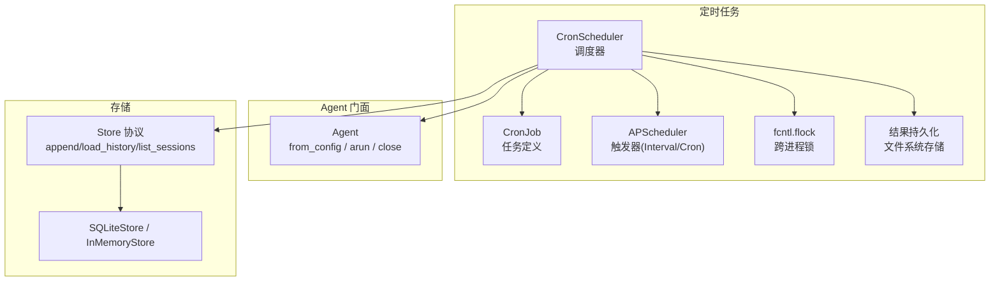
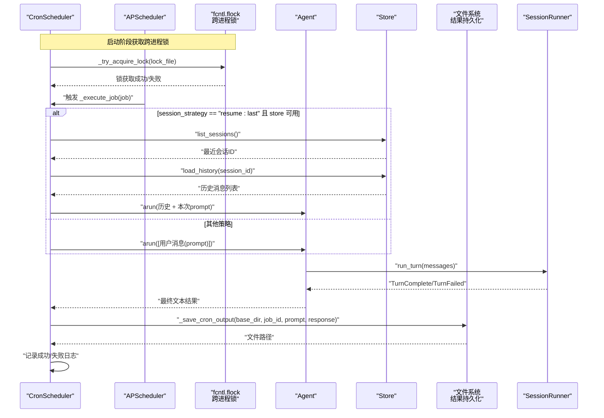
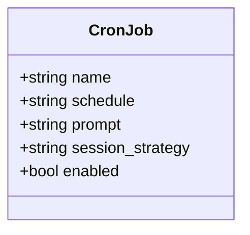
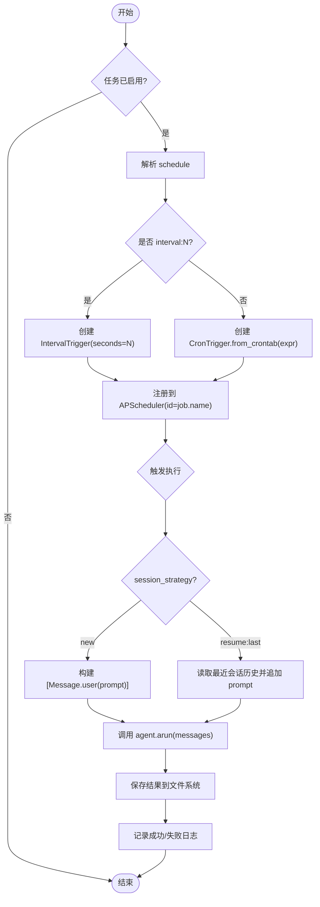
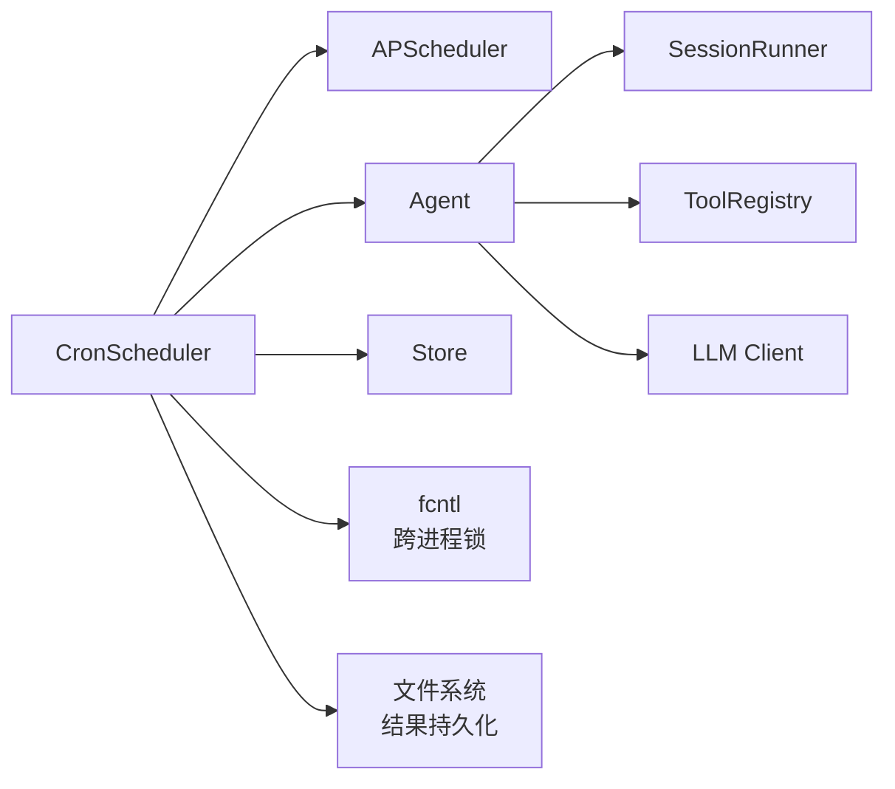

# 定时任务

<cite>
**本文档引用的文件**   
- [scheduler.py](file://src/microagent/cron/scheduler.py)
- [agent.py](file://src/microagent/agent.py)
- [store.py](file://src/microagent/core/store.py)
- [test_cron.py](file://tests/unit/test_cron.py)
</cite>

## 更新摘要
**已进行的更改**
- 新增跨进程锁机制（fcntl.flock）防止并发执行
- 增强结果持久化功能，自动保存执行输出到文件系统
- 改进审计追踪能力，记录完整的执行历史和结果
- 优化资源管理和错误处理机制
- **v1.0.1 关键修复**：修复 `_try_acquire_lock()` 函数中的文件描述符资源泄漏问题，确保在不返回文件描述符时正确关闭文件句柄，防止长时间运行场景下的文件描述符耗尽

## 目录
1. [简介](#简介)
2. [项目结构](#项目结构)
3. [核心组件](#核心组件)
4. [架构总览](#架构总览)
5. [详细组件分析](#详细组件分析)
6. [依赖关系分析](#依赖关系分析)
7. [性能与资源管理](#性能与资源管理)
8. [故障排查指南](#故障排查指南)
9. [结论](#结论)
10. [附录：常见配置示例](#附录常见配置示例)

## 简介
本章节面向 MicroAgent 的定时任务系统，系统性阐述基于 APScheduler 的调度机制、CronJob 的配置项、任务的增删启停与监控、执行上下文（Agent 实例与工具可访问性）、失败处理与日志记录流程，以及性能优化与资源管理最佳实践。v1.0 版本新增了跨进程锁机制和结果持久化功能，确保在高并发环境下的稳定性和可追溯性。**v1.0.1 版本修复了关键的文件描述符资源泄漏问题，进一步提升了系统在长时间运行场景下的稳定性**。读者无需深入源码即可理解如何配置和使用定时任务完成每日摘要、健康检查、数据同步等场景。

## 项目结构
MicroAgent 的定时任务相关代码集中在 cron 模块中，并通过 Agent 门面进行集成。核心文件如下：
- 调度器与任务定义：cron/scheduler.py
- Agent 门面与 Cron 集成入口：agent.py
- 会话持久化存储接口与实现：core/store.py
- 单元测试用例：tests/unit/test_cron.py



图表来源
- [scheduler.py:27-53](file://src/microagent/cron/scheduler.py#L27-L53)
- [scheduler.py:60-79](file://src/microagent/cron/scheduler.py#L60-L79)
- [scheduler.py:94-159](file://src/microagent/cron/scheduler.py#L94-L159)
- [agent.py:32-77](file://src/microagent/agent.py#L32-L77)
- [store.py:28-36](file://src/microagent/core/store.py#L28-L36)

章节来源
- [scheduler.py:1-230](file://src/microagent/cron/scheduler.py#L1-L230)
- [agent.py:1-120](file://src/microagent/agent.py#L1-L120)
- [store.py:1-226](file://src/microagent/core/store.py#L1-L226)
- [test_cron.py:1-103](file://tests/unit/test_cron.py#L1-L103)

## 核心组件
- CronJob：描述一个定时任务，包含名称、调度表达式（cron 或 interval:N）、提示词、会话策略与启用标志。
- CronScheduler：基于 APScheduler 的异步调度器，负责注册、启动、停止、删除任务，并在触发时调用 Agent 执行。**v1.0 新增跨进程锁机制和结果持久化功能，v1.0.1 修复了文件描述符资源泄漏问题**。
- Store 协议与实现：提供会话历史加载与会话列表能力，用于"恢复上次会话"的执行策略。
- Agent：对外暴露 run/arun/close，内部组装 LLM、工具、预算、技能加载器；当 enable_cron=True 时自动创建 CronScheduler 并持有 store 引用。

章节来源
- [scheduler.py:82-91](file://src/microagent/cron/scheduler.py#L82-L91)
- [scheduler.py:94-159](file://src/microagent/cron/scheduler.py#L94-L159)
- [store.py:28-36](file://src/microagent/core/store.py#L28-L36)
- [agent.py:32-77](file://src/microagent/agent.py#L32-L77)

## 架构总览
下图展示了从任务触发到 Agent 执行的完整时序，包括"新会话"和"恢复上次会话"两条路径，以及新增的跨进程锁和结果持久化流程。



图表来源
- [scheduler.py:128-159](file://src/microagent/cron/scheduler.py#L128-L159)
- [scheduler.py:178-208](file://src/microagent/cron/scheduler.py#L178-L208)
- [scheduler.py:60-79](file://src/microagent/cron/scheduler.py#L60-L79)
- [agent.py:92-103](file://src/microagent/agent.py#L92-103)
- [store.py:144-148](file://src/microagent/core/store.py#L144-L148)

## 详细组件分析

### CronJob 数据模型
- name：任务唯一标识，用作 APScheduler 的任务 ID。
- schedule：支持两种格式
  - cron 表达式：标准 cron 语法，由 APScheduler 解析。
  - interval:N：每 N 秒触发一次。
- prompt：每次触发时注入给 Agent 的用户提示词。
- session_strategy：会话策略
  - new：每次使用全新会话。
  - resume:last：加载最近一次会话的历史，追加当前 prompt 继续对话。
- enabled：是否启用该任务。



图表来源
- [scheduler.py:82-91](file://src/microagent/cron/scheduler.py#L82-L91)

章节来源
- [scheduler.py:82-91](file://src/microagent/cron/scheduler.py#L82-L91)

### CronScheduler 调度器
职责与行为：
- add_job/remove_job：动态添加/移除任务；若调度器已启动且任务启用，立即注册到 APScheduler。
- start/stop：启动/优雅关闭调度器；start 会遍历已注册任务并批量注册。**v1.0 新增跨进程锁机制，防止多个进程同时启动调度器**。
- _schedule_job：根据 schedule 选择 IntervalTrigger 或 CronTrigger，并以 job.name 作为任务 ID 注册。
- _execute_job：执行任务的核心逻辑，按 session_strategy 构造消息列表后调用 agent.arun，并记录日志。**v1.0 新增结果持久化功能，自动保存执行输出到文件系统**。
- _build_resume_messages：在 resume:last 模式下，通过 store.list_sessions 获取最近会话，再 load_history 拼接历史与当前 prompt。

**新增跨进程锁机制**：
- 使用 fcntl.flock 实现独占锁，确保同一时间只有一个进程可以运行定时任务调度器。
- 锁文件默认位于 `~/.microagent/cron.lock`，可通过 lock_path 参数自定义。
- 如果锁已被其他进程持有，调度器会记录警告日志并退出启动流程。

**新增结果持久化功能**：
- 执行成功后自动将结果保存到 `~/.microagent/cron/output/{job_id}/{timestamp}.md`。
- 文件格式包含任务名称、时间戳、原始提示词和执行响应。
- 持久化失败不会影响主流程，仅记录警告日志。

**v1.0.1 关键资源泄漏修复**：
- 修复了 `_try_acquire_lock()` 函数中的文件描述符资源泄漏问题。
- 当 `return_fd=False` 时，函数现在正确关闭文件描述符，防止长时间运行场景下的文件描述符耗尽。
- 这一修复确保了在长期运行的定时任务环境中系统的稳定性和可靠性。



图表来源
- [scheduler.py:128-159](file://src/microagent/cron/scheduler.py#L128-L159)
- [scheduler.py:178-208](file://src/microagent/cron/scheduler.py#L178-L208)
- [scheduler.py:60-79](file://src/microagent/cron/scheduler.py#L60-L79)

章节来源
- [scheduler.py:113-159](file://src/microagent/cron/scheduler.py#L113-L159)
- [scheduler.py:178-208](file://src/microagent/cron/scheduler.py#L178-L208)
- [scheduler.py:27-53](file://src/microagent/cron/scheduler.py#L27-L53)
- [scheduler.py:60-79](file://src/microagent/cron/scheduler.py#L60-L79)

### Agent 集成与上下文环境
- Agent.from_config：当 enable_cron=True 时，自动创建 CronScheduler(agent=self, store=store)，使调度器能访问 Agent 实例与 Store。
- Agent.arun：异步执行一轮对话，返回最终文本或错误信息。
- Agent.close：统一释放资源，包括 CronScheduler.stop()、SessionRunner.close()、LLM 客户端关闭。

上下文说明：
- 工具可访问性：Agent 内部通过 ToolRegistry 装配内置与自定义工具，CronScheduler 仅通过 agent.arun 间接使用工具，无需直接感知工具细节。
- 会话策略：
  - new：每次独立会话，适合无状态任务。
  - resume:last：需要 Store 支持，适合需要延续上下文的长期任务。

章节来源
- [agent.py:32-77](file://src/microagent/agent.py#L32-77)
- [agent.py:92-120](file://src/microagent/agent.py#L92-120)

### Store 协议与会话恢复
- Store 协议定义了 append、load_history、checkpoint、list_sessions、session_summaries 等异步方法。
- SQLiteStore：WAL 模式持久化，按 session_id 维护消息序列，支持按最近顺序列出会话。
- InMemoryStore：内存实现，便于测试，保持全局追加序号以模拟"最近优先"的顺序。

章节来源
- [store.py:28-36](file://src/microagent/core/store.py#L28-36)
- [store.py:95-148](file://src/microagent/core/store.py#L95-148)
- [store.py:189-226](file://src/microagent/core/store.py#L189-226)

### 跨进程锁机制详解
**v1.0 新增的核心特性**：

1. **锁文件管理**：
   - 默认锁文件路径：`~/.microagent/cron.lock`
   - 支持通过 lock_path 参数自定义路径
   - 自动创建父目录结构

2. **锁获取机制**：
   - 使用 `fcntl.flock(fd.fileno(), fcntl.LOCK_EX | fcntl.LOCK_NB)` 实现非阻塞独占锁
   - 锁获取失败时返回 False 或 None（取决于 return_fd 参数）
   - 异常处理涵盖 OSError 和 IOError

3. **锁释放机制**：
   - 使用 `fcntl.flock(fd.fileno(), fcntl.LOCK_UN)` 释放锁
   - 自动关闭文件描述符
   - 异常处理确保资源清理

4. **单写者模式**：
   - 如果检测到锁已被其他进程持有，调度器记录警告日志并退出
   - 确保同一时间只有一个调度器实例运行

**v1.0.1 资源泄漏修复详情**：
- 在 `_try_acquire_lock()` 函数中，当 `return_fd=False` 时，现在正确调用 `fd.close()` 关闭文件描述符
- 修复前：文件描述符可能未正确关闭，导致长时间运行场景下文件描述符耗尽
- 修复后：所有文件描述符都得到正确管理，确保系统稳定性

章节来源
- [scheduler.py:27-53](file://src/microagent/cron/scheduler.py#L27-L53)
- [scheduler.py:128-159](file://src/microagent/cron/scheduler.py#L128-L159)

### 结果持久化机制详解
**v1.0 新增的审计追踪功能**：

1. **文件结构**：
   - 基础目录：`~/.microagent/cron/`
   - 输出目录：`~/.microagent/cron/output/{job_id}/`
   - 文件命名：`{timestamp}.md`（Unix 时间戳）

2. **文件内容格式**：
   ```markdown
   # Cron Job: {job_id}
   
   **Timestamp:** {格式化时间}
   
   ## Prompt
   
   {原始提示词}
   
   ## Response
   
   {执行响应}
   ```

3. **持久化流程**：
   - 任务执行成功后调用 `_save_cron_output`
   - 自动创建必要的目录结构
   - 生成带时间戳的文件名
   - 写入格式化的 Markdown 内容
   - 返回文件路径供后续使用

4. **错误处理**：
   - 持久化失败不影响主流程
   - 记录警告日志但继续执行
   - 确保调度器的稳定性

章节来源
- [scheduler.py:60-79](file://src/microagent/cron/scheduler.py#L60-L79)
- [scheduler.py:199-205](file://src/microagent/cron/scheduler.py#L199-205)

## 依赖关系分析
- CronScheduler 依赖 APScheduler 的 AsyncIOScheduler、CronTrigger、IntervalTrigger。
- CronScheduler 通过 Agent.arun 间接依赖 SessionRunner、ToolRegistry、LLM 客户端。
- 当 session_strategy="resume:last" 时，CronScheduler 依赖 Store 的 list_sessions 与 load_history。
- **v1.0 新增依赖**：fcntl 模块用于跨进程锁，Pathlib 用于文件操作。



图表来源
- [scheduler.py:140-148](file://src/microagent/cron/scheduler.py#L140-148)
- [scheduler.py:27-53](file://src/microagent/cron/scheduler.py#L27-L53)
- [scheduler.py:60-79](file://src/microagent/cron/scheduler.py#L60-L79)
- [agent.py:32-77](file://src/microagent/agent.py#L32-77)
- [store.py:28-36](file://src/microagent/core/store.py#L28-36)

章节来源
- [scheduler.py:140-148](file://src/microagent/cron/scheduler.py#L140-148)
- [scheduler.py:27-53](file://src/microagent/cron/scheduler.py#L27-L53)
- [scheduler.py:60-79](file://src/microagent/cron/scheduler.py#L60-L79)
- [agent.py:32-77](file://src/microagent/agent.py#L32-77)

## 性能与资源管理
- 触发器选择
  - interval:N 适用于固定间隔轮询，避免复杂 cron 计算开销。
  - cron 表达式适用于精确时间点调度，注意表达式复杂度对解析的影响。
- 会话策略
  - new 策略无额外 I/O，适合轻量任务。
  - resume:last 会增加两次 Store 调用（list_sessions、load_history），需评估存储性能。
- 并发与阻塞
  - APScheduler 使用 asyncio 事件循环，确保 _execute_job 为异步函数，避免阻塞主循环。
  - **v1.0 新增跨进程锁确保并发安全，避免多进程竞争条件**。
- 资源清理
  - 通过 Agent.close 统一释放 CronScheduler、Runner、LLM 客户端等资源，防止泄漏。
  - **v1.0 新增锁文件自动释放机制，确保进程退出时锁正确释放**。
  - **v1.0.1 关键修复**：确保文件描述符在所有情况下都正确关闭，防止长时间运行场景下的资源耗尽。
- 日志与可观测性
  - 成功与失败均记录日志，建议结合外部日志系统进行聚合与告警。
  - **v1.0 新增结果持久化，提供完整的执行历史和审计追踪能力**。
- 磁盘空间管理
  - 定期清理过期的 cron 输出文件，避免磁盘空间耗尽。
  - 考虑使用日志轮转或归档策略管理输出文件。

## 故障排查指南
常见问题与定位要点：
- 任务未触发
  - 确认任务已加入 scheduler.jobs 且 enabled=True。
  - 确认 scheduler.start() 已调用，_started 为 True。
  - 检查 schedule 格式是否正确（interval:N 或合法 cron 表达式）。
  - **v1.0 新增**：检查是否有其他进程持有锁文件，查看 `~/.microagent/cron.lock`。
- 执行失败
  - 查看日志中的错误信息，定位异常来源（Agent.arun、Store 调用）。
  - 若使用 resume:last，确认 Store 可用且存在历史会话。
  - **v1.0 新增**：检查结果持久化目录权限，确认 `~/.microagent/cron/output/` 可写。
- 资源未释放
  - 确保调用 Agent.close()，特别是进程退出前。
  - **v1.0 新增**：检查锁文件是否正确释放，进程退出后锁文件应被删除。
  - **v1.0.1 新增**：检查是否存在文件描述符泄漏，特别是在长时间运行的进程中。
- 重复注册
  - add_job 时使用 replace_existing=True，避免重复任务 ID。
- 跨进程冲突
  - **v1.0 新增**：如果看到"Cron lock held by another process"警告，说明有其他调度器实例正在运行。
  - 检查是否有多个进程启动了相同的定时任务。
- 结果丢失
  - **v1.0 新增**：检查持久化目录是否存在，确认文件写入权限。
  - 查看日志中是否有"Failed to persist cron output"警告。
- 性能问题
  - **v1.0.1 新增**：如果发现文件描述符耗尽，检查是否有未正确关闭的文件句柄。
  - 监控系统资源使用情况，特别是文件描述符数量。

章节来源
- [scheduler.py:113-159](file://src/microagent/cron/scheduler.py#L113-L159)
- [scheduler.py:178-208](file://src/microagent/cron/scheduler.py#L178-L208)
- [scheduler.py:27-53](file://src/microagent/cron/scheduler.py#L27-L53)
- [scheduler.py:60-79](file://src/microagent/cron/scheduler.py#L60-L79)

## 结论
MicroAgent 的定时任务系统在 v1.0 版本中得到了显著增强，新增了跨进程锁机制和结果持久化功能。**v1.0.1 版本进一步修复了关键的文件描述符资源泄漏问题，确保在长时间运行场景下的系统稳定性**。这些改进确保了在高并发环境下的稳定性和可追溯性。系统以 APScheduler 为核心，结合 CronJob 的灵活配置与 Agent 的统一执行入口，提供了简洁可靠的周期性任务能力。通过 session_strategy 支持无状态与有状态两类典型场景，配合 Store 实现会话恢复。建议在工程实践中关注触发器选择、I/O 开销、资源释放、日志可观测性以及新增的跨进程安全和审计追踪功能，以获得稳定高效的运行效果。

## 附录：常见配置示例
以下为常用定时任务的配置思路与要点（不展示具体代码）：
- 每日摘要
  - schedule：cron 表达式，如每天固定时间。
  - session_strategy：new（独立会话）或 resume:last（延续昨日对话）。
  - prompt：要求生成当日摘要的关键指令。
  - **v1.0 优势**：执行结果自动保存到 `~/.microagent/cron/output/daily-summary/` 目录，便于历史查询和分析。
  - **v1.0.1 优势**：长时间运行时无文件描述符泄漏风险。
- 健康检查
  - schedule：interval:N（例如每 5 分钟）。
  - session_strategy：new。
  - prompt：检查关键服务可用性并输出状态。
  - **v1.0 优势**：跨进程锁确保同一时间只有一个健康检查任务运行，避免重复检测。
  - **v1.0.1 优势**：高频触发的健康检查任务不会导致文件描述符耗尽。
- 数据同步
  - schedule：cron 表达式（如每小时整点）。
  - session_strategy：resume:last（如需累积上下文）。
  - prompt：指定数据源、目标与同步规则。
  - **v1.0 优势**：完整的执行历史便于审计和数据一致性验证。
  - **v1.0.1 优势**：长期运行的数据同步任务更加稳定可靠。

章节来源
- [test_cron.py:10-30](file://tests/unit/test_cron.py#L10-30)
- [test_cron.py:48-59](file://tests/unit/test_cron.py#L48-59)
- [scheduler.py:60-79](file://src/microagent/cron/scheduler.py#L60-L79)