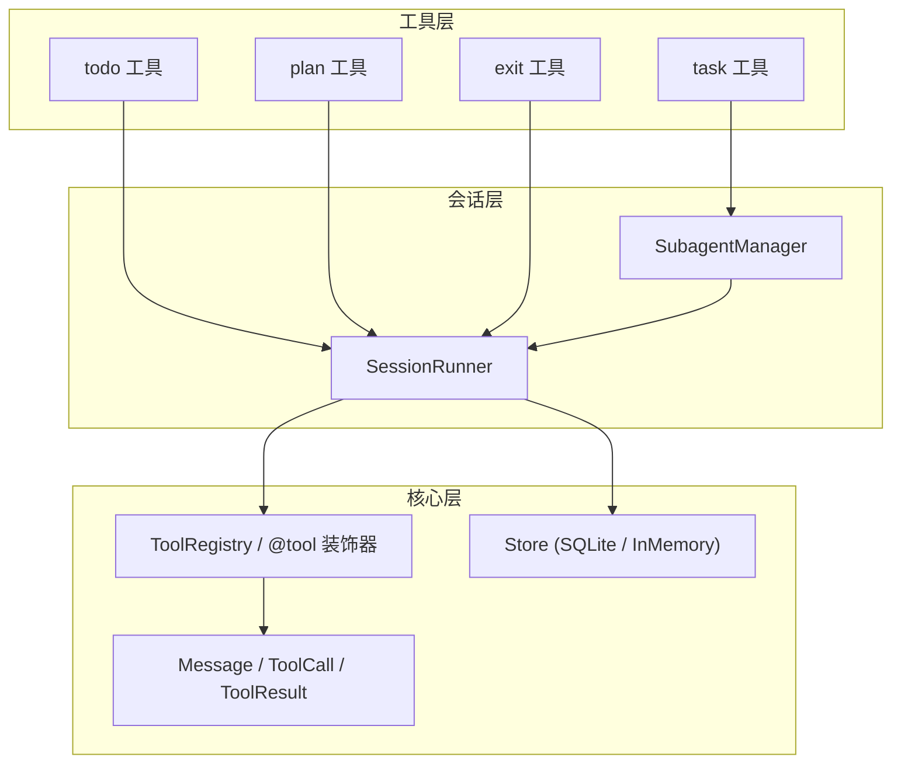
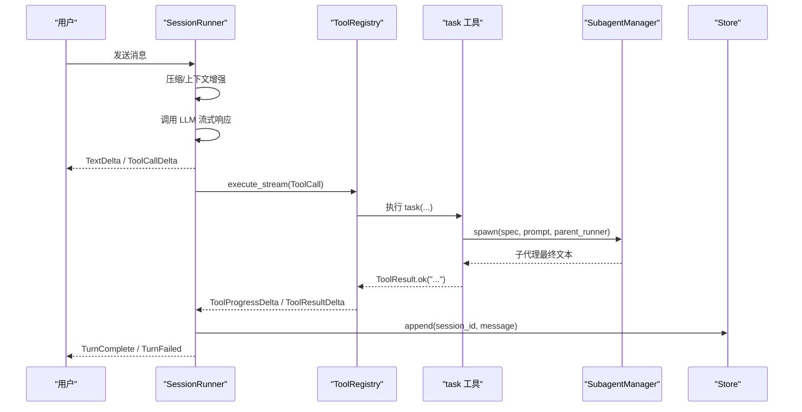
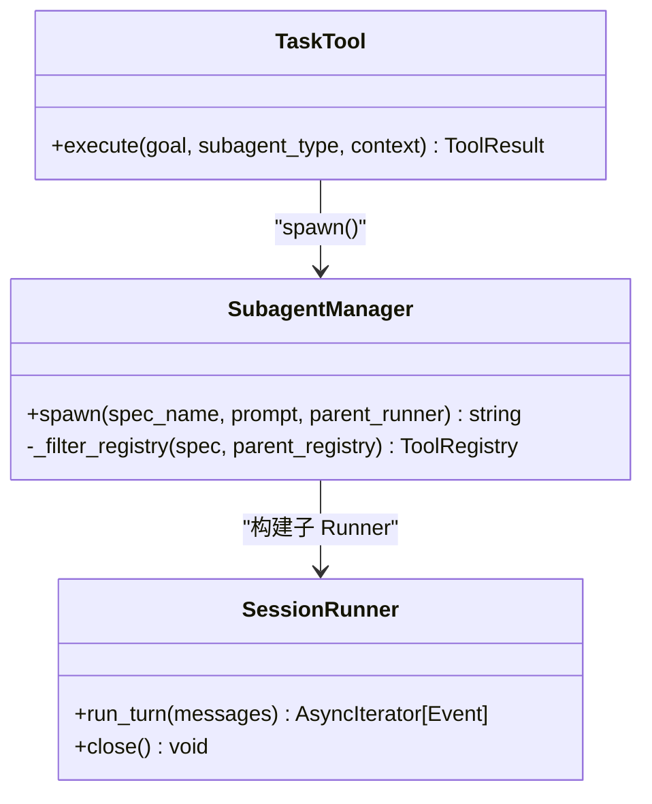
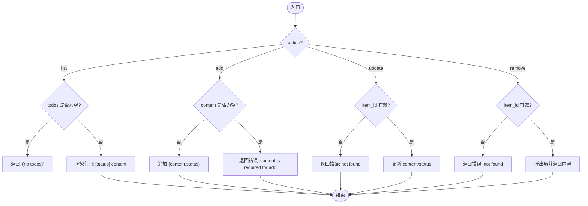
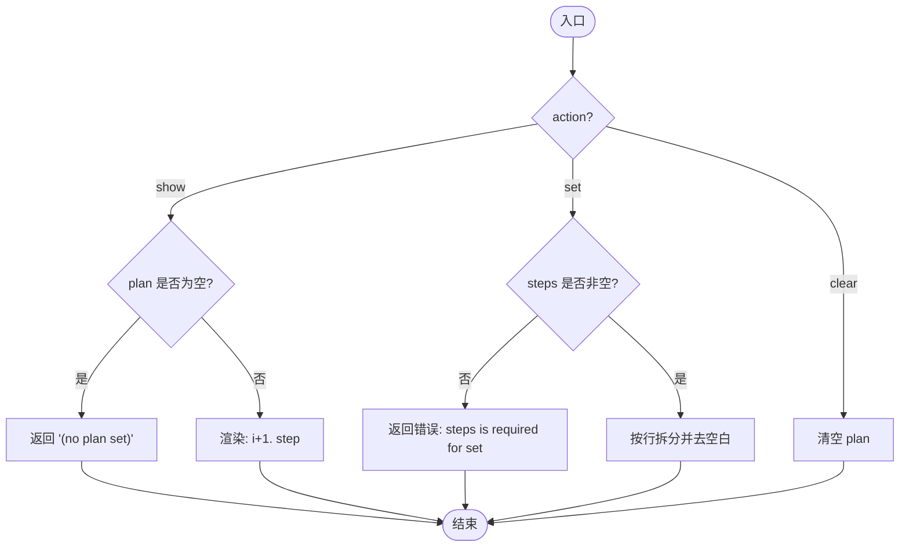
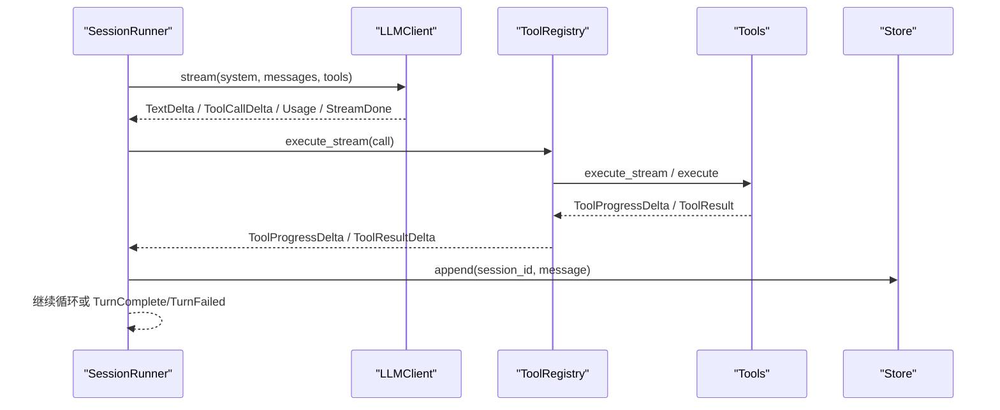
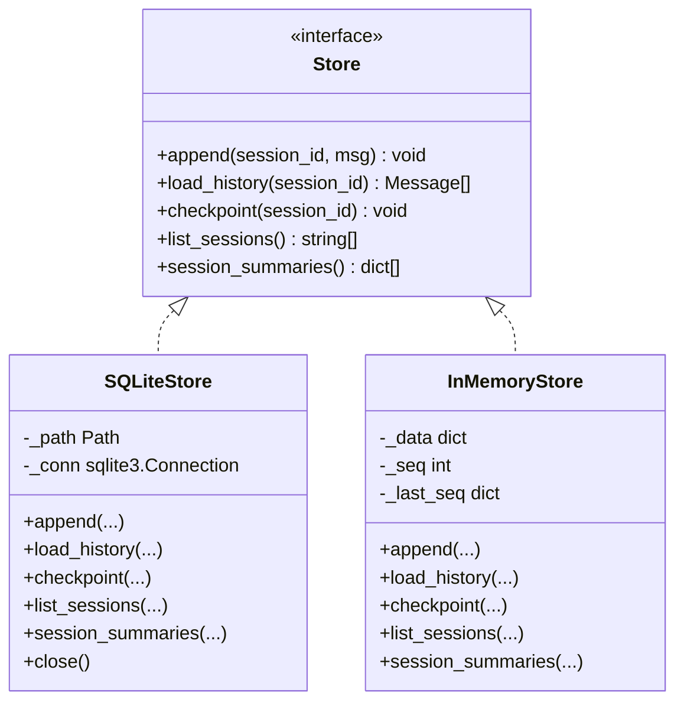
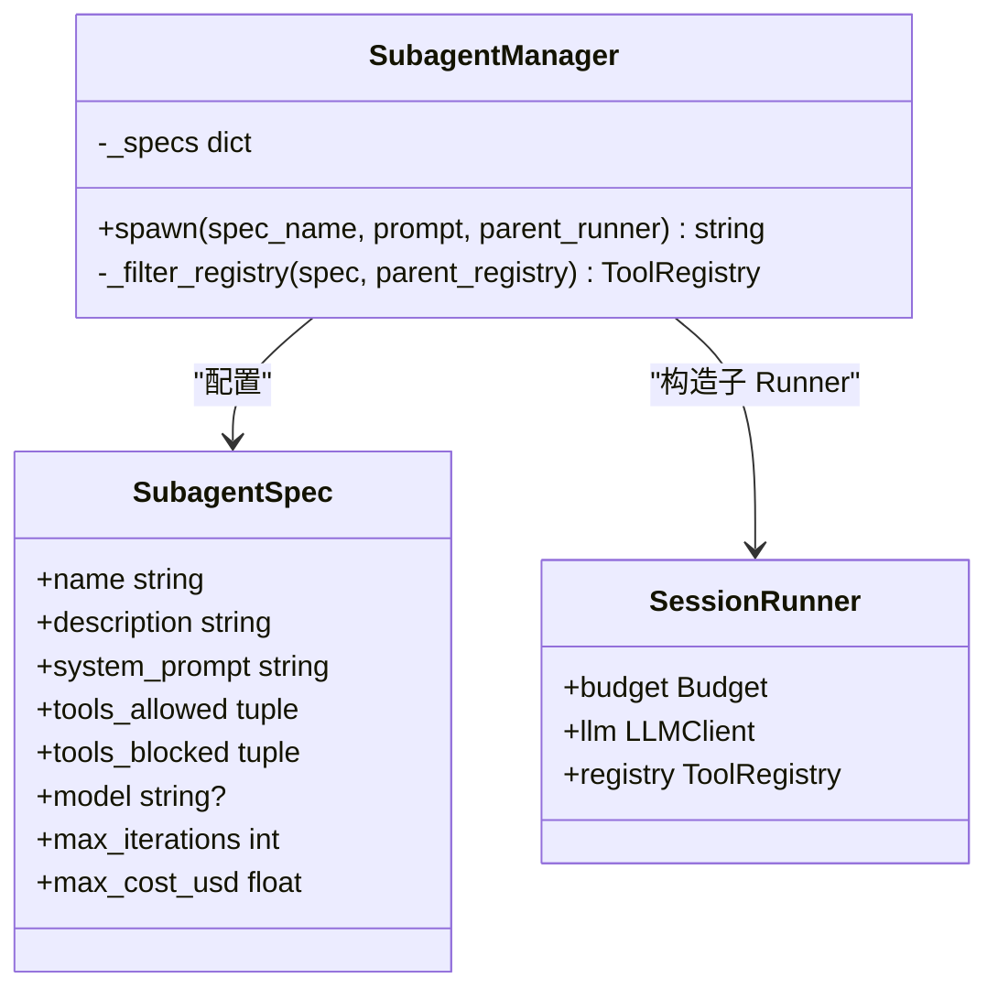
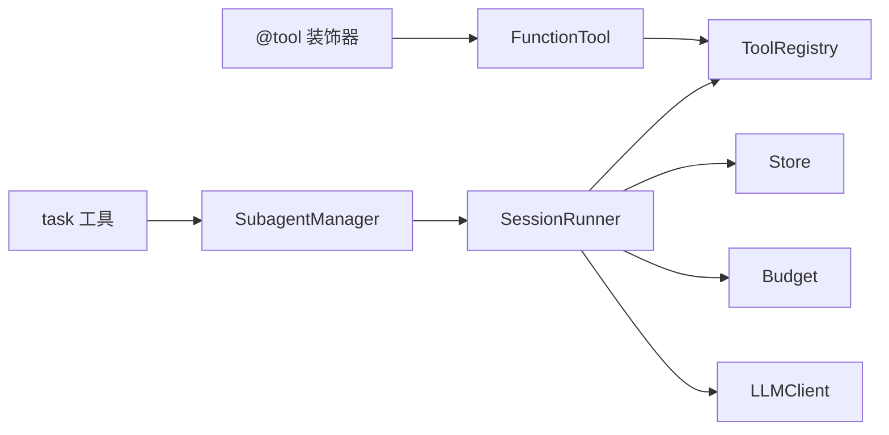

# 任务管理工具

<cite>
**本文引用的文件**   
- [task.py](file://src/microagent/tools/builtins/task.py)
- [todo_plan_exit.py](file://src/microagent/tools/builtins/todo_plan_exit.py)
- [store.py](file://src/microagent/core/store.py)
- [tool.py](file://src/microagent/core/tool.py)
- [types.py](file://src/microagent/core/types.py)
- [manager.py](file://src/microagent/subagent/manager.py)
- [runner.py](file://src/microagent/session/runner.py)
- [README.md](file://README.md)
</cite>

## 目录
1. [简介](#简介)
2. [项目结构](#项目结构)
3. [核心组件](#核心组件)
4. [架构总览](#架构总览)
5. [详细组件分析](#详细组件分析)
6. [依赖关系分析](#依赖关系分析)
7. [性能考量](#性能考量)
8. [故障排查指南](#故障排查指南)
9. [结论](#结论)
10. [附录](#附录)

## 简介
本文件为 MicroAgent 的任务管理工具组提供系统化文档，覆盖以下能力：
- task 工具：子代理任务创建与执行、隔离上下文、预算树、结果回传。
- todo 工具：待办事项列表的增删改查、状态标记（pending/in_progress/completed）。
- plan 工具：多步计划制定、查看与清理。
- exit 工具：会话退出信号与优雅关闭流程。
- 持久化存储与会话恢复：SQLite WAL 模式的消息存储、检查点、会话摘要。
- 数据同步与冲突处理：基于序列号与 WAL 的追加式写入、顺序读取。
- 工作流最佳实践：任务设计模式、错误恢复、监控告警等。

## 项目结构
MicroAgent 将“工具”作为扩展能力的核心，任务相关工具位于内置工具集，并通过统一的工具注册与执行框架进行编排。会话运行器负责 LLM 调用、工具执行循环、事件分发与持久化。

图表来源
- [runner.py:118-341](file://src/microagent/session/runner.py#L118-L341)
- [tool.py:177-309](file://src/microagent/core/tool.py#L177-L309)
- [store.py:95-182](file://src/microagent/core/store.py#L95-L182)
- [manager.py:77-160](file://src/microagent/subagent/manager.py#L77-L160)

章节来源
- [README.md:383-408](file://README.md#L383-L408)

## 核心组件
- 工具协议与注册：通过 @tool 装饰器声明函数型工具，自动推导参数 Schema，支持流式输出。
- 会话运行器：LLM → 工具调用 → 结果回写 → 下一轮；支持并发工具执行、进度事件、预算控制。
- 持久化存储：SQLite WAL 消息存储，支持追加、历史加载、检查点、会话列表与摘要。
- 子代理管理器：按规格过滤工具集、继承或替换模型、派生预算树、隔离上下文。

章节来源
- [tool.py:40-118](file://src/microagent/core/tool.py#L40-L118)
- [tool.py:177-309](file://src/microagent/core/tool.py#L177-L309)
- [runner.py:40-117](file://src/microagent/session/runner.py#L40-L117)
- [store.py:95-182](file://src/microagent/core/store.py#L95-L182)
- [manager.py:26-69](file://src/microagent/subagent/manager.py#L26-L69)

## 架构总览
下图展示任务管理工具在会话运行时的交互路径：用户输入进入 SessionRunner，LLM 可能触发 tool_calls，运行器根据 ToolRegistry 执行对应工具；task 工具通过 SubagentManager 派生子代理并返回最终文本；todo/plan/exit 维护进程内会话状态；所有关键消息经 Store 持久化。

图表来源
- [runner.py:118-341](file://src/microagent/session/runner.py#L118-L341)
- [tool.py:256-280](file://src/microagent/core/tool.py#L256-L280)
- [task.py:28-54](file://src/microagent/tools/builtins/task.py#L28-L54)
- [manager.py:83-142](file://src/microagent/subagent/manager.py#L83-L142)
- [store.py:122-148](file://src/microagent/core/store.py#L122-L148)

## 详细组件分析

### task 工具：子代理任务创建与管理
- 功能要点
  - 通过 SubagentManager.spawn 启动子代理，隔离上下文与工具集。
  - 父代理仅看到最终文本结果，中间过程不可见（上下文防火墙）。
  - 支持指定子代理类型（explore/general），限制可访问工具与成本上限。
- 关键实现
  - 使用 ContextVar 传递当前 runner，确保线程/异步安全。
  - 异常统一包装为 ToolResult.error，未知类型捕获 KeyError。
- 适用场景
  - 需要独立预算与受限工具集的复杂任务分解与执行。

图表来源
- [task.py:28-54](file://src/microagent/tools/builtins/task.py#L28-L54)
- [manager.py:77-160](file://src/microagent/subagent/manager.py#L77-L160)
- [runner.py:118-341](file://src/microagent/session/runner.py#L118-L341)

章节来源
- [task.py:1-54](file://src/microagent/tools/builtins/task.py#L1-L54)
- [manager.py:1-160](file://src/microagent/subagent/manager.py#L1-L160)

### todo 工具：待办事项管理
- 功能要点
  - 动作：list/add/update/remove。
  - 状态：pending | in_progress | completed。
  - 索引操作：update/remove 使用 0 基索引。
- 数据结构
  - 每会话内存态 SessionState.todos 列表，元素包含 content 与 status。
- 行为说明
  - list 为空时返回提示；add 校验 content；update/remove 校验索引。
- 适用场景
  - 轻量级、进程内任务清单，适合短期会话中的步骤跟踪。

图表来源
- [todo_plan_exit.py:56-99](file://src/microagent/tools/builtins/todo_plan_exit.py#L56-L99)

章节来源
- [todo_plan_exit.py:24-49](file://src/microagent/tools/builtins/todo_plan_exit.py#L24-L49)
- [todo_plan_exit.py:56-99](file://src/microagent/tools/builtins/todo_plan_exit.py#L56-L99)

### plan 工具：计划制定与查看
- 功能要点
  - 动作：show/set/clear。
  - set 接受换行分隔的步骤字符串，自动去除空白行。
  - show 以编号列出步骤；clear 清空计划。
- 数据结构
  - 每会话内存态 SessionState.plan 列表。
- 适用场景
  - 多步任务的规划与可视化，不执行逻辑，仅辅助编排。

图表来源
- [todo_plan_exit.py:106-131](file://src/microagent/tools/builtins/todo_plan_exit.py#L106-L131)

章节来源
- [todo_plan_exit.py:106-131](file://src/microagent/tools/builtins/todo_plan_exit.py#L106-L131)

### exit 工具：程序退出机制
- 功能要点
  - 返回特殊标记 "[SESSION_EXIT]"，供上层识别会话结束。
- 适用场景
  - 明确终止当前会话，配合外部控制器进行资源释放与状态保存。

章节来源
- [todo_plan_exit.py:138-141](file://src/microagent/tools/builtins/todo_plan_exit.py#L138-L141)

### 会话运行器与工具执行流
- 关键点
  - run_turn 循环：LLM 流式响应 → 累积 ToolCall → 并发执行工具 → 收集进度与结果 → 持久化 → 下一轮。
  - _run_tool_calls 设置进程内状态（todo/plan、浏览器、进程、task runner）后执行工具。
  - 支持 execute_stream 优先，否则回退到 execute。
  - 预算耗尽抛出 TurnFailed，截断时持久化部分响应并失败。

图表来源
- [runner.py:118-341](file://src/microagent/session/runner.py#L118-L341)
- [tool.py:256-280](file://src/microagent/core/tool.py#L256-L280)

章节来源
- [runner.py:118-341](file://src/microagent/session/runner.py#L118-L341)

### 持久化存储与会话恢复
- SQLiteStore
  - WAL 模式、自增 seq、JSON 序列化 Message。
  - 接口：append、load_history、checkpoint、list_sessions、session_summaries。
- InMemoryStore
  - 测试用内存实现，保持追加顺序与最近性排序。
- 会话恢复
  - SessionRunner.resume 从 Store 加载历史，继续对话。

图表来源
- [store.py:28-37](file://src/microagent/core/store.py#L28-L37)
- [store.py:95-182](file://src/microagent/core/store.py#L95-L182)
- [store.py:189-226](file://src/microagent/core/store.py#L189-L226)

章节来源
- [store.py:1-226](file://src/microagent/core/store.py#L1-L226)
- [runner.py:115-117](file://src/microagent/session/runner.py#L115-L117)

### 子代理管理与预算树
- SubagentSpec
  - 定义 name/description/system_prompt/tools_allowed/tools_blocked/model/max_iterations/max_cost_usd。
- SubagentManager
  - 过滤工具集（黑名单优先，白名单可选）、派生预算、复用或替换 LLM、构造子 SessionRunner。
  - 捕获 TurnComplete/TurnFailed，清理资源（包括 forked LLM 连接池）。

图表来源
- [manager.py:26-69](file://src/microagent/subagent/manager.py#L26-L69)
- [manager.py:77-160](file://src/microagent/subagent/manager.py#L77-L160)

章节来源
- [manager.py:1-160](file://src/microagent/subagent/manager.py#L1-L160)

## 依赖关系分析
- 工具注册与发现
  - @tool 装饰器将函数封装为 FunctionTool，自动推断参数 Schema，并注册到模块级 _registry。
  - ToolRegistry 统一管理工具集合，导出 OpenAI tools 格式，支持 execute 与 execute_stream。
- 会话运行器依赖
  - 依赖 ToolRegistry、Store、Budget、LLMClient、EventBus、Hook、ContextSource。
  - 运行时注入进程内状态（todo/plan、浏览器、进程、task runner）。
- 子代理依赖
  - 依赖 Parent SessionRunner 的 budget、event_bus、hooks、context_sources。
  - 通过 _filter_registry 裁剪工具集，保证隔离与安全。

图表来源
- [tool.py:177-309](file://src/microagent/core/tool.py#L177-L309)
- [runner.py:40-117](file://src/microagent/session/runner.py#L40-L117)
- [manager.py:77-160](file://src/microagent/subagent/manager.py#L77-L160)

章节来源
- [tool.py:1-309](file://src/microagent/core/tool.py#L1-L309)
- [runner.py:1-341](file://src/microagent/session/runner.py#L1-L341)
- [manager.py:1-160](file://src/microagent/subagent/manager.py#L1-L160)

## 性能考量
- 工具执行并发
  - _run_tool_calls 使用任务组并发执行多个 tool_calls，提升吞吐。
- 流式输出
  - 支持 ToolProgressDelta 实时推送，改善用户体验。
- 压缩与上下文窗口
  - 当消息超过阈值时进行对话压缩，避免超出上下文窗口。
- 持久化开销
  - SQLite WAL 追加写入，checkpoint 控制 WAL 截断；session_summaries 单次查询生成摘要，避免 O(N) 全量加载。
- 预算控制
  - 每次迭代消耗预算，超限即失败，防止无限循环。

章节来源
- [runner.py:285-341](file://src/microagent/session/runner.py#L285-L341)
- [store.py:150-178](file://src/microagent/core/store.py#L150-L178)

## 故障排查指南
- 常见错误
  - unknown action：todo/plan 的动作参数不正确。
  - content is required for add：todo add 缺少内容。
  - todo #X not found：索引越界。
  - unknown subagent type：task 的子代理类型不在允许范围。
  - budget exhausted：预算耗尽导致 TurnFailed。
  - LLM response truncated：响应被截断，已持久化部分响应。
- 定位建议
  - 检查 Store 中 session 的最后一条消息与 ToolResult 的 is_error 字段。
  - 确认 SubagentSpec 的工具白名单/黑名单与模型配置。
  - 观察 ToolProgressDelta 与 ToolResultDelta 以确定工具执行阶段。

章节来源
- [todo_plan_exit.py:56-99](file://src/microagent/tools/builtins/todo_plan_exit.py#L56-L99)
- [todo_plan_exit.py:106-131](file://src/microagent/tools/builtins/todo_plan_exit.py#L106-L131)
- [task.py:40-54](file://src/microagent/tools/builtins/task.py#L40-L54)
- [runner.py:129-284](file://src/microagent/session/runner.py#L129-L284)

## 结论
MicroAgent 的任务管理工具组通过简洁而强大的抽象，实现了：
- 子代理隔离与预算树，保障任务边界与成本控制。
- 进程内轻量状态管理（todo/plan），满足短期会话编排需求。
- 会话级持久化与恢复，支持 WAL 与检查点，具备企业级可靠性基础。
- 流式工具输出与并发执行，兼顾性能与用户体验。

在实际工程中，建议结合权限引擎、事件总线与记忆系统，构建完整的任务生命周期管理与监控体系。

## 附录
- 工具清单与描述参考 README 内置工具表。
- 示例用法与扩展点参考 README 快速开始与架构章节。

章节来源
- [README.md:383-408](file://README.md#L383-L408)
- [README.md:349-366](file://README.md#L349-L366)