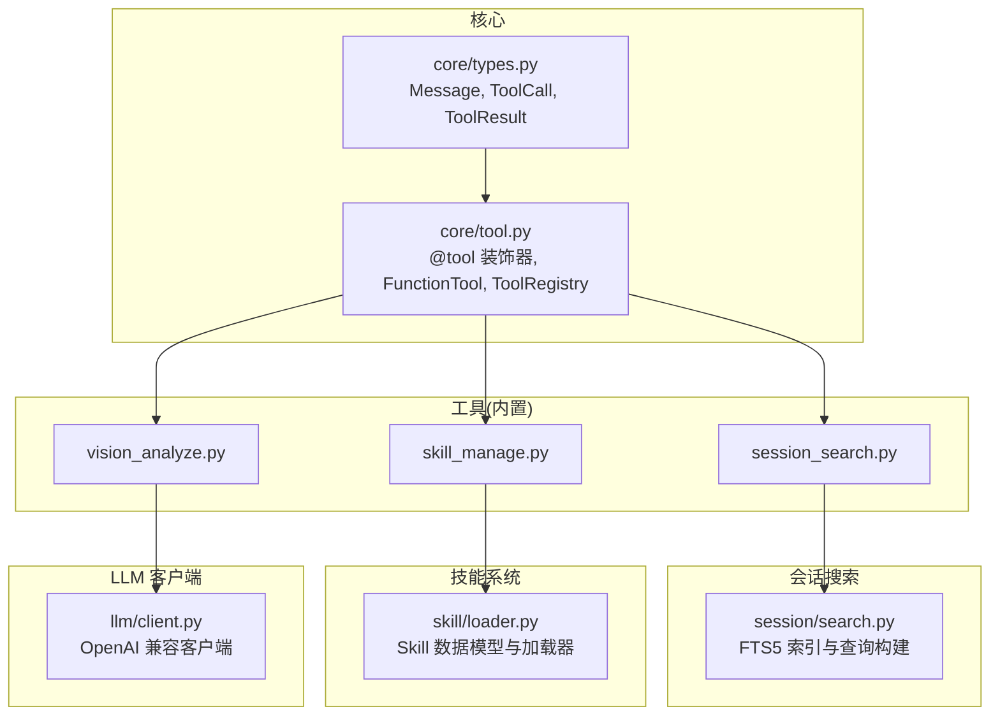
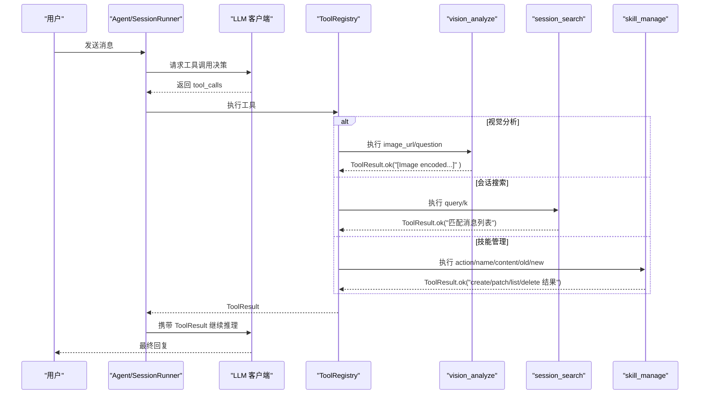
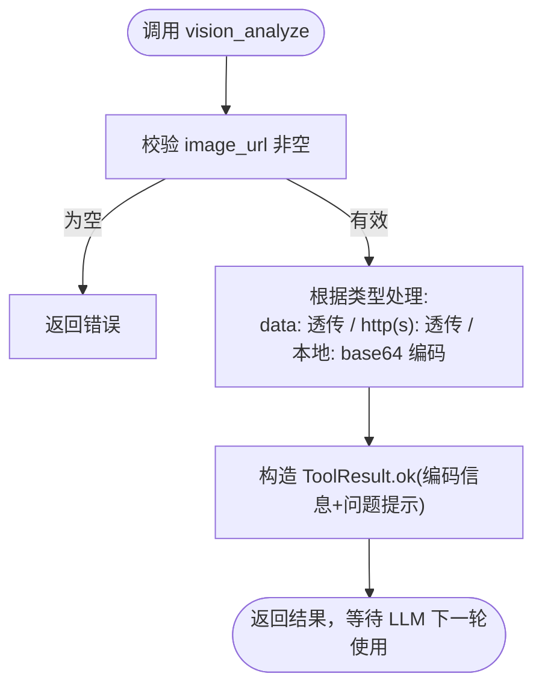
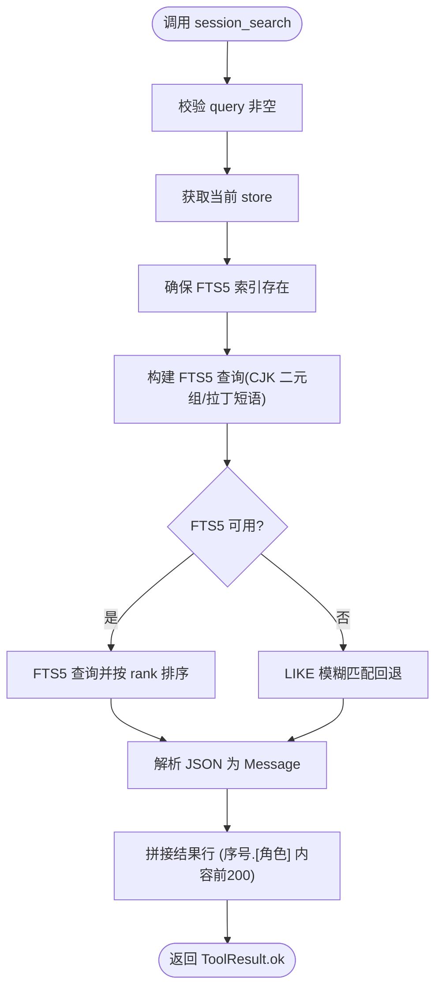
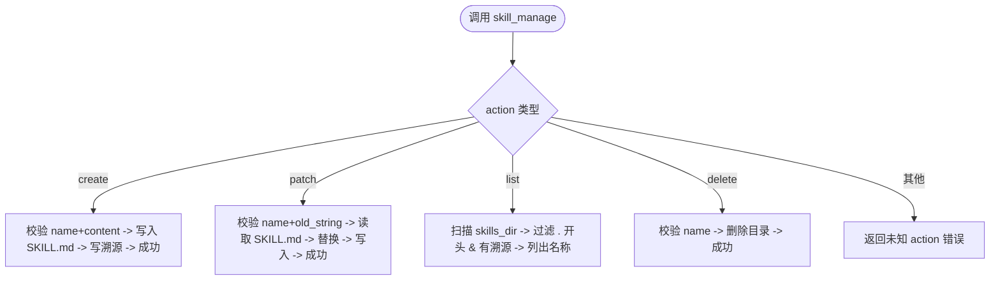
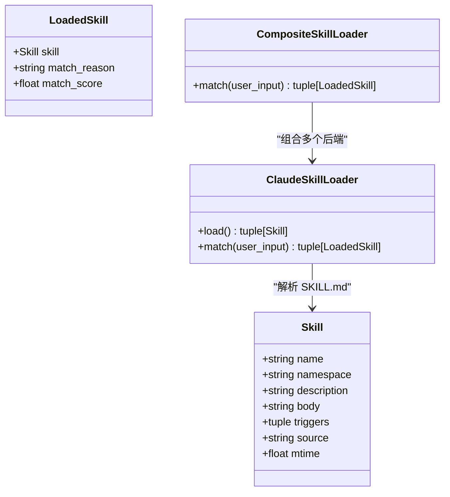
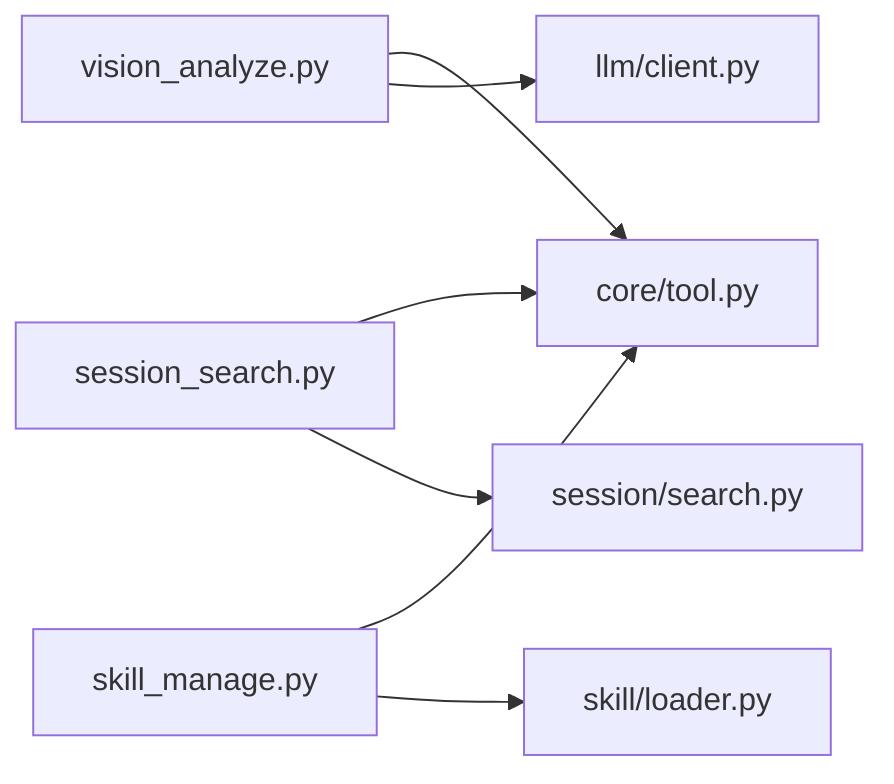

# 实用工具集

<cite>
**本文引用的文件**   
- [README.md](file://README.md)
- [config.py](file://src/microagent/config.py)
- [core/tool.py](file://src/microagent/core/tool.py)
- [core/types.py](file://src/microagent/core/types.py)
- [tools/builtins/vision_analyze.py](file://src/microagent/tools/builtins/vision_analyze.py)
- [tools/builtins/session_search.py](file://src/microagent/tools/builtins/session_search.py)
- [tools/builtins/skill_manage.py](file://src/microagent/tools/builtins/skill_manage.py)
- [session/search.py](file://src/microagent/session/search.py)
- [skill/loader.py](file://src/microagent/skill/loader.py)
- [llm/client.py](file://src/microagent/llm/client.py)
- [tests/unit/test_vision.py](file://tests/unit/test_vision.py)
- [tests/unit/test_session_search.py](file://tests/unit/test_session_search.py)
- [tests/unit/test_skill_manage.py](file://tests/unit/test_skill_manage.py)
</cite>

## 目录
1. [简介](#简介)
2. [项目结构](#项目结构)
3. [核心组件](#核心组件)
4. [架构总览](#架构总览)
5. [详细组件分析](#详细组件分析)
6. [依赖关系分析](#依赖关系分析)
7. [性能与调优](#性能与调优)
8. [故障排除指南](#故障排除指南)
9. [结论](#结论)
10. [附录：配置与扩展](#附录配置与扩展)

## 简介
本文件为 MicroAgent 的“实用工具集”提供系统化文档，重点覆盖以下三个内置工具：
- vision_analyze：图像理解、OCR、图表分析与多模态推理（通过支持视觉的大模型完成）
- session_search：会话历史检索，支持全文检索、BM25 排序与 LIKE 回退
- skill_manage：运行时技能管理（创建、补丁、列出、删除），支撑自改进学习闭环

同时给出配置选项、性能调优建议、扩展机制以及与外部系统集成时的注意事项和最佳实践。

## 项目结构
MicroAgent 采用“薄核心 + 厚边缘”的设计：核心负责类型、注册表、权限、存储与事件；能力集中在 tools、skills、memory、session 等模块中。本次文档聚焦 tools/builtins 下的三个工具及其相关子系统。

**图示来源** 
- [core/types.py:1-189](file://src/microagent/core/types.py#L1-L189)
- [core/tool.py:1-309](file://src/microagent/core/tool.py#L1-L309)
- [tools/builtins/vision_analyze.py:1-66](file://src/microagent/tools/builtins/vision_analyze.py#L1-L66)
- [tools/builtins/session_search.py:1-46](file://src/microagent/tools/builtins/session_search.py#L1-L46)
- [tools/builtins/skill_manage.py:1-106](file://src/microagent/tools/builtins/skill_manage.py#L1-L106)
- [session/search.py:1-161](file://src/microagent/session/search.py#L1-L161)
- [skill/loader.py:1-160](file://src/microagent/skill/loader.py#L1-L160)
- [llm/client.py:1-309](file://src/microagent/llm/client.py#L1-L309)

**章节来源**
- [README.md:368-381](file://README.md#L368-L381)

## 核心组件
- Tool 协议与 @tool 装饰器：将异步函数包装为可执行的 Tool，自动从 Pydantic Field 推断 OpenAI 函数调用 JSON Schema，并支持流式输出。
- ToolRegistry：集中注册与执行工具，导出 OpenAI tools 格式，统一 execute 与 execute_stream。
- Message/ToolCall/ToolResult：统一的消息与工具调用结果数据结构，贯穿 SessionRunner、LLMClient 与工具实现。

这些组件为 vision_analyze、session_search、skill_manage 提供了统一的接入与执行框架。

**章节来源**
- [core/tool.py:1-309](file://src/microagent/core/tool.py#L1-L309)
- [core/types.py:1-189](file://src/microagent/core/types.py#L1-L189)

## 架构总览
下图展示了三个工具在整体系统中的交互方式：用户通过 Agent/SessionRunner 发起对话，LLM 决定调用哪个工具；工具执行后返回 ToolResult，再由 LLM 进行下一步推理或生成最终回答。

**图示来源** 
- [core/tool.py:221-280](file://src/microagent/core/tool.py#L221-L280)
- [tools/builtins/vision_analyze.py:40-66](file://src/microagent/tools/builtins/vision_analyze.py#L40-L66)
- [tools/builtins/session_search.py:20-46](file://src/microagent/tools/builtins/session_search.py#L20-L46)
- [tools/builtins/skill_manage.py:46-106](file://src/microagent/tools/builtins/skill_manage.py#L46-L106)

## 详细组件分析

### vision_analyze：视觉分析工具
- 功能要点
  - 输入：image_url（本地路径、http(s) URL、data: URL）、question（可选，默认描述图片）
  - 处理：对本地图片进行 base64 编码并转为 data: URL；URL 直接透传
  - 输出：返回包含编码长度与问题提示的 ToolResult，实际“展示给视觉模型”发生在下一轮由 LLM 消费该上下文
- 使用约束
  - 需要支持视觉的模型（如 gpt-4o、claude-sonnet-4 等）
  - 空 image_url 会返回错误
- 典型流程

**图示来源** 
- [tools/builtins/vision_analyze.py:21-66](file://src/microagent/tools/builtins/vision_analyze.py#L21-L66)

- 集成说明
  - 工具本身不直接调用 LLM，而是将图像以 data: URL 形式作为上下文传递给 LLM，由 LLM 在后续回合中进行视觉推理
  - 适合 OCR、图表解读、截图问答、多模态推理等场景

- 测试要点
  - 注册为内置工具
  - 空 URL 报错
  - 本地图片 base64 编码正确
  - data: URL 透传

**章节来源**
- [tools/builtins/vision_analyze.py:1-66](file://src/microagent/tools/builtins/vision_analyze.py#L1-L66)
- [tests/unit/test_vision.py:1-50](file://tests/unit/test_vision.py#L1-L50)

### session_search：会话搜索工具
- 功能要点
  - 输入：query（搜索词）、k（最大结果数，1~20）
  - 后端：SQLite FTS5 全文检索，按 BM25 排序；不可用时回退到 LIKE
  - 输出：格式化后的消息片段（角色+内容前200字符）
- 关键实现
  - FTS5 触发器维护 messages_fts 虚拟表
  - CJK 分词策略：拉丁单词短语匹配，中文按二元组提升精度
  - 异常回退：FTS5 失败时退回 LIKE 模糊匹配

**图示来源** 
- [session/search.py:1-161](file://src/microagent/session/search.py#L1-L161)
- [tools/builtins/session_search.py:1-46](file://src/microagent/tools/builtins/session_search.py#L1-L46)

- 分页与排序
  - k 控制返回数量，未提供原生分页 API；可在上层按 k 分批拉取
  - 排序依据：FTS5 的 rank（BM25），回退时为 id 倒序

- 测试要点
  - 拉丁词、多词、CJK 二元组、混合查询均能命中
  - ensure_fts5 幂等
  - search_sessions 能找到匹配、无匹配返回空、尊重 k、LIKE 回退可用

**章节来源**
- [session/search.py:1-161](file://src/microagent/session/search.py#L1-L161)
- [tools/builtins/session_search.py:1-46](file://src/microagent/tools/builtins/session_search.py#L1-L46)
- [tests/unit/test_session_search.py:1-76](file://tests/unit/test_session_search.py#L1-L76)

### skill_manage：技能管理工具
- 功能要点
  - 动作：create、patch、list、delete
  - 存储位置：~/.microagent/skills/<name>/SKILL.md
  - 溯源：每个技能目录写入 .provenance.json，记录 created_by=agent
  - list 仅列出 agent 创建的 SKILL（基于溯源文件判断）
- 使用约束
  - create：需提供 name 与 content
  - patch：需提供 name、old_string、new_string
  - delete：需提供 name
- 流程图

**图示来源** 
- [tools/builtins/skill_manage.py:20-106](file://src/microagent/tools/builtins/skill_manage.py#L20-L106)

- 与 SkillLoader 的关系
  - skill_manage 负责运行时创建/修改 SKILL.md
  - ClaudeSkillLoader 负责从指定路径加载 SKILL.md，支持 triggers 与描述模糊匹配，CompositeSkillLoader 合并去重与排序

**图示来源** 
- [skill/loader.py:23-160](file://src/microagent/skill/loader.py#L23-L160)

- 测试要点
  - create 生成 SKILL.md
  - list 列出 agent 创建的 skill
  - patch 替换文本生效
  - delete 删除目录
  - 非法 action 返回错误

**章节来源**
- [tools/builtins/skill_manage.py:1-106](file://src/microagent/tools/builtins/skill_manage.py#L1-L106)
- [skill/loader.py:1-160](file://src/microagent/skill/loader.py#L1-L160)
- [tests/unit/test_skill_manage.py:1-147](file://tests/unit/test_skill_manage.py#L1-L147)

## 依赖关系分析
- 工具层依赖 core/tool 的 @tool 与 ToolRegistry，统一执行入口
- session_search 依赖 session/search 的 FTS5 查询构建与回退逻辑
- skill_manage 依赖文件系统与溯源文件，配合 skill/loader 的数据模型与匹配策略
- vision_analyze 依赖 LLM 客户端（由上层 SessionRunner 驱动），自身只负责图像编码与上下文传递

**图示来源** 
- [core/tool.py:282-309](file://src/microagent/core/tool.py#L282-L309)
- [session/search.py:1-161](file://src/microagent/session/search.py#L1-L161)
- [skill/loader.py:1-160](file://src/microagent/skill/loader.py#L1-L160)
- [llm/client.py:1-309](file://src/microagent/llm/client.py#L1-L309)

**章节来源**
- [core/tool.py:221-309](file://src/microagent/core/tool.py#L221-L309)

## 性能与调优
- vision_analyze
  - 图像编码在工具内异步线程执行，避免阻塞事件循环
  - 建议限制单次图像大小，避免过大 data: URL 导致上下文膨胀
  - 选择合适模型：gpt-4o、claude-sonnet-4 等具备视觉能力
- session_search
  - FTS5 优先，BM25 排序高效；若环境不支持则回退 LIKE
  - CJK 二元组策略提升中文检索精度
  - 合理设置 k，避免过多 IO 与序列化开销
- skill_manage
  - 读写 SKILL.md 使用异步线程封装，避免阻塞
  - 溯源文件用于快速过滤 agent 创建的 skill，减少遍历成本
- 通用
  - 工具结果过长会被压缩金字塔截断（见 README 中的压缩策略），注意控制输出长度
  - 使用 ToolRegistry.execute_stream 可获得实时进度（适用于支持流式的工具）

**章节来源**
- [README.md:368-381](file://README.md#L368-L381)
- [session/search.py:1-161](file://src/microagent/session/search.py#L1-L161)
- [tools/builtins/vision_analyze.py:21-66](file://src/microagent/tools/builtins/vision_analyze.py#L21-L66)
- [tools/builtins/skill_manage.py:20-106](file://src/microagent/tools/builtins/skill_manage.py#L20-L106)

## 故障排除指南
- vision_analyze
  - 错误：image_url 为空 → 检查参数是否传入
  - 错误：本地文件不存在 → 确认路径正确且可读
  - 现象：无视觉输出 → 确认模型支持视觉，并在下一轮让 LLM 消费 data: URL
- session_search
  - 现象：无结果 → 检查 query 是否过于生僻；尝试缩小范围或增加 k
  - 现象：FTS5 不可用 → 自动回退 LIKE，仍可工作但性能下降
  - 现象：store 不可用 → 检查 _current_store 是否正确注入（由运行期上下文变量提供）
- skill_manage
  - 错误：缺少必要参数 → 根据 action 补齐 name/content/old_string/new_string
  - 错误：技能不存在 → 先 list 确认名称，再操作
  - 现象：list 为空 → 确认技能目录下存在 .provenance.json（由 create 自动生成）

**章节来源**
- [tools/builtins/vision_analyze.py:40-66](file://src/microagent/tools/builtins/vision_analyze.py#L40-L66)
- [tools/builtins/session_search.py:20-46](file://src/microagent/tools/builtins/session_search.py#L20-L46)
- [session/search.py:97-161](file://src/microagent/session/search.py#L97-L161)
- [tools/builtins/skill_manage.py:46-106](file://src/microagent/tools/builtins/skill_manage.py#L46-L106)

## 结论
- vision_analyze 将图像编码为 data: URL，交由支持视觉的 LLM 在下一轮进行理解与推理，适合 OCR、图表解读与多模态任务
- session_search 基于 SQLite FTS5 提供高性能全文检索与 BM25 排序，并对 CJK 做了优化，必要时回退 LIKE
- skill_manage 提供运行时技能管理能力，结合 skill/loader 的匹配策略，形成“创建—加载—匹配—使用”的闭环
- 三者均遵循统一的 Tool 协议与 ToolRegistry 执行模型，便于扩展与集成

## 附录：配置与扩展
- 配置优先级：CLI > 环境变量 > 配置文件 > 默认值
  - 环境变量：MICROAGENT_BASE_URL、MICROAGENT_API_KEY、MICROAGENT_MODEL、MICROAGENT_SYSTEM_PROMPT、MICROAGENT_SKILLS_PATH
  - 配置文件：~/.microagent/config.yaml
- 扩展机制
  - 自定义工具：使用 @tool 装饰器定义异步函数，并在 _default_builtins 中引入即可被注册
  - 扩展点：PreLLMHook、ToolHook、ContextSource，通过 SessionRunner 注入
  - MCP 集成：通过 connect_mcp_stdio 将外部 MCP 工具注册为 MicroAgent 工具
- 与其他系统集成注意事项
  - 视觉模型：确保 base_url 指向支持视觉的 OpenAI 兼容端点
  - 会话存储：使用 SQLiteStore 以保证 FTS5 可用；跨进程共享需考虑 WAL 模式
  - 权限控制：通过 PermissionEngine 与 Rule/ScriptRule 限制敏感工具调用

**章节来源**
- [config.py:1-101](file://src/microagent/config.py#L1-L101)
- [core/tool.py:282-309](file://src/microagent/core/tool.py#L282-L309)
- [README.md:246-321](file://README.md#L246-L321)