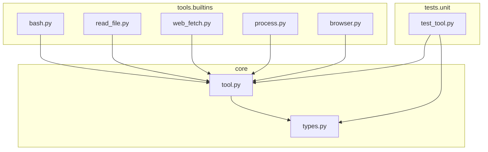
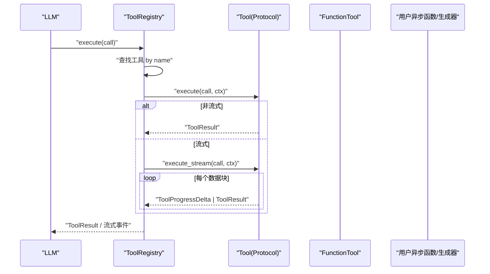
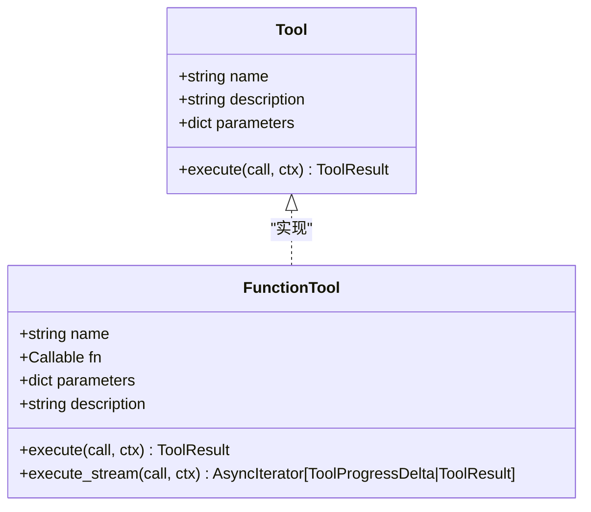
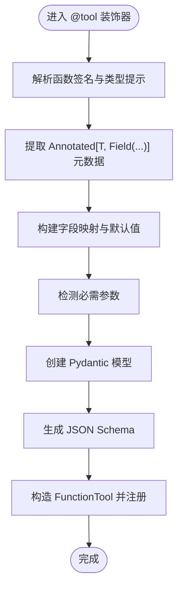
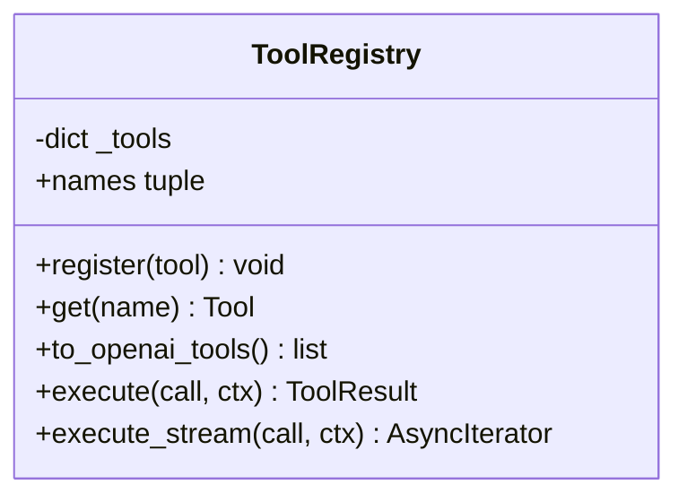
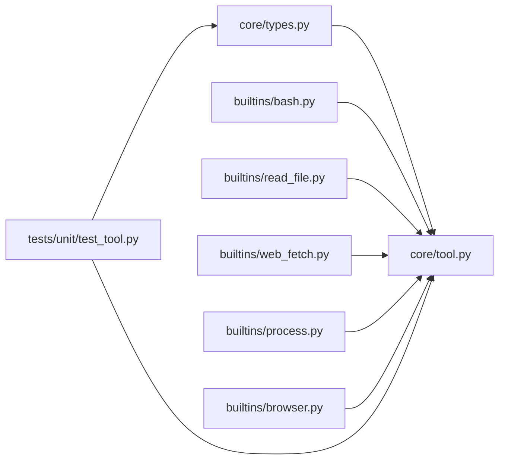

# 工具协议与核心机制

<cite>
**本文引用的文件**
- [src/microagent/core/tool.py](file://src/microagent/core/tool.py)
- [src/microagent/core/types.py](file://src/microagent/core/types.py)
- [src/microagent/tools/builtins/bash.py](file://src/microagent/tools/builtins/bash.py)
- [src/microagent/tools/builtins/read_file.py](file://src/microagent/tools/builtins/read_file.py)
- [src/microagent/tools/builtins/web_fetch.py](file://src/microagent/tools/builtins/web_fetch.py)
- [src/microagent/tools/builtins/process.py](file://src/microagent/tools/builtins/process.py)
- [src/microagent/tools/builtins/browser.py](file://src/microagent/tools/builtins/browser.py)
- [tests/unit/test_tool.py](file://tests/unit/test_tool.py)
</cite>

## 目录
1. [简介](#简介)
2. [项目结构](#项目结构)
3. [核心组件](#核心组件)
4. [架构总览](#架构总览)
5. [详细组件分析](#详细组件分析)
6. [依赖关系分析](#依赖关系分析)
7. [性能考量](#性能考量)
8. [故障排查指南](#故障排查指南)
9. [结论](#结论)
10. [附录：自定义工具开发指南](#附录自定义工具开发指南)

## 简介
本文件面向 MicroAgent 的工具系统与核心机制，系统性阐述 Tool 协议、FunctionTool 适配器、@tool 装饰器、Schema 推断与参数校验、流式执行、以及 ToolRegistry 注册表。文档同时提供自定义工具的开发规范、错误处理模式、流式输出实现要点，并给出可复用的实践建议与示例路径，帮助读者快速构建高性能、可维护的工具组件。

## 项目结构
MicroAgent 将工具协议与类型定义集中在 core 模块，内置工具位于 tools/builtins 子包，测试用例位于 tests/unit。核心文件职责如下：
- core/tool.py：定义 Tool 协议（PEP 544）、FunctionTool 适配器、@tool 装饰器、Schema 推断、ToolRegistry 注册表与默认内置工具发现。
- core/types.py：定义 Message、ToolCall、ToolResult、事件（TextDelta、ToolProgressDelta 等）等基础数据结构。
- tools/builtins/*：基于 @tool 装饰器的具体工具实现，涵盖 Bash、文件读写、网络请求、浏览器自动化、进程管理等。
- tests/unit/test_tool.py：对 @tool 装饰器、Schema 推断、注册表行为进行单元测试。

图表来源
- [src/microagent/core/tool.py:1-309](file://src/microagent/core/tool.py#L1-L309)
- [src/microagent/core/types.py:1-189](file://src/microagent/core/types.py#L1-L189)
- [src/microagent/tools/builtins/bash.py:1-58](file://src/microagent/tools/builtins/bash.py#L1-L58)
- [src/microagent/tools/builtins/read_file.py:1-55](file://src/microagent/tools/builtins/read_file.py#L1-L55)
- [src/microagent/tools/builtins/web_fetch.py:1-93](file://src/microagent/tools/builtins/web_fetch.py#L1-L93)
- [src/microagent/tools/builtins/process.py:1-180](file://src/microagent/tools/builtins/process.py#L1-L180)
- [src/microagent/tools/builtins/browser.py:1-180](file://src/microagent/tools/builtins/browser.py#L1-L180)
- [tests/unit/test_tool.py:1-97](file://tests/unit/test_tool.py#L1-L97)

章节来源
- [src/microagent/core/tool.py:1-309](file://src/microagent/core/tool.py#L1-L309)
- [src/microagent/core/types.py:1-189](file://src/microagent/core/types.py#L1-L189)

## 核心组件
本节聚焦 Tool 协议、FunctionTool 适配器、@tool 装饰器、Schema 推断与 ToolRegistry 的核心设计。

- Tool 协议（PEP 544 结构子类型）
  - 通过 Protocol 声明 name、description、parameters 属性与 execute 方法，无需继承基类即可被识别为 Tool。
  - 支持运行时检查（runtime_checkable），便于在需要时进行 isinstance 判断。

- FunctionTool 适配器
  - 将普通异步函数包装为 Tool，自动处理返回值到 ToolResult 的转换。
  - 支持流式执行：若函数返回 AsyncIterator[str]，则逐块生成 ToolProgressDelta，最终汇总为 ToolResult。

- @tool 装饰器与 Schema 推断
  - 使用 Pydantic v2 的 create_model 与 model_json_schema，从函数签名与 Annotated[T, Field(...)] 元数据推导 OpenAI 兼容 JSON Schema。
  - 自动检测必需参数（无默认值）并写入 required 列表；描述信息优先取自装饰器 description，其次取函数 docstring 首行。

- ToolRegistry 注册表
  - 管理工具集合，提供 register、get、names、to_openai_tools、execute、execute_stream 等方法。
  - to_openai_tools 导出标准 OpenAI tools 格式，便于 LLM 调用。
  - execute_stream 优先调用工具的 execute_stream（若存在），否则回退到 execute。

章节来源
- [src/microagent/core/tool.py:35-118](file://src/microagent/core/tool.py#L35-L118)
- [src/microagent/core/tool.py:120-214](file://src/microagent/core/tool.py#L120-L214)
- [src/microagent/core/tool.py:216-280](file://src/microagent/core/tool.py#L216-L280)
- [src/microagent/core/types.py:76-116](file://src/microagent/core/types.py#L76-L116)
- [src/microagent/core/types.py:153-165](file://src/microagent/core/types.py#L153-L165)

## 架构总览
下图展示工具系统的关键交互：LLM 发起 ToolCall，ToolRegistry 查找并执行对应 Tool，FunctionTool 适配异步函数或流式生成器，结果以 ToolResult 或 ToolProgressDelta 形式返回。

图表来源
- [src/microagent/core/tool.py:216-280](file://src/microagent/core/tool.py#L216-L280)
- [src/microagent/core/tool.py:60-118](file://src/microagent/core/tool.py#L60-L118)
- [src/microagent/core/types.py:76-116](file://src/microagent/core/types.py#L76-L116)
- [src/microagent/core/types.py:153-165](file://src/microagent/core/types.py#L153-L165)

## 详细组件分析

### Tool 协议与 FunctionTool 适配器
- Tool 协议采用 PEP 544 结构子类型，强调“具备所需接口即视为 Tool”，降低耦合度。
- FunctionTool 作为适配器，屏蔽底层函数差异，统一暴露 execute 与 execute_stream。
- 流式执行流程：
  - 检测函数返回值是否为异步生成器（inspect.isasyncgen）。
  - 若是，逐块产出 ToolProgressDelta，并累积文本用于最终 ToolResult。
  - 若否，await 得到结果后转换为 ToolResult。

图表来源
- [src/microagent/core/tool.py:35-118](file://src/microagent/core/tool.py#L35-L118)

章节来源
- [src/microagent/core/tool.py:35-118](file://src/microagent/core/tool.py#L35-L118)

### @tool 装饰器与 Schema 推断
- 装饰器接收 name 与 description，内部调用 _infer_schema_from_signature 生成 OpenAI 兼容 JSON Schema。
- Schema 推断逻辑：
  - 解析函数签名与类型提示（含 Annotated 元数据）。
  - 提取 FieldInfo 中的约束（如 ge、le、description）。
  - 根据默认值判定必需参数，填充 required 列表。
  - 使用 Pydantic v2 的 create_model 与 model_json_schema 生成 schema。

图表来源
- [src/microagent/core/tool.py:120-214](file://src/microagent/core/tool.py#L120-L214)

章节来源
- [src/microagent/core/tool.py:120-214](file://src/microagent/core/tool.py#L120-L214)
- [tests/unit/test_tool.py:23-44](file://tests/unit/test_tool.py#L23-L44)

### ToolRegistry 注册表
- 提供工具注册、查询、名称枚举、OpenAI 格式导出、同步与流式执行。
- 关键特性：
  - 重复注册抛出 ValueError，确保唯一性。
  - to_openai_tools 输出标准 tools 数组，包含 type、function.name/description/parameters。
  - execute_stream 优先调用 execute_stream，否则回退 execute。

图表来源
- [src/microagent/core/tool.py:216-280](file://src/microagent/core/tool.py#L216-L280)

章节来源
- [src/microagent/core/tool.py:216-280](file://src/microagent/core/tool.py#L216-L280)
- [tests/unit/test_tool.py:47-97](file://tests/unit/test_tool.py#L47-L97)

### 内置工具示例分析
- bash：执行 Shell 命令，支持超时控制、输出截断、错误码处理。
- read_file：读取文本文件，支持偏移与行数限制、二进制检测、行号格式化。
- web_fetch：安全抓取网页内容，包含 SSRF 防护（域名/IP 白名单/黑名单）、HTTP 状态处理、长度截断。
- process：后台进程管理（start/poll/log/kill/wait/list/write），使用 ContextVar 隔离会话状态。
- browser：基于 Playwright 的页面导航、快照、点击、输入操作，懒加载浏览器实例，按会话隔离页面状态。

章节来源
- [src/microagent/tools/builtins/bash.py:1-58](file://src/microagent/tools/builtins/bash.py#L1-L58)
- [src/microagent/tools/builtins/read_file.py:1-55](file://src/microagent/tools/builtins/read_file.py#L1-L55)
- [src/microagent/tools/builtins/web_fetch.py:1-93](file://src/microagent/tools/builtins/web_fetch.py#L1-L93)
- [src/microagent/tools/builtins/process.py:1-180](file://src/microagent/tools/builtins/process.py#L1-L180)
- [src/microagent/tools/builtins/browser.py:1-180](file://src/microagent/tools/builtins/browser.py#L1-L180)

## 依赖关系分析
- core/tool.py 依赖 core/types.py 的基础数据结构（ToolCall、ToolResult、ToolProgressDelta 等）。
- 各内置工具通过 @tool 装饰器注册自身，依赖 core/tool.py 提供的工具基础设施。
- 测试用例验证装饰器行为、Schema 推断与注册表功能。

图表来源
- [src/microagent/core/tool.py:1-309](file://src/microagent/core/tool.py#L1-L309)
- [src/microagent/core/types.py:1-189](file://src/microagent/core/types.py#L1-L189)
- [src/microagent/tools/builtins/bash.py:1-58](file://src/microagent/tools/builtins/bash.py#L1-L58)
- [src/microagent/tools/builtins/read_file.py:1-55](file://src/microagent/tools/builtins/read_file.py#L1-L55)
- [src/microagent/tools/builtins/web_fetch.py:1-93](file://src/microagent/tools/builtins/web_fetch.py#L1-L93)
- [src/microagent/tools/builtins/process.py:1-180](file://src/microagent/tools/builtins/process.py#L1-L180)
- [src/microagent/tools/builtins/browser.py:1-180](file://src/microagent/tools/builtins/browser.py#L1-L180)
- [tests/unit/test_tool.py:1-97](file://tests/unit/test_tool.py#L1-L97)

章节来源
- [src/microagent/core/tool.py:1-309](file://src/microagent/core/tool.py#L1-L309)
- [src/microagent/core/types.py:1-189](file://src/microagent/core/types.py#L1-L189)

## 性能考量
- 流式执行减少长任务阻塞，提升用户体验与响应速度。
- 资源复用：浏览器与进程管理采用模块级共享与上下文变量隔离，避免重复初始化开销。
- 输出截断与超时控制防止 OOM 与长时间等待。
- Schema 推断仅在装饰期执行，运行时无额外开销。

## 故障排查指南
- 参数解析失败（INVALID_PARAMETER）
  - 现象：无法将传入参数解析为目标类型（例如字符串解析为 []string）。
  - 排查：检查 JSON Schema 中参数类型与必填项是否匹配；确认调用方传递的参数结构与类型一致。
  - 参考：_infer_schema_from_signature 生成的 required 列表与字段类型。

- 未知工具调用
  - 现象：execute 返回 unknown tool 错误。
  - 排查：确认工具名是否正确注册；检查 ToolRegistry 是否包含该工具。

- 流式执行异常
  - 现象：execute_stream 抛出异常或未能产生 ToolProgressDelta。
  - 排查：确认函数返回值为异步生成器；捕获异常并返回 ToolResult.error。

- 网络与安全限制
  - 现象：web_fetch 拒绝访问内网或受保护主机。
  - 排查：检查 URL scheme、hostname 与 IP 地址是否在允许范围内。

章节来源
- [src/microagent/core/tool.py:120-214](file://src/microagent/core/tool.py#L120-L214)
- [src/microagent/core/tool.py:216-280](file://src/microagent/core/tool.py#L216-L280)
- [src/microagent/tools/builtins/web_fetch.py:18-67](file://src/microagent/tools/builtins/web_fetch.py#L18-L67)

## 结论
MicroAgent 的工具系统通过 PEP 544 结构子型与 Pydantic v2 Schema 推断，实现了高内聚、低耦合的工具协议与注册管理机制。FunctionTool 适配器统一了同步与流式执行路径，ToolRegistry 提供了标准化的工具管理与 OpenAI 格式导出能力。结合内置工具的最佳实践，开发者可以快速构建高性能、可复用的工具组件。

## 附录：自定义工具开发指南
- 工具定义规范
  - 使用 @tool("name", description="...") 装饰异步函数。
  - 参数注解使用 typing.Annotated 与 pydantic.Field，提供 description 与约束（ge、le、regex 等）。
  - 返回值建议使用 ToolResult.ok/error/denied，或直接返回任意可序列化对象（将被自动包装）。

- 参数校验与 Schema 推断
  - 无默认值的参数会被标记为必需，确保 LLM 调用时携带完整参数。
  - Field 元数据会直接反映到 JSON Schema，便于前端或调用方校验。

- 流式输出实现
  - 若需实时进度反馈，函数应返回 AsyncIterator[str]。
  - 每次 yield 的字符串会被封装为 ToolProgressDelta，并最终汇总为 ToolResult。

- 错误处理模式
  - 使用 ToolResult.error 返回错误信息，必要时设置 metadata（如 denied）。
  - 对于外部依赖（网络、文件系统、进程），捕获异常并返回明确的错误消息。

- 示例路径（不展示代码内容）
  - 简单工具：参考 [src/microagent/tools/builtins/bash.py:14-18](file://src/microagent/tools/builtins/bash.py#L14-L18)。
  - 文件读取：参考 [src/microagent/tools/builtins/read_file.py:14-21](file://src/microagent/tools/builtins/read_file.py#L14-L21)。
  - 网络请求与安全：参考 [src/microagent/tools/builtins/web_fetch.py:13-17](file://src/microagent/tools/builtins/web_fetch.py#L13-L17)。
  - 进程管理与会话隔离：参考 [src/microagent/tools/builtins/process.py:67-78](file://src/microagent/tools/builtins/process.py#L67-L78)。
  - 浏览器自动化与会话状态：参考 [src/microagent/tools/builtins/browser.py:81-84](file://src/microagent/tools/builtins/browser.py#L81-L84)。

- 测试与验证
  - 使用 pytest 编写单元测试，覆盖注册、Schema 推断、执行与流式执行路径。
  - 参考 [tests/unit/test_tool.py:11-44](file://tests/unit/test_tool.py#L11-L44) 与 [tests/unit/test_tool.py:47-97](file://tests/unit/test_tool.py#L47-L97)。

章节来源
- [src/microagent/core/tool.py:170-214](file://src/microagent/core/tool.py#L170-L214)
- [src/microagent/core/types.py:97-116](file://src/microagent/core/types.py#L97-L116)
- [src/microagent/tools/builtins/bash.py:14-18](file://src/microagent/tools/builtins/bash.py#L14-L18)
- [src/microagent/tools/builtins/read_file.py:14-21](file://src/microagent/tools/builtins/read_file.py#L14-L21)
- [src/microagent/tools/builtins/web_fetch.py:13-17](file://src/microagent/tools/builtins/web_fetch.py#L13-L17)
- [src/microagent/tools/builtins/process.py:67-78](file://src/microagent/tools/builtins/process.py#L67-L78)
- [src/microagent/tools/builtins/browser.py:81-84](file://src/microagent/tools/builtins/browser.py#L81-L84)
- [tests/unit/test_tool.py:11-44](file://tests/unit/test_tool.py#L11-L44)
- [tests/unit/test_tool.py:47-97](file://tests/unit/test_tool.py#L47-L97)