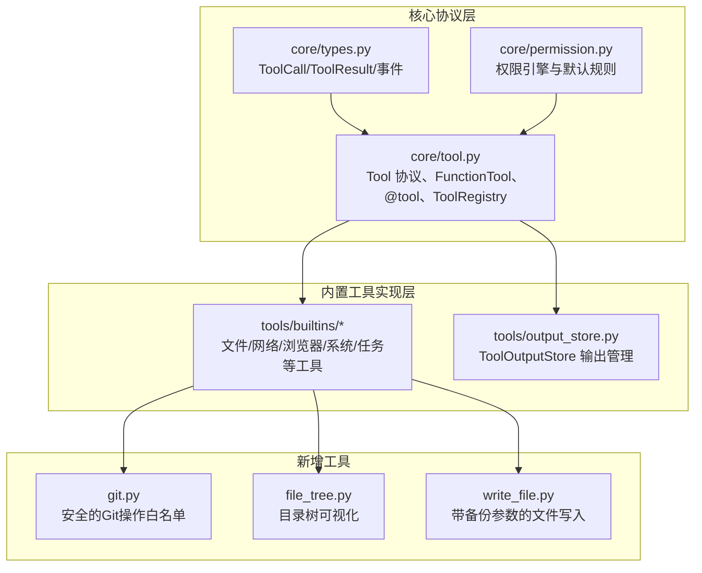
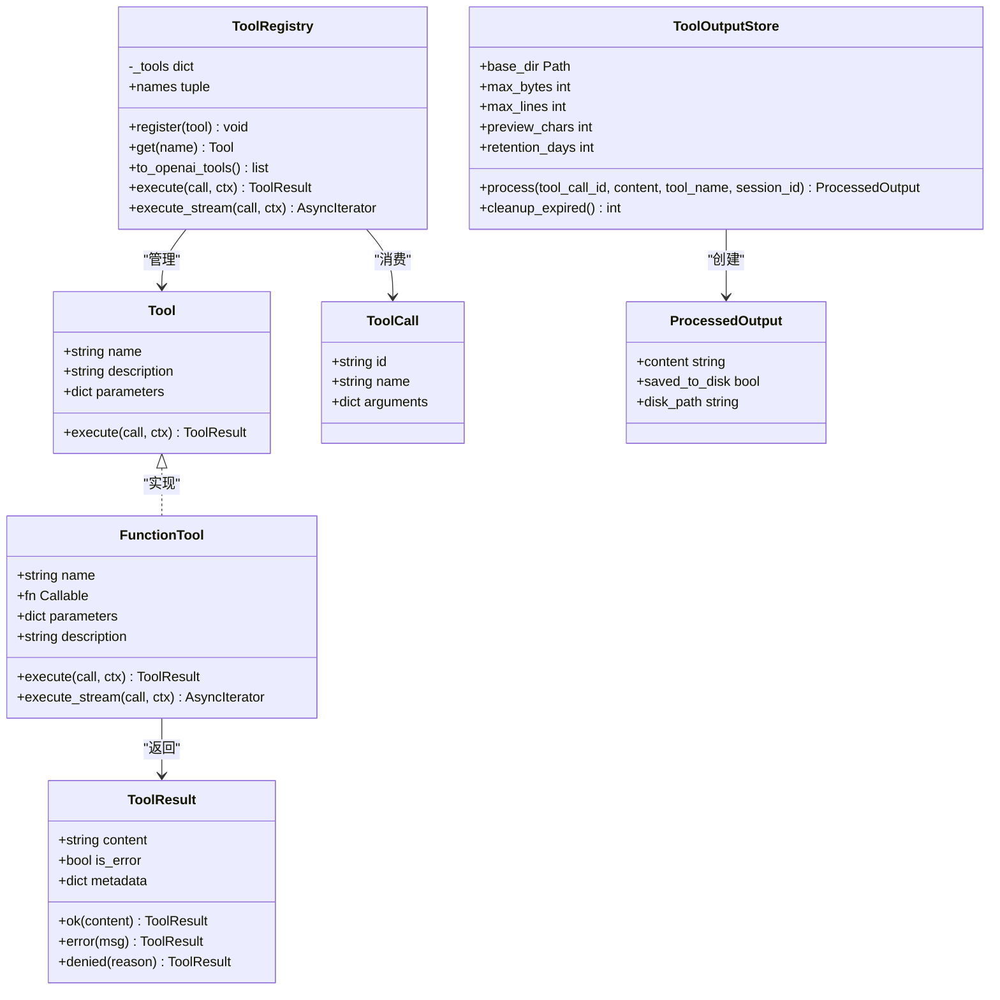
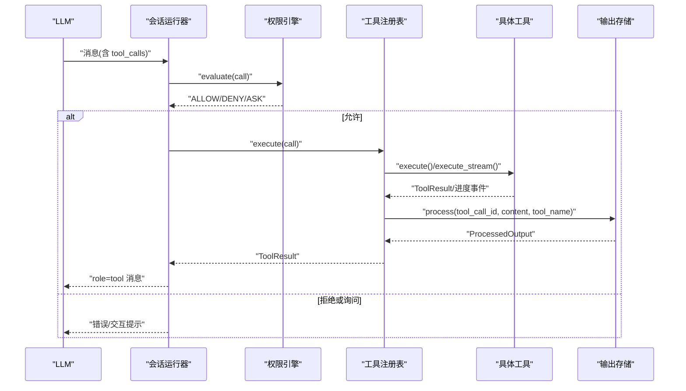
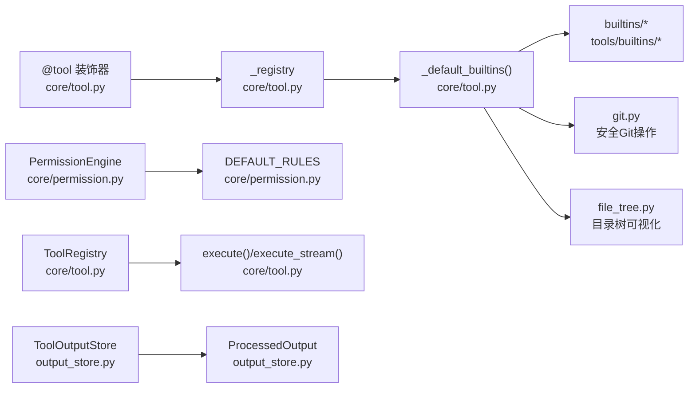

# 工具系统

<cite>
**本文引用的文件**
- [src/microagent/core/tool.py](file://src/microagent/core/tool.py)
- [src/microagent/core/types.py](file://src/microagent/core/types.py)
- [src/microagent/core/permission.py](file://src/microagent/core/permission.py)
- [src/microagent/tools/builtins/__init__.py](file://src/microagent/tools/builtins/__init__.py)
- [src/microagent/tools/builtins/read_file.py](file://src/microagent/tools/builtins/read_file.py)
- [src/microagent/tools/builtins/write_file.py](file://src/microagent/tools/builtins/write_file.py)
- [src/microagent/tools/builtins/edit_file.py](file://src/microagent/tools/builtins/edit_file.py)
- [src/microagent/tools/builtins/grep.py](file://src/microagent/tools/builtins/grep.py)
- [src/microagent/tools/builtins/glob.py](file://src/microagent/tools/builtins/glob.py)
- [src/microagent/tools/builtins/bash.py](file://src/microagent/tools/builtins/bash.py)
- [src/microagent/tools/builtins/browser.py](file://src/microagent/tools/builtins/browser.py)
- [src/microagent/tools/builtins/web_search.py](file://src/microagent/tools/builtins/web_search.py)
- [src/microagent/tools/builtins/web_fetch.py](file://src/microagent/tools/builtins/web_fetch.py)
- [src/microagent/tools/builtins/context7.py](file://src/microagent/tools/builtins/context7.py)
- [src/microagent/tools/builtins/execute_code.py](file://src/microagent/tools/builtins/execute_code.py)
- [src/microagent/tools/builtins/process.py](file://src/microagent/tools/builtins/process.py)
- [src/microagent/tools/builtins/task.py](file://src/microagent/tools/builtins/task.py)
- [src/microagent/tools/builtins/todo_plan_exit.py](file://src/microagent/tools/builtins/todo_plan_exit.py)
- [src/microagent/tools/builtins/session_search.py](file://src/microagent/tools/builtins/session_search.py)
- [src/microagent/tools/builtins/git.py](file://src/microagent/tools/builtins/git.py)
- [src/microagent/tools/builtins/file_tree.py](file://src/microagent/tools/builtins/file_tree.py)
- [src/microagent/tools/output_store.py](file://src/microagent/tools/output_store.py)
</cite>

## 更新摘要
**所做更改**
- 新增git工具章节，介绍安全的Git操作白名单机制
- 新增file_tree工具章节，介绍目录树可视化功能
- 更新write_file工具说明，增加backup参数描述
- 新增ToolOutputStore系统章节，介绍工具输出管理功能
- 更新架构总览图，包含新的组件
- 更新依赖关系分析，反映新工具的注册机制

## 目录
1. [简介](#简介)
2. [项目结构](#项目结构)
3. [核心组件](#核心组件)
4. [架构总览](#架构总览)
5. [详细组件分析](#详细组件分析)
6. [工具输出管理系统](#工具输出管理系统)
7. [依赖关系分析](#依赖关系分析)
8. [性能考虑](#性能考虑)
9. [故障排查指南](#故障排查指南)
10. [结论](#结论)
11. [附录：自定义工具开发指南与最佳实践](#附录自定义工具开发指南与最佳实践)

## 简介
本文件为 MicroAgent 的工具系统提供全面文档，涵盖工具协议、注册机制、内置工具的用法与参数说明、错误处理与安全策略，以及自定义工具开发与调用的最佳实践。读者无需深入源码即可理解并安全高效地使用工具系统。

**更新** 新增了git工具（安全的Git操作白名单）、file_tree工具（目录可视化）、write_file工具的备份参数，以及工具输出管理系统（ToolOutputStore）。

## 项目结构
MicroAgent 的工具系统由"核心协议层"和"内置工具实现层"组成：
- 核心协议层：定义 Tool 协议、FunctionTool 适配器、@tool 装饰器、ToolRegistry 注册表，以及统一的数据类型（ToolCall、ToolResult、事件流等）。
- 内置工具实现层：按功能分类的 Python 模块，每个模块通过 @tool 装饰器暴露一个或多个工具函数，自动完成参数校验、Schema 生成与注册。
- 输出管理层：ToolOutputStore 负责管理工具输出的大小限制和磁盘持久化。



**图表来源**
- [src/microagent/core/tool.py:1-362](file://src/microagent/core/tool.py#L1-L362)
- [src/microagent/core/types.py:1-189](file://src/microagent/core/types.py#L1-L189)
- [src/microagent/core/permission.py:1-213](file://src/microagent/core/permission.py#L1-L213)
- [src/microagent/tools/output_store.py:1-106](file://src/microagent/tools/output_store.py#L1-L106)

**章节来源**
- [src/microagent/core/tool.py:1-362](file://src/microagent/core/tool.py#L1-L362)
- [src/microagent/core/types.py:1-189](file://src/microagent/core/types.py#L1-L189)
- [src/microagent/core/permission.py:1-213](file://src/microagent/core/permission.py#L1-L213)

## 核心组件
- Tool 协议：所有工具必须满足该接口（名称、描述、参数 Schema、异步执行方法），采用结构化子类型，无需继承基类。
- FunctionTool 适配器：将普通异步函数包装成 Tool，支持非流式与流式两种执行模式；若函数返回 AsyncIterator[str]，则自动产生实时进度事件。
- @tool 装饰器：对异步函数进行装饰，自动推断 Pydantic v2 的 JSON Schema，并将工具注册到模块级注册表，便于后续统一发现与导出。
- ToolRegistry：集中管理工具集合，提供查找、导出 OpenAI tools 格式、统一执行与流式执行入口。
- 数据类型：ToolCall（调用）、ToolResult（结果）、ToolProgressDelta（流式进度）等，贯穿会话运行器与 LLM 客户端。



**图表来源**
- [src/microagent/core/tool.py:40-118](file://src/microagent/core/tool.py#L40-L118)
- [src/microagent/core/tool.py:282-310](file://src/microagent/core/tool.py#L282-L310)
- [src/microagent/core/types.py:76-116](file://src/microagent/core/types.py#L76-L116)
- [src/microagent/tools/output_store.py:20-78](file://src/microagent/tools/output_store.py#L20-L78)

**章节来源**
- [src/microagent/core/tool.py:1-362](file://src/microagent/core/tool.py#L1-L362)
- [src/microagent/core/types.py:1-189](file://src/microagent/core/types.py#L1-L189)

## 架构总览
工具系统的典型调用流程如下：
- LLM 请求包含 tool_calls（ToolCall 列表）。
- SessionRunner 解析调用，经 PermissionEngine 评估权限。
- ToolRegistry 根据名称查找工具并执行（支持流式与非流式）。
- ToolOutputStore 处理工具输出，对大输出进行磁盘持久化和预览。
- 工具返回 ToolResult，封装为 role=tool 的消息回传给 LLM。



**图表来源**
- [src/microagent/core/tool.py:256-280](file://src/microagent/core/tool.py#L256-L280)
- [src/microagent/core/permission.py:82-96](file://src/microagent/core/permission.py#L82-L96)
- [src/microagent/core/types.py:27-68](file://src/microagent/core/types.py#L27-L68)
- [src/microagent/tools/output_store.py:48-78](file://src/microagent/tools/output_store.py#L48-L78)

## 详细组件分析

### 文件操作工具
- read_file
  - 用途：按行读取文本文件内容，支持偏移与行数限制，自动检测二进制文件。
  - 参数：path（必填）、offset（起始行号，从1开始）、limit（最大行数）。
  - 返回：带行号的文本，空文件返回"(empty file)"，超出限制会截断提示。
  - 场景：查看代码片段、日志片段、配置文件等。
  - 参考路径：[read_file.py:14-54](file://src/microagent/tools/builtins/read_file.py#L14-L54)

- write_file
  - 用途：写入内容到文件，自动创建父目录，覆盖已存在文件。
  - 参数：path（必填）、content（必填）、backup（可选，默认为False，如果为True则在覆盖前创建.bak备份文件）。
  - 返回：写入字节数与目标路径。
  - 场景：生成报告、保存中间结果、写配置文件。
  - **更新** 新增backup参数，支持在覆盖前自动创建备份文件。
  - 参考路径：[write_file.py:14-37](file://src/microagent/tools/builtins/write_file.py#L14-L37)

- edit_file
  - 用途：在文件中查找并替换字符串，支持全部替换或仅首次替换。
  - 参数：path（必填）、old_string（必填）、new_string（必填）、replace_all（可选）。
  - 返回：替换次数与目标路径；未找到匹配时返回错误。
  - 场景：批量替换变量名、修正配置项。
  - 参考路径：[edit_file.py:14-48](file://src/microagent/tools/builtins/edit_file.py#L14-L48)

- grep
  - 用途：基于正则表达式搜索文件内容，返回匹配行及行号，支持 glob 过滤与结果上限。
  - 参数：pattern（必填）、path（可选，默认当前目录）、glob（可选，默认 **/*）、max_results（可选）。
  - 返回：匹配行列表，无匹配返回"(no matches)"。
  - 场景：定位 bug、审计代码、检索关键词。
  - 参考路径：[grep.py:16-64](file://src/microagent/tools/builtins/grep.py#L16-L64)

- glob
  - 用途：按 glob 模式查找文件，返回排序后的路径列表，支持结果上限。
  - 参数：pattern（必填）、path（可选）、max_results（可选）。
  - 返回：文件路径列表，无结果返回"(no files found)"。
  - 场景：列举测试用例、扫描特定后缀文件。
  - 参考路径：[glob.py:14-38](file://src/microagent/tools/builtins/glob.py#L14-L38)

### Git工具
- git
  - 用途：执行安全的Git子命令，仅允许白名单中的只读操作和部分写操作。
  - 参数：subcommand（必填，允许的subcommand包括status、diff、log、show、branch、commit、add）、repo_path（可选，默认"."）、args（可选，传递给subcommand的额外参数）。
  - 返回：Git命令输出；不允许的subcommand返回错误；命令失败返回错误信息。
  - 安全机制：通过白名单限制可执行的Git子命令，阻止危险的push、reset、force-push等操作。
  - 场景：查看仓库状态、差异比较、提交历史、分支信息等安全操作。
  - 参考路径：[git.py:17-66](file://src/microagent/tools/builtins/git.py#L17-L66)

**章节来源**
- [src/microagent/tools/builtins/read_file.py:14-54](file://src/microagent/tools/builtins/read_file.py#L14-L54)
- [src/microagent/tools/builtins/write_file.py:14-37](file://src/microagent/tools/builtins/write_file.py#L14-L37)
- [src/microagent/tools/builtins/edit_file.py:14-48](file://src/microagent/tools/builtins/edit_file.py#L14-L48)
- [src/microagent/tools/builtins/grep.py:16-64](file://src/microagent/tools/builtins/grep.py#L16-L64)
- [src/microagent/tools/builtins/glob.py:14-38](file://src/microagent/tools/builtins/glob.py#L14-L38)
- [src/microagent/tools/builtins/git.py:17-66](file://src/microagent/tools/builtins/git.py#L17-L66)

### 目录树可视化工具
- file_tree
  - 用途：显示目录树结构，帮助理解项目布局。
  - 参数：path（可选，默认"."，根目录路径）、max_depth（可选，默认3，范围1-10，最大遍历深度）。
  - 返回：格式化的目录树文本；路径不存在或非目录返回错误。
  - 特性：自动忽略常见的构建目录（__pycache__、.git、node_modules等），限制输出大小为10KB。
  - 场景：快速了解项目结构、导航大型代码库。
  - 参考路径：[file_tree.py:20-71](file://src/microagent/tools/builtins/file_tree.py#L20-L71)

**章节来源**
- [src/microagent/tools/builtins/file_tree.py:20-71](file://src/microagent/tools/builtins/file_tree.py#L20-L71)

### 网络工具
- web_search
  - 用途：通过 DuckDuckGo lite HTML 进行网页搜索，返回标题、URL、摘要。
  - 参数：query（必填）、max_results（可选，上限20）。
  - 返回：格式化搜索结果文本，无结果返回"(no results)"。
  - 场景：快速知识检索、获取外部信息。
  - 参考路径：[web_search.py:18-54](file://src/microagent/tools/builtins/web_search.py#L18-L54)

- web_fetch
  - 用途：抓取 URL 文本内容，具备 SSRF 防护（禁止内网/本地主机、私有 IP、不支持协议）。
  - 参数：url（必填）、timeout（可选，秒）。
  - 返回：文本内容（超过阈值会截断），HTTP 错误会返回状态码与原因。
  - 场景：拉取文档、API 响应、网页正文。
  - 参考路径：[web_fetch.py:13-92](file://src/microagent/tools/builtins/web_fetch.py#L13-L92)

- context7
  - 用途：调用 Context7 API 获取库/框架的最新文档片段。
  - 参数：query（必填）、library（可选）、max_results（可选，上限10）。
  - 返回：格式化文档片段列表。
  - 场景：查询 API 用法、配置示例、最佳实践。
  - 参考路径：[context7.py:17-54](file://src/microagent/tools/builtins/context7.py#L17-L54)

**章节来源**
- [src/microagent/tools/builtins/web_search.py:18-54](file://src/microagent/tools/builtins/web_search.py#L18-L54)
- [src/microagent/tools/builtins/web_fetch.py:13-92](file://src/microagent/tools/builtins/web_fetch.py#L13-L92)
- [src/microagent/tools/builtins/context7.py:17-54](file://src/microagent/tools/builtins/context7.py#L17-L54)

### 浏览器自动化工具
- browser_navigate
  - 用途：打开 URL，初始化页面并返回标题与 URL。
  - 参数：url（必填）。
  - 返回：页面标题与 URL 文本。
  - 场景：启动自动化浏览流程的第一步。
  - 参考路径：[browser.py:81-100](file://src/microagent/tools/builtins/browser.py#L81-L100)

- browser_snapshot
  - 用途：提取当前页面的可见文本与交互元素，限制长度。
  - 参数：无。
  - 返回：页面文本快照。
  - 场景：获取页面内容进行分析或决策。
  - 参考路径：[browser.py:103-136](file://src/microagent/tools/builtins/browser.py#L103-L136)

- browser_click
  - 用途：通过 CSS 选择器或文本点击元素，等待网络空闲后返回新标题。
  - 参数：ref（必填，CSS 选择器或链接文本）。
  - 返回：点击结果与新页面标题。
  - 场景：表单提交、导航跳转。
  - 参考路径：[browser.py:139-161](file://src/microagent/tools/builtins/browser.py#L139-L161)

- browser_type
  - 用途：向输入框填写文本。
  - 参数：ref（必填，CSS 选择器）、text（必填）。
  - 返回：填写结果。
  - 场景：登录、搜索输入。
  - 参考路径：[browser.py:164-179](file://src/microagent/tools/builtins/browser.py#L164-L179)

**章节来源**
- [src/microagent/tools/builtins/browser.py:81-179](file://src/microagent/tools/builtins/browser.py#L81-L179)

### 系统交互工具
- bash
  - 用途：执行 shell 命令，合并 stdout/stderr，支持超时与输出大小限制。
  - 参数：command（必填）、timeout（可选，秒）。
  - 返回：命令输出；非零退出码返回错误；超时返回部分输出。
  - 场景：运行脚本、调用 CLI、系统维护。
  - 参考路径：[bash.py:14-57](file://src/microagent/tools/builtins/bash.py#L14-L57)

- process
  - 用途：后台进程管理（start/poll/log/kill/wait/list/write），使用上下文隔离存储进程状态。
  - 参数：action（必填）、command（start 时必填）、session_id（poll/kill/wait/list/write 时必填）、data（write 时必填）、timeout（wait 时可选）。
  - 返回：各动作对应的状态或输出；未知动作返回错误。
  - 场景：长期任务监控、交互式程序通信。
  - 参考路径：[process.py:67-179](file://src/microagent/tools/builtins/process.py#L67-L179)

- execute_code
  - 用途：在独立子进程中执行 Python 代码，支持超时，仅标准库可用。
  - 参数：code（必填）、timeout（可选，秒）。
  - 返回：stdout 文本；非零退出码返回错误。
  - 场景：数据计算、临时脚本执行。
  - 参考路径：[execute_code.py:17-60](file://src/microagent/tools/builtins/execute_code.py#L17-L60)

**章节来源**
- [src/microagent/tools/builtins/bash.py:14-57](file://src/microagent/tools/builtins/bash.py#L14-L57)
- [src/microagent/tools/builtins/process.py:67-179](file://src/microagent/tools/builtins/process.py#L67-L179)
- [src/microagent/tools/builtins/execute_code.py:17-60](file://src/microagent/tools/builtins/execute_code.py#L17-L60)

### 任务管理工具
- task
  - 用途：派生子代理执行任务，隔离上下文与预算，仅返回最终文本结果。
  - 参数：goal（必填）、subagent_type（可选，"explore"或"general"）、context（可选）。
  - 返回：子代理的最终结果文本。
  - 场景：复杂任务分解、并行探索。
  - 参考路径：[task.py:28-53](file://src/microagent/tools/builtins/task.py#L28-L53)

- todo
  - 用途：内存中的待办清单管理（list/add/update/remove），会话级隔离。
  - 参数：action（必填）、item_id（update/remove 时必填）、content（add/update 时必填）、status（可选）。
  - 返回：操作结果或清单。
  - 场景：任务跟踪、步骤管理。
  - 参考路径：[todo_plan_exit.py:56-98](file://src/microagent/tools/builtins/todo_plan_exit.py#L56-L98)

- plan
  - 用途：多步计划管理（show/set/clear），不执行，仅记录。
  - 参数：action（必填）、steps（set 时必填）。
  - 返回：计划内容或操作确认。
  - 场景：规划工作流、分步指导。
  - 参考路径：[todo_plan_exit.py:106-130](file://src/microagent/tools/builtins/todo_plan_exit.py#L106-L130)

- exit
  - 用途：标记任务完成，结束会话。
  - 参数：无。
  - 返回：会话退出信号。
  - 场景：任务收尾。
  - 参考路径：[todo_plan_exit.py:138-140](file://src/microagent/tools/builtins/todo_plan_exit.py#L138-L140)

**章节来源**
- [src/microagent/tools/builtins/task.py:28-53](file://src/microagent/tools/builtins/task.py#L28-L53)
- [src/microagent/tools/builtins/todo_plan_exit.py:56-140](file://src/microagent/tools/builtins/todo_plan_exit.py#L56-L140)

### 会话搜索工具
- session_search
  - 用途：搜索历史会话消息，返回角色与内容摘要。
  - 参数：query（必填）、k（可选，上限20）。
  - 返回：匹配消息列表；无匹配返回提示。
  - 场景：回溯上下文、复用历史信息。
  - 参考路径：[session_search.py:20-45](file://src/microagent/tools/builtins/session_search.py#L20-L45)

**章节来源**
- [src/microagent/tools/builtins/session_search.py:20-45](file://src/microagent/tools/builtins/session_search.py#L20-L45)

## 工具输出管理系统

### ToolOutputStore概述
ToolOutputStore 是一个全局工具输出大小管理系统，负责处理大输出内容的管理和持久化。它提供了严格的输出限制和智能的磁盘存储机制，确保系统不会因为过大的输出而耗尽内存。

### 核心特性
- **大小限制**：50KB硬限制 + 2000行限制
- **预览机制**：头尾各500字符预览，中间用省略号替代
- **磁盘持久化**：大输出自动保存到磁盘，避免内存溢出
- **自动清理**：支持过期文件的定期清理（默认7天保留期）

### 使用方式
```python
from microagent.tools.output_store import ToolOutputStore
from pathlib import Path

# 创建输出存储实例
store = ToolOutputStore(base_dir=Path.home() / ".microagent" / "tool_outputs")

# 处理工具输出
result = store.process(
    tool_call_id="call_123",
    content="工具输出内容",
    tool_name="bash",
    session_id="default"
)

# 检查结果
if result.saved_to_disk:
    print(f"输出已保存到: {result.disk_path}")
    print(f"预览内容: {result.content[:100]}...")
else:
    print(f"直接返回内容: {result.content}")
```

### 配置选项
- `base_dir`: 基础目录（默认 `~/.microagent/tool_outputs`）
- `max_bytes`: 最大字节数（默认 50,000）
- `max_lines`: 最大行数（默认 2,000）
- `preview_chars`: 预览字符数（默认 500）
- `retention_days`: 保留天数（默认 7）

### 输出格式
当输出超过限制时，ToolOutputStore 会生成如下格式的预览：
```
[前500字符内容]

... [总字符数 字符, 总行数 行 — 完整输出已保存到 /path/to/file.txt]

[后500字符内容]
```

**章节来源**
- [src/microagent/tools/output_store.py:1-106](file://src/microagent/tools/output_store.py#L1-L106)

## 依赖关系分析
- 工具注册与发现：@tool 装饰器将工具函数注册到模块级 _registry，_default_builtins() 通过导入 builtins 子模块触发副作用，收集所有工具。
- 权限控制：PermissionEngine 基于规则（工具名模式 + 参数约束）评估 ALLOW/DENY/ASK，默认策略 DENY。
- 类型与事件：ToolCall/ToolResult/ToolProgressDelta 等贯穿调用链，确保一致的数据交换格式。
- **更新** 新增git和file_tree工具的自动注册机制。



**图表来源**
- [src/microagent/core/tool.py:282-310](file://src/microagent/core/tool.py#L282-L310)
- [src/microagent/core/permission.py:189-212](file://src/microagent/core/permission.py#L189-L212)
- [src/microagent/tools/output_store.py:20-78](file://src/microagent/tools/output_store.py#L20-L78)

**章节来源**
- [src/microagent/core/tool.py:282-310](file://src/microagent/core/tool.py#L282-L310)
- [src/microagent/core/permission.py:189-212](file://src/microagent/core/permission.py#L189-L212)

## 性能考虑
- 流式执行：对于耗时工具（如 bash、process、browser_*），优先使用流式接口以实时反馈进度，避免长时间阻塞。
- 资源限制：bash 与 execute_code 设置超时与输出上限，防止 OOM 与无限输出；web_fetch 限制抓取内容与超时。
- 并发隔离：process、browser、todo_plan、session_search 使用 ContextVar 实现会话级隔离，避免跨会话污染。
- I/O 优化：read_file/grep 跳过二进制文件，减少无效解析；web_search/context7 使用轻量 HTTP 客户端与合理超时。
- **更新** ToolOutputStore 提供智能的输出大小管理，避免大输出导致的内存问题。

## 故障排查指南
- 常见错误类型：
  - 文件不存在或非文件：read_file/edit_file 返回错误。
  - 正则表达式无效：grep 捕获 re.error 并返回错误。
  - 网络不可达或协议不支持：web_fetch/web_search 返回 HTTP 错误或协议限制。
  - 浏览器未初始化：browser_* 在未 navigate 时报错。
  - 子进程超时或失败：bash/execute_code/process 返回超时或退出码错误。
  - 权限拒绝：PermissionEngine 未匹配规则时默认 DENY。
  - **新增** Git子命令不被允许：git工具检查白名单，非法subcommand返回错误。
  - **新增** 路径不存在或非目录：file_tree工具验证路径有效性。
- 调试建议：
  - 检查工具参数是否符合 Field 约束（ge/le/必填）。
  - 查看 ToolResult.is_error 与 content 中的错误信息。
  - 对网络工具启用更详细的日志（httpx 异常信息）。
  - 对浏览器工具先调用 snapshot 确认页面状态。
  - 对进程工具使用 poll/list 观察状态变化。
  - **新增** 对git工具检查subcommand是否在白名单中。
  - **新增** 对file_tree工具验证路径存在性和目录属性。

**章节来源**
- [src/microagent/tools/builtins/read_file.py:22-34](file://src/microagent/tools/builtins/read_file.py#L22-L34)
- [src/microagent/tools/builtins/grep.py:25-28](file://src/microagent/tools/builtins/grep.py#L25-L28)
- [src/microagent/tools/builtins/web_fetch.py:18-43](file://src/microagent/tools/builtins/web_fetch.py#L18-L43)
- [src/microagent/tools/builtins/browser.py:85-100](file://src/microagent/tools/builtins/browser.py#L85-L100)
- [src/microagent/tools/builtins/bash.py:21-40](file://src/microagent/tools/builtins/bash.py#L21-L40)
- [src/microagent/core/permission.py:82-96](file://src/microagent/core/permission.py#L82-L96)
- [src/microagent/tools/builtins/git.py:38-42](file://src/microagent/tools/builtins/git.py#L38-L42)
- [src/microagent/tools/builtins/file_tree.py:29-32](file://src/microagent/tools/builtins/file_tree.py#L29-L32)

## 结论
MicroAgent 的工具系统以简洁的协议与强大的适配器为核心，结合严格的权限控制与丰富的内置工具，为智能体提供了安全、可扩展且高性能的外部能力接入方式。通过统一的类型与事件模型，工具调用过程透明可控，适合构建复杂的自动化工作流。

**更新** 新增的git工具提供了安全的Git操作环境，file_tree工具增强了项目结构可视化能力，write_file工具的备份功能提高了数据安全性，ToolOutputStore系统有效管理了大输出内容的存储和访问。这些改进进一步增强了工具系统的安全性和实用性。

## 附录：自定义工具开发指南与最佳实践

### 工具定义与注册
- 使用 @tool 装饰器声明工具函数，函数签名中的类型注解与 Field 元数据会被自动转换为 OpenAI 兼容的 JSON Schema。
- 函数应为 async def，返回 ToolResult 或任意可被序列化的值（将被包装为 ToolResult.ok）。
- 如需流式输出，返回 AsyncIterator[str]，框架会自动将每次 yield 的内容转为 ToolProgressDelta。

**章节来源**
- [src/microagent/core/tool.py:177-213](file://src/microagent/core/tool.py#L177-L213)
- [src/microagent/core/tool.py:60-118](file://src/microagent/core/tool.py#L60-L118)

### 参数验证与 Schema 推断
- 使用 Annotated[T, Field(...)] 标注参数，Field 支持 description、ge、le、const 等约束。
- 必填参数通过无默认值声明；可选参数提供默认值。
- 框架通过 create_model 动态生成 Pydantic 模型并导出 JSON Schema。

**章节来源**
- [src/microagent/core/tool.py:125-166](file://src/microagent/core/tool.py#L125-L166)

### 错误处理与返回值
- 始终返回 ToolResult.ok 或 ToolResult.error；必要时使用 ToolResult.denied 表示权限拒绝。
- 对可能抛出的异常进行捕获并转化为 ToolResult.error，保证调用链稳定。

**章节来源**
- [src/microagent/core/types.py:97-116](file://src/microagent/core/types.py#L97-L116)

### 权限配置
- 通过 PermissionEngine 的规则列表控制工具访问；规则按顺序匹配，首个命中生效。
- 可使用 ASK 决策配合 ask_callback 实现交互式授权。
- 默认规则 DEFAULT_RULES 已开放常用工具，可按需调整。

**章节来源**
- [src/microagent/core/permission.py:71-116](file://src/microagent/core/permission.py#L71-L116)
- [src/microagent/core/permission.py:189-212](file://src/microagent/core/permission.py#L189-L212)

### 安全考虑
- 网络工具：web_fetch 严格限制协议与主机/IP，防止 SSRF；web_search 使用受限的轻量接口。
- 系统工具：bash/execute_code 设置超时与输出上限，避免资源耗尽；process 使用会话隔离。
- 浏览器工具：Playwright 实例共享但页面状态隔离，避免跨会话干扰。
- 文件工具：read_file 检测二进制文件，edit_file 要求明确匹配以避免误替换。
- **新增** Git工具：通过白名单机制限制可执行的Git子命令，防止危险操作。
- **新增** 输出管理：ToolOutputStore 提供大输出限制和磁盘持久化，避免内存溢出。

**章节来源**
- [src/microagent/tools/builtins/web_fetch.py:18-68](file://src/microagent/tools/builtins/web_fetch.py#L18-L68)
- [src/microagent/tools/builtins/bash.py:19-40](file://src/microagent/tools/builtins/bash.py#L19-L40)
- [src/microagent/tools/builtins/execute_code.py:33-48](file://src/microagent/tools/builtins/execute_code.py#L33-L48)
- [src/microagent/tools/builtins/browser.py:63-79](file://src/microagent/tools/builtins/browser.py#L63-79)
- [src/microagent/tools/builtins/read_file.py:29-34](file://src/microagent/tools/builtins/read_file.py#L29-L34)
- [src/microagent/tools/builtins/git.py:17-25](file://src/microagent/tools/builtins/git.py#L17-L25)
- [src/microagent/tools/output_store.py:14-17](file://src/microagent/tools/output_store.py#L14-L17)

### 工具调用的最佳实践
- 优先使用流式接口提升用户体验（长耗时任务）。
- 合理设置超时与上限，避免资源滥用。
- 对敏感操作（写文件、执行代码、网络请求）启用权限规则与最小化授权。
- 使用 session_search 与 todo/plan 增强上下文管理与任务追踪。
- 对浏览器自动化流程，先 navigate，再 snapshot，最后 click/type，确保状态正确。
- **新增** 使用git工具时严格遵守白名单限制，避免危险操作。
- **新增** 利用file_tree工具快速了解项目结构，提高导航效率。
- **新增** 合理使用write_file的backup参数保护重要文件。
- **新增** 关注ToolOutputStore的输出限制，处理大输出时使用预览功能。

**章节来源**
- [src/microagent/core/tool.py:81-118](file://src/microagent/core/tool.py#L81-118)
- [src/microagent/tools/builtins/todo_plan_exit.py:56-140](file://src/microagent/tools/builtins/todo_plan_exit.py#L56-L140)
- [src/microagent/tools/builtins/session_search.py:20-45](file://src/microagent/tools/builtins/session_search.py#L20-L45)
- [src/microagent/tools/builtins/browser.py:81-179](file://src/microagent/tools/builtins/browser.py#L81-L179)
- [src/microagent/tools/builtins/git.py:28-32](file://src/microagent/tools/builtins/git.py#L28-L32)
- [src/microagent/tools/builtins/file_tree.py:20-23](file://src/microagent/tools/builtins/file_tree.py#L20-L23)
- [src/microagent/tools/builtins/write_file.py:14-21](file://src/microagent/tools/builtins/write_file.py#L14-L21)
- [src/microagent/tools/output_store.py:48-78](file://src/microagent/tools/output_store.py#L48-L78)