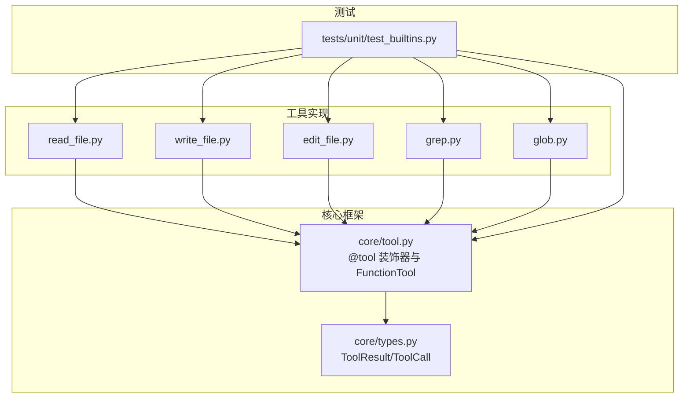
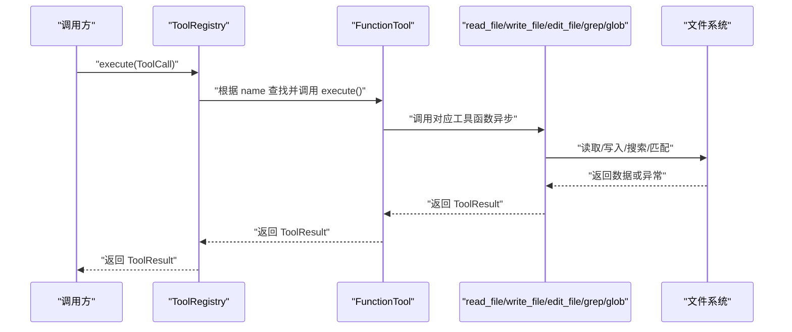
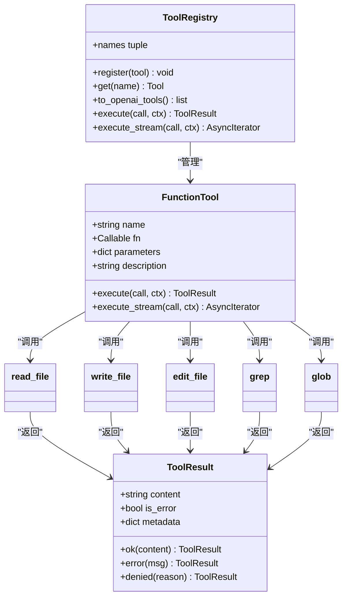

# 文件操作工具

<cite>
**本文引用的文件**   
- [read_file.py](file://src/microagent/tools/builtins/read_file.py)
- [write_file.py](file://src/microagent/tools/builtins/write_file.py)
- [edit_file.py](file://src/microagent/tools/builtins/edit_file.py)
- [grep.py](file://src/microagent/tools/builtins/grep.py)
- [glob.py](file://src/microagent/tools/builtins/glob.py)
- [types.py](file://src/microagent/core/types.py)
- [tool.py](file://src/microagent/core/tool.py)
- [test_builtins.py](file://tests/unit/test_builtins.py)
</cite>

## 目录
1. [简介](#简介)
2. [项目结构](#项目结构)
3. [核心组件](#核心组件)
4. [架构总览](#架构总览)
5. [详细组件分析](#详细组件分析)
6. [依赖关系分析](#依赖关系分析)
7. [性能考量](#性能考量)
8. [故障排查指南](#故障排查指南)
9. [结论](#结论)
10. [附录：参数与示例速查](#附录参数与示例速查)

## 简介
本文件为 MicroAgent 的文件操作工具组提供全面文档，覆盖以下内置工具：
- read_file：按行读取文件内容，支持偏移、限制、二进制检测与 UTF-8 容错解码。
- write_file：写入文本到文件，自动创建父目录，覆盖已有文件。
- edit_file：在文件中查找并替换字符串，支持“仅首次”或“全部替换”模式。
- grep：基于正则表达式搜索文件内容，支持单文件或目录递归搜索、结果数量限制。
- glob：基于通配符模式匹配查找文件，支持路径过滤与结果截断。

每个工具均包含参数说明、使用示例、错误处理与最佳实践建议，帮助开发者与使用者高效、安全地操作文件系统。

## 项目结构
文件操作工具位于 src/microagent/tools/builtins/ 目录下，通过统一的 @tool 装饰器注册为可执行工具，并由 ToolRegistry 统一调度。核心类型 ToolResult 用于返回成功或错误信息。

图表来源
- [tool.py:177-213](file://src/microagent/core/tool.py#L177-L213)
- [types.py:97-116](file://src/microagent/core/types.py#L97-L116)
- [read_file.py:14-21](file://src/microagent/tools/builtins/read_file.py#L14-L21)
- [write_file.py:14-20](file://src/microagent/tools/builtins/write_file.py#L14-L20)
- [edit_file.py:14-22](file://src/microagent/tools/builtins/edit_file.py#L14-L22)
- [grep.py:16-24](file://src/microagent/tools/builtins/grep.py#L16-L24)
- [glob.py:14-19](file://src/microagent/tools/builtins/glob.py#L14-L19)
- [test_builtins.py:14-163](file://tests/unit/test_builtins.py#L14-L163)

章节来源
- [tool.py:177-213](file://src/microagent/core/tool.py#L177-L213)
- [types.py:97-116](file://src/microagent/core/types.py#L97-L116)

## 核心组件
- ToolResult：统一的结果封装，包含 content、is_error、metadata。提供 ok() 与 error() 便捷构造方法。
- @tool 装饰器：将异步函数包装为 FunctionTool，自动生成 OpenAI 兼容的 JSON Schema，并注册到模块级 _registry。
- FunctionTool.execute：调用被装饰的异步函数，若返回 ToolResult 则直接返回，否则包装为 ToolResult.ok。

章节来源
- [types.py:97-116](file://src/microagent/core/types.py#L97-L116)
- [tool.py:177-213](file://src/microagent/core/tool.py#L177-L213)
- [tool.py:75-79](file://src/microagent/core/tool.py#L75-L79)

## 架构总览
下图展示了从 LLM 发起工具调用到具体文件操作的完整流程。

图表来源
- [tool.py:256-280](file://src/microagent/core/tool.py#L256-L280)
- [types.py:97-116](file://src/microagent/core/types.py#L97-L116)

## 详细组件分析

### read_file：按行读取文件
- 功能概述
  - 解析路径（展开 ~、绝对化），校验存在性与是否为文件。
  - 以二进制方式读取进行二进制检测（包含空字节视为二进制）。
  - 使用 UTF-8 解码，非法字符替换策略避免崩溃。
  - 按行分割后支持 offset（起始行号，1 基）与 limit（最大行数）分页。
  - 输出带行号格式化文本；若未显示完所有行，追加截断提示。
  - 空文件返回“(empty file)”。

- 参数说明
  - path：要读取的文件路径（必填）。
  - offset：起始行号，≥1（默认 1）。
  - limit：最大读取行数，1–2000（默认 500）。

- 使用示例
  - 读取某文件的第 10 行至第 20 行：offset=10, limit=11。
  - 读取整个文件（不设置 limit 时默认 500 行，超出会截断）。

- 错误处理
  - 文件不存在：返回错误消息。
  - 路径不是文件：返回错误消息。
  - 二进制文件：返回错误消息。
  - 解码失败：采用替换策略继续处理。

- 大文件读取优化
  - 先读二进制再判断是否含空字节，避免对大二进制文件进行文本解码。
  - 通过 splitlines 与切片实现内存友好的分页读取。
  - 限制最大行数防止输出过大。

- 最佳实践
  - 对于超大文件，优先使用 offset/limit 分页读取。
  - 遇到编码问题，确认源文件是否为 UTF-8；必要时在外部预处理。
  - 不要对二进制文件使用该工具。

章节来源
- [read_file.py:14-54](file://src/microagent/tools/builtins/read_file.py#L14-L54)
- [types.py:97-116](file://src/microagent/core/types.py#L97-L116)

### write_file：写入文件
- 功能概述
  - 解析路径（展开 ~、绝对化），自动创建父目录（parents=True, exist_ok=True）。
  - 写入文本内容，如文件已存在则覆盖。
  - 返回写入字节数与目标路径摘要。

- 参数说明
  - path：要写入的文件路径（必填）。
  - content：要写入的文本内容（必填）。

- 使用示例
  - 写入新文件：path="output/data.txt", content="hello"。
  - 写入嵌套目录：path="a/b/c/file.txt"，会自动创建 a/b/c。

- 错误处理
  - 捕获 IO 异常并返回错误消息。
  - 权限不足等系统错误会被捕获并上报。

- 原子写入与一致性
  - 当前实现为非原子写入（直接写文本）。如需强一致，可在上层逻辑中先写入临时文件再原子替换。

- 最佳实践
  - 写入前确保路径合法且具备写权限。
  - 对关键文件，建议在应用层实现“先写临时文件 + os.replace”的原子更新策略。

章节来源
- [write_file.py:14-30](file://src/microagent/tools/builtins/write_file.py#L14-L30)
- [types.py:97-116](file://src/microagent/core/types.py#L97-L116)

### edit_file：查找并替换
- 功能概述
  - 读取文件文本，统计 old_string 出现次数。
  - 若 replace_all=False 且出现次数 >1，返回错误提示用户明确意图。
  - 若 replace_all=True，替换所有匹配项；否则仅替换第一次匹配。
  - 写回文件并返回实际替换次数。

- 参数说明
  - path：要编辑的文件路径（必填）。
  - old_string：要查找的文本（必填）。
  - new_string：替换文本（必填）。
  - replace_all：是否替换所有匹配项（默认 False）。

- 使用示例
  - 仅替换第一个匹配：replace_all=False（默认）。
  - 替换所有匹配：replace_all=True。

- 错误处理
  - 文件不存在：返回错误消息。
  - 未找到 old_string：返回错误消息。
  - 多匹配但未开启 replace_all：返回错误消息，提示更精确的 old_string 或启用 replace_all。

- 语法高亮
  - 该工具不涉及语法高亮，仅进行纯文本替换。

- 最佳实践
  - 对多匹配场景，尽量使 old_string 更具体以避免歧义。
  - 批量替换前建议先用 grep 验证匹配范围。

章节来源
- [edit_file.py:14-49](file://src/microagent/tools/builtins/edit_file.py#L14-L49)
- [types.py:97-116](file://src/microagent/core/types.py#L97-L116)

### grep：正则搜索
- 功能概述
  - 编译正则表达式，校验合法性。
  - 支持单文件或目录搜索；目录模式下按 glob 模式筛选文件。
  - 跳过二进制文件（包含空字节）。
  - 逐行匹配，输出格式为“相对路径:行号: 内容”，支持 max_results 限制。
  - 无匹配时返回“(no matches)”。

- 参数说明
  - pattern：正则表达式（必填）。
  - path：搜索路径，文件或目录（默认 "."）。
  - glob：文件名匹配模式（默认 "**/*"）。
  - max_results：最大匹配结果数（1–500，默认 50）。

- 使用示例
  - 在目录中搜索 *.py 文件包含特定关键字：pattern="keyword", path="./src", glob="*.py"。
  - 限定最多返回 20 条结果：max_results=20。

- 上下文显示
  - 当前实现仅输出匹配行本身，不包含前后上下文。

- 错误处理
  - 正则表达式无效：返回错误消息。
  - 路径不存在：返回错误消息。
  - 读取异常：忽略该文件继续扫描。

- 最佳实践
  - 使用更具体的正则以减少误匹配。
  - 对大型目录，合理设置 glob 与 max_results 控制性能与输出规模。

章节来源
- [grep.py:16-65](file://src/microagent/tools/builtins/grep.py#L16-L65)
- [types.py:97-116](file://src/microagent/core/types.py#L97-L116)

### glob：模式匹配查找文件
- 功能概述
  - 基于 Path.glob 进行模式匹配，返回排序后的文件路径列表。
  - 支持通配符与递归（如 "**/*.py"）。
  - 当结果超过 max_results 时进行截断并提示。

- 参数说明
  - pattern：通配符模式（必填）。
  - path：基础目录（默认 "."）。
  - max_results：最大返回文件数（1–1000，默认 100）。

- 使用示例
  - 查找所有 Python 文件：pattern="**/*.py"。
  - 限制返回 50 个结果：max_results=50。

- 错误处理
  - 路径不存在：返回错误消息。
  - 无匹配文件：返回“(no files found)”。

- 最佳实践
  - 使用尽可能具体的 pattern 减少扫描范围。
  - 对大规模目录，结合 max_results 控制输出大小。

章节来源
- [glob.py:14-39](file://src/microagent/tools/builtins/glob.py#L14-L39)
- [types.py:97-116](file://src/microagent/core/types.py#L97-L116)

## 依赖关系分析
- 工具实现依赖 core.types.ToolResult 作为统一返回类型。
- 所有工具通过 @tool 装饰器注册为 FunctionTool，由 ToolRegistry 统一管理。
- 测试用例通过 ToolRegistry 与 _default_builtins 发现并执行工具。

图表来源
- [types.py:97-116](file://src/microagent/core/types.py#L97-L116)
- [tool.py:60-118](file://src/microagent/core/tool.py#L60-L118)
- [tool.py:221-280](file://src/microagent/core/tool.py#L221-L280)
- [read_file.py:14-21](file://src/microagent/tools/builtins/read_file.py#L14-L21)
- [write_file.py:14-20](file://src/microagent/tools/builtins/write_file.py#L14-L20)
- [edit_file.py:14-22](file://src/microagent/tools/builtins/edit_file.py#L14-L22)
- [grep.py:16-24](file://src/microagent/tools/builtins/grep.py#L16-L24)
- [glob.py:14-19](file://src/microagent/tools/builtins/glob.py#L14-L19)

章节来源
- [tool.py:221-280](file://src/microagent/core/tool.py#L221-L280)
- [types.py:97-116](file://src/microagent/core/types.py#L97-L116)

## 性能考量
- read_file
  - 二进制检测通过一次性读取字节并检查空字节，避免对大二进制文件进行文本解码。
  - 使用 splitlines 与切片实现分页，限制最大行数防止内存与输出膨胀。
- write_file
  - 直接写入文本，IO 开销与文件大小线性相关。
  - 如需更高一致性，应在上层实现“临时文件 + 原子替换”的策略。
- edit_file
  - 全量读取文本后进行替换，适合中小文件；超大文件建议分块处理或在应用层优化。
- grep
  - 对每个文件先读取字节进行二进制检测，然后解码并逐行匹配。
  - 通过 max_results 限制输出规模，避免过多 I/O 与 CPU 消耗。
- glob
  - 使用 Path.glob 进行模式匹配，结果排序后截断。
  - 对大规模目录，建议使用更具体的 pattern 与合理的 max_results。

[本节为通用性能讨论，不直接分析具体文件]

## 故障排查指南
- read_file
  - 错误：“file not found”、“not a file”、“binary file, cannot display”。
  - 排查：确认路径正确、目标为普通文件、非二进制文件。
- write_file
  - 错误：“failed to write ...”。
  - 排查：检查目录是否存在、是否有写权限、磁盘空间是否充足。
- edit_file
  - 错误：“old_string not found”、“matches X times... use replace_all=true”。
  - 排查：确认 old_string 是否存在于文件；如需替换多处，启用 replace_all 或提高 old_string 特异性。
- grep
  - 错误：“invalid regex”、“path not found”。
  - 排查：修正正则表达式；确认搜索路径存在；必要时调整 glob 模式。
- glob
  - 错误：“path not found”；无匹配时返回“(no files found)”。
  - 排查：确认基础目录存在；调整 pattern 使其匹配目标文件。

章节来源
- [read_file.py:24-34](file://src/microagent/tools/builtins/read_file.py#L24-L34)
- [write_file.py:24-29](file://src/microagent/tools/builtins/write_file.py#L24-L29)
- [edit_file.py:25-44](file://src/microagent/tools/builtins/edit_file.py#L25-L44)
- [grep.py:25-32](file://src/microagent/tools/builtins/grep.py#L25-L32)
- [glob.py:20-27](file://src/microagent/tools/builtins/glob.py#L20-L27)

## 结论
MicroAgent 的文件操作工具组提供了简洁、稳健且易于扩展的读写、编辑与搜索能力。通过统一的 ToolResult 与 @tool 框架，这些工具能够无缝集成到 Agent 的工具调用链路中。遵循本文的最佳实践与故障排查建议，可以在保证性能与安全的前提下高效完成各类文件操作任务。

## 附录：参数与示例速查
- read_file
  - 参数：path, offset(≥1), limit(1–2000)
  - 示例：读取第 10–20 行 → offset=10, limit=11
- write_file
  - 参数：path, content
  - 示例：写入嵌套目录 → path="a/b/c/file.txt", content="..."
- edit_file
  - 参数：path, old_string, new_string, replace_all(bool)
  - 示例：替换所有匹配 → replace_all=True
- grep
  - 参数：pattern, path(默认"."), glob(默认"**/*"), max_results(1–500)
  - 示例：搜索 *.py 中的关键字 → pattern="key", glob="*.py"
- glob
  - 参数：pattern, path(默认"."), max_results(1–1000)
  - 示例：查找所有 Python 文件 → pattern="**/*.py"

章节来源
- [test_builtins.py:14-163](file://tests/unit/test_builtins.py#L14-L163)