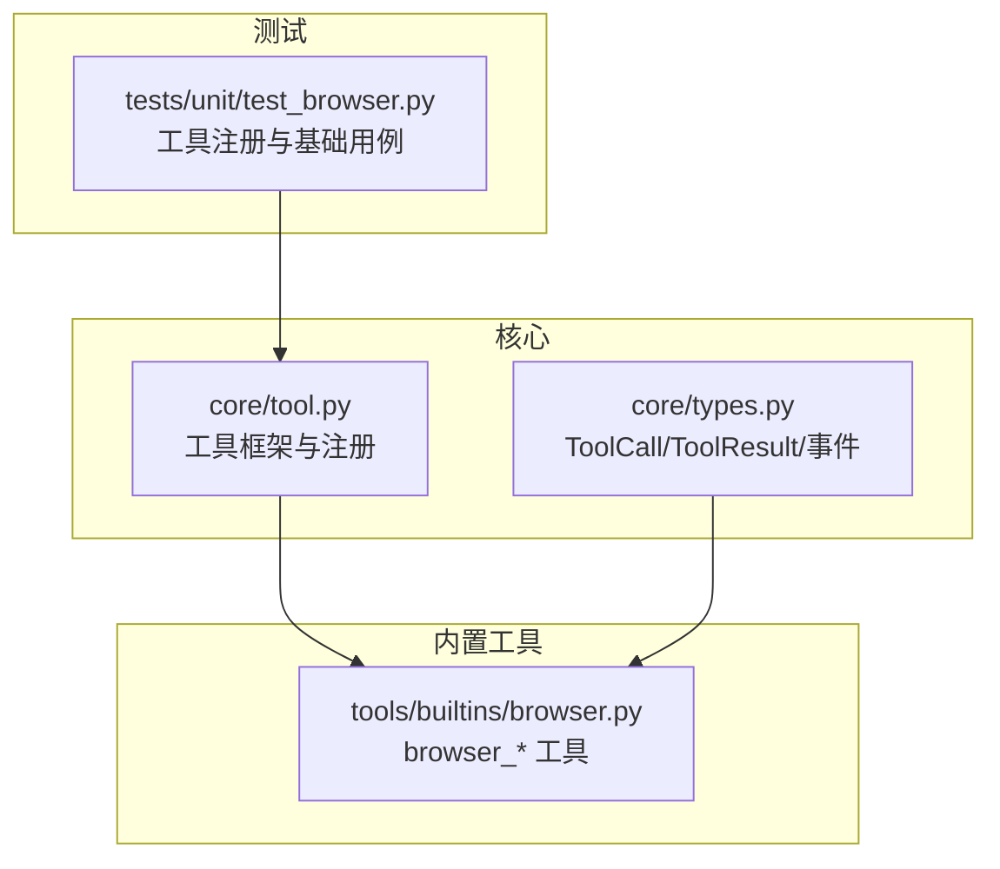
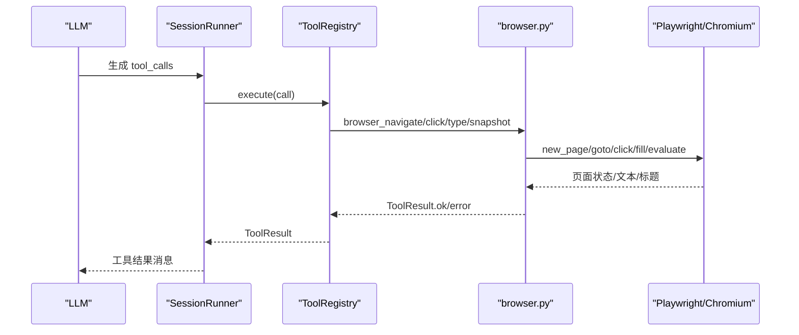
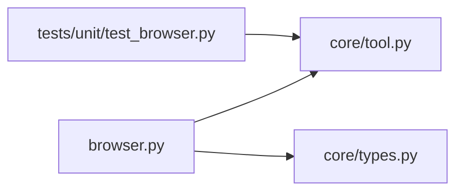

# 浏览器自动化工具

<cite>
**本文引用的文件**   
- [browser.py](file://src/microagent/tools/builtins/browser.py)
- [tool.py](file://src/microagent/core/tool.py)
- [types.py](file://src/microagent/core/types.py)
- [test_browser.py](file://tests/unit/test_browser.py)
- [README.md](file://README.md)
</cite>

## 目录
1. [简介](#简介)
2. [项目结构](#项目结构)
3. [核心组件](#核心组件)
4. [架构总览](#架构总览)
5. [详细组件分析](#详细组件分析)
6. [依赖关系分析](#依赖关系分析)
7. [性能与稳定性](#性能与稳定性)
8. [故障排查指南](#故障排查指南)
9. [结论](#结论)
10. [附录：自动化脚本示例](#附录自动化脚本示例)

## 简介
本章节面向 MicroAgent 的浏览器自动化工具，围绕以下能力展开说明：
- 页面导航：browser_navigate 的 URL 处理、加载等待与错误处理
- 页面快照与分析：browser_snapshot 的文本提取、可见元素识别与交互元素标注
- 交互操作：browser_click 的元素选择与事件模拟；browser_type 的表单填写
- 会话状态管理：基于 ContextVar 的每会话 Page 隔离，模块级 Playwright/Chromium 实例共享
- 反爬虫策略建议：User-Agent 轮换、请求间隔控制、验证码处理等（概念性指导）
- 自动化脚本示例：登录流程、数据抓取、表单提交等常见场景（概念性示例）

## 项目结构
MicroAgent 将浏览器工具作为内置工具之一，通过统一的工具注册机制暴露给 Agent。浏览器相关实现位于 tools/builtins/browser.py，核心类型与工具框架在 core/tool.py 与 core/types.py。测试覆盖在 tests/unit/test_browser.py。

图表来源
- [tool.py:177-213](file://src/microagent/core/tool.py#L177-L213)
- [types.py:97-116](file://src/microagent/core/types.py#L97-L116)
- [browser.py:1-12](file://src/microagent/tools/builtins/browser.py#L1-L12)

章节来源
- [README.md:383-408](file://README.md#L383-L408)
- [tool.py:282-309](file://src/microagent/core/tool.py#L282-L309)

## 核心组件
- 工具装饰器与注册：@tool 将异步函数包装为 FunctionTool，并自动推导参数 Schema，统一纳入 ToolRegistry。
- 结果与调用模型：ToolCall/ToolResult 是 LLM 与工具之间的标准契约；ToolResult.ok/error 用于返回成功或错误信息。
- 浏览器状态：BrowserState 保存当前会话的 Page；通过 contextvars.ContextVar 实现并发安全的会话隔离。
- 浏览器实例：Playwright 与 Chromium 实例在模块级别懒初始化并共享，减少启动开销。

章节来源
- [tool.py:177-213](file://src/microagent/core/tool.py#L177-L213)
- [types.py:97-116](file://src/microagent/core/types.py#L97-L116)
- [browser.py:37-61](file://src/microagent/tools/builtins/browser.py#L37-L61)
- [browser.py:63-79](file://src/microagent/tools/builtins/browser.py#L63-L79)

## 架构总览
浏览器工具通过 @tool 装饰器注册到全局工具集，SessionRunner 在执行过程中根据 LLM 决策调用具体工具。每个工具内部维护自身状态与外部资源（如 Playwright Page），并通过 ToolResult 返回结构化结果。

图表来源
- [tool.py:256-280](file://src/microagent/core/tool.py#L256-L280)
- [browser.py:81-101](file://src/microagent/tools/builtins/browser.py#L81-L101)
- [browser.py:103-137](file://src/microagent/tools/builtins/browser.py#L103-L137)
- [browser.py:139-162](file://src/microagent/tools/builtins/browser.py#L139-L162)
- [browser.py:164-180](file://src/microagent/tools/builtins/browser.py#L164-L180)

## 详细组件分析

### browser_navigate：页面导航
- 功能要点
  - 校验 URL 非空
  - 懒初始化 Playwright/Chromium（模块级共享）
  - 获取当前会话的 BrowserState，关闭旧 Page 后创建新 Page
  - goto(url, timeout=30000) 完成导航
  - 返回页面标题与最终 URL
- 错误处理
  - ImportError：提示安装 playwright 与 chromium
  - 其他异常：封装为 ToolResult.error
- 使用约束
  - 必须先调用 browser_navigate 才能使用 snapshot/click/type

章节来源
- [browser.py:81-101](file://src/microagent/tools/builtins/browser.py#L81-L101)
- [browser.py:63-79](file://src/microagent/tools/builtins/browser.py#L63-L79)

### browser_snapshot：页面快照与文本提取
- 功能要点
  - 检查当前会话是否存在 Page
  - 通过 evaluate 执行 JS，遍历可见文本节点，过滤不可见元素
  - 对交互元素（a/button/input/select/textarea）进行标注
  - 限制输出长度（前 5000 字符）
- 错误处理
  - 无 Page：返回错误
  - 其他异常：封装为 ToolResult.error

章节来源
- [browser.py:103-137](file://src/microagent/tools/builtins/browser.py#L103-L137)

### browser_click：点击元素
- 功能要点
  - 优先尝试 CSS selector 点击
  - 失败回退到 text= 匹配模式
  - 等待网络空闲（networkidle）确保页面稳定
  - 返回点击描述与当前页面标题
- 错误处理
  - 无 Page 或缺少 ref：返回错误
  - 其他异常：封装为 ToolResult.error

章节来源
- [browser.py:139-162](file://src/microagent/tools/builtins/browser.py#L139-L162)

### browser_type：输入框填写
- 功能要点
  - 通过 fill(ref, text, timeout=5000) 向输入框写入文本
- 错误处理
  - 无 Page 或缺少 ref：返回错误
  - 其他异常：封装为 ToolResult.error

章节来源
- [browser.py:164-180](file://src/microagent/tools/builtins/browser.py#L164-L180)

### 浏览器状态与会话隔离
- 设计模式
  - BrowserState 保存当前会话的 Page
  - _current_state 使用 contextvars.ContextVar，保证并发安全与跨调用状态保持
  - _get_state() 惰性创建并缓存当前会话状态
- 资源管理
  - _ensure_browser() 懒初始化 Playwright 与 Chromium，并使用 anyio.Lock 避免重复启动
  - 每次 navigate 会关闭旧 Page 并创建新 Page，避免状态污染

章节来源
- [browser.py:37-61](file://src/microagent/tools/builtins/browser.py#L37-L61)
- [browser.py:63-79](file://src/microagent/tools/builtins/browser.py#L63-L79)

### 工具注册与执行流程
- @tool 装饰器将函数包装为 FunctionTool，并自动生成 OpenAI 兼容的参数 Schema
- ToolRegistry 统一管理工具集合，支持 execute 与 execute_stream
- 默认内置工具通过 _default_builtins() 收集，包含 browser 模块

章节来源
- [tool.py:177-213](file://src/microagent/core/tool.py#L177-L213)
- [tool.py:282-309](file://src/microagent/core/tool.py#L282-L309)

## 依赖关系分析
- 运行时依赖
  - playwright 与 chromium：首次使用时懒加载，缺失时抛出 ImportError 并给出安装提示
- 内部依赖
  - core/tool.py：工具框架、Schema 推导、注册表
  - core/types.py：ToolCall/ToolResult/事件模型
- 测试依赖
  - tests/unit/test_browser.py：验证工具注册与基础错误路径

图表来源
- [browser.py:1-12](file://src/microagent/tools/builtins/browser.py#L1-L12)
- [tool.py:282-309](file://src/microagent/core/tool.py#L282-L309)
- [test_browser.py:1-37](file://tests/unit/test_browser.py#L1-L37)

章节来源
- [test_browser.py:1-37](file://tests/unit/test_browser.py#L1-L37)

## 性能与稳定性
- 资源复用
  - Playwright/Chromium 模块级共享，避免频繁启动开销
  - 使用 anyio.Lock 保证并发安全
- 超时与等待
  - navigate 使用 30s 超时
  - click/type 使用 5s 超时
  - click 后等待 networkidle（10s）提升稳定性
- 输出限制
  - snapshot 限制 5000 字符，防止过大响应影响 LLM 上下文

优化建议（概念性）
- 按需关闭 Page 与释放资源，避免内存增长
- 针对复杂页面可调整等待策略（如 DOMContentLoaded、特定元素可见）
- 批量操作时合并请求，减少不必要的重绘与渲染

[本节为通用性能讨论，不直接分析具体文件]

## 故障排查指南
- 常见错误
  - 未安装 playwright/chromium：ImportError，需按提示安装
  - 未先调用 browser_navigate：snapshot/click/type 报“no page open”
  - 参数为空：ref/url 为空时报错
- 定位方法
  - 查看 ToolResult.is_error 与 content 中的错误信息
  - 确认当前会话是否已有 Page（可通过 snapshot 快速验证）
  - 检查网络与目标站点可达性
- 单元测试参考
  - 工具注册校验、URL 为空、无 Page、缺少 ref 等路径均有覆盖

章节来源
- [browser.py:81-101](file://src/microagent/tools/builtins/browser.py#L81-L101)
- [browser.py:103-137](file://src/microagent/tools/builtins/browser.py#L103-L137)
- [browser.py:139-162](file://src/microagent/tools/builtins/browser.py#L139-L162)
- [browser.py:164-180](file://src/microagent/tools/builtins/browser.py#L164-L180)
- [test_browser.py:1-37](file://tests/unit/test_browser.py#L1-L37)

## 结论
MicroAgent 的浏览器自动化工具以简洁稳定的方式提供页面导航、快照与交互能力。通过 ContextVar 实现会话隔离，模块级共享浏览器实例降低开销，配合严格的超时与错误处理，适合构建稳健的网页自动化流程。对于更复杂的反爬与验证码场景，可在现有基础上扩展配置与策略。

[本节为总结性内容，不直接分析具体文件]

## 附录：自动化脚本示例
以下为概念性示例，展示如何使用 browser_* 工具完成常见任务。实际实现中请结合目标网站结构与业务需求进行调整。

- 登录流程（概念步骤）
  1) 使用 browser_navigate 打开登录页
  2) 使用 browser_snapshot 获取页面文本，定位用户名/密码输入框
  3) 使用 browser_type 填写用户名与密码
  4) 使用 browser_click 点击登录按钮
  5) 再次 snapshot 判断是否登录成功（例如出现用户信息或欢迎语）

- 数据抓取（概念步骤）
  1) 导航到目标列表页
  2) snapshot 提取可见文本与交互元素
  3) 若需要翻页，click 下一页按钮并循环抓取
  4) 将关键信息整理后返回

- 表单提交（概念步骤）
  1) 导航到表单页
  2) snapshot 识别各字段
  3) 依次 type 填入所需值
  4) click 提交按钮
  5) snapshot 验证提交结果

注意：
- 所有交互前应先 navigate，确保存在有效 Page
- 遇到动态加载或验证码时，可增加等待逻辑或人工介入
- 如需 User-Agent 轮换、请求间隔控制、Cookie 管理等高级能力，可在浏览器初始化阶段扩展配置（概念性建议）

[本节为概念性示例，不直接分析具体文件]