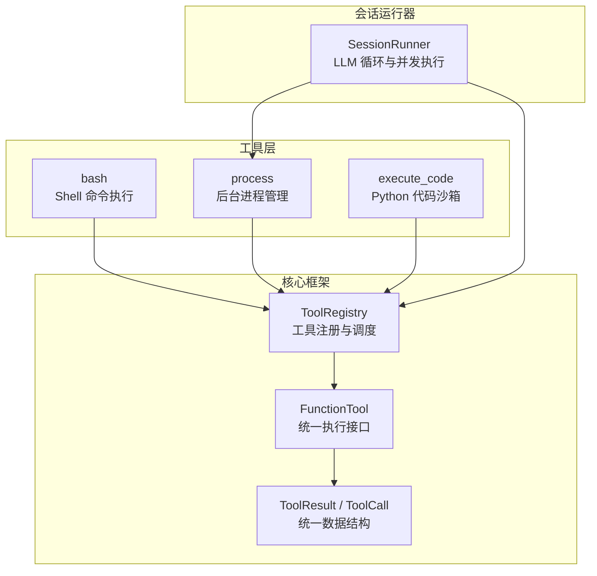
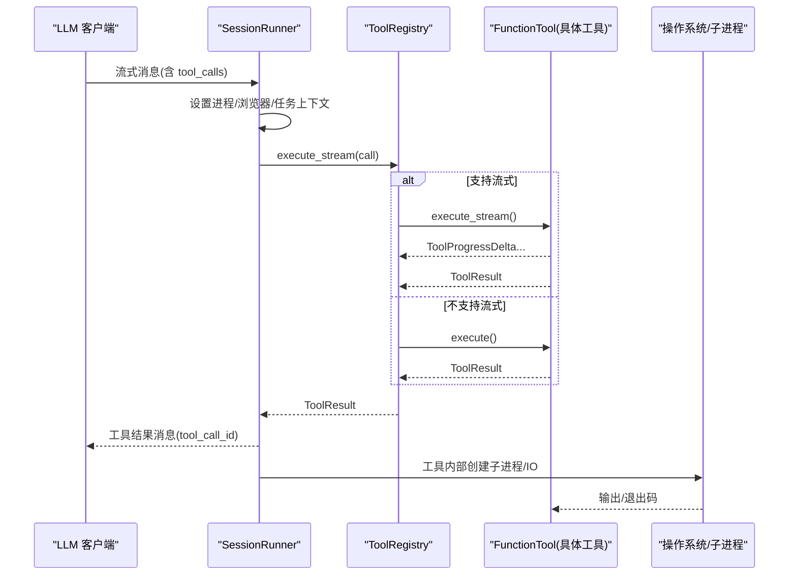
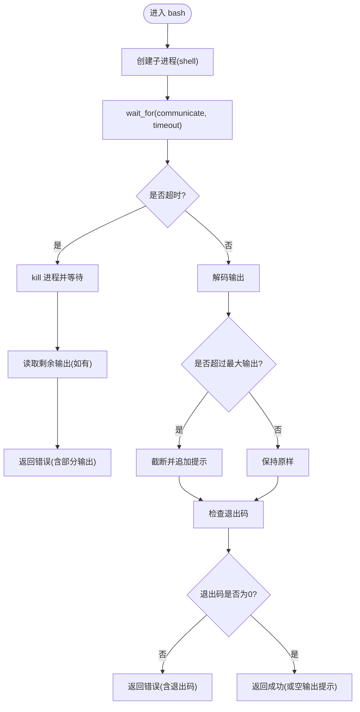
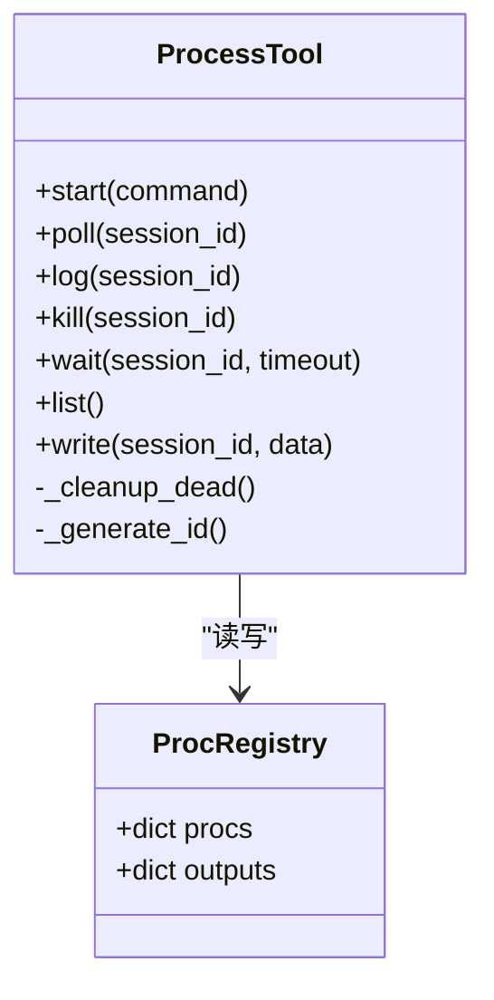
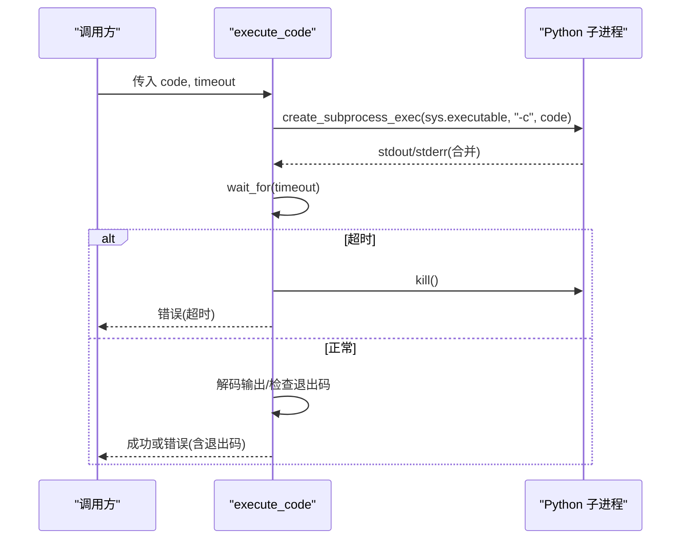
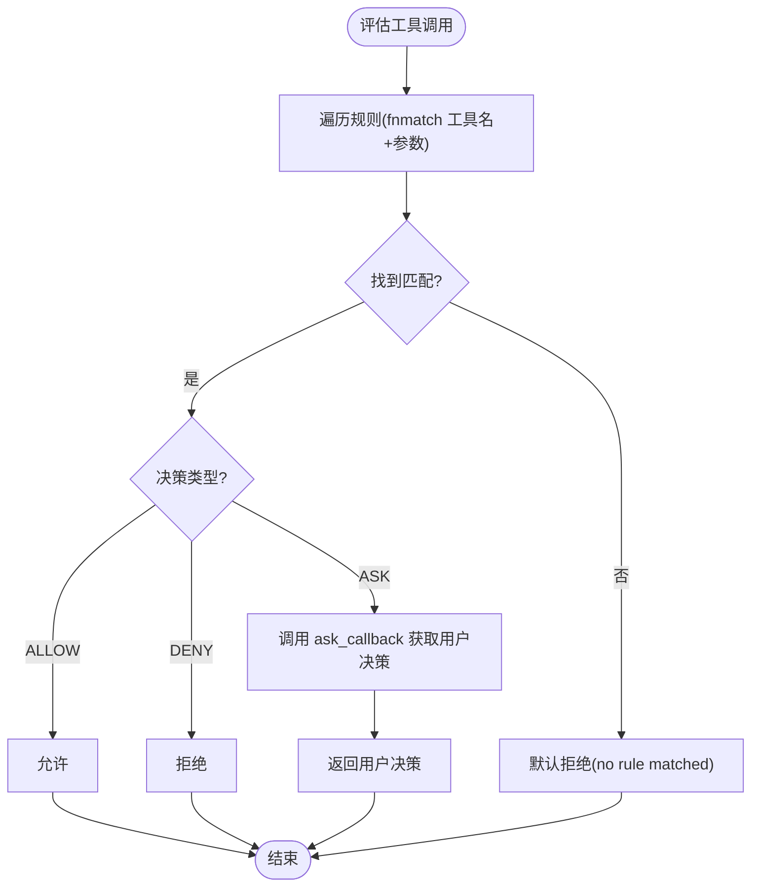
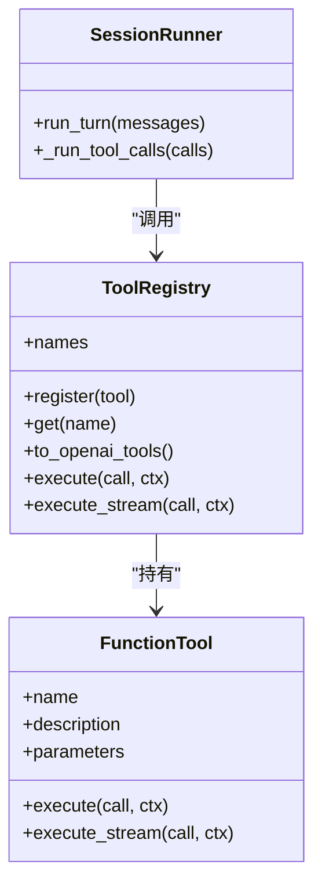
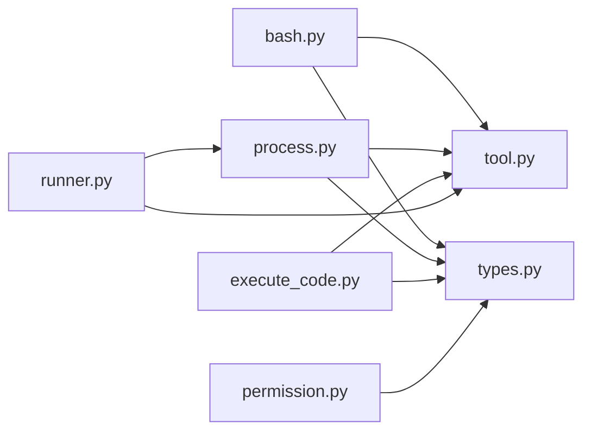

# 系统交互工具

<cite>
**本文引用的文件**   
- [bash.py](file://src/microagent/tools/builtins/bash.py)
- [process.py](file://src/microagent/tools/builtins/process.py)
- [execute_code.py](file://src/microagent/tools/builtins/execute_code.py)
- [permission.py](file://src/microagent/core/permission.py)
- [tool.py](file://src/microagent/core/tool.py)
- [types.py](file://src/microagent/core/types.py)
- [runner.py](file://src/microagent/session/runner.py)
- [test_builtins.py](file://tests/unit/test_builtins.py)
- [test_process.py](file://tests/unit/test_process.py)
- [test_execute_code.py](file://tests/unit/test_execute_code.py)
- [test_permission.py](file://tests/unit/test_permission.py)
</cite>

## 目录
1. [简介](#简介)
2. [项目结构](#项目结构)
3. [核心组件](#核心组件)
4. [架构总览](#架构总览)
5. [详细组件分析](#详细组件分析)
6. [依赖关系分析](#依赖关系分析)
7. [性能考量](#性能考量)
8. [故障排查指南](#故障排查指南)
9. [结论](#结论)

## 简介
本文件面向 MicroAgent 的系统交互工具组，聚焦以下三类内置工具：
- bash：通过异步子进程执行 Shell 命令，支持超时、输出限制与错误处理。
- process：后台进程管理，提供 start/poll/log/kill/wait/list/write 等能力，并基于 ContextVar 实现会话隔离。
- execute_code：在独立 Python 子进程中安全执行代码，具备超时控制与资源隔离。

同时，文档将深入说明权限控制机制（规则匹配、默认策略、外部脚本决策）、安全最佳实践以及性能优化建议（并发、内存、超时、清理）。

## 项目结构
MicroAgent 的工具以“装饰器注册 + 统一协议”的方式组织：
- 每个工具函数使用 @tool 装饰器声明名称、描述与参数 Schema，自动被 ToolRegistry 发现。
- 工具返回 ToolResult，统一封装成功/失败结果。
- SessionRunner 负责编排 LLM 调用与工具执行，并为需要上下文隔离的工具注入运行时状态（如进程注册表）。

图表来源
- [tool.py:170-214](file://src/microagent/core/tool.py#L170-L214)
- [tool.py:221-280](file://src/microagent/core/tool.py#L221-L280)
- [types.py:76-116](file://src/microagent/core/types.py#L76-L116)
- [runner.py:285-341](file://src/microagent/session/runner.py#L285-L341)

章节来源
- [tool.py:170-214](file://src/microagent/core/tool.py#L170-L214)
- [tool.py:221-280](file://src/microagent/core/tool.py#L221-L280)
- [types.py:76-116](file://src/microagent/core/types.py#L76-L116)
- [runner.py:285-341](file://src/microagent/session/runner.py#L285-L341)

## 核心组件
- bash：异步子进程执行 Shell 命令，合并 stdout/stderr，限制最大输出长度，超时则终止并回收部分输出，非零退出码视为错误。
- process：维护 per-session 的进程注册表，支持启动、轮询输出、读取日志、杀死、等待、列出、写入 stdin；自动清理已退出的进程。
- execute_code：以独立 Python 子进程执行代码，仅暴露标准库环境，超时后强制终止，非零退出码视为错误。
- 权限引擎：基于规则（fnmatch）对工具名与参数进行匹配，支持 ALLOW/DENY/ASK 三种决策，默认 DENY，支持外部脚本决策。
- 工具框架：@tool 装饰器生成 FunctionTool，ToolRegistry 统一管理工具注册、Schema 导出与执行；SessionRunner 负责并发执行与流式进度事件。

章节来源
- [bash.py:14-58](file://src/microagent/tools/builtins/bash.py#L14-L58)
- [process.py:26-180](file://src/microagent/tools/builtins/process.py#L26-L180)
- [execute_code.py:17-61](file://src/microagent/tools/builtins/execute_code.py#L17-L61)
- [permission.py:71-116](file://src/microagent/core/permission.py#L71-L116)
- [tool.py:170-214](file://src/microagent/core/tool.py#L170-L214)
- [tool.py:221-280](file://src/microagent/core/tool.py#L221-L280)
- [runner.py:285-341](file://src/microagent/session/runner.py#L285-L341)

## 架构总览
下图展示了从 LLM 到工具执行的完整流程，包括权限校验、上下文注入、并发执行与结果回传。

图表来源
- [runner.py:285-341](file://src/microagent/session/runner.py#L285-L341)
- [tool.py:221-280](file://src/microagent/core/tool.py#L221-L280)
- [types.py:76-116](file://src/microagent/core/types.py#L76-L116)

## 详细组件分析

### bash 工具：命令行执行
- 功能要点
  - 使用 asyncio.create_subprocess_shell 执行命令，stdout 与 stderr 合并为单一输出流。
  - 支持超时控制，超时后 kill 进程并尝试读取剩余输出，返回错误结果。
  - 输出大小限制（防止 OOM），超过阈值截断并追加提示。
  - 非零退出码视为错误，附带退出码信息。
- 参数与约束
  - command：要执行的 Shell 命令字符串。
  - timeout：秒级超时，范围 1~600，默认 120。
- 环境变量继承
  - 通过 create_subprocess_shell 继承当前进程的环境变量（未显式覆盖时）。
- 错误处理
  - 超时、异常均返回 ToolResult.error，包含错误原因或部分输出。
- 典型用例
  - 执行系统命令、管道组合、重定向等 Shell 能力。

图表来源
- [bash.py:14-58](file://src/microagent/tools/builtins/bash.py#L14-L58)

章节来源
- [bash.py:14-58](file://src/microagent/tools/builtins/bash.py#L14-L58)

### process 工具：后台进程管理
- 功能要点
  - 维护 per-session 的 ProcRegistry（进程对象与输出缓冲），通过 ContextVar 实现会话隔离。
  - 支持 action：start、poll、log、kill、wait、list、write。
  - 自动清理已退出进程，避免注册表无限增长。
  - poll 会非阻塞读取可用输出，保留最近若干行供查看。
  - write 向进程 stdin 写入数据（需确保进程有 stdin）。
- 参数与约束
  - action：必需，指定操作类型。
  - command：action=start 时必需。
  - session_id：除 list 外多数操作必需。
  - data：action=write 时必需。
  - timeout：action=wait 时的最大等待秒数。
- 会话隔离
  - SessionRunner 在每个会话中创建独立的 ProcRegistry，并通过 _current_registry 注入到工具模块。
- 错误处理
  - 找不到进程、无效 action、无 stdin、写失败等均返回错误。

图表来源
- [process.py:26-180](file://src/microagent/tools/builtins/process.py#L26-L180)

章节来源
- [process.py:26-180](file://src/microagent/tools/builtins/process.py#L26-L180)
- [runner.py:78-86](file://src/microagent/session/runner.py#L78-L86)
- [runner.py:295-302](file://src/microagent/session/runner.py#L295-L302)

### execute_code 工具：安全代码执行
- 功能要点
  - 通过 create_subprocess_exec 启动独立 Python 解释器执行代码，隔离于主进程内存与工具。
  - 仅可使用标准库（由子进程环境决定），不暴露 Agent 内部状态。
  - 支持超时控制，超时后 kill 子进程并返回错误。
  - 非零退出码视为错误，返回退出码与输出。
- 参数与约束
  - code：要执行的 Python 代码字符串。
  - timeout：秒级超时，范围 0.1~300，默认 60。
- 安全特性
  - 子进程隔离：无共享内存、无工具访问。
  - 超时保护：防止长时间占用。
  - 输出限制：strip 去除首尾空白，避免过大输出。
- 错误处理
  - 空代码、超时、异常均返回错误。

图表来源
- [execute_code.py:17-61](file://src/microagent/tools/builtins/execute_code.py#L17-L61)

章节来源
- [execute_code.py:17-61](file://src/microagent/tools/builtins/execute_code.py#L17-L61)

### 权限控制机制
- 设计原则
  - 规则自上而下匹配，首个匹配生效；默认策略为 DENY。
  - 支持 fnmatch 匹配工具名与参数约束（参数值先转字符串再匹配）。
  - ASK 模式可回调用户决策（CLI/Web 注入 ask_callback）。
- 规则与决策
  - Rule：tool_pattern、arguments_constraint、decision、reason。
  - PermissionEngine.evaluate：按规则顺序评估，返回 PermissionDecision。
  - ScriptRule：外部脚本决策，接收 JSON，输出 allow/deny，超时或非零退出视为 deny。
- 默认规则
  - DEFAULT_RULES 对常用内置工具默认允许（如 read_file、bash、web_fetch、execute_code、process 等）。

图表来源
- [permission.py:71-116](file://src/microagent/core/permission.py#L71-L116)
- [permission.py:123-186](file://src/microagent/core/permission.py#L123-L186)
- [permission.py:189-213](file://src/microagent/core/permission.py#L189-L213)

章节来源
- [permission.py:71-116](file://src/microagent/core/permission.py#L71-L116)
- [permission.py:123-186](file://src/microagent/core/permission.py#L123-L186)
- [permission.py:189-213](file://src/microagent/core/permission.py#L189-L213)

### 工具框架与执行上下文
- @tool 装饰器
  - 从函数签名推断 OpenAI 兼容的 JSON Schema，支持 Annotated[T, Field(...)] 描述与约束。
  - 将函数包装为 FunctionTool，并注册到模块级 _registry。
- ToolRegistry
  - 管理工具集合，支持 to_openai_tools 导出、execute/execute_stream 执行。
- SessionRunner
  - 并发执行工具调用，注入进程/浏览器/任务上下文（ContextVar），收集流式进度事件。

图表来源
- [tool.py:60-118](file://src/microagent/core/tool.py#L60-L118)
- [tool.py:221-280](file://src/microagent/core/tool.py#L221-L280)
- [runner.py:285-341](file://src/microagent/session/runner.py#L285-L341)

章节来源
- [tool.py:60-118](file://src/microagent/core/tool.py#L60-L118)
- [tool.py:221-280](file://src/microagent/core/tool.py#L221-L280)
- [runner.py:285-341](file://src/microagent/session/runner.py#L285-L341)

## 依赖关系分析
- 工具与框架
  - bash/process/execute_code 均依赖 core.types.ToolResult 与 core.tool.@tool 装饰器。
  - process 依赖 contextvars 实现会话隔离，并由 SessionRunner 注入上下文。
- 权限与执行
  - 权限引擎在工具调用前评估（可由上层集成），默认规则允许常见工具。
  - SessionRunner 负责并发执行与流式事件，保证用户体验。

图表来源
- [bash.py:14-58](file://src/microagent/tools/builtins/bash.py#L14-L58)
- [process.py:26-180](file://src/microagent/tools/builtins/process.py#L26-L180)
- [execute_code.py:17-61](file://src/microagent/tools/builtins/execute_code.py#L17-L61)
- [permission.py:71-116](file://src/microagent/core/permission.py#L71-L116)
- [tool.py:221-280](file://src/microagent/core/tool.py#L221-L280)
- [runner.py:285-341](file://src/microagent/session/runner.py#L285-L341)

章节来源
- [bash.py:14-58](file://src/microagent/tools/builtins/bash.py#L14-L58)
- [process.py:26-180](file://src/microagent/tools/builtins/process.py#L26-L180)
- [execute_code.py:17-61](file://src/microagent/tools/builtins/execute_code.py#L17-L61)
- [permission.py:71-116](file://src/microagent/core/permission.py#L71-L116)
- [tool.py:221-280](file://src/microagent/core/tool.py#L221-L280)
- [runner.py:285-341](file://src/microagent/session/runner.py#L285-L341)

## 性能考量
- 进程池管理
  - process 工具未实现固定大小的进程池，但每次操作前清理已退出进程，避免注册表膨胀。
  - 建议在高并发场景下结合外部队列或限流器，限制同时运行的进程数量。
- 内存限制
  - bash 工具限制最大输出长度（防 OOM），建议根据业务调整阈值。
  - execute_code 子进程独立运行，内存占用受限于系统分配，可通过 cgroups/systemd 进一步限制。
- 并发控制
  - SessionRunner 使用 anyio TaskGroup 并发执行工具调用，注意避免过多长耗时任务导致资源争用。
  - 对于 I/O 密集型任务，合理设置超时与批量大小。
- 超时与资源清理
  - 所有工具均支持超时控制，确保长时间任务被及时终止。
  - process 工具在 poll/kill/wait 后应主动清理输出缓存，避免内存泄漏。

[本节为通用指导，不直接分析具体文件]

## 故障排查指南
- bash 工具
  - 症状：命令超时或输出过大
  - 排查：检查 timeout 配置与 MAX_OUTPUT 限制；确认命令是否产生大量输出。
  - 参考：[bash.py:14-58](file://src/microagent/tools/builtins/bash.py#L14-L58)
- process 工具
  - 症状：找不到进程、无法写入 stdin、轮询无输出
  - 排查：确认 session_id 正确；确保进程启动时包含 stdin；检查进程是否已退出。
  - 参考：[process.py:99-179](file://src/microagent/tools/builtins/process.py#L99-L179)
- execute_code 工具
  - 症状：执行超时、导入失败、非零退出码
  - 排查：缩短 timeout；确认仅使用标准库；检查代码逻辑与返回值。
  - 参考：[execute_code.py:17-61](file://src/microagent/tools/builtins/execute_code.py#L17-L61)
- 权限控制
  - 症状：工具调用被拒绝
  - 排查：检查规则匹配顺序与参数约束；确认默认规则是否覆盖目标工具。
  - 参考：[permission.py:71-116](file://src/microagent/core/permission.py#L71-L116)
- 测试验证
  - 使用单元测试快速验证行为：
    - bash/process/execute_code 基础功能与边界条件
    - 权限引擎规则匹配与默认策略
  - 参考：
    - [test_builtins.py:1-204](file://tests/unit/test_builtins.py#L1-L204)
    - [test_process.py:1-190](file://tests/unit/test_process.py#L1-L190)
    - [test_execute_code.py:1-67](file://tests/unit/test_execute_code.py#L1-L67)
    - [test_permission.py:1-102](file://tests/unit/test_permission.py#L1-L102)

章节来源
- [bash.py:14-58](file://src/microagent/tools/builtins/bash.py#L14-L58)
- [process.py:99-179](file://src/microagent/tools/builtins/process.py#L99-L179)
- [execute_code.py:17-61](file://src/microagent/tools/builtins/execute_code.py#L17-L61)
- [permission.py:71-116](file://src/microagent/core/permission.py#L71-L116)
- [test_builtins.py:1-204](file://tests/unit/test_builtins.py#L1-L204)
- [test_process.py:1-190](file://tests/unit/test_process.py#L1-L190)
- [test_execute_code.py:1-67](file://tests/unit/test_execute_code.py#L1-L67)
- [test_permission.py:1-102](file://tests/unit/test_permission.py#L1-L102)

## 结论
MicroAgent 的系统交互工具组通过统一的工具协议与注册机制，提供了强大的 Shell 执行、后台进程管理与安全代码执行能力。权限引擎以规则驱动的方式保障安全，默认策略遵循最小权限原则。SessionRunner 的并发执行与流式输出提升了用户体验。在生产环境中，建议结合进程池、内存限制、超时与清理策略，进一步优化性能与稳定性。

[本节为总结性内容，不直接分析具体文件]