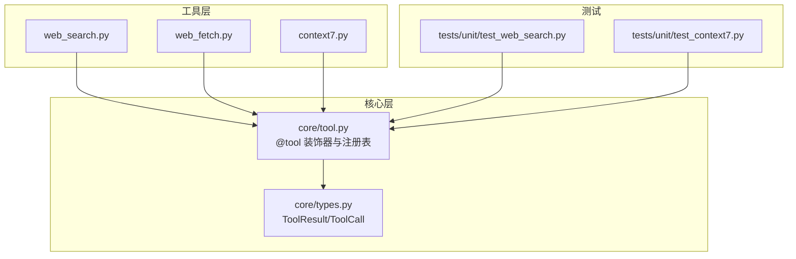
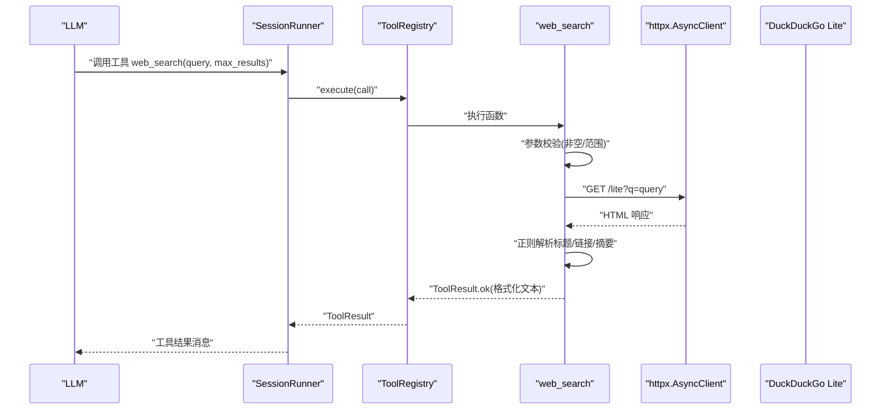
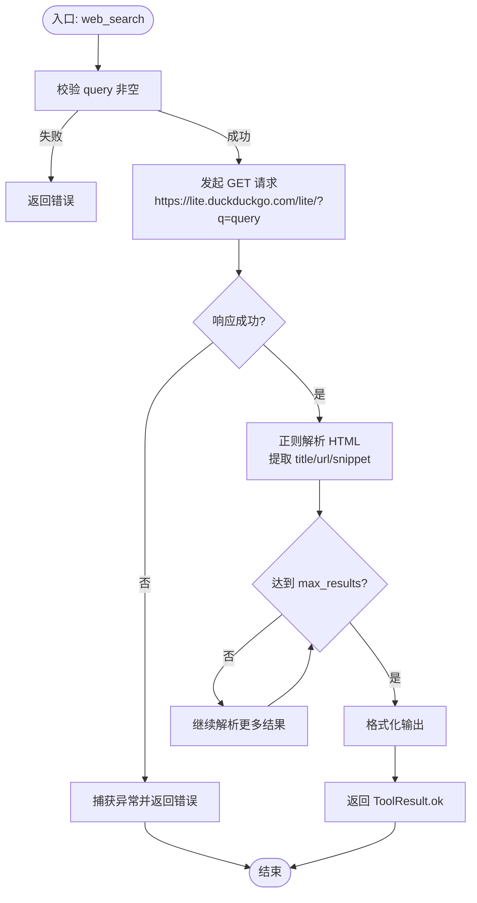
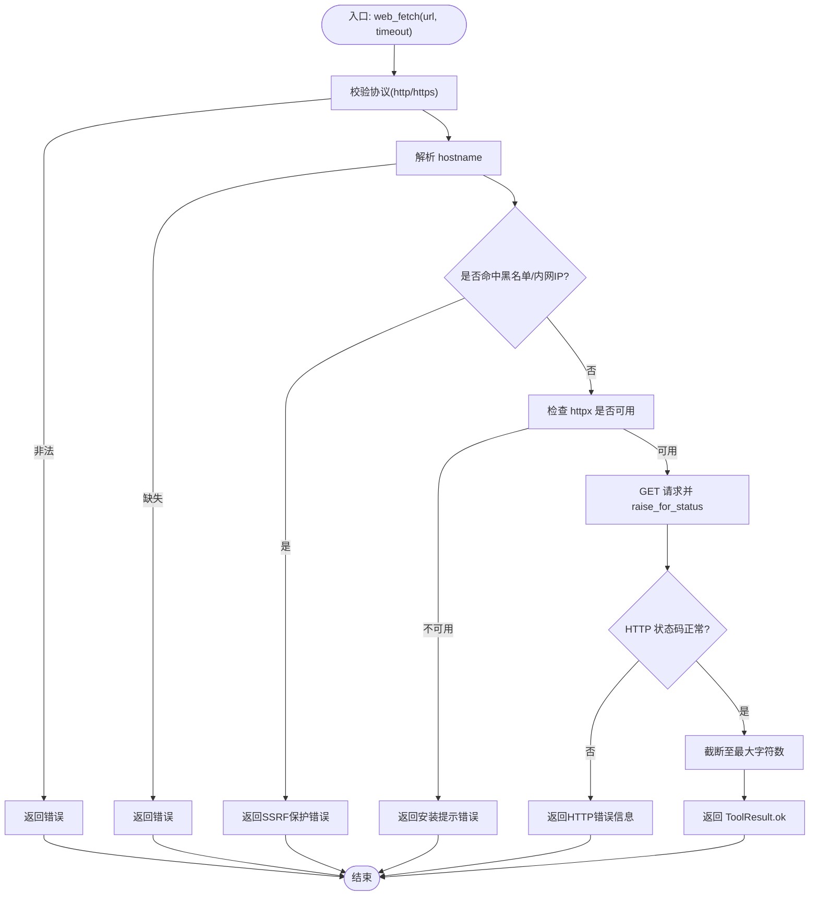
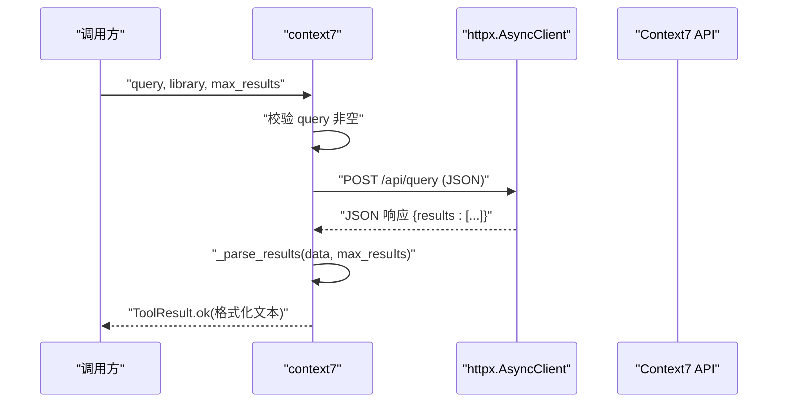
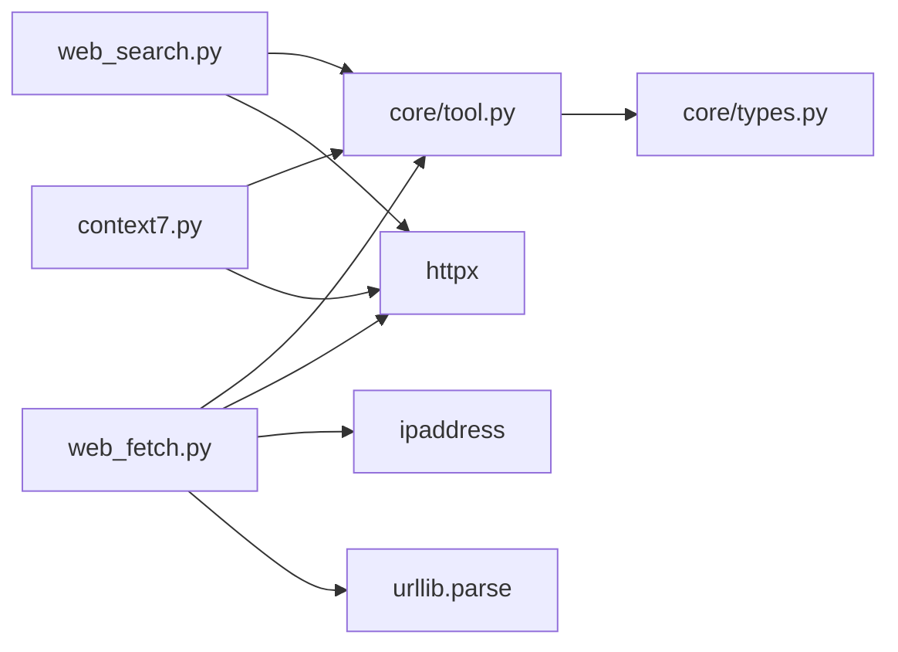

# 网络请求工具

<cite>
**本文引用的文件**   
- [web_search.py](file://src/microagent/tools/builtins/web_search.py)
- [web_fetch.py](file://src/microagent/tools/builtins/web_fetch.py)
- [context7.py](file://src/microagent/tools/builtins/context7.py)
- [tool.py](file://src/microagent/core/tool.py)
- [types.py](file://src/microagent/core/types.py)
- [config.py](file://src/microagent/config.py)
- [test_web_search.py](file://tests/unit/test_web_search.py)
- [test_context7.py](file://tests/unit/test_context7.py)
</cite>

## 目录
1. [简介](#简介)
2. [项目结构](#项目结构)
3. [核心组件](#核心组件)
4. [架构总览](#架构总览)
5. [详细组件分析](#详细组件分析)
6. [依赖关系分析](#依赖关系分析)
7. [性能与配置](#性能与配置)
8. [安全考虑](#安全考虑)
9. [API 调用示例](#api-调用示例)
10. [故障排查指南](#故障排查指南)
11. [结论](#结论)

## 简介
本文件为 MicroAgent 的网络请求工具组提供系统化文档，覆盖以下三个内置工具：
- web_search：基于 DuckDuckGo lite HTML 的网页搜索工具，无需 API Key。
- web_fetch：基于 httpx 的网页抓取工具，具备 SSRF 防护、超时控制与响应截断等能力。
- context7：通过 Context7 API 获取库/框架最新文档片段，支持按库名过滤与结果数量限制。

同时，文档涵盖网络超时、代理、缓存、速率限制等企业级能力的扩展建议，以及输入校验、URL 白名单、内容过滤等安全措施，并提供实际调用示例与排障指南。

## 项目结构
网络相关工具位于 tools/builtins 目录下，统一通过 @tool 装饰器注册到工具注册表，并在运行时由 SessionRunner 调度执行。核心类型 ToolResult 用于返回成功或错误结果。

图表来源
- [web_search.py:1-79](file://src/microagent/tools/builtins/web_search.py#L1-L79)
- [web_fetch.py:1-93](file://src/microagent/tools/builtins/web_fetch.py#L1-L93)
- [context7.py:1-78](file://src/microagent/tools/builtins/context7.py#L1-L78)
- [tool.py:177-213](file://src/microagent/core/tool.py#L177-L213)
- [types.py:97-116](file://src/microagent/core/types.py#L97-L116)
- [test_web_search.py:1-41](file://tests/unit/test_web_search.py#L1-L41)
- [test_context7.py:1-48](file://tests/unit/test_context7.py#L1-L48)

章节来源
- [web_search.py:1-79](file://src/microagent/tools/builtins/web_search.py#L1-L79)
- [web_fetch.py:1-93](file://src/microagent/tools/builtins/web_fetch.py#L1-L93)
- [context7.py:1-78](file://src/microagent/tools/builtins/context7.py#L1-L78)
- [tool.py:177-213](file://src/microagent/core/tool.py#L177-L213)
- [types.py:97-116](file://src/microagent/core/types.py#L97-L116)

## 核心组件
- 工具注册与执行
  - @tool 装饰器将异步函数包装为 FunctionTool，并自动推断参数 JSON Schema（OpenAI function-calling 兼容）。
  - ToolRegistry 管理工具集合，支持 to_openai_tools() 导出与 execute()/execute_stream() 执行。
- 工具结果模型
  - ToolResult.ok()/error()/denied() 统一封装成功与失败结果，is_error 标记错误状态。
- 默认内置工具发现
  - _default_builtins() 在导入时触发各工具的 @tool 副作用，完成注册。

章节来源
- [tool.py:177-213](file://src/microagent/core/tool.py#L177-L213)
- [tool.py:221-280](file://src/microagent/core/tool.py#L221-L280)
- [tool.py:282-309](file://src/microagent/core/tool.py#L282-L309)
- [types.py:97-116](file://src/microagent/core/types.py#L97-L116)

## 架构总览
下图展示了从 LLM 调用到具体网络工具执行的端到端流程，包括参数校验、HTTP 请求、结果解析与返回。

图表来源
- [tool.py:256-280](file://src/microagent/core/tool.py#L256-L280)
- [web_search.py:18-54](file://src/microagent/tools/builtins/web_search.py#L18-L54)
- [types.py:97-116](file://src/microagent/core/types.py#L97-L116)

## 详细组件分析

### web_search：搜索引擎集成
- 功能概述
  - 使用 DuckDuckGo lite HTML 接口进行网页搜索，无需 API Key。
  - 返回结构化结果：标题、URL、摘要片段。
- 搜索策略与解析
  - 通过正则提取 <a href="...">title</a> 与 <td class="result-snippet">...</td>，组装结果列表。
  - 支持 max_results 限制返回数量。
- 分页处理
  - 当前实现未提供分页；如需分页，可结合外部服务或自定义解析逻辑扩展。
- 结果排序
  - 保持 DuckDuckGo 返回顺序；可在上层对结果二次排序。
- 错误处理
  - 参数为空返回错误；网络异常捕获并返回 ToolResult.error。
- 超时与重定向
  - 使用 httpx.AsyncClient(timeout=15.0)，follow_redirects=True。

图表来源
- [web_search.py:18-54](file://src/microagent/tools/builtins/web_search.py#L18-L54)
- [web_search.py:57-79](file://src/microagent/tools/builtins/web_search.py#L57-L79)

章节来源
- [web_search.py:18-54](file://src/microagent/tools/builtins/web_search.py#L18-L54)
- [web_search.py:57-79](file://src/microagent/tools/builtins/web_search.py#L57-L79)
- [test_web_search.py:1-41](file://tests/unit/test_web_search.py#L1-L41)

### web_fetch：网页抓取
- 功能概述
  - 使用 httpx 异步客户端抓取 URL 文本内容，支持超时与重定向。
- 输入验证与 SSRF 防护
  - 仅允许 http/https 协议。
  - 拦截本地/内网主机名（如 localhost、*.local）与私有 IP 段（IPv4/IPv6）。
- 请求头与客户端配置
  - follow_redirects=True，timeout 由参数传入（1-60 秒）。
- 响应处理与截断
  - 最大字符数限制（10,000），超出则截断并附加提示。
- 错误重试
  - 当前未实现重试；可按需在上层增加指数退避重试策略。

图表来源
- [web_fetch.py:14-92](file://src/microagent/tools/builtins/web_fetch.py#L14-L92)

章节来源
- [web_fetch.py:14-92](file://src/microagent/tools/builtins/web_fetch.py#L14-L92)

### context7：知识库查询
- 功能概述
  - 通过 https://context7.com/api/query 获取库/框架的最新文档片段。
  - 支持 library 过滤与 max_results 限制。
- 语义搜索与上下文检索
  - 服务端负责语义匹配；客户端传递 query/library/n 参数。
- 结果摘要生成
  - 客户端将 results 数组格式化为可读文本，包含标题、摘要、URL、库名。
- 错误处理
  - 参数为空返回错误；网络异常捕获并返回 ToolResult.error。

图表来源
- [context7.py:17-54](file://src/microagent/tools/builtins/context7.py#L17-L54)
- [context7.py:57-78](file://src/microagent/tools/builtins/context7.py#L57-L78)

章节来源
- [context7.py:17-54](file://src/microagent/tools/builtins/context7.py#L17-L54)
- [context7.py:57-78](file://src/microagent/tools/builtins/context7.py#L57-L78)
- [test_context7.py:1-48](file://tests/unit/test_context7.py#L1-L48)

## 依赖关系分析
- 工具与核心模块
  - 所有网络工具均依赖 core/tool 的 @tool 装饰器与 ToolRegistry。
  - 统一通过 core/types.ToolResult 返回结果。
- 外部依赖
  - web_search/web_fetch/context7 均使用 httpx 进行异步 HTTP 请求。
  - web_fetch 额外使用 ipaddress 与 urllib.parse 做 URL 解析与安全校验。

图表来源
- [web_search.py:1-79](file://src/microagent/tools/builtins/web_search.py#L1-L79)
- [web_fetch.py:1-93](file://src/microagent/tools/builtins/web_fetch.py#L1-L93)
- [context7.py:1-78](file://src/microagent/tools/builtins/context7.py#L1-L78)
- [tool.py:177-213](file://src/microagent/core/tool.py#L177-L213)
- [types.py:97-116](file://src/microagent/core/types.py#L97-L116)

章节来源
- [tool.py:177-213](file://src/microagent/core/tool.py#L177-L213)
- [types.py:97-116](file://src/microagent/core/types.py#L97-L116)

## 性能与配置
- 网络超时
  - web_search 固定 15 秒；web_fetch 支持 1-60 秒可调；context7 固定 15 秒。
- 代理设置
  - 当前工具未暴露代理配置；可通过全局 httpx 传输层或环境变量注入代理。
- 缓存策略
  - 工具层未实现 HTTP 缓存；可在上层引入缓存中间件（如基于磁盘或内存的 TTL 缓存）。
- 速率限制
  - 工具层未实现限流；可在调用侧增加令牌桶或滑动窗口限流。
- 连接复用
  - httpx.AsyncClient 在 with 块内复用连接；如需跨调用复用，可提升为单例 Client 并管理生命周期。

章节来源
- [web_search.py:28-36](file://src/microagent/tools/builtins/web_search.py#L28-L36)
- [web_fetch.py:74-80](file://src/microagent/tools/builtins/web_fetch.py#L74-L80)
- [context7.py:38-48](file://src/microagent/tools/builtins/context7.py#L38-L48)

## 安全考虑
- 输入验证
  - web_search 校验 query 非空；web_fetch 校验 URL 协议与主机名；context7 校验 query 非空。
- URL 白名单与 SSRF 防护
  - web_fetch 明确禁止 http/https 以外的协议，拦截本地/内网主机名与私有 IP 段。
- 内容过滤
  - web_fetch 对响应文本进行长度截断，避免过大响应影响下游处理。
- 错误隔离
  - 所有异常均被捕获并返回 ToolResult.error，避免进程崩溃。

章节来源
- [web_fetch.py:18-67](file://src/microagent/tools/builtins/web_fetch.py#L18-L67)
- [web_search.py:25-26](file://src/microagent/tools/builtins/web_search.py#L25-L26)
- [context7.py:33-34](file://src/microagent/tools/builtins/context7.py#L33-L34)

## API 调用示例
以下为典型调用方式与预期行为说明（不展示代码内容，仅提供路径参考）：
- web_search
  - 基本搜索：传入 query 与可选 max_results，返回格式化搜索结果。
  - 空查询：返回错误结果。
  - 参考路径：[web_search.py:18-54](file://src/microagent/tools/builtins/web_search.py#L18-L54)、[test_web_search.py:13-18](file://tests/unit/test_web_search.py#L13-L18)
- web_fetch
  - 抓取网页：传入 url 与 timeout，返回文本内容（可能截断）。
  - 非法协议/内网地址：返回错误。
  - 参考路径：[web_fetch.py:14-92](file://src/microagent/tools/builtins/web_fetch.py#L14-L92)
- context7
  - 查询文档：传入 query、可选 library 与 max_results，返回文档片段。
  - 空查询：返回错误。
  - 参考路径：[context7.py:17-54](file://src/microagent/tools/builtins/context7.py#L17-L54)、[test_context7.py:12-16](file://tests/unit/test_context7.py#L12-L16)

章节来源
- [web_search.py:18-54](file://src/microagent/tools/builtins/web_search.py#L18-L54)
- [web_fetch.py:14-92](file://src/microagent/tools/builtins/web_fetch.py#L14-L92)
- [context7.py:17-54](file://src/microagent/tools/builtins/context7.py#L17-L54)
- [test_web_search.py:13-18](file://tests/unit/test_web_search.py#L13-L18)
- [test_context7.py:12-16](file://tests/unit/test_context7.py#L12-L16)

## 故障排查指南
- 常见问题
  - 网络超时：检查目标站点可达性与超时阈值设置。
  - SSRF 拦截：确认 URL 是否为公网地址且协议合法。
  - 依赖缺失：确保已安装 httpx。
  - 解析失败：检查第三方页面结构变化导致正则失效。
- 定位步骤
  - 查看 ToolResult.is_error 与 content 中的错误信息。
  - 在调用侧增加日志记录（请求 URL、响应状态码、异常堆栈）。
  - 针对 web_search 与 context7，可先手动访问对应接口验证连通性。
- 恢复措施
  - 调整超时时间或重试策略（在上层实现）。
  - 更新解析规则以适配目标页面结构变化。
  - 配置代理或更换网络出口以绕过网络限制。

章节来源
- [web_fetch.py:89-92](file://src/microagent/tools/builtins/web_fetch.py#L89-L92)
- [web_search.py:39-40](file://src/microagent/tools/builtins/web_search.py#L39-L40)
- [context7.py:51-52](file://src/microagent/tools/builtins/context7.py#L51-L52)

## 结论
MicroAgent 的网络请求工具组提供了简洁可靠的网页搜索、抓取与知识库查询能力。其设计遵循统一的工具协议与结果模型，具备良好的可扩展性与安全性。企业级特性（代理、缓存、限流、重试）可在上层灵活扩展，以满足不同部署场景的需求。