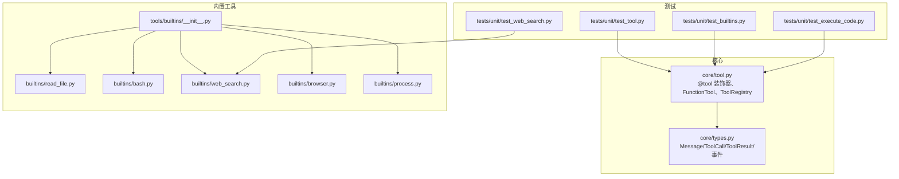
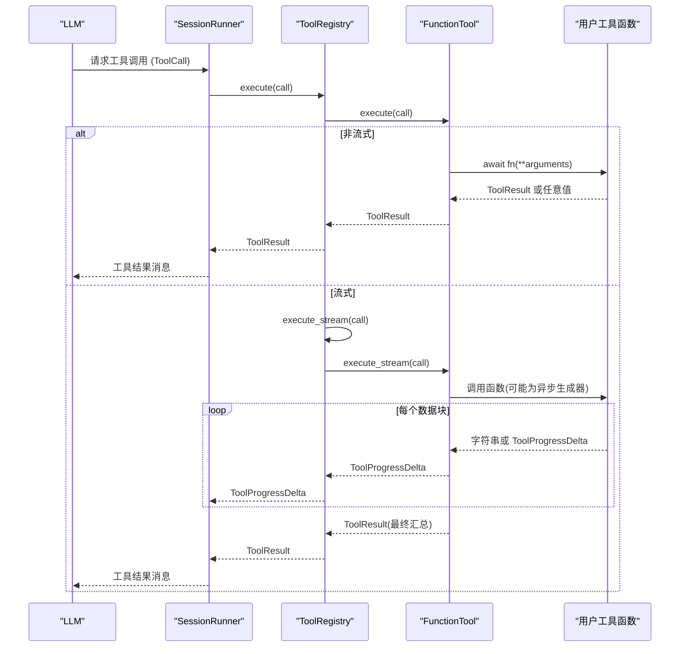
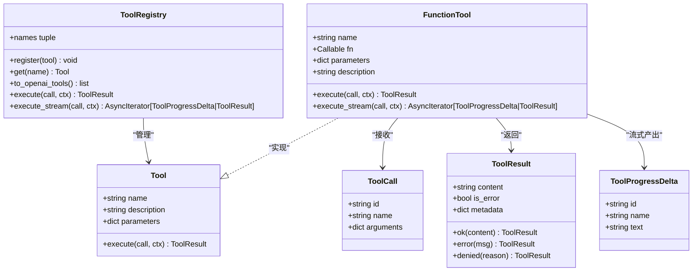

# 自定义工具开发

<cite>
**本文引用的文件**
- [src/microagent/core/tool.py](file://src/microagent/core/tool.py)
- [src/microagent/core/types.py](file://src/microagent/core/types.py)
- [src/microagent/tools/builtins/__init__.py](file://src/microagent/tools/builtins/__init__.py)
- [src/microagent/tools/builtins/read_file.py](file://src/microagent/tools/builtins/read_file.py)
- [src/microagent/tools/builtins/bash.py](file://src/microagent/tools/builtins/bash.py)
- [src/microagent/tools/builtins/web_search.py](file://src/microagent/tools/builtins/web_search.py)
- [src/microagent/tools/builtins/browser.py](file://src/microagent/tools/builtins/browser.py)
- [src/microagent/tools/builtins/process.py](file://src/microagent/tools/builtins/process.py)
- [tests/unit/test_tool.py](file://tests/unit/test_tool.py)
- [tests/unit/test_builtins.py](file://tests/unit/test_builtins.py)
- [tests/unit/test_execute_code.py](file://tests/unit/test_execute_code.py)
- [tests/unit/test_web_search.py](file://tests/unit/test_web_search.py)
- [README.md](file://README.md)
</cite>

## 目录
1. [简介](#简介)
2. [项目结构](#项目结构)
3. [核心组件](#核心组件)
4. [架构总览](#架构总览)
5. [详细组件分析](#详细组件分析)
6. [依赖关系分析](#依赖关系分析)
7. [性能考虑](#性能考虑)
8. [故障排查指南](#故障排查指南)
9. [结论](#结论)
10. [附录](#附录)

## 简介
本指南面向希望在 MicroAgent 中开发“自定义工具”的开发者。内容覆盖：
- 使用 @tool 装饰器定义新工具的完整流程（函数签名、参数注解、描述信息）
- 同步/异步/流式三种实现模式与差异
- 错误处理机制（异常捕获、错误消息格式化、重试建议）
- 性能优化技巧（缓存、连接池、内存控制）
- 测试方法（单元测试、Mock、集成测试）
- 发布与分发最佳实践（包结构、依赖管理、版本控制）
- 多个真实案例演示不同类型工具的开发过程

MicroAgent 的工具系统基于协议与注册表，配合 Pydantic v2 自动推断 OpenAI 兼容的 JSON Schema，支持流式输出与统一的结果类型。

## 项目结构
MicroAgent 将工具能力集中在 tools/builtins 下，通过 core/tool.py 提供的 @tool 装饰器与 ToolRegistry 进行注册与调度。核心类型在 core/types.py 中统一定义。

图表来源
- [src/microagent/core/tool.py:1-309](file://src/microagent/core/tool.py#L1-L309)
- [src/microagent/core/types.py:1-189](file://src/microagent/core/types.py#L1-L189)
- [src/microagent/tools/builtins/__init__.py:1-2](file://src/microagent/tools/builtins/__init__.py#L1-L2)
- [src/microagent/tools/builtins/read_file.py:1-55](file://src/microagent/tools/builtins/read_file.py#L1-L55)
- [src/microagent/tools/builtins/bash.py:1-58](file://src/microagent/tools/builtins/bash.py#L1-L58)
- [src/microagent/tools/builtins/web_search.py:1-79](file://src/microagent/tools/builtins/web_search.py#L1-L79)
- [src/microagent/tools/builtins/browser.py:1-180](file://src/microagent/tools/builtins/browser.py#L1-L180)
- [src/microagent/tools/builtins/process.py:1-180](file://src/microagent/tools/builtins/process.py#L1-L180)
- [tests/unit/test_tool.py:1-97](file://tests/unit/test_tool.py#L1-L97)
- [tests/unit/test_builtins.py:1-204](file://tests/unit/test_builtins.py#L1-L204)
- [tests/unit/test_execute_code.py:1-67](file://tests/unit/test_execute_code.py#L1-L67)
- [tests/unit/test_web_search.py:1-41](file://tests/unit/test_web_search.py#L1-L41)

章节来源
- [README.md:349-382](file://README.md#L349-L382)

## 核心组件
- Tool 协议：所有工具必须满足该协议（name、description、parameters、execute）。
- FunctionTool：将普通 async 函数包装为 Tool，并自动检测是否返回 AsyncIterator[str] 以启用流式执行。
- ToolRegistry：维护工具集合，提供按名称查找、OpenAI tools 导出、统一执行与流式执行入口。
- 核心类型：ToolCall、ToolResult、ToolProgressDelta 等用于调用、结果与进度事件。

关键要点
- 使用 @tool(name, description=...) 装饰 async 函数即可注册工具；未提供 description 时从 docstring 首行推导。
- 参数类型注解使用 Annotated[T, Field(...)] 来生成 JSON Schema，Field 支持约束（如 ge、le、description）。
- 若函数返回 AsyncIterator[str]，则 execute_stream 会逐块产出 ToolProgressDelta，最终返回 ToolResult。

章节来源
- [src/microagent/core/tool.py:40-49](file://src/microagent/core/tool.py#L40-L49)
- [src/microagent/core/tool.py:60-118](file://src/microagent/core/tool.py#L60-L118)
- [src/microagent/core/tool.py:125-166](file://src/microagent/core/tool.py#L125-L166)
- [src/microagent/core/tool.py:177-213](file://src/microagent/core/tool.py#L177-L213)
- [src/microagent/core/tool.py:221-280](file://src/microagent/core/tool.py#L221-L280)
- [src/microagent/core/types.py:76-116](file://src/microagent/core/types.py#L76-L116)
- [src/microagent/core/types.py:153-165](file://src/microagent/core/types.py#L153-L165)

## 架构总览
下图展示了从 LLM 到工具执行的端到端流程，包括非流式与流式两条路径。

图表来源
- [src/microagent/core/tool.py:256-280](file://src/microagent/core/tool.py#L256-L280)
- [src/microagent/core/tool.py:81-118](file://src/microagent/core/tool.py#L81-L118)
- [src/microagent/core/types.py:153-165](file://src/microagent/core/types.py#L153-L165)

## 详细组件分析

### 使用 @tool 装饰器定义工具
- 函数签名设计
  - 使用 async def 定义工具函数。
  - 参数建议使用 Annotated[T, Field(description=..., 约束...)] 标注，便于自动生成 JSON Schema。
  - 可选参数通过默认值声明，必填参数不设置默认值。
- 描述信息
  - 优先使用 @tool 的 description 参数；否则从函数 docstring 的首行提取。
- 返回值
  - 推荐返回 ToolResult.ok(...) 或 ToolResult.error(...)。
  - 若返回任意值，会被自动包装为 ToolResult.ok(str(result))。
- 流式支持
  - 若函数返回 AsyncIterator[str]，将被自动识别为流式工具，逐块产出 ToolProgressDelta。

章节来源
- [src/microagent/core/tool.py:177-213](file://src/microagent/core/tool.py#L177-L213)
- [src/microagent/core/tool.py:125-166](file://src/microagent/core/tool.py#L125-L166)
- [src/microagent/core/tool.py:75-79](file://src/microagent/core/tool.py#L75-L79)
- [src/microagent/core/tool.py:81-118](file://src/microagent/core/tool.py#L81-L118)

### 同步工具、异步工具与流式工具的实现模式
- 同步工具
  - 实际仍为 async 函数，但内部无 I/O 阻塞操作，直接返回 ToolResult。
  - 示例参考 read_file 的简单分支与校验逻辑。
- 异步工具
  - 涉及网络请求、子进程、数据库等 I/O 操作，使用 await 调用外部资源。
  - 示例参考 bash、web_search。
- 流式工具
  - 返回 AsyncIterator[str]，每次 yield 一个文本片段，由 FunctionTool 转换为 ToolProgressDelta。
  - 示例可参考 process 的 poll/log 组合使用方式（虽非直接 yield，但体现流式思想），以及 FunctionTool 的流式处理逻辑。

章节来源
- [src/microagent/tools/builtins/read_file.py:14-55](file://src/microagent/tools/builtins/read_file.py#L14-L55)
- [src/microagent/tools/builtins/bash.py:14-58](file://src/microagent/tools/builtins/bash.py#L14-L58)
- [src/microagent/tools/builtins/web_search.py:18-54](file://src/microagent/tools/builtins/web_search.py#L18-L54)
- [src/microagent/tools/builtins/process.py:67-180](file://src/microagent/tools/builtins/process.py#L67-L180)
- [src/microagent/core/tool.py:81-118](file://src/microagent/core/tool.py#L81-L118)

### 错误处理机制
- 异常捕获
  - 工具内部应捕获异常并返回 ToolResult.error(...)，避免未处理异常导致调用链崩溃。
  - 示例：bash 对超时和子进程异常的处理；web_search 对网络异常的封装。
- 错误消息格式化
  - 统一使用 ToolResult.error(msg)，确保 is_error=True 且 content 包含可读信息。
- 重试逻辑
  - 建议在调用层（如 SessionRunner 或 Hook）实现重试策略，而非在工具内硬编码重试，保持工具幂等性与职责单一。

章节来源
- [src/microagent/tools/builtins/bash.py:21-58](file://src/microagent/tools/builtins/bash.py#L21-L58)
- [src/microagent/tools/builtins/web_search.py:28-41](file://src/microagent/tools/builtins/web_search.py#L28-L41)
- [src/microagent/core/types.py:105-116](file://src/microagent/core/types.py#L105-L116)

### 性能优化技巧
- 缓存策略
  - 对重复查询（如浏览器页面快照、搜索结果）可使用模块级缓存或会话级缓存（ContextVar）。
- 连接池管理
  - 网络请求使用 httpx.AsyncClient 并在上下文管理器中复用连接；浏览器实例模块级共享，减少启动开销。
- 内存优化
  - 限制输出大小（如 bash 的 MAX_OUTPUT）、截断长输出、及时清理已退出进程（process 中的 _cleanup_dead）。

章节来源
- [src/microagent/tools/builtins/browser.py:26-79](file://src/microagent/tools/builtins/browser.py#L26-L79)
- [src/microagent/tools/builtins/bash.py:19-47](file://src/microagent/tools/builtins/bash.py#L19-L47)
- [src/microagent/tools/builtins/process.py:58-65](file://src/microagent/tools/builtins/process.py#L58-L65)

### 工具测试方法
- 单元测试
  - 使用 ToolRegistry(_default_builtins()) 获取内置工具集，构造 ToolCall 并调用 registry.execute。
  - 验证 ToolResult.is_error、content 内容与边界条件。
- Mock 对象
  - 对于外部依赖（如网络、文件系统），可在测试中注入临时路径或使用假响应。
- 集成测试
  - 针对需要真实环境的工具（如 web_search），可编写独立测试用例验证解析逻辑与异常路径。

章节来源
- [tests/unit/test_tool.py:11-44](file://tests/unit/test_tool.py#L11-L44)
- [tests/unit/test_builtins.py:14-104](file://tests/unit/test_builtins.py#L14-L104)
- [tests/unit/test_execute_code.py:7-67](file://tests/unit/test_execute_code.py#L7-L67)
- [tests/unit/test_web_search.py:7-41](file://tests/unit/test_web_search.py#L7-L41)

### 工具发布与分发最佳实践
- 包结构
  - 将工具放在 tools/builtins 目录下，每个工具一个文件，便于管理与发现。
- 依赖管理
  - 使用 pyproject.toml 声明可选依赖（如 browser、mcp、cron），按需安装。
- 版本控制
  - 遵循语义化版本，变更工具接口时需更新文档与测试，保证向后兼容。

章节来源
- [README.md:410-419](file://README.md#L410-L419)

## 依赖关系分析
- 工具与核心模块的耦合
  - 所有工具通过 @tool 装饰器注册到模块级 _registry，并由 ToolRegistry 统一管理。
- 内置工具发现
  - _default_builtins() 通过导入 builtins 下的各模块触发 @tool 副作用，收集已注册工具。
- 类型依赖
  - 工具函数依赖 core.types 中的 ToolCall、ToolResult、ToolProgressDelta 等。

图表来源
- [src/microagent/core/tool.py:40-49](file://src/microagent/core/tool.py#L40-L49)
- [src/microagent/core/tool.py:60-118](file://src/microagent/core/tool.py#L60-L118)
- [src/microagent/core/tool.py:221-280](file://src/microagent/core/tool.py#L221-L280)
- [src/microagent/core/types.py:76-116](file://src/microagent/core/types.py#L76-L116)
- [src/microagent/core/types.py:153-165](file://src/microagent/core/types.py#L153-L165)

章节来源
- [src/microagent/core/tool.py:282-309](file://src/microagent/core/tool.py#L282-L309)
- [src/microagent/core/types.py:76-116](file://src/microagent/core/types.py#L76-L116)

## 性能考虑
- 流式输出
  - 对长时间运行的任务（如终端命令、浏览器自动化）采用流式输出，提升用户体验。
- 资源复用
  - 浏览器实例、网络连接等昂贵资源应在模块级共享，并通过锁保证线程安全初始化。
- 输出限制
  - 对大输出进行截断，防止 OOM；对二进制文件进行快速检测并拒绝显示。
- 会话隔离
  - 使用 ContextVar 维护每会话状态（如浏览器页、进程注册表），避免并发冲突。

章节来源
- [src/microagent/tools/builtins/browser.py:26-79](file://src/microagent/tools/builtins/browser.py#L26-L79)
- [src/microagent/tools/builtins/bash.py:19-47](file://src/microagent/tools/builtins/bash.py#L19-L47)
- [src/microagent/tools/builtins/read_file.py:29-35](file://src/microagent/tools/builtins/read_file.py#L29-L35)
- [src/microagent/tools/builtins/process.py:34-50](file://src/microagent/tools/builtins/process.py#L34-L50)

## 故障排查指南
- 常见错误
  - 未知工具：ToolRegistry.execute 返回 unknown tool 错误。
  - 参数解析失败：检查 @tool 的参数注解与 Field 约束是否与调用参数匹配。
  - 网络异常：web_search 等工具需捕获 HTTP 异常并返回 ToolResult.error。
  - 超时与资源耗尽：bash 的超时处理、process 的进程清理。
- 调试建议
  - 使用 ToolRegistry.names 确认工具是否已注册。
  - 打印 ToolResult.content 与 is_error 定位问题。
  - 对复杂逻辑增加日志输出（注意脱敏）。

章节来源
- [src/microagent/core/tool.py:256-280](file://src/microagent/core/tool.py#L256-L280)
- [src/microagent/tools/builtins/bash.py:21-58](file://src/microagent/tools/builtins/bash.py#L21-L58)
- [src/microagent/tools/builtins/web_search.py:28-41](file://src/microagent/tools/builtins/web_search.py#L28-L41)
- [src/microagent/tools/builtins/process.py:58-65](file://src/microagent/tools/builtins/process.py#L58-L65)

## 结论
MicroAgent 的工具系统以协议为核心，结合 @tool 装饰器与 Pydantic 自动 Schema 推断，提供了简洁而强大的工具开发体验。通过统一的 ToolResult 与流式支持，开发者可以构建高效、可观测、易测试的工具。遵循本文的实践建议，可以快速开发出高质量、可维护的自定义工具。

## 附录

### 实战案例一：读取文件的工具（read_file）
- 功能：按行号范围读取文件内容，支持偏移与限制，自动检测二进制文件。
- 关键点：Path 解析、二进制检测、UTF-8 解码、行号格式化。
- 错误处理：文件不存在、非文件、二进制文件均返回 ToolResult.error。

章节来源
- [src/microagent/tools/builtins/read_file.py:14-55](file://src/microagent/tools/builtins/read_file.py#L14-L55)

### 实战案例二：执行 Shell 命令的工具（bash）
- 功能：异步执行 shell 命令，支持超时与输出限制。
- 关键点：subprocess 管理、超时处理、输出截断、退出码处理。
- 错误处理：超时、异常、非零退出码均返回 ToolResult.error。

章节来源
- [src/microagent/tools/builtins/bash.py:14-58](file://src/microagent/tools/builtins/bash.py#L14-L58)

### 实战案例三：网页搜索工具（web_search）
- 功能：通过 DuckDuckGo lite 接口搜索网页，返回标题、URL、摘要。
- 关键点：HTTP 请求、HTML 解析、结果结构化。
- 错误处理：网络异常、空查询、解析失败。

章节来源
- [src/microagent/tools/builtins/web_search.py:18-54](file://src/microagent/tools/builtins/web_search.py#L18-L54)
- [src/microagent/tools/builtins/web_search.py:57-79](file://src/microagent/tools/builtins/web_search.py#L57-L79)

### 实战案例四：浏览器自动化工具（browser）
- 功能：导航、快照、点击、输入等操作，基于 Playwright。
- 关键点：模块级浏览器实例共享、会话级页面状态（ContextVar）、懒加载与锁保护。
- 错误处理：未打开页面、选择器无效、网络超时等。

章节来源
- [src/microagent/tools/builtins/browser.py:81-101](file://src/microagent/tools/builtins/browser.py#L81-L101)
- [src/microagent/tools/builtins/browser.py:103-137](file://src/microagent/tools/builtins/browser.py#L103-L137)
- [src/microagent/tools/builtins/browser.py:139-180](file://src/microagent/tools/builtins/browser.py#L139-L180)

### 实战案例五：后台进程管理工具（process）
- 功能：start/poll/log/kill/wait/list/write 多种操作，会话级进程注册表。
- 关键点：ContextVar 隔离、进程生命周期管理、输出累积与清理。
- 错误处理：进程不存在、写入失败、超时等。

章节来源
- [src/microagent/tools/builtins/process.py:67-180](file://src/microagent/tools/builtins/process.py#L67-L180)

### 测试最佳实践
- 使用 ToolRegistry(_default_builtins()) 获取内置工具集。
- 构造 ToolCall 并调用 registry.execute，断言 ToolResult 的状态与内容。
- 对解析逻辑（如 web_search._parse_ddg_lite）进行独立单元测试。

章节来源
- [tests/unit/test_builtins.py:14-104](file://tests/unit/test_builtins.py#L14-L104)
- [tests/unit/test_web_search.py:20-41](file://tests/unit/test_web_search.py#L20-L41)
- [tests/unit/test_execute_code.py:7-67](file://tests/unit/test_execute_code.py#L7-L67)