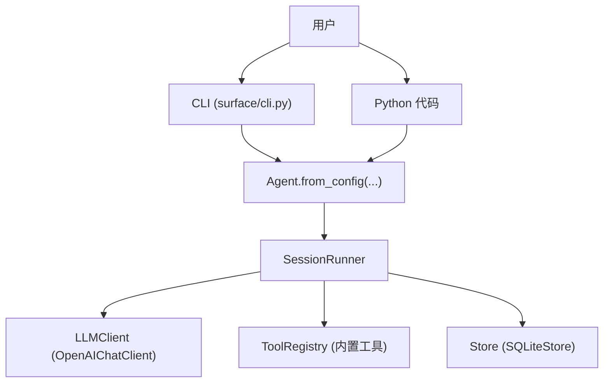
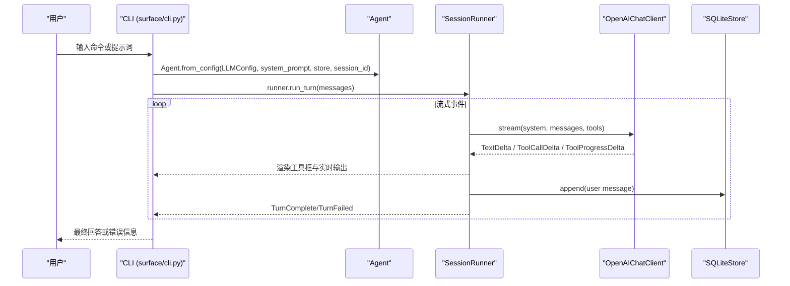
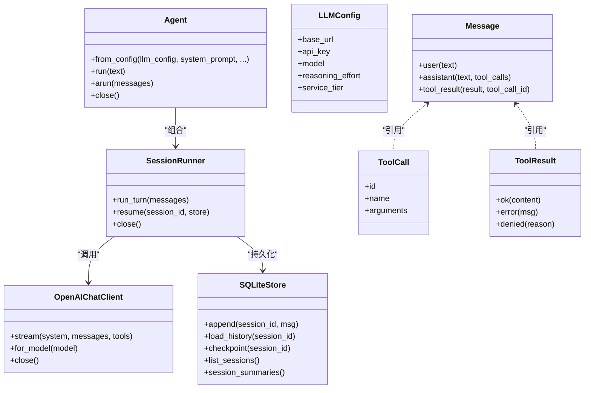

# 快速开始

<cite>
**本文引用的文件**   
- [README.md](file://README.md)
- [pyproject.toml](file://pyproject.toml)
- [src/microagent/__init__.py](file://src/microagent/__init__.py)
- [src/microagent/config.py](file://src/microagent/config.py)
- [src/microagent/agent.py](file://src/microagent/agent.py)
- [src/microagent/surface/cli.py](file://src/microagent/surface/cli.py)
- [src/microagent/core/types.py](file://src/microagent/core/types.py)
- [src/microagent/llm/client.py](file://src/microagent/llm/client.py)
- [src/microagent/core/store.py](file://src/microagent/core/store.py)
- [API.md](file://API.md)
</cite>

## 目录
1. [简介](#简介)
2. [项目结构](#项目结构)
3. [核心组件](#核心组件)
4. [架构总览](#架构总览)
5. [详细组件分析](#详细组件分析)
6. [依赖关系分析](#依赖关系分析)
7. [性能与使用建议](#性能与使用建议)
8. [故障排除指南](#故障排除指南)
9. [结论](#结论)
10. [附录：常用命令速查](#附录常用命令速查)

## 简介
MicroAgent 是一个可嵌入的 Python AI Agent 核心库，提供 LLM 对话循环、内置工具集、会话持久化、权限控制、预算树等能力。通过 pip 安装后，既可以用 Python API 快速构建 Agent，也可以通过命令行（CLI）进行一次性问答或交互式 REPL 对话。

本快速开始指南将帮助你在 5 分钟内完成安装、配置并运行第一个 Agent 对话。

## 项目结构
- 包入口与公共 API 集中在 src/microagent/__init__.py，暴露 Agent、Message、ToolCall、LLMConfig、Store、SessionRunner 等核心类型与类。
- CLI 入口由 pyproject.toml 的 scripts 定义，指向 surface.cli:main。
- 配置解析支持“CLI > 环境变量 > 配置文件 > 默认值”的优先级策略。
- LLM 客户端基于 OpenAI 兼容接口，通过 base_url 切换不同后端。

图表来源
- [pyproject.toml:56-58](file://pyproject.toml#L56-L58)
- [src/microagent/surface/cli.py:68-134](file://src/microagent/surface/cli.py#L68-L134)
- [src/microagent/agent.py:31-77](file://src/microagent/agent.py#L31-L77)
- [src/microagent/llm/client.py:163-192](file://src/microagent/llm/client.py#L163-L192)
- [src/microagent/core/store.py:95-108](file://src/microagent/core/store.py#L95-L108)

章节来源
- [pyproject.toml:56-58](file://pyproject.toml#L56-L58)
- [src/microagent/__init__.py:1-133](file://src/microagent/__init__.py#L1-L133)

## 核心组件
- Agent：对外统一入口，封装 SessionRunner、ToolRegistry、CronScheduler（可选），提供 run/arun 方法。
- Message/ToolCall/ToolResult：消息与工具调用/结果的标准数据结构。
- LLMConfig/OpenAIChatClient：OpenAI 兼容的 LLM 客户端，支持流式响应与工具调用累积。
- Store：会话持久化（SQLite WAL），支持追加、加载历史、检查点、列出会话。
- CLI：支持一次性模式与交互式 REPL，包含 /new、/list、/resume、/compact、/help 等命令。

章节来源
- [src/microagent/agent.py:23-113](file://src/microagent/agent.py#L23-L113)
- [src/microagent/core/types.py:17-116](file://src/microagent/core/types.py#L17-L116)
- [src/microagent/llm/client.py:93-118](file://src/microagent/llm/client.py#L93-L118)
- [src/microagent/core/store.py:95-151](file://src/microagent/core/store.py#L95-L151)
- [src/microagent/surface/cli.py:68-253](file://src/microagent/surface/cli.py#L68-L253)

## 架构总览
下图展示了从 CLI 到 Agent、Runner、LLM 和 Store 的交互流程，以及事件流（文本增量、工具调用、工具结果、完成/失败）。

图表来源
- [src/microagent/surface/cli.py:267-341](file://src/microagent/surface/cli.py#L267-L341)
- [src/microagent/agent.py:92-103](file://src/microagent/agent.py#L92-L103)
- [src/microagent/llm/client.py:219-328](file://src/microagent/llm/client.py#L219-L328)
- [src/microagent/core/store.py:122-140](file://src/microagent/core/store.py#L122-L140)

## 详细组件分析

### 安装与环境变量配置
- 安装
  - 使用 pip 安装 microagent。
- 环境变量
  - MICROAGENT_BASE_URL：LLM API 基础地址（如 https://api.openai.com/v1）
  - MICROAGENT_API_KEY：认证密钥
  - MICROAGENT_MODEL：模型名称（如 gpt-4o）
- 配置文件（可选）
  - 路径：~/.microagent/config.yaml
  - 字段：model.base_url、model.api_key、model.model、system_prompt、skills_path
- 优先级
  - CLI 参数 > 环境变量 > 配置文件 > 默认值

章节来源
- [README.md:14-58](file://README.md#L14-L58)
- [src/microagent/config.py:1-101](file://src/microagent/config.py#L1-L101)
- [API.md:1-69](file://API.md#L1-L69)

### CLI 使用方法
- 一次性模式
  - 设置环境变量后直接执行 microagent "你的问题"
- 交互式 REPL
  - 执行 microagent 进入交互模式，支持以下命令：
    - /new：新建会话
    - /list：列出已保存会话
    - /resume：恢复最近会话或指定会话 ID
    - /compact：手动压缩当前对话上下文
    - /help：查看帮助
- 输出特性
  - 工具调用以彩色方框展示，包含参数摘要与结果摘要
  - 支持思考过程（thinking）与内容（content）分块显示

章节来源
- [src/microagent/surface/cli.py:68-253](file://src/microagent/surface/cli.py#L68-L253)
- [src/microagent/surface/cli.py:362-374](file://src/microagent/surface/cli.py#L362-L374)

### 第一个 Agent 示例（Python API）
- 创建 Agent
  - 使用 Agent.from_config(LLMConfig(...), system_prompt=...)
- 发送消息
  - 字符串自动包装为 user 消息；也可传入 Message.user(...)
- 处理响应
  - arun 返回最终文本；run 同步封装异步调用
- 资源清理
  - 完成后调用 agent.close() 释放浏览器页面、LLM 客户端等资源

章节来源
- [README.md:22-38](file://README.md#L22-L38)
- [src/microagent/agent.py:31-113](file://src/microagent/agent.py#L31-L113)

### 基本消息格式（Message、ToolCall、ToolResult）
- Message
  - role：user / assistant / tool
  - content：文本内容
  - tool_calls：assistant 请求的工具调用列表
  - tool_call_id：tool 结果关联的调用 ID
  - usage：token 用量与成本估算
- ToolCall
  - id、name、arguments
- ToolResult
  - content、is_error、metadata
  - 工厂方法：ok、error、denied

章节来源
- [src/microagent/core/types.py:17-116](file://src/microagent/core/types.py#L17-L116)

### 交互式 REPL 工作流程
- 启动 CLI，解析参数与环境变量，构造 Config
- 初始化 SQLiteStore 与会话 ID
- 循环读取用户输入：
  - 若以 / 开头则执行命令（new/list/resume/compact/help）
  - 否则作为 user 消息追加到历史，调用 runner.run_turn 流式渲染
- 退出时关闭 Agent 与 Store

章节来源
- [src/microagent/surface/cli.py:74-253](file://src/microagent/surface/cli.py#L74-L253)

### 会话持久化与压缩
- 持久化
  - SQLiteStore 使用 WAL 模式，支持 append/load_history/checkpoint/list_sessions/session_summaries
- 压缩
  - 当消息数量较多或接近上下文窗口阈值时，触发四层压缩金字塔，保留关键信息与最近消息，删除旧 tool_result 等

章节来源
- [src/microagent/core/store.py:95-151](file://src/microagent/core/store.py#L95-L151)
- [src/microagent/surface/cli.py:199-236](file://src/microagent/surface/cli.py#L199-L236)

### 权限控制（可选）
- PermissionEngine 基于规则匹配（fnmatch）决定 ALLOW/DENY/ASK
- DEFAULT_RULES 允许大部分内置工具调用
- ScriptRule 支持外部脚本决策

章节来源
- [src/microagent/core/permission.py:71-213](file://src/microagent/core/permission.py#L71-L213)

## 依赖关系分析
- 包元数据与脚本入口
  - name/version/description 在 pyproject.toml
  - scripts 定义 microagent 命令入口
- 公共 API 导出
  - __init__.py 集中导出 Agent、Message、ToolCall、LLMConfig、Store、SessionRunner 等
- LLM 客户端
  - OpenAIChatClient 基于 openai SDK v2，支持流式与工具调用累积
- 存储
  - SQLiteStore 使用 sqlite3 与 WAL 模式

图表来源
- [src/microagent/agent.py:23-113](file://src/microagent/agent.py#L23-L113)
- [src/microagent/llm/client.py:163-192](file://src/microagent/llm/client.py#L163-L192)
- [src/microagent/core/store.py:95-151](file://src/microagent/core/store.py#L95-L151)
- [src/microagent/core/types.py:17-116](file://src/microagent/core/types.py#L17-L116)

章节来源
- [pyproject.toml:5-31](file://pyproject.toml#L5-L31)
- [src/microagent/__init__.py:1-133](file://src/microagent/__init__.py#L1-L133)

## 性能与使用建议
- 流式输出：CLI 与 Runner 均支持流式事件，提升交互体验
- 上下文压缩：当消息数超过阈值或接近模型上下文窗口时自动压缩，减少 token 消耗
- 预算控制：Budget 树形结构限制迭代次数与成本，避免无限循环
- 存储优化：SQLite WAL 模式提高写入并发与崩溃恢复能力

[本节为通用指导，不直接分析具体文件]

## 故障排除指南
- 未设置 API Key
  - CLI 启动时会警告未设置 API key，请确保 MICROAGENT_API_KEY 正确配置
- 认证或限流错误
  - OpenAIChatClient 对 401/403/429 错误进行重试与凭据轮换（若启用 CredentialPool）
- 工具执行失败
  - 工具异常会被捕获并继续循环，TurnComplete 仍会返回；可在日志中定位失败原因
- 预算耗尽
  - 达到 max_iterations 或成本上限时抛出 BudgetExceeded，导致 TurnFailed
- 压缩边界保护
  - 短对话不会触发压缩；错误结果不会被截断，保证调试信息完整

章节来源
- [src/microagent/surface/cli.py:104-112](file://src/microagent/surface/cli.py#L104-L112)
- [src/microagent/llm/client.py:194-215](file://src/microagent/llm/client.py#L194-L215)
- [tests/unit/test_runner_errors.py:1-91](file://tests/unit/test_runner_errors.py#L1-L91)
- [src/microagent/session/compress.py:139-179](file://src/microagent/session/compress.py#L139-L179)

## 结论
通过 MicroAgent，你可以在 5 分钟内完成安装、配置并运行第一个 AI Agent 对话。其清晰的 API、丰富的内置工具、灵活的配置与强大的会话管理能力，使得构建自定义 Agent 变得简单而高效。

[本节为总结性内容，不直接分析具体文件]

## 附录：常用命令速查
- 安装
  - pip install microagent
- 环境变量
  - export MICROAGENT_BASE_URL="https://api.openai.com/v1"
  - export MICROAGENT_API_KEY="sk-..."
  - export MICROAGENT_MODEL="gpt-4o"
- CLI 一次性模式
  - microagent "你的问题"
- CLI 交互模式
  - microagent
  - /new：新建会话
  - /list：列出会话
  - /resume：恢复会话
  - /compact：压缩上下文
  - /help：查看帮助

章节来源
- [README.md:14-58](file://README.md#L14-L58)
- [src/microagent/surface/cli.py:362-374](file://src/microagent/surface/cli.py#L362-L374)
- [API.md:1-69](file://API.md#L1-L69)