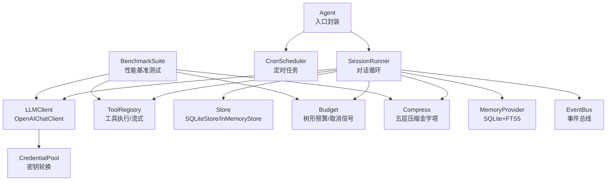
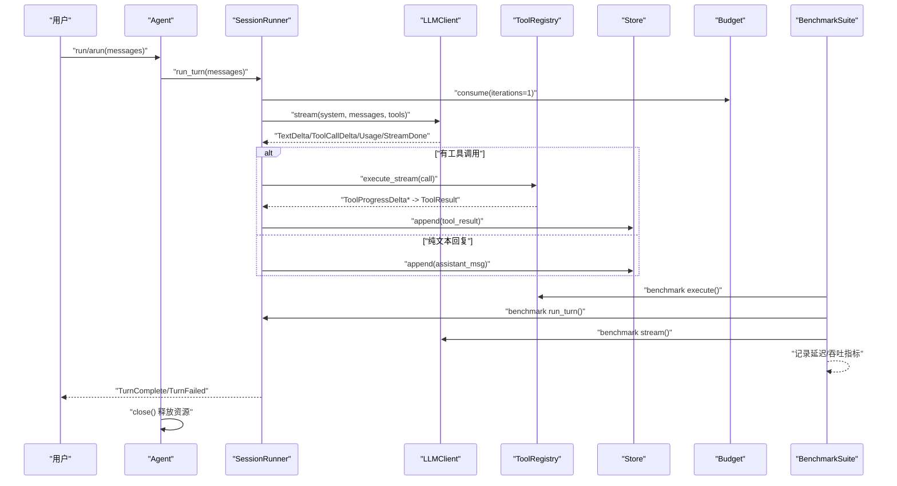
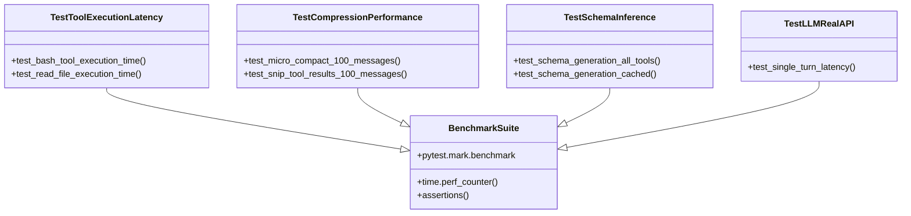
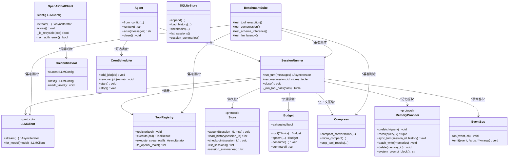

# 性能优化

<cite>
**本文引用的文件**   
- [agent.py](file://src/microagent/agent.py)
- [runner.py](file://src/microagent/session/runner.py)
- [budget.py](file://src/microagent/session/budget.py)
- [compress.py](file://src/microagent/session/compress.py)
- [store.py](file://src/microagent/core/store.py)
- [client.py](file://src/microagent/llm/client.py)
- [pool.py](file://src/microagent/llm/pool.py)
- [tool.py](file://src/microagent/core/tool.py)
- [provider.py](file://src/microagent/memory/provider.py)
- [extractor.py](file://src/microagent/memory/extractor.py)
- [scheduler.py](file://src/microagent/cron/scheduler.py)
- [event.py](file://src/microagent/core/event.py)
- [test_benchmarks.py](file://tests/benchmark/test_benchmarks.py)
- [fake_llm.py](file://tests/unit/fake_llm.py)
- [types.py](file://src/microagent/core/types.py)
</cite>

## 更新摘要
**变更内容**   
- 新增全面的基准测试套件章节，详细介绍test_benchmarks.py的性能验证框架
- 更新性能测试与基准测试流程，包含具体的基准测试用例和执行方法
- 增强监控与指标收集部分，集成基准测试结果分析
- 扩展故障排查指南，包含基准测试相关的性能问题诊断

## 目录
1. [简介](#简介)
2. [项目结构](#项目结构)
3. [核心组件](#核心组件)
4. [架构总览](#架构总览)
5. [详细组件分析](#详细组件分析)
6. [依赖关系分析](#依赖关系分析)
7. [性能考量](#性能考量)
8. [基准测试框架](#基准测试框架)
9. [故障排查指南](#故障排查指南)
10. [结论](#结论)
11. [附录](#附录)

## 简介
本指南面向 MicroAgent 的性能优化，覆盖异步编程最佳实践（asyncio 与 anyio）、内存管理与缓存策略、并发控制与限流、数据库查询优化、监控与指标收集、生产部署优化以及性能测试与基准测试流程。文档基于仓库中的实际实现进行分析，提供可操作的优化建议与可视化图示，帮助读者在不深入源码细节的前提下快速定位瓶颈并落地改进。

**更新** 新增了全面的基准测试套件，提供量化的性能验证框架，涵盖工具执行延迟、压缩性能、schema推断和LLM API延迟的基准测试。

## 项目结构
MicroAgent 的核心由"会话运行器 + LLM 客户端 + 工具注册表 + 存储/记忆 + 预算控制 + 压缩策略"构成。关键路径为 Agent → SessionRunner → LLMClient → ToolRegistry → Store/MemoryProvider，并通过 Budget 进行资源限制，通过 compress 模块进行上下文压缩。



**图表来源** 
- [agent.py:23-77](file://src/microagent/agent.py#L23-L77)
- [runner.py:40-101](file://src/microagent/session/runner.py#L40-L101)
- [client.py:163-218](file://src/microagent/llm/client.py#L163-L218)
- [tool.py:221-280](file://src/microagent/core/tool.py#L221-L280)
- [store.py:95-182](file://src/microagent/core/store.py#L95-L182)
- [budget.py:14-70](file://src/microagent/session/budget.py#L14-L70)
- [compress.py:324-421](file://src/microagent/session/compress.py#L324-L421)
- [provider.py:77-133](file://src/microagent/memory/provider.py#L77-L133)
- [pool.py:15-56](file://src/microagent/llm/pool.py#L15-L56)
- [event.py:16-37](file://src/microagent/core/event.py#L16-L37)
- [scheduler.py:28-91](file://src/microagent/cron/scheduler.py#L28-L91)
- [test_benchmarks.py:29-171](file://tests/benchmark/test_benchmarks.py#L29-L171)

**章节来源**
- [agent.py:23-77](file://src/microagent/agent.py#L23-L77)
- [runner.py:40-101](file://src/microagent/session/runner.py#L40-L101)

## 核心组件
- Agent：对外统一入口，封装同步/异步调用，负责资源清理。
- SessionRunner：核心对话循环，驱动 LLM 流式响应、工具调用、预算消耗、上下文压缩与持久化。
- LLMClient：抽象 LLM 接口，OpenAIChatClient 实现 SSE 流式解析、工具调用增量累积、失败重试与凭据轮换。
- ToolRegistry：工具注册与执行，支持流式工具输出与降级到非流式。
- Store：会话持久化（SQLite WAL），提供 append/load_history/checkpoint/list_sessions/session_summaries。
- MemoryProvider：跨会话记忆（SQLite + FTS5），支持召回、批量写入、删除与系统提示注入。
- Budget：树形预算，父子节点累计使用量，根节点共享取消事件，超限抛出异常。
- Compress：五层上下文压缩金字塔，零成本预处理、Snip、LLM 摘要、熔断与全量转储。
- EventBus：轻量发布订阅，观察者模式，异常吞掉不阻塞主循环。
- CronScheduler：基于 APScheduler 的定时任务调度，支持 cron/interval 触发与会话续传。
- **BenchmarkSuite**：全面的性能基准测试套件，提供量化的性能验证框架。

**章节来源**
- [agent.py:79-113](file://src/microagent/agent.py#L79-L113)
- [runner.py:118-284](file://src/microagent/session/runner.py#L118-L284)
- [client.py:163-328](file://src/microagent/llm/client.py#L163-L328)
- [tool.py:221-309](file://src/microagent/core/tool.py#L221-L309)
- [store.py:95-182](file://src/microagent/core/store.py#L95-L182)
- [provider.py:77-194](file://src/microagent/memory/provider.py#L77-L194)
- [budget.py:14-169](file://src/microagent/session/budget.py#L14-L169)
- [compress.py:324-421](file://src/microagent/session/compress.py#L324-L421)
- [event.py:16-37](file://src/microagent/core/event.py#L16-L37)
- [scheduler.py:28-133](file://src/microagent/cron/scheduler.py#L28-L133)
- [test_benchmarks.py:29-171](file://tests/benchmark/test_benchmarks.py#L29-L171)

## 架构总览
下图展示一次典型请求从 Agent 到 LLM、工具执行、预算与存储的完整时序，以及基准测试的集成点。



**图表来源** 
- [agent.py:79-113](file://src/microagent/agent.py#L79-L113)
- [runner.py:118-284](file://src/microagent/session/runner.py#L118-L284)
- [client.py:219-328](file://src/microagent/llm/client.py#L219-L328)
- [tool.py:256-280](file://src/microagent/core/tool.py#L256-L280)
- [store.py:122-148](file://src/microagent/core/store.py#L122-L148)
- [budget.py:99-130](file://src/microagent/session/budget.py#L99-L130)
- [test_benchmarks.py:29-171](file://tests/benchmark/test_benchmarks.py#L29-L171)

## 详细组件分析

### 异步编程与并发控制（anyio/asyncio）
- SessionRunner 使用 anyio.create_task_group 并发执行多个工具调用，保证进度事件及时回传，同时避免阻塞主循环。
- Agent 的同步入口通过 asyncio.run 启动事件循环；内部 arun 返回异步迭代器，适合高吞吐场景。
- MemoryExtractor 使用 asyncio.create_task 后台提取记忆，任务引用被跟踪防止 GC 提前回收。
- CronScheduler 基于 APScheduler 的 AsyncIOScheduler 调度任务，支持 interval/cron 触发。

优化要点
- 优先使用 anyio 的任务组管理并发，避免手动 asyncio.gather 导致的错误传播复杂化。
- 对长耗时 I/O（LLM 流式、网络请求、磁盘 IO）保持非阻塞；在工具中尽量返回 AsyncIterator 以支持流式进度。
- 合理设置超时与取消：利用 Budget 的共享 cancel_event 在根耗尽时快速中断子任务。

**章节来源**
- [runner.py:285-341](file://src/microagent/session/runner.py#L285-L341)
- [agent.py:79-113](file://src/microagent/agent.py#L79-L113)
- [extractor.py:80-92](file://src/microagent/memory/extractor.py#L80-L92)
- [scheduler.py:55-91](file://src/microagent/cron/scheduler.py#L55-91)

### 内存管理与缓存策略
- SQLiteStore：WAL 模式提升并发写性能，PRAGMA synchronous=NORMAL 降低 fsync 开销；索引 idx_session(session_id, seq) 加速按会话加载。
- InMemoryStore：用于单元测试，维护全局追加计数器模拟 recency 排序。
- MemoryProvider：SQLite + FTS5 全文检索，BM25 相关性评分；batch_write 批量写入减少事务开销。
- SessionRunner：缓存 system_prompt 与工具 schema，避免重复序列化与计算。
- Compress：五层上下文压缩金字塔，零成本预处理（截断可重获的工具结果）、Snip（移除最旧 tool_result）、LLM 摘要（增量更新）、熔断（冷却期）与全量转储（兜底）。

优化要点
- 对热点数据（system_prompt、工具 schema）做内存缓存；对大对象（消息历史）采用惰性加载与分页读取。
- 使用 WAL 与合适的 PRAGMA 配置提升 SQLite 并发读写性能；定期 checkpoint 控制 WAL 增长。
- 记忆提供者启用批量写入与预取（prefetch）以减少查询延迟。
- 压缩阈值按模型上下文窗口动态计算，避免频繁触发 LLM 摘要。

**章节来源**
- [store.py:95-182](file://src/microagent/core/store.py#L95-L182)
- [provider.py:77-194](file://src/microagent/memory/provider.py#L77-L194)
- [runner.py:136-184](file://src/microagent/session/runner.py#L136-L184)
- [compress.py:87-170](file://src/microagent/session/compress.py#L87-L170)
- [compress.py:324-421](file://src/microagent/session/compress.py#L324-L421)

### 并发控制与限流机制
- Budget：树形预算，父子累计使用量，根节点共享取消事件；当任一维度（迭代次数、tokens、费用）超限时抛出 BudgetExceeded。
- CredentialPool：API 密钥轮换，遇到认证/限流错误自动切换到下一个 key，全部失败后重置复用。
- OpenAIChatClient：识别 401/403/429 等可重试状态码，结合 pool 进行凭据切换与重试。

优化要点
- 为每个 Agent 实例创建 root Budget，并在子任务中使用 spawn 派生子预算，确保整体资源可控。
- 在高并发场景下，结合外部限流器（如令牌桶）与 CredentialPool 共同防止 API 限流。
- 对工具执行增加超时与最大并发数限制，避免单个慢工具拖垮整个会话。

**章节来源**
- [budget.py:14-169](file://src/microagent/session/budget.py#L14-L169)
- [pool.py:15-56](file://src/microagent/llm/pool.py#L15-L56)
- [client.py:193-218](file://src/microagent/llm/client.py#L193-L218)

### 数据库查询优化
- Store：WAL 模式、NORMAL 同步策略、外键开启；按 session_id+seq 索引；session_summaries 使用聚合查询避免 O(N) 逐条加载。
- MemoryProvider：FTS5 虚拟表 + BM25 相关性排序；删除操作需显式同步 FTS5 内容表。

优化要点
- 针对高频查询建立复合索引（如 session_id+seq）；避免 SELECT *，仅选择必要字段。
- 使用批量 INSERT/REPLACE 减少事务开销；对大文本字段考虑分表或归档。
- 定期 VACUUM 与 ANALYZE 维护统计信息，提升查询计划质量。

**章节来源**
- [store.py:110-178](file://src/microagent/core/store.py#L110-L178)
- [provider.py:106-194](file://src/microagent/memory/provider.py#L106-L194)

### 监控与指标收集
- EventBus：轻量事件总线，支持同步/异步回调，异常吞掉不阻塞主循环，可用于埋点与日志上报。
- SessionRunner：在 turn_complete 时通过 event_bus.emit("turn_complete", ...) 暴露完成事件；工具执行前后通过 hooks 扩展。
- Budget：summary() 提供迭代/tokens/费用统计；exhausted 属性便于快速判断。

优化要点
- 在 EventBus 上订阅关键事件（turn_complete、tool_progress_delta、budget_exhausted），采集 P95/P99 延迟、错误率、token 用量与费用。
- 将指标推送到 Prometheus/Grafana 或集中式日志系统，设置告警阈值（如费用超支、错误率突增）。

**章节来源**
- [event.py:16-37](file://src/microagent/core/event.py#L16-L37)
- [runner.py:249-262](file://src/microagent/session/runner.py#L249-L262)
- [budget.py:151-169](file://src/microagent/session/budget.py#L151-L169)

### 生产环境部署优化
- 容器资源配置：根据模型上下文窗口与并发度调整 CPU/内存；LLM 客户端连接池大小与超时时间需匹配上游服务 QPS。
- 负载均衡：多实例水平扩展，无状态会话设计（Store/MemoryProvider 外置至独立数据库/缓存）。
- 水平扩展：通过 CredentialPool 分散限流风险；CronScheduler 多实例需分布式锁避免重复执行。

优化要点
- 使用进程内缓存（LRU）缓存热数据（如工具 schema、系统提示）；对大对象（历史消息）使用外部缓存（Redis）并按 TTL 淘汰。
- 数据库连接池参数（max_connections、min_idle）按负载调优；WAL 模式下适当增大 cache_size。
- 监控关键指标：QPS、延迟分布、错误率、token 用量、费用、GC 停顿、线程/协程数量。

[本节为通用指导，不直接分析具体文件]

## 基准测试框架

**新增** MicroAgent 现在提供了全面的基准测试套件，位于 `tests/benchmark/test_benchmarks.py`，为性能优化提供了量化的验证框架。

### 基准测试架构



**图表来源** 
- [test_benchmarks.py:29-171](file://tests/benchmark/test_benchmarks.py#L29-L171)

### 工具执行延迟基准测试

基准测试套件包含两个核心的工具执行延迟测试：

1. **bash 工具执行时间测试**：验证简单命令的执行时间应小于 100ms
2. **read_file 工具执行时间测试**：验证小文件的读取时间应小于 50ms

这些测试使用 `time.perf_counter()` 进行高精度计时，确保工具执行的底层开销保持在合理范围内。

**章节来源**
- [test_benchmarks.py:32-57](file://tests/benchmark/test_benchmarks.py#L32-L57)

### 压缩性能基准测试

压缩性能测试涵盖两个关键的压缩层级：

1. **micro_compact 测试**：验证 100 条消息的微压缩应在 50ms 内完成，并确保实际压缩效果
2. **snip_tool_results 测试**：验证 100 条消息的 snip 操作应在 50ms 内完成

测试使用合成数据生成大量工具结果，验证压缩算法在处理大数据集时的性能表现。

**章节来源**
- [test_benchmarks.py:63-98](file://tests/benchmark/test_benchmarks.py#L63-L98)

### Schema 推断基准测试

Schema 推断测试关注 Pydantic v2 的 schema 生成性能：

1. **全量工具 schema 生成**：验证 24 个工具的 schema 生成应在 100ms 内完成
2. **缓存 schema 生成**：验证第二次调用时应接近即时（如果已缓存）

这些测试确保工具注册表的 schema 导出功能不会成为性能瓶颈。

**章节来源**
- [test_benchmarks.py:103-127](file://tests/benchmark/test_benchmarks.py#L103-L127)

### LLM API 端到端延迟测试

LLM API 测试提供真实的端到端延迟测量：

- **单轮对话延迟测试**：测量完整的 user → tool call → result → text 流程
- **环境变量配置**：需要设置 MICROAGENT_TEST_BASE_URL、MICROAGENT_TEST_API_KEY、MICROAGENT_TEST_MODEL
- **超时保护**：简单提示的单轮对话应在 30 秒内完成

该测试使用 FakeLLMClient 进行单元测试，或使用真实 LLM API 进行集成测试。

**章节来源**
- [test_benchmarks.py:137-171](file://tests/benchmark/test_benchmarks.py#L137-L171)

### 基准测试执行方法

```bash
# 运行所有基准测试
pytest tests/benchmark/ -v -s

# 只运行特定类别的基准测试
pytest tests/benchmark/ -v -s -k "ToolExecution"
pytest tests/benchmark/ -v -s -k "Compression"
pytest tests/benchmark/ -v -s -k "Schema"
pytest tests/benchmark/ -v -s -k "LLM"

# 运行集成测试（需要环境变量）
export MICROAGENT_TEST_BASE_URL=https://api.openai.com
export MICROAGENT_TEST_API_KEY=your-api-key
export MICROAGENT_TEST_MODEL=gpt-4
pytest tests/benchmark/ -v -s -m integration
```

**章节来源**
- [test_benchmarks.py:1-6](file://tests/benchmark/test_benchmarks.py#L1-L6)

## 依赖关系分析


**图表来源** 
- [agent.py:23-77](file://src/microagent/agent.py#L23-L77)
- [runner.py:40-101](file://src/microagent/session/runner.py#L40-L101)
- [client.py:141-218](file://src/microagent/llm/client.py#L141-L218)
- [tool.py:221-309](file://src/microagent/core/tool.py#L221-L309)
- [store.py:28-182](file://src/microagent/core/store.py#L28-L182)
- [budget.py:14-169](file://src/microagent/session/budget.py#L14-L169)
- [compress.py:324-421](file://src/microagent/session/compress.py#L324-L421)
- [provider.py:43-194](file://src/microagent/memory/provider.py#L43-L194)
- [pool.py:15-56](file://src/microagent/llm/pool.py#L15-L56)
- [event.py:16-37](file://src/microagent/core/event.py#L16-L37)
- [scheduler.py:28-91](file://src/microagent/cron/scheduler.py#L28-L91)
- [test_benchmarks.py:29-171](file://tests/benchmark/test_benchmarks.py#L29-L171)

## 性能考量
- 异步 I/O 优先：所有网络与磁盘操作保持非阻塞，避免阻塞事件循环。
- 流式处理：LLM 与工具均支持流式输出，降低首字节延迟，提升用户体验。
- 预算控制：通过 Budget 限制迭代、tokens、费用，防止资源耗尽；根节点共享取消事件快速中断。
- 上下文压缩：五层金字塔按需触发，零成本预处理优先，减少 LLM 调用成本。
- 数据库优化：WAL、索引、批量写入、定期 checkpoint，降低 I/O 压力。
- 缓存策略：系统提示、工具 schema、热点记忆使用内存缓存；大对象外置缓存并按 TTL 淘汰。
- 监控埋点：通过 EventBus 采集关键指标，设置告警阈值，及时发现异常。
- **基准测试**：使用 pytest-benchmark 框架进行量化性能验证，确保性能回归检测。

[本节为通用指导，不直接分析具体文件]

## 故障排查指南
- 常见问题：
  - LLM 响应被截断：检查 StreamDone.stop_reason 是否为 length，确认预算与上下文窗口设置。
  - 预算耗尽：查看 Budget.summary() 与 exhausted 属性，调整 max_iterations/max_tokens/max_cost_usd。
  - 工具执行失败：检查 ToolResult.is_error 与错误信息，必要时增加重试与超时。
  - 数据库写入缓慢：检查 WAL 大小、索引命中率、PRAGMA 配置，必要时 VACUUM/ANALYZE。
  - 凭据限流：CredentialPool.mark_failed() 是否被调用，确认 401/403/429 处理逻辑。
  - **基准测试失败**：检查时间阈值设置是否合理，确认测试环境配置正确。
- 调试技巧：
  - 启用详细日志（logging），记录关键事件（turn_complete、tool_progress_delta、budget_exhausted）。
  - 使用 InMemoryStore 替代 SQLiteStore 隔离 I/O 问题。
  - 通过 EventBus 订阅事件，实时观察状态变化。
  - **运行基准测试**：使用 `pytest tests/benchmark/ -v -s` 执行性能基准测试，定位性能瓶颈。
  - **分析基准结果**：关注 P50/P95/P99 延迟指标，对比历史数据进行性能回归检测。

**章节来源**
- [runner.py:205-284](file://src/microagent/session/runner.py#L205-L284)
- [budget.py:151-169](file://src/microagent/session/budget.py#L151-L169)
- [tool.py:256-280](file://src/microagent/core/tool.py#L256-L280)
- [store.py:141-178](file://src/microagent/core/store.py#L141-L178)
- [client.py:193-218](file://src/microagent/llm/client.py#L193-L218)
- [test_benchmarks.py:29-171](file://tests/benchmark/test_benchmarks.py#L29-L171)

## 结论
MicroAgent 在异步编程、预算控制、上下文压缩与数据库优化方面提供了坚实基础。通过合理利用 anyio/asyncio、CredentialPool、Budget、Compress 与 SQLite WAL/FTS5，可在高并发与长对话场景下保持稳定性能。**新增的全面基准测试套件为性能优化提供了量化的验证框架**，确保工具执行延迟、压缩性能、schema 推断和 LLM API 延迟都在预期范围内。建议在生产环境中结合监控指标与压测数据持续调优，确保资源利用率与用户体验达到最优。

[本节为总结，不直接分析具体文件]

## 附录
- 推荐监控指标：QPS、P50/P95/P99 延迟、错误率、token 用量、费用、压缩触发次数、DB 查询耗时、GC 停顿、协程数量。
- 压测工具：locust、pytest-asyncio + aiohttp、wrk（HTTP 层）。
- 数据库维护：定期 VACUUM、ANALYZE、checkpoint，监控 WAL 文件大小。
- **基准测试框架**：pytest-benchmark，支持标记 `@pytest.mark.benchmark` 的测试用例。
- **基准测试执行**：`pytest tests/benchmark/ -v -s` 运行所有基准测试，`pytest tests/benchmark/ -v -s -k "Category"` 运行特定类别测试。
- **集成测试配置**：设置 MICROAGENT_TEST_* 环境变量运行真实 LLM API 测试。

[本节为通用指导，不直接分析具体文件]