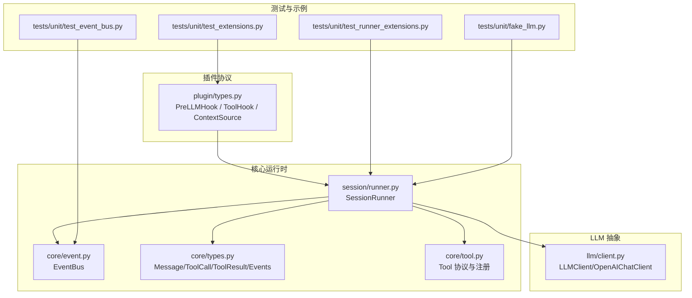
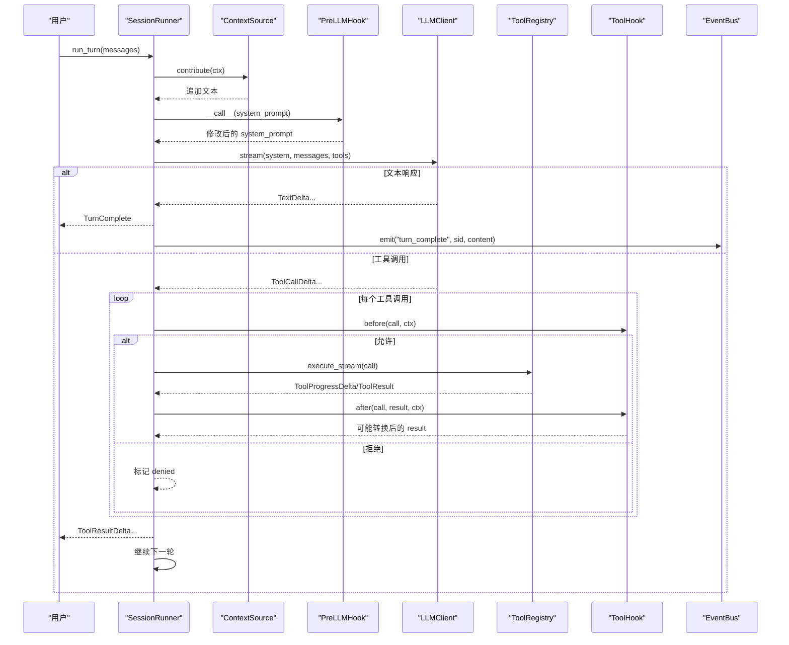
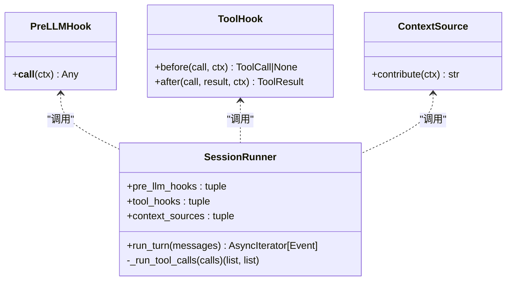
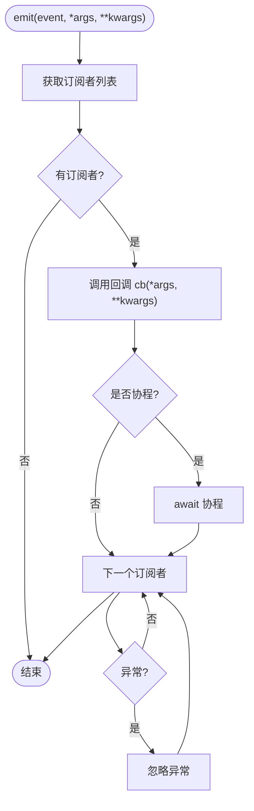
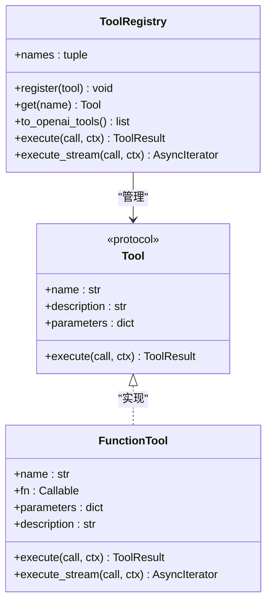
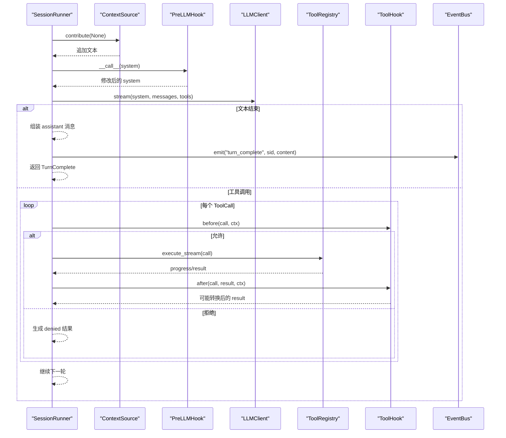
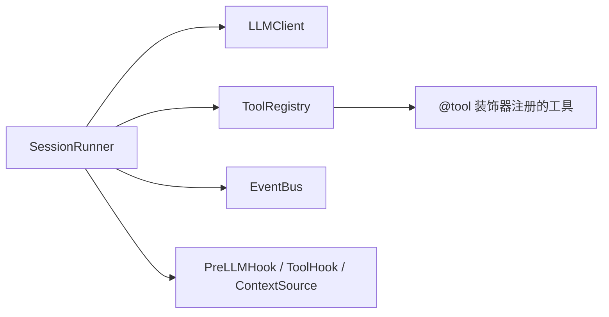

# 扩展点开发

<cite>
**本文引用的文件**   
- [src/microagent/plugin/types.py](file://src/microagent/plugin/types.py)
- [src/microagent/session/runner.py](file://src/microagent/session/runner.py)
- [src/microagent/core/event.py](file://src/microagent/core/event.py)
- [src/microagent/core/tool.py](file://src/microagent/core/tool.py)
- [src/microagent/core/types.py](file://src/microagent/core/types.py)
- [src/microagent/llm/client.py](file://src/microagent/llm/client.py)
- [tests/unit/test_event_bus.py](file://tests/unit/test_event_bus.py)
- [tests/unit/test_extensions.py](file://tests/unit/test_extensions.py)
- [tests/unit/test_runner_extensions.py](file://tests/unit/test_runner_extensions.py)
- [tests/unit/fake_llm.py](file://tests/unit/fake_llm.py)
- [API.md](file://API.md)
</cite>

## 目录
1. [简介](#简介)
2. [项目结构](#项目结构)
3. [核心组件](#核心组件)
4. [架构总览](#架构总览)
5. [详细组件分析](#详细组件分析)
6. [依赖关系分析](#依赖关系分析)
7. [性能考量](#性能考量)
8. [故障排查指南](#故障排查指南)
9. [结论](#结论)
10. [附录](#附录)

## 简介
本指南面向希望为 MicroAgent 开发扩展的工程师，围绕三大扩展协议展开：PreLLMHook（在 LLM 调用前修改 system prompt）、ToolHook（拦截工具调用前后逻辑）、ContextSource（注入动态上下文内容）。文档同时详解 EventBus 事件总线的使用方式、零开销设计原则、扩展点的注册与加载机制、与核心系统的集成方式，并提供审计日志、权限检查、上下文增强等常见场景的完整示例。最后给出性能优化建议与调试测试方法，确保扩展不会引入不必要的开销。

## 项目结构
MicroAgent 将扩展点协议定义在 plugin 模块，核心执行流在 session.runner 中串联 LLM 调用、工具执行与事件发布；事件总线位于 core.event；工具协议与类型定义位于 core.tool 与 core.types；LLM 客户端抽象在 llm.client。测试用例覆盖事件总线、扩展点协议以及 SessionRunner 与扩展点的集成行为。

图表来源
- [src/microagent/plugin/types.py:1-37](file://src/microagent/plugin/types.py#L1-L37)
- [src/microagent/session/runner.py:40-100](file://src/microagent/session/runner.py#L40-L100)
- [src/microagent/core/event.py:16-37](file://src/microagent/core/event.py#L16-L37)
- [src/microagent/core/tool.py:40-50](file://src/microagent/core/tool.py#L40-L50)
- [src/microagent/core/types.py:17-189](file://src/microagent/core/types.py#L17-L189)
- [src/microagent/llm/client.py:141-156](file://src/microagent/llm/client.py#L141-L156)
- [tests/unit/test_event_bus.py:1-52](file://tests/unit/test_event_bus.py#L1-L52)
- [tests/unit/test_extensions.py:1-76](file://tests/unit/test_extensions.py#L1-L76)
- [tests/unit/test_runner_extensions.py:1-109](file://tests/unit/test_runner_extensions.py#L1-L109)
- [tests/unit/fake_llm.py:22-58](file://tests/unit/fake_llm.py#L22-L58)

章节来源
- [src/microagent/plugin/types.py:1-37](file://src/microagent/plugin/types.py#L1-L37)
- [src/microagent/session/runner.py:40-100](file://src/microagent/session/runner.py#L40-L100)
- [src/microagent/core/event.py:16-37](file://src/microagent/core/event.py#L16-L37)
- [src/microagent/core/tool.py:40-50](file://src/microagent/core/tool.py#L40-L50)
- [src/microagent/core/types.py:17-189](file://src/microagent/core/types.py#L17-L189)
- [src/microagent/llm/client.py:141-156](file://src/microagent/llm/client.py#L141-L156)
- [tests/unit/test_event_bus.py:1-52](file://tests/unit/test_event_bus.py#L1-L52)
- [tests/unit/test_extensions.py:1-76](file://tests/unit/test_extensions.py#L1-L76)
- [tests/unit/test_runner_extensions.py:1-109](file://tests/unit/test_runner_extensions.py#L1-L109)
- [tests/unit/fake_llm.py:22-58](file://tests/unit/fake_llm.py#L22-L58)

## 核心组件
- 扩展点协议
  - PreLLMHook：可调用对象，接收系统提示字符串并返回修改后的字符串，用于在 LLM 调用前注入或改写指令。
  - ToolHook：包含 before 与 after 两个钩子，before 可拒绝或修改 ToolCall，after 可转换 ToolResult。
  - ContextSource：contribute 方法返回一段文本，追加到 system prompt 中，实现动态上下文注入。
- 事件总线 EventBus
  - 轻量级发布订阅，支持同步与异步回调，异常被吞掉以保证主循环稳定。
- 工具协议与注册
  - Tool 协议与 FunctionTool 适配器，@tool 装饰器自动推断参数 Schema 并注册工具。
- 会话运行器 SessionRunner
  - 串联 LLM 流式响应、工具调用、预算控制、压缩、技能匹配、上下文注入与扩展点调用。
- LLM 客户端
  - LLMClient 协议与 OpenAIChatClient 实现，统一消息格式与流式事件。

章节来源
- [src/microagent/plugin/types.py:17-37](file://src/microagent/plugin/types.py#L17-L37)
- [src/microagent/core/event.py:16-37](file://src/microagent/core/event.py#L16-L37)
- [src/microagent/core/tool.py:40-50](file://src/microagent/core/tool.py#L40-L50)
- [src/microagent/core/tool.py:177-214](file://src/microagent/core/tool.py#L177-L214)
- [src/microagent/session/runner.py:40-100](file://src/microagent/session/runner.py#L40-L100)
- [src/microagent/llm/client.py:141-156](file://src/microagent/llm/client.py#L141-L156)

## 架构总览
下图展示了扩展点在会话轮次中的接入位置与数据流向：ContextSource 先注入系统提示，随后 PreLLMHook 进一步处理；LLM 返回后若存在工具调用，则进入 ToolHook 的 before/after 阶段，最终通过 EventBus 发出 turn_complete 事件。

图表来源
- [src/microagent/session/runner.py:175-184](file://src/microagent/session/runner.py#L175-L184)
- [src/microagent/session/runner.py:264-341](file://src/microagent/session/runner.py#L264-L341)
- [src/microagent/core/event.py:26-37](file://src/microagent/core/event.py#L26-L37)
- [src/microagent/core/tool.py:256-280](file://src/microagent/core/tool.py#L256-L280)
- [src/microagent/llm/client.py:219-328](file://src/microagent/llm/client.py#L219-L328)

## 详细组件分析

### 扩展点协议与使用
- PreLLMHook
  - 作用：在 LLM 调用前对 system prompt 进行二次加工，例如添加语言偏好、安全策略、任务约束等。
  - 接口：__call__(ctx) -> ctx，其中 ctx 在当前实现中为 system_prompt 字符串。
  - 集成点：SessionRunner.run_turn 在拼接完 ContextSource 贡献的内容后，依次调用 pre_llm_hooks。
- ToolHook
  - 作用：拦截工具调用，before 可拒绝或改写调用参数；after 可对结果进行脱敏、审计或统计。
  - 接口：before(call, ctx) -> call|None；after(call, result, ctx) -> result。
  - 集成点：SessionRunner._run_tool_calls 在执行工具前后遍历 tool_hooks。
- ContextSource
  - 作用：向 system prompt 注入动态上下文，如 Git 分支信息、当前工作区状态、用户画像等。
  - 接口：contribute(ctx) -> str。
  - 集成点：SessionRunner.run_turn 在构建 system 时按顺序调用 context_sources。

图表来源
- [src/microagent/plugin/types.py:17-37](file://src/microagent/plugin/types.py#L17-L37)
- [src/microagent/session/runner.py:175-184](file://src/microagent/session/runner.py#L175-L184)
- [src/microagent/session/runner.py:285-341](file://src/microagent/session/runner.py#L285-L341)

章节来源
- [src/microagent/plugin/types.py:17-37](file://src/microagent/plugin/types.py#L17-L37)
- [src/microagent/session/runner.py:175-184](file://src/microagent/session/runner.py#L175-L184)
- [src/microagent/session/runner.py:285-341](file://src/microagent/session/runner.py#L285-L341)
- [tests/unit/test_extensions.py:1-76](file://tests/unit/test_extensions.py#L1-L76)

### 事件总线 EventBus
- 设计要点
  - 观察者模式：仅支持监听，不改变事件载荷。
  - 零开销：无订阅者时直接跳过；异常被捕获，不影响主循环。
  - 兼容同步与异步回调：emit 内部检测协程并 await。
- 典型用法
  - 订阅 turn_complete 事件以记录对话完成、触发下游动作。
  - 多订阅者顺序执行，适合审计、监控、指标上报等横切关注点。

图表来源
- [src/microagent/core/event.py:26-37](file://src/microagent/core/event.py#L26-L37)

章节来源
- [src/microagent/core/event.py:16-37](file://src/microagent/core/event.py#L16-L37)
- [tests/unit/test_event_bus.py:1-52](file://tests/unit/test_event_bus.py#L1-L52)

### 工具协议与注册
- Tool 协议
  - name、description、parameters（OpenAI function JSON Schema）
  - execute(call, ctx) -> ToolResult
- FunctionTool
  - 包装普通 async 函数为 Tool，支持流式输出（AsyncIterator[str]），自动转换为 ToolProgressDelta。
- @tool 装饰器
  - 基于 Pydantic v2 从函数签名推断参数 Schema，并将工具注册到模块级 _registry。
- ToolRegistry
  - 管理工具集合，提供 to_openai_tools() 导出、execute/execute_stream 分发。

图表来源
- [src/microagent/core/tool.py:40-50](file://src/microagent/core/tool.py#L40-L50)
- [src/microagent/core/tool.py:60-118](file://src/microagent/core/tool.py#L60-L118)
- [src/microagent/core/tool.py:177-214](file://src/microagent/core/tool.py#L177-L214)
- [src/microagent/core/tool.py:221-280](file://src/microagent/core/tool.py#L221-L280)

章节来源
- [src/microagent/core/tool.py:40-50](file://src/microagent/core/tool.py#L40-L50)
- [src/microagent/core/tool.py:177-214](file://src/microagent/core/tool.py#L177-L214)
- [src/microagent/core/tool.py:221-280](file://src/microagent/core/tool.py#L221-L280)

### 会话运行器与扩展点集成
- 系统提示构建流程
  - 初始 system_prompt → 追加 ContextSource 贡献 → 依次调用 PreLLMHook → 缓存 system 与工具 schema。
- 工具调用流程
  - 并发执行工具调用，支持流式进度事件；ToolHook.before 可拒绝或改写调用；ToolHook.after 可转换结果。
- 事件发布
  - 当一轮对话正常结束时，通过 EventBus 发布 turn_complete 事件。

图表来源
- [src/microagent/session/runner.py:175-184](file://src/microagent/session/runner.py#L175-L184)
- [src/microagent/session/runner.py:264-341](file://src/microagent/session/runner.py#L264-L341)
- [src/microagent/core/event.py:26-37](file://src/microagent/core/event.py#L26-L37)
- [src/microagent/core/tool.py:256-280](file://src/microagent/core/tool.py#L256-L280)

章节来源
- [src/microagent/session/runner.py:175-184](file://src/microagent/session/runner.py#L175-L184)
- [src/microagent/session/runner.py:264-341](file://src/microagent/session/runner.py#L264-L341)
- [tests/unit/test_runner_extensions.py:1-109](file://tests/unit/test_runner_extensions.py#L1-L109)

### 常见扩展场景示例
- 审计日志
  - 实现 ToolHook，在 before 记录调用名与参数摘要，在 after 记录耗时与结果摘要。
- 权限检查
  - 实现 ToolHook.before，结合规则引擎（如 PermissionEngine）判断是否允许执行，返回 None 表示拒绝。
- 上下文增强
  - 实现 ContextSource，读取 Git 分支、最近提交、环境变量等，返回追加文本。
- 安全过滤
  - 实现 ToolHook.after，对敏感字段进行脱敏或替换。

章节来源
- [API.md:196-226](file://API.md#L196-L226)
- [src/microagent/core/permission.py:71-96](file://src/microagent/core/permission.py#L71-L96)
- [tests/unit/test_extensions.py:1-76](file://tests/unit/test_extensions.py#L1-L76)

## 依赖关系分析
- SessionRunner 依赖
  - LLMClient：用于流式对话与工具调用事件。
  - ToolRegistry：工具发现与执行。
  - EventBus：可选的事件发布。
  - 扩展点：pre_llm_hooks、tool_hooks、context_sources。
- 扩展点协议与实现解耦
  - 通过 PEP 544 Protocol 实现结构子类型，无需继承基类，降低耦合。
- 工具注册与发现
  - @tool 装饰器将工具注册到模块级 _registry，由 _default_builtins 收集。

图表来源
- [src/microagent/session/runner.py:40-100](file://src/microagent/session/runner.py#L40-L100)
- [src/microagent/core/tool.py:177-214](file://src/microagent/core/tool.py#L177-L214)
- [src/microagent/core/tool.py:282-309](file://src/microagent/core/tool.py#L282-L309)

章节来源
- [src/microagent/session/runner.py:40-100](file://src/microagent/session/runner.py#L40-L100)
- [src/microagent/core/tool.py:177-214](file://src/microagent/core/tool.py#L177-L214)
- [src/microagent/core/tool.py:282-309](file://src/microagent/core/tool.py#L282-L309)

## 性能考量
- 零开销事件总线
  - 无订阅者时 emit 直接返回；异常被吞掉，避免阻塞主循环。
- 系统提示缓存
  - SessionRunner 缓存 system 与工具 schema，避免重复计算与序列化。
- 流式工具输出
  - 工具返回 AsyncIterator[str] 时，实时推送进度，减少等待时间。
- 并发工具执行
  - 使用任务组并发执行多个工具调用，提升吞吐。
- 预算与压缩
  - 预算耗尽及时中断；长对话按需压缩，控制 token 消耗。

章节来源
- [src/microagent/core/event.py:26-37](file://src/microagent/core/event.py#L26-L37)
- [src/microagent/session/runner.py:181-184](file://src/microagent/session/runner.py#L181-L184)
- [src/microagent/core/tool.py:81-118](file://src/microagent/core/tool.py#L81-L118)
- [src/microagent/session/runner.py:333-341](file://src/microagent/session/runner.py#L333-L341)

## 故障排查指南
- 事件未触发
  - 确认 event_bus 已传入 SessionRunner；检查订阅是否正确注册。
- 扩展点未生效
  - 确认 hooks/sources 已正确传入 SessionRunner；检查返回值是否符合协议。
- 工具被拒绝
  - 检查 ToolHook.before 是否返回 None；必要时打印 or 记录原因。
- 流式输出缺失
  - 确认工具实现支持 execute_stream 或返回 AsyncIterator[str]。
- 调试技巧
  - 使用 tests/unit/fake_llm.py 构造固定响应序列，验证扩展点行为。
  - 通过 EventBus 订阅中间事件，定位问题阶段。

章节来源
- [tests/unit/test_runner_extensions.py:10-31](file://tests/unit/test_runner_extensions.py#L10-L31)
- [tests/unit/test_extensions.py:18-62](file://tests/unit/test_extensions.py#L18-L62)
- [tests/unit/fake_llm.py:22-58](file://tests/unit/fake_llm.py#L22-L58)

## 结论
MicroAgent 的扩展点体系通过轻量协议与清晰的集成点，实现了低耦合、高可扩展的 Agent 行为定制能力。配合 EventBus 的零开销设计与流式工具输出，开发者可以在不侵入核心代码的前提下，灵活实现审计、权限、上下文增强等横切功能。遵循本文的最佳实践与测试方法，可确保扩展稳定高效地融入核心系统。

## 附录
- 快速上手
  - 参考 API.md 中的扩展点示例，创建 PreLLMHook、ToolHook、ContextSource 并在 SessionRunner 中注入。
- 测试模板
  - 使用 tests/unit/fake_llm.py 的 text_response 与 tool_response 构造断言场景。
- 扩展点协议参考
  - src/microagent/plugin/types.py 定义了三个协议的完整签名与语义。

章节来源
- [API.md:196-226](file://API.md#L196-L226)
- [tests/unit/fake_llm.py:79-110](file://tests/unit/fake_llm.py#L79-L110)
- [src/microagent/plugin/types.py:17-37](file://src/microagent/plugin/types.py#L17-L37)