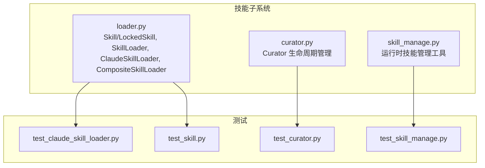
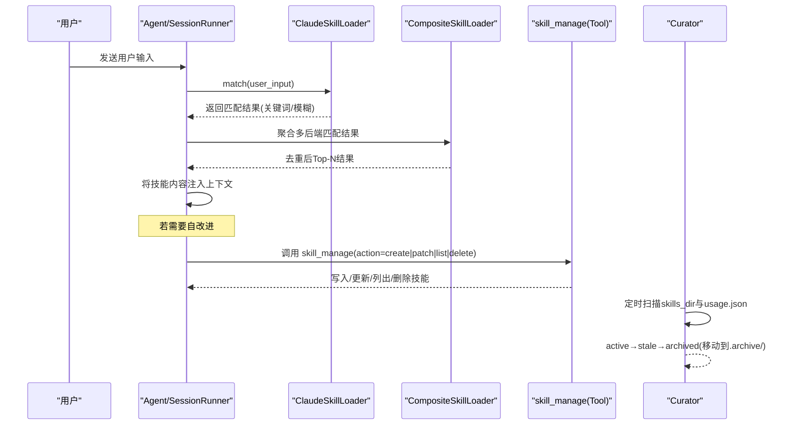
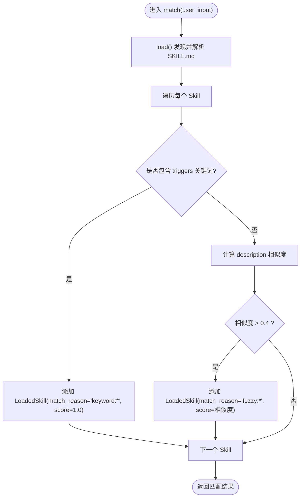
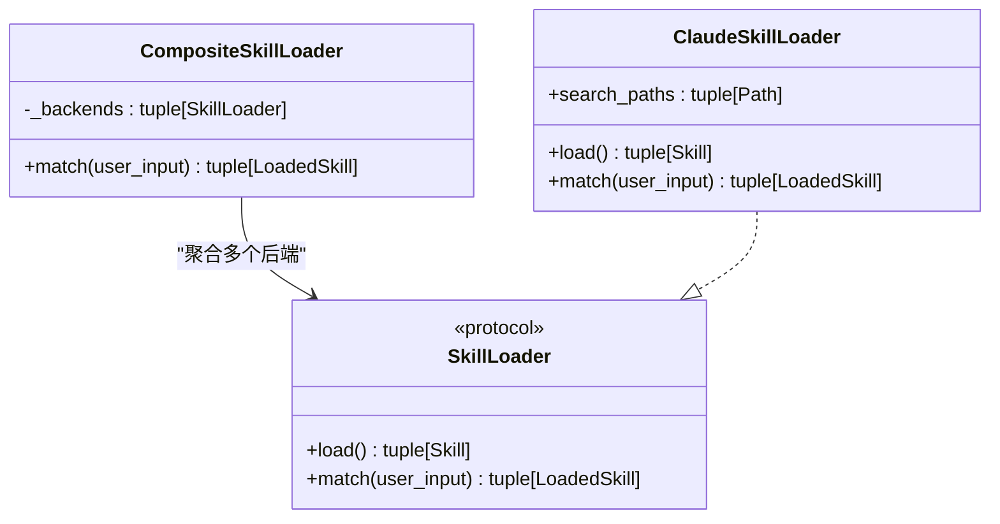
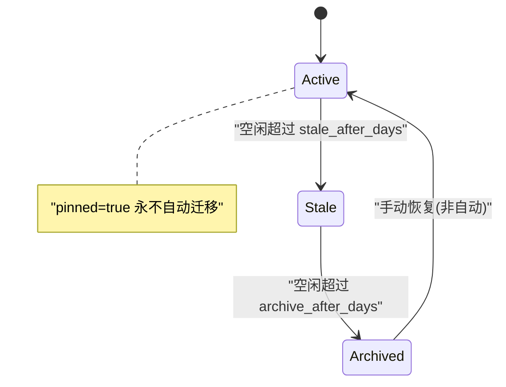
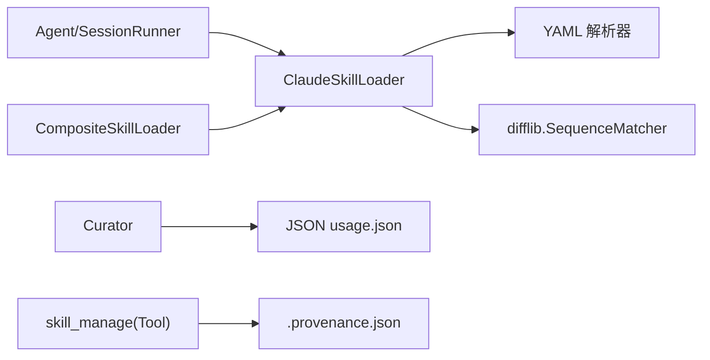

# 技能系统

<cite>
**本文引用的文件**   
- [loader.py](file://src/microagent/skill/loader.py)
- [curator.py](file://src/microagent/skill/curator.py)
- [skill_manage.py](file://src/microagent/tools/builtins/skill_manage.py)
- [README.md](file://README.md)
- [test_claude_skill_loader.py](file://tests/unit/test_claude_skill_loader.py)
- [test_curator.py](file://tests/unit/test_curator.py)
- [test_skill.py](file://tests/unit/test_skill.py)
- [test_skill_manage.py](file://tests/unit/test_skill_manage.py)
</cite>

## 目录
1. [简介](#简介)
2. [项目结构](#项目结构)
3. [核心组件](#核心组件)
4. [架构总览](#架构总览)
5. [详细组件分析](#详细组件分析)
6. [依赖关系分析](#依赖关系分析)
7. [性能考量](#性能考量)
8. [故障排查指南](#故障排查指南)
9. [结论](#结论)
10. [附录：SKILL.md 规范与开发指南](#附录skillmd-规范与开发指南)

## 简介
本文件系统性梳理 MicroAgent 的技能（Skill）体系，涵盖 SKILL.md 文件格式与语义、Claude Skill 加载器与匹配算法、组合加载器的去重排序机制、Curator 的策展生命周期（创建/更新/删除/归档），以及技能开发与测试部署的最佳实践。同时给出与 Claude Code 等生态工具的兼容方式与集成建议。

## 项目结构
MicroAgent 的技能子系统位于 src/microagent/skill 目录，包含两个关键模块：
- loader.py：定义 Skill/LockedSkill 数据模型、SkillLoader 协议、ClaudeSkillLoader 实现、CompositeSkillLoader 组合器
- curator.py：实现 Curator 后台策展器，负责基于使用统计的状态迁移与归档

此外，内置工具 skill_manage.py 提供运行时创建/补丁/列表/删除技能的能力，配合 Curator 形成“自改进”闭环。

图表来源
- [loader.py:1-160](file://src/microagent/skill/loader.py#L1-L160)
- [curator.py:1-103](file://src/microagent/skill/curator.py#L1-L103)
- [skill_manage.py:1-106](file://src/microagent/tools/builtins/skill_manage.py#L1-L106)
- [test_claude_skill_loader.py:1-91](file://tests/unit/test_claude_skill_loader.py#L1-L91)
- [test_curator.py:1-122](file://tests/unit/test_curator.py#L1-L122)
- [test_skill.py:1-37](file://tests/unit/test_skill.py#L1-L37)
- [test_skill_manage.py:1-147](file://tests/unit/test_skill_manage.py#L1-L147)

章节来源
- [README.md:368-382](file://README.md#L368-L382)

## 核心组件
- 数据模型
  - Skill：描述一个技能的元信息与正文，包括名称、命名空间、描述、正文、触发词、来源路径、修改时间
  - LoadedSkill：将 Skill 与匹配原因和分数绑定，用于上层决策
- 加载器协议
  - SkillLoader：统一接口 load() 与 match()，支持多后端（如 Claude Code、agentskills.io、用户自定义）
- 具体实现
  - ClaudeSkillLoader：从文件系统递归发现 SKILL.md，解析 YAML frontmatter，支持关键词触发与模糊描述匹配
  - CompositeSkillLoader：聚合多个后端结果，按 namespace:name 去重，按 match_score 降序取 Top-N
- 策展器
  - Curator：周期性扫描 agent 创建的技能，依据 idle 时长在 active/stale/archived 之间迁移，并归档到 .archive/
- 运行时管理
  - skill_manage：通过 Tool 接口暴露 create/patch/list/delete 能力，写入 ~/.microagent/skills/<name>/SKILL.md，并记录 provenance

章节来源
- [loader.py:23-56](file://src/microagent/skill/loader.py#L23-L56)
- [loader.py:63-82](file://src/microagent/skill/loader.py#L63-L82)
- [loader.py:89-116](file://src/microagent/skill/loader.py#L89-L116)
- [loader.py:119-160](file://src/microagent/skill/loader.py#L119-L160)
- [curator.py:19-37](file://src/microagent/skill/curator.py#L19-L37)
- [curator.py:47-71](file://src/microagent/skill/curator.py#L47-L71)
- [skill_manage.py:20-44](file://src/microagent/tools/builtins/skill_manage.py#L20-L44)
- [skill_manage.py:46-106](file://src/microagent/tools/builtins/skill_manage.py#L46-L106)

## 架构总览
技能系统在 Agent 会话中作为上下文增强与工具扩展的来源。典型流程：
- Agent 启动时根据配置构建 ClaudeSkillLoader（或自定义 SkillLoader）
- 用户输入进入 SessionRunner，先进行技能匹配（关键词+模糊）
- 匹配到的技能正文注入系统提示或作为工具说明，提升任务完成质量
- 若 Agent 自行创建/修改技能，由 skill_manage 写入磁盘，并由 Curator 定期维护生命周期

图表来源
- [loader.py:119-160](file://src/microagent/skill/loader.py#L119-L160)
- [loader.py:63-82](file://src/microagent/skill/loader.py#L63-L82)
- [skill_manage.py:46-106](file://src/microagent/tools/builtins/skill_manage.py#L46-L106)
- [curator.py:47-71](file://src/microagent/skill/curator.py#L47-L71)

## 详细组件分析

### ClaudeSkillLoader：SKILL.md 解析与匹配
- 文件发现
  - 递归搜索 search_paths 下的所有 SKILL.md，支持扁平与嵌套目录布局
- 格式解析
  - 使用正则提取 YAML frontmatter 与 Markdown 正文
  - frontmatter 字段：
    - name：技能名（未提供则回退为目录名）
    - description：用于模糊匹配的文本
    - triggers：触发关键词，支持字符串或数组
  - 其他字段（body/source/mtime）由解析器自动填充
- 匹配策略
  - 精确关键词匹配：triggers 中的任一关键词出现在用户输入（小写）中，得分 1.0
  - 模糊匹配：对 description 与用户输入做 SequenceMatcher 相似度计算，阈值 > 0.4 即命中
- 复杂度
  - 单次匹配 O(N·M)，N 为技能数，M 为描述长度；关键词匹配可提前短路

图表来源
- [loader.py:144-160](file://src/microagent/skill/loader.py#L144-L160)
- [loader.py:89-116](file://src/microagent/skill/loader.py#L89-L116)

章节来源
- [loader.py:89-116](file://src/microagent/skill/loader.py#L89-L116)
- [loader.py:119-160](file://src/microagent/skill/loader.py#L119-L160)
- [test_claude_skill_loader.py:17-91](file://tests/unit/test_claude_skill_loader.py#L17-L91)

### CompositeSkillLoader：多后端聚合与去重排序
- 聚合
  - 依次调用各后端的 match()，收集全部 LoadedSkill
- 去重
  - 以 namespace:name 为键去重，保留首次出现的结果
- 排序与截断
  - 按 match_score 降序排序，返回前 5 个结果

图表来源
- [loader.py:63-82](file://src/microagent/skill/loader.py#L63-L82)
- [loader.py:50-56](file://src/microagent/skill/loader.py#L50-L56)
- [loader.py:119-160](file://src/microagent/skill/loader.py#L119-L160)

章节来源
- [loader.py:63-82](file://src/microagent/skill/loader.py#L63-L82)

### Curator：技能生命周期管理
- 目标范围
  - 仅处理 created_by="agent" 的技能（通过 .provenance.json 标识）
  - 跳过 pinned=true 的技能
- 状态机
  - active → stale：idle 天数超过 stale_after_days
  - stale → archived：idle 天数超过 archive_after_days，并将目录移动到 .archive/
- 持久化
  - 读取/写入 usage.json，记录 use_count、last_activity、state、pinned
- 安全原则
  - 不直接删除，仅归档；恢复可通过移动回原目录

图表来源
- [curator.py:47-71](file://src/microagent/skill/curator.py#L47-L71)
- [curator.py:73-92](file://src/microagent/skill/curator.py#L73-L92)

章节来源
- [curator.py:19-37](file://src/microagent/skill/curator.py#L19-L37)
- [curator.py:47-71](file://src/microagent/skill/curator.py#L47-L71)
- [curator.py:73-103](file://src/microagent/skill/curator.py#L73-L103)
- [test_curator.py:23-122](file://tests/unit/test_curator.py#L23-L122)

### skill_manage：运行时技能管理工具
- 能力
  - create：在 ~/.microagent/skills/<name>/SKILL.md 写入内容，并记录 provenance
  - patch：按 old_string/new_string 替换内容
  - list：列出 agent-created 的技能
  - delete：删除技能目录
- 与 Curator 协作
  - 创建的 skill 带有 .provenance.json，Curator 会纳入生命周期管理

章节来源
- [skill_manage.py:20-44](file://src/microagent/tools/builtins/skill_manage.py#L20-L44)
- [skill_manage.py:46-106](file://src/microagent/tools/builtins/skill_manage.py#L46-L106)
- [test_skill_manage.py:8-147](file://tests/unit/test_skill_manage.py#L8-L147)

## 依赖关系分析
- 模块内依赖
  - loader.py 依赖 yaml 解析 frontmatter，使用 difflib 做模糊匹配
  - curator.py 依赖 json 读写 usage.json，使用 shutil 做目录归档
  - skill_manage.py 依赖 pydantic Field 注解与 asyncio.to_thread 执行 IO
- 外部集成
  - Agent 初始化时可将 skills_path 传入，构造 ClaudeSkillLoader
  - 可与 MCP、Cron、Memory 等模块协同工作（见 README 架构表）

图表来源
- [loader.py:16-16](file://src/microagent/skill/loader.py#L16-L16)
- [loader.py:10-11](file://src/microagent/skill/loader.py#L10-L11)
- [curator.py:12-14](file://src/microagent/skill/curator.py#L12-L14)
- [skill_manage.py:14-14](file://src/microagent/tools/builtins/skill_manage.py#L14-L14)

章节来源
- [README.md:368-382](file://README.md#L368-L382)

## 性能考量
- 匹配复杂度
  - ClaudeSkillLoader.match：O(N·M)，N 为技能数量，M 为描述长度；关键词匹配可短路
  - CompositeSkillLoader：线性聚合与一次排序，Top-N 固定为 5
- 缓存与失效
  - Skill.mtime 可用于外部缓存失效策略（例如变更检测）
- I/O 优化
  - 批量 rglob 与顺序读取，避免重复解析
  - Curator 的 usage.json 读写为轻量 JSON，适合低频周期任务

## 故障排查指南
- 无法发现 SKILL.md
  - 检查 search_paths 是否存在且包含 SKILL.md
  - 确认 frontmatter 语法正确（YAML 缩进与分隔符）
- 匹配不到期望技能
  - 检查 triggers 是否覆盖用户输入关键词
  - 调整 description 使其更贴近常见查询用语
- Curator 未归档技能
  - 确认 .provenance.json 存在且 created_by="agent"
  - 检查 usage.json 中 last_activity 与 idle 天数阈值
- skill_manage 操作失败
  - 校验 action 参数与必填字段
  - 确认权限与路径可写

章节来源
- [test_claude_skill_loader.py:49-91](file://tests/unit/test_claude_skill_loader.py#L49-L91)
- [test_curator.py:23-122](file://tests/unit/test_curator.py#L23-L122)
- [test_skill_manage.py:130-147](file://tests/unit/test_skill_manage.py#L130-L147)

## 结论
MicroAgent 的技能系统以 SKILL.md 为核心载体，结合 Claude Skill 格式与灵活的加载/匹配机制，实现了跨生态的技能复用与智能选择。CompositeSkillLoader 提供了多源聚合与去重排序能力，Curator 保障了技能的生命周期治理，skill_manage 则打通了运行时自改进闭环。整体设计简洁、可扩展、可测试，便于与 Claude Code 及其他工具生态集成。

## 附录：SKILL.md 规范与开发指南

### SKILL.md 结构与语义
- 位置与布局
  - 标准路径：~/.claude/skills/<name>/SKILL.md
  - 支持嵌套目录：<dir>/<category>/<name>/SKILL.md
- Frontmatter（YAML）
  - name：技能名称（可选，默认取目录名）
  - description：技能描述，用于模糊匹配
  - triggers：触发关键词，支持字符串或数组
- Body（Markdown）
  - 技能正文，通常包含使用说明、步骤、注意事项等

章节来源
- [loader.py:89-116](file://src/microagent/skill/loader.py#L89-L116)
- [test_claude_skill_loader.py:8-14](file://tests/unit/test_claude_skill_loader.py#L8-L14)

### 技能开发最佳实践
- 明确 triggers：覆盖用户常用表达，提高精确匹配命中率
- 精炼 description：用自然语言描述用途，提升模糊匹配效果
- 结构化正文：分步骤、示例与边界条件清晰呈现
- 版本与变更：利用 mtime 与外部缓存控制失效
- 自动化测试：参考单元测试模式，验证解析与匹配行为

章节来源
- [test_claude_skill_loader.py:17-91](file://tests/unit/test_claude_skill_loader.py#L17-L91)
- [test_skill.py:1-37](file://tests/unit/test_skill.py#L1-L37)

### 技能测试方法
- 单元测试要点
  - 单技能/多技能加载
  - triggers 解析与匹配
  - 模糊匹配阈值与无匹配场景
  - Curator 状态迁移与归档
  - skill_manage 的 create/patch/list/delete
- 推荐模式
  - 使用临时目录与 InMemoryStore
  - 使用 FakeLLMClient 模拟 LLM 行为
  - 避免硬编码路径，使用 fixtures

章节来源
- [test_claude_skill_loader.py:17-91](file://tests/unit/test_claude_skill_loader.py#L17-L91)
- [test_curator.py:23-122](file://tests/unit/test_curator.py#L23-L122)
- [test_skill_manage.py:8-147](file://tests/unit/test_skill_manage.py#L8-L147)

### 技能部署与集成
- 部署
  - 将 SKILL.md 放置于 search_paths 下，或通过 CLI/配置文件指定 skills_path
- 与 Claude Code 兼容
  - 遵循 SKILL.md 格式，确保 triggers/description 与 Claude Code 一致
- 与其他工具集成
  - 通过 CompositeSkillLoader 接入 agentskills.io 或自定义后端
  - 与 MCP/Cron/Memory 等模块协同，丰富上下文与调度能力

章节来源
- [README.md:204-221](file://README.md#L204-L221)
- [README.md:368-382](file://README.md#L368-L382)