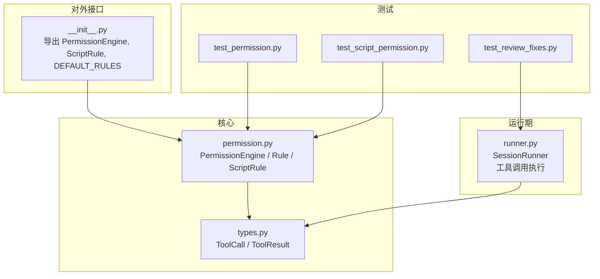
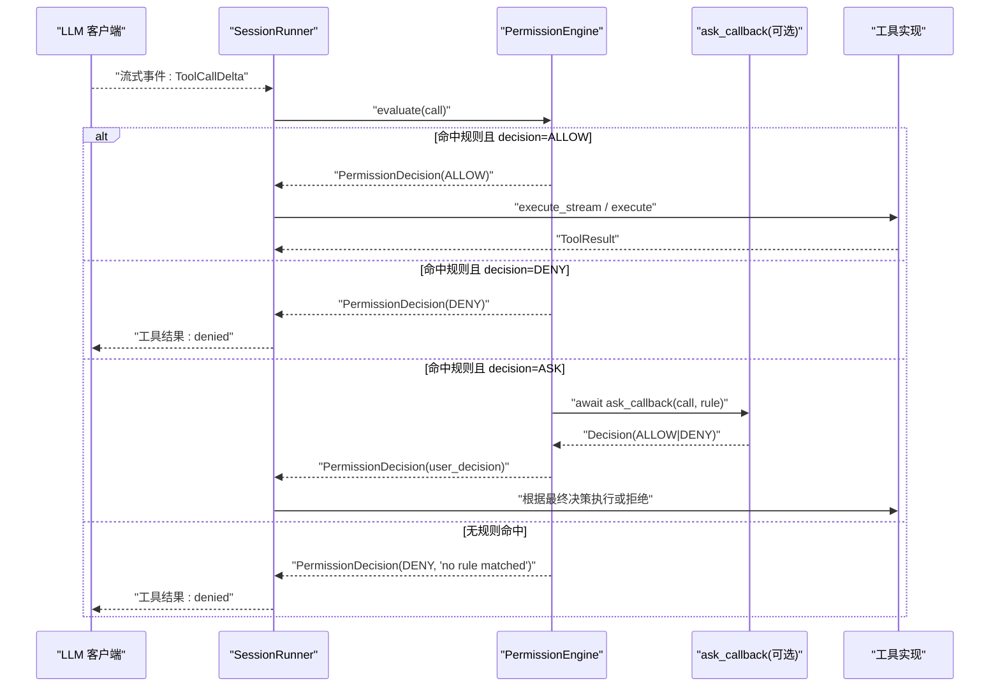
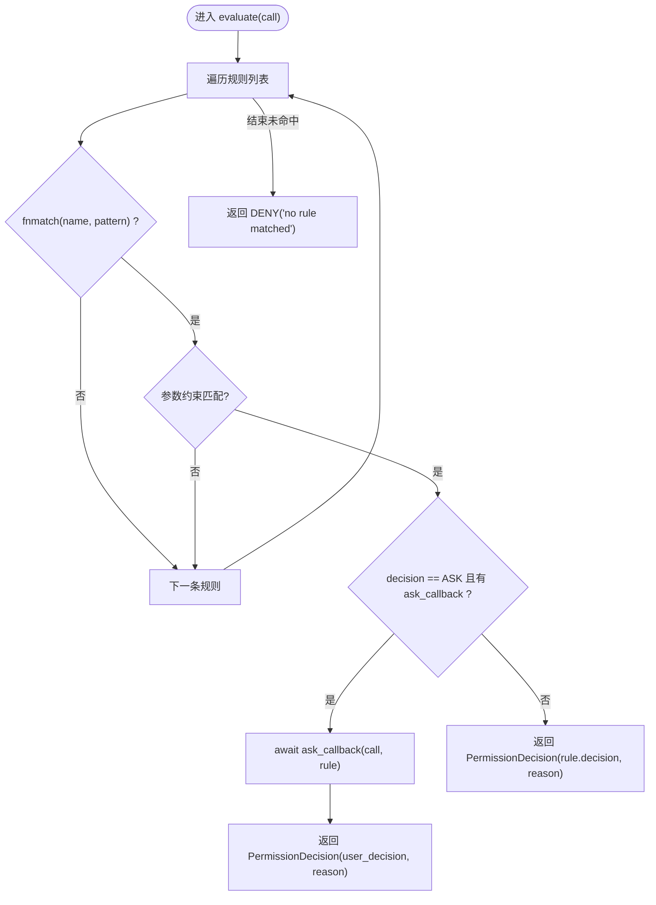
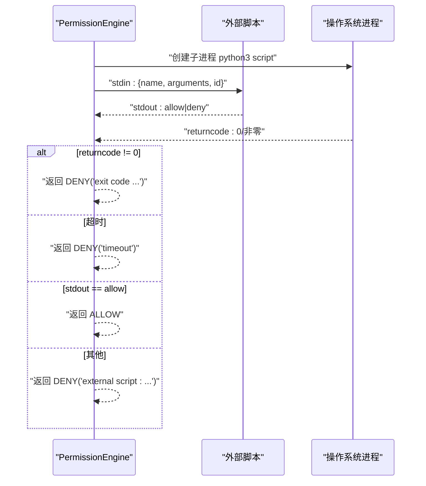
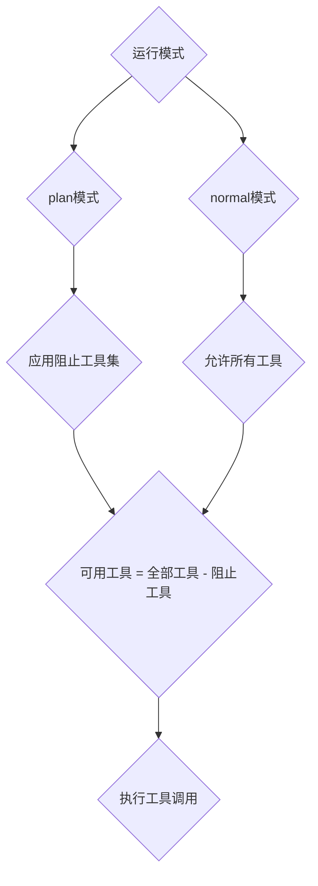
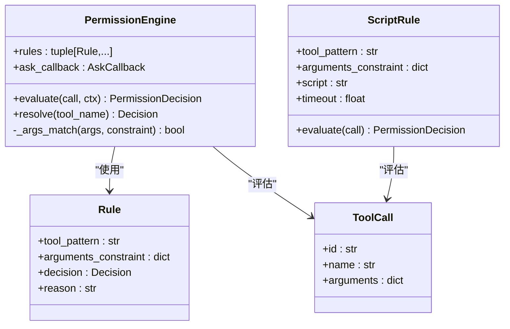

# 权限控制系统

<cite>
**本文引用的文件**   
- [permission.py](file://src/microagent/core/permission.py)
- [types.py](file://src/microagent/core/types.py)
- [runner.py](file://src/microagent/session/runner.py)
- [__init__.py](file://src/microagent/__init__.py)
- [test_permission.py](file://tests/unit/test_permission.py)
- [test_script_permission.py](file://tests/unit/test_script_permission.py)
- [test_review_fixes.py](file://tests/unit/test_review_fixes.py)
</cite>

## 更新摘要
**所做更改**   
- 增强了bash命令安全规则，新增输出重定向命令（* > *）的确认要求
- 重新排序DEFAULT_RULES元组，优先ASK决策在ALLOW决策之前，提供更安全的默认行为
- 将process工具添加到_PLAN_BLOCKED_TOOLS集合中，扩展计划模式下的只读限制

## 目录
1. [简介](#简介)
2. [项目结构](#项目结构)
3. [核心组件](#核心组件)
4. [架构总览](#架构总览)
5. [详细组件分析](#详细组件分析)
6. [依赖关系分析](#依赖关系分析)
7. [性能考量](#性能考量)
8. [故障排查指南](#故障排查指南)
9. [结论](#结论)
10. [附录](#附录)

## 简介
本文件面向 MicroAgent 的权限控制系统，系统性阐述基于规则的权限引擎 PermissionEngine、脚本规则 ScriptRule、决策类型 ALLOW/DENY/ASK 的处理逻辑与优先级、fnmatch 模式匹配在工具名与参数约束中的用法、交互式授权回调 ask_callback 的实现方式，以及默认权限规则与自定义规则的开发指南。同时给出安全最佳实践（最小权限原则、参数验证、超时控制等）和典型场景的配置示例路径，帮助读者快速落地并安全扩展权限策略。

## 项目结构
权限相关代码集中在 core/permission.py，类型定义在 core/types.py，会话执行流程在 session/runner.py，公共导出在 __init__.py，单元测试覆盖核心行为。

图表来源 
- [permission.py:1-235](file://src/microagent/core/permission.py#L1-L235)
- [types.py:76-116](file://src/microagent/core/types.py#L76-L116)
- [runner.py:137-162](file://src/microagent/session/runner.py#L137-L162)
- [__init__.py:6-13](file://src/microagent/__init__.py#L6-L13)

章节来源
- [permission.py:1-235](file://src/microagent/core/permission.py#L1-L235)
- [types.py:76-116](file://src/microagent/core/types.py#L76-L116)
- [runner.py:137-162](file://src/microagent/session/runner.py#L137-L162)
- [__init__.py:6-13](file://src/microagent/__init__.py#L6-L13)

## 核心组件
- Decision：枚举型决策结果，包含 ALLOW、DENY、ASK。
- Rule：基于 fnmatch 的工具名匹配 + 参数约束，映射到决策与原因。
- PermissionEngine：按顺序匹配规则，支持 ASK 交互回调；未命中则默认 DENY。
- ScriptRule：通过外部 Python 脚本进行动态决策，支持超时与错误处理。
- ToolCall / ToolResult：工具调用与结果的数据载体，贯穿会话执行与权限判定。

章节来源
- [permission.py:27-63](file://src/microagent/core/permission.py#L27-L63)
- [permission.py:71-116](file://src/microagent/core/permission.py#L71-L116)
- [permission.py:135-199](file://src/microagent/core/permission.py#L135-L199)
- [types.py:76-116](file://src/microagent/core/types.py#L76-L116)

## 架构总览
权限系统嵌入在工具调用执行链路中：当 LLM 返回工具调用请求时，运行器将调用 PermissionEngine.evaluate 进行决策；若为 ASK，则调用注入的 ask_callback 获取用户或上层策略的最终决定；若为 DENY，则直接拒绝；若为 ALLOW，则继续执行工具。

图表来源 
- [runner.py:285-341](file://src/microagent/session/runner.py#L285-L341)
- [permission.py:82-102](file://src/microagent/core/permission.py#L82-L102)

## 详细组件分析

### PermissionEngine：基于规则的权限引擎
- 规则匹配顺序：自上而下，首个匹配生效。
- 工具名匹配：使用 fnmatch 对 call.name 与 rule.tool_pattern 进行匹配。
- 参数约束：rule.arguments_constraint 中的每个键值对，以 fnmatch 匹配对应参数的字符串化值（非字符串会先转为 str）。
- 决策优先级：第一个匹配的规则决定最终决策；若为 ASK 且存在 ask_callback，则调用回调获取最终决策；否则直接返回该规则决策。
- 默认策略：若无任何规则匹配，返回 DENY，reason 为"no rule matched"。
- 快速解析：resolve(tool_name) 返回该工具的最高优先级决策（仅按工具名匹配，不检查参数）。

图表来源 
- [permission.py:82-102](file://src/microagent/core/permission.py#L82-L102)
- [permission.py:104-116](file://src/microagent/core/permission.py#L104-L116)

章节来源
- [permission.py:71-116](file://src/microagent/core/permission.py#L71-L116)
- [test_permission.py:18-80](file://tests/unit/test_permission.py#L18-L80)

### ScriptRule：外部脚本规则
- 输入：ToolCall 对象序列化为 JSON，通过 stdin 传递给 python3 脚本。
- 输出：脚本 stdout 打印 allow/deny（忽略大小写），退出码 0 表示成功；非零退出码视为拒绝。
- 超时控制：可配置 timeout（秒），超时将终止进程并返回 DENY。
- 错误处理：异常捕获后返回 DENY，reason 包含错误信息。

图表来源 
- [permission.py:158-199](file://src/microagent/core/permission.py#L158-L199)

章节来源
- [permission.py:135-199](file://src/microagent/core/permission.py#L135-L199)
- [test_script_permission.py:7-63](file://tests/unit/test_script_permission.py#L7-L63)

### 决策类型与优先级
- Decision.ALLOW：允许执行工具。
- Decision.DENY：拒绝执行工具。
- Decision.ASK：需要交互式授权，由 ask_callback 返回最终决策。
- 优先级：规则按声明顺序匹配，首个匹配生效；未命中则默认 DENY。

章节来源
- [permission.py:27-33](file://src/microagent/core/permission.py#L27-33)
- [permission.py:82-102](file://src/microagent/core/permission.py#L82-L102)

### fnmatch 模式匹配使用方法
- 工具名匹配：tool_pattern 支持标准 fnmatch 通配符，如 bash、read_file、write_*、fs.* 等。
- 参数约束：arguments_constraint 的每个键值对均使用 fnmatch 匹配参数值的字符串化形式，例如 {"path": "/workspace/**"}。
- 非字符串参数：会被转换为字符串后再匹配，便于数值或列表类型参数的约束。

章节来源
- [permission.py:40-48](file://src/microagent/core/permission.py#L40-L48)
- [permission.py:116-127](file://src/microagent/core/permission.py#L116-L127)
- [test_permission.py:39-58](file://tests/unit/test_permission.py#L39-L58)

### 交互式授权回调（ask_callback）
- 触发条件：当匹配到的规则 decision 为 ASK 且提供了 ask_callback。
- 回调签名：async def ask_callback(call: ToolCall, rule: Rule) -> Decision。
- 返回值：必须返回 Decision.ALLOW 或 Decision.DENY（也可返回 ASK，但通常应明确最终决策）。
- 用例参考：测试中展示了回调记录被调用的工具名并返回 ALLOW。

章节来源
- [permission.py:62-64](file://src/microagent/core/permission.py#L62-L64)
- [permission.py:89-92](file://src/microagent/core/permission.py#L89-L92)
- [test_permission.py:60-75](file://tests/unit/test_permission.py#L60-L75)

### 默认权限规则（DEFAULT_RULES）

**已更新** 增强了bash命令安全规则，新增了输出重定向命令的安全保护，并重新排序了规则优先级以确保更安全的行为。

- 内置规则覆盖了常用工具（如 read_file、grep、glob、write_file、edit_file、bash、web_fetch、web_search、execute_code、vision_analyze、browser_*、context7、session_search、process 等）。
- **新增安全规则**：`Rule("bash", {"command": "* > *"}, Decision.ASK, "output redirection requires confirmation")` - 所有输出重定向命令现在都需要用户确认。
- **规则优先级优化**：敏感操作（rm、mv、chmod、chown、输出重定向、task）的ASK规则现在位于ALLOW规则之前，确保更安全的默认行为。
- 用途：提供开箱即用的宽松策略，便于开发与调试；生产环境建议按需收紧。

**更新后的规则优先级：**
1. 敏感操作确认规则（ASK）：rm、mv、chmod、chown、输出重定向、subagent spawn
2. 默认允许规则（ALLOW）：read_file、grep、glob、write_file、edit_file、bash、web_fetch等

章节来源
- [permission.py:201-234](file://src/microagent/core/permission.py#L201-L234)
- [test_permission.py:81-102](file://tests/unit/test_permission.py#L81-L102)

### 计划模式下的工具限制

**已更新** 扩展了计划模式下的只读限制，新增了process工具的阻止。

- SessionRunner维护了一个只读的PLAN_BLOCKED_TOOLS集合，用于在计划模式下禁用写入工具。
- **新增阻止工具**：`process` 工具现在也被阻止，以防止在计划模式下执行后台进程管理操作。
- 阻止的工具包括：write_file、edit_file、bash、execute_code、process、browser_click、browser_type。
- 这些工具在计划模式下不可用，确保计划的只读性质。

图表来源 
- [runner.py:137-162](file://src/microagent/session/runner.py#L137-L162)

章节来源
- [runner.py:137-162](file://src/microagent/session/runner.py#L137-L162)
- [test_review_fixes.py:116-125](file://tests/unit/test_review_fixes.py#L116-L125)

### 自定义规则开发指南
- 新增 Rule：定义 tool_pattern、arguments_constraint、decision、reason，插入规则列表靠前位置以获得更高优先级。
- 使用 ScriptRule：编写独立 Python 脚本，读取 stdin JSON，输出 allow/deny 并正常退出；设置合理 timeout。
- 集成方式：在应用初始化时构造 PermissionEngine(rules=(...), ask_callback=...)，并在工具执行前调用 evaluate。

章节来源
- [permission.py:40-48](file://src/microagent/core/permission.py#L40-L48)
- [permission.py:135-199](file://src/microagent/core/permission.py#L135-L199)

## 依赖关系分析
- PermissionEngine 依赖 types.ToolCall 作为输入。
- ScriptRule 依赖 asyncio 子进程管理外部脚本。
- SessionRunner 负责工具调用生命周期，结合 Hook 机制执行工具；当前版本未在 runner 中直接调用 PermissionEngine，但可通过 tool_hooks 或 registry.execute 前后接入权限判断。
- 公共导出通过 __init__.py 暴露 PermissionEngine、ScriptRule、DEFAULT_RULES 等。

图表来源 
- [permission.py:40-48](file://src/microagent/core/permission.py#L40-L48)
- [permission.py:71-116](file://src/microagent/core/permission.py#L71-L116)
- [permission.py:135-199](file://src/microagent/core/permission.py#L135-L199)
- [types.py:76-94](file://src/microagent/core/types.py#L76-L94)

章节来源
- [__init__.py:6-13](file://src/microagent/__init__.py#L6-L13)
- [runner.py:285-341](file://src/microagent/session/runner.py#L285-L341)

## 性能考量
- 规则匹配复杂度：O(N) 遍历规则，N 为规则数量；建议将高频匹配规则置于前列以减少平均匹配成本。
- 参数约束匹配：每次匹配都会进行字符串化与 fnmatch，避免过宽泛的模式（如 "*"）导致误匹配与额外开销。
- 外部脚本调用：ScriptRule 涉及进程创建与 IO，应设置合理 timeout，避免阻塞；必要时缓存脚本路径或复用进程池。
- 并发执行：SessionRunner 并发执行多个工具调用，权限判断应在调用前完成，避免重复计算。

## 故障排查指南
- 未命中任何规则：返回 DENY，reason 为 "no rule matched"，检查规则列表是否包含目标工具名及参数约束。
- 外部脚本错误：
  - 非零退出码：返回 DENY，reason 包含退出码；检查脚本逻辑与返回值。
  - 超时：返回 DENY，reason 包含 "timeout"；增加 timeout 或优化脚本性能。
  - 异常：返回 DENY，reason 包含异常信息；检查脚本可读性与依赖。
- ASK 回调未触发：确认规则 decision 为 ASK 且已注入 ask_callback。
- 参数匹配失败：确认参数值类型与约束模式一致，必要时调整 constraints 或确保参数为期望格式。
- 计划模式下工具不可用：检查工具是否在 _PLAN_BLOCKED_TOOLS 集合中。

章节来源
- [permission.py:82-102](file://src/microagent/core/permission.py#L82-L102)
- [permission.py:158-199](file://src/microagent/core/permission.py#L158-L199)
- [test_script_permission.py:27-46](file://tests/unit/test_script_permission.py#L27-L46)
- [runner.py:137-162](file://src/microagent/session/runner.py#L137-L162)

## 结论
MicroAgent 的权限控制系统以简洁高效的规则引擎为核心，结合 fnmatch 模式匹配与可选的外部脚本决策，提供了灵活且可扩展的权限策略能力。通过默认规则与自定义规则的组合，以及 ASK 交互回调，可在不同场景下实现从宽松到严格的权限控制。遵循最小权限原则、严格参数校验与合理的超时控制，可显著提升系统安全性与稳定性。

**最新更新** 增强了bash命令安全规则，特别是输出重定向命令的保护，并通过重新排序规则优先级确保了更安全的默认行为。同时，计划模式下的只读限制得到了扩展，防止了潜在的写入操作。

## 附录

### 典型权限场景配置示例（路径引用）
- 允许特定工具：参考测试中对 read_file 的 ALLOW 规则。
  - [test_permission.py:19-24](file://tests/unit/test_permission.py#L19-L24)
- 默认拒绝所有：空规则列表或未命中规则时的 DENY 行为。
  - [test_permission.py:25-31](file://tests/unit/test_permission.py#L25-L31)
- 显式拒绝某工具：为 bash 添加 DENY 规则。
  - [test_permission.py:32-38](file://tests/unit/test_permission.py#L32-L38)
- 通配符匹配：write_* 允许所有写入类工具。
  - [test_permission.py:39-44](file://tests/unit/test_permission.py#L39-L44)
- 参数约束优先匹配：bash 命令参数精确匹配优先于通用 DENY。
  - [test_permission.py:45-58](file://tests/unit/test_permission.py#L45-L58)
- 交互式授权：ASK 规则配合 ask_callback 动态决策。
  - [test_permission.py:60-75](file://tests/unit/test_permission.py#L60-L75)
- 外部脚本决策：allow/deny 脚本与超时、错误处理。
  - [test_script_permission.py:8-26](file://tests/unit/test_script_permission.py#L8-L26)
  - [test_script_permission.py:27-46](file://tests/unit/test_script_permission.py#L27-L46)
  - [test_script_permission.py:47-63](file://tests/unit/test_script_permission.py#L47-L63)
- 计划模式工具限制：验证process工具在计划模式下被阻止。
  - [test_review_fixes.py:116-125](file://tests/unit/test_review_fixes.py#L116-L125)

### 安全最佳实践清单
- 最小权限原则：仅开放必要工具与参数范围，默认 DENY。
- 参数验证：使用精确的 fnmatch 模式限制路径、命令、URL 等敏感参数。
- 超时控制：为 ScriptRule 设置合理 timeout，防止长时间挂起。
- 审计与日志：在 ask_callback 与外部脚本中记录关键决策上下文。
- 规则优先级：将更具体的规则放在前面，避免被通用规则覆盖。
- 定期审查：清理废弃规则，保持策略精简与可维护性。
- **新增**：敏感操作确认：对于危险命令（rm、mv、chmod、chown、输出重定向）启用ASK确认机制。
- **新增**：计划模式保护：确保计划模式下只读限制完整，阻止所有潜在写入操作。