# Agent和会话管理

<cite>
**本文引用的文件**   
- [agent.py](file://src/microagent/agent.py)
- [runner.py](file://src/microagent/session/runner.py)
- [types.py](file://src/microagent/core/types.py)
- [store.py](file://src/microagent/core/store.py)
- [budget.py](file://src/microagent/session/budget.py)
- [tool.py](file://src/microagent/core/tool.py)
- [client.py](file://src/microagent/llm/client.py)
- [config.py](file://src/microagent/config.py)
- [test_runner.py](file://tests/unit/test_runner.py)
- [test_session_persist.py](file://tests/unit/test_session_persist.py)
- [test_session_resume.py](file://tests/unit/test_session_resume.py)
- [fake_llm.py](file://tests/unit/fake_llm.py)
</cite>

## 目录
1. [简介](#简介)
2. [项目结构](#项目结构)
3. [核心组件](#核心组件)
4. [架构总览](#架构总览)
5. [详细组件分析](#详细组件分析)
6. [依赖关系分析](#依赖关系分析)
7. [性能考量](#性能考量)
8. [故障排查指南](#故障排查指南)
9. [结论](#结论)
10. [附录：使用示例与最佳实践](#附录使用示例与最佳实践)

## 简介
本文件面向 MicroAgent 的 Agent 与会话管理系统，聚焦以下目标：
- 解释 Agent 类作为统一入口点的设计模式，包括工厂方法 Agent.from_config() 的使用。
- 深入解析 SessionRunner 的核心循环机制，特别是 run_turn() 的执行流程、消息处理逻辑与工具调用协调。
- 说明会话的生命周期管理：创建、状态维护、持久化与恢复。
- 通过具体代码示例展示如何创建 Agent、启动会话和处理对话轮次。
- 以会话状态图和事件流程图呈现组件间的交互关系。

## 项目结构
MicroAgent 将“统一入口（Agent）”、“会话执行器（SessionRunner）”、“类型与事件（core/types）”、“工具注册与执行（core/tool）”、“LLM抽象（llm/client）”、“预算控制（session/budget）”、“存储（core/store）”等模块解耦，形成清晰的分层与职责边界。

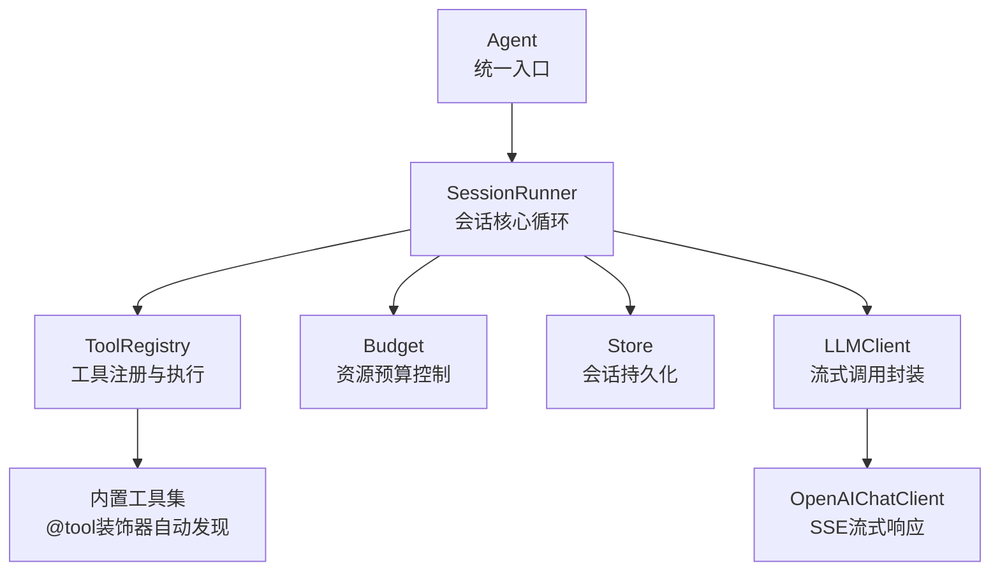

图表来源
- [agent.py:24-77](file://src/microagent/agent.py#L24-L77)
- [runner.py:40-101](file://src/microagent/session/runner.py#L40-L101)
- [tool.py:221-280](file://src/microagent/core/tool.py#L221-L280)
- [budget.py:15-169](file://src/microagent/session/budget.py#L15-L169)
- [store.py:95-182](file://src/microagent/core/store.py#L95-L182)
- [client.py:163-328](file://src/microagent/llm/client.py#L163-L328)

章节来源
- [agent.py:24-77](file://src/microagent/agent.py#L24-L77)
- [runner.py:40-101](file://src/microagent/session/runner.py#L40-L101)

## 核心组件
- Agent：对外暴露 run()/arun() 同步/异步入口，内部组装 LLM、工具、预算、存储与会话运行器；提供 from_config() 工厂方法简化初始化。
- SessionRunner：实现“LLM → 工具调用 → LLM … → 文本回复”的主循环，支持流式输出、压缩、技能匹配、上下文注入、事件总线与内存提取。
- ToolRegistry/@tool：声明式工具注册与执行，支持非流式与流式两种执行路径，自动推断参数 Schema。
- Budget：树形预算模型，支持迭代次数、Token数、成本上限，根节点共享取消事件，子预算继承剩余配额。
- Store：SQLite WAL 持久化与会话历史读写，支持检查点与摘要查询；同时提供 InMemoryStore 用于测试。
- LLMClient/OpenAIChatClient：统一的 LLM 接口，基于 OpenAI 兼容 API，支持 SSE 流式返回、工具调用增量累积、凭据轮换重试。

章节来源
- [agent.py:24-113](file://src/microagent/agent.py#L24-L113)
- [runner.py:40-117](file://src/microagent/session/runner.py#L40-L117)
- [tool.py:177-280](file://src/microagent/core/tool.py#L177-L280)
- [budget.py:15-169](file://src/microagent/session/budget.py#L15-L169)
- [store.py:95-182](file://src/microagent/core/store.py#L95-L182)
- [client.py:163-328](file://src/microagent/llm/client.py#L163-L328)

## 架构总览
下图展示了从用户调用到最终回复的关键路径，以及工具调用的并发执行与流式进度上报。

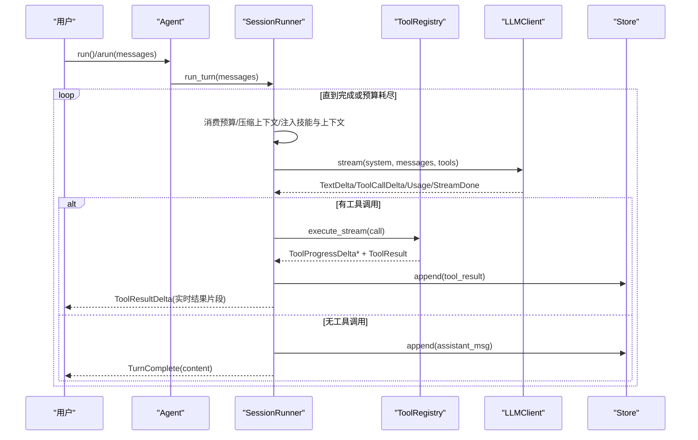

图表来源
- [runner.py:118-283](file://src/microagent/session/runner.py#L118-L283)
- [tool.py:262-280](file://src/microagent/core/tool.py#L262-L280)
- [client.py:219-328](file://src/microagent/llm/client.py#L219-L328)
- [store.py:122-140](file://src/microagent/core/store.py#L122-L140)

## 详细组件分析

### Agent：统一入口与工厂方法
- 设计模式：门面（Facade），屏蔽内部复杂装配，暴露简洁 API。
- 工厂方法：from_config() 根据配置构建 LLM、工具注册表、预算、技能加载器与 SessionRunner，并可选启用定时任务。
- 同步/异步入口：run() 内部包装 arun()，确保在完成后关闭资源；arun() 遍历 run_turn() 的事件流，遇到 TurnComplete/TurnFailed 即返回。

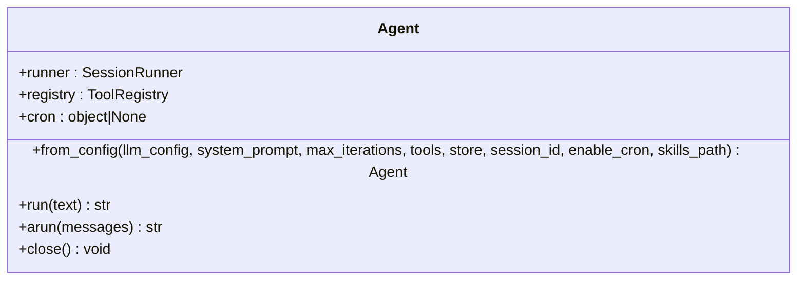

图表来源
- [agent.py:24-77](file://src/microagent/agent.py#L24-L77)
- [agent.py:79-113](file://src/microagent/agent.py#L79-L113)

章节来源
- [agent.py:24-113](file://src/microagent/agent.py#L24-L113)

### SessionRunner：核心循环与消息处理
- 主循环 run_turn()：
  - 若存在 Store，先追加用户消息。
  - 每轮消耗预算，超限则返回 TurnFailed。
  - 自适应压缩：当消息数量或 Token 超过阈值时进行对话压缩，避免超出上下文窗口。
  - 技能匹配与上下文注入：根据最后一条用户消息匹配相关技能，合并到 system prompt；支持外部 context_sources 与 pre_llm_hooks。
  - 调用 LLM 流式接口，收集文本增量、工具调用增量与用量信息。
  - 若无工具调用：构造 assistant 消息，持久化，触发事件总线与内存提取，返回 TurnComplete。
  - 若有工具调用：并发执行工具，收集进度与结果，追加 tool_result 消息，返回 ToolResultDelta，继续下一轮。
- 工具执行 _run_tool_calls()：
  - 为每个工具调用设置进程/浏览器/任务上下文隔离。
  - 支持工具钩子 before/after 拦截与修改。
  - 优先尝试 execute_stream，否则回退到 execute。
  - 异常捕获并转为 ToolResult.error。

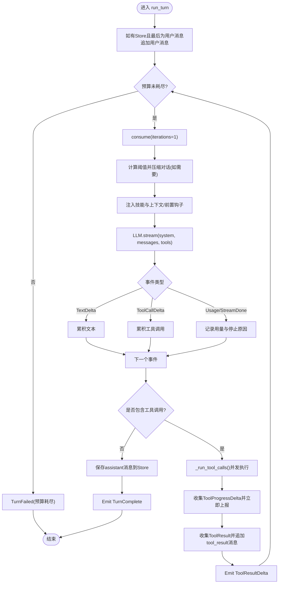

图表来源
- [runner.py:118-283](file://src/microagent/session/runner.py#L118-L283)
- [runner.py:285-341](file://src/microagent/session/runner.py#L285-L341)

章节来源
- [runner.py:118-341](file://src/microagent/session/runner.py#L118-L341)

### 工具系统：注册、Schema推断与流式执行
- @tool 装饰器：基于函数签名与 Annotated[Field(...)] 元数据生成 OpenAI 兼容 JSON Schema。
- FunctionTool：适配普通 async 函数与异步生成器（AsyncIterator[str]），后者自动转换为 ToolProgressDelta 流式进度。
- ToolRegistry：统一管理工具，导出 to_openai_tools() 供 LLM 调用，execute/execute_stream 分发执行。

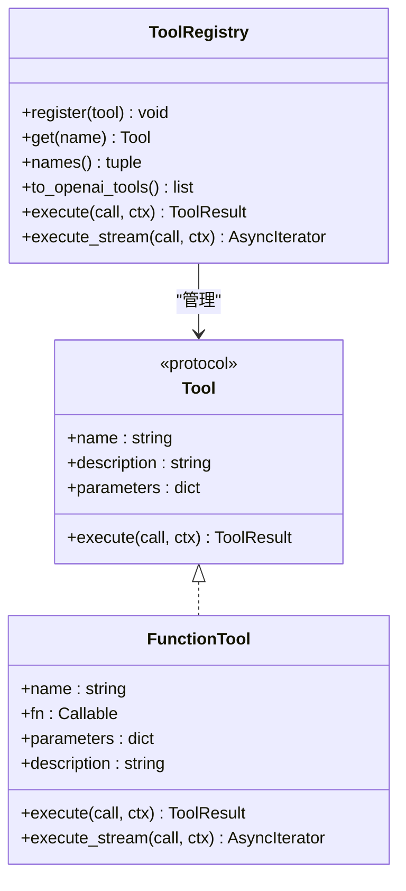

图表来源
- [tool.py:40-118](file://src/microagent/core/tool.py#L40-L118)
- [tool.py:221-280](file://src/microagent/core/tool.py#L221-L280)

章节来源
- [tool.py:177-280](file://src/microagent/core/tool.py#L177-L280)

### 预算控制：树形结构与共享取消
- Budget 支持迭代次数、Token、成本三类限制，父子节点累计使用量，根节点共享 anyio.Event 用于全局取消。
- consume() 在超限时抛出 BudgetExceeded，并触发根节点的取消信号，通知所有子预算。

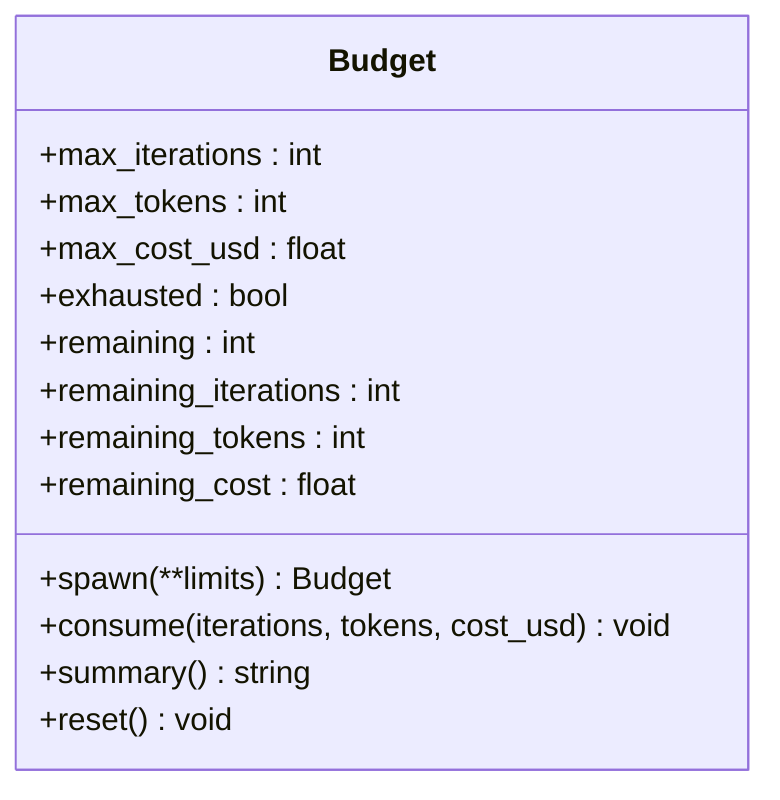

图表来源
- [budget.py:15-169](file://src/microagent/session/budget.py#L15-L169)

章节来源
- [budget.py:15-169](file://src/microagent/session/budget.py#L15-L169)

### 存储与会话持久化
- SQLiteStore：WAL 模式，按 session_id 顺序写入 JSON 序列化消息，支持 load_history、checkpoint、list_sessions、session_summaries。
- InMemoryStore：内存字典实现，便于单元测试。
- SessionRunner 在 turn 过程中自动追加用户消息、assistant 消息与 tool_result 消息，保证一致性。

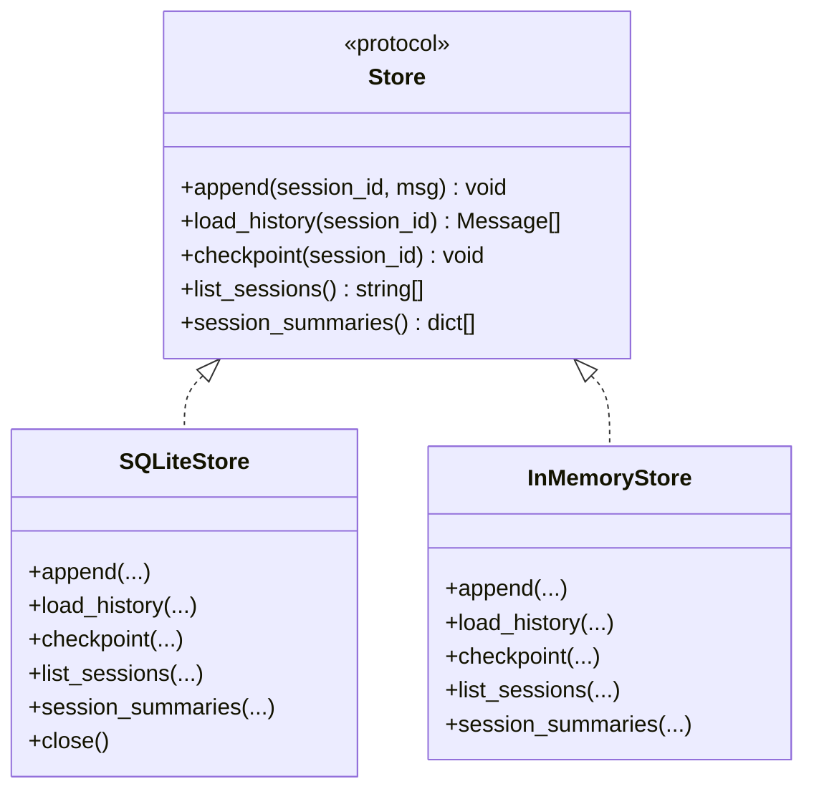

图表来源
- [store.py:28-37](file://src/microagent/core/store.py#L28-L37)
- [store.py:95-182](file://src/microagent/core/store.py#L95-L182)
- [store.py:189-226](file://src/microagent/core/store.py#L189-L226)

章节来源
- [store.py:95-182](file://src/microagent/core/store.py#L95-L182)
- [store.py:189-226](file://src/microagent/core/store.py#L189-L226)

### LLM 客户端：流式与工具调用累积
- OpenAIChatClient：基于 openai SDK v2，SSE 流式读取，累积 tool_call 片段后一次性发出 ToolCallDelta，支持凭据池轮换与重试。
- get_context_window()：按模型名前缀匹配上下文窗口大小，用于自适应压缩阈值。

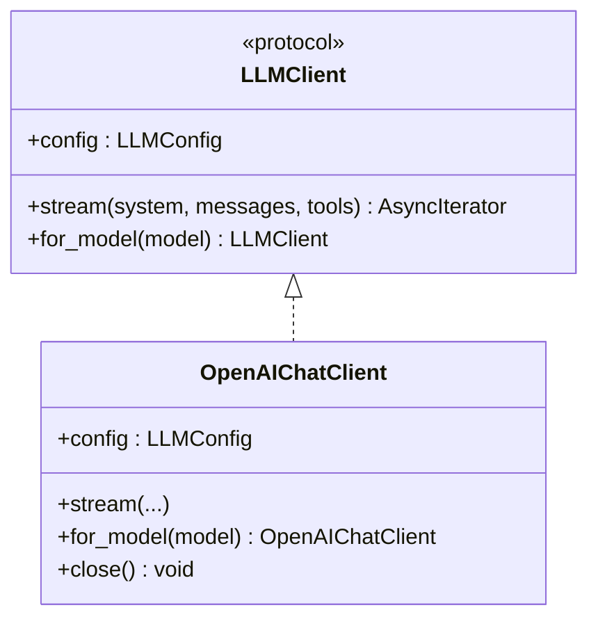

图表来源
- [client.py:141-156](file://src/microagent/llm/client.py#L141-L156)
- [client.py:163-328](file://src/microagent/llm/client.py#L163-L328)

章节来源
- [client.py:163-328](file://src/microagent/llm/client.py#L163-L328)

### 配置系统：多源优先级
- Config.from_file()：CLI > 环境变量 > 配置文件 > 默认值，解析出 LLMConfig、system_prompt、skills_path。
- 配置文件位置 ~/.microagent/config.yaml，字段映射 base_url、api_key、model、system_prompt、skills_path。

章节来源
- [config.py:28-71](file://src/microagent/config.py#L28-L71)
- [config.py:73-101](file://src/microagent/config.py#L73-L101)

## 依赖关系分析
- Agent 依赖 SessionRunner、ToolRegistry、CronScheduler（可选）。
- SessionRunner 依赖 LLMClient、ToolRegistry、Budget、Store、EventBus（可选）、MemoryExtractor（可选）、SkillLoader（可选）。
- ToolRegistry 依赖 @tool 装饰器注册的 FunctionTool。
- LLMClient 依赖 OpenAI SDK 与凭据池（可选）。
- Store 依赖 SQLite 或内存数据结构。

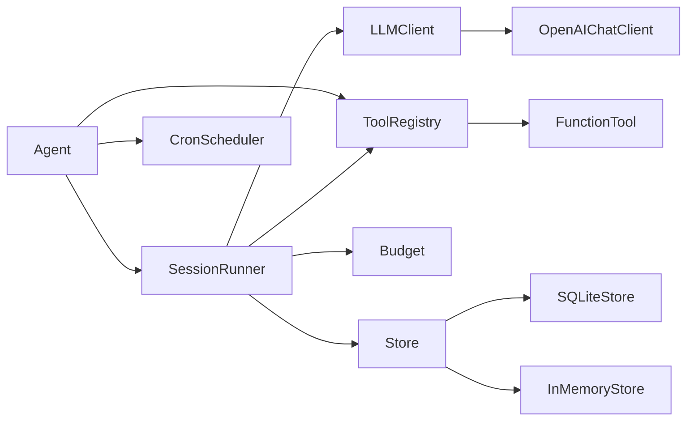

图表来源
- [agent.py:24-77](file://src/microagent/agent.py#L24-L77)
- [runner.py:40-101](file://src/microagent/session/runner.py#L40-L101)
- [tool.py:221-280](file://src/microagent/core/tool.py#L221-L280)
- [client.py:163-328](file://src/microagent/llm/client.py#L163-L328)
- [store.py:95-182](file://src/microagent/core/store.py#L95-L182)

章节来源
- [agent.py:24-77](file://src/microagent/agent.py#L24-L77)
- [runner.py:40-101](file://src/microagent/session/runner.py#L40-L101)

## 性能考量
- 流式处理：LLM 与工具均支持流式输出，降低首字延迟，提升用户体验。
- 对话压缩：当消息长度超过阈值时进行压缩，减少上下文占用，避免截断。
- 并发工具执行：_run_tool_calls() 使用任务组并发执行工具调用，提高吞吐。
- 预算控制：严格限制迭代次数、Token 与成本，防止无限循环与资源滥用。
- 存储优化：SQLite WAL 模式与索引优化，支持高效追加与查询；session_summaries 单次查询获取摘要。

## 故障排查指南
- 预算耗尽：
  - 现象：TurnFailed(reason="budget exhausted...")。
  - 排查：检查 max_iterations、max_tokens、max_cost_usd 设置；查看 usage 统计；确认是否存在工具调用死循环。
  - 参考：预算消耗与抛错逻辑。
- 工具执行失败：
  - 现象：ToolResult.error 或 ToolResult.denied。
  - 排查：检查工具钩子 before/after 是否拒绝；确认工具名称与参数 Schema；查看异常堆栈。
- LLM 响应截断：
  - 现象：TurnFailed("LLM response truncated (max tokens)")。
  - 排查：增大上下文窗口或降低压缩阈值；检查模型最大 token 限制。
- 会话恢复失败：
  - 现象：resume() 返回空历史。
  - 排查：确认 session_id 正确；检查 Store 是否正确持久化；必要时执行 checkpoint。

章节来源
- [runner.py:118-283](file://src/microagent/session/runner.py#L118-L283)
- [budget.py:99-169](file://src/microagent/session/budget.py#L99-L169)
- [tool.py:256-280](file://src/microagent/core/tool.py#L256-L280)
- [store.py:122-140](file://src/microagent/core/store.py#L122-L140)

## 结论
MicroAgent 通过 Agent 门面与 SessionRunner 核心循环，构建了可扩展、可观测、可控制的对话系统。工具系统与 LLM 抽象使系统具备强扩展性；预算与存储机制保障稳定性与可恢复性。结合流式输出与并发执行，系统在性能与体验上达到平衡。

## 附录：使用示例与最佳实践

### 创建 Agent 与启动会话
- 使用 Agent.from_config() 传入 LLMConfig 与系统提示词，可选开启 cron 与技能路径。
- 调用 run()/arun() 发送用户消息，等待 TurnComplete 或 TurnFailed。

章节来源
- [agent.py:31-77](file://src/microagent/agent.py#L31-L77)
- [agent.py:79-113](file://src/microagent/agent.py#L79-L113)

### 处理对话轮次与工具调用
- 遍历 run_turn() 事件流，处理 TextDelta、ToolCallDelta、ToolProgressDelta、ToolResultDelta、TurnComplete、TurnFailed。
- 对于工具调用，注意并发执行与进度上报，及时更新 UI。

章节来源
- [runner.py:118-283](file://src/microagent/session/runner.py#L118-L283)
- [runner.py:285-341](file://src/microagent/session/runner.py#L285-L341)

### 会话持久化与恢复
- 使用 SQLiteStore 或 InMemoryStore 保存历史；SessionRunner 自动追加消息。
- 通过 resume(session_id, store) 恢复历史，继续对话。

章节来源
- [store.py:95-182](file://src/microagent/core/store.py#L95-L182)
- [store.py:189-226](file://src/microagent/core/store.py#L189-L226)
- [runner.py:115-117](file://src/microagent/session/runner.py#L115-L117)

### 会话状态图
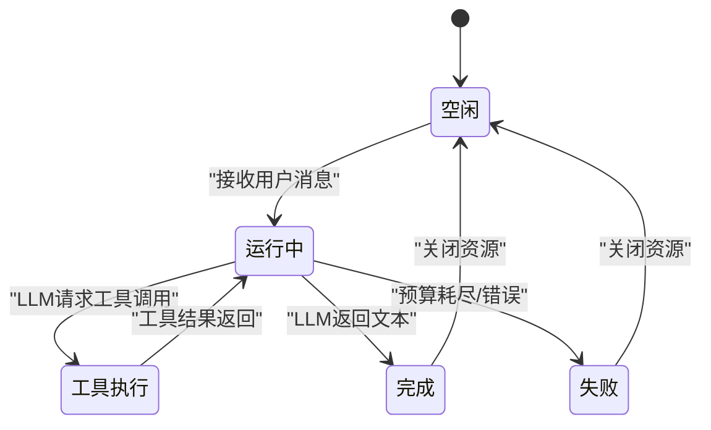

### 事件流程图（典型一轮对话）
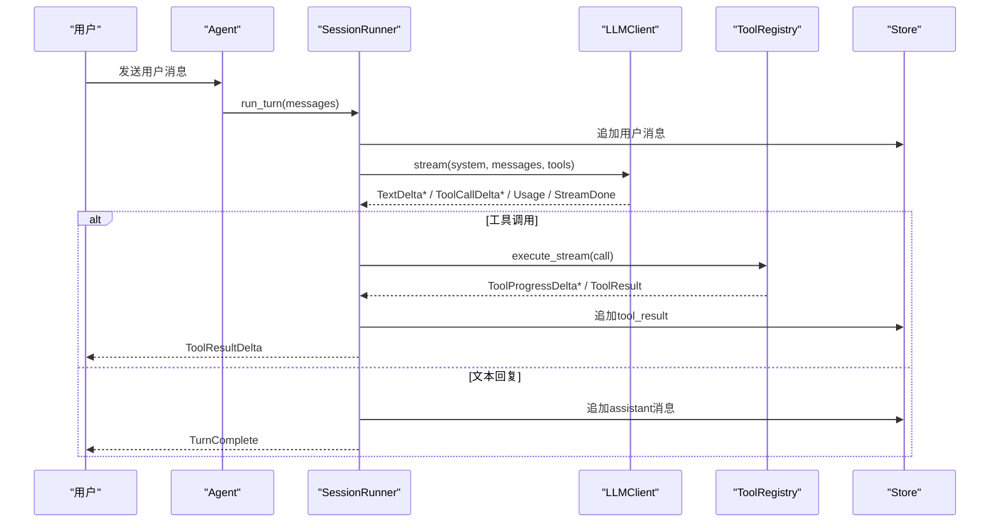

章节来源
- [test_runner.py:61-149](file://tests/unit/test_runner.py#L61-L149)
- [test_session_persist.py:8-75](file://tests/unit/test_session_persist.py#L8-L75)
- [test_session_resume.py:8-61](file://tests/unit/test_session_resume.py#L8-L61)
- [fake_llm.py:22-110](file://tests/unit/fake_llm.py#L22-L110)