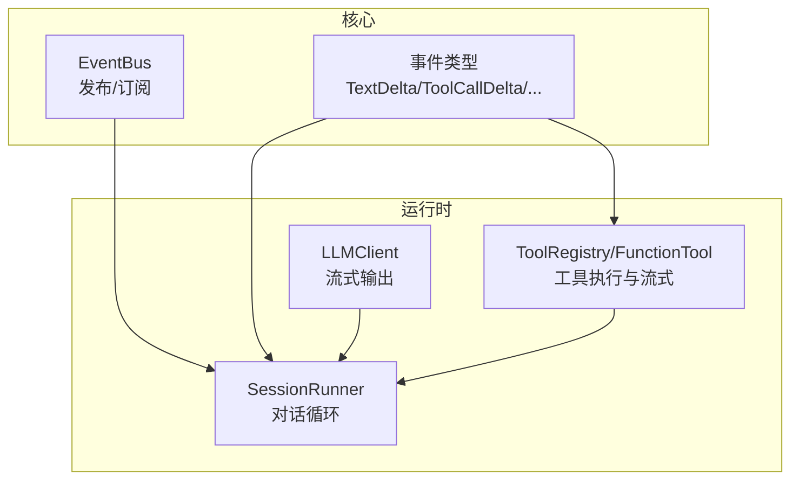
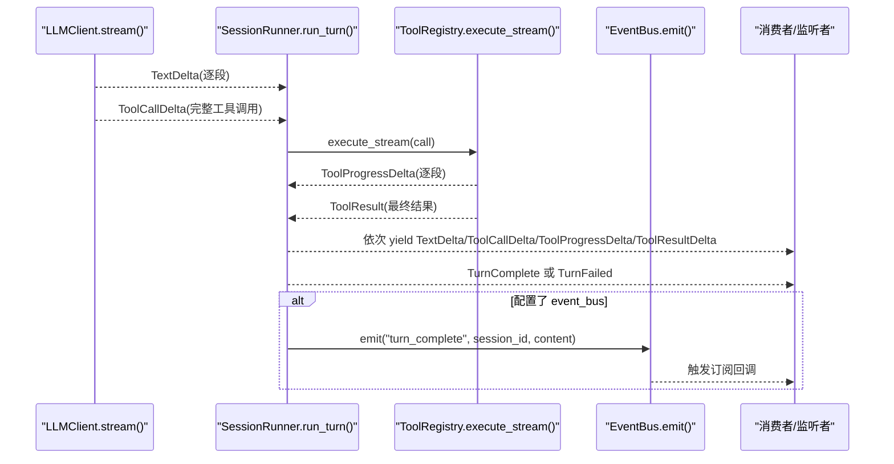
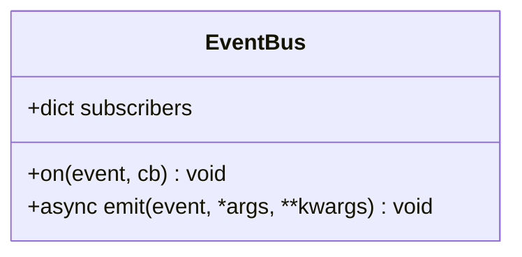
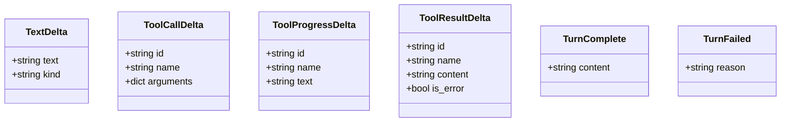
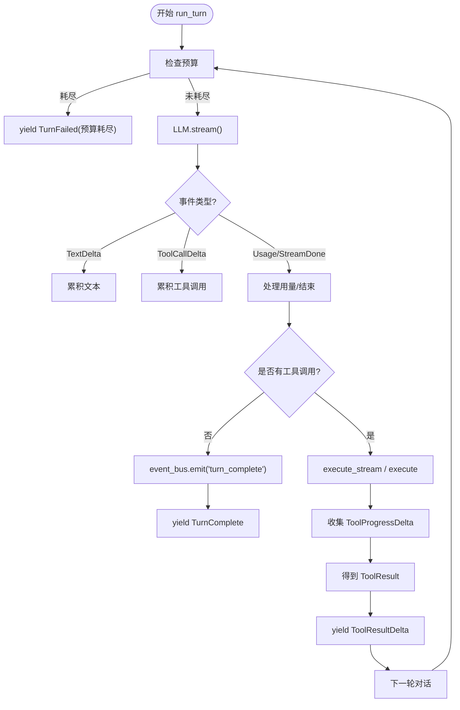
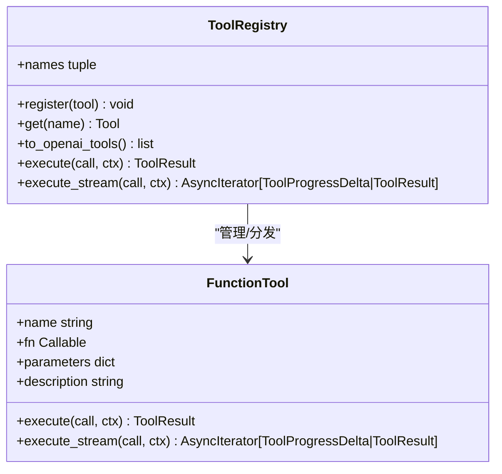
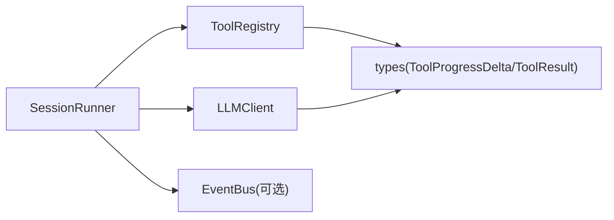

# 事件系统

<cite>
**本文引用的文件**
- [src/microagent/core/event.py](file://src/microagent/core/event.py)
- [src/microagent/core/types.py](file://src/microagent/core/types.py)
- [src/microagent/session/runner.py](file://src/microagent/session/runner.py)
- [src/microagent/core/tool.py](file://src/microagent/core/tool.py)
- [src/microagent/llm/client.py](file://src/microagent/llm/client.py)
- [src/microagent/__init__.py](file://src/microagent/__init__.py)
- [tests/unit/test_event_bus.py](file://tests/unit/test_event_bus.py)
</cite>

## 目录
1. [简介](#简介)
2. [项目结构](#项目结构)
3. [核心组件](#核心组件)
4. [架构总览](#架构总览)
5. [详细组件分析](#详细组件分析)
6. [依赖关系分析](#依赖关系分析)
7. [性能考量](#性能考量)
8. [故障排查指南](#故障排查指南)
9. [结论](#结论)
10. [附录：使用示例与集成要点](#附录使用示例与集成要点)

## 简介
本文件为 MicroAgent 的事件系统提供系统化文档，重点围绕 EventBus 的发布订阅实现、事件类型定义与用途、以及在异步流式处理中的角色。通过 SessionRunner 的对话循环与 LLMClient 的流式响应，MicroAgent 将文本增量、工具调用、工具进度、工具结果以及轮次完成/失败等关键状态以统一事件形式对外暴露，便于 UI、日志、监控或自定义组件进行实时消费。

## 项目结构
事件系统相关代码主要分布在以下模块：
- 事件总线：src/microagent/core/event.py
- 事件数据类型：src/microagent/core/types.py
- 会话运行器（事件生产者）：src/microagent/session/runner.py
- 工具协议与流式支持：src/microagent/core/tool.py
- LLM 客户端（文本与工具调用增量来源）：src/microagent/llm/client.py
- 公共导出：src/microagent/__init__.py
- 单元测试：tests/unit/test_event_bus.py

图表来源
- [src/microagent/core/event.py:1-37](file://src/microagent/core/event.py#L1-L37)
- [src/microagent/core/types.py:123-189](file://src/microagent/core/types.py#L123-L189)
- [src/microagent/session/runner.py:118-284](file://src/microagent/session/runner.py#L118-L284)
- [src/microagent/core/tool.py:81-118](file://src/microagent/core/tool.py#L81-L118)
- [src/microagent/llm/client.py:125-134](file://src/microagent/llm/client.py#L125-L134)

章节来源
- [src/microagent/core/event.py:1-37](file://src/microagent/core/event.py#L1-L37)
- [src/microagent/core/types.py:123-189](file://src/microagent/core/types.py#L123-L189)
- [src/microagent/session/runner.py:118-284](file://src/microagent/session/runner.py#L118-L284)
- [src/microagent/core/tool.py:81-118](file://src/microagent/core/tool.py#L81-L118)
- [src/microagent/llm/client.py:125-134](file://src/microagent/llm/client.py#L125-L134)

## 核心组件
- EventBus：轻量级观察者模式实现，仅支持“只读”回调，异常被吞掉以避免影响主循环；同时透明支持同步与异步回调。
- 事件类型：统一的不可变数据类，覆盖文本增量、工具调用、工具进度、工具结果、轮次完成/失败等语义。
- SessionRunner：事件的主要生产者，负责从 LLM 流中聚合 TextDelta/ToolCallDelta，并在工具执行过程中产生 ToolProgressDelta/ToolResultDelta，最终产出 TurnComplete/TurnFailed。
- ToolRegistry/FunctionTool：工具执行入口，支持非流式与流式两种模式；流式模式下自动将每个 chunk 包装为 ToolProgressDelta 并产出最终 ToolResult。
- LLMClient：抽象出 LLM 流式接口，OpenAIChatClient 内部累积 tool call delta，向调用方返回完整的 ToolCallDelta。

章节来源
- [src/microagent/core/event.py:16-37](file://src/microagent/core/event.py#L16-L37)
- [src/microagent/core/types.py:123-189](file://src/microagent/core/types.py#L123-L189)
- [src/microagent/session/runner.py:118-284](file://src/microagent/session/runner.py#L118-L284)
- [src/microagent/core/tool.py:81-118](file://src/microagent/core/tool.py#L81-L118)
- [src/microagent/llm/client.py:125-134](file://src/microagent/llm/client.py#L125-L134)

## 架构总览
下图展示了事件在系统中的流转路径：LLM 流式输出 → SessionRunner 聚合 → 工具执行（可能流式）→ 事件向外暴露（可经 EventBus 广播）。

图表来源
- [src/microagent/llm/client.py:125-134](file://src/microagent/llm/client.py#L125-L134)
- [src/microagent/session/runner.py:190-284](file://src/microagent/session/runner.py#L190-L284)
- [src/microagent/core/tool.py:262-280](file://src/microagent/core/tool.py#L262-L280)
- [src/microagent/core/event.py:26-37](file://src/microagent/core/event.py#L26-L37)

## 详细组件分析

### EventBus：发布订阅机制
- 注册：on(event, cb) 将回调追加到事件名对应的列表中。
- 发布：emit(event, *args, **kwargs) 按注册顺序调用所有回调；若回调返回协程则 await；任何异常都被捕获，确保主流程不被破坏。
- 设计要点：
  - 观察者只读：回调不得修改事件载荷。
  - 同步/异步透明：emit 自动检测并等待协程。
  - 健壮性：异常吞掉，避免单点故障扩散。

图表来源
- [src/microagent/core/event.py:16-37](file://src/microagent/core/event.py#L16-L37)

章节来源
- [src/microagent/core/event.py:16-37](file://src/microagent/core/event.py#L16-L37)
- [tests/unit/test_event_bus.py:6-52](file://tests/unit/test_event_bus.py#L6-L52)

### 事件类型与用途
- TextDelta：来自 LLM 的文本增量，kind 可为 thinking/content，用于逐步渲染思考过程或最终内容。
- ToolCallDelta：一次完整的工具调用（id/name/arguments），由 LLM 端累积后一次性发出。
- ToolProgressDelta：工具执行过程中的增量输出，用于实时展示进度。
- ToolResultDelta：工具执行的结果摘要（content 前若干字符、是否错误），用于反馈执行结果。
- TurnComplete：一轮对话正常结束，包含最终文本内容。
- TurnFailed：一轮对话异常结束，包含失败原因。

图表来源
- [src/microagent/core/types.py:123-189](file://src/microagent/core/types.py#L123-L189)

章节来源
- [src/microagent/core/types.py:123-189](file://src/microagent/core/types.py#L123-L189)

### SessionRunner：事件生产与流转
- 从 LLMClient.stream() 接收 TextDelta/ToolCallDelta/Usage/StreamDone，并：
  - 累积文本与工具调用；
  - 遇到 StreamDone 时根据 stop_reason 决定截断失败或继续；
  - 若无工具调用，则通过 event_bus.emit("turn_complete", ...)（若存在）广播，并 yield TurnComplete；
  - 若有工具调用，进入工具执行阶段。
- 工具执行：
  - 优先尝试 execute_stream，收集 ToolProgressDelta 并延迟 yield，最后 yield ToolResultDelta；
  - 若不支持流式，回退到 execute，直接得到 ToolResult。
- 预算控制：每次迭代消耗预算，超限则 yield TurnFailed。

图表来源
- [src/microagent/session/runner.py:118-284](file://src/microagent/session/runner.py#L118-L284)
- [src/microagent/core/tool.py:262-280](file://src/microagent/core/tool.py#L262-L280)

章节来源
- [src/microagent/session/runner.py:118-284](file://src/microagent/session/runner.py#L118-L284)

### ToolRegistry/FunctionTool：工具流式与事件生成
- FunctionTool.execute_stream：
  - 若底层函数返回异步生成器，则对每个 chunk 生成 ToolProgressDelta，并累积文本；
  - 结束时产出 ToolResult.ok(累积文本)，异常时产出 ToolResult.error。
- ToolRegistry.execute_stream：
  - 若工具实现了 execute_stream，则透传其事件；否则回退到 execute。
- 该机制使得终端、浏览器等长耗时工具能够实时推送进度，提升用户体验。

图表来源
- [src/microagent/core/tool.py:60-118](file://src/microagent/core/tool.py#L60-L118)
- [src/microagent/core/tool.py:221-280](file://src/microagent/core/tool.py#L221-L280)

章节来源
- [src/microagent/core/tool.py:60-118](file://src/microagent/core/tool.py#L60-L118)
- [src/microagent/core/tool.py:221-280](file://src/microagent/core/tool.py#L221-L280)

### LLMClient：流式事件来源
- OpenAIChatClient.stream 基于 openai SDK v2，内部处理 SSE 解析与 tool-call delta 累积，向上层暴露稳定的 TextDelta/ToolCallDelta/Usage/StreamDone。
- StreamDone 携带 usage 与 stop_reason，用于判断是否因长度限制而截断。

章节来源
- [src/microagent/llm/client.py:125-134](file://src/microagent/llm/client.py#L125-L134)
- [src/microagent/llm/client.py:163-200](file://src/microagent/llm/client.py#L163-L200)

## 依赖关系分析
- SessionRunner 依赖：
  - LLMClient：获取文本与工具调用增量；
  - ToolRegistry：执行工具并获取进度与结果；
  - EventBus（可选）：在轮次完成时广播事件；
  - Store/Budget/SkillLoader/Memory 等：辅助上下文与资源管理。
- ToolRegistry/FunctionTool 依赖：
  - types.ToolProgressDelta/ToolResult：事件与结果载体；
  - inspect/asyncio：检测异步生成器与并发。
- EventBus 无外部依赖，纯内存订阅表。

图表来源
- [src/microagent/session/runner.py:40-76](file://src/microagent/session/runner.py#L40-L76)
- [src/microagent/core/tool.py:221-280](file://src/microagent/core/tool.py#L221-L280)
- [src/microagent/core/event.py:16-37](file://src/microagent/core/event.py#L16-L37)

章节来源
- [src/microagent/session/runner.py:40-76](file://src/microagent/session/runner.py#L40-L76)
- [src/microagent/core/tool.py:221-280](file://src/microagent/core/tool.py#L221-L280)
- [src/microagent/core/event.py:16-37](file://src/microagent/core/event.py#L16-L37)

## 性能考量
- 流式处理：LLM 与工具均支持流式，减少首字节延迟，提升交互体验。
- 并发执行：多个工具调用通过任务组并发执行，提高吞吐。
- 事件缓冲：ToolProgressDelta 先收集再批量 yield，避免频繁 I/O 抖动。
- 异常隔离：EventBus 的回调异常被吞掉，保证主循环稳定。
- 预算控制：每轮迭代消耗预算，防止无限循环。

[本节为通用指导，不直接分析具体文件]

## 故障排查指南
- 事件未触发：
  - 确认是否在 SessionRunner 构造时传入 event_bus；
  - 确认 on 注册的 event 名称与 emit 一致（如 turn_complete）。
- 回调异常导致中断：
  - EventBus 会吞掉异常，不会中断主循环；但需检查回调逻辑。
- 工具进度缺失：
  - 确认工具实现支持 execute_stream；否则只会得到最终 ToolResult。
- 轮次失败：
  - 检查预算是否耗尽；
  - 检查 LLM 是否返回 length 截断；
  - 检查工具执行是否抛出异常并被包装为 ToolResult.error。

章节来源
- [tests/unit/test_event_bus.py:22-30](file://tests/unit/test_event_bus.py#L22-L30)
- [src/microagent/session/runner.py:248-284](file://src/microagent/session/runner.py#L248-L284)
- [src/microagent/core/tool.py:106-118](file://src/microagent/core/tool.py#L106-L118)

## 结论
MicroAgent 的事件系统以 EventBus 为核心，结合 SessionRunner 与 ToolRegistry/FunctionTool，构建了从 LLM 流到工具执行的端到端事件通道。通过 TextDelta、ToolCallDelta、ToolProgressDelta、ToolResultDelta、TurnComplete、TurnFailed 等事件类型，系统实现了高内聚、低耦合的异步流式处理与实时反馈能力，便于上层 UI、日志、监控等组件灵活接入。

[本节为总结，不直接分析具体文件]

## 附录：使用示例与集成要点

### 如何监听与处理不同类型的事件
- 在 SessionRunner.run_turn() 的异步迭代中，逐个处理 Event：
  - TextDelta：累加文本并实时渲染；
  - ToolCallDelta：记录即将调用的工具及参数；
  - ToolProgressDelta：实时显示工具执行进度；
  - ToolResultDelta：展示工具执行结果摘要；
  - TurnComplete/TurnFailed：结束当前轮次并更新状态。
- 参考测试用例中对 EventBus 的使用方式，验证订阅与发射行为。

章节来源
- [src/microagent/session/runner.py:190-284](file://src/microagent/session/runner.py#L190-L284)
- [tests/unit/test_event_bus.py:6-52](file://tests/unit/test_event_bus.py#L6-L52)

### 如何在自定义组件中集成事件系统
- 创建 EventBus 实例并通过 SessionRunner 注入：
  - 在 SessionRunner 构造时传入 event_bus；
  - 在 turn 完成后，EventBus 会 emit("turn_complete", session_id, content)。
- 订阅事件：
  - 使用 bus.on("turn_complete", callback) 注册回调；
  - 回调可以是同步或异步函数，无需返回值。
- 注意事项：
  - 回调中不要修改事件载荷；
  - 回调异常不会影响主循环；
  - 如需更细粒度事件，可在扩展点（如 hooks）中自行扩展 emit。

章节来源
- [src/microagent/session/runner.py:40-76](file://src/microagent/session/runner.py#L40-L76)
- [src/microagent/core/event.py:22-37](file://src/microagent/core/event.py#L22-L37)

### 事件流转图与异步时序图
- 事件流转图：见“架构总览”中的 sequence diagram，展示从 LLM 到工具再到事件消费的完整链路。
- 异步时序图：SessionRunner.run_turn 的迭代流程，包括预算检查、LLM 流式、工具执行、事件产出与结束条件。

图表来源
- [src/microagent/session/runner.py:118-284](file://src/microagent/session/runner.py#L118-L284)
- [src/microagent/core/tool.py:262-280](file://src/microagent/core/tool.py#L262-L280)
- [src/microagent/llm/client.py:125-134](file://src/microagent/llm/client.py#L125-L134)