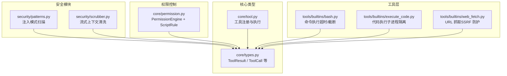
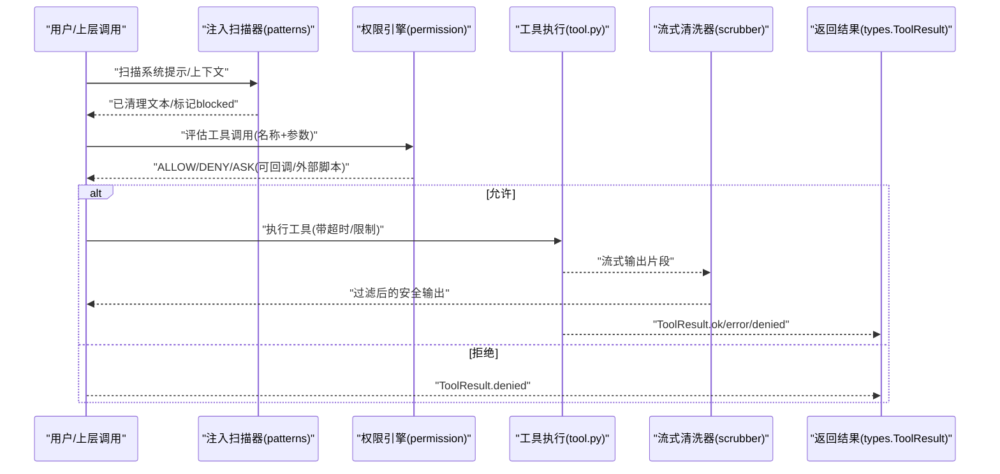
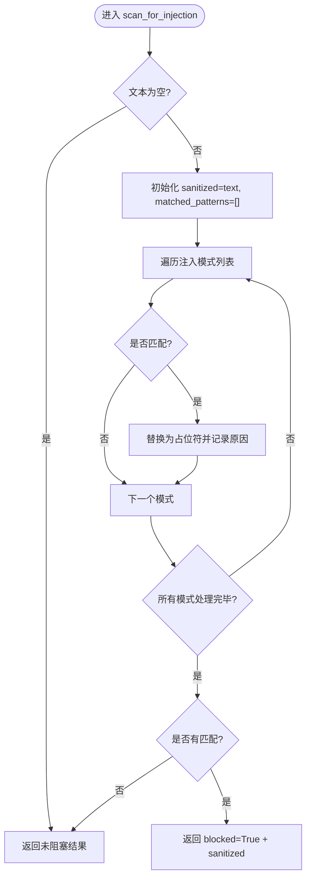
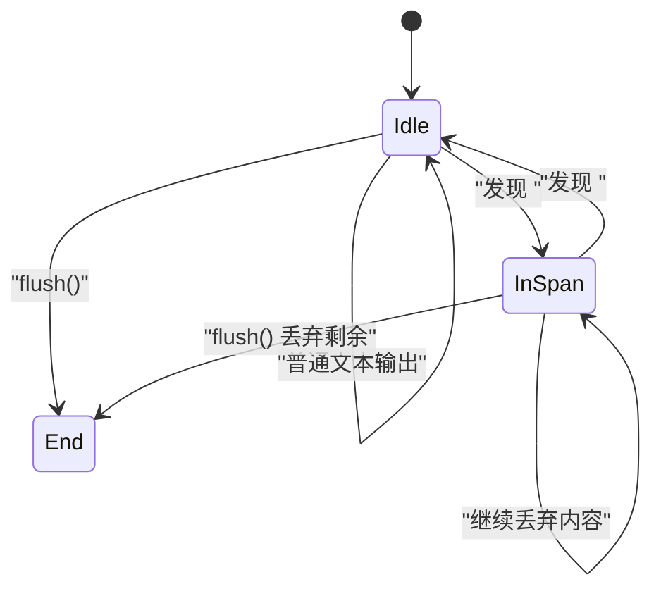
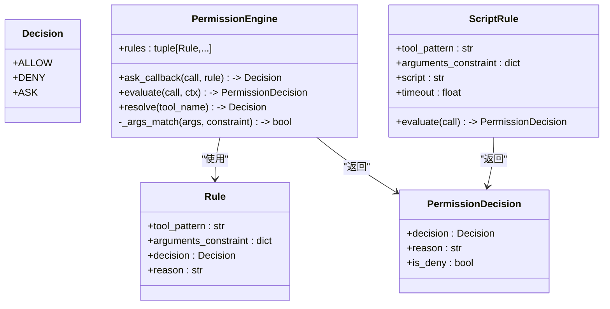
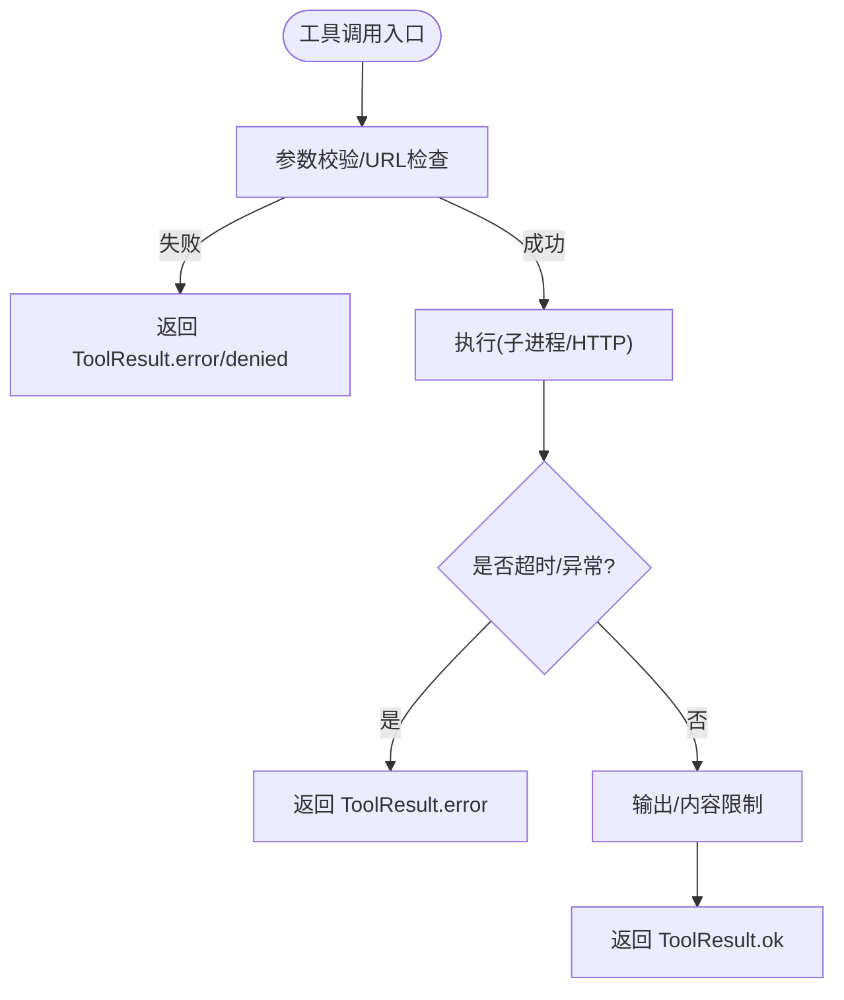
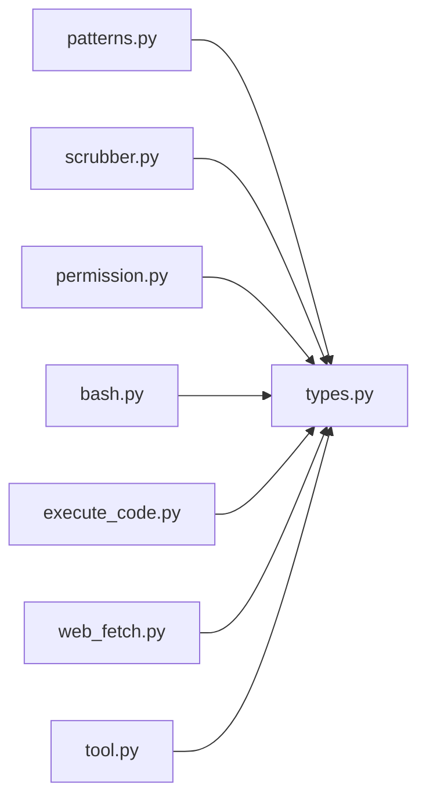

# 安全框架

<cite>
**本文引用的文件**   
- [README.md](file://README.md)
- [security/__init__.py](file://src/microagent/security/__init__.py)
- [security/patterns.py](file://src/microagent/security/patterns.py)
- [security/scrubber.py](file://src/microagent/security/scrubber.py)
- [core/permission.py](file://src/microagent/core/permission.py)
- [core/types.py](file://src/microagent/core/types.py)
- [core/tool.py](file://src/microagent/core/tool.py)
- [tools/builtins/bash.py](file://src/microagent/tools/builtins/bash.py)
- [tools/builtins/execute_code.py](file://src/microagent/tools/builtins/execute_code.py)
- [tools/builtins/web_fetch.py](file://src/microagent/tools/builtins/web_fetch.py)
- [tests/unit/test_security.py](file://tests/unit/test_security.py)
</cite>

## 目录
1. [简介](#简介)
2. [项目结构](#项目结构)
3. [核心组件](#核心组件)
4. [架构总览](#架构总览)
5. [详细组件分析](#详细组件分析)
6. [依赖关系分析](#依赖关系分析)
7. [性能考量](#性能考量)
8. [故障排查指南](#故障排查指南)
9. [结论](#结论)
10. [附录](#附录)

## 简介
本文件聚焦 MicroAgent 项目的“安全框架”，围绕三大安全能力展开：
- 注入扫描与上下文清洗：对系统提示词与上下文内容中的注入模式进行识别与替换，并在流式输出中剥离敏感上下文围栏。
- 权限控制引擎：基于规则（含外部脚本）的细粒度工具调用访问控制，支持允许、拒绝与交互式询问。
- 工具层安全加固：针对高风险工具（如命令执行、代码执行、网络请求）内置超时、输出限制、SSRF 防护等机制。

该安全框架以最小侵入的方式嵌入到 Agent 会话运行循环中，确保在保持扩展性的同时提供可配置、可审计的安全保障。

## 项目结构
与安全相关的核心代码分布在以下模块：
- security：注入模式扫描与流式上下文清洗
- core/permission：权限引擎与规则定义
- tools/builtins：内置工具实现，包含多项安全加固
- core/types：统一消息与事件类型，贯穿安全决策结果与错误返回
- tests/unit/test_security.py：覆盖注入扫描与上下文清洗的单元测试

图表来源
- [security/patterns.py:1-59](file://src/microagent/security/patterns.py#L1-L59)
- [security/scrubber.py:1-95](file://src/microagent/security/scrubber.py#L1-L95)
- [core/permission.py:1-234](file://src/microagent/core/permission.py#L1-L234)
- [tools/builtins/bash.py:1-58](file://src/microagent/tools/builtins/bash.py#L1-L58)
- [tools/builtins/execute_code.py:1-61](file://src/microagent/tools/builtins/execute_code.py#L1-L61)
- [tools/builtins/web_fetch.py:1-93](file://src/microagent/tools/builtins/web_fetch.py#L1-L93)
- [core/types.py:1-197](file://src/microagent/core/types.py#L1-L197)
- [core/tool.py:1-362](file://src/microagent/core/tool.py#L1-L362)

章节来源
- [README.md:349-382](file://README.md#L349-L382)

## 核心组件
- 注入扫描器（patterns）：基于正则黑名单检测系统提示词与上下文中的注入尝试，命中后以占位符替换并标记 blocked。
- 流式上下文清洗器（scrubber）：维护状态缓冲，跨分片处理 <context>...</context> 围栏，确保不会将内部上下文回显给用户。
- 权限引擎（permission）：自上而下匹配规则，支持 fnmatch 工具名与参数约束；默认 DENY；ASK 通过回调交互；支持外部脚本决策。
- 工具层安全加固：bash/execute_code 设置超时与输出上限；web_fetch 实施 SSRF 防护（域名/IP 白名单/黑名单）。
- 统一类型（types）：ToolResult.denied 用于表达被拒绝的执行结果，配合 PermissionDecision 形成端到端安全闭环。

章节来源
- [security/patterns.py:1-59](file://src/microagent/security/patterns.py#L1-L59)
- [security/scrubber.py:1-95](file://src/microagent/security/scrubber.py#L1-L95)
- [core/permission.py:1-234](file://src/microagent/core/permission.py#L1-L234)
- [tools/builtins/bash.py:1-58](file://src/microagent/tools/builtins/bash.py#L1-L58)
- [tools/builtins/execute_code.py:1-61](file://src/microagent/tools/builtins/execute_code.py#L1-L61)
- [tools/builtins/web_fetch.py:1-93](file://src/microagent/tools/builtins/web_fetch.py#L1-L93)
- [core/types.py:97-116](file://src/microagent/core/types.py#L97-L116)

## 架构总览
安全框架在 Agent 会话运行循环中的位置与作用如下：
- 输入侧：对用户/系统提示词进行注入扫描，必要时替换为占位符。
- 决策侧：工具调用前经 PermissionEngine 评估，可能触发 ASK 或外部脚本决策。
- 执行侧：各工具内置超时、输出限制、SSRF 防护等安全措施。
- 输出侧：流式响应经 StreamingContextScrubber 过滤，防止内部上下文泄露。

图表来源
- [security/patterns.py:33-58](file://src/microagent/security/patterns.py#L33-L58)
- [core/permission.py:71-127](file://src/microagent/core/permission.py#L71-L127)
- [core/tool.py:256-280](file://src/microagent/core/tool.py#L256-L280)
- [security/scrubber.py:27-68](file://src/microagent/security/scrubber.py#L27-L68)
- [core/types.py:97-116](file://src/microagent/core/types.py#L97-L116)

## 详细组件分析

### 注入扫描器（patterns）
- 功能：使用一组预定义的正则表达式检测注入模式（如 system-reminder、system 标签、context/memory-context 围栏等），命中后将对应片段替换为占位符并返回 blocked=True。
- 数据结构：InjectionResult 包含 blocked、sanitized、reason。
- 复杂度：线性扫描每个模式，时间复杂度 O(P·N)，P 为模式数，N 为文本长度。
- 优化点：可将热点模式编译缓存（已使用 re.compile），避免重复编译开销。

图表来源
- [security/patterns.py:33-58](file://src/microagent/security/patterns.py#L33-L58)

章节来源
- [security/patterns.py:1-59](file://src/microagent/security/patterns.py#L1-L59)

### 流式上下文清洗器（scrubber）
- 功能：维护缓冲与状态，跨 feed() 调用处理 <context>...</context> 围栏，丢弃围栏内内容，flush() 时清理未完成围栏。
- 状态机：_in_span 表示是否在围栏内；feed() 逐步解析；flush() 收尾。
- 复杂度：单次 feed 操作近似 O(L)，L 为当前缓冲长度；整体线性。
- 健壮性：正确处理分片边界（部分标签跨分片）、不完整围栏丢弃。

图表来源
- [security/scrubber.py:23-95](file://src/microagent/security/scrubber.py#L23-L95)

章节来源
- [security/scrubber.py:1-95](file://src/microagent/security/scrubber.py#L1-L95)

### 权限引擎（permission）
- 决策流程：按规则自上而下匹配，fnmatch 工具名 + 参数约束；若规则为 ASK 且存在 ask_callback，则调用回调决定最终决策；否则默认 DENY。
- 快速解析：resolve() 用于工具清单展示，返回最宽松决策。
- 外部脚本：ScriptRule 通过子进程执行 Python 脚本，接收 JSON 输入，要求 stdout 输出 allow/deny，超时或非零退出码视为拒绝。
- 默认规则：DEFAULT_RULES 对危险命令（rm/mv/chmod/chown）与 task 启动采用 ASK，其余多数工具默认 ALLOW。

图表来源
- [core/permission.py:27-127](file://src/microagent/core/permission.py#L27-L127)
- [core/permission.py:135-199](file://src/microagent/core/permission.py#L135-L199)

章节来源
- [core/permission.py:1-234](file://src/microagent/core/permission.py#L1-L234)

### 工具层安全加固
- bash：异步子进程执行 shell 命令，设置超时与输出上限（MAX_OUTPUT），非零退出码包装为错误结果。
- execute_code：在独立子进程中执行 Python 代码，仅 stdlib，无 agent 内存/工具访问，超时保护与错误封装。
- web_fetch：SSRF 防护，校验 URL scheme 与主机名/IP 范围，阻止本地/私有地址，限制响应大小。

图表来源
- [tools/builtins/bash.py:14-58](file://src/microagent/tools/builtins/bash.py#L14-L58)
- [tools/builtins/execute_code.py:17-61](file://src/microagent/tools/builtins/execute_code.py#L17-L61)
- [tools/builtins/web_fetch.py:13-93](file://src/microagent/tools/builtins/web_fetch.py#L13-L93)

章节来源
- [tools/builtins/bash.py:1-58](file://src/microagent/tools/builtins/bash.py#L1-L58)
- [tools/builtins/execute_code.py:1-61](file://src/microagent/tools/builtins/execute_code.py#L1-L61)
- [tools/builtins/web_fetch.py:1-93](file://src/microagent/tools/builtins/web_fetch.py#L1-L93)

### 统一类型与错误传播（types）
- ToolResult.denied(reason)：明确表达被权限引擎拒绝的结果，便于上层统计与审计。
- ToolCall/ToolResult：贯穿工具注册、执行与结果返回，保证类型一致性与可扩展性。

章节来源
- [core/types.py:97-116](file://src/microagent/core/types.py#L97-L116)
- [core/types.py:76-95](file://src/microagent/core/types.py#L76-L95)

## 依赖关系分析
- patterns 与 scrubber 不依赖其他安全模块，仅依赖标准库 re 与 dataclasses。
- permission 依赖 core.types 中的 ToolCall，以及 fnmatch 进行模式匹配。
- 工具实现依赖 core.types 的 ToolResult，并通过 core.tool 的工具装饰器与注册机制集成。
- 测试用例验证注入扫描与流式清洗的正确性，覆盖正常文本、多种注入模式、分片围栏与 flush/reset 行为。

图表来源
- [security/patterns.py:1-59](file://src/microagent/security/patterns.py#L1-L59)
- [security/scrubber.py:1-95](file://src/microagent/security/scrubber.py#L1-L95)
- [core/permission.py:1-234](file://src/microagent/core/permission.py#L1-L234)
- [tools/builtins/bash.py:1-58](file://src/microagent/tools/builtins/bash.py#L1-L58)
- [tools/builtins/execute_code.py:1-61](file://src/microagent/tools/builtins/execute_code.py#L1-L61)
- [tools/builtins/web_fetch.py:1-93](file://src/microagent/tools/builtins/web_fetch.py#L1-L93)
- [core/tool.py:1-362](file://src/microagent/core/tool.py#L1-L362)

章节来源
- [tests/unit/test_security.py:1-89](file://tests/unit/test_security.py#L1-L89)

## 性能考量
- 注入扫描：正则匹配为 CPU 密集型，建议复用已编译的模式对象，避免重复编译；对于超长文本可考虑分段扫描。
- 流式清洗：每次 feed 操作线性处理缓冲，注意控制缓冲大小，避免内存膨胀；flush 时应及时释放状态。
- 权限评估：规则数量较多时，可考虑索引化（如工具名哈希表）加速匹配；参数约束匹配应尽量简化正则。
- 工具执行：合理设置超时与输出上限，避免资源耗尽；对外部脚本执行应限制超时与资源配额。

## 故障排查指南
- 注入扫描误报/漏报：检查 _INJECTION_PATTERNS 列表，确认正则是否覆盖目标场景；可通过单元测试定位问题。
- 流式清洗丢失内容：确认 feed() 调用顺序与分片边界，检查 flush() 是否在流结束时调用；查看 _in_span 状态转换。
- 权限引擎拒绝策略不符合预期：核对 DEFAULT_RULES 与自定义规则顺序；确认 ASK 回调是否正确返回 Decision；外部脚本需确保 stdout 输出 allow/deny 且退出码为 0。
- 工具执行异常：检查超时设置、输出限制、SSRF 防护规则；查看 ToolResult.error 中的详细信息。

章节来源
- [tests/unit/test_security.py:1-89](file://tests/unit/test_security.py#L1-L89)
- [core/permission.py:201-234](file://src/microagent/core/permission.py#L201-L234)

## 结论
MicroAgent 的安全框架以“最小侵入、最大可控”为原则，通过注入扫描、权限引擎与工具层加固三位一体，构建了从输入到输出的全链路安全保障。其设计兼顾了易用性与扩展性，适合在多种场景中灵活部署与定制。

## 附录
- 最佳实践建议：
  - 在生产环境中启用严格的默认 DENY 策略，仅开放必要工具。
  - 为高风险操作配置 ASK 回调或外部脚本审核。
  - 定期更新注入模式与 SSRF 黑名单，应对新型攻击。
  - 监控与审计 ToolResult.denied 与错误日志，持续优化规则。