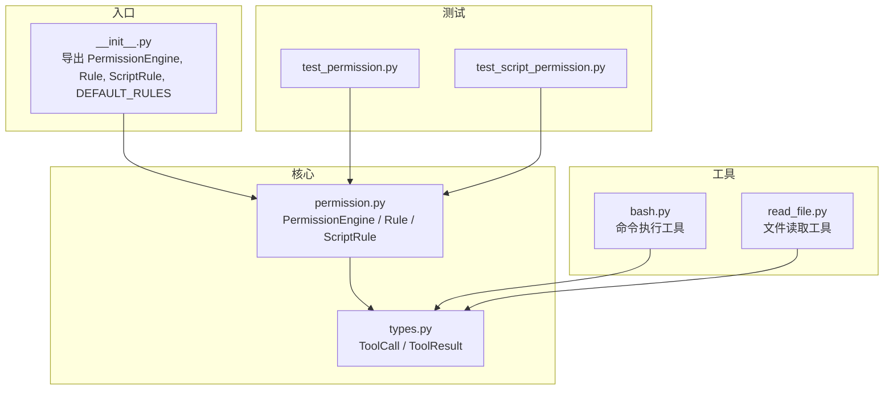
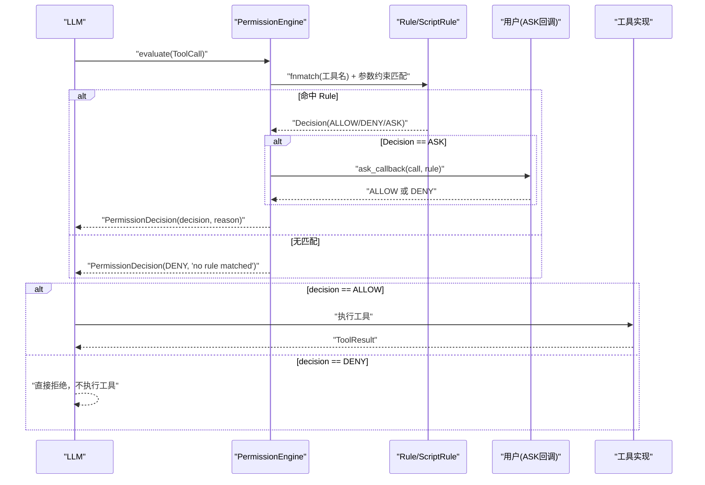
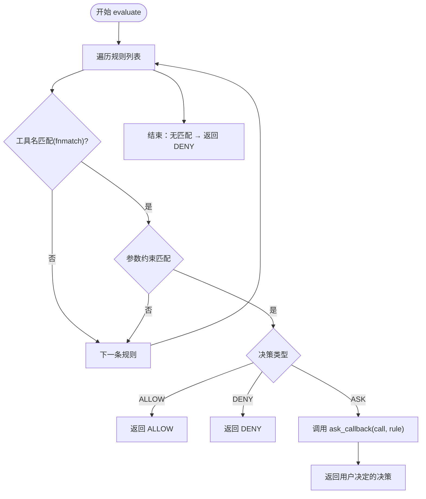
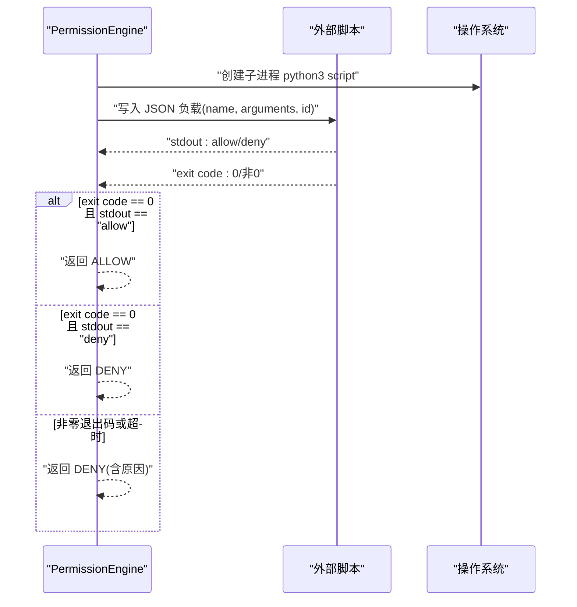
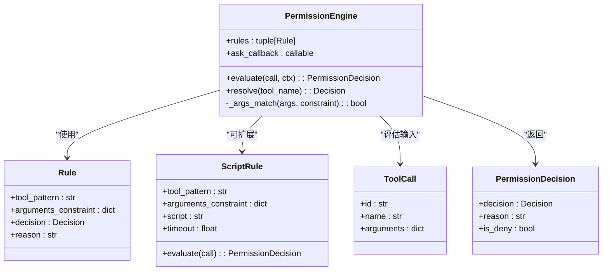

# 权限控制系统

<cite>
**本文引用的文件**
- [permission.py](file://src/microagent/core/permission.py)
- [types.py](file://src/microagent/core/types.py)
- [__init__.py](file://src/microagent/__init__.py)
- [test_permission.py](file://tests/unit/test_permission.py)
- [test_script_permission.py](file://tests/unit/test_script_permission.py)
- [bash.py](file://src/microagent/tools/builtins/bash.py)
- [read_file.py](file://src/microagent/tools/builtins/read_file.py)
</cite>

## 目录
1. [简介](#简介)
2. [项目结构](#项目结构)
3. [核心组件](#核心组件)
4. [架构总览](#架构总览)
5. [详细组件分析](#详细组件分析)
6. [依赖关系分析](#依赖关系分析)
7. [性能考量](#性能考量)
8. [故障排查指南](#故障排查指南)
9. [结论](#结论)
10. [附录：配置与使用示例](#附录配置与使用示例)

## 简介
本文件为 MicroAgent 的权限控制系统提供系统化、可操作的文档。重点解释 PermissionEngine 的工作原理，包括基于规则的权限决策引擎；说明三种决策类型 ALLOW（自动允许）、DENY（自动拒绝）、ASK（需要用户确认）的应用场景；阐述 Rule 与 ScriptRule 的配置方式与使用方法，涵盖内置规则模式与自定义脚本规则的实现；并通过具体配置示例展示如何设置文件访问权限、命令执行权限等常见场景。文末包含权限决策流程图与规则匹配算法说明，帮助开发者理解权限控制的内部机制。

## 项目结构
权限控制相关代码集中在 core 模块中，并通过包入口对外暴露。工具实现位于 tools/builtins 下，测试用例位于 tests/unit。

图表来源
- [permission.py:1-213](file://src/microagent/core/permission.py#L1-L213)
- [types.py:1-189](file://src/microagent/core/types.py#L1-L189)
- [__init__.py:1-133](file://src/microagent/__init__.py#L1-L133)
- [bash.py:1-58](file://src/microagent/tools/builtins/bash.py#L1-L58)
- [read_file.py:1-55](file://src/microagent/tools/builtins/read_file.py#L1-L55)
- [test_permission.py:1-102](file://tests/unit/test_permission.py#L1-L102)
- [test_script_permission.py:1-63](file://tests/unit/test_script_permission.py#L1-L63)

章节来源
- [permission.py:1-213](file://src/microagent/core/permission.py#L1-L213)
- [types.py:1-189](file://src/microagent/core/types.py#L1-L189)
- [__init__.py:1-133](file://src/microagent/__init__.py#L1-L133)

## 核心组件
- Decision：权限决策枚举，包含 ALLOW、DENY、ASK 三种状态。
- Rule：基于 fnmatch 的工具名匹配 + 参数约束，返回固定决策。
- PermissionEngine：规则评估器，按顺序匹配规则并返回决策；支持 ASK 回调；未命中时默认 DENY。
- ScriptRule：外部 Python 脚本驱动的权限规则，通过子进程执行脚本，根据 stdout 输出与退出码决定 ALLOW/DENY。
- ToolCall / ToolResult：工具调用与结果的数据结构，贯穿权限判断与工具执行流程。

章节来源
- [permission.py:27-116](file://src/microagent/core/permission.py#L27-L116)
- [permission.py:123-187](file://src/microagent/core/permission.py#L123-L187)
- [types.py:76-116](file://src/microagent/core/types.py#L76-L116)

## 架构总览
权限控制的整体流程如下：LLM 生成工具调用请求 → PermissionEngine 依据规则列表进行匹配 → 返回 ALLOW/DENY/ASK → 若为 ASK 则调用 ask_callback 获取用户确认 → 最终由工具层执行或拒绝。

图表来源
- [permission.py:82-102](file://src/microagent/core/permission.py#L82-L102)
- [permission.py:146-186](file://src/microagent/core/permission.py#L146-L186)
- [types.py:76-116](file://src/microagent/core/types.py#L76-L116)

## 详细组件分析

### PermissionEngine：基于规则的权限决策引擎
- 规则匹配策略：自上而下遍历规则，首个匹配的规则决定决策。
- 匹配维度：
  - 工具名：使用 fnmatch 模式匹配（如 "bash"、"write_*"）。
  - 参数约束：对每个键值进行 fnmatch 匹配，非字符串值会先转为字符串再匹配。
- 决策行为：
  - ALLOW：直接允许执行。
  - DENY：直接拒绝执行。
  - ASK：调用注入的 ask_callback 获取用户确认，再返回最终决策。
- 默认策略：若无任何规则匹配，返回 DENY。
- 快速解析：resolve(tool_name) 返回该工具的最高优先级决策（用于 UI 展示或预检）。

图表来源
- [permission.py:82-102](file://src/microagent/core/permission.py#L82-L102)
- [permission.py:104-116](file://src/microagent/core/permission.py#L104-L116)

章节来源
- [permission.py:71-116](file://src/microagent/core/permission.py#L71-L116)
- [test_permission.py:18-80](file://tests/unit/test_permission.py#L18-L80)

### Rule：静态规则
- 字段：
  - tool_pattern：工具名匹配模式（fnmatch）。
  - arguments_constraint：参数约束字典（键到值的 fnmatch 匹配）。
  - decision：固定决策（ALLOW/DENY/ASK）。
  - reason：可选原因说明。
- 适用场景：
  - 白名单：对特定工具名放行（如 read_file、grep、glob）。
  - 黑名单：对危险操作统一拒绝（如 bash 删除命令）。
  - 交互式：对敏感操作要求用户确认（如 write_file、edit_file）。

章节来源
- [permission.py:40-61](file://src/microagent/core/permission.py#L40-L61)
- [test_permission.py:12-44](file://tests/unit/test_permission.py#L12-L44)

### ScriptRule：外部脚本规则
- 工作原理：
  - 以子进程方式运行指定 Python 脚本。
  - 将 ToolCall 序列化为 JSON 传入 stdin（包含 name、arguments、id）。
  - 脚本需打印 "allow" 或 "deny" 到 stdout，并以 0 退出码结束。
  - 非零退出码或超时均视为 DENY。
- 超时保护：可通过 timeout 参数限制脚本执行时间，避免阻塞。
- 错误处理：异常或超时都会返回 DENY，并在 reason 中记录原因。

图表来源
- [permission.py:146-186](file://src/microagent/core/permission.py#L146-L186)
- [test_script_permission.py:7-63](file://tests/unit/test_script_permission.py#L7-L63)

章节来源
- [permission.py:123-187](file://src/microagent/core/permission.py#L123-L187)
- [test_script_permission.py:1-63](file://tests/unit/test_script_permission.py#L1-L63)

### 默认规则集 DEFAULT_RULES
- 作用：为常用内置工具提供默认放行策略，确保开箱即用。
- 覆盖范围：文件读写、搜索、浏览器交互、代码执行、会话管理等。
- 扩展建议：在业务环境中可根据安全策略调整默认规则，或对高危工具增加 ASK。

章节来源
- [permission.py:189-213](file://src/microagent/core/permission.py#L189-L213)
- [test_permission.py:81-102](file://tests/unit/test_permission.py#L81-L102)

### 与工具层的集成
- 工具定义：工具函数通过装饰器注册，声明名称、描述与参数。
- 权限前置：在执行工具前，PermissionEngine.evaluate 决定是否允许。
- 结果封装：被拒绝时，工具层可返回 ToolResult.denied(reason) 以便上层统一处理。

章节来源
- [bash.py:14-58](file://src/microagent/tools/builtins/bash.py#L14-L58)
- [read_file.py:14-55](file://src/microagent/tools/builtins/read_file.py#L14-L55)
- [types.py:97-116](file://src/microagent/core/types.py#L97-L116)

## 依赖关系分析
- PermissionEngine 依赖 types.ToolCall 作为输入，返回 PermissionDecision。
- ScriptRule 依赖外部 Python 解释器与脚本路径，通过 asyncio 子进程执行。
- 包入口 __init__.py 统一导出 PermissionEngine、Rule、ScriptRule、DEFAULT_RULES，便于上层使用。

图表来源
- [permission.py:71-116](file://src/microagent/core/permission.py#L71-L116)
- [permission.py:123-187](file://src/microagent/core/permission.py#L123-L187)
- [types.py:76-116](file://src/microagent/core/types.py#L76-L116)

章节来源
- [__init__.py:6-13](file://src/microagent/__init__.py#L6-L13)
- [permission.py:71-116](file://src/microagent/core/permission.py#L71-L116)

## 性能考量
- 规则匹配复杂度：线性扫描规则列表，首次匹配即返回。建议在规则较多时使用更具体的 tool_pattern 以减少匹配次数。
- 参数约束匹配：每个约束键进行一次 fnmatch，注意避免过于复杂的模式导致额外开销。
- 外部脚本执行：子进程启动与通信存在开销，建议合理设置 timeout，避免长时间阻塞。
- 默认策略：无匹配时直接 DENY，减少不必要的计算。

## 故障排查指南
- 常见问题
  - 工具被拒绝：检查是否缺少匹配的 Rule，或规则顺序导致后续规则无法生效。
  - ASK 未触发：确认规则决策为 ASK 且已注入 ask_callback。
  - 脚本规则失败：检查脚本输出是否为 "allow"/"deny"，退出码是否为 0，是否存在超时。
- 定位方法
  - 查看 PermissionDecision.reason 中的原因信息。
  - 使用 engine.resolve(tool_name) 快速验证工具的默认最高决策。
  - 在测试用例中参考 test_permission.py 与 test_script_permission.py 的行为。

章节来源
- [test_permission.py:25-44](file://tests/unit/test_permission.py#L25-L44)
- [test_script_permission.py:17-46](file://tests/unit/test_script_permission.py#L17-L46)

## 结论
MicroAgent 的权限控制系统以 PermissionEngine 为核心，结合 Rule 与 ScriptRule 提供了灵活、可扩展的权限决策能力。通过 ALLOW/DENY/ASK 三种决策类型，既能满足自动化场景的高效执行，也能在敏感操作中引入用户确认。默认规则集降低了使用门槛，同时支持通过外部脚本实现复杂策略。开发者可据此构建符合业务安全要求的权限策略。

## 附录：配置与使用示例
- 文件访问权限
  - 目标：允许读取任意文本文件，限制写入路径。
  - 规则思路：
    - 对 read_file 使用空参数约束放行。
    - 对 write_file 使用 path 参数的 fnmatch 限制到工作目录。
  - 参考：DEFAULT_RULES 中对 read_file 的放行策略。
- 命令执行权限
  - 目标：仅允许执行只读命令，禁止破坏性操作。
  - 规则思路：
    - 对 bash 的参数 command 使用 fnmatch 限制为只读命令（如 ls、cat、grep）。
    - 对 rm、rm -rf 等危险命令显式 DENY。
  - 参考：test_permission.py 中 first_match_wins 的顺序匹配行为。
- 交互式确认
  - 目标：对写操作要求用户确认。
  - 规则思路：
    - 对 write_file/edit_file 设置为 ASK，并注入 ask_callback 显示上下文与选项。
  - 参考：test_permission.py 中 ask_callback 的使用。
- 自定义脚本规则
  - 目标：基于外部审计逻辑动态决策。
  - 规则思路：
    - 编写 Python 脚本，接收 JSON 负载，输出 "allow"/"deny"。
    - 设置合理的 timeout，确保不会阻塞主流程。
  - 参考：test_script_permission.py 中的 allow/deny/timeout 用例。

章节来源
- [permission.py:189-213](file://src/microagent/core/permission.py#L189-L213)
- [test_permission.py:45-75](file://tests/unit/test_permission.py#L45-L75)
- [test_script_permission.py:7-63](file://tests/unit/test_script_permission.py#L7-L63)