# 核心概念

<cite>
**本文引用的文件**   
- [src/microagent/core/types.py](file://src/microagent/core/types.py)
- [src/microagent/core/tool.py](file://src/microagent/core/tool.py)
- [src/microagent/core/permission.py](file://src/microagent/core/permission.py)
- [src/microagent/core/event.py](file://src/microagent/core/event.py)
- [src/microagent/core/store.py](file://src/microagent/core/store.py)
- [src/microagent/session/budget.py](file://src/microagent/session/budget.py)
- [src/microagent/session/runner.py](file://src/microagent/session/runner.py)
- [src/microagent/agent.py](file://src/microagent/agent.py)
- [src/microagent/config.py](file://src/microagent/config.py)
</cite>

## 目录
1. [简介](#简介)
2. [项目结构](#项目结构)
3. [核心组件](#核心组件)
4. [架构总览](#架构总览)
5. [详细组件分析](#详细组件分析)
6. [依赖关系分析](#依赖关系分析)
7. [性能考量](#性能考量)
8. [故障排查指南](#故障排查指南)
9. [结论](#结论)
10. [附录](#附录)

## 简介
本文件面向开发者，系统化阐述 MicroAgent 的核心概念与工作机制，重点覆盖：
- Agent 的概念与运行流程（会话、轮次、消息）
- 工具调用机制（ToolCall、ToolResult、流式进度）
- 权限控制决策逻辑（ALLOW/DENY/ASK）
- 预算系统（Budget）的树形结构与继承机制
- 事件系统（EventBus）的发布订阅模式
- 存储抽象（Store 协议）的设计思想与实现

通过架构图、数据流图与代码级引用路径，帮助读者快速理解并扩展 MicroAgent。

## 项目结构
MicroAgent 采用分层与模块化组织方式：
- core：定义通用类型、工具协议、权限引擎、事件总线与存储协议
- session：会话运行器、预算、压缩与搜索等会话级能力
- agent：对外统一入口，装配各子系统
- config：配置解析（CLI > 环境变量 > 配置文件 > 默认值）
- tools.builtins：内置工具集合（通过装饰器注册）
- llm：LLM 客户端与连接池
- memory/skill/cron/subagent 等：记忆、技能、定时任务、子代理等扩展能力

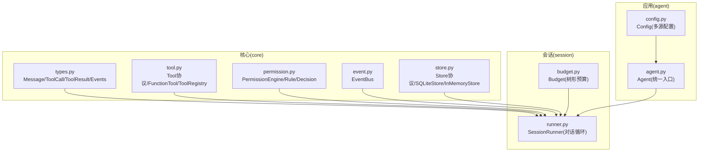

**图表来源** 
- [src/microagent/core/types.py:1-189](file://src/microagent/core/types.py#L1-L189)
- [src/microagent/core/tool.py:1-309](file://src/microagent/core/tool.py#L1-L309)
- [src/microagent/core/permission.py:1-213](file://src/microagent/core/permission.py#L1-L213)
- [src/microagent/core/event.py:1-37](file://src/microagent/core/event.py#L1-L37)
- [src/microagent/core/store.py:1-226](file://src/microagent/core/store.py#L1-L226)
- [src/microagent/session/budget.py:1-169](file://src/microagent/session/budget.py#L1-L169)
- [src/microagent/session/runner.py:1-341](file://src/microagent/session/runner.py#L1-L341)
- [src/microagent/agent.py:1-113](file://src/microagent/agent.py#L1-L113)
- [src/microagent/config.py:1-101](file://src/microagent/config.py#L1-L101)

**章节来源**
- [src/microagent/agent.py:1-113](file://src/microagent/agent.py#L1-L113)
- [src/microagent/config.py:1-101](file://src/microagent/config.py#L1-L101)

## 核心组件
本节聚焦 MicroAgent 的关键数据结构与运行机制：
- Message、Usage、ToolCall、ToolResult、各类 Event（TextDelta/ToolCallDelta/ToolProgressDelta/ToolResultDelta/TurnComplete/TurnFailed）
- Tool 协议与 FunctionTool、ToolRegistry
- PermissionEngine 与 Rule/Decision
- EventBus 发布订阅
- Store 协议与 SQLiteStore/InMemoryStore
- Budget 树形预算与继承
- SessionRunner 对话循环与工具执行
- Agent 统一入口与配置装配

**章节来源**
- [src/microagent/core/types.py:1-189](file://src/microagent/core/types.py#L1-L189)
- [src/microagent/core/tool.py:1-309](file://src/microagent/core/tool.py#L1-L309)
- [src/microagent/core/permission.py:1-213](file://src/microagent/core/permission.py#L1-L213)
- [src/microagent/core/event.py:1-37](file://src/microagent/core/event.py#L1-L37)
- [src/microagent/core/store.py:1-226](file://src/microagent/core/store.py#L1-L226)
- [src/microagent/session/budget.py:1-169](file://src/microagent/session/budget.py#L1-L169)
- [src/microagent/session/runner.py:1-341](file://src/microagent/session/runner.py#L1-L341)
- [src/microagent/agent.py:1-113](file://src/microagent/agent.py#L1-L113)

## 架构总览
下图展示了从用户输入到最终文本输出的完整调用链，以及工具调用、权限检查、预算消耗、事件广播与持久化的交互。

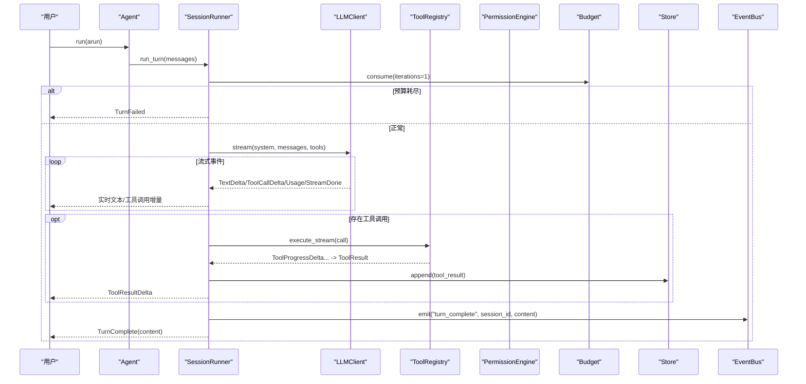

**图表来源** 
- [src/microagent/agent.py:79-113](file://src/microagent/agent.py#L79-L113)
- [src/microagent/session/runner.py:118-284](file://src/microagent/session/runner.py#L118-L284)
- [src/microagent/core/tool.py:221-280](file://src/microagent/core/tool.py#L221-L280)
- [src/microagent/core/permission.py:71-103](file://src/microagent/core/permission.py#L71-L103)
- [src/microagent/session/budget.py:99-130](file://src/microagent/session/budget.py#L99-L130)
- [src/microagent/core/store.py:122-140](file://src/microagent/core/store.py#L122-L140)
- [src/microagent/core/event.py:22-37](file://src/microagent/core/event.py#L22-L37)

## 详细组件分析

### 数据结构与消息模型（Message/ToolCall/ToolResult/Events）
- Message：统一的消息载体，支持 role（user/assistant/tool）、content、tool_calls、tool_call_id、usage、is_error；提供 user()/assistant()/tool_result() 便捷构造方法，以及 to_openai_dict() 适配 OpenAI SDK。
- Usage：记录输入/输出 token 与成本。
- ToolCall：一次工具调用的标识、名称与参数。
- ToolResult：工具执行结果，包含内容、错误标记与可选元数据；提供 ok/error/denied 工厂方法。
- Events：包括 TextDelta（增量文本）、ToolCallDelta（工具调用完成）、ToolProgressDelta（工具流式进度）、ToolResultDelta（工具结果）、TurnComplete/TurnFailed（轮次结束）。

这些类型贯穿 SessionRunner、LLMClient 与工具实现之间的数据交换。

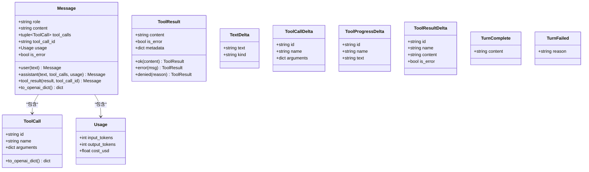

**图表来源** 
- [src/microagent/core/types.py:17-116](file://src/microagent/core/types.py#L17-L116)
- [src/microagent/core/types.py:123-189](file://src/microagent/core/types.py#L123-L189)

**章节来源**
- [src/microagent/core/types.py:1-189](file://src/microagent/core/types.py#L1-L189)

### 工具系统与调用机制（Tool/FunctionTool/ToolRegistry）
- Tool 协议：每个工具必须实现 name、description、parameters（OpenAI JSON Schema）与 execute(call, ctx)。
- FunctionTool：将异步函数包装为 Tool，自动推断参数 schema；若返回 AsyncIterator[str] 则启用流式支持，逐块产出 ToolProgressDelta，并最终产出 ToolResult。
- ToolRegistry：维护工具集合，支持按名称查找、导出 OpenAI tools 列表、并发执行工具调用（execute_stream 优先，否则回退到 execute）。

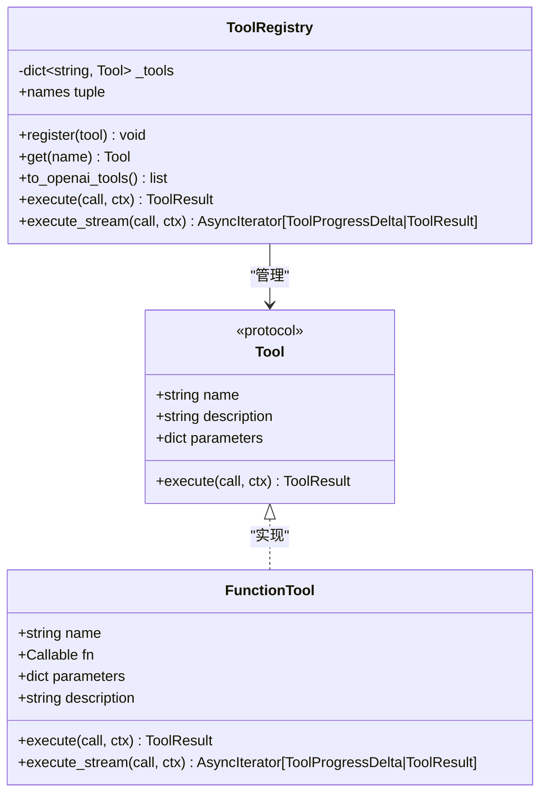

**图表来源** 
- [src/microagent/core/tool.py:40-118](file://src/microagent/core/tool.py#L40-L118)
- [src/microagent/core/tool.py:221-280](file://src/microagent/core/tool.py#L221-L280)

**章节来源**
- [src/microagent/core/tool.py:1-309](file://src/microagent/core/tool.py#L1-L309)

### 权限控制系统（PermissionEngine/Rule/Decision）
- Decision：允许（ALLOW）、拒绝（DENY）、询问（ASK，需回调）。
- Rule：基于工具名模式（fnmatch）与参数约束匹配，决定策略。
- PermissionEngine：自上而下匹配规则，首个命中即返回；未命中默认 DENY；若为 ASK 则调用 ask_callback 获取用户决策。
- ScriptRule：外部脚本决策（stdin 传入 JSON，stdout 打印 allow/deny），超时或异常视为 DENY。

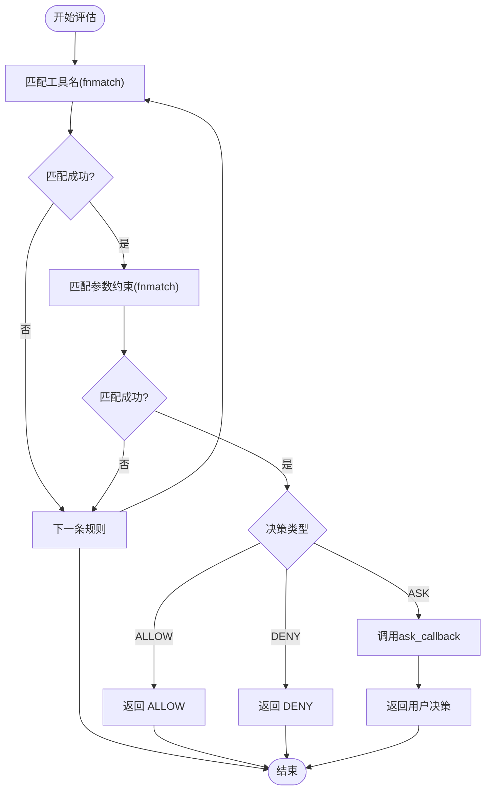

**图表来源** 
- [src/microagent/core/permission.py:71-103](file://src/microagent/core/permission.py#L71-L103)
- [src/microagent/core/permission.py:123-186](file://src/microagent/core/permission.py#L123-L186)

**章节来源**
- [src/microagent/core/permission.py:1-213](file://src/microagent/core/permission.py#L1-L213)

### 预算系统（Budget）——树形结构与继承
- Budget：根节点创建共享 cancel_event；spawn() 生成子预算，默认使用父剩余资源的 1/3；consume() 累计自身与祖先节点的“后代使用量”，并在达到限制时触发取消信号与异常。
- 属性：exhausted、remaining_iterations/tokens/cost 考虑后代累计；summary() 输出统计。
- 异常：BudgetExceeded 用于预算耗尽时的短路控制。

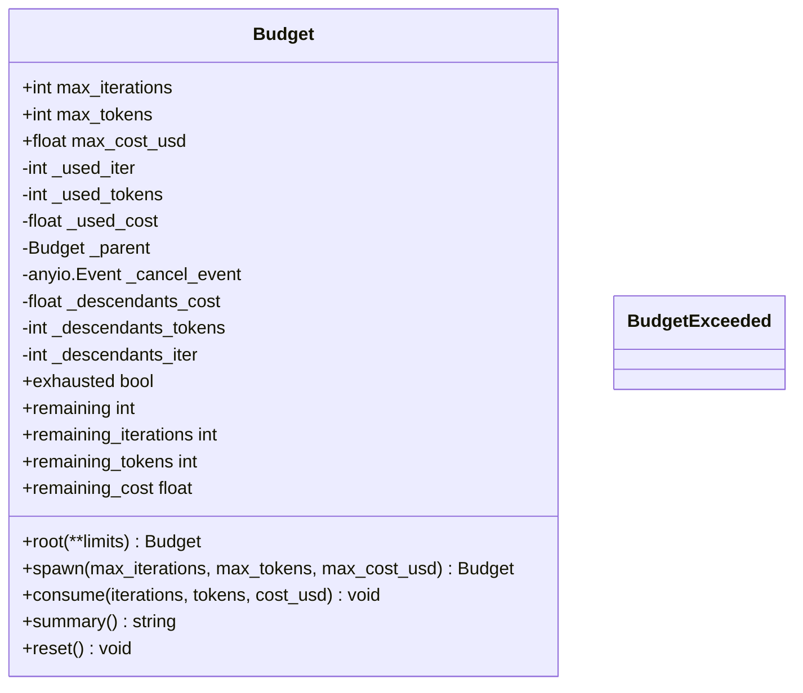

**图表来源** 
- [src/microagent/session/budget.py:14-169](file://src/microagent/session/budget.py#L14-L169)

**章节来源**
- [src/microagent/session/budget.py:1-169](file://src/microagent/session/budget.py#L1-L169)

### 事件系统（EventBus）——发布订阅
- EventBus：轻量级观察者模式，on(event, cb) 注册回调，emit(event, *args, **kwargs) 顺序触发所有回调；异常被吞掉以避免影响主循环；支持同步与异步回调透明处理。

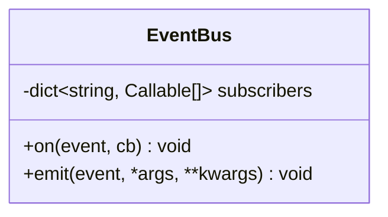

**图表来源** 
- [src/microagent/core/event.py:16-37](file://src/microagent/core/event.py#L16-L37)

**章节来源**
- [src/microagent/core/event.py:1-37](file://src/microagent/core/event.py#L1-L37)

### 存储抽象（Store 协议）与实现
- Store 协议：定义 append/load_history/checkpoint/list_sessions/session_summaries 接口，解耦具体存储实现。
- SQLiteStore：WAL 模式持久化，JSON 序列化 Message，支持高效摘要查询。
- InMemoryStore：内存实现，便于单元测试，保持与 SQLiteStore 一致的最近性排序。

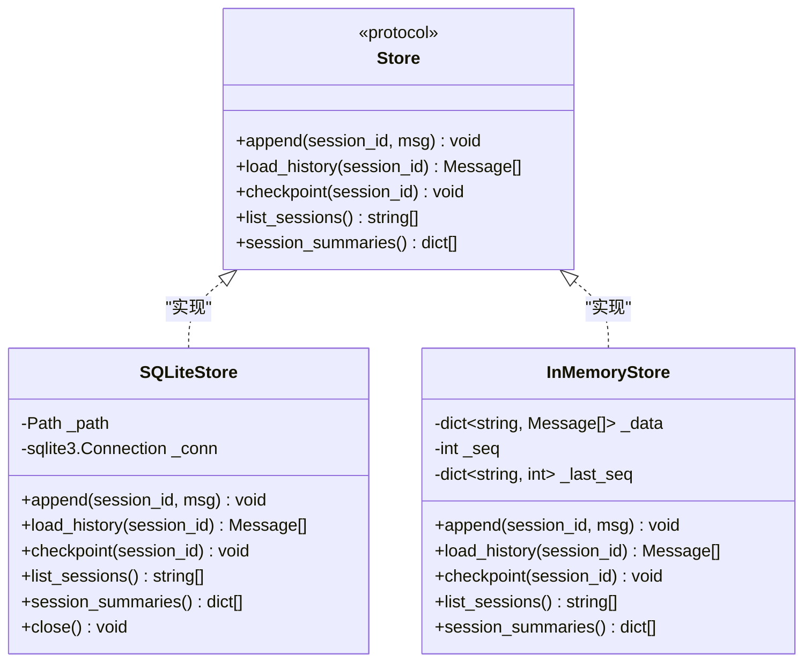

**图表来源** 
- [src/microagent/core/store.py:28-37](file://src/microagent/core/store.py#L28-L37)
- [src/microagent/core/store.py:95-182](file://src/microagent/core/store.py#L95-L182)
- [src/microagent/core/store.py:189-226](file://src/microagent/core/store.py#L189-L226)

**章节来源**
- [src/microagent/core/store.py:1-226](file://src/microagent/core/store.py#L1-L226)

### 会话运行器（SessionRunner）——对话循环与工具执行
- 职责：驱动 LLM 流式响应，收集文本与工具调用；执行工具（支持流式进度）；追加消息至 Store；消费预算；在轮次结束时发出事件。
- 关键流程：
  - 预算消耗与压缩阈值判断
  - 技能匹配与上下文注入
  - LLM 流式事件处理（TextDelta/ToolCallDelta/Usage/StreamDone）
  - 工具调用并发执行与进度事件收集
  - 轮次结束事件（TurnComplete/TurnFailed）

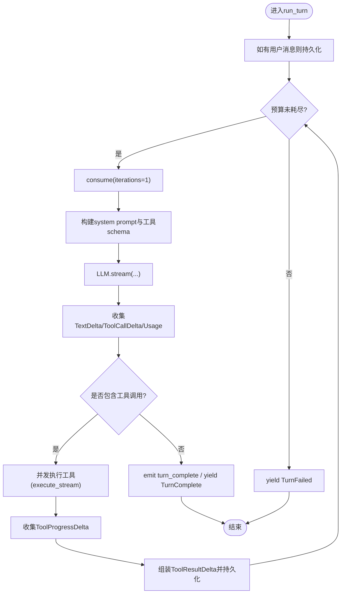

**图表来源** 
- [src/microagent/session/runner.py:118-284](file://src/microagent/session/runner.py#L118-L284)

**章节来源**
- [src/microagent/session/runner.py:1-341](file://src/microagent/session/runner.py#L1-L341)

### Agent 与配置（统一入口）
- Agent：从 Config 装配 LLM、工具集、预算、会话运行器等；提供 run/arun/close 接口；可选 CronScheduler。
- Config：多源配置解析（CLI > 环境变量 > 配置文件 > 默认值），封装 LLMConfig 与系统提示词、技能路径等。

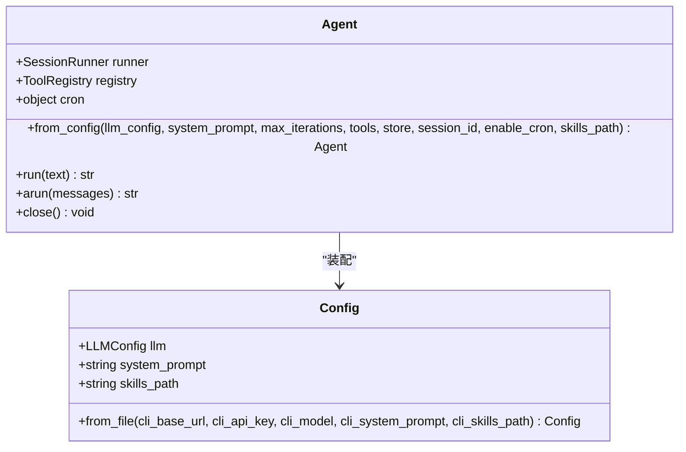

**图表来源** 
- [src/microagent/agent.py:24-77](file://src/microagent/agent.py#L24-L77)
- [src/microagent/config.py:20-71](file://src/microagent/config.py#L20-L71)

**章节来源**
- [src/microagent/agent.py:1-113](file://src/microagent/agent.py#L1-L113)
- [src/microagent/config.py:1-101](file://src/microagent/config.py#L1-L101)

## 依赖关系分析
- SessionRunner 依赖 LLMClient、ToolRegistry、Budget、Store、EventBus、Hook/ContextSource/Memory 等扩展点。
- ToolRegistry 依赖 Tool 协议与 @tool 装饰器的模块级注册表。
- PermissionEngine 与 Rule/Decision 独立于工具执行，可在 Hook 层集成。
- Store 协议解耦持久化实现，SQLiteStore/InMemoryStore 可互换。
- Budget 树形结构通过 parent 引用与共享 cancel_event 实现跨层级资源管控。

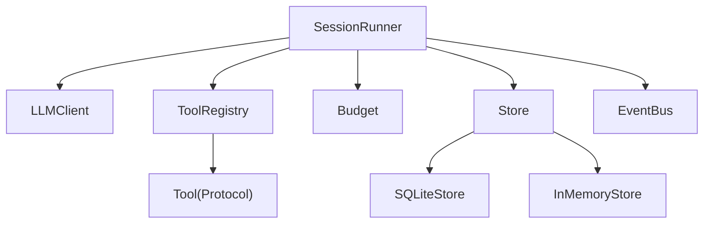

**图表来源** 
- [src/microagent/session/runner.py:40-76](file://src/microagent/session/runner.py#L40-L76)
- [src/microagent/core/tool.py:221-280](file://src/microagent/core/tool.py#L221-L280)
- [src/microagent/core/store.py:28-37](file://src/microagent/core/store.py#L28-L37)

**章节来源**
- [src/microagent/session/runner.py:1-341](file://src/microagent/session/runner.py#L1-L341)
- [src/microagent/core/tool.py:1-309](file://src/microagent/core/tool.py#L1-L309)
- [src/microagent/core/store.py:1-226](file://src/microagent/core/store.py#L1-L226)

## 性能考量
- 流式处理：LLM 与工具均支持流式事件，降低首字节延迟，提升用户体验。
- 并发执行：工具调用通过任务组并发执行，提高吞吐。
- 压缩策略：当消息长度超过阈值时进行对话压缩，避免上下文溢出。
- 存储优化：SQLite WAL 模式与索引优化读取；session_summaries 单查询聚合减少 I/O。
- 预算控制：及时消费与短路，防止无限迭代与资源浪费。

[本节为通用指导，不直接分析具体文件]

## 故障排查指南
- 预算耗尽：出现 BudgetExceeded 异常，检查 max_iterations/max_tokens/max_cost_usd 设置与工具调用开销。
- 工具执行失败：ToolResult.error 或异常捕获，查看工具实现与参数校验。
- 权限拒绝：PermissionEngine 默认 DENY，确认 Rule 配置与参数约束。
- 存储问题：SQLite WAL 模式与事务一致性，确保 checkpoint 与关闭连接。
- 事件丢失：EventBus 异常被吞，检查回调实现与异步处理。

**章节来源**
- [src/microagent/session/budget.py:167-169](file://src/microagent/session/budget.py#L167-L169)
- [src/microagent/core/tool.py:256-280](file://src/microagent/core/tool.py#L256-L280)
- [src/microagent/core/permission.py:71-103](file://src/microagent/core/permission.py#L71-L103)
- [src/microagent/core/store.py:122-140](file://src/microagent/core/store.py#L122-L140)
- [src/microagent/core/event.py:26-37](file://src/microagent/core/event.py#L26-L37)

## 结论
MicroAgent 以清晰的协议与模块化设计，实现了可扩展的 Agent 框架。通过统一的 Message/ToolCall/ToolResult 数据模型、灵活的权限与预算控制、流式事件与持久化抽象，开发者可以快速构建具备工具调用能力的智能体。建议在实际项目中结合 Hook/ContextSource/Memory 等扩展点，定制业务逻辑与上下文增强。

[本节为总结，不直接分析具体文件]

## 附录
- 典型用法参考：
  - 构造 Agent：参见 [src/microagent/agent.py:31-77](file://src/microagent/agent.py#L31-L77)
  - 定义工具：参见 [src/microagent/core/tool.py:177-213](file://src/microagent/core/tool.py#L177-L213)
  - 权限规则：参见 [src/microagent/core/permission.py:189-213](file://src/microagent/core/permission.py#L189-L213)
  - 事件监听：参见 [src/microagent/core/event.py:22-37](file://src/microagent/core/event.py#L22-L37)
  - 存储实现：参见 [src/microagent/core/store.py:95-182](file://src/microagent/core/store.py#L95-L182)

[本节为附录，不直接分析具体文件]