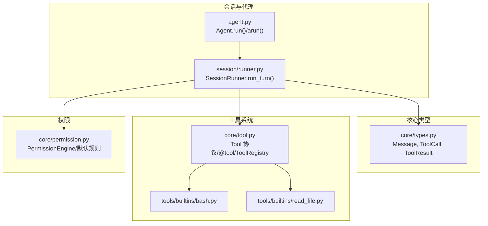
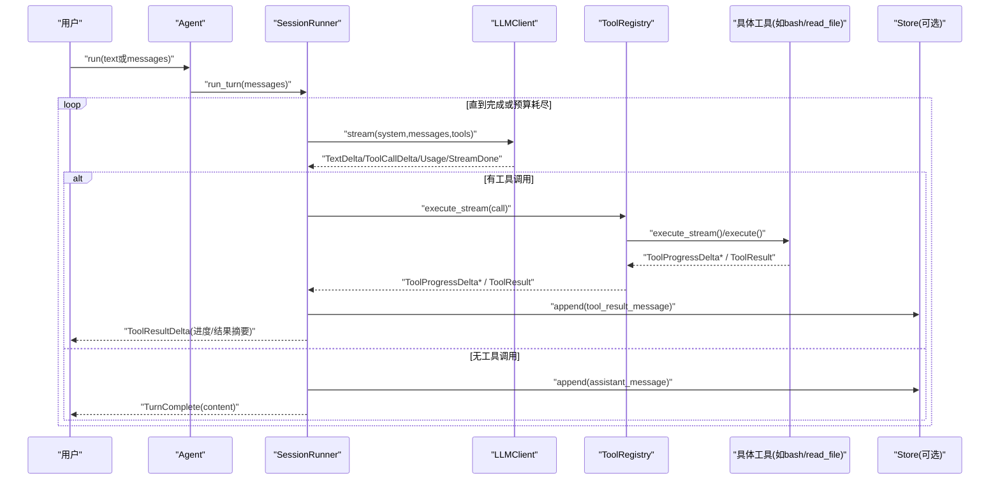
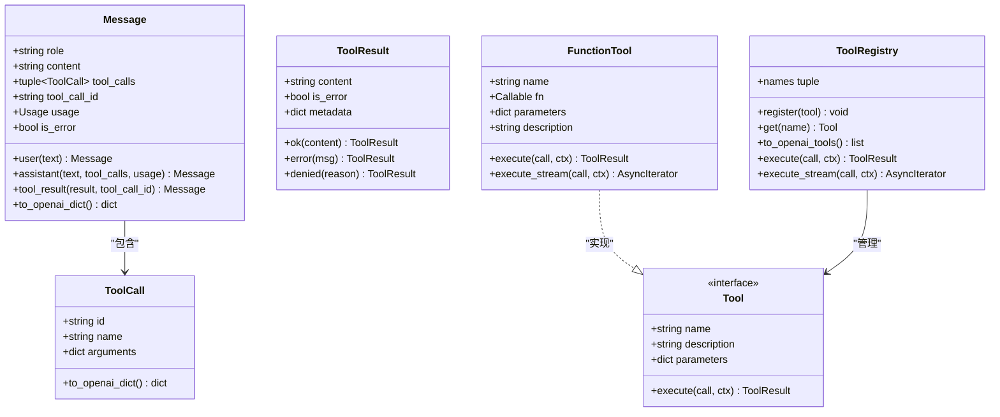
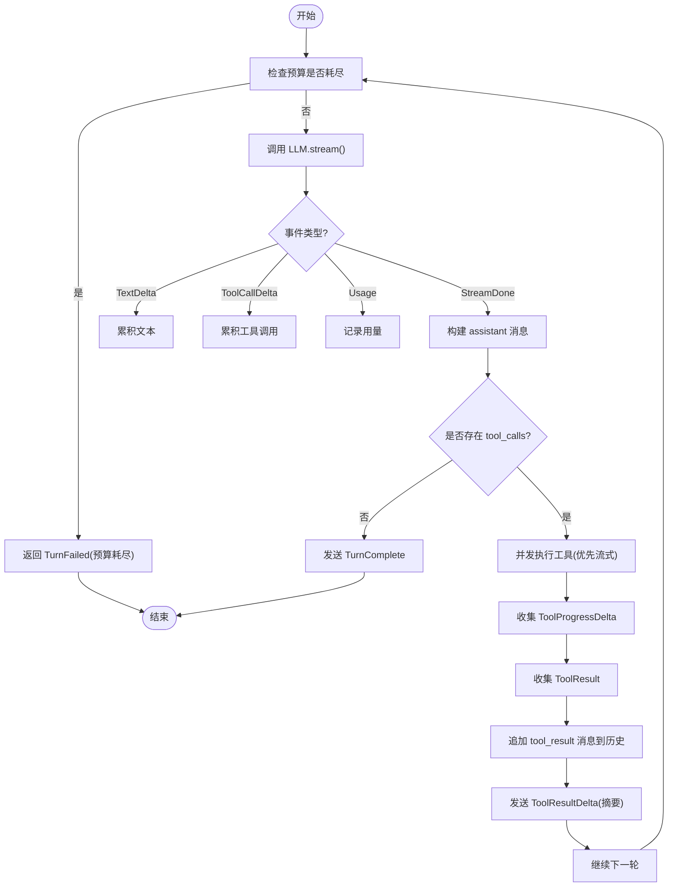
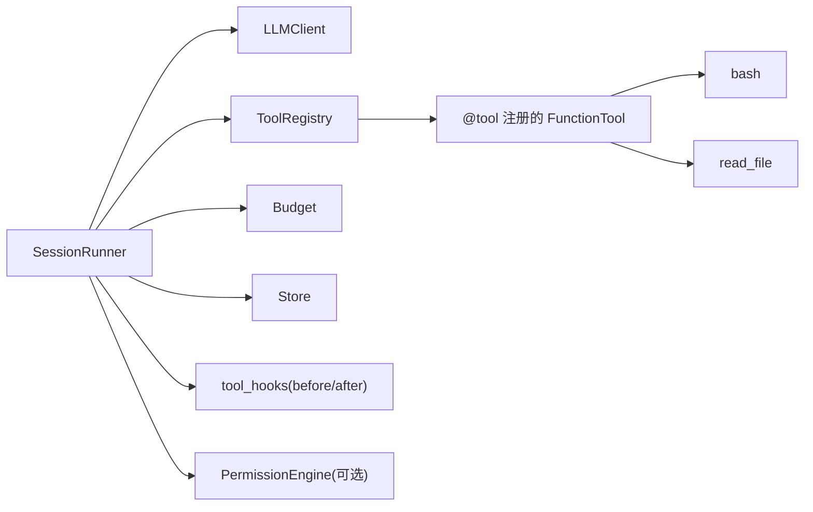
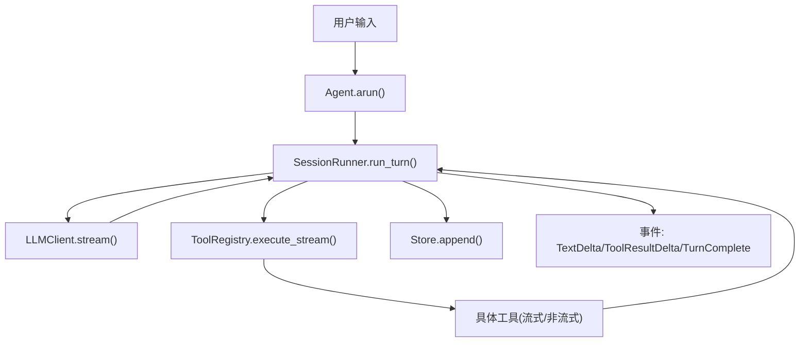

# 消息和工具调用

<cite>
**本文引用的文件**   
- [src/microagent/core/types.py](file://src/microagent/core/types.py)
- [src/microagent/core/tool.py](file://src/microagent/core/tool.py)
- [src/microagent/session/runner.py](file://src/microagent/session/runner.py)
- [src/microagent/agent.py](file://src/microagent/agent.py)
- [src/microagent/core/permission.py](file://src/microagent/core/permission.py)
- [src/microagent/tools/builtins/bash.py](file://src/microagent/tools/builtins/bash.py)
- [src/microagent/tools/builtins/read_file.py](file://src/microagent/tools/builtins/read_file.py)
- [tests/unit/test_types.py](file://tests/unit/test_types.py)
- [tests/unit/test_tool.py](file://tests/unit/test_tool.py)
</cite>

## 目录
1. [简介](#简介)
2. [项目结构](#项目结构)
3. [核心组件](#核心组件)
4. [架构总览](#架构总览)
5. [详细组件分析](#详细组件分析)
6. [依赖关系分析](#依赖关系分析)
7. [性能考量](#性能考量)
8. [故障排查指南](#故障排查指南)
9. [结论](#结论)
10. [附录：示例与最佳实践](#附录示例与最佳实践)

## 简介
本文件围绕 MicroAgent 的消息系统与工具调用机制进行系统化说明，重点包括：
- Message 数据结构的三种角色（user/assistant/tool）及其用途；tool_calls 与 tool_call_id 的作用与约束。
- ToolCall 与 ToolResult 的数据模型设计，参数传递、结果处理与错误处理机制。
- 工具调用的完整生命周期：LLM 生成工具调用请求 → 权限检查 → 工具执行（支持流式）→ 结果返回与消息追加。
- 通过代码级示例路径展示如何构建不同类型消息和处理工具调用结果。
- 使用流程图与序列图解释消息在各组件间的流转过程。

## 项目结构
MicroAgent 将“消息类型”“工具协议与注册”“会话运行器”“代理门面”等职责清晰分层：
- core/types.py：定义 Message、ToolCall、ToolResult 及事件类型。
- core/tool.py：定义 Tool 协议、FunctionTool、@tool 装饰器、Schema 推断与 ToolRegistry。
- session/runner.py：会话运行器，驱动 LLM 流式响应、工具调用执行、结果回写与预算控制。
- agent.py：对外门面，组装组件并提供 run/arun 接口。
- core/permission.py：基于规则的权限引擎（默认规则集）。
- tools/builtins/*：内置工具实现（如 bash、read_file 等），统一以 @tool 装饰器注册。

图表来源 
- [src/microagent/core/types.py:1-189](file://src/microagent/core/types.py#L1-L189)
- [src/microagent/core/tool.py:1-309](file://src/microagent/core/tool.py#L1-L309)
- [src/microagent/session/runner.py:1-341](file://src/microagent/session/runner.py#L1-L341)
- [src/microagent/agent.py:1-113](file://src/microagent/agent.py#L1-L113)
- [src/microagent/core/permission.py:1-213](file://src/microagent/core/permission.py#L1-L213)
- [src/microagent/tools/builtins/bash.py:1-58](file://src/microagent/tools/builtins/bash.py#L1-L58)
- [src/microagent/tools/builtins/read_file.py:1-55](file://src/microagent/tools/builtins/read_file.py#L1-L55)

章节来源
- [src/microagent/core/types.py:1-189](file://src/microagent/core/types.py#L1-L189)
- [src/microagent/core/tool.py:1-309](file://src/microagent/core/tool.py#L1-L309)
- [src/microagent/session/runner.py:1-341](file://src/microagent/session/runner.py#L1-L341)
- [src/microagent/agent.py:1-113](file://src/microagent/agent.py#L1-L113)
- [src/microagent/core/permission.py:1-213](file://src/microagent/core/permission.py#L1-L213)

## 核心组件
- Message：统一消息载体，包含 role、content、tool_calls、tool_call_id、usage、is_error。提供 user/assistant/tool_result 工厂方法与 to_openai_dict 转换。
- ToolCall：LLM 生成的工具调用请求，包含 id、name、arguments。
- ToolResult：工具执行结果，包含 content、is_error、metadata，以及 ok/error/denied 便捷构造。
- ToolRegistry：工具注册表，支持按名称查找、导出 OpenAI tools 列表、同步/流式执行。
- SessionRunner：会话循环，负责 LLM 流式读取、工具调用并发执行、结果回写、预算与压缩、事件派发。
- Agent：对外门面，封装配置与组件，暴露 run/arun。

章节来源
- [src/microagent/core/types.py:17-116](file://src/microagent/core/types.py#L17-L116)
- [src/microagent/core/tool.py:40-118](file://src/microagent/core/tool.py#L40-L118)
- [src/microagent/core/tool.py:221-280](file://src/microagent/core/tool.py#L221-L280)
- [src/microagent/session/runner.py:40-117](file://src/microagent/session/runner.py#L40-L117)
- [src/microagent/agent.py:24-113](file://src/microagent/agent.py#L24-L113)

## 架构总览
下图展示了从用户输入到最终文本回复的端到端流程，包括 LLM 流式输出、工具调用、权限检查、工具执行与结果回写。

图表来源 
- [src/microagent/agent.py:79-113](file://src/microagent/agent.py#L79-L113)
- [src/microagent/session/runner.py:118-284](file://src/microagent/session/runner.py#L118-L284)
- [src/microagent/core/tool.py:256-280](file://src/microagent/core/tool.py#L256-L280)

## 详细组件分析

### Message 数据模型与角色
- role=user：用户输入消息，仅含 content。
- role=assistant：助手回复，可包含 text 与 tool_calls（多个）。
- role=tool：工具结果消息，必须携带 tool_call_id 以关联原始工具调用。
- usage：记录 token 用量与成本，便于预算控制。
- is_error：标记是否为错误消息（常用于 tool 结果）。

关键方法：
- Message.user(text)：构建用户消息。
- Message.assistant(text, tool_calls, usage)：构建助手消息。
- Message.tool_result(result, tool_call_id)：构建工具结果消息。
- to_openai_dict()：转换为 OpenAI SDK 期望格式。

章节来源
- [src/microagent/core/types.py:27-69](file://src/microagent/core/types.py#L27-L69)
- [tests/unit/test_types.py:13-54](file://tests/unit/test_types.py#L13-L54)

### ToolCall 与 ToolResult 数据模型
- ToolCall：id、name、arguments（字典）。to_openai_dict() 将 arguments 序列化为 JSON 字符串。
- ToolResult：content、is_error、metadata。提供 ok/error/denied 快捷构造。denied 用于权限拒绝场景，并附带 metadata={"denied": True}。

章节来源
- [src/microagent/core/types.py:76-116](file://src/microagent/core/types.py#L76-L116)
- [tests/unit/test_types.py:56-82](file://tests/unit/test_types.py#L56-L82)

### 工具协议与注册（@tool、FunctionTool、ToolRegistry）
- Tool 协议：要求 name、description、parameters（OpenAI function schema）、execute(call, ctx)。
- FunctionTool：包装异步函数为 Tool，自动检测 AsyncIterator[str] 以实现流式进度。
- @tool(name, description)：装饰器，基于函数签名与 Annotated/Field 推断 OpenAI 兼容的 JSON Schema，并注册到模块级 _registry。
- ToolRegistry：维护工具集合，支持 to_openai_tools() 导出、execute/execute_stream 执行。

章节来源
- [src/microagent/core/tool.py:40-118](file://src/microagent/core/tool.py#L40-L118)
- [src/microagent/core/tool.py:125-214](file://src/microagent/core/tool.py#L125-L214)
- [src/microagent/core/tool.py:221-280](file://src/microagent/core/tool.py#L221-L280)
- [tests/unit/test_tool.py:11-97](file://tests/unit/test_tool.py#L11-L97)

### 会话运行器（SessionRunner）与工具调用生命周期
- run_turn(messages)：主循环，依次执行：
  - 预算消耗与压缩（当消息过多时）。
  - 注入系统提示与技能上下文。
  - 调用 LLM.stream() 获取 TextDelta/ToolCallDelta/Usage/StreamDone。
  - 若存在 tool_calls：并发执行工具（优先 execute_stream，否则 execute），收集 ToolProgressDelta 与 ToolResult。
  - 将 assistant 与 tool_result 消息写入 store，并产出 TurnComplete/TurnFailed。
- _run_tool_calls(calls)：并发执行工具调用，支持 before/after 钩子（可用于权限检查与审计）。

章节来源
- [src/microagent/session/runner.py:118-284](file://src/microagent/session/runner.py#L118-L284)
- [src/microagent/session/runner.py:285-341](file://src/microagent/session/runner.py#L285-L341)

### 权限引擎（PermissionEngine）与默认规则
- 基于 Rule 列表匹配（fnmatch on tool_name + arguments_constraint），决策 ALLOW/DENY/ASK。
- ASK 模式通过 ask_callback 交互确认。
- DEFAULT_RULES：对多数内置工具默认允许。
- ScriptRule：外部脚本决策（超时/异常则 DENY）。

注意：当前 SessionRunner 的工具执行路径未直接集成 PermissionEngine.evaluate，但可通过 tool_hooks.before 实现拦截与拒绝（返回 ToolResult.denied）。

章节来源
- [src/microagent/core/permission.py:71-116](file://src/microagent/core/permission.py#L71-L116)
- [src/microagent/core/permission.py:189-213](file://src/microagent/core/permission.py#L189-L213)
- [src/microagent/session/runner.py:304-310](file://src/microagent/session/runner.py#L304-L310)

### 内置工具示例（bash、read_file）
- bash：执行 shell 命令，支持超时与输出截断，错误码非零返回 ToolResult.error。
- read_file：读取文本文件，二进制检测、行号格式化、截断提示。

章节来源
- [src/microagent/tools/builtins/bash.py:14-58](file://src/microagent/tools/builtins/bash.py#L14-L58)
- [src/microagent/tools/builtins/read_file.py:14-55](file://src/microagent/tools/builtins/read_file.py#L14-L55)

### 类关系图（代码级）

图表来源 
- [src/microagent/core/types.py:27-116](file://src/microagent/core/types.py#L27-L116)
- [src/microagent/core/tool.py:40-118](file://src/microagent/core/tool.py#L40-L118)
- [src/microagent/core/tool.py:221-280](file://src/microagent/core/tool.py#L221-L280)

### 工具调用执行流程图（算法视角）

图表来源 
- [src/microagent/session/runner.py:118-284](file://src/microagent/session/runner.py#L118-L284)
- [src/microagent/session/runner.py:285-341](file://src/microagent/session/runner.py#L285-L341)

## 依赖关系分析
- SessionRunner 依赖 LLMClient、ToolRegistry、Budget、Store、EventBus、MemoryExtractor、SkillLoader 等。
- ToolRegistry 依赖 @tool 装饰器注册的 FunctionTool 实例。
- 内置工具通过 @tool 装饰器在模块导入时自动注册，形成松耦合扩展点。
- 权限引擎独立于执行路径，可通过 tool_hooks 接入。

图表来源 
- [src/microagent/session/runner.py:40-117](file://src/microagent/session/runner.py#L40-L117)
- [src/microagent/core/tool.py:221-280](file://src/microagent/core/tool.py#L221-L280)
- [src/microagent/core/permission.py:71-116](file://src/microagent/core/permission.py#L71-L116)

章节来源
- [src/microagent/session/runner.py:40-117](file://src/microagent/session/runner.py#L40-L117)
- [src/microagent/core/tool.py:221-280](file://src/microagent/core/tool.py#L221-L280)
- [src/microagent/core/permission.py:71-116](file://src/microagent/core/permission.py#L71-L116)

## 性能考量
- 流式处理：LLM 流式输出与工具流式进度（AsyncIterator[str]）提升用户体验，避免长等待。
- 并发执行：_run_tool_calls 使用任务组并发执行多个工具调用，提高吞吐。
- 压缩策略：当消息超过阈值时触发对话压缩，降低上下文长度与成本。
- 预算控制：每次迭代与用量统计均受 Budget 限制，防止无限循环与超支。
- 资源清理：SessionRunner.close 释放浏览器页面、内存提取器等资源。

[本节为通用指导，不直接分析具体文件]

## 故障排查指南
- 未知工具：ToolRegistry.execute 返回 ToolResult.error("unknown tool: ...")。检查工具名是否正确注册。
- 权限拒绝：ToolResult.denied 会设置 is_error=True 且 metadata={"denied": True}。检查 tool_hooks.before 或 PermissionEngine 规则。
- 工具执行异常：捕获异常后返回 ToolResult.error(f"{call.name} failed: {e!r}")。查看工具实现中的异常处理。
- 预算耗尽：TurnFailed("budget exhausted: ...")。调整 max_iterations 或优化上下文长度。
- LLM 响应被截断：检测到 stop_reason="length" 时，持久化部分响应并失败。减少上下文或增加模型窗口。

章节来源
- [src/microagent/core/tool.py:256-261](file://src/microagent/core/tool.py#L256-L261)
- [src/microagent/session/runner.py:205-225](file://src/microagent/session/runner.py#L205-L225)
- [src/microagent/session/runner.py:283-284](file://src/microagent/session/runner.py#L283-L284)
- [src/microagent/session/runner.py:330-332](file://src/microagent/session/runner.py#L330-L332)

## 结论
MicroAgent 的消息与工具调用体系以强类型数据模型（Message/ToolCall/ToolResult）为核心，配合灵活的 Tool 协议与注册机制，实现了可扩展、可流式、可并发、可审计的工具执行框架。SessionRunner 作为中枢协调器，串联 LLM、工具、权限与存储，确保稳定高效的对话闭环。通过 tool_hooks 与 PermissionEngine，可在执行前后注入安全策略与业务逻辑。

[本节为总结性内容，不直接分析具体文件]

## 附录：示例与最佳实践

### 构建不同类型的消息
- 用户消息：使用 Message.user(text) 创建。
- 助手消息：使用 Message.assistant(text, tool_calls=(...), usage=...) 创建。
- 工具结果消息：使用 Message.tool_result(result, tool_call_id=tc.id) 创建，确保 tool_call_id 与原始调用一致。

章节来源
- [src/microagent/core/types.py:41-69](file://src/microagent/core/types.py#L41-L69)
- [tests/unit/test_types.py:13-54](file://tests/unit/test_types.py#L13-L54)

### 处理工具调用结果
- 成功：ToolResult.ok(content)
- 失败：ToolResult.error(message)
- 权限拒绝：ToolResult.denied(reason)，is_error=True 且 metadata={"denied": True}

章节来源
- [src/microagent/core/types.py:97-116](file://src/microagent/core/types.py#L97-L116)
- [tests/unit/test_types.py:56-71](file://tests/unit/test_types.py#L56-L71)

### 自定义工具与流式输出
- 使用 @tool(name, description) 装饰异步函数，利用 Annotated/Field 描述参数与约束。
- 若返回 AsyncIterator[str]，将自动产生 ToolProgressDelta 实时进度。
- 若返回普通值或 ToolResult，将被包装为 ToolResult.ok(...)。

章节来源
- [src/microagent/core/tool.py:177-214](file://src/microagent/core/tool.py#L177-L214)
- [src/microagent/core/tool.py:81-118](file://src/microagent/core/tool.py#L81-L118)

### 权限检查集成建议
- 通过 tool_hooks.before 在工具执行前进行校验，必要时返回 ToolResult.denied。
- 结合 PermissionEngine 的规则与 ASK 回调，实现交互式授权。

章节来源
- [src/microagent/session/runner.py:304-310](file://src/microagent/session/runner.py#L304-L310)
- [src/microagent/core/permission.py:71-116](file://src/microagent/core/permission.py#L71-L116)

### 消息流转图（组件间传递）

图表来源 
- [src/microagent/agent.py:92-113](file://src/microagent/agent.py#L92-L113)
- [src/microagent/session/runner.py:118-284](file://src/microagent/session/runner.py#L118-L284)
- [src/microagent/core/tool.py:256-280](file://src/microagent/core/tool.py#L256-L280)