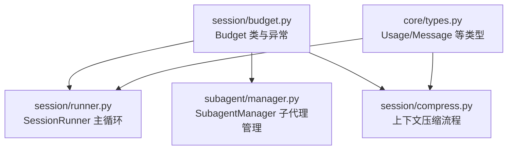
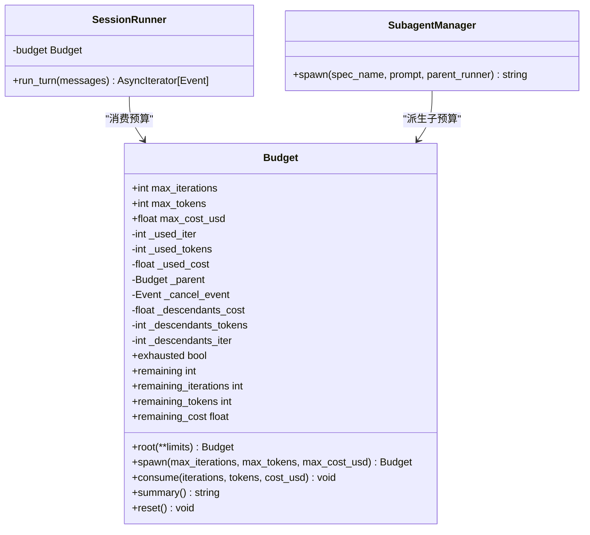
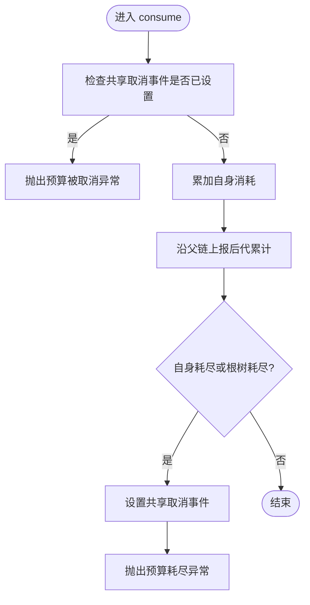
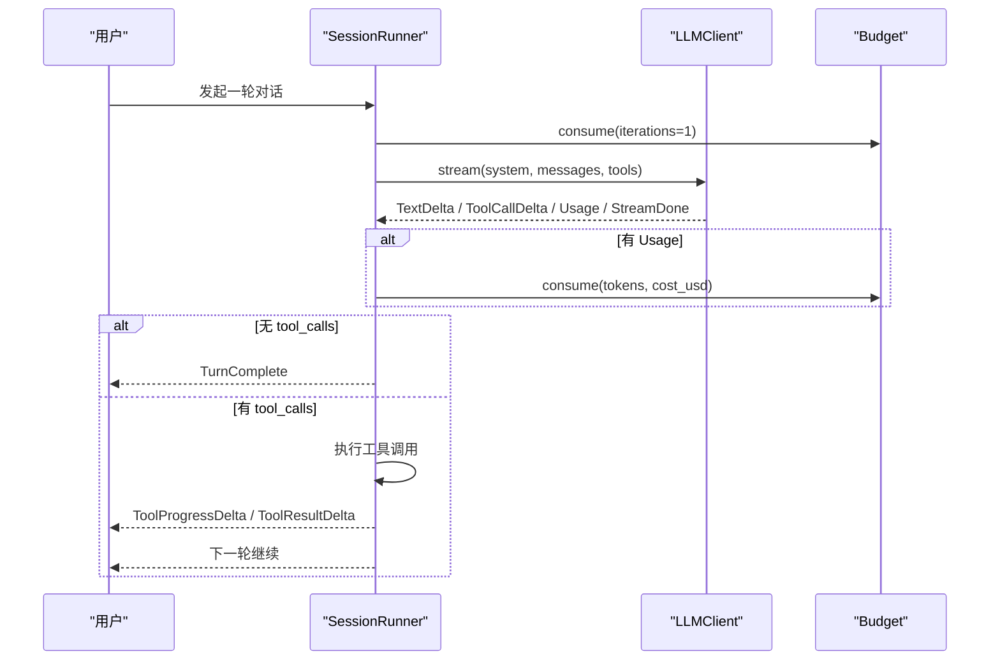
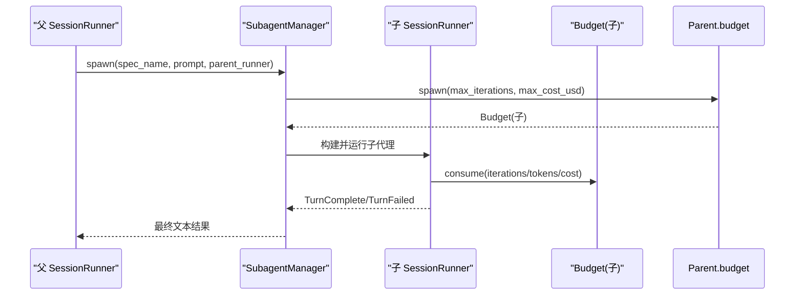
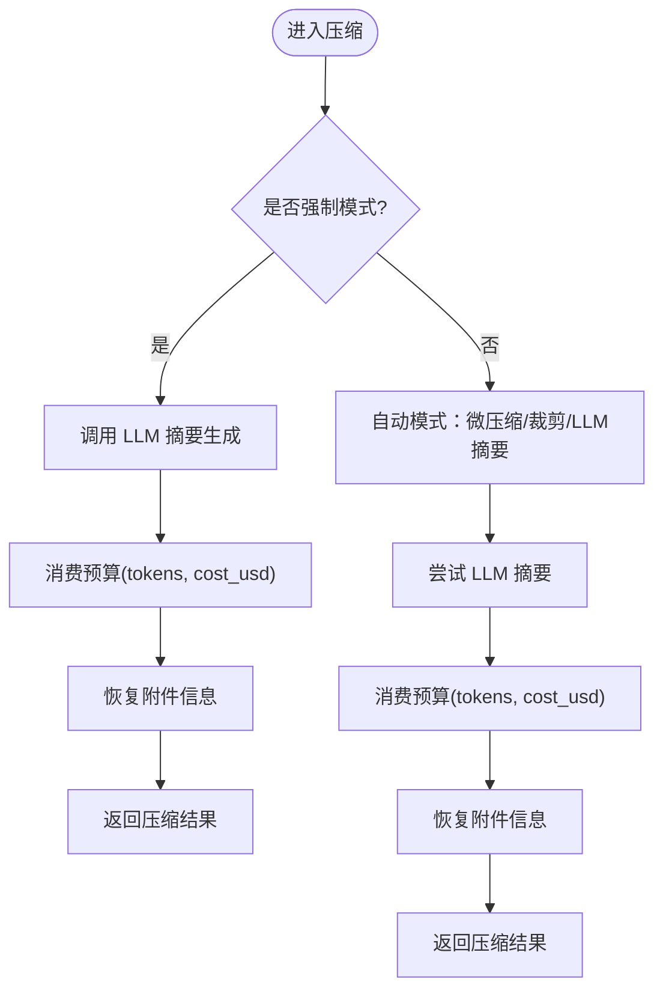
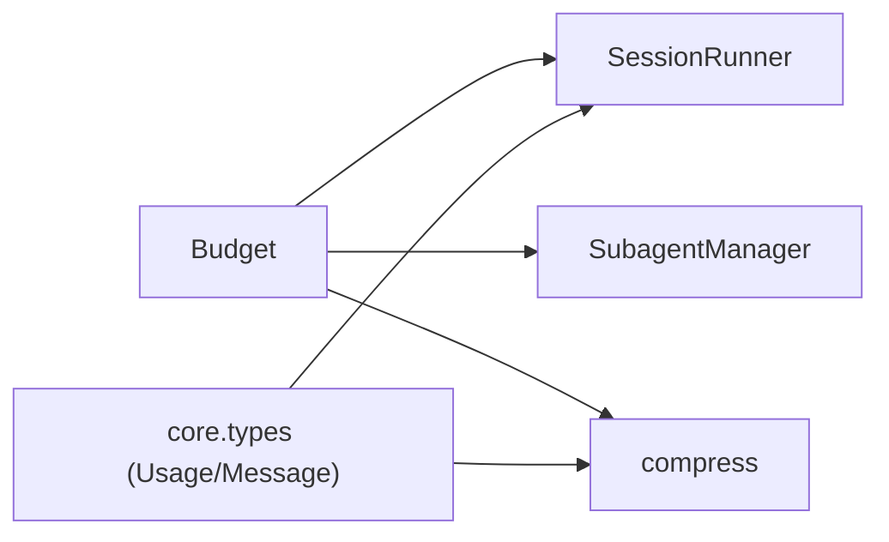

# 预算系统

<cite>
**本文引用的文件**
- [src/microagent/session/budget.py](file://src/microagent/session/budget.py)
- [src/microagent/session/runner.py](file://src/microagent/session/runner.py)
- [src/microagent/subagent/manager.py](file://src/microagent/subagent/manager.py)
- [src/microagent/core/types.py](file://src/microagent/core/types.py)
- [src/microagent/session/compress.py](file://src/microagent/session/compress.py)
- [tests/unit/test_budget.py](file://tests/unit/test_budget.py)
- [tests/unit/test_budget_tree.py](file://tests/unit/test_budget_tree.py)
</cite>

## 目录
1. [简介](#简介)
2. [项目结构](#项目结构)
3. [核心组件](#核心组件)
4. [架构总览](#架构总览)
5. [详细组件分析](#详细组件分析)
6. [依赖关系分析](#依赖关系分析)
7. [性能考量](#性能考量)
8. [故障排查指南](#故障排查指南)
9. [结论](#结论)
10. [附录：最佳实践与示例路径](#附录最佳实践与示例路径)

## 简介
本文件为 MicroAgent 的预算控制系统提供系统化文档，重点解释以下方面：
- 预算树形结构设计及父子关系的预算继承机制
- 预算跟踪的实现原理（token 使用统计、成本计算、预算限制检查）
- 预算在会话、子代理、工具调用之间的传播与聚合方式
- 如何设置预算限制、监控使用情况、处理预算超出的情况
- 预算树形结构与分配策略说明，帮助开发者理解资源管理的最佳实践

## 项目结构
预算系统主要位于 session 模块中，并与 runner、subagent、压缩流程等紧密集成。下图展示关键文件与职责：

图表来源
- [src/microagent/session/budget.py:1-169](file://src/microagent/session/budget.py#L1-L169)
- [src/microagent/session/runner.py:1-341](file://src/microagent/session/runner.py#L1-L341)
- [src/microagent/subagent/manager.py:1-160](file://src/microagent/subagent/manager.py#L1-L160)
- [src/microagent/session/compress.py:340-529](file://src/microagent/session/compress.py#L340-L529)
- [src/microagent/core/types.py:1-189](file://src/microagent/core/types.py#L1-L189)

章节来源
- [src/microagent/session/budget.py:1-169](file://src/microagent/session/budget.py#L1-L169)
- [src/microagent/session/runner.py:1-341](file://src/microagent/session/runner.py#L1-L341)
- [src/microagent/subagent/manager.py:1-160](file://src/microagent/subagent/manager.py#L1-L160)
- [src/microagent/session/compress.py:340-529](file://src/microagent/session/compress.py#L340-L529)
- [src/microagent/core/types.py:1-189](file://src/microagent/core/types.py#L1-L189)

## 核心组件
- Budget：树形预算对象，支持迭代次数、token 数、美元成本的限额；具备父子链、共享取消事件、后代累计统计能力。
- SessionRunner：会话主循环，按轮次消费预算，并在 LLM 响应与工具执行过程中累计 token 与成本。
- SubagentManager：子代理管理器，从父预算派生子预算，隔离工具集合并独立运行，最终将结果回传。
- compress：上下文压缩流程，在压缩阶段也通过预算进行 token 与成本消耗控制。
- core.types：定义 Usage、Message、ToolCall、ToolResult 等基础数据结构，贯穿预算统计与消息流转。

章节来源
- [src/microagent/session/budget.py:1-169](file://src/microagent/session/budget.py#L1-L169)
- [src/microagent/session/runner.py:1-341](file://src/microagent/session/runner.py#L1-L341)
- [src/microagent/subagent/manager.py:1-160](file://src/microagent/subagent/manager.py#L1-L160)
- [src/microagent/session/compress.py:340-529](file://src/microagent/session/compress.py#L340-L529)
- [src/microagent/core/types.py:1-189](file://src/microagent/core/types.py#L1-L189)

## 架构总览
预算系统以 Budget 为核心，形成“根预算—子预算”的树形结构。根预算持有共享取消事件，任何节点耗尽都会触发整棵树的取消信号，从而快速中断所有并发任务。

图表来源
- [src/microagent/session/budget.py:1-169](file://src/microagent/session/budget.py#L1-L169)
- [src/microagent/session/runner.py:1-341](file://src/microagent/session/runner.py#L1-L341)
- [src/microagent/subagent/manager.py:1-160](file://src/microagent/subagent/manager.py#L1-L160)

## 详细组件分析

### Budget 类与树形结构
- 设计要点
  - 三类限额：迭代次数、token 数、美元成本。
  - 自身消耗与后代累计分离：_used_* 记录自身，_descendants_* 记录子树累计。
  - 父子链：_parent 指向父节点，便于向上报告消耗。
  - 共享取消事件：根节点持有 anyio.Event，任一节点耗尽即 set，后续 consume 直接抛出异常并中断。
  - 默认派生策略：spawn 时未显式指定限额则取父剩余资源的三分之一作为默认上限。
- 关键方法
  - root：创建根预算并初始化共享取消事件。
  - spawn：派生子预算，继承父子关系与共享取消事件。
  - consume：累加自身消耗，上报祖先，检查是否达到自身或根树总限额，必要时触发取消并抛异常。
  - remaining_*：返回考虑后代后的剩余量。
  - summary/reset：用于调试与重置状态。

图表来源
- [src/microagent/session/budget.py:99-130](file://src/microagent/session/budget.py#L99-L130)

章节来源
- [src/microagent/session/budget.py:1-169](file://src/microagent/session/budget.py#L1-L169)
- [tests/unit/test_budget.py:1-91](file://tests/unit/test_budget.py#L1-L91)
- [tests/unit/test_budget_tree.py:1-63](file://tests/unit/test_budget_tree.py#L1-L63)

### SessionRunner 中的预算使用
- 每轮对话开始时消费一次迭代预算。
- LLM 流式响应结束后，根据 Usage 累计 token 与成本。
- 若响应被截断（长度限制），仍会消费用量并返回失败事件。
- 工具执行期间不直接消费预算，但压缩流程会在摘要生成时消费预算。

图表来源
- [src/microagent/session/runner.py:118-284](file://src/microagent/session/runner.py#L118-L284)
- [src/microagent/core/types.py:18-24](file://src/microagent/core/types.py#L18-L24)

章节来源
- [src/microagent/session/runner.py:1-341](file://src/microagent/session/runner.py#L1-L341)
- [src/microagent/core/types.py:1-189](file://src/microagent/core/types.py#L1-L189)

### SubagentManager 的子代理预算派生
- 子代理通过 Spec 配置限定工具集与预算上限。
- 从父 runner 的 budget.spawn 派生子预算，共享取消事件，实现跨层级统一控制。
- 子代理独立运行，仅返回最终文本结果，中间过程对父代理不可见（上下文防火墙）。

图表来源
- [src/microagent/subagent/manager.py:83-142](file://src/microagent/subagent/manager.py#L83-L142)
- [src/microagent/session/budget.py:42-69](file://src/microagent/session/budget.py#L42-L69)

章节来源
- [src/microagent/subagent/manager.py:1-160](file://src/microagent/subagent/manager.py#L1-L160)

### 压缩流程中的预算使用
- 压缩流程在 LLM 摘要生成阶段消费 token 与成本。
- 支持强制模式与自动模式（带熔断与冷却），在预算耗尽时直接上抛异常，由上层处理。

图表来源
- [src/microagent/session/compress.py:340-420](file://src/microagent/session/compress.py#L340-L420)

章节来源
- [src/microagent/session/compress.py:340-529](file://src/microagent/session/compress.py#L340-L529)

## 依赖关系分析
- Budget 依赖 anyio.Event 实现跨层级的取消信号。
- SessionRunner 依赖 Budget 与 core.types 的 Usage 进行统计。
- SubagentManager 依赖 SessionRunner 与 Budget 的 spawn 能力。
- compress 依赖 Budget 与 LLM 客户端进行摘要生成与预算消费。

图表来源
- [src/microagent/session/budget.py:1-169](file://src/microagent/session/budget.py#L1-L169)
- [src/microagent/session/runner.py:1-341](file://src/microagent/session/runner.py#L1-L341)
- [src/microagent/subagent/manager.py:1-160](file://src/microagent/subagent/manager.py#L1-L160)
- [src/microagent/session/compress.py:340-529](file://src/microagent/session/compress.py#L340-L529)
- [src/microagent/core/types.py:1-189](file://src/microagent/core/types.py#L1-L189)

章节来源
- [src/microagent/session/budget.py:1-169](file://src/microagent/session/budget.py#L1-L169)
- [src/microagent/session/runner.py:1-341](file://src/microagent/session/runner.py#L1-L341)
- [src/microagent/subagent/manager.py:1-160](file://src/microagent/subagent/manager.py#L1-L160)
- [src/microagent/session/compress.py:340-529](file://src/microagent/session/compress.py#L340-L529)
- [src/microagent/core/types.py:1-189](file://src/microagent/core/types.py#L1-L189)

## 性能考量
- 预算检查在每次迭代与 LLM 响应后执行，开销极低（常数级加法与比较）。
- 共享取消事件避免昂贵的逐层遍历取消，提升并发场景下的中断效率。
- 后代累计统计仅在祖先节点维护，减少重复计算。
- 压缩流程采用分层策略（微压缩、裁剪、LLM 摘要），在预算受限情况下优先低成本操作。

## 故障排查指南
- 常见异常
  - BudgetExceeded：预算耗尽或被取消时抛出。
- 定位步骤
  - 检查当前节点的 exhausted 与 remaining_* 属性。
  - 查看 summary 输出了解自身与后代累计。
  - 确认根节点的 _cancel_event 是否被设置（表示整棵树已被取消）。
- 典型场景
  - 子代理耗尽导致根取消：子代理 consume 超过其限额，触发根取消，父代理后续调用立即失败。
  - 根预算耗尽：根节点自身或子树累计超过限额，所有分支立即中断。
  - 压缩失败：压缩流程在预算耗尽时上抛异常，需在上层捕获并降级处理。

章节来源
- [src/microagent/session/budget.py:166-169](file://src/microagent/session/budget.py#L166-L169)
- [tests/unit/test_budget.py:1-91](file://tests/unit/test_budget.py#L1-L91)
- [tests/unit/test_budget_tree.py:1-63](file://tests/unit/test_budget_tree.py#L1-L63)
- [src/microagent/session/compress.py:340-420](file://src/microagent/session/compress.py#L340-L420)

## 结论
MicroAgent 的预算系统通过树形结构与共享取消事件，实现了跨会话、子代理与工具调用的统一资源管控。它以极低的开销完成严格的限额检查与快速中断，结合分层压缩策略，确保在高负载与长对话场景下稳定可控。开发者可通过合理设置根预算与子代理预算，配合监控与异常处理，达成高效的资源管理与用户体验平衡。

## 附录：最佳实践与示例路径
- 设置根预算
  - 使用 root 方法创建根预算，并传入 max_iterations、max_tokens、max_cost_usd。
  - 参考路径：[src/microagent/session/budget.py:37-41](file://src/microagent/session/budget.py#L37-L41)
- 派生子代理预算
  - 通过 spawn 派生子预算，可显式指定限额或采用默认三分之一策略。
  - 参考路径：[src/microagent/session/budget.py:42-69](file://src/microagent/session/budget.py#L42-L69)
- 会话主循环消费预算
  - 每轮开始消费一次迭代；LLM 响应后消费 token 与成本。
  - 参考路径：[src/microagent/session/runner.py:118-284](file://src/microagent/session/runner.py#L118-L284)
- 子代理预算隔离
  - 子代理使用独立的预算与工具集，结果仅返回最终文本。
  - 参考路径：[src/microagent/subagent/manager.py:83-142](file://src/microagent/subagent/manager.py#L83-L142)
- 压缩流程预算消费
  - 在 LLM 摘要生成阶段消费预算，支持强制与自动模式。
  - 参考路径：[src/microagent/session/compress.py:340-420](file://src/microagent/session/compress.py#L340-L420)
- 监控与诊断
  - 使用 summary 与 remaining_* 属性监控使用情况。
  - 参考路径：[src/microagent/session/budget.py:151-165](file://src/microagent/session/budget.py#L151-L165)
- 测试用例参考
  - 预算限制与树形行为验证。
  - 参考路径：[tests/unit/test_budget.py:1-91](file://tests/unit/test_budget.py#L1-L91), [tests/unit/test_budget_tree.py:1-63](file://tests/unit/test_budget_tree.py#L1-L63)