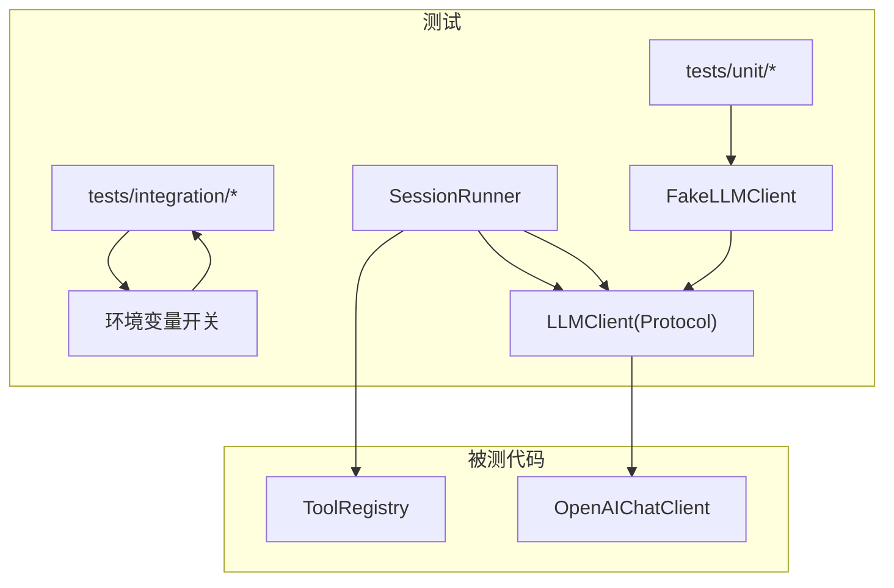
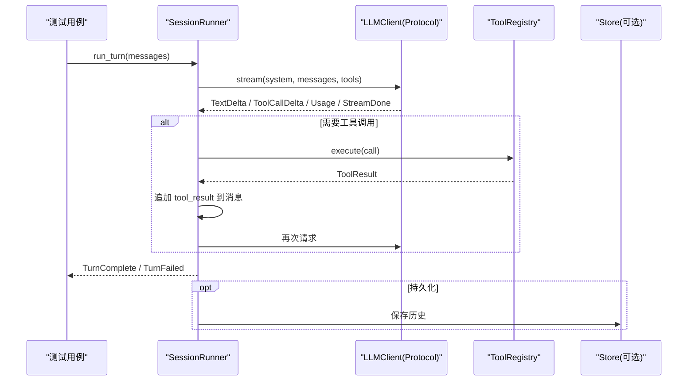
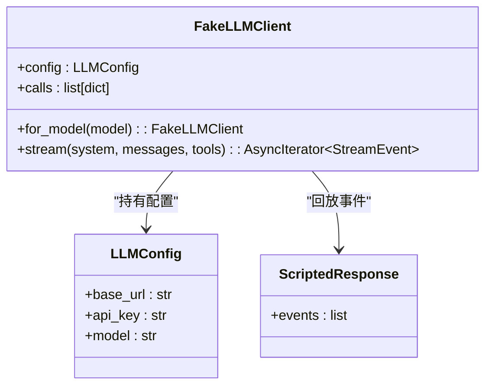
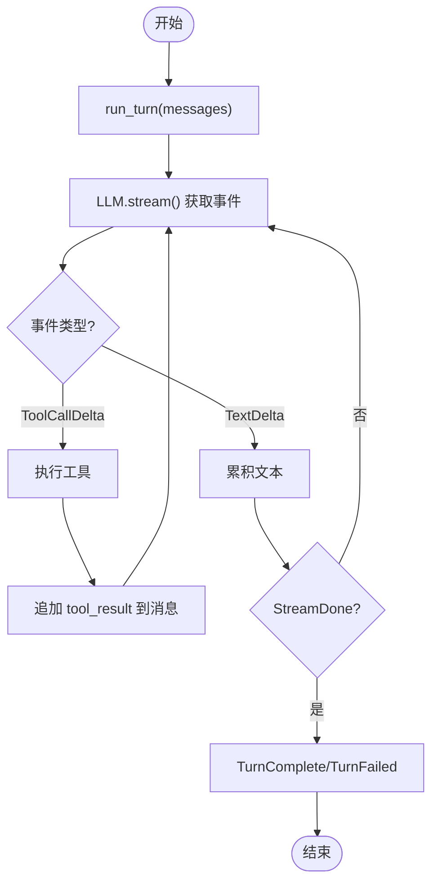
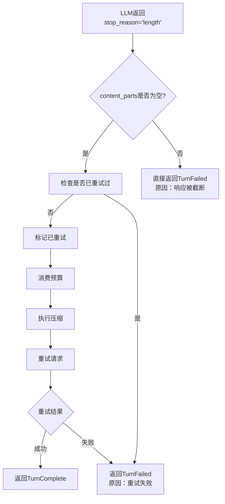
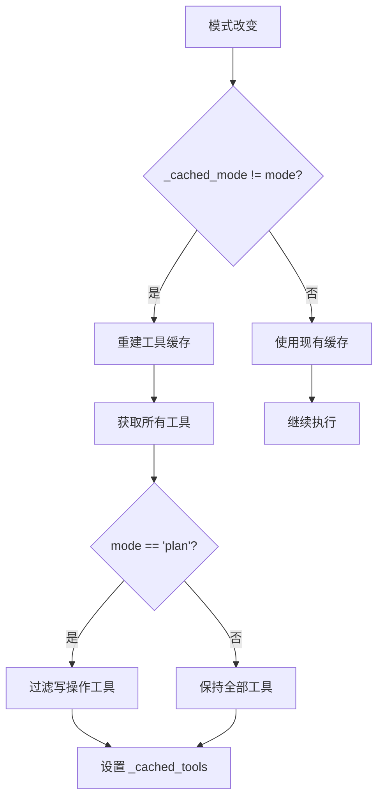
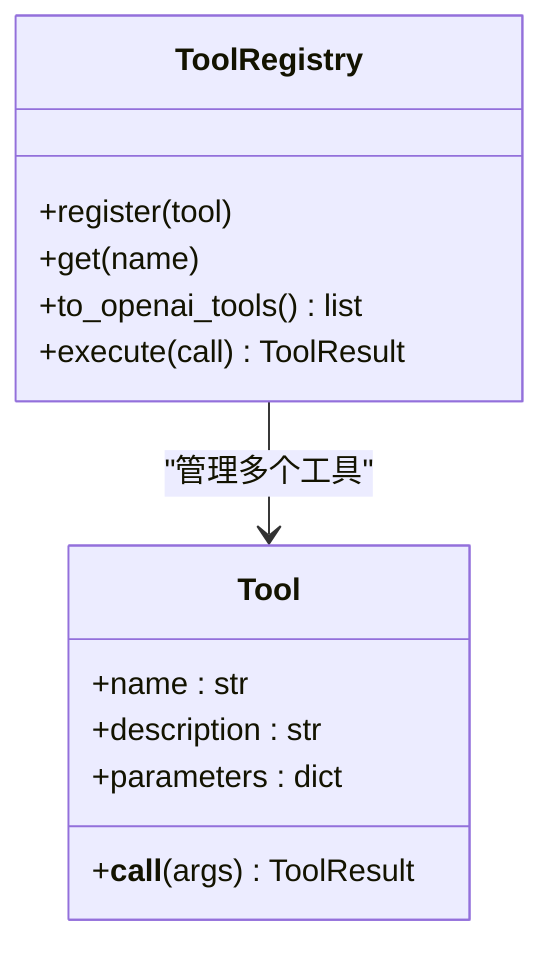
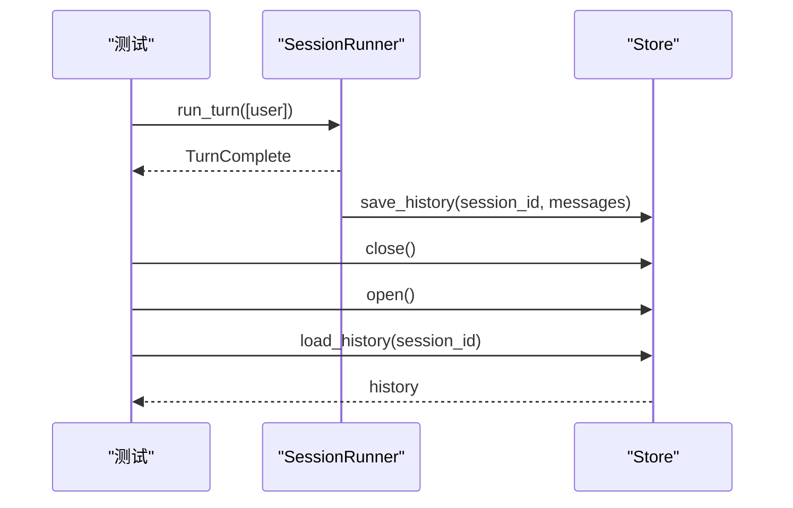
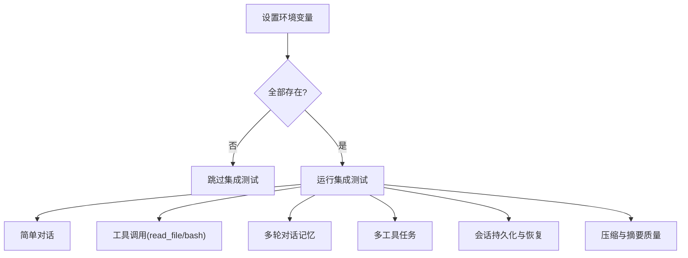
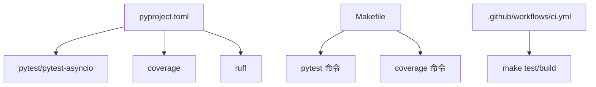

# 测试指南

<cite>
**本文引用的文件**   
- [tests/unit/fake_llm.py](file://tests/unit/fake_llm.py)
- [tests/integration/test_real_api.py](file://tests/integration/test_real_api.py)
- [tests/unit/test_overflow_recovery.py](file://tests/unit/test_overflow_recovery.py)
- [tests/unit/test_review_fixes.py](file://tests/unit/test_review_fixes.py)
- [pyproject.toml](file://pyproject.toml)
- [Makefile](file://Makefile)
- [.github/workflows/ci.yml](file://.github/workflows/ci.yml)
- [src/microagent/llm/client.py](file://src/microagent/llm/client.py)
- [src/microagent/session/runner.py](file://src/microagent/session/runner.py)
- [src/microagent/core/tool.py](file://src/microagent/core/tool.py)
- [src/microagent/core/permission.py](file://src/microagent/core/permission.py)
- [src/microagent/config.py](file://src/microagent/config.py)
- [src/microagent/surface/cli.py](file://src/microagent/surface/cli.py)
- [tests/unit/test_runner.py](file://tests/unit/test_runner.py)
- [tests/unit/test_builtins.py](file://tests/unit/test_builtins.py)
- [tests/unit/test_tool.py](file://tests/unit/test_tool.py)
- [tests/unit/test_session_persist.py](file://tests/unit/test_session_persist.py)
- [tests/unit/test_runner_errors.py](file://tests/unit/test_runner_errors.py)
</cite>

## 更新摘要
**变更内容**   
- 新增代码审查修复测试覆盖章节，详细说明工具缓存模式、溢出恢复、权限规则等关键功能的测试方法
- 更新会话运行器测试部分，包含工具缓存模式感知的详细分析
- 增强权限系统测试说明，涵盖ASK规则匹配和CLI命令注册验证
- 补充配置字段验证的最佳实践

## 目录
1. [简介](#简介)
2. [项目结构](#项目结构)
3. [核心组件](#核心组件)
4. [架构总览](#架构总览)
5. [详细组件分析](#详细组件分析)
6. [依赖关系分析](#依赖关系分析)
7. [性能考虑](#性能考虑)
8. [故障排查指南](#故障排查指南)
9. [结论](#结论)
10. [附录](#附录)

## 简介
本指南面向 MicroAgent 项目的测试实践，覆盖单元测试、集成测试与端到端测试的编写方法、配置与执行；讲解 FakeLLMClient 的使用、工具调用模拟、异步测试技巧；说明覆盖率收集与报告生成；提供测试数据准备与管理、持续集成自动化（GitHub Actions）以及调试方法与工具推荐。目标是帮助开发者快速建立稳定、可维护且高质量的测试体系。

## 项目结构
MicroAgent 的测试位于 tests 目录下，分为 unit 与 integration 两个层次：
- unit：纯单元测试，使用 FakeLLMClient 模拟 LLM 流式响应，验证会话运行器、预算控制、工具注册与执行、持久化等。
- integration：真实 API 集成测试，通过环境变量开关启用，覆盖简单对话、工具调用、多轮对话、会话持久化与压缩等。



图表来源
- [tests/unit/fake_llm.py:1-110](file://tests/unit/fake_llm.py#L1-L110)
- [tests/integration/test_real_api.py:1-220](file://tests/integration/test_real_api.py#L1-L220)
- [tests/unit/test_review_fixes.py:1-134](file://tests/unit/test_review_fixes.py#L1-L134)
- [src/microagent/llm/client.py:1-200](file://src/microagent/llm/client.py#L1-L200)

章节来源
- [pyproject.toml:62-68](file://pyproject.toml#L62-L68)
- [Makefile:11-19](file://Makefile#L11-19)

## 核心组件
- FakeLLMClient：实现 LLMClient 协议，按脚本顺序回放 StreamEvent 序列，支持文本与工具调用事件，记录调用上下文，便于断言。
- SessionRunner：会话运行器，驱动"消息→LLM→工具→结果"的循环，产出 TextDelta、ToolCallDelta、Usage、StreamDone 等事件，并处理预算与错误路径。
- ToolRegistry：工具注册与执行中心，支持 @tool 装饰器自动推断参数 Schema，统一执行与错误返回。
- PermissionEngine：权限引擎，基于规则的访问控制，支持 ALLOW/DENY/ASK 决策。
- LLMConfig/LLMClient/OpenAIChatClient：统一的 LLM 抽象与 OpenAI 兼容客户端，支持模型定价估算、上下文窗口查询、凭据池轮换等。

章节来源
- [tests/unit/fake_llm.py:1-110](file://tests/unit/fake_llm.py#L1-L110)
- [tests/unit/test_runner.py:1-149](file://tests/unit/test_runner.py#L1-L149)
- [tests/unit/test_tool.py:1-97](file://tests/unit/test_tool.py#L1-L97)
- [src/microagent/core/permission.py:1-235](file://src/microagent/core/permission.py#L1-L235)
- [src/microagent/llm/client.py:1-200](file://src/microagent/llm/client.py#L1-L200)

## 架构总览
下图展示了从测试到被测代码的关键交互：测试通过 FakeLLMClient 注入流式事件，SessionRunner 消费事件并驱动工具执行，最终产生 TurnComplete/TurnFailed 等结果。



图表来源
- [tests/unit/test_runner.py:61-149](file://tests/unit/test_runner.py#L61-L149)
- [tests/unit/fake_llm.py:22-74](file://tests/unit/fake_llm.py#L22-L74)
- [src/microagent/llm/client.py:141-156](file://src/microagent/llm/client.py#L141-L156)

## 详细组件分析

### 单元测试：FakeLLMClient 与流式事件回放
- 构造 ScriptedResponse：text_response 用于纯文本回复；tool_response 用于工具调用请求；multi_turn 组合多轮对话。
- FakeLLMClient.stream 会按顺序回放事件，并在无响应时返回空 Usage 与 StreamDone。
- 可通过 for_model(model) 切换模型配置，便于不同模型的边界场景。



图表来源
- [tests/unit/fake_llm.py:15-74](file://tests/unit/fake_llm.py#L15-L74)
- [src/microagent/llm/client.py:93-118](file://src/microagent/llm/client.py#L93-L118)

章节来源
- [tests/unit/fake_llm.py:1-110](file://tests/unit/fake_llm.py#L1-L110)

### 单元测试：会话运行器与预算控制
- 基本文本响应：验证流式 TextDelta 拼接与 TurnComplete 内容。
- 工具调用链路：LLM 先返回 ToolCallDelta，Runner 执行工具后追加 tool_result，再请求 LLM 得到最终文本。
- 预算耗尽：当迭代次数或 token/成本超限时，抛出 BudgetExceeded，Runner 返回 TurnFailed。



图表来源
- [tests/unit/test_runner.py:61-149](file://tests/unit/test_runner.py#L61-L149)
- [tests/unit/test_runner_errors.py:11-92](file://tests/unit/test_runner_errors.py#L11-L92)

章节来源
- [tests/unit/test_runner.py:1-149](file://tests/unit/test_runner.py#L1-L149)
- [tests/unit/test_runner_errors.py:1-92](file://tests/unit/test_runner_errors.py#L1-L92)

### 溢出恢复功能测试覆盖
**新增** 溢出恢复功能是 MicroAgent 的核心容错机制，当 LLM 返回 stop_reason="length" 且没有内容被流式传输时，系统会自动进行上下文压缩并重试。

#### 溢出恢复的核心逻辑
- **触发条件**：stop_reason="length" 且 content_parts 为空（无内容被流式传输）
- **恢复策略**：强制压缩上下文 → 重新请求 LLM → 最多重试一次
- **失败处理**：如果重试仍然溢出或已有内容被传输，则返回 TurnFailed

#### 测试场景覆盖



图表来源
- [src/microagent/session/runner.py:209-268](file://src/microagent/session/runner.py#L209-L268)

#### 关键测试用例

**1. 成功恢复场景**
```python
async def test_overflow_no_content_triggers_compact_retry(self):
    """stop_reason='length' with no streamed content → compact + retry."""
    # 第一次响应：溢出但无内容
    overflow_resp = ScriptedResponse(
        events=[
            Usage(input_tokens=100, output_tokens=0),
            StreamDone(stop_reason="length"),
        ]
    )
    # 第二次响应（压缩后）：成功
    success_resp = text_response("recovered after compaction")
    
    llm = FakeLLMClient([overflow_resp, success_resp])
    runner = SessionRunner(llm=llm, registry=ToolRegistry([]), 
                         budget=Budget(max_iterations=10), compression_threshold=100)
    messages = [Message.user("hello")]
    events = []
    async for event in runner.run_turn(messages):
        events.append(event)
    
    # 应该成功恢复
    completes = [e for e in events if isinstance(e, TurnComplete)]
    assert len(completes) >= 1
    assert "recovered" in completes[0].content
```

**2. 有内容时的失败场景**
```python
async def test_overflow_with_content_does_not_retry(self):
    """stop_reason='length' but content was already streamed → fail."""
    overflow_resp = ScriptedResponse(
        events=[
            TextDelta(text="partial response"),  # 已有内容
            Usage(input_tokens=100, output_tokens=5),
            StreamDone(stop_reason="length"),
        ]
    )
    llm = FakeLLMClient([overflow_resp])
    runner = SessionRunner(llm=llm, registry=ToolRegistry([]), 
                         budget=Budget(max_iterations=10), compression_threshold=100)
    messages = [Message.user("hello")]
    events = []
    async for event in runner.run_turn(messages):
        events.append(event)
    
    # 应该失败，不重试（内容已流式传输给用户）
    fails = [e for e in events if isinstance(e, TurnFailed)]
    assert len(fails) >= 1
    assert "truncated" in fails[0].reason.lower() or "overflow" in fails[0].reason.lower()
```

**3. 重试也溢出的失败场景**
```python
async def test_overflow_retry_still_overflows_fails(self):
    """If compact+retry also overflows → TurnFailed."""
    overflow1 = ScriptedResponse(events=[
        Usage(input_tokens=100, output_tokens=0),
        StreamDone(stop_reason="length"),
    ])
    overflow2 = ScriptedResponse(events=[
        Usage(input_tokens=100, output_tokens=0),
        StreamDone(stop_reason="length"),
    ])
    llm = FakeLLMClient([overflow1, overflow2])
    runner = SessionRunner(llm=llm, registry=ToolRegistry([]), 
                         budget=Budget(max_iterations=10), compression_threshold=100)
    messages = [Message.user("hello")]
    events = []
    async for event in runner.run_turn(messages):
        events.append(event)
    
    fails = [e for e in events if isinstance(e, TurnFailed)]
    assert len(fails) >= 1
```

**4. 预算消耗验证**
```python
async def test_overflow_recovery_consumes_budget(self):
    """Overflow recovery should consume budget for both attempts."""
    overflow_resp = ScriptedResponse(events=[
        Usage(input_tokens=50, output_tokens=0),
        StreamDone(stop_reason="length"),
    ])
    success_resp = text_response("ok")
    
    llm = FakeLLMClient([overflow_resp, success_resp])
    runner = SessionRunner(llm=llm, registry=ToolRegistry([]), 
                         budget=Budget(max_iterations=10), compression_threshold=100)
    messages = [Message.user("hello")]
    async for event in runner.run_turn(messages):
        pass
    
    # 预算应该为两次尝试都消耗了
    assert runner.budget._used_iter >= 1
```

章节来源
- [tests/unit/test_overflow_recovery.py:1-149](file://tests/unit/test_overflow_recovery.py#L1-L149)
- [src/microagent/session/runner.py:209-268](file://src/microagent/session/runner.py#L209-L268)

### 代码审查修复测试覆盖
**新增** 代码审查修复测试套件覆盖了多个关键功能的稳定性保证，包括工具缓存模式感知、溢出恢复行为、权限规则匹配、CLI命令注册和配置字段存在性验证。

#### 工具缓存模式感知测试
**更新** SessionRunner 实现了智能的工具缓存机制，当模式改变时自动重建工具缓存，确保不同模式下工具集的正确性。



图表来源
- [src/microagent/session/runner.py:290-299](file://src/microagent/session/runner.py#L290-L299)

**关键测试用例：**
```python
async def test_mode_change_invalidates_cache(self):
    """Switching mode should rebuild tool cache."""
    llm = FakeLLMClient([text_response("ok"), text_response("ok")])
    reg = ToolRegistry(_default_builtins())
    runner = SessionRunner(llm=llm, registry=reg, budget=Budget(max_iterations=10))

    # First turn: normal mode — all tools
    async for _ in runner.run_turn([Message.user("hi")]):
        pass
    normal_tools = llm.calls[0].get("tools")
    assert normal_tools is not None

    # Switch to plan mode
    runner.mode = "plan"
    async for _ in runner.run_turn([Message.user("test")]):
        pass
    plan_tools = llm.calls[1].get("tools")
    # Plan mode should have fewer tools (no write_file)
    assert plan_tools is not None
    tool_names = [t["function"]["name"] for t in plan_tools]
    assert "write_file" not in tool_names
```

#### 溢出恢复修复测试
**更新** 溢出恢复逻辑增强了边界情况处理，确保只有真正溢出时才触发恢复机制。

**关键测试用例：**
```python
async def test_overflow_no_false_trigger_on_tool_only(self):
    """stop_reason=length with tool calls but no text → should NOT retry."""
    # Response with tool calls AND stop_reason=length — should execute tools, not retry
    resp = ScriptedResponse(
        events=[
            ToolCallDelta(id="tc1", name="bash", arguments={"command": "echo hi"}),
            Usage(input_tokens=100, output_tokens=5),
            StreamDone(usage=Usage(input_tokens=100, output_tokens=5), stop_reason="length"),
        ]
    )
    # Second response after tool execution
    resp2 = text_response("done")
    llm = FakeLLMClient([resp, resp2])
    reg = ToolRegistry(_default_builtins())
    runner = SessionRunner(
        llm=llm, registry=reg, budget=Budget(max_iterations=10), compression_threshold=100,
    )
    messages = [Message.user("run command")]
    events = []
    async for event in runner.run_turn(messages):
        events.append(event)
    # Should NOT have triggered overflow recovery — tool was executed
    from microagent.core.types import TurnFailed as TF
    fails = [e for e in events if isinstance(e, TF) and "overflow" in str(e).lower()]
    assert len(fails) == 0
```

#### 权限规则匹配测试
**新增** 权限引擎的 ASK 规则匹配测试确保了敏感操作的交互式确认机制。

**关键测试用例：**
```python
def test_bash_rm_patterns(self):
    """ASK rules should match rm/mv/chmod/chown commands."""
    rules = DEFAULT_RULES
    engine = PermissionEngine(rules=rules)

    # rm should ask
    call = ToolCall(id="c1", name="bash", arguments={"command": "rm -rf /"})
    decision = engine.resolve("bash")
    assert decision == Decision.ALLOW  # resolve returns most permissive

    # Check evaluate
    import asyncio
    result = asyncio.run(engine.evaluate(call))
    assert result.decision == Decision.ASK

def test_bash_redirect_asks(self):
    """Output redirection should trigger ASK."""
    rules = DEFAULT_RULES
    engine = PermissionEngine(rules=rules)
    call = ToolCall(id="c1", name="bash", arguments={"command": "echo hi > /tmp/out"})
    import asyncio
    result = asyncio.run(engine.evaluate(call))
    assert result.decision == Decision.ASK
```

#### CLI命令注册测试
**新增** CLI命令注册测试验证了 plan/build/switch 等关键命令的正确注册。

**关键测试用例：**
```python
def test_commands_registered(self):
    """plan/build/switch are in command registry."""
    from microagent.surface.cli import _COMMANDS
    assert "plan" in _COMMANDS
    assert "build" in _COMMANDS
    assert "switch" in _COMMANDS

async def test_plan_mode_blocks_process(self):
    """Plan mode should also block process tool."""
    from microagent.session.runner import SessionRunner
    reg = ToolRegistry(_default_builtins())
    runner = SessionRunner(llm=FakeLLMClient([]), registry=reg)
    runner.mode = "plan"
    available = runner._get_available_tools()
    assert "process" not in available
    assert "write_file" not in available
```

#### 配置字段验证测试
**新增** 配置字段存在性测试确保 Config 类包含必要的 toolset 字段。

**关键测试用例：**
```python
def test_config_has_toolset_field(self):
    """Config should have toolset field."""
    from microagent.config import Config
    config = Config(llm=LLMConfig("http://x", "k", "m"))
    assert config.toolset == "core,extended"
    assert hasattr(config, "toolset")
```

章节来源
- [tests/unit/test_review_fixes.py:1-134](file://tests/unit/test_review_fixes.py#L1-L134)
- [src/microagent/session/runner.py:137-162](file://src/microagent/session/runner.py#L137-L162)
- [src/microagent/core/permission.py:201-234](file://src/microagent/core/permission.py#L201-L234)
- [src/microagent/surface/cli.py:572-586](file://src/microagent/surface/cli.py#L572-L586)
- [src/microagent/config.py:20-28](file://src/microagent/config.py#L20-L28)

### 单元测试：工具注册与执行
- @tool 装饰器自动推断参数 Schema，支持 Field 描述与约束。
- ToolRegistry 支持注册、重复检测、导出 OpenAI tools 格式、执行工具调用并返回 ToolResult。
- 内置工具（如 write_file/edit_file/grep/glob/todo/plan/exit 等）在 test_builtins 中覆盖常见路径与异常分支。



图表来源
- [tests/unit/test_tool.py:1-97](file://tests/unit/test_tool.py#L1-L97)
- [tests/unit/test_builtins.py:1-204](file://tests/unit/test_builtins.py#L1-L204)

章节来源
- [tests/unit/test_tool.py:1-97](file://tests/unit/test_tool.py#L1-L97)
- [tests/unit/test_builtins.py:1-204](file://tests/unit/test_builtins.py#L1-L204)

### 单元测试：会话持久化与恢复
- InMemoryStore/SQLiteStore 支持自动检查点与持久化。
- SessionRunner 在 TurnComplete 时自动保存历史；支持 resume 恢复历史继续对话。
- 验证关闭后重新打开仍可从存储读取历史。



图表来源
- [tests/unit/test_session_persist.py:1-75](file://tests/unit/test_session_persist.py#L1-L75)

章节来源
- [tests/unit/test_session_persist.py:1-75](file://tests/unit/test_session_persist.py#L1-L75)

### 集成测试：真实 API 与端到端场景
- 通过环境变量 MICROAGENT_TEST_BASE_URL/MICROAGENT_TEST_API_KEY/MICROAGENT_TEST_MODEL 控制是否执行。
- 覆盖简单聊天、read_file/bash 工具调用、多轮对话记忆、多工具任务、会话持久化与恢复、压缩流程等。
- 使用 pytest.mark.integration 标记，默认跳过，需显式设置环境变量。



图表来源
- [tests/integration/test_real_api.py:1-220](file://tests/integration/test_real_api.py#L1-L220)

章节来源
- [tests/integration/test_real_api.py:1-220](file://tests/integration/test_real_api.py#L1-L220)

### 异步测试与断言技巧
- 使用 pytest-asyncio 的 async def 测试函数，配合 asyncio_mode=auto。
- 对流式输出，遍历事件并累积 TextDelta；对工具调用，断言 ToolCallDelta 与后续 ToolResult。
- 对错误路径，断言 TurnFailed 的 reason 字段包含关键词（如 budget）。

章节来源
- [pyproject.toml:62-68](file://pyproject.toml#L62-L68)
- [tests/unit/test_runner.py:61-149](file://tests/unit/test_runner.py#L61-L149)
- [tests/unit/test_runner_errors.py:11-92](file://tests/unit/test_runner_errors.py#L11-L92)

### 测试数据准备与管理
- 使用 tmp_path 创建临时目录隔离文件系统操作（write_file/edit_file/grep/glob）。
- 使用 InMemoryStore/SQLiteStore 进行内存或磁盘级会话隔离。
- 通过 FakeLLMClient 预置响应，避免外部依赖与网络波动。

章节来源
- [tests/unit/test_builtins.py:1-204](file://tests/unit/test_builtins.py#L1-L204)
- [tests/unit/test_session_persist.py:1-75](file://tests/unit/test_session_persist.py#L1-L75)
- [tests/unit/fake_llm.py:1-110](file://tests/unit/fake_llm.py#L1-L110)

## 依赖关系分析
- 测试框架与配置：pytest、pytest-asyncio、coverage、ruff 均在 pyproject.toml 中声明。
- Makefile 提供 test/cov/ci/lint/fix/build/clean 等常用命令。
- GitHub Actions 在 CI 中安装依赖、执行 lint、unit 测试与构建。



图表来源
- [pyproject.toml:38-107](file://pyproject.toml#L38-L107)
- [Makefile:1-39](file://Makefile#L1-L39)
- [.github/workflows/ci.yml:1-22](file://.github/workflows/ci.yml#L1-L22)

章节来源
- [pyproject.toml:38-107](file://pyproject.toml#L38-L107)
- [Makefile:1-39](file://Makefile#L1-L39)
- [.github/workflows/ci.yml:1-22](file://.github/workflows/ci.yml#L1-L22)

## 性能考虑
- 单元测试优先使用 FakeLLMClient，避免网络开销与不确定性。
- 集成测试应限制 max_iterations 与 context_window，防止长对话导致超时或资源占用过高。
- 使用 coverage 的 skip_covered 与 show_missing 聚焦未覆盖行，减少报告噪音。
- 在 CI 中仅运行 unit 测试，集成测试按需开启，提高反馈速度。

## 故障排查指南
- 常见问题定位：
  - 工具参数解析失败：检查 ToolCall.arguments 是否符合工具定义的 Schema（参考 test_tool.py 中的 schema 推断）。
  - 预算耗尽：确认 Budget 的 max_iterations/max_tokens/max_cost_usd 设置合理，避免无限循环。
  - 流式截断：当 stop_reason="length" 时，Runner 返回 TurnFailed，需调整上下文窗口或压缩策略。
  - 工具缓存问题：检查 SessionRunner 的 _cached_mode 是否正确更新，确保模式切换时缓存失效。
  - 权限规则匹配：验证 DEFAULT_RULES 中的模式匹配是否正确，特别是 bash 命令的特殊字符处理。
- 调试建议：
  - 打印 FakeLLMClient.calls 查看实际传入 system/messages/tools。
  - 使用 pytest -v -s 观察事件流与中间状态。
  - 针对 SQLiteStore 问题，检查文件权限与路径隔离。
  - 对于权限问题，使用 PermissionEngine.resolve() 快速检查工具的默认决策。

章节来源
- [tests/unit/test_tool.py:1-97](file://tests/unit/test_tool.py#L1-L97)
- [tests/unit/test_runner_errors.py:11-92](file://tests/unit/test_runner_errors.py#L11-L92)
- [tests/unit/test_session_persist.py:1-75](file://tests/unit/test_session_persist.py#L1-L75)
- [tests/unit/test_review_fixes.py:73-106](file://tests/unit/test_review_fixes.py#L73-L106)

## 结论
通过 FakeLLMClient、SessionRunner、ToolRegistry 与 LLMClient 协议的协同，MicroAgent 的测试体系能够高效覆盖核心逻辑与边界路径。结合 pytest、coverage 与 GitHub Actions，可实现本地与 CI 的一致性与稳定性。新增的代码审查修复测试套件进一步增强了系统的可靠性，确保工具缓存、溢出恢复、权限系统等关键功能的正确性。遵循本指南的最佳实践，可显著提升代码质量与交付效率。

## 附录

### 测试覆盖率收集与报告
- 使用 coverage run 执行测试并生成 .coverage，再通过 report --show-missing --skip-covered 输出缺失行与跳过已覆盖行的报告。
- 在 pyproject.toml 中配置 source 与 omit，确保只统计源码并排除测试文件。

章节来源
- [pyproject.toml:99-107](file://pyproject.toml#L99-L107)
- [Makefile:14-16](file://Makefile#L14-L16)

### 持续集成自动化（GitHub Actions）
- 在 CI 中安装 uv 与依赖，执行 lint、test、build。
- 可添加并行矩阵（python-version）与缓存步骤提升速度。
- 集成测试可通过环境变量或单独 job 控制，避免阻塞主流程。

章节来源
- [.github/workflows/ci.yml:1-22](file://.github/workflows/ci.yml#L1-L22)

### 测试最佳实践清单
- 用例设计：
  - 正向路径：文本响应、工具调用、多轮对话、持久化恢复。
  - 反向路径：未知工具、预算耗尽、流式截断、空响应。
  - 溢出恢复：无内容溢出恢复、有内容截断失败、重试失败、预算消耗验证。
  - 模式切换：工具缓存失效、计划模式工具过滤、构建模式全工具访问。
  - 权限验证：敏感操作确认、重定向拦截、子代理请求确认。
  - 配置验证：必要字段存在性、默认值正确性、环境变量优先级。
- 断言方法：
  - 事件类型断言（TurnComplete/TurnFailed/TextDelta/ToolCallDelta）。
  - 内容断言（字符串包含、长度、字段值）。
  - 预算断言（_used_iter、remaining、exhausted）。
  - 工具集合断言（可用工具列表、模式特定过滤）。
  - 权限决策断言（ALLOW/DENY/ASK 决策结果）。
- 异常测试：
  - 工具执行抛错不影响整体流程，Runner 应继续并最终完成。
  - 溢出恢复的边界情况：首次溢出、重试溢出、已有内容截断。
  - 模式切换的缓存一致性：确保 _cached_mode 与当前模式同步。
  - 权限规则冲突：验证规则匹配优先级和默认拒绝策略。
- 数据管理：
  - 使用 tmp_path 与 InMemoryStore/SQLiteStore 隔离环境。
  - 清理策略：测试结束后关闭 store，删除临时文件。
  - 配置隔离：每个测试使用独立的配置实例，避免状态污染。

章节来源
- [tests/unit/test_runner.py:1-149](file://tests/unit/test_runner.py#L1-L149)
- [tests/unit/test_runner_errors.py:1-92](file://tests/unit/test_runner_errors.py#L1-L92)
- [tests/unit/test_builtins.py:1-204](file://tests/unit/test_builtins.py#L1-L204)
- [tests/unit/test_session_persist.py:1-75](file://tests/unit/test_session_persist.py#L1-L75)
- [tests/unit/test_overflow_recovery.py:1-149](file://tests/unit/test_overflow_recovery.py#L1-L149)
- [tests/unit/test_review_fixes.py:1-134](file://tests/unit/test_review_fixes.py#L1-L134)