# 终端集成

<cite>
**本文引用的文件**   
- [backend.py](file://src/microagent/terminal/backend.py)
- [ssh.py](file://src/microagent/terminal/ssh.py)
- [bash.py](file://src/microagent/tools/builtins/bash.py)
- [process.py](file://src/microagent/tools/builtins/process.py)
- [permission.py](file://src/microagent/core/permission.py)
- [cli.py](file://src/microagent/surface/cli.py)
- [types.py](file://src/microagent/core/types.py)
- [runner.py](file://src/microagent/session/runner.py)
- [test_terminal.py](file://tests/unit/test_terminal.py)
- [test_commands.py](file://tests/unit/test_commands.py)
- [test_v05_features.py](file://tests/unit/test_v05_features.py)
- [test_review_fixes.py](file://tests/unit/test_review_fixes.py)
</cite>

## 更新摘要
**变更内容**   
- 新增三个模式管理命令：/plan（只读分析模式）、/build（开发模式，启用所有工具）、/switch（循环切换 normal → plan → build）
- 增强 /model 命令，支持实时更新运行中代理的 LLM 客户端实例，无需重启即可生效
- 完善 SessionRunner 的模式管理机制，支持三种模式的工具过滤和缓存失效
- 扩展 CLI 命令注册表，提供直观的模式系统访问接口

## 目录
1. [简介](#简介)
2. [项目结构](#项目结构)
3. [核心组件](#核心组件)
4. [架构总览](#架构总览)
5. [详细组件分析](#详细组件分析)
6. [依赖关系分析](#依赖关系分析)
7. [性能考虑](#性能考虑)
8. [故障排查指南](#故障排查指南)
9. [结论](#结论)
10. [附录](#附录)

## 简介
本文件面向 MicroAgent 的终端集成子系统，系统性阐述 TerminalBackend 协议的抽象设计与多后端支持机制，覆盖本地终端、Docker 容器终端与 SSH 远程终端的实现差异与配置要点。文档同时解释进程管理（后台启动、监控、终止、日志收集）、终端输入输出处理（实时流式传输、缓冲区管理、编码处理），并给出 SSH 连接的安全配置建议（密钥认证、连接池、超时控制）以及终端安全最佳实践（命令白名单、沙箱隔离、资源限制）。最后提供故障排查与性能优化指导，帮助读者在生产环境中稳定高效地使用终端能力。

**更新** CLI界面已完全重构为命令注册表模式，新增了/model、/history、/skill、/clear、/cost等5个新命令，支持动态处理器注册和使用跟踪器。**新增模式管理系统**，通过/plan、/build、/switch命令提供直观的三种工作模式切换，增强系统的灵活性和安全性。

## 项目结构
MicroAgent 的终端相关代码主要分布在 terminal 包、surface 层与内置工具中：
- terminal/backend.py：定义 TerminalBackend 协议、TerminalResult 数据模型，以及 LocalTerminal、DockerTerminal 实现。
- terminal/ssh.py：基于 paramiko 的 SSHTerminal 实现。
- surface/cli.py：CLI 界面实现，包含命令注册表模式和新的交互式功能。
- tools/builtins/bash.py：通过异步子进程执行 shell 命令的工具函数。
- tools/builtins/process.py：后台进程管理工具，提供 start/poll/log/kill/wait/list/write 等动作。
- core/permission.py：权限引擎，用于对工具调用进行规则匹配与决策（ALLOW/DENY/ASK）。
- core/types.py：核心类型定义，包括 Usage、Message、ToolCall 等数据结构。
- session/runner.py：会话运行器，包含模式管理和工具过滤逻辑。
- tests/unit/test_terminal.py：针对 TerminalBackend 及其实现的单元测试。
- tests/unit/test_commands.py：针对新命令注册表模式的测试。
- tests/unit/test_v05_features.py：针对模式管理功能的测试。
- tests/unit/test_review_fixes.py：针对模式切换和缓存失效的测试。

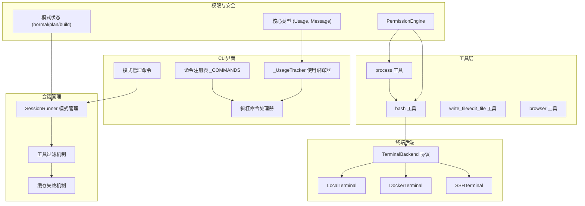

**图表来源**   
- [backend.py:1-177](file://src/microagent/terminal/backend.py#L1-L177)
- [ssh.py:1-91](file://src/microagent/terminal/ssh.py#L1-L91)
- [cli.py:47-77](file://src/microagent/surface/cli.py#L47-L77)
- [cli.py:545-556](file://src/microagent/surface/cli.py#L545-L556)
- [runner.py:77-82](file://src/microagent/session/runner.py#L77-L82)
- [runner.py:137-162](file://src/microagent/session/runner.py#L137-L162)
- [bash.py:1-58](file://src/microagent/tools/builtins/bash.py#L1-L58)
- [process.py:1-180](file://src/microagent/tools/builtins/process.py#L1-L180)
- [permission.py:1-213](file://src/microagent/core/permission.py#L1-L213)
- [types.py:18-24](file://src/microagent/core/types.py#L18-L24)

**章节来源**   
- [backend.py:1-177](file://src/microagent/terminal/backend.py#L1-L177)
- [ssh.py:1-91](file://src/microagent/terminal/ssh.py#L1-L91)
- [cli.py:1-587](file://src/microagent/surface/cli.py#L1-L587)
- [bash.py:1-58](file://src/microagent/tools/builtins/bash.py#L1-L58)
- [process.py:1-180](file://src/microagent/tools/builtins/process.py#L1-L180)
- [permission.py:1-213](file://src/microagent/core/permission.py#L1-L213)
- [runner.py:1-522](file://src/microagent/session/runner.py#L1-L522)
- [types.py:1-197](file://src/microagent/core/types.py#L1-L197)
- [test_terminal.py:1-72](file://tests/unit/test_terminal.py#L1-L72)
- [test_commands.py:1-88](file://tests/unit/test_commands.py#L1-L88)
- [test_v05_features.py:100-131](file://tests/unit/test_v05_features.py#L100-L131)
- [test_review_fixes.py:108-125](file://tests/unit/test_review_fixes.py#L108-L125)

## 核心组件
- TerminalResult：统一的结果数据结构，包含 stdout、stderr、exit_code、timed_out，并提供 success/is_timeout 便捷属性。
- TerminalBackend：Protocol 抽象，定义 run(command, cwd, env, timeout) -> TerminalResult 的统一接口，屏蔽不同后端的差异。
- LocalTerminal：通过 asyncio 子进程在本地 bash 执行命令，支持工作目录与环境变量注入，具备超时与异常保护。
- DockerTerminal：通过 docker CLI 在容器中执行命令，支持镜像选择、工作目录映射、环境变量传递，具备 FileNotFoundError 友好提示。
- SSHTerminal：通过 paramiko 建立 SSH 连接执行远程命令，支持密钥或密码认证、超时控制、自动添加主机密钥策略。
- **_UsageTracker**：CLI 本地使用跟踪器，累计记录令牌使用和成本统计，支持重置和摘要生成。
- **命令注册表 (_COMMANDS)**：动态命令处理器注册系统，支持斜杠命令的动态扩展和管理。
- **模式管理系统**：支持 normal（正常模式）、plan（计划模式，只读工具）、build（构建模式，所有工具）三种工作模式。
- bash 工具：封装异步子进程执行 shell 命令，具备输出长度限制与超时处理。
- process 工具：基于 ContextVar 的会话级进程注册表，提供后台进程的启动、轮询、日志读取、写入 stdin、等待退出、列表与清理。
- PermissionEngine：基于规则的权限评估器，支持 fnmatch 模式匹配与外部脚本扩展，默认 DENY 策略。
- **Usage**：核心类型定义，包含 input_tokens、output_tokens、cost_usd 字段，用于追踪 LLM 使用情况。

**章节来源**   
- [backend.py:19-177](file://src/microagent/terminal/backend.py#L19-L177)
- [ssh.py:14-91](file://src/microagent/terminal/ssh.py#L14-L91)
- [cli.py:47-77](file://src/microagent/surface/cli.py#L47-L77)
- [cli.py:545-556](file://src/microagent/surface/cli.py#L545-L556)
- [runner.py:77-82](file://src/microagent/session/runner.py#L77-L82)
- [runner.py:137-162](file://src/microagent/session/runner.py#L137-L162)
- [bash.py:14-58](file://src/microagent/tools/builtins/bash.py#L14-L58)
- [process.py:26-180](file://src/microagent/tools/builtins/process.py#L26-L180)
- [permission.py:71-213](file://src/microagent/core/permission.py#L71-L213)
- [types.py:18-24](file://src/microagent/core/types.py#L18-L24)

## 架构总览
终端子系统以 TerminalBackend 协议为核心抽象，上层工具通过统一的 run 接口调用不同后端；权限引擎在工具层拦截并评估调用合法性；进程工具为长时间运行的任务提供会话隔离的生命周期管理。**新增的模式管理系统通过 SessionRunner.mode 字段控制工具可用性，配合 CLI 命令注册表提供直观的模式切换接口**。

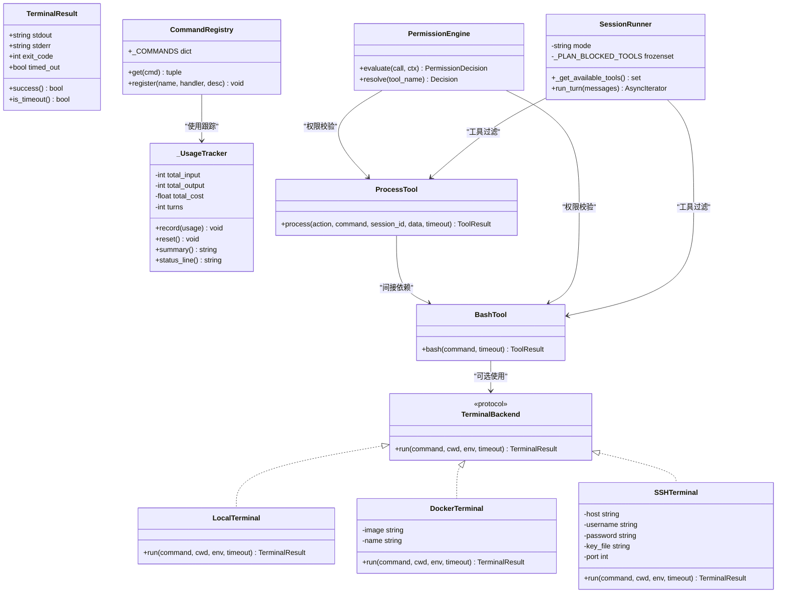

**图表来源**   
- [backend.py:19-177](file://src/microagent/terminal/backend.py#L19-L177)
- [ssh.py:14-91](file://src/microagent/terminal/ssh.py#L14-L91)
- [cli.py:47-77](file://src/microagent/surface/cli.py#L47-L77)
- [cli.py:545-556](file://src/microagent/surface/cli.py#L545-L556)
- [runner.py:77-82](file://src/microagent/session/runner.py#L77-L82)
- [runner.py:137-162](file://src/microagent/session/runner.py#L137-L162)
- [bash.py:14-58](file://src/microagent/tools/builtins/bash.py#L14-L58)
- [process.py:67-180](file://src/microagent/tools/builtins/process.py#L67-L180)
- [permission.py:71-213](file://src/microagent/core/permission.py#L71-L213)

## 详细组件分析

### TerminalBackend 协议与结果模型
- 设计目标：以 Protocol 定义统一接口，使上层无需关心具体执行环境差异。
- 关键特性：
  - TerminalResult 不可变数据类，提供 success/is_timeout 语义化判断。
  - run 方法支持 cwd/env/timeout，便于跨环境一致调用。
- 复杂度与性能：
  - 结果对象轻量，无额外状态；错误路径快速返回，避免阻塞。
- 错误处理：
  - 各后端捕获 TimeoutError/FileNotFoundError/通用异常，统一包装为 TerminalResult。

**章节来源**   
- [backend.py:19-56](file://src/microagent/terminal/backend.py#L19-L56)

### LocalTerminal（本地终端）
- 行为：通过 asyncio.create_subprocess_exec 调用 bash -c 执行命令，分离 stdout/stderr，解码为 UTF-8（替换非法字节）。
- 超时与终止：wait_for 超时后 kill 子进程，返回 timed_out=True。
- 可配置项：cwd、env、timeout。
- 适用场景：开发调试、本地快速验证。

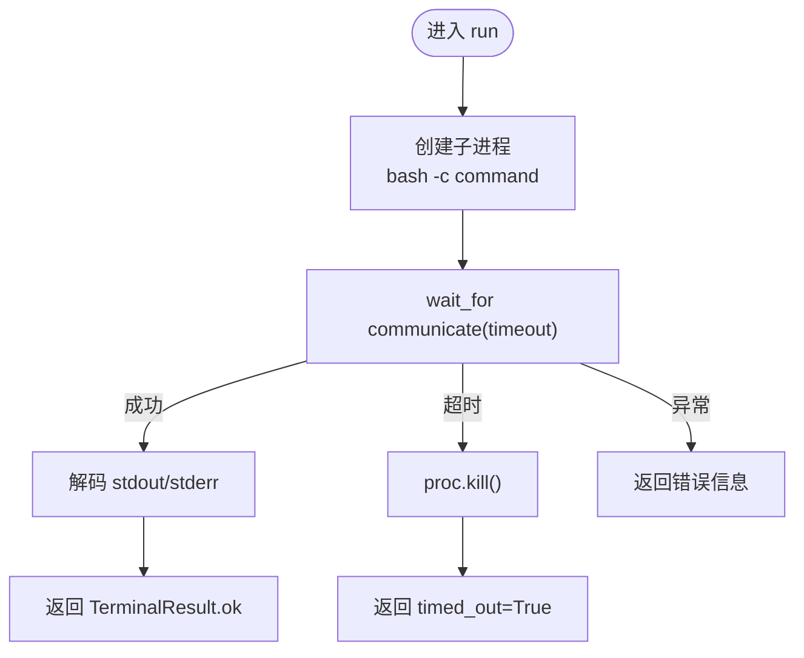

**图表来源**   
- [backend.py:63-109](file://src/microagent/terminal/backend.py#L63-L109)

**章节来源**   
- [backend.py:63-109](file://src/microagent/terminal/backend.py#L63-L109)
- [test_terminal.py:31-54](file://tests/unit/test_terminal.py#L31-L54)

### DockerTerminal（容器终端）
- 行为：构造 docker run --rm 命令，支持 -w 设置工作目录、-e 注入环境变量，镜像可配置。
- 错误处理：当 docker 未安装时返回明确错误码与消息。
- 适用场景：隔离执行、依赖可控、避免污染宿主环境。

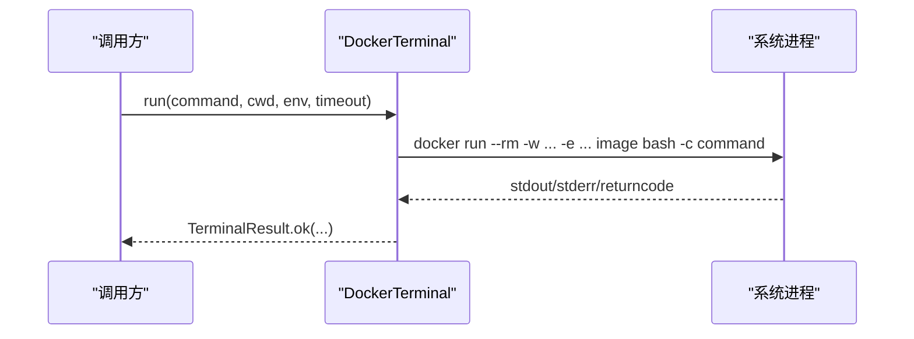

**图表来源**   
- [backend.py:116-177](file://src/microagent/terminal/backend.py#L116-L177)

**章节来源**   
- [backend.py:116-177](file://src/microagent/terminal/backend.py#L116-L177)
- [test_terminal.py:56-72](file://tests/unit/test_terminal.py#L56-72)

### SSHTerminal（SSH 远程终端）
- 行为：使用 paramiko.SSHClient，支持 key_file 或 password 认证，自动添加主机密钥策略。
- 执行流程：将 cwd/env 拼接到命令前缀，通过 exec_command 执行，读取 stdout/stderr 与退出码。
- 超时控制：connect/exec_command 均支持 timeout。
- 适用场景：远程主机执行、集中化管理。

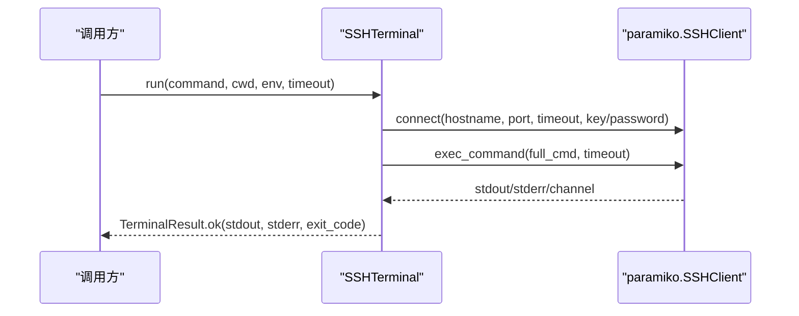

**图表来源**   
- [ssh.py:14-91](file://src/microagent/terminal/ssh.py#L14-L91)

**章节来源**   
- [ssh.py:14-91](file://src/microagent/terminal/ssh.py#L14-L91)

### CLI 命令注册表模式（新增）
- **设计目标**：实现模块化的命令处理系统，支持动态处理器注册和扩展。
- **核心组件**：
  - `_COMMANDS` 字典：存储命令名到处理器元组的映射（handler, description）。
  - 斜杠命令解析：自动识别和处理以 "/" 开头的命令。
  - REPL 状态管理：通过 repl_state 字典共享上下文信息。
- **新增命令**：
  - `/model`：显示或切换当前使用的模型，支持实时更新运行中的 LLM 客户端。
  - `/history`：查看当前会话的消息历史。
  - `/skill`：管理技能（list/load/unload 子命令）。
  - `/clear`：清屏操作。
  - `/cost`：显示令牌使用和成本统计。
  - **/plan**：切换到计划模式（只读工具）。
  - **/build**：切换到构建模式（所有工具）。
  - **/switch**：循环切换 normal → plan → build 模式。
- **扩展性**：支持通过向 `_COMMANDS` 字典添加新条目来扩展命令功能。

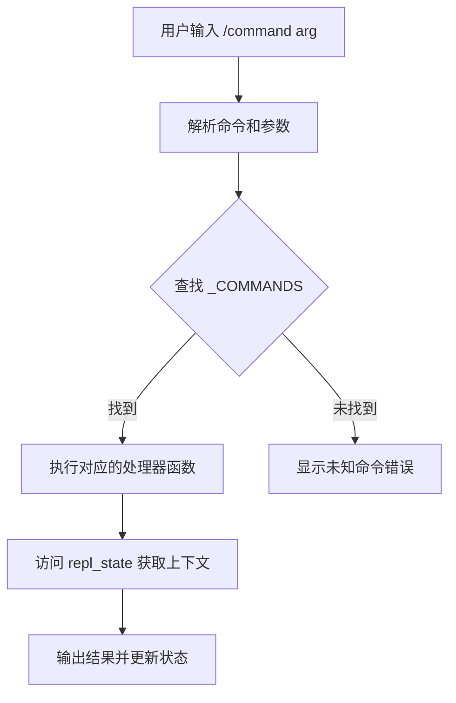

**图表来源**   
- [cli.py:204-215](file://src/microagent/surface/cli.py#L204-L215)
- [cli.py:545-556](file://src/microagent/surface/cli.py#L545-L556)

**章节来源**   
- [cli.py:204-215](file://src/microagent/surface/cli.py#L204-L215)
- [cli.py:453-587](file://src/microagent/surface/cli.py#L453-L587)
- [test_commands.py:57-88](file://tests/unit/test_commands.py#L57-88)

### 模式管理系统（新增）
- **设计目标**：提供三种工作模式来控制工具可用性和执行权限。
- **核心模式**：
  - **normal**：正常模式，所有工具可用。
  - **plan**：计划模式，只读工具可用，阻止 write_file、edit_file、bash、execute_code、process、browser 等写操作工具。
  - **build**：构建模式，所有工具可用，适合开发调试。
- **实现机制**：
  - SessionRunner.mode 字段存储当前模式状态。
  - _PLAN_BLOCKED_TOOLS 常量定义计划模式下被阻止的工具集合。
  - _get_available_tools() 方法根据当前模式过滤可用工具。
  - 模式切换时自动失效工具缓存，确保下次调用使用正确的工具集。
- **CLI 集成**：通过 /plan、/build、/switch 命令提供直观的模式切换接口。

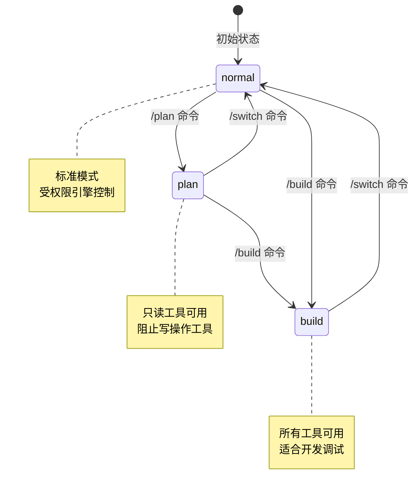

**图表来源**   
- [runner.py:77-82](file://src/microagent/session/runner.py#L77-L82)
- [runner.py:137-162](file://src/microagent/session/runner.py#L137-L162)
- [cli.py:549-569](file://src/microagent/surface/cli.py#L549-L569)

**章节来源**   
- [runner.py:77-82](file://src/microagent/session/runner.py#L77-L82)
- [runner.py:137-162](file://src/microagent/session/runner.py#L137-L162)
- [cli.py:549-569](file://src/microagent/surface/cli.py#L549-L569)
- [test_v05_features.py:100-131](file://tests/unit/test_v05_features.py#L100-L131)
- [test_review_fixes.py:108-125](file://tests/unit/test_review_fixes.py#L108-L125)

### 使用跟踪器（新增）
- **设计目标**：在 CLI 本地跟踪令牌使用和成本统计，不持久化到核心系统。
- **核心功能**：
  - 累计记录 input_tokens、output_tokens、cost_usd。
  - 跟踪对话轮次数量。
  - 支持重置统计信息。
  - 生成可读的使用摘要和状态行。
- **集成方式**：在 `_run_streaming` 函数中接收 Usage 事件并更新跟踪器。
- **显示格式**：底部状态栏显示紧凑的使用信息。

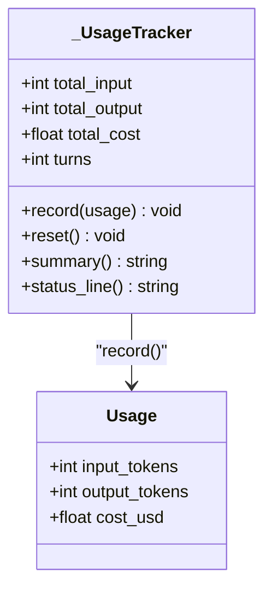

**图表来源**   
- [cli.py:47-77](file://src/microagent/surface/cli.py#L47-L77)
- [types.py:18-24](file://src/microagent/core/types.py#L18-L24)

**章节来源**   
- [cli.py:47-77](file://src/microagent/surface/cli.py#L47-L77)
- [cli.py:254-258](file://src/microagent/surface/cli.py#L254-L258)
- [types.py:18-24](file://src/microagent/core/types.py#L18-L24)
- [test_commands.py:17-54](file://tests/unit/test_commands.py#L17-54)

### bash 工具（同步执行 Shell）
- 功能：通过 asyncio.create_subprocess_shell 执行命令，合并 stdout/stderr，限制最大输出长度防止 OOM。
- 超时与终止：wait_for 超时后 kill 进程并尝试读取部分输出，返回错误结果。
- 适用场景：一次性命令执行，简单快捷。

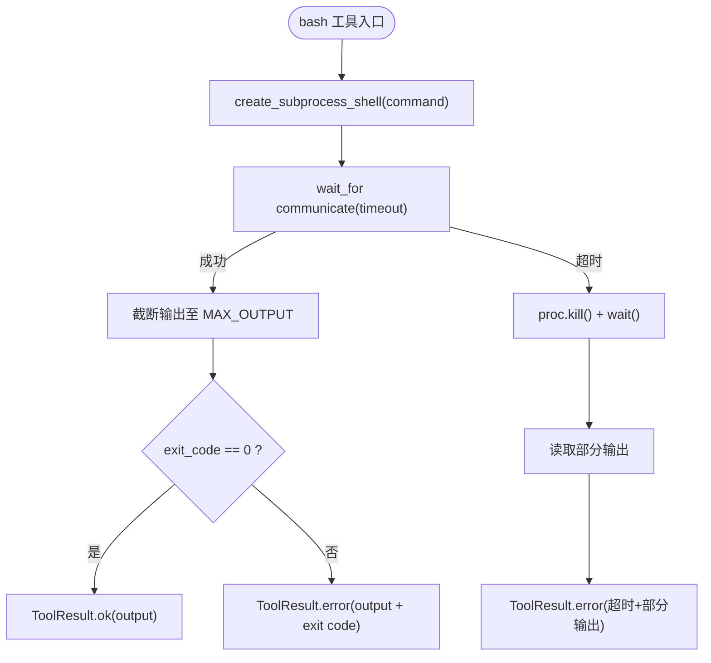

**图表来源**   
- [bash.py:14-58](file://src/microagent/tools/builtins/bash.py#L14-L58)

**章节来源**   
- [bash.py:14-58](file://src/microagent/tools/builtins/bash.py#L14-L58)

### process 工具（后台进程管理）
- 设计要点：
  - 使用 ContextVar 维护每会话的 ProcRegistry（进程字典与输出缓冲）。
  - 支持 start/poll/log/kill/wait/list/write 多种动作。
  - poll 采用短超时 readline 循环拉取可用行，避免阻塞。
  - 定期清理已退出的进程，防止内存增长。
- 适用场景：交互式长期任务、需要持续交互或分片输出的场景。

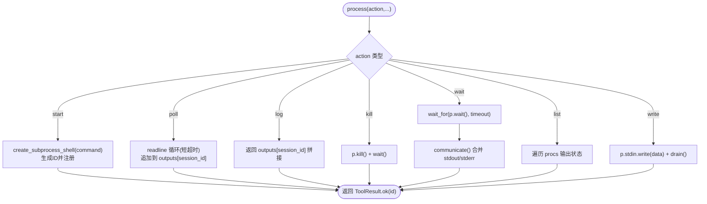

**图表来源**   
- [process.py:67-180](file://src/microagent/tools/builtins/process.py#L67-L180)

**章节来源**   
- [process.py:26-180](file://src/microagent/tools/builtins/process.py#L26-L180)

### 权限引擎（命令白名单与约束）
- 规则匹配：按顺序匹配 tool_pattern（fnmatch）与 arguments_constraint（键值 fnmatch 匹配）。
- 决策类型：ALLOW/DENY/ASK（ASK 需外部回调）。
- 默认策略：DENY（未命中任何规则则拒绝）。
- 扩展方式：ScriptRule 支持外部 Python 脚本动态决策。
- 应用点：对 bash/process 等敏感工具进行前置校验。

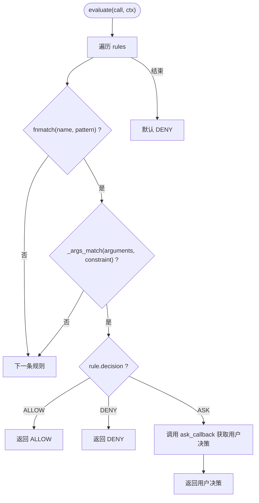

**图表来源**   
- [permission.py:71-116](file://src/microagent/core/permission.py#L71-L116)
- [permission.py:123-186](file://src/microagent/core/permission.py#L123-L186)

**章节来源**   
- [permission.py:71-213](file://src/microagent/core/permission.py#L71-L213)

### /model 命令增强（实时更新 LLM 客户端）
- **增强功能**：支持在运行时切换 LLM 模型，无需重启代理即可生效。
- **实现机制**：
  - 重新创建 LLMConfig 对象，保留原有配置参数。
  - 创建新的 OpenAIChatClient 实例并替换运行中的客户端。
  - 立即影响后续的所有 LLM 调用。
- **使用场景**：快速切换不同的模型进行测试或比较效果。

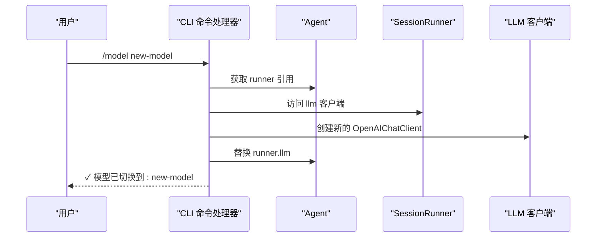

**图表来源**   
- [cli.py:454-472](file://src/microagent/surface/cli.py#L454-L472)

**章节来源**   
- [cli.py:454-472](file://src/microagent/surface/cli.py#L454-L472)

## 依赖关系分析
- 模块耦合：
  - TerminalBackend 作为抽象，被 bash 工具可选使用；process 工具独立于后端，直接操作子进程。
  - permission 引擎位于工具层之上，对 bash/process 进行调用前校验。
  - **CLI 层通过命令注册表模式解耦命令处理逻辑，模式管理系统通过 SessionRunner.mode 控制工具可用性**。
- 外部依赖：
  - SSHTerminal 依赖 paramiko（可选安装）。
  - DockerTerminal 依赖系统 docker CLI。
- 潜在循环：无直接循环依赖；工具与后端解耦良好。

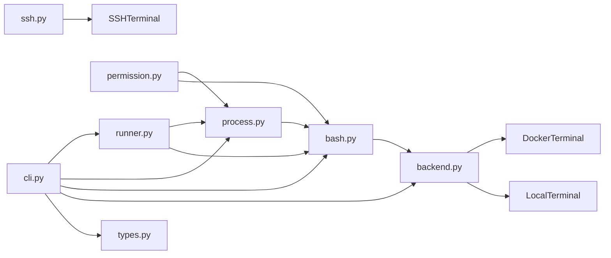

**图表来源**   
- [backend.py:1-177](file://src/microagent/terminal/backend.py#L1-L177)
- [ssh.py:1-91](file://src/microagent/terminal/ssh.py#L1-L91)
- [cli.py:1-587](file://src/microagent/surface/cli.py#L1-L587)
- [bash.py:1-58](file://src/microagent/tools/builtins/bash.py#L1-L58)
- [process.py:1-180](file://src/microagent/tools/builtins/process.py#L1-L180)
- [permission.py:1-213](file://src/microagent/core/permission.py#L1-L213)
- [runner.py:1-522](file://src/microagent/session/runner.py#L1-L522)
- [types.py:1-197](file://src/microagent/core/types.py#L1-L197)

**章节来源**   
- [backend.py:1-177](file://src/microagent/terminal/backend.py#L1-L177)
- [ssh.py:1-91](file://src/microagent/terminal/ssh.py#L1-L91)
- [cli.py:1-587](file://src/microagent/surface/cli.py#L1-L587)
- [bash.py:1-58](file://src/microagent/tools/builtins/bash.py#L1-L58)
- [process.py:1-180](file://src/microagent/tools/builtins/process.py#L1-L180)
- [permission.py:1-213](file://src/microagent/core/permission.py#L1-L213)
- [runner.py:1-522](file://src/microagent/session/runner.py#L1-L522)
- [types.py:1-197](file://src/microagent/core/types.py#L1-L197)

## 性能考虑
- 输出缓冲与截断：
  - bash 工具限制最大输出长度，避免大输出导致 OOM。
  - process 工具的 poll 仅保留最近若干行输出，减少内存占用。
- I/O 模型：
  - 全部使用异步子进程与 wait_for，避免阻塞事件循环。
  - Docker/SSH 通过线程桥接（asyncio.to_thread）执行阻塞 IO，保持主协程响应性。
- 超时控制：
  - 所有 run 方法支持 timeout，及时释放资源。
- 资源清理：
  - Local/Docker/SSH 均在异常路径确保进程终止或连接关闭。
  - process 工具定期清理已退出进程，防止注册表膨胀。
- **新增优化**：
  - 使用跟踪器仅在 CLI 层累积统计，不影响核心系统性能。
  - 命令注册表使用字典查找，O(1) 时间复杂度。
  - **模式切换时自动失效工具缓存，避免重复计算开销**。

## 故障排查指南
- 常见错误与定位：
  - Docker 未安装或未运行：DockerTerminal 返回特定错误码与提示。
  - paramiko 未安装：SSHTerminal 返回安装指引。
  - 命令超时：检查 timeout 设置与命令耗时，必要时拆分任务。
  - 权限不足：确认权限规则是否允许对应工具与参数。
  - **未知命令**：检查命令是否正确拼写，使用 /help 查看可用命令。
  - **模式切换无效**：检查 SessionRunner.mode 字段是否正确更新。
- 诊断步骤：
  - 启用更详细的 stderr 输出，观察命令实际执行路径。
  - 使用 process list 查看后台进程状态，结合 poll/log 定位卡住位置。
  - 在 PermissionEngine 中临时放宽规则，逐步收敛问题范围。
  - **使用 /cost 命令检查令牌使用情况，排查成本异常**。
  - **检查 runner.mode 字段确认当前模式状态**。
- 恢复策略：
  - 对长耗时任务使用 process wait 配合合理超时。
  - 对异常进程使用 kill 强制终止并清理注册表。
  - **使用 /new 命令创建新会话，重置状态**。
  - **使用 /switch 命令循环切换模式，恢复到期望状态**。

**章节来源**   
- [backend.py:116-177](file://src/microagent/terminal/backend.py#L116-L177)
- [ssh.py:40-91](file://src/microagent/terminal/ssh.py#L40-L91)
- [process.py:154-180](file://src/microagent/tools/builtins/process.py#L154-L180)
- [permission.py:189-213](file://src/microagent/core/permission.py#L189-L213)
- [cli.py:212-214](file://src/microagent/surface/cli.py#L212-L214)
- [runner.py:77-82](file://src/microagent/session/runner.py#L77-L82)

## 结论
MicroAgent 的终端集成以 TerminalBackend 协议为核心，实现了本地、容器与 SSH 三种执行环境的统一抽象。配合 bash 与 process 工具，既满足一次性命令执行，也支持复杂的后台进程生命周期管理。**新增的模式管理系统通过 SessionRunner.mode 字段和 CLI 命令注册表提供了灵活的三种工作模式控制，显著提升了系统的安全性和易用性**。权限引擎提供了灵活的访问控制与可扩展的外部决策机制。通过合理的超时、缓冲与清理策略，系统在安全性与性能之间取得平衡。生产部署建议结合命令白名单、沙箱隔离与资源限制，确保终端能力的安全可靠。

## 附录
- SSH 连接安全建议：
  - 优先使用密钥认证，避免明文密码。
  - 设置合理的连接与命令执行超时，防止僵尸连接。
  - 如需连接池，可在上层封装复用客户端实例，注意并发安全与资源释放。
- 终端安全最佳实践：
  - 使用 PermissionEngine 配置严格的工具与参数规则，默认 DENY。
  - 对敏感命令进行白名单限制，结合外部脚本进行动态审批。
  - 在 Docker 环境中限制文件系统挂载、网络与资源配额。
- **CLI 使用技巧**：
  - 使用 /model 命令快速切换不同的 LLM 模型，支持实时更新。
  - 通过 /history 查看会话历史，了解对话上下文。
  - 使用 /skill 管理技能加载状态，优化性能。
  - 定期使用 /cost 检查令牌使用情况，控制成本。
  - 利用 /clear 清理屏幕，提高交互体验。
  - **使用 /plan 切换到只读模式进行安全分析**。
  - **使用 /build 切换到开发模式进行完整功能测试**。
  - **使用 /switch 循环切换不同模式，适应不同工作场景**。
- 测试与验证：
  - 参考 test_terminal.py 中的用例，验证 Local/Docker 后端的正确性与异常路径。
  - **使用 test_commands.py 验证新命令注册表模式的功能完整性**。
  - **使用 test_v05_features.py 验证模式管理功能的正确性**。
  - **使用 test_review_fixes.py 验证模式切换和缓存失效机制**。