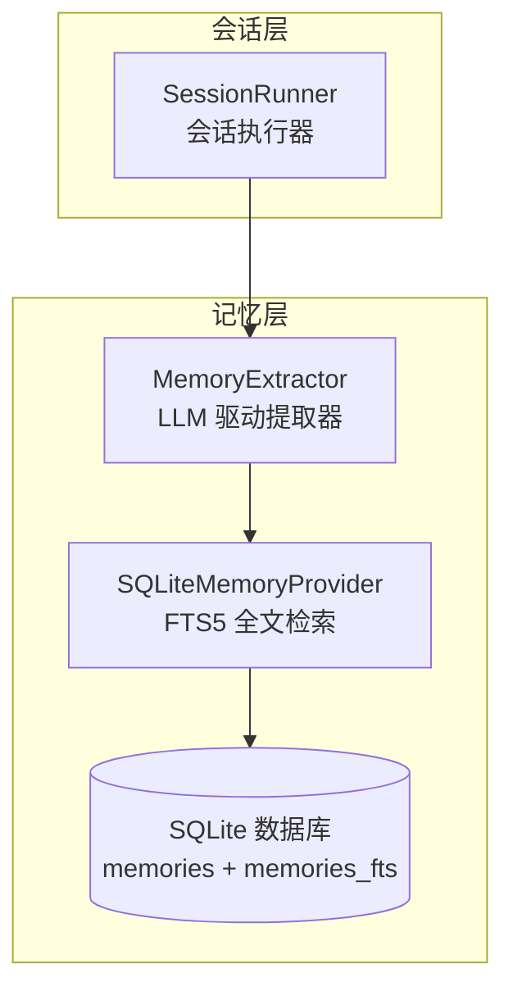
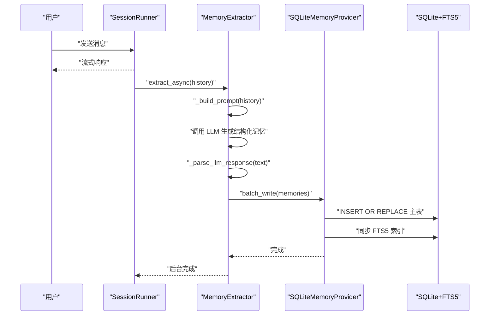
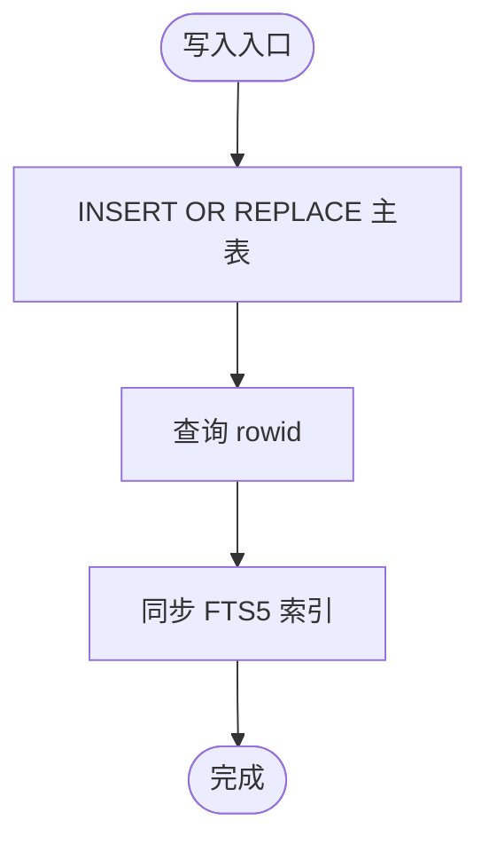
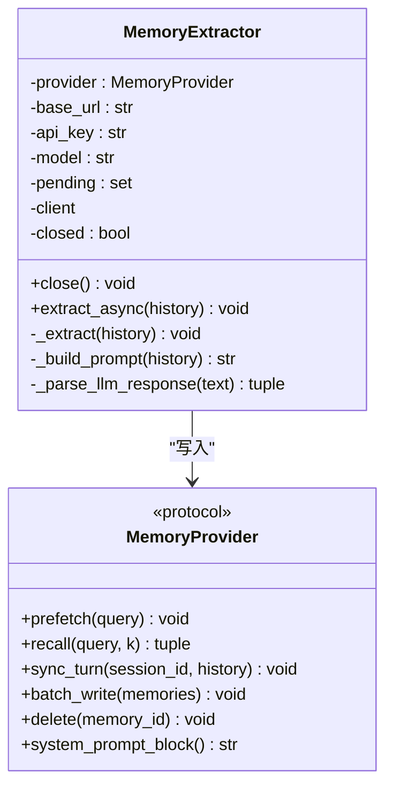

# 记忆系统

<cite>
**本文引用的文件**   
- [provider.py](file://src/microagent/memory/provider.py)
- [extractor.py](file://src/microagent/memory/extractor.py)
- [runner.py](file://src/microagent/session/runner.py)
- [types.py](file://src/microagent/core/types.py)
- [test_memory.py](file://tests/unit/test_memory.py)
- [test_memory_provider.py](file://tests/unit/test_memory_provider.py)
- [test_memory_extractor.py](file://tests/unit/test_memory_extractor.py)
- [README.md](file://README.md)
</cite>

## 目录
1. [简介](#简介)
2. [项目结构](#项目结构)
3. [核心组件](#核心组件)
4. [架构总览](#架构总览)
5. [详细组件分析](#详细组件分析)
6. [依赖关系分析](#依赖关系分析)
7. [性能与内存管理](#性能与内存管理)
8. [故障排查指南](#故障排查指南)
9. [结论](#结论)
10. [附录：自定义记忆后端开发指南](#附录自定义记忆后端开发指南)

## 简介
本文件为 MicroAgent 记忆系统的全面文档，聚焦以下目标：
- 解释 MemoryProvider 协议的抽象设计与 SQLiteMemoryProvider 的具体实现。
- 深入说明 FTS5 全文搜索的工作原理（索引构建、查询优化、相关性评分）。
- 介绍 MemoryExtractor 的 LLM 驱动内存提取机制（分类、去重、更新策略）。
- 定义 Memory 数据模型及其使用方法（id、content、category、created_at 等字段）。
- 说明记忆的批量写入、查询、删除操作。
- 提供自定义记忆后端的开发指南，支持不同存储介质和搜索引擎。
- 给出性能优化建议与内存管理策略。

## 项目结构
记忆系统位于 src/microagent/memory 目录下，包含两个核心模块：
- provider.py：定义 Memory 数据模型、MemoryProvider 协议以及 SQLiteMemoryProvider 实现。
- extractor.py：基于 LLM 的记忆提取器，从对话历史中抽取结构化记忆并写入 Provider。

SessionRunner 在会话轮次结束后触发记忆提取，形成“对话 → 提取 → 持久化”的闭环。

图表来源
- [runner.py:92-100](file://src/microagent/session/runner.py#L92-L100)
- [extractor.py:43-112](file://src/microagent/memory/extractor.py#L43-L112)
- [provider.py:77-104](file://src/microagent/memory/provider.py#L77-L104)

章节来源
- [provider.py:1-194](file://src/microagent/memory/provider.py#L1-L194)
- [extractor.py:1-153](file://src/microagent/memory/extractor.py#L1-L153)
- [runner.py:92-100](file://src/microagent/session/runner.py#L92-L100)

## 核心组件
- Memory 数据模型：不可变数据结构，包含 id、content、category、created_at、relevance_score、session_id、visibility、metadata 等字段。
- MemoryProvider 协议：定义可插拔的后端接口，包括 prefetch、recall、sync_turn、batch_write、delete、system_prompt_block。
- SQLiteMemoryProvider：基于 SQLite + FTS5 的实现，提供零外部依赖的全文检索能力。
- MemoryExtractor：异步后台任务驱动的 LLM 提取器，将对话历史解析为结构化 Memory 并批量写入 Provider。

章节来源
- [provider.py:24-36](file://src/microagent/memory/provider.py#L24-L36)
- [provider.py:43-70](file://src/microagent/memory/provider.py#L43-L70)
- [provider.py:77-104](file://src/microagent/memory/provider.py#L77-L104)
- [extractor.py:43-112](file://src/microagent/memory/extractor.py#L43-L112)

## 架构总览
记忆系统在会话执行流程中的位置如下：
- SessionRunner 在一次 turn 完成后，若配置了 memory，则构造 MemoryExtractor 并异步调用 extract_async。
- MemoryExtractor 使用 OpenAI 兼容客户端生成提示词，调用 LLM 进行信息抽取，解析结果后通过 batch_write 写入 Provider。
- SQLiteMemoryProvider 将 Memory 写入 SQLite 主表，并通过 FTS5 虚拟表维护 content 的全文索引；查询时使用 bm25 相关性评分排序返回 top-k。

图表来源
- [runner.py:253-260](file://src/microagent/session/runner.py#L253-L260)
- [extractor.py:89-112](file://src/microagent/memory/extractor.py#L89-L112)
- [provider.py:152-194](file://src/microagent/memory/provider.py#L152-L194)

## 详细组件分析

### Memory 数据模型
- 字段说明：
  - id：唯一标识符，字符串类型。
  - content：记忆内容，文本类型。
  - category：类别，限定为 fact、preference、task、context 之一。
  - created_at：创建时间戳，浮点型。
  - relevance_score：相关性评分，越大越相关（FTS5 bm25 取负值）。
  - session_id：会话关联 ID，可为空表示跨会话记忆。
  - visibility：可见性，private、shared、redacted。
  - metadata：扩展元数据，字典或 None。
- 特性：
  - 不可变（frozen）且使用 slots 提升内存效率。
  - 默认值：relevance_score=0.0，session_id=None，visibility="private"，metadata=None。

章节来源
- [provider.py:24-36](file://src/microagent/memory/provider.py#L24-L36)
- [test_memory.py:10-28](file://tests/unit/test_memory.py#L10-L28)
- [test_memory_provider.py:17-28](file://tests/unit/test_memory_provider.py#L17-L28)

### MemoryProvider 协议
- 方法职责：
  - prefetch(query)：预热缓存（fire-and-forget），当前实现为空。
  - recall(query, k)：返回 top-k 最相关的记忆。
  - sync_turn(session_id, history)：将一轮对话的历史作为上下文记忆存储。
  - batch_write(memories)：批量写入记忆。
  - delete(memory_id)：删除指定记忆。
  - system_prompt_block()：注入系统提示的可定制块。
- 设计要点：
  - 使用 Protocol 定义结构契约，便于运行时检查与替换实现。
  - 所有写/读方法均为异步，便于与 I/O 和 LLM 调用解耦。

章节来源
- [provider.py:43-70](file://src/microagent/memory/provider.py#L43-L70)
- [test_memory.py:30-55](file://tests/unit/test_memory.py#L30-L55)

### SQLiteMemoryProvider 实现
- 数据库模式：
  - 主表 memories：存储 id、content、category、created_at、session_id、visibility、metadata。
  - FTS5 虚拟表 memories_fts：对 content 建立全文索引，映射 rowid 到主表。
- 关键行为：
  - 初始化时创建表并启用 WAL 模式以提升并发写入性能。
  - recall 使用 FTS5 MATCH 查询，结合 bm25 相关性评分排序返回 top-k。
  - _insert 使用 INSERT OR REPLACE 保证幂等更新，随后同步 FTS5 索引。
  - delete 需显式向 FTS5 发送 delete 命令以清理索引。
  - sync_turn 仅保存最近若干条消息作为 context 记忆（截断过长内容）。
- 注意事项：
  - metadata 字段以 JSON 序列化存储，读取时反序列化为 dict。
  - FTS5 外部内容表需要显式 delete 指令，否则索引不一致。

图表来源
- [provider.py:172-194](file://src/microagent/memory/provider.py#L172-L194)

章节来源
- [provider.py:77-104](file://src/microagent/memory/provider.py#L77-L104)
- [provider.py:110-133](file://src/microagent/memory/provider.py#L110-L133)
- [provider.py:152-168](file://src/microagent/memory/provider.py#L152-L168)
- [provider.py:172-194](file://src/microagent/memory/provider.py#L172-L194)
- [test_memory_provider.py:31-74](file://tests/unit/test_memory_provider.py#L31-L74)

### MemoryExtractor 提取器
- 工作流程：
  - 构造提示词：拼接最近 10 条对话消息，按角色和内容格式化。
  - 调用 LLM：使用 OpenAI 兼容客户端，限制 max_tokens 与 temperature。
  - 解析响应：逐行匹配末尾的 (category) 标记，过滤非法行，生成 Memory 对象。
  - 写入 Provider：通过 batch_write 批量写入，失败记录日志但不阻塞主流程。
- 后台任务：
  - 使用 asyncio.create_task 启动提取任务，跟踪 pending 集合防止 GC。
  - close 时取消未完成任务并关闭底层客户端。
- 分类与去重：
  - 分类由 LLM 输出决定，限定为 fact、preference、task。
  - 去重策略未在代码中显式实现，依赖上层业务逻辑或 Provider 的幂等写入。

图表来源
- [extractor.py:43-112](file://src/microagent/memory/extractor.py#L43-L112)
- [provider.py:43-70](file://src/microagent/memory/provider.py#L43-L70)

章节来源
- [extractor.py:89-153](file://src/microagent/memory/extractor.py#L89-L153)
- [test_memory_extractor.py:6-47](file://tests/unit/test_memory_extractor.py#L6-L47)

### 会话集成与触发时机
- SessionRunner 在 turn 完成后，若无工具调用，则触发 MemoryExtractor 的 extract_async。
- 传入最近 10 条消息作为历史，确保提取上下文足够且不过长。
- 异常被捕获并忽略，避免影响主流程。

章节来源
- [runner.py:253-260](file://src/microagent/session/runner.py#L253-L260)

## 依赖关系分析
- MemoryExtractor 依赖 MemoryProvider 协议与可选的 OpenAI 客户端。
- SQLiteMemoryProvider 依赖 sqlite3 标准库与 FTS5 扩展。
- SessionRunner 依赖 MemoryExtractor 并在适当时机触发提取。
- 测试覆盖 Memory 数据模型、Provider 协议、SQLite 实现与提取器解析逻辑。

图表来源
- [runner.py:92-100](file://src/microagent/session/runner.py#L92-L100)
- [extractor.py:21-22](file://src/microagent/memory/extractor.py#L21-L22)
- [provider.py:77-104](file://src/microagent/memory/provider.py#L77-L104)

章节来源
- [provider.py:1-194](file://src/microagent/memory/provider.py#L1-L194)
- [extractor.py:1-153](file://src/microagent/memory/extractor.py#L1-L153)
- [runner.py:92-100](file://src/microagent/session/runner.py#L92-L100)

## 性能与内存管理
- FTS5 全文检索：
  - 使用 bm25 相关性评分，ORDER BY -bm25(...) DESC 返回 top-k。
  - 外部内容表需显式 delete 指令保持索引一致性。
- 写入优化：
  - INSERT OR REPLACE 保证幂等更新，减少重复插入开销。
  - WAL 模式提升并发写入性能。
- 内存管理：
  - Memory 使用 frozen + slots，降低实例内存占用。
  - Metadata 以 JSON 序列化存储，避免复杂对象带来的额外开销。
- 提取器资源：
  - 后台任务跟踪 pending 集合，防止 GC 导致的中途终止。
  - close 时统一取消任务并关闭客户端，释放资源。

章节来源
- [provider.py:110-133](file://src/microagent/memory/provider.py#L110-L133)
- [provider.py:172-194](file://src/microagent/memory/provider.py#L172-L194)
- [extractor.py:68-78](file://src/microagent/memory/extractor.py#L68-L78)

## 故障排查指南
- 提取失败：
  - 检查 OpenAI 客户端是否可用（AsyncOpenAI 是否为 None）。
  - 查看日志中“Memory extraction failed”调试信息。
- 查询无结果：
  - 确认 FTS5 索引已同步（_insert 后执行同步语句）。
  - 检查 query 是否与 content 匹配（大小写、分词）。
- 删除无效：
  - 确保先向 FTS5 发送 delete 指令再删除主表记录。
- 会话集成问题：
  - 确认 SessionRunner 已正确构造 MemoryExtractor 并调用 extract_async。

章节来源
- [extractor.py:91-112](file://src/microagent/memory/extractor.py#L91-L112)
- [provider.py:156-168](file://src/microagent/memory/provider.py#L156-L168)
- [runner.py:253-260](file://src/microagent/session/runner.py#L253-L260)

## 结论
MicroAgent 的记忆系统通过清晰的协议抽象与高效的 FTS5 实现，提供了可扩展、高性能的记忆存储与检索能力。MemoryExtractor 利用 LLM 自动从对话中提取结构化记忆，形成“对话→提取→持久化”的自动化闭环。通过合理的内存管理与性能优化策略，系统在保证功能完整性的同时具备良好的可扩展性与稳定性。

## 附录：自定义记忆后端开发指南
- 实现要求：
  - 遵循 MemoryProvider 协议，实现 prefetch、recall、sync_turn、batch_write、delete、system_prompt_block。
  - 所有方法应为异步，以便与 I/O 和 LLM 调用解耦。
- 存储介质选择：
  - 可选择 PostgreSQL、Elasticsearch、Redis 等作为后端，根据需求权衡查询性能与复杂度。
- 搜索引擎集成：
  - 若使用外部搜索引擎，需在 batch_write 中同步索引，在 recall 中执行查询并映射结果为 Memory 对象。
- 示例步骤：
  - 定义类并实现协议方法。
  - 在 SessionRunner 初始化时注入自定义 Provider。
  - 验证批写、查询、删除操作的正确性。

章节来源
- [provider.py:43-70](file://src/microagent/memory/provider.py#L43-L70)
- [README.md:181-202](file://README.md#L181-L202)