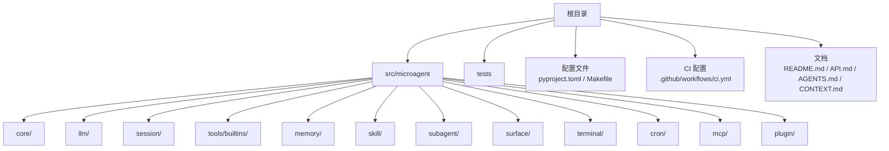
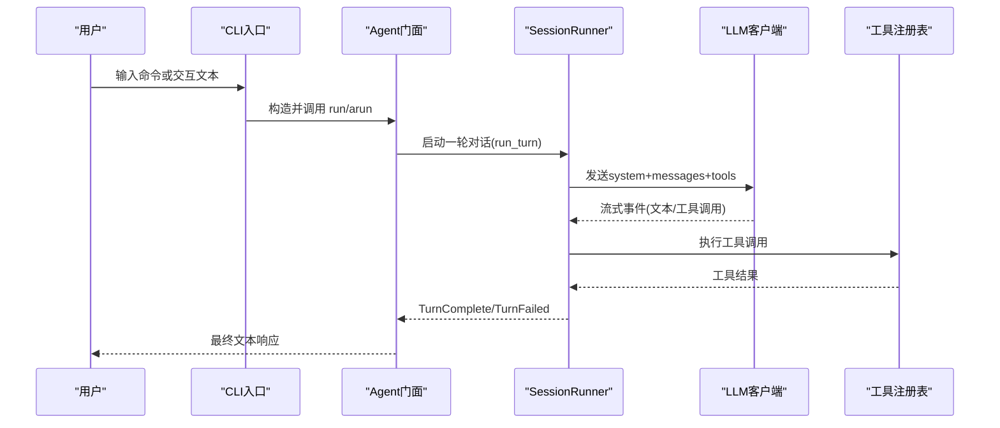
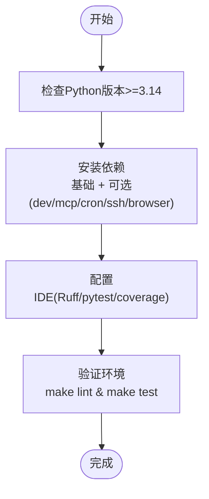
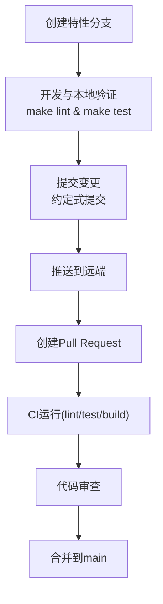
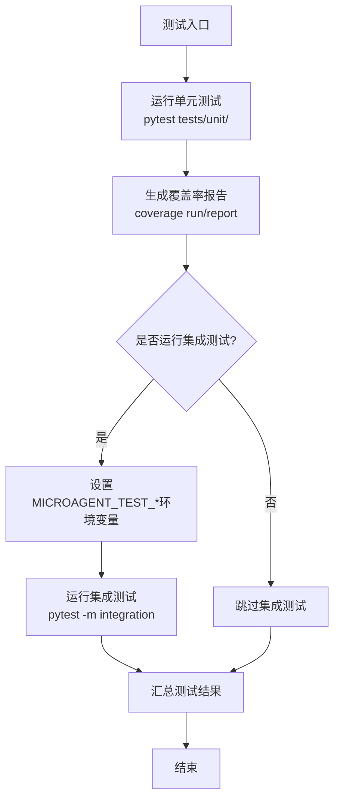
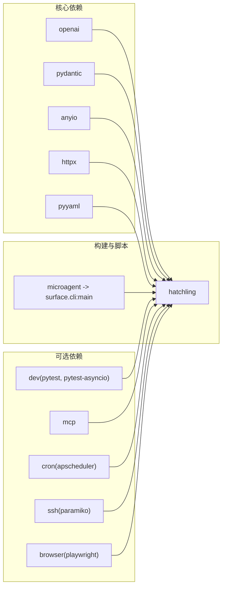

# 贡献指南

<cite>
**本文引用的文件**   
- [README.md](file://README.md)
- [pyproject.toml](file://pyproject.toml)
- [Makefile](file://Makefile)
- [AGENTS.md](file://AGENTS.md)
- [API.md](file://API.md)
- [CONTEXT.md](file://CONTEXT.md)
- [.github/workflows/ci.yml](file://.github/workflows/ci.yml)
- [src/microagent/__init__.py](file://src/microagent/__init__.py)
- [src/microagent/agent.py](file://src/microagent/agent.py)
- [src/microagent/config.py](file://src/microagent/config.py)
- [src/microagent/core/types.py](file://src/microagent/core/types.py)
- [src/microagent/tools/builtins/read_file.py](file://src/microagent/tools/builtins/read_file.py)
- [tests/unit/test_config.py](file://tests/unit/test_config.py)
- [tests/unit/fake_llm.py](file://tests/unit/fake_llm.py)
- [tests/unit/test_compaction_pyramid.py](file://tests/unit/test_compaction_pyramid.py)
- [tests/unit/test_builtins.py](file://tests/unit/test_builtins.py)
</cite>

## 目录
1. [简介](#简介)
2. [项目结构](#项目结构)
3. [核心组件](#核心组件)
4. [架构总览](#架构总览)
5. [详细组件分析](#详细组件分析)
6. [依赖关系分析](#依赖关系分析)
7. [性能与质量考量](#性能与质量考量)
8. [故障排查指南](#故障排查指南)
9. [结论](#结论)
10. [附录](#附录)

## 简介
本贡献指南面向希望为 MicroAgent 做出贡献的开发者，涵盖开发环境搭建、代码规范、Git 工作流、测试与质量标准、文档编写规范、问题报告与功能请求流程，以及社区行为准则与沟通渠道。MicroAgent 是一个可嵌入的 Python AI Agent 核心库，强调“窄腰厚边”的设计：核心循环极简，能力通过工具与扩展点实现。

## 项目结构
仓库采用清晰的模块化组织：
- src/microagent：核心库源码，按功能划分 core、llm、session、tools、memory、skill、subagent、surface、terminal、cron、mcp、plugin 等子包。
- tests：单元测试与集成测试，分别位于 unit 与 integration。
- 配置文件：pyproject.toml（构建与依赖）、Makefile（常用命令）、CI 配置在 .github/workflows/ci.yml。
- 文档：README.md、API.md、AGENTS.md、CONTEXT.md。

**章节来源**
- [README.md:1-450](file://README.md#L1-L450)
- [AGENTS.md:16-59](file://AGENTS.md#L16-L59)

## 核心组件
- Agent：对外门面，封装 SessionRunner、ToolRegistry、LLMClient、Budget、SkillLoader 等内部组件，提供 run/arun 接口。
- Config：多源配置解析（CLI > 环境变量 > 配置文件 > 默认值）。
- Core Types：Message、ToolCall、ToolResult、事件类型（TextDelta、ToolCallDelta、TurnComplete 等）是系统内消息与事件的基础数据结构。
- Tools：内置工具以 @tool 装饰器定义，统一返回 ToolResult，并通过 ToolRegistry 注册与执行。
- LLM 客户端：OpenAI 兼容客户端，支持流式响应与使用量统计。
- Session Runner：核心循环，驱动 LLM → 工具调用 → 压缩与记忆 → 下一轮迭代。
- Memory/Skill/Subagent/Cron/MCP/Terminal：可选扩展能力，按需启用。

**章节来源**
- [src/microagent/agent.py:24-77](file://src/microagent/agent.py#L24-L77)
- [src/microagent/config.py:20-71](file://src/microagent/config.py#L20-L71)
- [src/microagent/core/types.py:17-189](file://src/microagent/core/types.py#L17-L189)
- [src/microagent/tools/builtins/read_file.py:14-55](file://src/microagent/tools/builtins/read_file.py#L14-L55)
- [src/microagent/__init__.py:1-133](file://src/microagent/__init__.py#L1-L133)

## 架构总览
MicroAgent 遵循“窄腰厚边”原则：SessionRunner 是唯一执行路径，所有能力通过 Protocol 与工具注入。下图展示了从 CLI 到 Agent、Runner、LLM 与工具的调用链。

**图表来源**
- [src/microagent/surface/cli.py:1-59](file://src/microagent/surface/cli.py#L1-L59)
- [src/microagent/agent.py:79-113](file://src/microagent/agent.py#L79-L113)
- [src/microagent/core/types.py:123-189](file://src/microagent/core/types.py#L123-L189)

**章节来源**
- [AGENTS.md:61-82](file://AGENTS.md#L61-L82)
- [README.md:349-382](file://README.md#L349-L382)

## 详细组件分析

### 开发环境搭建
- Python 版本要求：>=3.14（见 pyproject.toml 与 README 徽章）。
- 依赖安装：
  - 基础依赖：openai、pydantic、anyio、httpx、pyyaml。
  - 可选依赖：dev（pytest、pytest-asyncio）、mcp、cron、ssh、browser。
- IDE 配置建议：
  - 使用 Ruff 进行 lint 与格式化（line-length=100，target-version=py314，双引号、空格缩进）。
  - 使用 pytest 运行测试；coverage 用于覆盖率报告。
  - 推荐使用 uv 管理虚拟环境与依赖同步。

**章节来源**
- [pyproject.toml:1-107](file://pyproject.toml#L1-L107)
- [README.md:1-450](file://README.md#L1-L450)
- [Makefile:1-39](file://Makefile#L1-L39)

### 代码规范与风格指南
- PEP 8 与 Ruff：
  - 选择规则集：E/F/I/W/UP/B/C4/SIM。
  - 忽略部分规则（如行过长由 line-length 控制，某些风格化规则按项目约定忽略）。
  - 排除测试目录中的部分规则（避免对测试代码过度约束）。
- 命名约定：
  - 模块与函数使用小写下划线；类名使用大驼峰；常量全大写。
  - 公共 API 通过 __all__ 明确导出。
- 注释与文档字符串：
  - 模块级 docstring 说明职责；函数/类使用清晰描述；复杂逻辑添加行内注释。
  - 示例与用法参考 README/API/AGENTS。

**章节来源**
- [pyproject.toml:69-92](file://pyproject.toml#L69-L92)
- [src/microagent/__init__.py:53-132](file://src/microagent/__init__.py#L53-L132)
- [AGENTS.md:174-185](file://AGENTS.md#L174-L185)

### Git 工作流程
- 分支策略：
  - CI 触发 main 分支 push 与 PR 合并。
  - 建议特性分支命名 feat/*、fix/*、refactor/*、docs/*、build/*。
- 提交规范：
  - 使用约定式提交：feat/fix/refactor/test/docs/build。
  - 保持提交小而聚焦，一次提交一个逻辑变更。
- Pull Request 流程：
  - 确保 lint 与测试通过（make lint、make test）。
  - 更新相关文档与示例；必要时增加或调整测试。
  - 等待 CI 通过后进行代码审查与合并。

**章节来源**
- [.github/workflows/ci.yml:1-22](file://.github/workflows/ci.yml#L1-L22)
- [AGENTS.md:174-185](file://AGENTS.md#L174-L185)

### 测试要求与质量标准
- 单元测试：
  - 使用 pytest 与 pytest-asyncio；FakeLLMClient 模拟 LLM 行为。
  - 覆盖核心类型、工具、权限、会话持久化、压缩金字塔等。
- 集成测试：
  - 需要真实 LLM API；通过环境变量配置测试端点与密钥。
  - 标记 integration 以便选择性运行。
- 覆盖率：
  - coverage 配置 source 为 src/microagent；报告跳过已覆盖项并显示缺失。
- 代码审查：
  - 关注协议实现正确性、工具安全性（权限引擎）、资源清理（close）、异常处理。

**章节来源**
- [tests/unit/fake_llm.py:1-110](file://tests/unit/fake_llm.py#L1-L110)
- [tests/unit/test_config.py:1-76](file://tests/unit/test_config.py#L1-L76)
- [tests/unit/test_compaction_pyramid.py:1-140](file://tests/unit/test_compaction_pyramid.py#L1-L140)
- [tests/unit/test_builtins.py:1-34](file://tests/unit/test_builtins.py#L1-L34)
- [pyproject.toml:62-68](file://pyproject.toml#L62-L68)
- [pyproject.toml:99-107](file://pyproject.toml#L99-L107)

### 文档编写规范
- Markdown 格式：
  - 使用一致的标题层级与列表；代码块标注语言；链接指向仓库内文件或外部权威来源。
- API 文档：
  - 在 API.md 中提供快速上手、配置方式、Python API 详解、会话管理与扩展点示例。
- 示例代码：
  - 示例需可运行且最小化依赖；避免硬编码敏感信息；使用临时路径与环境变量。
- 术语与上下文：
  - 遵循 CONTEXT.md 中的术语定义（Turn、Iteration、Budget、Surface、Skill、ContextSource、Subagent、MaterializedTool、Hook Types）。

**章节来源**
- [API.md:1-242](file://API.md#L1-L242)
- [CONTEXT.md:1-52](file://CONTEXT.md#L1-L52)

### 问题报告与功能请求
- 问题报告模板要点：
  - 环境信息（Python 版本、依赖版本、操作系统）。
  - 复现步骤与期望行为 vs 实际行为。
  - 日志与错误堆栈（如有）。
  - 最小可复现代码片段（避免敏感数据）。
- 功能请求模板要点：
  - 背景与动机。
  - 需求描述与用例。
  - 影响范围与兼容性考虑。
  - 可能的实现思路与替代方案。
- 流程：
  - 先在 Issues 中讨论；必要时创建 PR 附带测试与文档更新。

[本节为通用指导，不直接分析具体文件]

### 社区行为准则与沟通渠道
- 行为准则：
  - 尊重、包容、专业；鼓励建设性反馈与协作。
- 沟通渠道：
  - 仓库 Issues 用于问题与功能请求；PR 用于贡献；README/AGENTS/API/CONTEXT 作为主要文档参考。
  - 建议在 PR 描述中引用相关 Issue 编号，便于追踪。

[本节为通用指导，不直接分析具体文件]

## 依赖关系分析
MicroAgent 的核心依赖包括 openai、pydantic、anyio、httpx、pyyaml；可选依赖按功能拆分。构建系统使用 hatchling，脚本入口 microagent 指向 surface.cli:main。

**图表来源**
- [pyproject.toml:1-107](file://pyproject.toml#L1-L107)

**章节来源**
- [pyproject.toml:25-57](file://pyproject.toml#L25-L57)

## 性能与质量考量
- 压缩金字塔：四层压缩策略（微压缩、裁剪、LLM摘要、熔断），减少上下文长度与成本。
- 预算树：父子预算共享取消事件，防止超支与无限递归。
- 流式响应：降低首字节延迟，提升用户体验。
- 资源清理：Agent.close() 释放浏览器页面、LLM客户端、定时任务等资源。
- 测试隔离：FakeLLMClient 与 InMemoryStore 避免外部依赖与磁盘 I/O。

**章节来源**
- [AGENTS.md:116-131](file://AGENTS.md#L116-L131)
- [src/microagent/agent.py:105-113](file://src/microagent/agent.py#L105-L113)
- [tests/unit/fake_llm.py:1-110](file://tests/unit/fake_llm.py#L1-L110)

## 故障排查指南
- 配置加载失败：
  - 检查 ~/.microagent/config.yaml 是否存在与格式是否正确；环境变量优先级高于文件。
  - 参考测试用例验证默认值与覆盖顺序。
- LLM 调用异常：
  - 确认 base_url、api_key、model 配置；检查网络与鉴权。
  - 使用 FakeLLMClient 定位逻辑问题。
- 工具执行错误：
  - 检查权限规则与参数校验；查看 ToolResult.is_error 与 metadata。
- 会话恢复失败：
  - 确认 Store 实现与 session_id；检查 WAL 模式与 checkpoint。

**章节来源**
- [tests/unit/test_config.py:1-76](file://tests/unit/test_config.py#L1-L76)
- [src/microagent/config.py:28-71](file://src/microagent/config.py#L28-L71)
- [src/microagent/core/types.py:97-116](file://src/microagent/core/types.py#L97-L116)

## 结论
MicroAgent 以极简核心与丰富扩展点为设计目标，贡献者应遵循代码规范、测试标准与文档要求，确保新增功能通过协议与工具注入，不破坏核心循环与缓存策略。通过清晰的 Git 工作流与 CI 保障质量，社区协作将推动项目持续演进。

[本节为总结性内容，不直接分析具体文件]

## 附录
- 快速命令：
  - make lint：Ruff 检查
  - make fix：自动修复与格式化
  - make test：运行单元测试
  - make cov：覆盖率报告
  - make build：构建发布包
- 关键文件索引：
  - 新增工具：tools/builtins/*.py + core/tool.py + core/permission.py + 测试
  - 新增 LLM 提供商：llm/client.py
  - 压缩调优：session/compress.py
  - CLI 改进：surface/cli.py
  - 会话持久化：core/store.py + session/runner.py
  - 新协议：plugin/types.py
  - 定价与上下文窗口：llm/client.py
  - 公共 API：__init__.py

**章节来源**
- [Makefile:1-39](file://Makefile#L1-L39)
- [AGENTS.md:187-199](file://AGENTS.md#L187-L199)