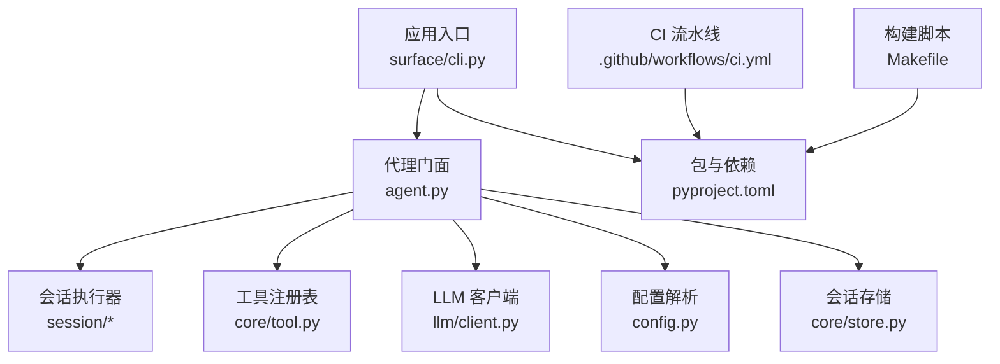
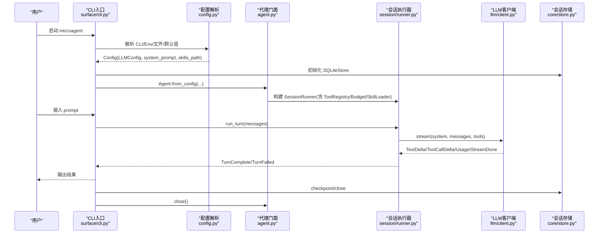
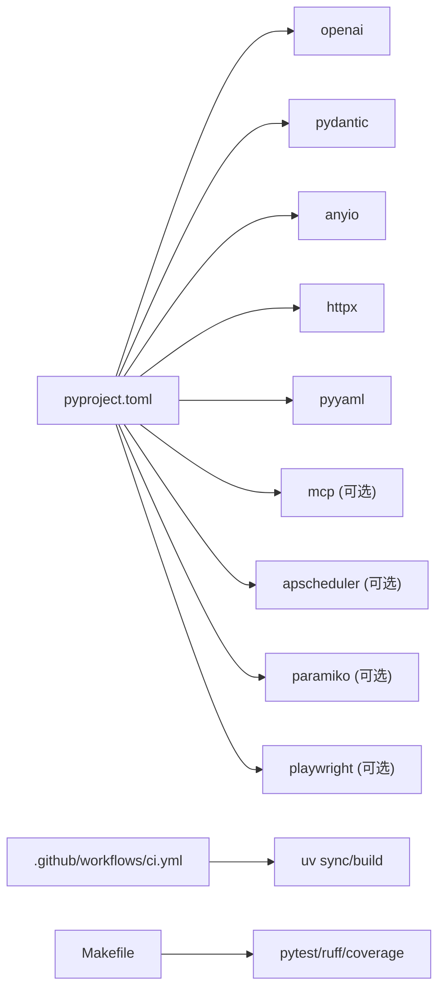

# 部署指南

<cite>
**本文引用的文件**   
- [README.md](file://README.md)
- [pyproject.toml](file://pyproject.toml)
- [Makefile](file://Makefile)
- [.github/workflows/ci.yml](file://.github/workflows/ci.yml)
- [src/microagent/config.py](file://src/microagent/config.py)
- [src/microagent/agent.py](file://src/microagent/agent.py)
- [src/microagent/surface/cli.py](file://src/microagent/surface/cli.py)
- [src/microagent/llm/client.py](file://src/microagent/llm/client.py)
- [src/microagent/core/store.py](file://src/microagent/core/store.py)
</cite>

## 目录
1. [简介](#简介)
2. [项目结构](#项目结构)
3. [核心组件](#核心组件)
4. [架构总览](#架构总览)
5. [详细组件分析](#详细组件分析)
6. [依赖分析](#依赖分析)
7. [性能考虑](#性能考虑)
8. [故障排查指南](#故障排查指南)
9. [结论](#结论)
10. [附录](#附录)

## 简介
本指南面向生产环境，提供 MicroAgent 的容器化与编排部署方案。内容涵盖：
- Docker 多阶段构建、镜像优化与环境变量管理
- 生产环境配置要求（依赖、配置文件、日志、监控）
- Kubernetes 部署资源（Deployment、Service、ConfigMap、Secret）
- CI/CD 流水线（自动化测试、构建、部署）
- 监控与日志收集（指标、错误追踪、性能监控）
- 安全加固（依赖扫描、漏洞检测、访问控制）
- 故障排查与运维最佳实践

MicroAgent 是一个 Python 实现的轻量级 AI Agent 核心库，支持 OpenAI 兼容接口、工具调用、会话持久化、技能加载、定时任务等能力。其入口为 CLI 命令 microagent，通过配置系统从命令行参数、环境变量、配置文件与默认值中解析运行参数。

## 项目结构
仓库采用按功能模块划分的组织方式，核心代码位于 src/microagent，CLI 入口在 surface.cli，LLM 客户端与配置在 llm.client 与 config，会话持久化在 core.store，CI 定义在 .github/workflows/ci.yml，包管理与可选依赖在 pyproject.toml，常用命令在 Makefile。

图表来源
- [src/microagent/surface/cli.py:1-374](file://src/microagent/surface/cli.py#L1-L374)
- [src/microagent/agent.py:1-113](file://src/microagent/agent.py#L1-L113)
- [src/microagent/llm/client.py:1-328](file://src/microagent/llm/client.py#L1-L328)
- [src/microagent/config.py:1-101](file://src/microagent/config.py#L1-L101)
- [src/microagent/core/store.py:1-226](file://src/microagent/core/store.py#L1-L226)
- [pyproject.toml:1-107](file://pyproject.toml#L1-L107)
- [.github/workflows/ci.yml:1-22](file://.github/workflows/ci.yml#L1-L22)
- [Makefile:1-39](file://Makefile#L1-L39)

章节来源
- [README.md:1-450](file://README.md#L1-L450)
- [pyproject.toml:1-107](file://pyproject.toml#L1-L107)
- [Makefile:1-39](file://Makefile#L1-L39)
- [.github/workflows/ci.yml:1-22](file://.github/workflows/ci.yml#L1-L22)

## 核心组件
- 配置系统（config.py）：支持从配置文件、环境变量、命令行参数与默认值解析 LLM 连接信息、模型名称、系统提示词与技能路径。优先级：CLI > 环境变量 > 配置文件 > 默认值。
- 代理门面（agent.py）：组装 SessionRunner、ToolRegistry、LLMClient、Budget、SkillLoader 等组件，暴露 run/arun/close 接口，并可选启用 CronScheduler。
- CLI 入口（surface/cli.py）：解析命令行参数，创建 SQLiteStore，构造 Agent，支持一次性模式与交互式 REPL，支持会话列表、恢复、压缩等命令。
- LLM 客户端（llm/client.py）：基于 openai SDK v2 的 AsyncOpenAI 实现，支持流式响应、工具调用增量累积、凭据池轮换与重试、用量统计与成本估算。
- 会话存储（core/store.py）：SQLite WAL 模式持久化消息，支持追加、历史读取、检查点、会话列表与摘要查询；同时提供 InMemoryStore 用于单元测试。

章节来源
- [src/microagent/config.py:1-101](file://src/microagent/config.py#L1-L101)
- [src/microagent/agent.py:1-113](file://src/microagent/agent.py#L1-L113)
- [src/microagent/surface/cli.py:1-374](file://src/microagent/surface/cli.py#L1-L374)
- [src/microagent/llm/client.py:1-328](file://src/microagent/llm/client.py#L1-L328)
- [src/microagent/core/store.py:1-226](file://src/microagent/core/store.py#L1-L226)

## 架构总览
下图展示了从 CLI 到 LLM 的完整调用链，包括配置解析、会话持久化、工具调用与流式输出。

图表来源
- [src/microagent/surface/cli.py:1-374](file://src/microagent/surface/cli.py#L1-L374)
- [src/microagent/config.py:1-101](file://src/microagent/config.py#L1-L101)
- [src/microagent/agent.py:1-113](file://src/microagent/agent.py#L1-L113)
- [src/microagent/llm/client.py:1-328](file://src/microagent/llm/client.py#L1-L328)
- [src/microagent/core/store.py:1-226](file://src/microagent/core/store.py#L1-L226)

## 详细组件分析

### 配置与环境变量管理
- 支持的配置来源与优先级：
  - 命令行参数：--base-url、--api-key、--model、--system-prompt、--skills-path
  - 环境变量：MICROAGENT_BASE_URL、MICROAGENT_API_KEY、MICROAGENT_MODEL、MICROAGENT_SYSTEM_PROMPT、MICROAGENT_SKILLS_PATH
  - 配置文件：~/.microagent/config.yaml（包含 model.base_url、model.api_key、model.model、system_prompt、skills_path）
  - 默认值：OpenAI 默认 base_url、模型 gpt-4o、通用系统提示词
- 生产建议：
  - 使用环境变量注入敏感信息（API Key），避免写入镜像或配置文件
  - 将非敏感配置放入 ConfigMap，敏感数据放入 Secret
  - 在容器内通过只读根文件系统 + 挂载卷的方式提供配置文件

章节来源
- [src/microagent/config.py:1-101](file://src/microagent/config.py#L1-L101)
- [src/microagent/surface/cli.py:362-374](file://src/microagent/surface/cli.py#L362-L374)

### LLM 客户端与凭据轮换
- OpenAIChatClient 基于 openai SDK v2 的 AsyncOpenAI，支持：
  - 流式响应与工具调用增量累积
  - 用量统计与成本估算
  - 凭据池轮换（CredentialPool）与失败重试（认证/限流）
- 生产建议：
  - 使用服务账户或密钥管理服务注入 API Key
  - 合理设置超时与重试策略，避免雪崩
  - 对第三方网关进行健康检查与熔断

章节来源
- [src/microagent/llm/client.py:1-328](file://src/microagent/llm/client.py#L1-L328)

### 会话持久化与 WAL 模式
- SQLiteStore 使用 WAL 模式，保证崩溃恢复与并发写入稳定性
- 提供 append、load_history、checkpoint、list_sessions、session_summaries 等方法
- 生产建议：
  - 将数据库文件挂载到持久卷（如 PVC）
  - 定期 checkpoint 减少 WAL 体积
  - 监控磁盘空间与 IO 延迟

章节来源
- [src/microagent/core/store.py:1-226](file://src/microagent/core/store.py#L1-L226)

### CLI 交互与一次性模式
- CLI 支持一次性模式（传入 prompt 直接执行）与交互式 REPL（支持 /new、/list、/resume、/compact、/help）
- 默认会话数据库路径为 ~/.microagent/sessions.db
- 生产建议：
  - 在容器中以一次性模式为主，REPL 仅用于调试
  - 将 sessions.db 挂载到持久卷
  - 限制终端宽度与输出长度，便于日志采集

章节来源
- [src/microagent/surface/cli.py:1-374](file://src/microagent/surface/cli.py#L1-L374)

### 代理门面与组件装配
- Agent.from_config 组装 ToolRegistry、SessionRunner、Budget、SkillLoader、CronScheduler（可选）
- 暴露 run/arun/close 接口，确保资源释放（浏览器页面、LLM 客户端、待处理任务）
- 生产建议：
  - 显式调用 close() 释放资源
  - 根据业务需求启用 cron 定时任务
  - 限制最大迭代次数与预算，防止无限循环

章节来源
- [src/microagent/agent.py:1-113](file://src/microagent/agent.py#L1-L113)

## 依赖分析
- 运行时依赖：openai、pydantic、anyio、httpx、pyyaml
- 可选依赖：mcp、cron、ssh、browser、dev
- 构建系统：hatchling，Python >= 3.14
- CI 使用 uv 进行依赖同步与构建

图表来源
- [pyproject.toml:1-107](file://pyproject.toml#L1-L107)
- [.github/workflows/ci.yml:1-22](file://.github/workflows/ci.yml#L1-L22)
- [Makefile:1-39](file://Makefile#L1-L39)

章节来源
- [pyproject.toml:1-107](file://pyproject.toml#L1-L107)
- [.github/workflows/ci.yml:1-22](file://.github/workflows/ci.yml#L1-L22)
- [Makefile:1-39](file://Makefile#L1-L39)

## 性能考虑
- LLM 流式响应：降低首字延迟，提升用户体验
- 会话压缩：在长对话中自动压缩上下文，节省 token 与内存
- 预算树：限制迭代次数与成本，防止资源耗尽
- SQLite WAL：提高写入吞吐与崩溃恢复能力
- 连接池：复用 HTTP 连接，减少握手开销

[本节为通用指导，不直接分析具体文件]

## 故障排查指南
- 认证与限流：
  - 检查 API Key 是否正确，网络是否可达
  - 观察 401/403/429 状态码，启用凭据轮换与重试
- 会话丢失：
  - 确认 sessions.db 已持久化且未被覆盖
  - 手动执行 checkpoint 确保数据落盘
- 工具执行失败：
  - 查看工具返回的错误信息，确认权限与依赖
  - 在沙箱环境中隔离危险操作
- 资源泄漏：
  - 确保调用 agent.close() 释放浏览器页面与 LLM 客户端
  - 监控进程句柄与内存占用

章节来源
- [src/microagent/llm/client.py:194-215](file://src/microagent/llm/client.py#L194-L215)
- [src/microagent/core/store.py:141-143](file://src/microagent/core/store.py#L141-L143)
- [src/microagent/agent.py:105-113](file://src/microagent/agent.py#L105-L113)

## 结论
MicroAgent 提供了简洁易用的 Agent 核心能力，配合完善的配置系统与持久化机制，适合在生产环境中以容器化方式部署。通过合理的镜像优化、环境变量管理、Kubernetes 编排与 CI/CD 流水线，可实现高可用、可观测、安全的 AI Agent 服务。

[本节为总结性内容，不直接分析具体文件]

## 附录

### Docker 容器化与镜像优化
- 多阶段构建：
  - 第一阶段：安装依赖并缓存 wheel，加速后续构建
  - 第二阶段：仅复制运行时所需文件，减小镜像体积
- 基础镜像选择：
  - 使用官方 Python slim 或 distroless 镜像，减少攻击面
- 环境变量管理：
  - 通过 ENV 指令设置默认值，运行时通过环境变量覆盖
  - 敏感信息（API Key）通过 Secret 注入，避免写入镜像
- 最佳实践：
  - 使用 .dockerignore 排除不必要的文件
  - 固定依赖版本，确保构建可重复
  - 运行非 root 用户，提升安全性

[本节为通用指导，不直接分析具体文件]

### 生产环境配置要求
- 依赖管理：
  - 使用 uv 或 pip 锁定依赖版本，确保一致性
  - 按需启用可选依赖（mcp、cron、ssh、browser）
- 配置文件：
  - 将非敏感配置放入 ConfigMap，敏感数据放入 Secret
  - 通过环境变量或挂载卷提供配置文件
- 日志设置：
  - 使用结构化日志（JSON），便于采集与分析
  - 将日志输出到 stdout/stderr，由容器运行时收集
- 监控集成：
  - 暴露 Prometheus 指标端点（如需）
  - 集成 APM 工具（如 OpenTelemetry）进行链路追踪

[本节为通用指导，不直接分析具体文件]

### Kubernetes 部署方案
- Deployment：
  - 定义副本数、资源限制、健康检查（liveness/readiness）
  - 使用滚动更新策略，确保零停机部署
- Service：
  - 暴露内部或外部访问，配置负载均衡
- ConfigMap 与 Secret：
  - 将配置与敏感信息分离，动态更新配置
- 持久化：
  - 使用 PVC 挂载 sessions.db，确保数据持久性
- 示例资源定义（概念性）：
  - Deployment：指定镜像、环境变量、卷挂载
  - Service：ClusterIP/NodePort/LoadBalancer
  - ConfigMap：存储非敏感配置
  - Secret：存储 API Key 等敏感信息

[本节为概念性说明，不直接映射到具体代码文件]

### CI/CD 流水线配置
- 触发条件：push 到 main 分支、Pull Request
- 步骤：
  - 检出代码
  - 设置 Python 环境与 uv
  - 同步依赖（包括 dev 组）
  - 运行 lint 检查
  - 运行单元测试
  - 构建包（wheel/sdist）
- 扩展建议：
  - 添加依赖扫描与漏洞检测（如 trivy、safety）
  - 构建 Docker 镜像并推送到镜像仓库
  - 部署到测试/生产环境（Kubernetes/Helm）

章节来源
- [.github/workflows/ci.yml:1-22](file://.github/workflows/ci.yml#L1-L22)
- [Makefile:1-39](file://Makefile#L1-L39)

### 监控与日志收集实施方案
- 应用指标：
  - 暴露请求量、延迟、错误率、token 用量、成本估算
  - 集成 Prometheus 抓取指标
- 错误追踪：
  - 记录异常堆栈与上下文信息
  - 集成 Sentry 或类似工具进行错误聚合
- 性能监控：
  - 使用 APM 工具（如 OpenTelemetry）进行链路追踪
  - 监控 LLM 调用延迟与成功率
- 日志收集：
  - 统一日志格式（JSON），包含时间戳、级别、模块、消息
  - 通过 Fluent Bit/Filebeat 采集到 Elasticsearch/Loki

[本节为通用指导，不直接分析具体文件]

### 安全加固措施
- 依赖扫描：
  - 使用 trivy、safety 扫描已知漏洞
  - 定期更新依赖，修复高危漏洞
- 镜像安全：
  - 使用最小化基础镜像，移除不必要工具
  - 扫描镜像漏洞，禁止不安全镜像进入生产
- 访问控制：
  - 使用 RBAC 限制 Kubernetes 权限
  - 通过 NetworkPolicy 限制网络访问
- 密钥管理：
  - 使用 Secret 管理敏感信息，避免硬编码
  - 定期轮换 API Key 与证书

[本节为通用指导，不直接分析具体文件]

### 故障排查与运维管理最佳实践
- 健康检查：
  - 实现 liveness 与 readiness 探针，确保服务可用性
- 弹性伸缩：
  - 基于 CPU/内存或自定义指标进行 HPA 扩缩容
- 备份与恢复：
  - 定期备份 sessions.db，支持快速恢复
- 容量规划：
  - 监控资源使用情况，预留扩容空间
- 变更管理：
  - 使用蓝绿部署或金丝雀发布，降低风险

[本节为通用指导，不直接分析具体文件]