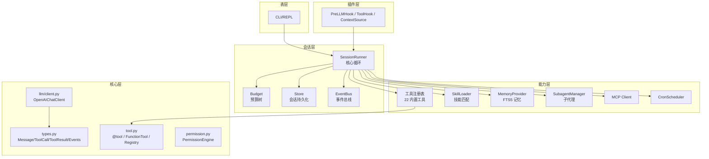
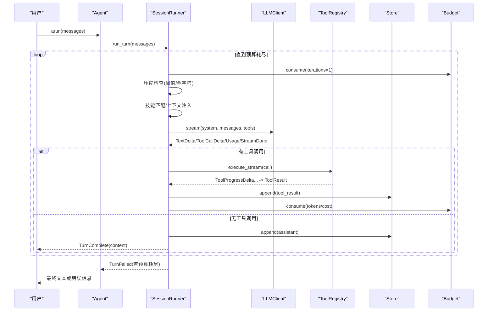
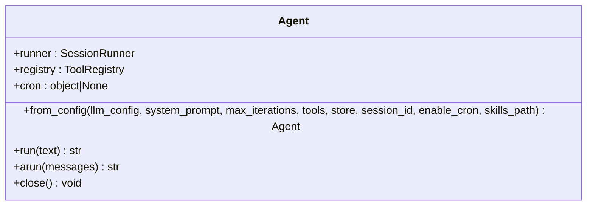
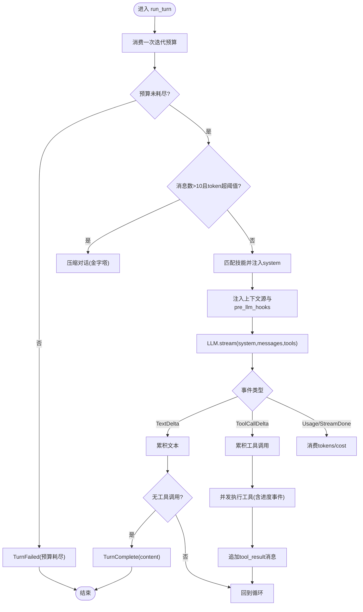
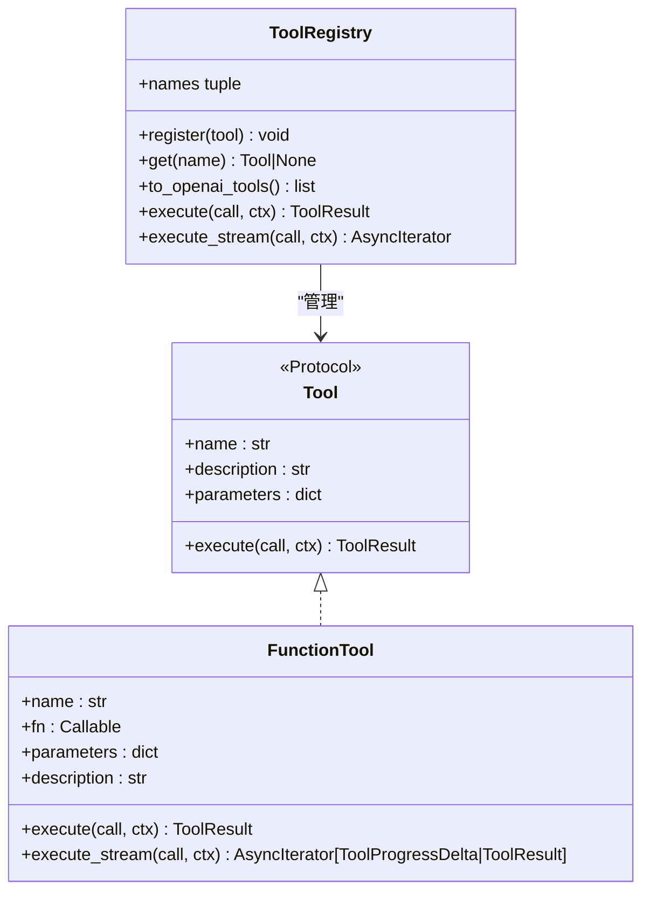
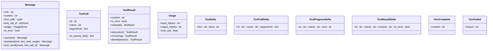
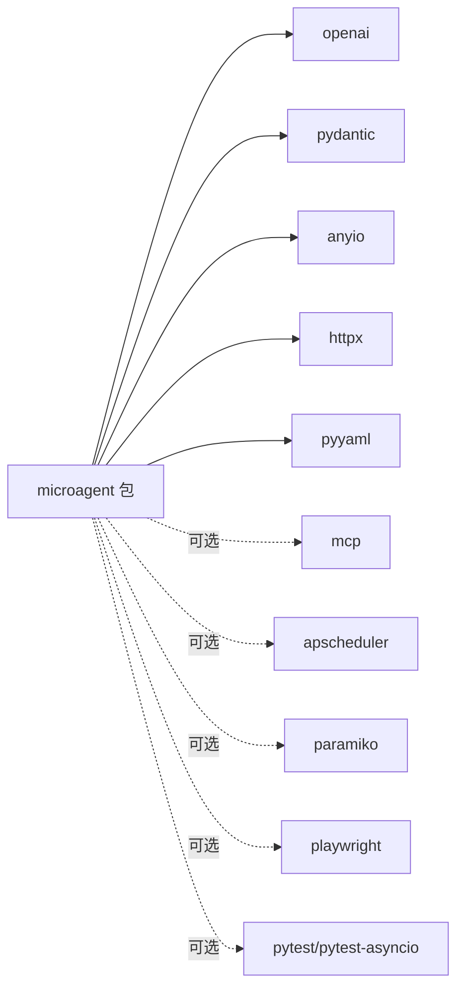

# 项目概述

<cite>
**本文引用的文件**   
- [README.md](file://README.md)
- [pyproject.toml](file://pyproject.toml)
- [src/microagent/__init__.py](file://src/microagent/__init__.py)
- [src/microagent/agent.py](file://src/microagent/agent.py)
- [src/microagent/config.py](file://src/microagent/config.py)
- [src/microagent/session/runner.py](file://src/microagent/session/runner.py)
- [src/microagent/core/tool.py](file://src/microagent/core/tool.py)
- [src/microagent/core/types.py](file://src/microagent/core/types.py)
- [AGENTS.md](file://AGENTS.md)
- [tests/unit/test_runner.py](file://tests/unit/test_runner.py)
</cite>

## 目录
1. [简介](#简介)
2. [项目结构](#项目结构)
3. [核心组件](#核心组件)
4. [架构总览](#架构总览)
5. [详细组件分析](#详细组件分析)
6. [依赖关系分析](#依赖关系分析)
7. [性能考量](#性能考量)
8. [故障排查指南](#故障排查指南)
9. [结论](#结论)
10. [附录：快速开始与示例](#附录快速开始与示例)

## 简介
MicroAgent 是一个可嵌入的通用 AI Agent 核心库，定位为“窄腰+厚边”的极简内核：核心代理循环不到 200 行代码，能力体现在工具与扩展点而非核心中。项目以 Python 实现，提供约 6k 行代码、22 个内置工具、62 个公共 API 符号以及 287 个单元测试，强调高内聚、低耦合与可扩展性。它通过 OpenAI 兼容接口对接任意 LLM，并以 Pydantic v2、AnyIO 等现代异步生态构建稳定高效的运行时。

- 核心价值主张
  - 可嵌入：作为库被其他应用集成，不附带 GUI/网关等重产物
  - 极简内核：核心循环短小精悍，便于理解与维护
  - 强扩展：工具、权限、记忆、技能、子代理、MCP、Cron 等均通过协议与插件机制接入
  - 高可靠性：预算树、压缩金字塔、会话持久化、事件总线等保障运行稳定性与可观测性
  - 完备测试：287 个单元测试覆盖关键路径与边界条件

- 技术栈概览
  - Python 3.14+
  - OpenAI SDK（兼容 /v1/chat/completions）
  - Pydantic v2（参数与 JSON Schema 推断）
  - AnyIO（并发与任务组）
  - httpx、PyYAML 等

**章节来源**
- [README.md:1-12](file://README.md#L1-L12)
- [pyproject.toml:1-31](file://pyproject.toml#L1-L31)

## 项目结构
MicroAgent 采用分层模块化组织，核心层薄而稳定，周边能力以工具与插件形式扩展。

**图表来源**
- [src/microagent/session/runner.py:1-120](file://src/microagent/session/runner.py#L1-L120)
- [src/microagent/core/tool.py:1-120](file://src/microagent/core/tool.py#L1-L120)
- [src/microagent/core/types.py:1-80](file://src/microagent/core/types.py#L1-L80)
- [AGENTS.md:16-59](file://AGENTS.md#L16-L59)

**章节来源**
- [AGENTS.md:16-59](file://AGENTS.md#L16-L59)
- [README.md:349-382](file://README.md#L349-L382)

## 核心组件
- Agent：面向用户的统一门面，封装配置、工具注册、会话运行器与可选 Cron，暴露 run/arun 接口
- SessionRunner：核心对话循环，驱动 LLM 流式调用、工具执行、消息累积、预算消耗、压缩与记忆提取
- ToolRegistry 与 @tool：工具协议与自动发现，支持流式输出与 Pydantic 参数推断
- 类型系统：Message、ToolCall、ToolResult、Usage、各类 Delta 事件，构成跨模块通信契约
- Config：多源配置解析（CLI > 环境变量 > 配置文件 > 默认值）
- 存储与事件：Store（SQLite WAL/内存）、EventBus（零开销事件总线）
- 预算树：Budget（父子继承、共享取消事件、层级统计）
- 记忆与技能：MemoryProvider（FTS5）、SkillLoader（Claude 格式 + 组合加载）
- 子代理与 MCP/Cron：任务委派、外部工具协议、定时任务

**章节来源**
- [src/microagent/agent.py:1-113](file://src/microagent/agent.py#L1-L113)
- [src/microagent/session/runner.py:1-120](file://src/microagent/session/runner.py#L1-L120)
- [src/microagent/core/tool.py:1-120](file://src/microagent/core/tool.py#L1-L120)
- [src/microagent/core/types.py:1-80](file://src/microagent/core/types.py#L1-L80)
- [src/microagent/config.py:1-40](file://src/microagent/config.py#L1-L40)

## 架构总览
MicroAgent 遵循「窄腰+厚边」设计：核心仅负责“LLM → 工具 → LLM → 文本响应”的最小闭环，所有能力通过协议与插件接入。

**图表来源**
- [src/microagent/session/runner.py:118-284](file://src/microagent/session/runner.py#L118-L284)
- [src/microagent/core/tool.py:256-280](file://src/microagent/core/tool.py#L256-L280)
- [src/microagent/core/types.py:118-189](file://src/microagent/core/types.py#L118-L189)

**章节来源**
- [AGENTS.md:61-82](file://AGENTS.md#L61-L82)
- [src/microagent/session/runner.py:118-284](file://src/microagent/session/runner.py#L118-L284)

## 详细组件分析

### Agent 门面
- 职责：从配置组装 LLM、工具注册表、预算、会话运行器；可选启用 Cron；提供同步/异步入口
- 关键点：from_config 内部构造 OpenAIChatClient、Budget.root、SessionRunner；run 包装为 asyncio.run；arun 迭代事件并返回最终文本

**图表来源**
- [src/microagent/agent.py:24-113](file://src/microagent/agent.py#L24-L113)

**章节来源**
- [src/microagent/agent.py:1-113](file://src/microagent/agent.py#L1-L113)

### SessionRunner 核心循环
- 职责：驱动 LLM 流式调用、处理工具调用、管理预算、压缩、记忆提取、事件发布
- 关键点：
  - 预算消耗与超限保护
  - 压缩金字塔（微压缩、Snip、LLM 摘要、熔断）
  - 技能匹配与上下文注入
  - 工具并行执行与进度事件
  - 会话持久化与恢复

**图表来源**
- [src/microagent/session/runner.py:118-284](file://src/microagent/session/runner.py#L118-L284)

**章节来源**
- [src/microagent/session/runner.py:1-120](file://src/microagent/session/runner.py#L1-L120)
- [AGENTS.md:61-82](file://AGENTS.md#L61-L82)

### 工具系统与 @tool 装饰器
- 职责：定义工具协议、自动参数 Schema 推断、注册与执行、流式支持
- 关键点：
  - Tool Protocol（name/description/parameters/execute）
  - FunctionTool 适配 async 函数与 AsyncIterator[str] 流式
  - @tool 装饰器基于 Pydantic v2 生成 JSON Schema
  - ToolRegistry 统一管理、导出 OpenAI tools 格式、并发执行

**图表来源**
- [src/microagent/core/tool.py:40-120](file://src/microagent/core/tool.py#L40-L120)
- [src/microagent/core/tool.py:221-280](file://src/microagent/core/tool.py#L221-L280)

**章节来源**
- [src/microagent/core/tool.py:1-120](file://src/microagent/core/tool.py#L1-L120)
- [src/microagent/core/tool.py:221-309](file://src/microagent/core/tool.py#L221-L309)

### 类型与事件
- Message：统一 user/assistant/tool 角色，携带 tool_calls、usage、is_error
- ToolCall/ToolResult：工具调用与结果
- Usage：token 与成本统计
- 事件：TextDelta、ToolCallDelta、ToolProgressDelta、ToolResultDelta、TurnComplete、TurnFailed

**图表来源**
- [src/microagent/core/types.py:17-189](file://src/microagent/core/types.py#L17-L189)

**章节来源**
- [src/microagent/core/types.py:1-189](file://src/microagent/core/types.py#L1-L189)

### 配置与公开 API
- Config：从文件、环境变量、CLI 参数解析，优先级明确
- __init__.py：暴露 ~62 个公共符号，涵盖 Agent、类型、工具、权限、存储、事件、LLM、技能、记忆、子代理、终端、MCP、Cron、会话等

**章节来源**
- [src/microagent/config.py:1-101](file://src/microagent/config.py#L1-L101)
- [src/microagent/__init__.py:1-133](file://src/microagent/__init__.py#L1-L133)

## 依赖关系分析
- 核心依赖
  - openai：LLM 客户端与流式接口
  - pydantic：参数校验与 JSON Schema 生成
  - anyio：并发任务组与异步 I/O
  - httpx：HTTP 请求（如 web_fetch）
  - pyyaml：配置文件读取
- 可选依赖
  - mcp：MCP 客户端
  - cron：APScheduler 定时任务
  - ssh：paramiko SSH 终端后端
  - browser：Playwright 浏览器自动化
  - dev：pytest 与 pytest-asyncio

**图表来源**
- [pyproject.toml:25-55](file://pyproject.toml#L25-L55)

**章节来源**
- [pyproject.toml:25-55](file://pyproject.toml#L25-L55)

## 性能考量
- 流式处理：LLM 与工具均支持流式输出，降低首字节延迟，提升交互体验
- 压缩金字塔：四层策略减少上下文膨胀，避免频繁 API 调用
- 预算树：父子预算与共享取消事件，防止无限循环与资源泄漏
- 缓存：系统提示与工具 Schema 缓存，避免重复计算
- 并发：工具调用使用 TaskGroup 并发执行，提高吞吐
- 存储：SQLite WAL 模式保证写入性能与一致性

[本节为通用指导，无需特定文件引用]

## 故障排查指南
- 预算耗尽
  - 现象：TurnFailed 包含“budget exhausted”
  - 排查：检查 max_iterations/tokens/cost_usd 设置，确认工具是否陷入循环
- 工具执行失败
  - 现象：ToolResult.error 或 TurnFailed
  - 排查：查看工具钩子 before/after 是否拦截；确认参数 Schema 与输入
- 压缩失败
  - 现象：压缩阶段抛出异常或触发熔断
  - 排查：检查 CompactionState 连续失败计数与冷却时间
- 会话恢复
  - 现象：历史消息缺失或状态不一致
  - 排查：确认 Store.append/checkpoint 调用顺序与 session_id

**章节来源**
- [src/microagent/session/runner.py:118-284](file://src/microagent/session/runner.py#L118-L284)
- [tests/unit/test_runner.py:131-149](file://tests/unit/test_runner.py#L131-L149)

## 结论
MicroAgent 以极简内核承载强大能力，通过「窄腰+厚边」的设计将复杂性外移至工具与扩展点。其清晰的类型契约、流式处理、预算控制、压缩策略与插件体系，使其成为构建可嵌入、可扩展、高可靠 AI Agent 的理想基础库。配合完善的测试与文档，开发者可以快速上手并深度定制。

[本节为总结性内容，无需特定文件引用]

## 附录：快速开始与示例
- 安装
  - pip install microagent
- 第一个 Agent
  - 使用 Agent.from_config(LLMConfig(...)) 创建实例
  - 调用 arun("你的问题") 获取文本响应
  - 支持任意 OpenAI 兼容端点（vLLM、Ollama、OpenRouter 等）
- CLI 使用
  - 设置环境变量 MICROAGENT_BASE_URL/MICROAGENT_API_KEY/MICROAGENT_MODEL
  - 直接运行 microagent "问题" 或进入交互式 REPL

**章节来源**
- [README.md:14-58](file://README.md#L14-L58)
- [README.md:62-90](file://README.md#L62-L90)